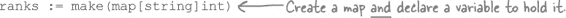
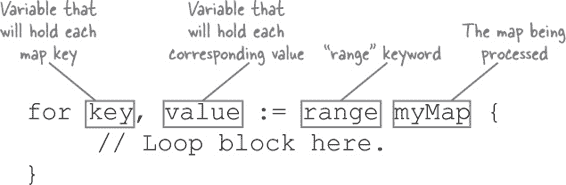

# 第七章 标记数据：Maps

**将东西随意堆放是可以的，直到你需要再次找到某样东西。** 你已经学会了如何使用 *数组* 和 *切片* 创建值的列表。你也学会了如何对数组或切片中的 *每个值* 应用相同的操作。但是如果你需要处理 *特定的* 值呢？为了找到它，你必须从数组或切片的开头开始，*查找每一个单独的值*。

如果有一种集合，每个值都带有标签，那该多好啊？你可以快速找到你需要的值！在这一章中，我们将介绍 **maps**，它们正是做这件事的。

# 统计选票

今年，Sleepy Creek 县学校董事会的一个席位空缺，民意调查显示选举结果非常接近。现在已经是选举之夜，候选人们正兴奋地观看选票的涌入。

###### 注：

这是另一个在《Head First Ruby》中首次亮相的例子，出现在哈希章节。Ruby 的哈希与 Go 的 maps 非常相似，所以这个例子在这里也非常适用！

**姓名：安伯·格雷厄姆**

职业：经理**

**姓名：布莱恩·马丁**

职业：会计**

投票中有两位候选人，安伯·格雷厄姆和布莱恩·马丁。选民还可以选择“写入”候选人的名字（即输入一个未出现在选票上的名字）。这些情况不会像主要候选人那样常见，但我们预计会有一些这样的名字出现。

今年使用的电子投票机会将选票记录到文本文件中，每行一票。（由于预算紧张，市议会选择了廉价的投票机供应商。）

这是一个关于 A 区所有选票的文件：

我们需要处理文件的每一行，并统计每个名字出现的总次数。得票最多的名字将成为我们的获胜者！

# 从文件中读取名字

我们的第一项工作是读取 *votes.txt* 文件的内容。前几章中的 `datafile` 包已经有一个 `GetFloats` 函数，它可以将文件的每一行读取到一个切片中，但 `GetFloats` 只能读取 `float64` 值。我们需要一个单独的函数，能够将文件行作为 `string` 值的切片返回。

所以让我们首先在 *datafile* 包目录中与 *floats.go* 文件并列创建一个 *strings.go* 文件。在那个文件中，我们将添加一个 `GetStrings` 函数。`GetStrings` 中的代码将与 `GetFloats` 中的代码非常相似（我们已经灰化了相同的代码）。但是，与将每一行转换为 `float64` 值不同的是，`GetStrings` 将直接将行添加到我们要返回的切片中，作为 `string` 值。

现在让我们创建实际计数选票的程序。我们将其命名为`count`。在您的 Go 工作空间中，进入*[src/github.com/headfirstgo](http://src/github.com/headfirstgo)*目录并创建一个名为*count*的新目录。然后在*count*目录中创建一个名为*main.go*的文件。

在编写完整程序之前，让我们确认我们的`GetStrings`函数是否正常工作。在`main`函数的顶部，我们将调用`datafile.GetStrings`，将`"votes.txt"`作为要读取的文件名传递给它。我们将把返回的字符串切片存储在名为`lines`的新变量中，将任何错误存储在名为`err`的变量中。通常情况下，如果`err`不为`nil`，我们会记录错误并退出。否则，我们将简单地调用`fmt.Println`来打印出`lines`切片的内容。

就像我们对其他程序所做的那样，您可以通过运行`go install`并提供包导入路径（在这种情况下是`datafile`）来编译此程序及其依赖的任何包。如果您使用了上述的目录结构，那么导入路径应该是`github.com/headfirstgo/count`。

这将在您的 Go 工作空间的*bin*子目录中保存一个名为*count*（或在 Windows 上为*count.exe*）的可执行文件。

就像前几章的*data.txt*文件一样，我们需要确保在运行程序时当前目录中保存了*votes.txt*文件。在您的 Go 工作空间的*bin*子目录中，保存一个具有右侧显示内容的文件。在终端中，使用`**cd**`命令切换到相同的子目录。

现在您应该能够通过键入`**./count**`（或在 Windows 上键入`**count.exe**`）来运行可执行文件。它应该将*votes.txt*的每一行读入一个字符串切片，然后将该切片打印出来。

# 用切片来进行名字计数的困难方式

从文件中读取一个名字切片并不需要学习任何新东西。但现在来面对挑战：我们如何计算每个名字出现的次数？我们将展示两种方法，首先是使用切片，然后是使用一个新的数据结构——*映射*。

对于我们的第一个解决方案，我们将创建两个切片，每个切片具有相同数量的元素，以特定的顺序。第一个切片将保存我们在文件中找到的名字，每个名字出现一次。我们可以称之为`names`。第二个切片`counts`将保存文件中每个名字出现的次数。元素`counts[0]`将保存`names[0]`的计数，`counts[1]`将保存`names[1]`的计数，依此类推。

让我们更新`count`程序，实际上计算文件中每个名字出现的次数。我们将尝试这个方案，使用一个`names`切片来保存每个唯一候选人名字，并使用一个对应的`counts`切片来跟踪每个名字出现的次数。

一如既往，我们可以使用`go install`重新编译程序。如果我们运行生成的可执行文件，它将读取*votes.txt*文件，并打印出它找到的每个名称，以及该名称出现的次数！

让我们更详细地看看它是如何工作的...

我们的`count`程序使用一个内循环嵌套*在*另一个循环中来统计名称计数。外部循环逐行将文件赋给`line`变量。

*内部*循环搜索`names`切片的每个元素，查找与文件当前行相等的名称。

假设有人在选票上增加了一个自荐候选人，导致文本文件中的一行加载了字符串`"Carlos Diaz"`。程序将逐一检查`names`的元素，以查看是否有任何元素等于`"Carlos Diaz"`。

如果没有匹配项，程序将字符串`"Carlos Diaz"`附加到`names`切片，并将`1`对应地添加到`counts`切片（因为这行代表了对`"Carlos Diaz"`的第一次投票）。

但假设下一行是字符串`"Brian Martin"`。因为该字符串已经存在于`names`切片中，程序将找到它，并在`counts`中相应的值上加`1`。

# 映射

但是将名称存储在切片中存在一个问题：对于文件的每一行，您必须搜索`names`切片中的许多（如果不是全部）值来进行比较。这在像 Sleepy Creek 县这样的小区域可能还好，但在有大量选票的大区域中，这种方法将会非常慢！

把数据放入切片就像把它堆放在一个大堆里；你可以取回特定的项，但必须搜索*所有*东西才能找到它们。

**切片**

Go 还有另一种存储数据集合的方式：*映射*。**映射**是一种通过*键*访问每个值的集合。键是从映射中轻松取回数据的一种方式，就像有整齐标签的文件夹而不是一堆乱七八糟的东西。

**映射**

而数组和切片只能使用*整数*作为索引，映射可以使用*任何*类型作为键（只要该类型的值可以使用`==`进行比较）。这包括数字、字符串等。所有值必须是相同类型，所有键必须是相同类型，但键不必与值的类型相同。

要声明一个包含映射的变量，你需要输入`map`关键字，后面跟着方括号（`[]`）包含键类型。然后，在方括号后面，提供值类型。

与切片类似，声明映射变量并不会自动创建映射；你需要调用`make`函数（与用于创建切片的相同函数）。与切片类型不同，你可以将要创建的映射类型传递给`make`（应与要分配给它的变量类型相同）。

或许你会发现仅仅使用短变量声明更容易：

分配值给映射并再次获取它们的语法看起来很像为数组或切片分配和获取值的语法。但是，数组和切片只允许使用整数作为元素索引，而你几乎可以选择任何类型来用作映射的键。`ranks`映射使用`string`键：

> **数组和切片只能使用整数索引。但你几乎可以选择任何类型来用作映射键。**

这是另一个以字符串为键和字符串为值的映射：

这是一个以整数为键和布尔值为值的映射：

# 映射字面量

与数组和切片类似，如果你事先知道要在映射中使用的键和值，可以使用**映射字面量**来创建它。映射字面量以映射类型开头（形式为`map[*KeyType*]*ValueType*`）。然后是包含你想要映射开始的键/值对的大括号。对于每个键/值对，包括键，冒号，然后是值。多个键/值对用逗号分隔。

下面是前面几个映射示例，使用映射字面量重新创建：

就像切片字面量一样，如果大括号为空，就会创建一个空的映射。

# 映射内的零值

与数组和切片类似，如果访问尚未分配的映射键，将返回一个零值。

根据值类型不同，零值实际上可能不是`0`。例如，对于值类型为`string`的映射，零值将是空字符串。

与数组和切片类似，即使你尚未显式分配给它，零值也可以确保安全地操作映射值。

# 映射变量的零值是`nil`

与切片一样，映射变量本身的零值是`nil`。如果声明了一个映射变量，但没有为它分配值，那么它的值将是`nil`。这意味着没有映射存在来添加新的键和值。如果尝试这样做，会导致恐慌：

在尝试添加键和值之前，使用`make`或映射字面量创建一个映射，并将其分配给你的映射变量。

# 如何区分零值和分配的值

虽然零值很有用，但有时很难判断给定键是否已分配了零值，或者它从未被分配过。

下面是一个程序示例，其中可能会出现此问题。这段代码错误地报告学生`"Carl"`不及格，实际上他只是没有记录任何成绩：

为了解决这类情况，访问映射键时可选择返回第二个布尔值。如果返回的值确实已分配给映射，则此值将为`true`；如果返回的值只是表示默认的零值，则为`false`。大多数 Go 开发者将此布尔值分配给名为`ok`的变量（因为名称简短好记）。

###### 注意

Go 语言的维护者们将此称为“comma ok 惯用法”。我们将在第十一章中再次见到它，用于类型断言。

如果您只想测试一个值是否存在，可以通过将其分配给`_`空白标识符来忽略值本身。

第二个返回值可用于确定您应该将从映射中获取的值视为已分配值，恰好与该类型的零值匹配，还是作为未分配值。

下面是我们代码的更新版本，测试请求的键是否确实在报告不及格之前已分配了值：

# 使用“delete”函数删除键/值对

在将值分配给键后的某个时刻，您可能希望从映射中删除它。Go 语言为此提供了内置的`delete`函数。只需将`delete`函数传递两个参数：要从中删除键的映射，以及要删除的键。该键及其对应的值将从映射中删除。

在下面的代码中，我们在两个不同的映射中分配值给键，然后再次删除它们。之后，当我们尝试访问这些键时，我们得到一个零值（对于`ranks`映射是`0`，对于`isPrime`映射是`false`）。第二个布尔值在每种情况下也都是`false`，这意味着该键不存在。

# 更新我们的投票计数程序以使用映射

现在我们对映射有了更深入的了解，让我们看看能否利用所学知识简化我们的投票计数程序。

以前，我们使用了一对切片，一个称为`names`，保存候选人的名字，另一个称为`counts`，保存每个名字的投票数。对于从文件中读取的每个名字，我们必须逐个搜索`names`切片，找到匹配项。然后，在`counts`切片的相应元素中递增该名字的投票计数。

使用映射将更加简单。我们可以用一个单独的映射（我们也称之为`counts`）替换这两个切片。我们的映射将使用候选人姓名作为键，并使用整数（用于保存该姓名的投票数）作为值。设置好后，我们只需将从文件中读取的每个候选人姓名用作映射键，并增加该键所持有的值。

这里是一些简化的代码，用于创建映射并直接递增一些候选人姓名的值：

我们之前的程序需要单独的逻辑来向两个切片添加新元素，如果找不到姓名的话...

但是我们用映射不需要这样做。如果我们访问的键不存在，我们将得到零值返回（在这种情况下实际上是`0`，因为我们的值是整数）。然后我们增加该值，得到`1`，并将其分配给映射。当我们再次遇到该姓名时，我们将得到已分配的值，然后可以像往常一样递增。

接下来，让我们尝试将我们的`counts`映射整合到实际程序中，以便它可以统计来自实际文件的投票。

坦率地说，经过所有学习映射的工作，最终的代码看起来有点平淡无奇！我们用单个映射声明替换了两个切片声明。接下来是处理来自文件的字符串的循环中的原始代码。我们用一行代码替换了原来的 11 行代码，该代码在映射中递增当前候选人姓名的计数。最后，我们用一行代码替换了打印结果的末尾循环，该行代码打印整个`counts`映射。

不过，相信我们，代码看起来只是*看似*平淡无奇。这里仍然有复杂的操作。但是映射已经为你处理了所有这些，这意味着你不需要写那么多代码！

与之前一样，你可以使用`go install`命令重新编译程序。当我们重新运行可执行文件时，将加载并处理*votes.txt*文件。我们将看到打印的`counts`映射，其中显示了文件中每个姓名遇到的次数。

# 使用`for`...`range`循环与映射

**姓名：凯文·瓦格纳

职业：选举志愿者**

是的。每行一个名字和一个投票计数的格式可能更好：

要将映射中的每个键和值格式化为单独的行，我们需要循环遍历映射中的每个条目。

我们之前用来处理数组和切片元素的相同`for`...`range`循环在映射上也适用。不过，与将整数索引分配给提供的第一个变量不同，当前映射键将被分配。

`for`...`range`循环使得遍历映射键和值变得容易。只需提供一个变量来保存每个键，另一个变量来保存相应的值，它将自动遍历映射中的每个条目。

如果只需要遍历键，可以省略保存值的变量：

如果只需要值，您可以将键分配给 `_` 空白标识符：

但是这个例子可能存在一个潜在问题…… 如果您将前面的例子保存到文件并使用`go run`运行，您会发现映射的键和值以随机顺序打印出来。如果多次运行程序，每次都会得到不同的顺序。

###### 注意

（注意：在在线 Go Playground 站点上运行的代码不适用相同规则。在那里，顺序仍然是随机的，但每次运行时会产生相同的输出。）

# `for`...`range`循环以随机顺序处理映射！

`for`...`range`循环以随机顺序处理映射的键和值，因为映射是一个*无序*的键和值的集合。当您在映射上使用`for`...`range`循环时，您无法预测将以何种顺序获取映射的内容！有时这没关系，但如果需要更一致的顺序，就需要自己编写代码来处理。

这是前一个程序的更新版本，始终按字母顺序打印姓名。它使用两个单独的`for`循环。第一个循环遍历映射中的每个键，忽略值，并将它们添加到一个字符串切片中。然后，将该切片传递给`sort`包的`Strings`函数，按字母顺序对其进行就地排序。

第二个`for`循环不是遍历映射，而是遍历排序后的姓名切片。（由于前面的代码，此切片现在包含按字母顺序排列的映射中的每个键。）它打印姓名，然后从映射中获取与该姓名匹配的值。它仍然处理映射中的每个键和值，但是从排序后的切片中获取键，而不是从映射本身获取。

如果我们保存上述代码并运行它，这次将按字母顺序打印学生姓名。无论我们运行程序多少次，这都是真实的。

如果不在乎映射数据的处理顺序，直接在映射上使用`for`...`range`循环可能适合您。但是如果顺序很重要，您可能需要考虑编写自己的代码来处理处理顺序。

# 使用`for`...`range`循环更新我们的投票计数程序

在斯利比克里克县的候选人不多，因此我们不需要按姓名排序输出。我们将使用`for`...`range`循环直接处理来自映射的键和值。

这是一个相当简单的更改；我们只需用 `for`...`range` 循环替换打印整个映射的行。我们将每个键分配给一个 `name` 变量，每个值分配给一个 `count` 变量。然后我们将调用 `Printf` 来打印当前候选人的姓名和选票数。

通过 `go install` 进行另一个编译，再运行可执行文件，我们就能看到以新格式输出的结果了。每个候选人的姓名和他们的选票数都在这里，整洁地格式化在各自的行上。

# 投票计数程序完成！

我们的投票计数程序已完成！

当我们只能使用数组和切片作为数据集合时，我们需要大量的额外代码和处理时间来查找值。但是使用了映射（map）后，这一过程变得很简单！每当你需要再次查找集合的值时，你都应该考虑使用映射！

# 代码磁铁

一个使用 `for`...`range` 循环来打印映射内容的 Go 程序被混在冰箱上。你能重建代码片段，使之成为一个能够产生给定输出的可工作程序吗？（如果程序运行时输出顺序不同也没关系。）

 答案在“代码磁铁解决方案”中。

# 你的 Go 工具箱

**这就是第七章的全部内容！你已经把地图添加到了你的工具箱里。**

# 代码磁铁解决方案

