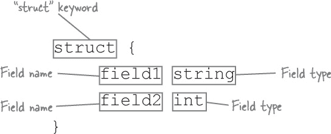
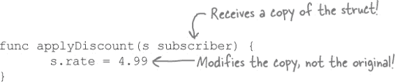
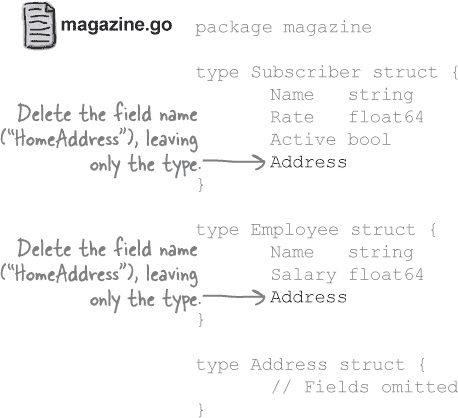
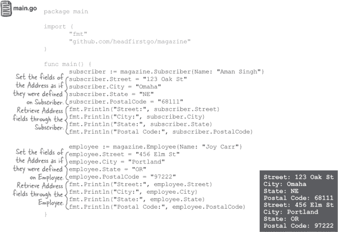

# 第八章：构建存储：结构体


**有时您需要存储多种类型的数据。**

我们学习了关于切片的知识，它们可以存储值列表。然后我们学习了关于映射的知识，它们将键列表映射到值列表。但是这两种数据结构只能保存*一种*类型的值。有时，您需要将*多种*类型的值组合在一起。例如邮寄地址，您需要将街道名称（字符串）与邮政编码（整数）混合在一起。或者学生记录，您需要将学生姓名（字符串）与平均绩点（浮点数）混合在一起。您不能在切片或映射中混合值类型。但是如果使用另一种称为**结构体**的类型，那么*可以*。我们将在本章中详细了解结构体！

# 切片和映射只能保存一种类型的值。

*Gopher Fancy*是一本专门致力于可爱啮齿动物的新杂志。他们目前正在开发一个系统来跟踪他们的订阅者群体。


**确实如此：数组、切片和映射无法帮助您混合不同类型的值。它们只能设置为保存单一类型的值。但 Go 确实有一种方法来解决这个问题……**

# 结构体由多种类型的值构成

**结构体**（简称“结构”）是由许多不同类型的其他值构成的值。虽然切片可能只能保存`string`值，或者映射可能只能保存`int`值，但是您可以创建一个结构体，其中既可以保存`string`值，也可以保存`int`值、`float64`值、`bool`值等等——所有这些都放在一个方便的组合中。


使用`struct`关键字声明结构体类型，后跟花括号。在花括号内部，您可以定义一个或多个**字段**：结构体组合在一起的值。每个字段定义都显示在单独的行上，并包含字段名，后跟该字段将保存的值类型。



您可以将结构体类型用作正在声明的变量的类型。此代码声明了一个名为`myStruct`的变量，该变量保存具有`float64`字段`number`、`string`字段`word`和`bool`字段`toggle`的结构体：

###### 注意

（通常使用定义的类型来声明结构体变量更常见，但我们将在几页后再详细讨论类型定义，所以现在我们将按照这种方式编写。）


当我们在上面使用`Printf`和`%#v`动词调用时，它将结构体`myStruct`的值打印为结构体字面量。我们稍后将介绍结构体字面量，但现在您可以看到结构体的`number`字段已设置为`0`，`word`字段为空字符串，`toggle`字段设置为`false`。每个字段都设置为其类型的零值。

# 使用点运算符访问结构体字段

现在我们可以定义一个结构体，但实际使用它时，我们需要一种方法来存储结构体字段的新值并再次检索它们。

一直以来，我们一直在使用点运算符来指示“属于”另一个包的函数，或者“属于”一个值的方法：


同样，我们可以使用点运算符来指示“属于”结构体的字段。这对于分配值和检索值都适用。


我们可以使用点运算符为`myStruct`的所有字段赋值，然后将它们打印出来：


# 将订阅者数据存储在结构体中

现在我们知道如何声明一个变量来保存结构体并为其字段赋值，我们可以创建一个用于保存杂志订阅者数据的结构体。

首先，我们将定义一个名为`subscriber`的变量。我们将给`subscriber`一个结构体类型，其中包含`name`（`string`）、`rate`（`float64`）和`active`（`bool`）字段。

声明变量及其类型后，我们可以使用点运算符访问结构体的字段。我们为每个字段分配适当类型的值，然后再次将这些值打印出来。


即使我们为订阅者存储的数据使用了各种类型，结构体也让我们能够将它们都放在一个便捷的包中！

# 定义类型和结构体


在整本书中，您已经使用了多种类型，比如`int`，`string`，`bool`，切片，映射，现在又是结构体。但是，您还没有能够创建完全*新*的类型。

**类型定义**允许您创建自己的类型。它们让您创建一个基于**基础类型**的新的**定义类型**。

虽然您可以使用任何类型作为基础类型，比如`float64`，`string`，甚至是切片或映射，但在本章中，我们将专注于使用结构类型作为基础类型。在下一章中，当我们深入研究定义类型时，我们将尝试使用其他基础类型。

要编写类型定义，请使用`type`关键字，后跟您的新定义类型的名称，然后是要基于的基础类型。如果您使用结构体类型作为基础类型，您将使用`struct`关键字，后跟花括号中的字段定义列表，就像在声明结构体变量时所做的那样。


就像变量一样，类型定义可以写在函数内部。但这将限制其范围仅在该函数的块内，意味着您不能在该函数外部使用它。因此，类型通常是在包级别的任何函数外定义的。

作为一个快速演示，下面的代码定义了两种类型：`part`和`car`。每个定义类型都使用结构体作为其基础类型。

然后，在`main`函数内部，我们声明了一个`porsche`变量，类型为`car`，以及一个`bolts`变量，类型为`part`。在声明变量时，无需重新编写冗长的结构体定义；我们只需使用定义类型的名称即可。


声明变量后，我们可以设置其结构体字段的值，并像以前的程序一样获取这些值。

# 使用定义类型处理杂志订阅者

以前，要创建多个存储杂志订阅者数据的变量，我们必须为每个变量写出完整的结构体类型（包括所有字段）。


但现在，我们可以简单地在包级别定义一个`subscriber`类型。我们只需一次编写结构体类型，作为定义类型的基础类型。当我们准备声明变量时，我们不必再次编写结构体类型；我们只需将`subscriber`用作它们的类型。不再需要重复整个结构体定义！


# 使用定义类型处理函数

定义类型不仅可以用于变量类型，还可以用于函数参数和返回值。

这里是我们的`part`类型，还有一个新的`showInfo`函数，它打印部件的字段。该函数接受一个参数，其类型为`part`。在`showInfo`中，我们像处理任何其他结构体变量一样通过参数变量访问字段。


这里有一个`minimumOrder`函数，它创建一个带有指定描述和`count`字段预定义值的`part`。我们将`minimumOrder`的返回类型声明为`part`，以便它可以返回新的结构体。


让我们来看看几个与杂志的`subscriber`类型一起使用的函数……

`printInfo`函数接受一个`subscriber`作为参数，并打印其字段的值。

我们还有一个`defaultSubscriber`函数，它用一些默认值设置一个新的`subscriber`结构体。它接受一个名为`name`的字符串参数，并使用它来设置新的`subscriber`值的`name`字段。然后它将`rate`和`active`字段设置为默认值。最后，它将完成的`subscriber`结构体返回给其调用者。


在我们的`main`函数中，我们可以将订阅者名称传递给`defaultSubscriber`以获取一个新的`subscriber`结构体。一个订阅者获得了折扣`rate`，因此我们直接重置该结构体字段。我们可以将填写好的`subscriber`结构体传递给`printInfo`以打印它们的内容。

# 代码磁铁


一个 Go 程序被分散在冰箱上。你能重组代码片段，使之成为一个能够产生指定输出的工作程序吗？最终程序将具有名为`student`的定义结构体类型，以及一个接受`student`值作为参数的`printInfo`函数。


 答案在“代码磁铁解决方案”中。

# 使用函数修改结构体


我们在*Gopher Fancy*的朋友们正试图编写一个函数，该函数接受一个结构体作为参数，并更新该结构体中的一个字段。

还记得很久以前的第三章吗？当时我们试图编写一个`double`函数，它接受一个数字并使其加倍？在`double`返回后，数字回到了原始值！

那时我们了解到，Go 语言是一种“传值”语言，这意味着函数参数接收的是调用函数时传入的参数的副本。如果函数修改参数的值，它修改的是这个*副本*，而不是*原始值*。


对结构也是如此。当我们将`subscriber`结构体传递给`applyDiscount`时，函数接收的是结构体的*副本*。因此，当我们设置结构体的`rate`字段时，我们修改的是*复制*的结构体，而不是原始结构体。



回到第三章，我们的解决方案是更新函数参数以接受值的*指针*，而不是直接接受值。在调用函数时，我们使用取地址操作符（`&`）传递要更新的值的指针。然后，在函数内部，我们使用`*`操作符来更新该指针指向的值。

所以，在函数返回后，更新后的值仍然可见。


我们可以使用指针允许函数更新结构体。

这是一个更新后的`applyDiscount`函数的版本，应该可以正常工作。我们更新`s`参数以接受指向`subscriber`结构体的指针，而不是结构体本身。然后我们更新结构体的`rate`字段的值。

在`main`函数中，我们使用指向`subscriber`结构体的指针调用`applyDiscount`。当我们打印结构体中的`rate`字段时，我们可以看到它已成功更新！


**事实上，不是这样！点符号访问字段的方法对结构指针以及结构本身都适用。**

# 通过指针访问结构字段

如果尝试打印指针变量，你会看到它指向的内存地址。这通常不是你想要的。


相反，你需要使用`*`操作符（我们喜欢称之为“值在操作符”）来获取指针指向的值。


因此，你可能认为你需要对结构体指针使用`*`操作符。但仅仅在结构体指针前加上`*`并不能起作用：


如果你写`*pointer.myField`，Go 认为`myField`必须包含一个指针。但实际上并非如此，这会导致错误。要使其工作，你需要在`*pointer`周围加上括号。这将导致检索`myStruct`值，然后可以访问结构字段。


虽然必须经常写`(*pointer).myField`会很快变得乏味。因此，点操作符允许您通过指向结构体的*指针*访问字段，就像您可以直接从结构体值访问字段一样。您可以省略括号和`*`操作符。


这对通过指针分配结构体字段同样适用：


这就是`applyDiscount`函数如何能够在不使用`*`操作符的情况下更新结构体字段的方式。


# 没有愚蠢的问题

**Q: 你之前展示了一个`defaultSubscriber`函数来设置结构体的字段，但它不需要使用任何指针！为什么不需要？**

**A:** `defaultSubscriber`函数*返回*了一个结构体值。如果调用者存储了返回的值，那么其字段中的值将会被保留。只有那些*修改现有*结构体而不返回它们的函数才需要使用指针，以便这些更改能够被保留。

但是如果我们希望的话，`defaultSubscriber`*可以*返回一个指向结构体的指针。事实上，在下一部分我们就做了这个改变！

# 通过指针传递大型结构体


**是的，会。它必须为原始结构体和副本腾出空间。**

函数接收的是调用时传入的参数的副本，即使是像结构体这样的大值。

这就是为什么，除非你的结构体只有一两个小字段，通常最好是传递一个指向结构体的*指针*，而不是结构体本身。当你传递结构体指针时，内存中只存在原始结构体的一个副本。函数只是接收到单个结构体的内存地址，并可以读取结构体，修改它，或者进行其他任何操作，而无需制作额外的副本。

下面是我们更新过的`defaultSubscriber`函数，现在返回一个指针，并且我们更新了`printInfo`函数，使其接收一个指针。像`applyDiscount`一样，这两个函数都不需要改变现有的结构体。但使用指针确保只需在内存中保留每个结构体的一个副本，同时仍然允许程序正常工作。


# 将我们的结构类型移到不同的包中


这应该很容易做到。在你的 Go 工作空间中找到*headfirstgo*目录，并在其中创建一个新目录来保存名为`magazine`的包。在*magazine*中，创建一个名为*magazine.go*的文件。


请确保在*magazine.go*文件顶部添加`package magazine`声明。接着，从你现有的代码中复制`subscriber`结构体定义，并粘贴到*magazine.go*中。


接下来，让我们创建一个程序来尝试新的包。由于我们现在只是做实验，所以暂时不要为这段代码创建一个单独的包目录；我们将使用`go run`命令来运行它。创建一个名为*main.go*的文件。你可以将它保存在任何目录中，但要确保它保存在你的 Go 工作空间之外，以免与其他包发生冲突。


###### 注意

(如果需要的话，稍后可以将此代码移动到你的 Go 工作空间，只要为其创建一个单独的包目录即可。)

在*main.go*中，保存这段代码，它简单地创建了一个新的`subscriber`结构体并访问了其中的一个字段。

与先前示例有两个不同之处。首先，我们需要在文件顶部导入`magazine`包。其次，我们需要使用`magazine.subscriber`作为类型名称，因为它现在属于另一个包。


# 定义类型的名称必须大写才能被导出

看看我们的实验性代码是否仍然可以访问其新包中的`subscriber`结构体类型。在终端中，切换到保存*main.go*的目录，然后输入`**go run main.go**`。


我们出现了一些错误，但重要的是：`cannot refer to unexported name magazine.subscriber`。

Go 类型名称遵循与变量和函数名称相同的规则：如果变量、函数或类型的名称以大写字母开头，则被视为*导出*的，可以从声明它的包外访问。但是我们的`subscriber`类型名称以小写字母开头。这意味着它只能在`magazine`包内部使用。

> **要使类型能够从其定义的包外访问，必须将其导出：其名称必须以大写字母开头。**

看起来这是一个简单的修复方法。我们只需打开我们的*magazine.go*文件，并将定义类型的名称大写化。然后，我们打开*main.go*并将对该类型的任何引用也大写化。（现在只有一个引用。）


如果我们尝试用`go run main.go`运行更新后的代码，就不再会出现`magazine.subscriber`类型未导出的错误了。所以这个问题看起来已经解决了。但是，我们却得到了一些新的错误...


# 结构体字段名必须大写才能被导出

当`Subscriber`类型名称大写时，似乎可以从`main`包中访问它。但是现在我们得到一个错误，说我们不能引用`rate`字段，因为它是未导出的。


即使一个结构体类型从一个包中导出，如果它们的字段名称不以大写字母开头，它们将会是*未导出*的。让我们尝试在*magazine.go*和*main.go*中将`Rate`大写化...

> **如果想要从其包中导出结构体字段名称也必须大写。**


再次运行*main.go*，你会发现这次一切都正常工作了。现在它们已经被导出，我们可以从`main`包中访问`Subscriber`类型以及其`Rate`字段。


注意尽管`name`和`active`字段仍未导出，代码仍然有效。如果需要的话，你可以在单个结构类型中混合使用导出和未导出的字段。

在`Subscriber`类型的情况下可能不明智。能够从其他包中访问订阅率，但不能访问名称或地址是没有意义的。因此，让我们返回*magazine.go*并将其他字段也导出。只需将它们的名称大写：`Name`和`Active`。


# 结构体字面量

定义一个结构体并逐个为其字段赋值的代码可能有些繁琐：

```go
var subscriber magazine.Subscriber
subscriber.Name = "Aman Singh"
subscriber.Rate = 4.99
subscriber.Active = true
```

因此，与切片和映射一样，Go 语言提供了**结构体字面量**，让你可以创建一个结构体并同时设置其字段。

语法看起来类似于映射字面量。首先列出类型，然后是花括号。在花括号内，你可以为一些或所有的结构字段指定值，使用字段名、冒号，然后是值。如果指定多个字段，用逗号分隔。


在上面，我们展示了一些创建`Subscriber`结构体并逐个设置其字段的代码。这段代码使用结构体字面量在一行中完成相同的操作：


你可能已经注意到，在大部分章节中，我们不得不对结构体变量使用长形式声明（除非结构体是从函数中返回的）。结构体字面量允许我们对刚刚创建的结构体使用短变量声明。

你可以省略一些甚至所有的字段。省略的字段将会被设置为它们类型的零值。


# 池谜题


你的**任务**是从池中取出代码片段，并将它们放入这段代码的空白行中。**不要**重复使用相同的片段，你不需要使用所有的片段。你的**目标**是创建一个能够运行并产生所示输出的程序。


**注意：每个池中的片段只能使用一次！**

 答案见“Pool Puzzle Solution”。

# 创建一个 Employee 结构类型


添加一个`Employee`结构类型应该很简单。我们只需将其添加到`magazine`包中，与`Subscriber`类型并列。在*magazine.go*中，定义一个新的`Employee`类型，其基础类型为`struct`。为该结构类型添加一个`Name`字段，类型为`string`，并添加一个`Salary`字段，类型为`float64`。确保将类型名和所有字段都大写，以便从`magazine`包中导出它们。

我们可以更新*main.go*中的`main`函数以尝试新类型。首先，声明一个类型为`magazine.Employee`的变量。然后为每个字段分配适当类型的值。最后，打印这些值。


如果你从终端执行`go run main.go`，它应该运行，创建一个新的`magazine.Employee`结构体，设置其字段值，然后打印这些值。

# 创建一个 Address 结构体类型

接下来，我们需要为`Subscriber`和`Employee`类型跟踪邮寄地址。我们将需要街道地址、城市、州和邮政编码（邮政编码）的字段。

我们*可以*向`Subscriber`和`Employee`类型分别添加单独的字段，如下所示：


但无论属于哪种类型，邮寄地址的格式都是相同的。重复多个类型之间所有这些字段是很麻烦的。

结构字段可以容纳任何类型的值，*包括其他结构体*。因此，我们试试构建一个`Address`结构体类型，然后在`Subscriber`和`Employee`类型上添加一个`Address`字段。这样现在会为我们节省一些工作量，并且如果需要更改地址格式，稍后可以确保类型之间的一致性。

首先我们将创建`Address`类型，以确保其正常工作。将其放置在`magazine`包中，与`Subscriber`和`Employee`类型并列。然后，用几行代码替换*main.go*中的代码，创建一个`Address`并确保其字段可访问。


在你的终端中键入`**go run main.go**`，它应该创建一个`Address`结构体，填充其字段，然后打印整个结构体。

# 在另一种类型上添加一个结构体作为字段

现在我们确信`Address`结构体类型可以单独使用，让我们将`HomeAddress`字段添加到`Subscriber`和`Employee`类型中。

添加一个字段，该字段本身是一个结构体类型，与添加任何其他类型的字段没有区别。你为字段提供一个名称，然后是字段的类型（在本例中将是一个结构体类型）。

在`Subscriber`结构体中添加一个名为`HomeAddress`的字段。确保将字段名称大写，这样可以从`magazine`包的外部访问它。然后指定字段类型为`Address`。

同样，将`HomeAddress`字段添加到`Employee`类型中。


# 在另一个结构体内设置结构体

现在让我们看看是否可以在`Subscriber`结构体*内部*填充`Address`结构体的字段。有几种方法可以做到这一点。

第一种方法是创建一个完全独立的`Address`结构体，然后使用它来设置`Subscriber`结构体的整个`Address`字段。以下是遵循此方法更新*main.go*的代码。


在你的终端中键入`**go run main.go**`，你会看到订阅者的`HomeAddress`字段已经设置为你构建的结构体。

另一种方法是通过外部结构为内部结构的字段*赋值*。

当创建`Subscriber`结构时，其`HomeAddress`字段已经设置：它是一个`Address`结构，其中所有字段均设置为它们的零值。如果我们使用`fmt.Printf`的`"%#v"`动词打印`HomeAddress`，它将打印出结构体，就像在 Go 代码中看到的一样 — 即，作为结构体文字。我们将看到`Address`的每个字段都设置为空字符串，这是`string`类型的零值。


如果`subscriber`是包含`Subscriber`结构的变量，那么当您键入`subscriber.HomeAddress`时，即使您尚未明确设置`HomeAddress`，也将获得一个`Address`结构。

您可以利用这一事实“链”点运算符在一起，以便访问`Address`结构的字段。只需键入`**subscriber.HomeAddress**`来访问`Address`结构，然后*再*跟随另一个点运算符和您想要在该`Address`结构上访问的字段名称。


这对于给内部结构的字段赋值都适用...

```go
subscriber.HomeAddress.PostalCode = "68111"
```

...以及稍后检索这些值。

```go
fmt.Println("Postal Code:", subscriber.HomeAddress.PostalCode)
```

这里是更新的*main.go*，它使用点运算符链。首先，我们将`Subscriber`结构存储在`subscriber`变量中。这将自动在`subscriber`的`HomeAddress`字段中创建一个`Address`结构。我们为`subscriber.HomeAddress.Street`、`subscriber.HomeAddress.City`等设置值，然后再次打印这些值。

然后，我们将`Employee`结构存储在`employee`变量中，并对其`HomeAddress`结构执行相同操作。


在您的终端中输入`**go run main.go**`，程序将打印出`subscriber.HomeAddress`和`employee.HomeAddress`的完成字段。

# 匿名结构字段

尽管通过外部结构访问内部结构的字段的代码有点繁琐。每次想要访问它包含的任何字段时，都必须编写内部结构（`HomeAddress`）的字段名称。


Go 允许您定义**匿名字段**：没有自己名称的结构字段，只有类型。我们可以使用匿名字段使我们的内部结构更容易访问。

这里更新了`Subscriber`和`Employee`类型，将它们的`HomeAddress`字段转换为匿名字段。为此，我们只需删除字段名称，只留下类型。



当声明匿名字段时，您可以像使用字段类型名称一样使用它，好像它是字段的名称一样。因此，下面代码中的`subscriber.Address`和`employee.Address`仍然访问`Address`结构：


# 嵌入结构体

但匿名字段提供的不仅仅是在结构定义中省略字段名称的能力。

一个嵌入在外部结构体中的内部结构体，使用匿名字段存储，被称为**嵌入**在外部结构体中。嵌入结构体的字段被**提升**到外部结构体，这意味着你可以像访问外部结构体的字段一样访问它们。

所以现在`Address`结构类型已经嵌入到`Subscriber`和`Employee`结构类型中，你不必写出`subscriber.Address.City`来获取`City`字段；你可以直接写`subscriber.City`。你不需要写`employee.Address.State`；你可以直接写`employee.State`。

这是*main.go*的最后一个版本，更新为将`Address`作为嵌入类型处理。你可以将代码编写得好像根本没有`Address`类型；就像`Address`字段属于它们所嵌入的结构体类型一样。



请记住，你并不*必须*嵌入内部结构体。你根本不需要使用内部结构体。有时，在外部结构体上添加新字段会导致最清晰的代码。考虑你当前的情况，并选择最适合你和你的用户的解决方案。

# 我们的定义类型已经完成了！


做得好！你已经定义了`Subscriber`和`Employee`结构类型，并在每个结构中嵌入了一个`Address`结构。你找到了一种方式来表示杂志所需的所有数据！

虽然你在定义类型时仍然缺少一个重要的方面。在之前的章节中，你使用了像`time.Time`和`strings.Replacer`这样的类型，它们有*方法*：你可以在它们的值上调用的函数。但是你还没有学会如何为自己的类型定义方法。不用担心；我们将在下一章节详细学习！

# 你的 Go 工具箱


**这就是第八章的全部内容！你已经为你的工具箱添加了结构体和定义类型。**


# 代码磁铁解决方案


# 池谜题解决方案


