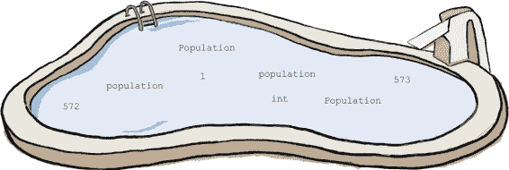
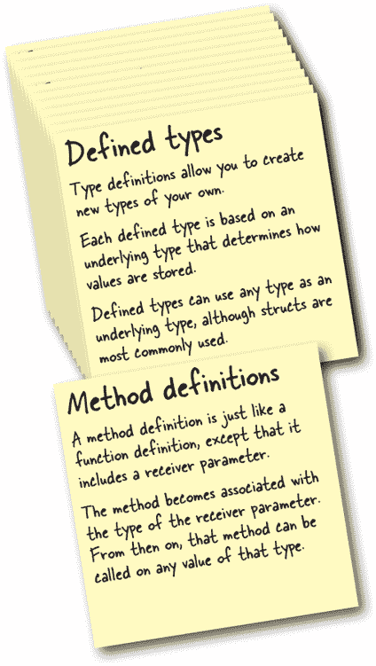

# 第九章：你是我的类型：定义类型


**还有更多关于定义类型的知识需要学习。** 在前一章中，我们向您展示了如何定义一个以结构体为基础类型的类型。但我们*没有*向您展示您可以使用*任何*类型作为基础类型。

你还记得方法——那种与特定类型的值相关联的特殊函数吗？我们在整本书中一直在对各种值调用方法，但我们还没有向你展示如何定义*自己的*方法。在本章中，我们将解决这一切。让我们开始吧！

# 现实生活中的类型错误

如果你住在美国，你可能习惯了那里使用的古怪计量系统。例如，在加油站，燃料是按加仑出售的，这是大部分世界其余地区使用的升的近四倍体积单位。

Steve 是一个美国人，在另一个国家租车。他驶入加油站加油。他打算购买 10 加仑，以为这将足够到达另一个城市的酒店。


他重新上路，但在到达目的地的四分之一路程后燃料用尽。

如果 Steve 仔细看了加油站泵上的标签，他会意识到它是用升来测量燃料，而不是加仑，他需要购买 37.85 升才能相当于 10 加仑。


**10 加仑**

当你有一个数字时，最好确定这个数字测量的是什么。你想知道它是升还是加仑，千克还是磅，美元还是日元。


**10 升**

# 以基础基本类型定义的类型

如果你有以下变量：

```go
var fuel float64 = 10
```

...那表示 10 加仑还是 10 升？写下这个声明的人知道，但其他人不知道，不确定。

你可以使用 Go 的定义类型来明确值的用途。虽然定义类型最常使用结构体作为其基础类型，但它们*可以*基于`int`、`float64`、`string`、`bool`或任何其他类型。

> **Go 定义类型最常使用结构体作为其基础类型，但也可以基于 int、string、boolean 或任何其他类型。**

这是一个定义了两种新类型`Liters`和`Gallons`的程序，它们都有一个基础类型为`float64`。它们在包级别定义，因此它们在当前包的任何函数中都可以使用。

在`main`函数中，我们声明了一个类型为`Gallons`的变量，另一个为`Liters`的变量。我们为每个变量赋值，然后将它们打印出来。


一旦你定义了一个类型，你就可以对该类型的任何基础类型的值进行转换。与其他任何转换一样，你需要在想要转换的类型后面写上要转换的值，用括号括起来。

如果我们愿意，我们可以在上述代码中使用类型转换写出简短的变量声明：


如果你有一个使用定义类型的变量，你*不能*将不同定义类型的值赋给它，即使另一种类型具有相同的基础类型。这有助于防止开发人员混淆这两种类型。


但是你可以*转换*具有相同基础类型的类型。因此，`Liters`可以转换为`Gallons`，反之亦然，因为两者的基础类型都是`float64`。但是在进行转换时，Go 语言只考虑基础类型的值；`Gallons(Liters(240.0))`和`Gallons(240.0)`之间没有区别。简单地从一种类型转换为另一种类型的原始值，会破坏类型应提供的转换错误保护。


相反，你应该执行必要的操作，以将基础类型的值转换为适合转换为的类型的值。

快速的网络搜索显示，1 升大约等于 0.264 加仑，1 加仑大约等于 3.785 升。我们可以通过这些换算率相乘来从`Gallons`转换为`Liters`，反之亦然。


# 定义类型和运算符

定义类型支持与其基础类型相同的所有操作。例如，基于`float64`的类型支持诸如`+`、`-`、`*`和`/`的算术运算符，以及`==`、`>`和`<`等比较运算符。


基于`string`的类型将支持`+`、`==`、`>`和`<`等操作，但不支持`-`，因为`-`不是字符串的有效运算符。


定义类型可以与字面值一起使用：


但是定义的类型*不能*与不同类型的值一起使用，即使另一种类型具有相同的基础类型。这样做是为了防止开发人员意外混合这两种类型。


如果要将`Liters`中的值添加到`Gallons`中的值，你需要首先将一种类型转换以匹配另一种类型。

# 池子谜题


你的**任务**是从池中提取代码片段，并将它们放入此代码中的空白行。**不要**重复使用相同的片段，而且你不需要使用所有的片段。你的**目标**是编写一个能运行并产生所示输出的程序。



**注意：池中的每个片段只能使用一次！**

 答案在“池子谜题解答”中。

# 使用函数进行类型转换

假设我们想要拿一辆以`Gallons`为单位测量燃料的汽车，在`Liters`单位的加油站加油。或者拿一辆以`Liters`为单位测量燃料的公共汽车，在`Gallons`单位的加油站加油。为了防止不准确的测量，Go 语言会在我们尝试组合不同类型的值时给出编译错误：


为了处理不同类型的值，我们需要首先进行类型转换以匹配。之前，我们演示了将`Liters`值乘以 0.264，并将结果转换为`Gallons`。我们还将`Gallons`值乘以 3.785，并将结果转换为`Liters`。


我们可以创建`ToGallons`和`ToLiters`函数来执行相同的操作，然后调用它们来进行转换：

汽油不是我们需要测量体积的唯一液体。还有食用油、汽水瓶和果汁等。因此，除了升和加仑之外，还有许多体积单位。在美国有茶匙、杯子、夸脱等等。度量衡系统也有其他单位，但毫升（升的 1/1000）是最常用的单位。

让我们添加一个新类型，`Milliliters`。像其他类型一样，它将使用`float64`作为基础类型。


我们还需要一种方法来将`Milliliters`转换为其他类型。但是，如果我们开始添加一个从`Milliliters`到`Gallons`的转换函数，我们会遇到一个问题：我们不能在同一个包中拥有两个`ToGallons`函数！


我们可以将这两个`ToGallons`函数重命名为包含它们所转换的类型的函数：`LitersToGallons`和`MillilitersToGallons`。但是每次写出这些名称都很麻烦，而且随着我们开始添加其他类型之间的转换函数，很明显这是不可持续的。


# 没有愚蠢的问题

**Q: 我看过其他支持函数*重载*的语言：它们允许您拥有多个函数具有相同的名称，只要它们的参数类型不同。Go 语言不支持这种功能吗？**

**A:** Go 语言的维护者们也经常遇到这个问题，并在*[`golang.org/doc/faq#overloading`](https://golang.org/doc/faq#overloading)*上回答：“通过其他语言的经验，我们知道具有相同名称但不同签名的多种方法有时很有用，但在实践中可能会令人困惑和脆弱。” Go 语言通过*不*支持函数重载来简化语言，因此不支持它。正如您将在本书后面看到的，Go 团队在语言的其他领域也做出了类似的决策；当他们在简单性和添加更多功能之间需要做出选择时，他们通常选择简单性。但这没关系！很快我们会看到，还有其他方法可以获得相同的好处……


# 通过方法修复我们的函数名冲突

还记得在第二章中我们向你介绍的*方法*吗？它们是与给定类型的值相关联的函数？除其他外，我们创建了一个`time.Time`值并调用了它的`Year`方法，还创建了一个`strings.Replacer`值并调用了它的`Replace`方法。


我们可以定义自己的方法来帮助解决类型转换问题。

我们不能有多个名为`ToGallons`的函数，所以我们不得不编写长而冗长的函数名，其中包含我们正在转换的类型：

```go
LitersToGallons(Liters(2))
MillilitersToGallons(Milliliters(500))
```

但我们*可以*有多个名为`ToGallons`的*方法*，只要它们定义在不同的类型上。不必担心名称冲突将使我们的方法名称变得更短。

```go
Liters(2).ToGallons()
Milliliters(500).ToGallons()
```

但让我们不要过于急躁。在我们做任何其他事情之前，我们需要知道如何定义一个方法……

# 定义方法

方法定义与函数定义非常相似。事实上，它们只有一个区别：你需要在函数名之前的括号内添加一个额外的参数，即**接收者参数**。

与任何函数参数一样，你需要为方法定义中的接收者参数提供一个名称，后面跟着一个类型。


要调用你定义的方法，你需要写出你调用方法的值，加一个点，然后是你调用的方法名称，后面跟上括号。你调用方法的值称为方法的**接收者**。

在方法调用和方法定义之间的相似性可以帮助你记住语法：*调用*方法时，接收者首先列出，而*定义*方法时，接收者参数首先列出。


方法定义中接收者参数的名称并不重要，但其类型是重要的；你正在定义的方法将与该类型的所有值相关联。

下面，我们定义了一个名为`MyType`的类型，其基础类型为`string`。然后，我们定义了一个名为`sayHi`的方法。因为`sayHi`有一个类型为`MyType`的接收者参数，我们将能够在任何`MyType`值上调用`sayHi`方法。（大多数开发人员会说`sayHi`是在`MyType`上定义的。）


一旦在类型上定义了方法，就可以在该类型的任何值上调用它。

在这里，我们创建两个不同的`MyType`值，并在每个值上调用`sayHi`。

# 接收者参数（基本上）只是另一个参数

接收者参数的类型是该方法关联的类型。但除此之外，接收者参数在 Go 中并没有特殊待遇。你可以像处理任何其他函数参数一样，在方法块内部访问其内容。

下面的代码示例与前一个几乎相同，只是我们更新了它以打印接收者参数的值。你可以在输出结果中看到这些接收者。


Go 允许你随意命名接收者参数，但如果你为一个类型定义的所有方法都使用相同名称的接收者参数，那会更易读。

按照惯例，Go 开发者通常使用由接收者类型名称的第一个字母小写组成的名称。（这就是我们将`m`作为`MyType`接收者参数名称的原因。）

> **Go 使用接收者参数而不是其他语言中看到的“self”或“this”值。**

# 没有愚蠢的问题

**Q: 我可以为*任何*类型定义新方法吗？**

**A:** 只能为与方法定义在同一包中的类型定义方法。这意味着不能在你的`hacking`包中为别人的`security`包中的类型定义方法，也不能在通用类型如`int`或`string`上定义新方法。

**Q: 但我需要能够使用自己的方法来处理别人的类型！**

**A:** 首先你应该考虑是否一个函数就足够了；函数可以接受任何你想要的类型作为参数。但如果你*确实*需要一个同时具有自己方法和其他包类型方法的值，你可以定义一个结构体类型，匿名地嵌入其他包的类型。我们将在下一章中看看这是如何工作的。

**Q: 我在其他语言中看到方法接收者在方法块中作为特殊变量命名为`self`或`this`。Go 是否也这样做？**

**A:** Go 使用接收者参数而不是`self`和`this`。主要区别在于，`self`和`this`是*隐式*设置的，而你需要*显式*声明一个接收者参数。除此之外，接收者参数的使用方式相同，Go 不需要将`self`或`this`保留为关键字！（如果你愿意，甚至可以将接收者参数命名为`this`，但不要这样做；惯例是使用接收者类型名称的首字母。）

# 方法（几乎）与函数完全一样

除了它们在接收者上被调用之外，方法与任何其他函数基本相似。

就像任何其他函数一样，你可以在方法名后的括号中定义额外的参数。这些参数变量可以在方法块中访问，连同接收者参数一起。当你调用方法时，你需要为每个参数提供一个实参。


就像任何其他函数一样，你可以为方法声明一个或多个返回值，在调用方法时返回这些值：


与任何其他函数一样，如果方法名称以大写字母开头，则认为该方法从当前包中导出，如果方法名称以小写字母开头，则认为该方法未导出。如果希望在当前包之外使用你的方法，请确保其名称以大写字母开头。


# 指针接收器参数

这里有一个可能看起来很熟悉的问题。我们定义了一个新的`Number`类型，其基础类型为`int`。我们给`Number`定义了一个`double`方法，该方法应该将其接收器的基础值乘以两倍，然后更新接收器。但从输出中我们可以看到，方法接收器实际上并没有被更新。


回到第三章，我们曾经有一个带有类似问题的`double` *函数*。那时，我们学到函数参数接收的是函数调用时的值的副本，而不是原始值，并且在函数退出时，对副本的任何更新都将丢失。为了使`double`函数工作，我们必须传递一个我们想要更新的值的*指针*，然后在函数内部更新该指针处的值。


我们已经说过，接收器参数与普通参数没有任何区别。与任何其他参数一样，接收器参数接收接收器值的*副本*。如果在方法内部对接收器进行更改，则更改的是副本，而不是原始值。

与第三章中的`double`函数类似，解决方案是更新我们的`Double`方法以使用指针作为其接收器参数。这与任何其他参数一样：我们在接收器类型前面加上`*`表示它是一个指针类型。我们还需要修改方法块，以便更新指针处的值。完成后，当我们对`Number`值调用`Double`时，应该会更新`Number`。


注意，我们*不需要*改变方法调用。当您在具有非指针类型的变量上调用需要指针接收器的方法时，Go 会自动将接收器转换为指针。对于具有指针类型的变量也是如此；如果调用需要值接收器的方法，Go 会自动获取指针处的值，并将其传递给方法。

您可以在右侧的代码中看到其工作原理。名为`method`的方法采用值接收器，但我们可以使用直接值和指针调用它，因为如果需要，Go 会自动转换。名为`pointerMethod`的方法采用指针接收器，但我们可以在直接值和指针上调用它，因为如果需要，Go 会自动转换。


顺便说一句，右侧的代码打破了一个惯例：为了一致性，您类型的所有方法可以接受值接收器，或者可以全部接受指针接收器，但应避免混合使用这两种。我们在这里只是为了演示目的而混合了这两种。

# 破坏性的事情是有教育意义的！


这里是我们的`Number`类型，再次定义了几个方法。进行以下一种更改并尝试编译代码。然后撤消您的更改并尝试下一步。看看会发生什么！

```go
package main

import "fmt"

type Number int

func (n *Number) Display() {
       fmt.Println(*n)
}
func (n *Number) Double() {
       *n *= 2
}
func main() {
       number := Number(4)
       number.Double()
       number.Display()
}
```

| 如果您这样做... | ...代码会因为... |
| --- | --- |
| 将接收器参数更改为此包中未定义的类型：`func (n *~~Number~~int) Double() { *n *= 2 }` | 您只能在当前包中声明的类型上定义新方法。在全局定义类型（如`int`）上定义方法将导致编译错误。 |
| 将`Double`的接收器参数更改为非指针类型：`func (n ~~*~~Number) Double() { ~~*~~n *= 2 }` | 接收器参数接收调用方法的值的副本。如果`Double`函数仅修改副本，则在`Double`退出时原始值将保持不变。 |
| 调用需要指针接收器的方法，但值未存储在变量中：`Number(4).Double()` | 在调用需要指针接收器的方法时，Go 可以自动将值转换为接收器的指针，*如果*它存储在变量中。如果没有，您将会收到一个错误。 |
| 将`Display`的接收器参数更改为非指针类型：`func (n ~~*~~Number) Display() { fmt.Println(~~*~~n) }` | 在做出这个更改后，代码实际上仍然会*工作*，但它打破了惯例！对于类型的方法，接收器参数可以全部是指针，或者全部是值，但最好避免混合两者。 |

# 使用方法将升和毫升转换为加仑

当我们在我们定义的体积测量类型中添加了`Milliliters`类型时，我们发现无法为`Liters`和`Milliliters`都创建`ToGallons`函数。为了解决这个问题，我们不得不创建具有较长名称的函数：

```go
func LitersToGallons(l Liters) Gallons {
       return Gallons(l * 0.264)
}
func MillilitersToGallons(m Milliliters) Gallons {
       return Gallons(m * 0.000264)
}
```

但与函数不同的是，方法名称不必唯一，只要它们定义在不同的类型上。

让我们尝试在`Liters`类型上实现一个`ToGallons`方法。代码几乎与`LitersToGallons`函数相同，但我们将`Liters`值作为接收器参数而不是普通参数。然后我们将对`Milliliters`类型执行相同操作，将`MillilitersToGallons`函数转换为`ToGallons`方法。

注意我们并未对接收器参数使用指针类型。我们没有修改接收器，并且这些值不会占用太多内存，因此参数接收副本是可以的。


在我们的`main`函数中，我们创建一个`Liters`值，然后调用其`ToGallons`方法。因为接收器的类型是`Liters`，所以调用`Liters`类型的`ToGallons`方法。同样地，在`Milliliters`值上调用`ToGallons`会导致调用`Milliliters`类型的`ToGallons`方法。

# 将加仑转换为升和毫升使用方法

当将`GallonsToLiters`和`GallonsToMilliliters`函数转换为方法时，过程类似。我们只是将`Gallons`参数移到每个接收器参数中。


# 您的 Go 工具箱


**这就是对第九章的全部内容！您已经向您的工具箱中添加了方法定义。**



# 池子难题解答


