# 第十章。保持低调：封装和嵌入


**错误是难免的。** 有时，您的程序将从用户输入、正在读取的文件或其他地方接收到无效数据。在本章中，您将学习**封装**：一种保护结构类型字段免受无效数据影响的方法。这样，您就知道您的字段数据是安全的！

我们还将向您展示如何在您的结构类型中**嵌入**其他类型。如果您的结构类型需要另一类型上已存在的方法，您无需复制和粘贴方法代码。您可以将其他类型嵌入到您的结构类型中，然后像在自己的类型上定义一样使用嵌入类型的方法！

# 创建一个`Date`结构类型

一个名为 Remind Me 的本地初创公司正在开发一个日历应用，帮助用户记住生日、周年纪念日等。


年、月和日听起来都需要被组合在一起；这些值单独来看可能不是很有用。结构类型可能对于在一个单一的捆绑中保持这些单独的值是有用的。

正如我们所见，定义的类型可以使用任何其他类型作为它们的基础类型，包括结构体。事实上，结构体类型作为我们在第八章中对定义类型的介绍。

让我们创建一个`Date`结构类型来保存我们的年、月和日值。我们将在结构中添加`Year`、`Month`和`Day`字段，每个字段的类型都是`int`。在我们的`main`函数中，我们将使用结构字面量快速测试新类型，使用`Println`暂时打印`Date`。

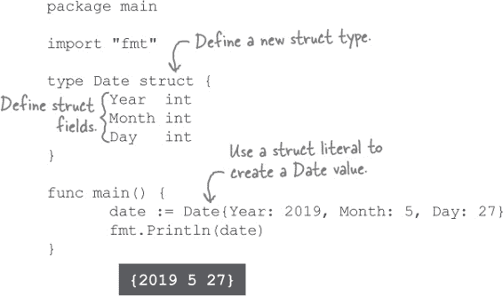

如果我们运行完成的程序，我们将看到我们的`Date`结构的`Year`、`Month`和`Day`字段。看起来一切正常！

# 人们将`Date`结构字段设置为无效值！


啊，我们可以看到可能发生的情况。只有大于等于`1`的年份是有效的，但我们没有任何东西阻止用户意外将`Year`字段设置为`0`或`-999`。只有从`1`到`12`的月份号码是有效的，但没有任何东西阻止用户将`Month`字段设置为`0`或`13`。`Day`字段只有从`1`到`31`的数字是有效的，但用户可以输入像`-2`或`50`这样的天数。

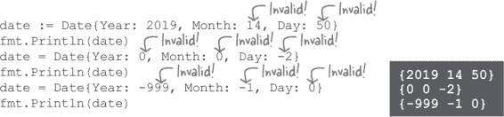

我们需要一种方法来确保用户数据在接受之前是有效的。在计算机科学中，这称为*数据验证*。我们需要测试`Year`是否被设置为大于等于`1`的值，`Month`是否在`1`到`12`之间，以及`Day`是否在`1`到`31`之间。

###### 注意

（是的，有些月份少于 31 天，但为了保持我们的代码示例长度合理，我们将仅检查它是否介于 1 和 31 之间。）

# 设置方法

结构体类型只是另一种定义的类型，这意味着你可以像任何其他类型一样在其上定义方法。我们应该能够在`Date`类型上创建`SetYear`、`SetMonth`和`SetDay`方法，它们接受一个值，检查其有效性，如果有效则设置相应的结构字段。

这种方法通常称为**设置方法**。按照惯例，Go 的设置方法通常以`Set*X*`的形式命名，其中`*X*`是你要设置的内容。

> **设置方法是用于设置定义类型底层值中字段或其他值的方法。**

这是我们第一次尝试的`SetYear`方法。接收器参数是你调用方法的`Date`结构体。`SetYear`作为参数接受你想要设置的年份，并在接收器`Date`结构体上设置`Year`字段。当前它不验证值的有效性，但稍后我们会添加验证。

在我们的`main`方法中，我们创建一个`Date`并调用其`SetYear`方法。然后我们打印结构体的`Year`字段。

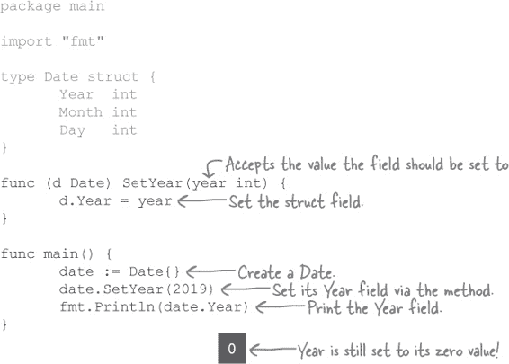

尽管我们运行程序，但会发现它并没有完全正确地工作。即使我们创建了一个`Date`并用新值调用了`SetYear`，`Year`字段仍然设置为其零值！

# 设置方法需要指针接收器。

记得我们之前展示过的`Number`类型上的`Double`方法吗？最初，我们使用普通值接收器类型`Number`编写它。但我们了解到，像任何其他参数一样，接收器参数接收到原始值的*副本*。`Double`方法在更新副本时会丢失。

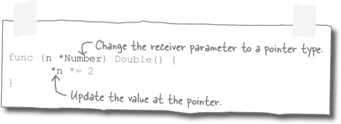

我们需要更新`Double`方法，使其接受指针接收器类型`*Number`。当我们在指针上更新值时，在`Double`退出后，更改仍然被保留。

对于`SetYear`也是如此。`Date`接收器得到原始结构的*副本*。当`SetYear`退出时，对副本字段的任何更新都将丢失！

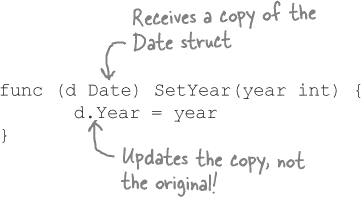

我们可以通过更新为指针接收器`(d *Date)`来修复`SetYear`。这是唯一必要的更改。我们不必更新`SetYear`方法块，因为`d.Year`会自动为我们获取指针的值（就像我们输入`(*d).Year`一样）。在`main`中调用`date.SetYear`时也无需更改，因为在传递给方法时，`Date`值会自动转换为`*Date`。

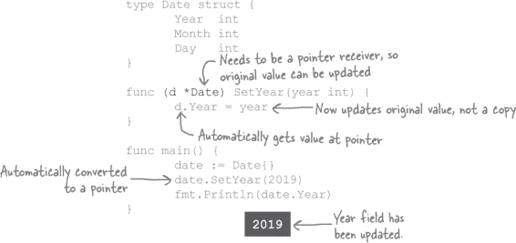

现在`SetYear`采用指针接收器，如果我们重新运行代码，我们将看到`Year`字段已经更新。

# 添加其余的设置方法。

现在应该很容易按照相同的模式定义`Date`类型上的`SetMonth`和`SetDay`方法。我们只需要确保在方法定义中使用指针接收器。当我们调用每个方法时，Go 将接收器转换为指针，并在更新其字段时将指针转换回结构值。

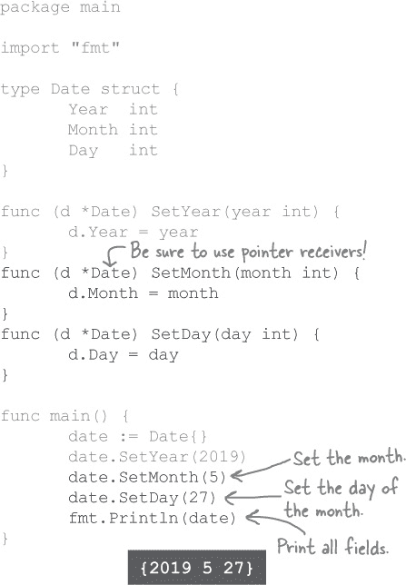

在`main`函数中，我们可以创建一个`Date`结构值；通过我们的新方法设置其`Year`、`Month`和`Day`字段；然后打印整个结构以查看结果。

现在我们为`Date`类型的每个字段都有了设置方法。但即使使用这些方法，用户仍然可能意外地将字段设置为无效值。我们接下来将看看如何防止这种情况。

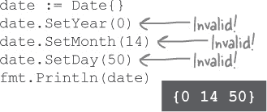

# 向设置方法添加验证

向我们的设置方法添加验证将需要一些工作，但我们在第三章中学到了一切我们需要做的事情。

在每个设置方法中，我们将测试值是否在有效范围内。如果无效，我们将返回一个`error`值。如果有效，则将`Date`结构字段设置为正常状态，并为错误值返回`nil`。

让我们首先在`SetYear`方法中添加验证。我们添加一个声明，该方法将返回一个`error`类型的值。在方法块的开头，我们测试调用者提供的`year`参数是否为小于`1`的任何数字。如果是，则返回一个带有消息`"invalid year"`的`error`。如果不是，则设置结构的`Year`字段并返回`nil`，表示没有错误。

在`main`函数中，我们调用`SetYear`并将其返回值存储在名为`err`的变量中。如果`err`不为`nil`，这意味着分配的值无效，因此我们记录错误并退出。否则，我们继续打印`Date`结构的`Year`字段。

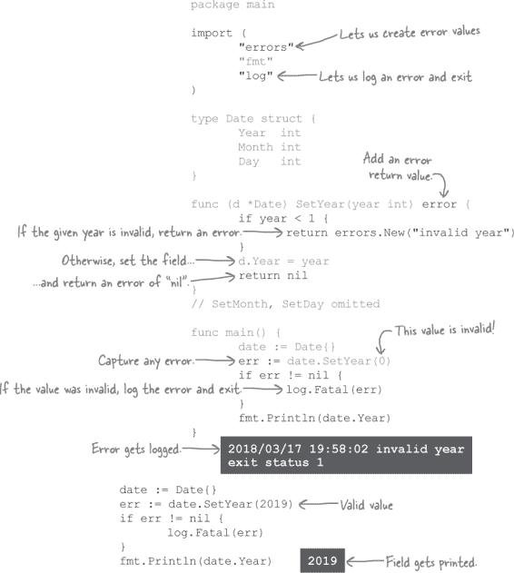

向`SetYear`传递无效值会导致程序报告错误并退出。但如果我们传递一个有效值，程序将继续打印它。看起来我们的`SetYear`方法正常工作！

`SetMonth`和`SetDay`方法中的验证代码将类似于`SetYear`中的代码。

在`SetMonth`中，我们测试提供的月份号码是否小于`1`或大于`12`，如果是则返回错误。否则，我们设置字段并返回`nil`。

在`SetDay`中，我们测试提供的日期是否小于`1`或大于`31`。无效值导致返回错误，但有效值导致字段被设置并返回`nil`。

```go
// Package, imports, type declaration omitted
func (d *Date) SetYear(year int) error {
       if year < 1 {
              return errors.New("invalid year")
       }
       d.Year = year
       return nil
}
func (d *Date) SetMonth(month int) error {
       if month < 1 || month > 12 {
              return errors.New("invalid month")
       }
       d.Month = month
       return nil
}
func (d *Date) SetDay(day int) error {
       if day < 1 || day > 31 {
              return errors.New("invalid day")
       }
       d.Day = day
       return nil
}

func main() {
       // Try the below code snippets here
}
```

您可以通过将下面的代码片段插入到`main`块中来测试设置方法...

将`14`传递给`SetMonth`会导致错误：

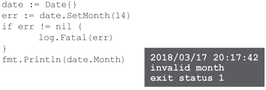

但将`5`传递给`SetMonth`可以工作：

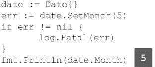

将`50`传递给`SetDay`会导致错误：

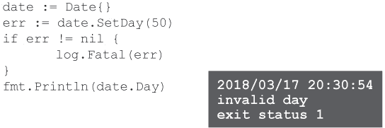

但将`27`传递给`SetDay`可以工作：

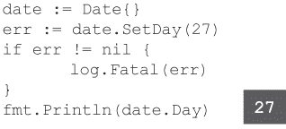

# 字段仍然可以设置为无效值！


的确，没有任何阻止任何人直接设置`Date`结构字段的东西。如果他们这样做，它将绕过设置方法中的验证代码。他们可以设置任何他们想要的值！

```go
date := Date{}
date.Year = 2019
date.Month = 14
date.Day = 50
fmt.Println(date)
```

我们需要一种方式来保护这些字段，以便我们的`Date`类型的用户只能使用设置方法更新字段。

Go 提供了一种方法来解决这个问题：我们可以将 `Date` 类型移动到另一个包中，并将其日期字段设为未导出。

到目前为止，未导出的变量、函数等大多数时候都会阻碍我们。最近的例子是在第八章中，当我们发现尽管我们的 `Subscriber` 结构类型从 `magazine` 包中导出，但其字段是*未导出*的，因此在 `magazine` 包外部无法访问。

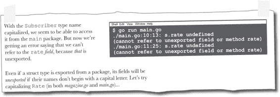

但在这种情况下，我们**不希望**字段可以访问。未导出的结构字段正是我们需要的！

让我们试着将 `Date` 类型移到另一个包中，并将其字段设为未导出，看看是否可以解决我们的问题。

# 将 `Date` 类型移动到另一个包中

在您的 Go 工作区内的 *headfirstgo* 目录中，创建一个新目录以容纳名为 `calendar` 的包。在 *calendar* 内部，创建一个名为 *date.go* 的文件。（记住，您可以将包目录中的文件命名为任何您喜欢的名称；它们将成为同一个包的一部分。）


在 *date.go* 中，添加一个 `package calendar` 声明，并导入 `"errors"` 包。（这是此文件中的代码将要使用的唯一包。）然后，将 `Date` 类型的所有旧代码复制并粘贴到这个文件中。

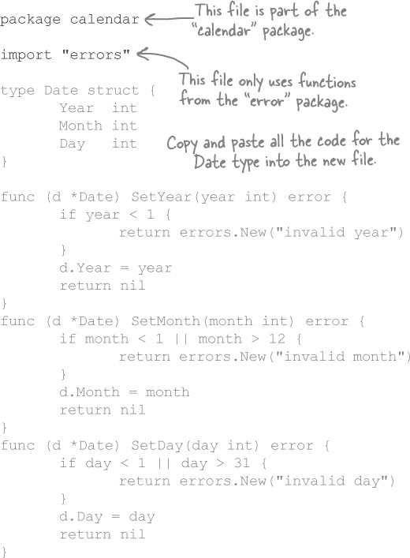

接下来，让我们创建一个程序来试试 `calendar` 包。由于这只是为了实验，我们将像在第八章中那样，在 Go 工作区之外保存一个文件，以避免与任何其他包发生干扰。（我们将只使用 `go run` 命令来运行它。）将文件命名为 *main.go*。


到目前为止，我们添加在 *main.go* 中的代码仍然可以创建一个无效的 `Date`，无论是通过直接设置其字段还是使用结构字面量。

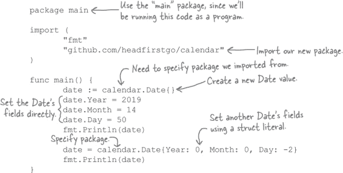

如果我们从终端运行 *main.go*，我们会看到设置字段的两种方式都起作用，并打印出两个无效的日期。


# 使 `Date` 字段变为未导出

现在让我们尝试更新 `Date` 结构，使其字段变为未导出。只需在类型定义中将字段名更改为小写字母开头，并在其他任何地方也都如此。

`Date` 类型本身需要保持导出，以及所有的设置方法，因为我们*确实*需要从 `calendar` 包外部访问这些方法。

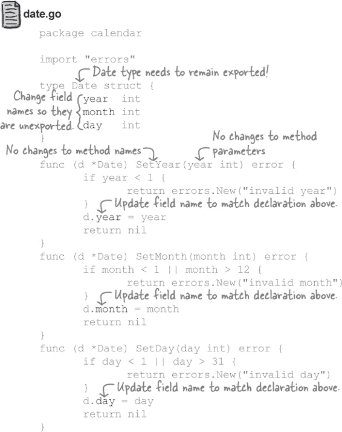

为了测试我们的更改，在 *main.go* 中更新字段名称，以匹配 *date.go* 中的字段名称。

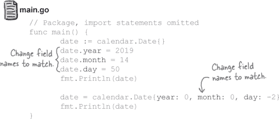

# 通过导出的方法访问未导出的字段

正如你所料，现在我们已经将 `Date` 的字段转换为未导出后，试图从 `main` 包中访问它们会导致编译错误。这在直接设置字段值时以及在结构字面量中使用它们时都是如此。

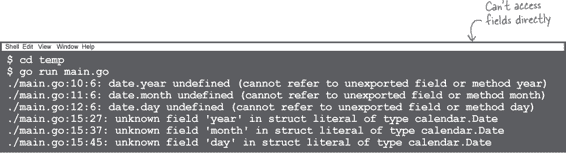

但是我们仍然可以间接访问这些字段。*未导出*的变量、结构字段、函数、方法等仍然可以被同一包内导出的函数和方法访问。因此，当 `main` 包中的代码调用 `Date` 值上的导出 `SetYear` 方法时，即使 `year` 字段是未导出的，`SetYear` 也可以更新 `Date` 的 `year` 结构字段。导出的 `SetMonth` 方法可以更新未导出的 `month` 字段，依此类推。

如果我们修改 *main.go* 以使用设置器方法，我们将能够更新 `Date` 值的字段：

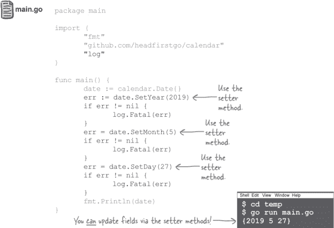

> **未导出的变量、结构字段、函数和方法仍然可以被同一包内导出的函数和方法访问。**

如果我们更新 *main.go* 以使用无效值调用 `SetYear`，则在运行时会出现错误：

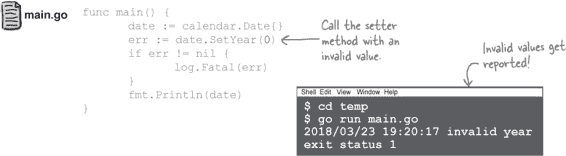

现在，`Date` 值的字段只能通过其设置器方法更新，程序可以避免意外输入无效数据。


噢，没错。我们提供了设置器方法，允许我们设置 `Date` 字段，尽管这些字段在 `calendar` 包中是未导出的。但是，我们并未提供任何获取字段值的方法。

我们可以打印整个 `Date` 结构。但是，如果尝试更新 *main.go* 以打印单个 `Date` 字段，则无法访问它！

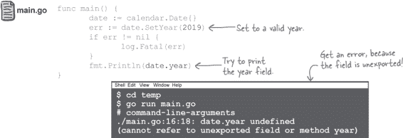

# 获取器方法

正如我们所见，其主要目的是设置结构字段或变量值的方法称为*设置器方法*。而其主要目的是获取结构字段或变量值的方法称为**获取器方法**。

与设置器方法相比，为 `Date` 类型添加获取器方法将很容易。它们在被调用时不需要执行任何操作，只需返回字段值即可。

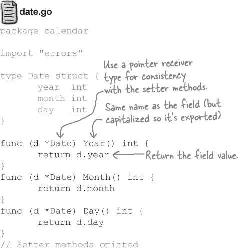

按照惯例，获取器方法的名称应与其访问的字段或变量名称相同。（当然，如果要导出该方法，其名称需要以大写字母开头。）因此，`Date` 将需要一个 `Year` 方法来访问 `year` 字段，一个 `Month` 方法来访问 `month` 字段，以及一个 `Day` 方法来访问 `day` 字段。

获取器方法根本不需要修改接收器，因此我们*可以*使用直接的 `Date` 值作为接收器。但是，如果某个类型的任何方法都使用指针接收器，按照惯例，为了保持一致性，它们*全部*都应该使用指针接收器。因此，由于我们必须为我们的设置器方法使用指针接收器，我们也为获取器方法使用指针。

完成 *date.go* 的更改后，我们可以更新 *main.go* 以设置所有 `Date` 字段，然后使用获取器方法打印它们。

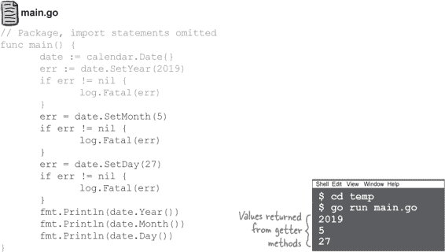

# 封装

将程序的一部分中的数据隐藏在另一部分代码中被称为**封装**，这不仅限于 Go。封装是有价值的，因为它可以用来保护免受无效数据的影响（正如我们所见）。此外，您可以更改程序的封装部分而不必担心破坏访问它的其他代码，因为不允许直接访问。

许多其他编程语言将数据封装在类中。（类是与 Go 类型类似但不完全相同的概念。）在 Go 中，数据通过未导出的变量、结构字段、函数或方法封装在包内。

封装在其他语言中比在 Go 中更频繁地使用。在某些语言中，通常为每个字段定义 getter 和 setter，即使直接访问这些字段也可以很好地工作。在 Go 中，开发者通常只在必要时依赖封装，例如当字段数据需要通过 setter 方法进行验证时。在 Go 中，如果没有看到需要封装字段的必要性，通常可以直接导出它并允许直接访问。

# 没有愚蠢的问题

**问：许多其他语言不允许在类外部访问封装值。在 Go 中，允许同一包中的其他代码访问未导出字段安全吗？**

**答：** 通常，一个包中的所有代码都是单个开发者（或一组开发者）的工作。一个包中的所有代码通常都有相似的目的。同一个包中的代码作者很可能需要访问未公开的数据，并且他们也很可能只在有效的方式下使用这些数据。因此，是的，与包中的其他代码共享未公开数据通常是安全的。

代码*在*包之外很可能是由*其他*开发者编写的，但这没关系，因为未导出字段对他们是隐藏的，所以他们无法意外地将其值更改为无效值。

**问：我看过其他语言中每个获取器方法的名称都以“`Get`”开头，比如`GetName`、`GetCity`等等。在 Go 语言中我可以这样做吗？**

**答：** Go 语言允许你这样做，但你不应该这样做。Go 社区已经决定不在 getter 方法名称中包含`Get`前缀的约定。包含此前缀只会导致其他开发者感到困惑！

就像许多其他语言一样，Go 仍然为 setter 方法使用`Set`前缀，因为这是为了区分相同字段的 getter 方法名和 setter 方法名所必需的。

# 嵌入`Event`类型中的`Date`类型


那不应该花费太多工作。还记得我们在第八章中是如何将`Address`结构类型嵌入另外两个结构类型中的吗？

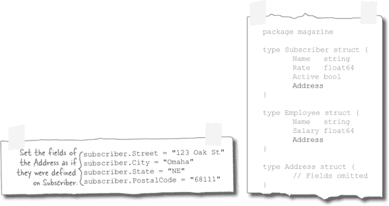

`Address`类型被视为“嵌入”，因为我们在外部结构体中使用了一个匿名字段（只有类型没有名称），这导致`Address`的字段被提升到外部结构体，从而允许我们像访问外部结构体字段一样访问内部结构体的字段。

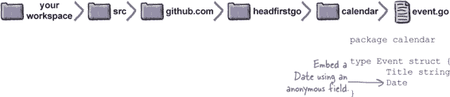

既然这种策略之前如此成功，让我们定义一个`Event`类型，其中包含一个匿名字段`Date`。

在`calendar`包文件夹中创建另一个文件，命名为*event.go*。（我们可以将其放在现有的*date.go*文件中，但这样可以更加整洁地组织。）在该文件中，定义一个`Event`类型，它有两个字段：一个类型为`string`的`Title`字段，和一个匿名的`Date`字段。

# 未导出的字段不会被提升

尽管在`Event`类型中嵌入`Date`不会导致将`Date`字段提升到`Event`，`Date`字段是未导出的，Go 语言不会将未导出字段提升到封闭类型。这是有道理的；我们确保字段被封装，因此只能通过设置器和获取器方法访问它们，并且不希望通过字段提升来规避封装。

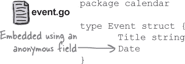

在我们的`main`包中，如果我们尝试通过其封闭的`Event`设置`Date`的`month`字段，我们会遇到错误：

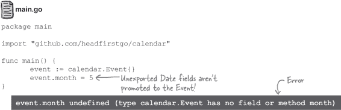

当然，使用点操作符链式检索`Date`字段然后直接访问它的字段也不起作用。当`Date`独立存在时，无法访问其未导出字段；当其作为`Event`的一部分存在时也不行。

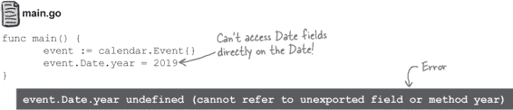

那么这是否意味着我们无法访问`Event`类型中嵌入的`Date`类型的字段？别担心；还有另一种方法！

# 导出的方法会像字段一样被提升

如果在结构类型中嵌入具有导出方法的类型，其方法将被提升到外部类型，这意味着您可以像在外部类型上定义的方法一样调用这些方法。（还记得如何在一个结构体类型中嵌入另一个导致内部结构体的字段被提升到外部结构体吗？这与字段相同，但是用方法替代了。）

这是一个定义了两种类型的包。`MyType`是一个结构类型，它作为匿名字段嵌入了第二个类型`EmbeddedType`。

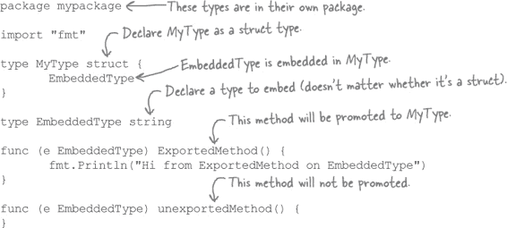

因为`EmbeddedType`定义了一个导出方法（名为`ExportedMethod`），该方法会被提升到`MyType`，并且可以在`MyType`值上调用。

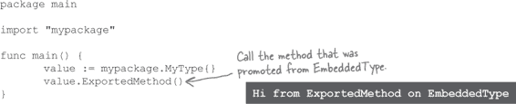

与未导出字段一样，未导出方法也不会被提升。如果尝试调用未导出方法，则会出现错误。

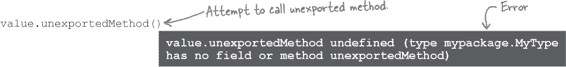

我们的`Date`字段没有被提升到`Event`类型，因为它们是未导出的。但是`Date`上的获取器和设置器方法是导出的，并且会被提升到`Event`类型！

这意味着我们可以创建一个`Event`值，然后直接在`Event`上调用`Date`的 getter 和 setter 方法。这正是我们在下面更新的*main.go*代码中所做的。如常，公开的方法可以为我们访问未导出的`Date`字段。

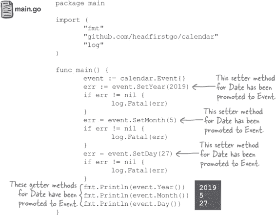

如果您更喜欢在`Date`值上直接使用点操作符链式调用方法，您也可以这样做：


# 封装事件标题字段

因为`Event`结构体的`Title`字段是公开的，我们仍然可以直接访问它：

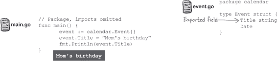

这让我们暴露于与`Date`字段相同的问题，比如，`Title`字符串没有长度限制：

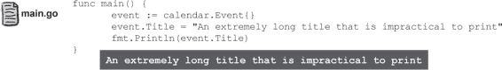

看起来将标题字段封装起来也是个好主意，这样我们就可以验证新的值。下面是更新后的`Event`类型，做了这样的操作。我们将字段的名称更改为`title`，使其未导出，然后添加了 getter 和 setter 方法。使用`unicode/utf8`包中的`RuneCountInString`函数来确保字符串中没有太多的符文（字符）。

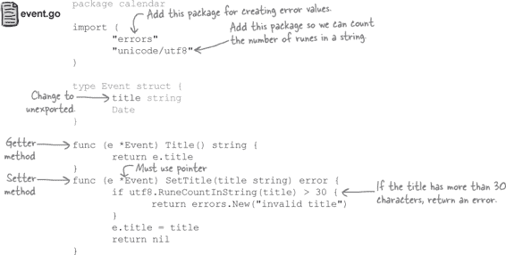

# 提升的方法与外部类型的方法并存

现在，我们为`title`字段添加了 setter 和 getter 方法，如果使用超过 30 个字符的标题，我们的程序可以报错。尝试设置一个 39 个字符的标题将导致错误返回：

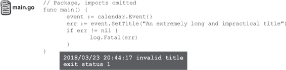

`Event`类型的`Title`和`SetTitle`方法与从嵌入的`Date`类型提升的方法并存。导入`calendar`包的用户可以将所有方法视为属于`Event`类型，而不用担心它们实际上是在哪种类型上定义的。

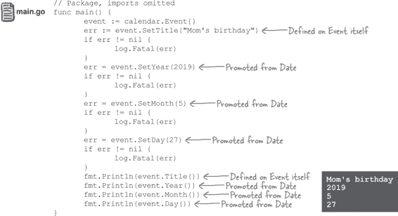

# 我们的日历包已经完善了！


方法提升允许您轻松地将一种类型的方法用作另一种类型的方法。您可以使用这个功能来组合多种其他类型的方法。这有助于保持代码的清晰性，而不会牺牲便利性！

# 您的 Go 工具箱


**到此为止，第十章就结束了！您已经将封装和嵌入添加到了您的工具箱中。**

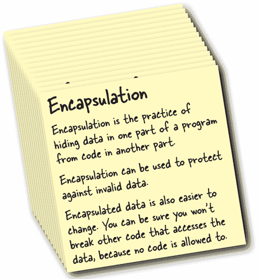

###### 注意

嵌入

被存储在结构体类型内部的类型，使用匿名字段被称为被嵌入在结构体中。

嵌入类型的方法被提升到外部类型。它们可以被调用，就好像它们是在外部类型上定义的一样。
