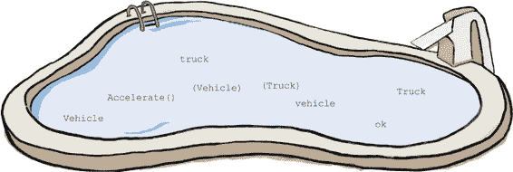
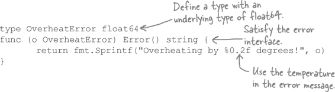
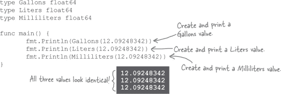

# 第十一章：你能做什么？：接口


**有时您不关心值的具体类型。** 您不关心它是*什么*。您只需知道它能*做*某些事情。您可以在其上调用*某些方法*。您不在乎是否有一个`Pen`还是一个`Pencil`，您只需要一个具有`Draw`方法的东西。您不在乎是否有一辆`Car`或一艘`Boat`，您只需要一个具有`Steer`方法的东西。

这就是 Go 语言**接口**的作用。它们允许您定义变量和函数参数，这些变量和函数参数可以持有*任何*类型，只要该类型定义了某些方法。

# 拥有相同方法的两种不同类型

还记得磁带录音机吗？（我们假设你们中有些人可能太年轻了。）它们非常棒。你可以轻松地在一盘磁带上录制所有你喜欢的歌曲，即使它们是由不同的艺术家演唱的。当然，这些录音机通常太笨重，无法随身携带。如果你想随身携带磁带，你需要一个单独的电池供电的磁带播放机。通常这种播放机没有录音功能。但是，制作自定义混音磁带并与朋友分享的感觉真是太棒了！


我们对怀旧情怀如此之深，以至于我们创建了一个`gadget`包来帮助我们怀旧。它包括一个模拟磁带录音机的类型，以及另一个模拟磁带播放机的类型。


`TapePlayer`类型具有`Play`方法来模拟播放歌曲，以及一个`Stop`方法来停止虚拟播放。


`TapeRecorder`类型还有`Play`和`Stop`方法，以及一个`Record`方法。

# 只能接受一种类型的方法参数

下面是一个使用`gadget`包的示例程序。我们定义了一个`playList`函数，它接受一个`TapePlayer`值和一个要播放的歌曲标题切片。该函数循环遍历切片中的每个标题，并将其传递给`TapePlayer`的`Play`方法。在播放完列表后，它调用`TapePlayer`的`Stop`方法。

然后，在`main`方法中，我们只需创建`TapePlayer`和歌曲标题的切片，然后将它们传递给`playList`。


`playList`函数与`TapePlayer`值配合使用效果很好。您可能希望它也能与`TapeRecorder`一起使用。（毕竟，磁带录音机基本上就是带有额外录音功能的磁带播放机。）但是`playList`的第一个参数类型是`TapePlayer`。尝试传递任何其他类型的参数，您将收到编译错误：


在这种情况下，似乎是 Go 语言的类型安全性在阻碍我们，而不是帮助我们。`playList`函数需要的所有方法都由`TapeRecorder`类型定义，但我们无法使用它，因为`playList`只接受`TapePlayer`值。

那我们能做什么？写一个第二个几乎相同的 `playListWithRecorder` 函数，它接受一个 `TapeRecorder` 吗？

实际上，Go 还提供了另一种方式...

# 接口

当你在计算机上安装一个程序时，通常期望该程序提供一种与之交互的方式。你期望一个文字处理器提供一个地方来输入文本。你期望一个备份程序提供一种选择要保存的文件的方式。你期望一个电子表格程序提供一种插入数据列和行的方式。程序提供的用于与之交互的控件集合通常称为其*接口*。

> **接口是一组期望某些值具备的方法。**

无论你是否真正思考过，你可能期待 Go 的值能够提供一种与它们交互的方式。什么是与 Go 值交互的最常见方式？通过它们的方法。

在 Go 中，**接口**被定义为一组期望某些值具备的方法。你可以将接口视为你需要某种类型能够执行的一组操作。

你可以使用 `interface` 关键字和花括号中包含方法名的方式定义接口类型，以及方法期望具备的任何参数或返回值类型。


任何具有接口定义中列出的所有方法的类型都被称为**满足**该接口。满足接口的类型可以在需要该接口的任何地方使用。

方法名、参数类型（或其缺失）、返回值类型（或其缺失）都需要与接口定义中的匹配。类型可以有接口中未列出的方法，但不能缺少任何方法，否则就不能满足该接口。


一个类型可以满足多个接口，一个接口可以（通常应该）有多个满足它的类型。

# 定义满足接口的类型

下面的代码设置了一个名为 `mypkg` 的快速实验性包。它定义了一个名为 `MyInterface` 的接口类型，具有三个方法。然后它定义了一个类型 `MyType`，该类型满足 `MyInterface`。

满足 `MyInterface` 需要三个方法：一个 `MethodWithoutParameters` 方法，一个接受 `float64` 参数的 `MethodWithParameter` 方法，以及一个返回 `string` 的 `MethodWithReturnValue` 方法。

然后我们声明另一个类型 `MyType`。在这个例子中，`MyType` 的底层类型并不重要；我们只是用了 `int`。我们定义了 `MyType` 上所有需要满足 `MyInterface` 的方法，以及一个不属于接口的额外方法。


在许多其他语言中，我们需要明确声明 `MyType` 满足 `MyInterface`。但在 Go 中，这种情况是*自动*发生的。如果一个类型拥有接口中声明的所有方法，那么它可以在需要该接口的任何地方使用，无需进一步声明。

这里是一个快速的程序，可以让我们尝试一下`mypkg`。

声明一个带有接口类型的变量可以保存满足该接口的任何类型的值。这段代码声明了一个`value`变量，其类型为`MyInterface`，然后创建了一个`MyType`值并将其分配给`value`。（这是允许的，因为`MyType`满足`MyInterface`。）然后我们调用该值上的所有属于接口的方法。


# 具体类型，接口类型

在前几章中，我们定义的所有类型都是具体类型。一个**具体类型**不仅指定了其值可以*做*什么（可以在其上调用哪些方法），而且还指定了它们*是*什么：它们指定了持有该值数据的底层类型。

接口类型并不描述一个值*是*什么：它们不说它的底层类型是什么，或者它的数据是如何存储的。它们只描述一个值可以*做*什么：它有哪些方法。

假设您需要写下一个快速的备注。在您的桌子抽屉里，有几种具体类型的值：`Pen`、`Pencil`和`Marker`。每种具体类型都定义了一个`Write`方法，所以您不在乎抓取哪种类型。您只想要一个`WritingInstrument`：一个由任何具有`Write`方法的具体类型满足的接口类型。


# 分配任何满足接口的类型

当您有一个带有接口类型的变量时，它可以保存满足该接口的任何类型的值。

假设我们有`Whistle`和`Horn`类型，它们各自都有一个`MakeSound`方法。我们可以创建一个`NoiseMaker`接口，代表任何具有`MakeSound`方法的类型。如果我们用`NoiseMaker`类型声明一个`toy`变量，我们可以将`Whistle`或`Horn`值分配给它。（*或者*任何我们稍后声明的其他具有`MakeSound`方法的类型。）

然后，我们可以调用分配给`toy`变量的任何值的`MakeSound`方法。虽然我们不知道`toy`中的具体类型是什么，*但我们知道它能做什么*：发出声音。如果它的类型没有`MakeSound`方法，那么它就不会满足`NoiseMaker`接口，我们就不能将其分配给这个变量。


你可以将函数参数声明为接口类型。（毕竟，函数参数本质上也只是变量。）例如，如果我们声明一个`play`函数，它接受一个`NoiseMaker`，那么我们可以将任何具有`MakeSound`方法的类型的值传递给`play`：


# 您只能调用作为接口的一部分定义的方法

一旦您用接口类型的变量（或方法参数）分配了一个值，您就*只能*调用接口上指定的方法。

假设我们创建了一个`Robot`类型，除了一个`MakeSound`方法外，还有一个`Walk`方法。我们在`play`函数中添加一个对`Walk`的调用，并将一个新的`Robot`值传递给`play`。

但是代码无法编译，提示 `NoiseMaker` 类型没有 `Walk` 方法。

为什么会这样？ `Robot` 值确实有一个 `Walk` 方法；定义就在那里！

但这并不是我们传递给 `play` 函数的 `Robot` 值；它是一个 `NoiseMaker`。如果我们传递一个 `Whistle` 或 `Horn` 给 `play`，那会怎样？这些没有 `Walk` 方法！

当我们有一个接口类型的变量时，我们唯一可以确定它具有的方法是接口中定义的方法。因此，这些是 Go 允许你调用的唯一方法。（确实有一种方法可以获取值的具体类型，这样你可以调用更专门化的方法。我们马上来看看。）


注意，将具有其他方法的类型赋给接口类型的变量是完全可以的。只要你不实际调用这些其他方法，一切都会正常运作。


# 破坏事物是教育性的！


这里有几个具体类型，`Fan` 和 `CoffeePot`。我们还有一个 `Appliance` 接口，包含一个 `TurnOn` 方法。`Fan` 和 `CoffeePot` 都有 `TurnOn` 方法，因此它们都满足 `Appliance` 接口。

这就是为什么在 `main` 函数中，我们能够定义一个 `Appliance` 变量，并将 `Fan` 和 `CoffeePot` 变量都赋值给它。

做以下变更之一并尝试编译代码。然后撤销您的更改并尝试下一个。看看会发生什么！

```go
type Appliance interface {
       TurnOn()
}

type Fan string
func (f Fan) TurnOn() {
      fmt.Println("Spinning")
}

type CoffeePot string
func (c CoffeePot) TurnOn() {
      fmt.Println("Powering up")
}
func (c CoffeePot) Brew() {
      fmt.Println("Heating Up")
}

func main() {
      var device Appliance
      device = Fan("Windco Breeze")
      device.TurnOn()
      device = CoffeePot("LuxBrew")
      device.TurnOn()
}
```

| 如果你这样做... | ...代码会因为... |
| --- | --- |
| 从接口中未定义的具体类型调用方法：`device.Brew()` | 当你有一个变量是接口类型时，你只能调用作为该接口一部分定义的方法，而不管具体类型有哪些方法。 |
| 从类型中移除满足接口的方法：`~~func (c CoffeePot) TurnOn() {~~ ~~fmt.Println("Powering up")~~ ~~}~~` | 如果一个类型不满足一个接口，那么你不能将该类型的值赋给使用该接口作为类型的变量。 |
| 在满足接口的方法上添加新的返回值或参数：`func (f Fan) TurnOn() error { fmt.Println("Spinning") return nil }` | 如果具体类型的方法定义和接口中方法定义之间的参数和返回值的数量及类型不匹配，那么该具体类型就不满足接口。 |

# 使用接口修复我们的 `playList` 函数

我们来看看是否可以使用接口使我们的 `playList` 函数能够处理 `TapePlayer` 和 `TapeRecorder` 上的 `Play` 和 `Stop` 方法。

```go
// TapePlayer type definition here
func (t TapePlayer) Play(song string) {
       fmt.Println("Playing", song)
}
func (t TapePlayer) Stop() {
       fmt.Println("Stopped!")
}
// TapeRecorder type definition here
func (t TapeRecorder) Play(song string) {
       fmt.Println("Playing", song)
}
func (t TapeRecorder) Record() {
       fmt.Println("Recording")
}
func (t TapeRecorder) Stop() {
       fmt.Println("Stopped!")
}
```

在我们的`main`包中，我们声明了一个`Player`接口。（我们也可以在`gadget`包中定义它，但是在与使用它的相同包中定义接口会给我们更大的灵活性。）我们指定该接口需要具有带有`string`参数的`Play`方法和没有参数的`Stop`方法。这意味着`TapePlayer`和`TapeRecorder`类型都将满足`Player`接口。

我们更新了`playList`函数，使其接受任何满足`Player`接口而不是特定于`TapePlayer`的值。我们还将`player`变量的类型从`TapePlayer`更改为`Player`。这允许我们将`TapePlayer`或`TapeRecorder`赋给`player`。然后我们将这两种类型的值传递给`playList`！


# 没有愚蠢的问题

**Q: 接口类型名称应该以大写字母还是小写字母开头？**

**A:** 接口类型名称的规则与任何其他类型的规则相同。如果名称以小写字母开头，则接口类型将是*未导出的*，在当前包之外将无法访问。有时您不需要从其他包使用您声明的接口，因此将其设置为未导出是可以接受的。但是，如果您确实希望在其他包中使用它，则需要以大写字母开头命名接口类型，以便导出。

# 类型断言

我们定义了一个新的`TryOut`函数，用于测试我们的`TapePlayer`和`TapeRecorder`类型的各种方法。`TryOut`有一个参数，其类型为`Player`接口，这样我们可以传递`TapePlayer`或`TapeRecorder`。

在`TryOut`中，我们调用`Play`和`Stop`方法，这两个方法都属于`Player`接口。我们还调用`Record`方法，该方法*不*属于`Player`接口，但*在*`TapeRecorder`类型上定义。目前我们只传递了`TapeRecorder`值给`TryOut`，所以应该没问题，对吗？

不幸的是，不行。我们之前看到，如果将具体类型的值分配给具有接口类型的变量（包括函数参数），则只能调用该接口的方法，而不管具体类型有什么其他方法。在`TryOut`函数内部，我们没有`TapeRecorder`值（具体类型），而是`Player`值（接口类型）。而`Player`接口没有`Record`方法！


我们需要一种方法来获取具体类型的值（*确实*有`Record`方法）回来。

你的第一直觉可能是尝试使用类型转换将`Player`值转换为`TapeRecorder`值。但是类型转换不适用于接口类型，因此会生成错误。错误消息建议尝试其他方法：


“类型断言”？那是什么？

当你有一个具体类型的值分配给一个带有接口类型的变量时，**类型断言**允许你获取具体类型。这有点像类型转换。其语法甚至看起来像是方法调用和类型转换的混合。在接口值之后，你键入一个点，然后跟着具体类型的括号。（或者，更确切地说，你 *断言* 这个值的具体类型是什么。）


用简单的语言来说，上面的类型断言大致是这样说的：“我知道这个变量使用接口类型`NoiseMaker`，但我相当确定 *这个* `NoiseMaker`实际上是一个`Robot`。”

一旦你使用类型断言获取了具体类型的值，你可以在其上调用该类型定义的但不是接口的方法。

这段代码将一个`Robot`分配给一个`NoiseMaker`接口值。我们能够在`NoiseMaker`上调用`MakeSound`，因为它是接口的一部分。但是要调用`Walk`方法，我们需要使用类型断言来获取一个`Robot`值。一旦我们有了`Robot`（而不是`NoiseMaker`），我们就可以在其上调用`Walk`。


# 类型断言失败

以前，我们的`TryOut`函数无法调用`Player`值的`Record`方法，因为它不是`Player`接口的一部分。让我们看看是否可以使用类型断言使其工作。

就像以前一样，我们将`TapeRecorder`传递给`TryOut`，它被分配给一个使用`Player`接口作为其类型的参数。我们能够在`Player`值上调用`Play`和`Stop`方法，因为它们都是`Player`接口的一部分。

然后，我们使用类型断言将`Player`转换回`TapeRecorder`。然后在`TapeRecorder`值上调用`Record`。


一切看起来都很顺利...使用`TapeRecorder`。但是如果我们尝试将`TapePlayer`传递给`TryOut`会发生什么？考虑到我们有一个类型断言，它说`TryOut`的参数实际上是`TapeRecorder`，那么这会运行得有多好呢？


一切都成功编译，但当我们尝试运行时，出现了运行时恐慌！正如你所预料的那样，试图断言`TapePlayer`实际上是`TapeRecorder`并没有顺利进行。（毕竟，这根本不是事实。）


# 当类型断言失败时避免恐慌

如果在期望只有一个返回值的上下文中使用了类型断言，且原始类型与断言中的类型不匹配，则程序将在运行时（而不是编译时）引发恐慌：


在期望多个返回值的上下文中使用类型断言时，它们有一个第二个可选的返回值，指示断言是否成功。第二个值是一个`bool`，如果值的原始类型是断言的类型，则为`true`，否则为`false`。您可以根据需要处理这个第二个返回值，但按照惯例，通常将其分配给名为`ok`的变量。

###### 注意

Go 语言在第七章中首次看到的“逗号 OK 惯用法”，在另一个地方也采用了这种方法。

这是对上述代码的更新，将类型断言的结果分配给具体类型值的变量，以及第二个`ok`变量。它在一个`if`语句中使用`ok`值来确定是否可以安全调用具体值的`Record`方法（因为`Player`值的原始类型为`TapeRecorder`），或者是否应该跳过此操作（因为`Player`具有其他具体值）。


在这种情况下，具体类型是`TapePlayer`，而不是`TapeRecorder`，因此断言不成功，`ok`为`false`。`if`语句的`else`子句运行，打印`Player was not a TapeRecorder`。运行时恐慌得到了避免。

在使用类型断言时，如果您不确定接口值背后的原始类型是哪个，则应使用可选的`ok`值来处理预期以外的类型，并避免运行时恐慌。

# 使用类型断言测试 TapePlayer 和 TapeRecorder

现在我们看看能否利用所学知识来修复我们的`TryOut`函数，适用于`TapePlayer`和`TapeRecorder`的值。我们不再忽略类型断言的第二个返回值，而是将其赋给一个`ok`变量。如果类型断言成功（表明`recorder`变量持有准备好我们调用`Record`方法的`TapeRecorder`值），则`ok`变量将为`true`，否则为`false`（表明*不*安全调用`Record`）。我们将调用`Record`方法的语句包装在一个`if`语句中，以确保仅在类型断言成功时调用。


与之前一样，在我们的`main`函数中，我们首先使用`TapeRecorder`值调用`TryOut`。`TryOut`获取其接收的`Player`接口值，并对其调用`Play`和`Stop`方法。成功断言`Player`值的具体类型为`TapeRecorder`，并在结果`TapeRecorder`值上调用`Record`方法。

然后，我们再次使用 `TapePlayer` 调用 `TryOut`。（这是之前导致程序中断的调用，因为类型断言引发了恐慌。）`Play` 和 `Stop` 被调用，就像以前一样。类型断言失败，因为 `Player` 值持有 `TapePlayer` 而不是 `TapeRecorder`。但因为我们在 `ok` 值中捕获了第二个返回值，类型断言这次不会引发恐慌。它只是将 `ok` 设置为 `false`，这导致我们 `if` 语句中的代码不运行，因此 `Record` 不会被调用。（这很好，因为 `TapePlayer` 值没有 `Record` 方法。）

多亏了类型断言，我们的 `TryOut` 函数可以与 `TapeRecorder` 和 `TapePlayer` 值一起工作！

# 池谜题


我们从上一个练习中更新了代码，右侧是它。我们正在创建一个 `TryVehicle` 方法，该方法调用 `Vehicle` 接口的所有方法。然后，它应该尝试类型断言以获取具体的 `Truck` 值。如果成功，应该在 `Truck` 值上调用 `LoadCargo`。

你的 **任务** 是从池中选取代码片段并将它们放入此代码的空白行中。**不要** 使用相同的片段超过一次，你不需要使用所有的片段。你的 **目标** 是创建一个可以运行并生成所示输出的程序。


**注意：每个池中的片段只能使用一次！**



 答案在 “池谜题解答” 中。

# “error” 接口

我们希望通过查看一些内置于 Go 中的接口来结束本章。我们尚未明确涵盖这些接口，但你实际上一直在使用它们。

在 第三章 中，我们学习了如何创建我们自己的 `error` 值。我们说过，“一个 `error` 值是任何具有名为 `Error` 的方法且返回字符串的值。”


是的。 `error` 类型只是一个接口！它看起来像这样：

```go
type error interface {
       Error() string
}
```

将 `error` 类型声明为接口意味着，如果它有一个返回 `string` 的 `Error` 方法，那么它满足 `error` 接口，并且它是一个 `error` 值。这意味着你可以定义自己的类型，并在需要 `error` 值的任何地方使用它！


例如，这里有一个简单定义的类型 `ComedyError`。因为它有一个返回 `string` 的 `Error` 方法，它满足 `error` 接口，我们可以将它分配给具有 `error` 类型的变量。


如果你需要一个 `error` 值，但也需要跟踪比仅仅错误消息字符串更多的信息，你可以创建一个满足 `error` 接口且存储你想要的信息的自定义类型。

假设你正在编写一个程序来监控某些设备，以确保它们不会过热。这里有一个可能有用的 `OverheatError` 类型。它有一个 `Error` 方法，因此它满足 `error` 接口。但更有趣的是，它将 `float64` 作为其底层类型，允许我们跟踪超出容量的度数。



这里有一个 `checkTemperature` 函数，它使用 `OverheatError`。它以系统实际温度和被认为安全的温度作为参数。它指定返回一个 `error` 类型的值，而不是特定的 `OverheatError`，但这没问题，因为 `OverheatError` 满足 `error` 接口。如果实际温度超过安全温度，`checkTemperature` 返回一个记录超出量的新 `OverheatError`。


# 没有蠢问题

**Q:** 我们如何在所有这些不同的包中使用 `error` 接口类型，而无需导入它？它的名称以小写字母开头。这不是表示它是未导出的吗，无论它声明在哪个包中？`error` 到底是在哪个包中声明的？

**A:** `error` 类型是一个“预声明的标识符”，就像 `int` 或 `string` 一样。因此，像其他预声明的标识符一样，它不属于*任何*包。它属于“宇宙块”，这意味着它在任何地方都可用，无论你在哪个包里。

还记得有`if`和`for`块，它们被函数块包围，函数块又被包块包围吗？宇宙块包含所有的包块。这意味着你可以在任何包中使用在宇宙块中定义的任何内容，而无需导入它们。这包括 `error` 和所有其他预声明的标识符。

# Stringer 接口

记得我们在第九章中创建的`Gallons`、`Liters`和`Milliliters`类型吗？它们用于区分不同的体积单位。但我们发现，实际区分它们并不那么容易。12 加仑和 12 升或 12 毫升完全是不同的量，但它们在打印时看起来都一样。如果数值有太多小数位，打印出来也显得很尴尬。



你可以使用 `Printf` 来四舍五入数字并添加一个表示单位的缩写，但在每个需要使用这些类型的地方这样做会很快变得乏味。


这就是为什么 `fmt` 包定义了 `fmt.Stringer` 接口的原因：允许任何类型决定在打印时如何显示。很容易设置任何类型以满足 `Stringer` 接口；只需定义一个返回 `string` 的 `String()` 方法即可。接口定义如下：


例如，在这里我们设置了这个 `CoffeePot` 类型以满足 `Stringer`：


`fmt` 包中的许多函数检查传递给它们的值是否满足 `Stringer` 接口，并在是这样的情况下调用它们的 `String` 方法。这包括 `Print`、`Println` 和 `Printf` 函数等等。现在 `CoffeePot` 满足 `Stringer`，我们可以直接将 `CoffeePot` 值传递给这些函数，并且 `CoffeePot` 的 `String` 方法的返回值将用于输出中：


现在，让我们来更加严肃地使用这个接口类型。让我们让我们的 `Gallons`、`Liters` 和 `Milliliters` 类型满足 `Stringer` 接口。我们将我们的代码移到与每种类型关联的 `String` 方法中格式化它们的值。我们将调用 `Sprintf` 函数而不是 `Printf`，并返回结果值。


现在，每当我们将 `Gallons`、`Liters` 和 `Milliliters` 值传递给 `Println`（或大多数其他 `fmt` 函数），它们的 `String` 方法将被调用，并且返回的值将用于输出。我们为每种类型设置了一个有用的默认格式打印！

# 空接口


好问题！让我们运行 `**go doc**` 来查看 `fmt.Println` 的文档，并看看它的参数声明为什么类型...


正如我们在第六章中看到的那样，`...` 表示它是一个可变参数函数，这意味着它可以接受任意数量的参数。但是 `interface{}` 类型又是什么？

记住，接口声明指定了类型必须具有的方法，以满足该接口。例如，我们的 `NoiseMaker` 接口可以由任何具有 `MakeSound` 方法的类型满足。

```go
type NoiseMaker interface {
       MakeSound()
}
```

但是如果我们声明一个根本不需要任何方法的接口类型会发生什么？它将被*任何*类型满足！它将被*所有*类型满足！

```go
type Anything interface {
}
```

`interface{}` 类型被称为**空接口**，它用于接受*任何*类型的值。空接口没有任何要求满足它的方法，因此*每*种类型都满足它。

如果你声明一个接受空接口类型作为其参数类型的函数，那么你可以将任何类型的值作为参数传递给它：


> **空接口不需要任何方法来满足它，因此所有类型都满足它。**

但是不要匆忙开始将空接口用于所有的函数参数！如果你有一个空接口类型的值，你*对*它的操作就不多了。

`fmt` 中的大多数函数接受空接口类型的值，所以你可以将它传递给这些函数：


但是不要试图对空接口值调用任何方法！记住，如果你有一个接口类型的值，你只能调用属于该接口的方法。而空接口没有*任何*方法。这意味着你不能调用空接口类型值上的*任何*方法！


要在具有空接口类型的值上调用方法，您需要使用类型断言来获取具体类型的值。


而到了那时，您可能最好编写一个仅接受特定具体类型的函数。


因此，在定义自己的函数时，空接口的有用性有所限制。但是，在`fmt`包中的函数和其他地方，您将一直使用空接口。下次您在函数文档中看到一个`interface{}`参数时，您就会明白它的含义！

当您定义变量或函数参数时，通常您会确切地知道您将要处理的值*是*什么。您可以使用像`Pen`、`Car`或`Whistle`这样的具体类型。但有时，您只关心值能*做*什么。在这种情况下，您会想要定义一个接口类型，比如`WritingInstrument`、`Vehicle`或`NoiseMaker`。

您将定义需要调用的方法作为接口类型的一部分。而且，您可以赋值给您的变量或调用您的函数，而不必担心值的具体类型。如果它具有正确的方法，您就可以使用它！

# 您的 Go 工具箱


**这就是 第十一章 的全部内容！您已将接口添加到您的工具箱中。**

###### 注意

**接口**

接口是一组方法的集合，期望具有某些特定值。

拥有接口定义中列出的所有方法的任何类型被认为满足该接口。

满足接口的类型可以赋值给任何使用该接口作为其类型的变量或函数参数。

# 池难题解决方案


