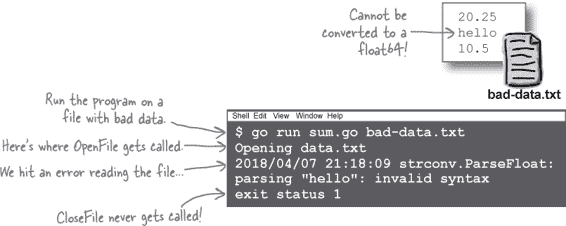
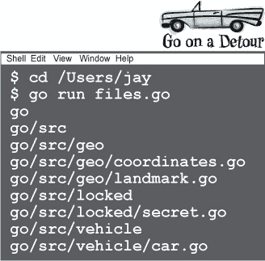
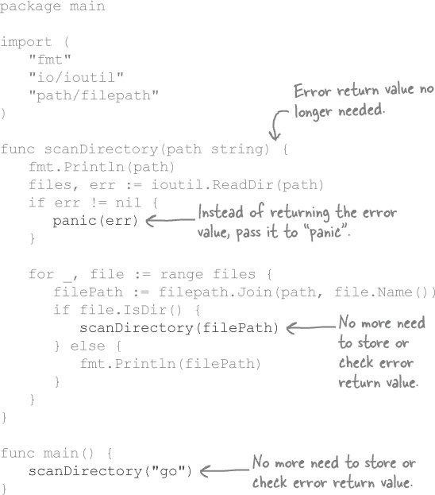

# 第十二章\. 重新振作：从失败中恢复


**每个程序都会遇到错误。你应该为它们做好准备。**

有时处理错误可能就是简单地报告它并退出程序。但其他错误可能需要额外的操作。你可能需要关闭已打开的文件或网络连接，或者以其他方式清理，以防止程序留下混乱。在本章中，我们将向您展示如何**推迟**清理操作，以便即使出现错误，它们仍然会发生。我们还将向您展示在那些（罕见的）适当情况下如何让程序**panic**，以及如何**recover**。

# 重新审视从文件中读取数字

我们已经讨论了在 Go 语言中处理错误的许多技巧。但到目前为止我们展示的技术并不适用于所有情况。让我们看看一个这样的场景。


我们希望创建一个名为*sum.go*的程序，从文本文件中读取`float64`值，将它们全部加在一起，并打印它们的总和。

在第六章中，我们创建了一个`GetFloats`函数，它打开一个文本文件，将文件的每一行转换为`float64`值，并将这些值作为一个切片返回。

在这里，我们将`GetFloats`移到了`main`包中，并更新它以依赖两个新函数，`OpenFile`和`CloseFile`，来打开和关闭文本文件。


我们想要将要读取的文件名作为命令行参数指定。你可能还记得在第六章中使用过`os.Args`切片 —— 它是一个包含程序运行时所有参数的`string`值切片。

因此在我们的`main`函数中，通过访问`os.Args[1]`来获取要打开的文件名作为第一个命令行参数。（请记住，`os.Args[0]`元素是正在运行的程序的名称；实际的程序参数出现在`os.Args[1]`及以后的元素中。）

然后我们将该文件名传递给`GetFloats`以读取文件，并获得一个`float64`值切片。

如果在执行过程中遇到任何错误，它们将从`GetFloats`函数中返回，并存储在`err`变量中。如果`err`不为`nil`，这意味着发生了错误，我们只需记录它并退出。

否则，这意味着文件已成功读取，因此我们使用`for`循环将切片中的每个值相加，并最后打印总和。


让我们把所有这些代码保存在一个名为*sum.go*的文件中。然后，让我们创建一个填满数字的纯文本文件，每行一个数字。我们将其命名为*data.txt*，并保存在与*sum.go*相同的目录中。


我们可以通过`go run sum.go data.txt`来运行程序。字符串`"data.txt"`将作为*sum.go*程序的第一个参数，因此它将作为文件名传递给`GetFloats`。

我们可以看到 `OpenFile` 和 `CloseFile` 函数何时被调用，因为它们都包含对 `fmt.Println` 的调用。在输出末尾，我们可以看到 *data.txt* 中所有数字的总和。看起来一切正常！


# 任何错误都会阻止文件关闭！

但是，如果我们给 *sum.go* 程序一个格式错误的文件，我们就会遇到问题。例如，文件中有一行无法解析为 `float64` 值，就会出现错误。



现在，这本身没什么问题；每个程序偶尔都会收到无效数据。但是 `GetFloats` 函数应该在完成时调用 `CloseFile` 函数。我们在程序输出中看不到 “`Closing file`”，这表明 `CloseFile` 没有被调用！

问题是当我们用无法转换为 `float64` 的字符串调用 `strconv.ParseFloat` 时，它会返回一个错误。我们的代码设置在那一点从 `GetFloats` 函数返回。

但是那个返回发生在调用 `CloseFile` 之前，这意味着文件永远不会被关闭！


# 延迟函数调用

现在，没有关闭文件可能看起来不是什么大问题。对于只打开单个文件的简单程序，这可能没什么问题。但是每个未关闭的文件都会继续消耗操作系统资源。随着时间的推移，多个未关闭的文件会累积，导致程序失败，甚至影响整个系统的性能。养成确保程序完成后关闭文件的习惯非常重要。

但是我们如何实现这一点呢？`GetFloats` 函数设置为如果在读取文件时遇到错误立即退出，即使还没有调用 `CloseFile`！

如果有一个函数调用你希望确保运行，*无论如何*，你可以使用 `defer` 语句。你可以在任何普通函数或方法调用之前放置 `defer` 关键字，Go 将延迟执行该函数调用，直到当前函数退出。

通常，函数调用会在遇到它们时立即执行。在这段代码中，`fmt.Println("Goodbye!")` 调用在另外两个 `fmt.Println` 调用之前执行。


但是如果我们在 `fmt.Println("Goodbye!")` 调用之前添加 `defer` 关键字，那么该调用将等到 `Socialize` 函数的所有剩余代码运行完毕并退出后才会执行。


# 使用延迟函数调用来从错误中恢复


`defer` 关键字确保即使调用函数提前退出（例如通过使用 `return` 关键字），也会执行函数调用。

> **“defer” 关键字确保即使调用函数提前退出，也会执行。**

下面，我们更新了`Socialize`函数以返回一个`error`，因为我们不想说话。`Socialize`将在调用`fmt.Println("Nice weather, eh?")`之前退出。但因为我们在`fmt.Println("Goodbye!")`调用之前包含了`defer`关键字，`Socialize`总是会礼貌地在结束对话之前打印“`Goodbye!`”。


# 使用延迟函数调用确保文件被关闭

因为`defer`关键字可以确保在“任何情况下”都执行函数调用，通常用于需要在发生错误时仍需运行的代码。一个常见的例子是在文件打开后关闭文件。

这正是我们*sum.go*程序中`GetFloats`函数所需要的。在调用`OpenFile`函数后，我们需要调用`CloseFile`，即使在解析文件内容时出现错误。


通过将`CloseFile`的调用移到`OpenFile`后面（及其相应的错误处理代码），并在其前面加上`defer`关键字，我们可以实现这一点。

使用`defer`确保`GetFloats`退出时将调用`CloseFile`，无论是正常完成还是在解析文件时出错。

现在，即使*sum.go*收到了错误数据的文件，它仍会在退出前关闭文件！


# 代码磁铁


该代码设置了一个`Refrigerator`类型，模拟冰箱的功能。`Refrigerator`使用字符串切片作为其底层类型；这些字符串表示冰箱中包含的食物名称。该类型有一个`Open`方法模拟打开冰箱门，以及一个对应的`Close`方法来关闭它（毕竟我们不想浪费能量）。`FindFood`方法调用`Open`打开冰箱门，调用我们编写的`find`函数在底层切片中搜索特定食物，然后调用`Close`来再次关闭门。

但`FindFood`存在问题。如果我们搜索的食物找不到，它设置为返回错误值。但当这种情况发生时，在调用`Close`之前它已经返回，导致虚拟冰箱门敞开！


 答案在“代码磁铁解决方案”中。

使用下面的磁铁创建`FindFood`方法的更新版本。它应该延迟对`Close`方法的调用，以便在`FindFood`退出时运行（无论是否成功找到食物）。


# 没有愚蠢的问题

**Q: 所以我可以延迟函数和方法调用… 我可以延迟其他语句吗，比如`for`循环或变量赋值？**

**A:** 不，只能用于函数和方法调用。您可以编写一个函数或方法来执行您想要的任何操作，然后延迟调用该函数或方法，但`defer`关键字本身只能用于函数或方法调用。

# 列出目录中的文件


Go 还有一些其他功能可帮助您处理错误，我们将展示一个演示这些功能的程序。但是那个程序使用了一些新技巧，我们在深入之前需要向您展示它们。首先，我们需要知道如何读取目录的内容。

尝试创建一个名为 *my_directory* 的目录，其中包含右侧显示的两个文件和一个子目录。下面的程序将列出 *my_directory* 的内容，显示每个项目的名称以及它是文件还是子目录。


`io/ioutil` 包包含一个 `ReadDir` 函数，它允许我们读取目录的内容。您将目录的名称传递给 `ReadDir`，它将返回一个值的切片，每个值代表目录包含的每个文件或子目录（以及遇到的任何错误）。

切片的每个值都满足 `FileInfo` 接口，该接口包括一个 `Name` 方法，返回文件的名称，以及一个 `IsDir` 方法，如果是目录则返回 `true`。

因此，我们的程序调用 `ReadDir`，并将 *my_directory* 的名称作为参数传递给它。然后它循环遍历返回的切片中的每个值。如果 `IsDir` 对于该值返回 `true`，则打印 `"目录：" + 文件的名称`。否则，打印 `"文件：" + 文件的名称`。


将上述代码保存为 *files.go*，与 *my_directory* 相同的目录中。在终端中，切换到该父目录，并输入 `**go run files.go**`。程序将运行并列出 *my_directory* 包含的文件和目录。


# 列出子目录中的文件（会更棘手）


读取单个目录的内容并不太复杂。但是假设我们想要列出更复杂的内容，比如 Go 工作区目录。这将包含一个嵌套在子目录中的整个子目录树，其中有些包含文件，有些则不包含。

通常情况下，这样一个程序会相当复杂。简单来说，其逻辑如下：


相当复杂，对吧？我们宁愿不必编写*那样*的代码！

但是如果有一种更简单的方法呢？类似于这样的逻辑：

1.  获取目录中的文件列表。

    1.  获取下一个文件。

    1.  文件是一个目录吗？

        1.  如果是：从步骤**I**开始，使用此目录。

        1.  如果不是：只需打印文件名。

现在我们不清楚如何处理“使用这个新目录重新启动逻辑”的部分了。为了实现这一点，我们将需要一个新的编程概念...


# 递归函数调用


这就把我们带到了我们在结束我们的偏离并回到处理错误之前需要向您展示的第二个（也是最后一个）技巧。

Go 是支持**递归**的众多编程语言之一，允许函数调用自身。

如果你粗心大意地做这个，你最终会陷入一个无限循环，函数一遍又一遍地调用自身：


但是，如果确保递归循环最终停止，递归函数实际上可以很有用。

这是一个递归的 `count` 函数，从一个起始数计数到一个结束数。（通常循环效率更高，但这是演示递归工作原理的简单方法。）


以下是程序的执行顺序：

1.  `main` 调用 `count`，起始参数为 `1`，结束参数为 `3`

1.  `count`打印`start`参数：`1`

1.  `start` (`1`) 小于 `end` (`3`)，所以 `count` 以 `start` 为 `2` 和 `end` 为 `3` 调用自身。

1.  这是 `count` 的第二次调用，打印了它的新 `start` 参数：`2`

1.  `start` (`2`) 小于 `end` (`3`)，所以 `count` 以 `start` 为 `3` 和 `end` 为 `3` 调用自身。

1.  `count` 的第三次调用，打印了它的新 `start` 参数：`3`

1.  `start` (`3`) *不* 小于 `end` (`3`)，因此 `count` *不* 再次调用自身；它只是返回。

1.  前两次调用 `count` 也返回了，程序结束了。

如果我们添加调用 `Printf` 来显示每次调用 `count` 和每次函数退出时，这个顺序将更加明显：


所以这是一个简单的递归函数。让我们尝试将递归应用到我们的 *files.go* 程序中，看看它是否能帮助我们列出子目录的内容...

# 递归列出目录内容


我们希望我们的 *files.go* 程序能够列出 Go 工作空间目录中所有子目录的内容。我们希望使用类似这样的递归逻辑来实现这一点：

1.  获取目录中的文件列表。

    1.  获取下一个文件。

    1.  文件是否为目录？

        1.  如果是：从步骤 **I** 开始处理此目录。

        1.  如果不是：只需打印文件名。


我们从`main`函数中删除了读取目录内容的代码；现在`main`只是调用一个递归的`scanDirectory`函数。`scanDirectory`函数接受它应该扫描的目录路径作为参数，因此我们将它传递给`"go"`子目录的路径。

`scanDirectory` 的第一件事是打印当前路径，这样我们就知道我们正在哪个目录中。然后它调用 `ioutil.ReadDir` 来获取目录内容。

它遍历 `ReadDir` 返回的 `FileInfo` 值的切片，处理每一个。它调用 `filepath.Join` 来将当前目录路径和当前文件名用斜杠连接起来（因此 `"go"` 和 `"src"` 被连接成 `"go/src"`）。

如果当前文件不是目录，`scanDirectory` 只是打印它的完整路径，并继续处理当前目录中的下一个文件（如果有的话）。

但是，如果当前文件是一个目录，递归就会启动：`scanDirectory` 会使用子目录的路径调用自身。如果该子目录有任何子目录，`scanDirectory` 将递归调用每个子目录，依此类推直到整个文件树。



将上述代码保存为 *files.go*，放在包含您的 Go 工作区的目录中（可能是您的用户主目录）。在终端中，切换到该目录，并使用 `**go run files.go**` 运行该程序。

当你看到 `scanDirectory` 函数在运行时，你会看到递归的真正魅力。对于我们的示例目录结构，处理过程大致如下：

1.  `main` 函数使用路径 `"go"` 调用 `scanDirectory`

1.  `scanDirectory` 函数打印传递给它的路径："go"，指示它正在处理的目录

1.  它使用路径 `"go"` 调用 `ioutil.ReadDir` 函数

1.  返回的切片中只有一个条目："src"

1.  使用当前目录路径 `"go"` 和文件名 `"src"` 调用 `filepath.Join` 函数会得到新路径 `"go/src"`

1.  *src* 是一个子目录，因此再次调用 `scanDirectory` 函数，这次路径是 `"go/src"`

    ###### 注意

    递归！

1.  `scanDirectory` 函数打印新路径："go/src"

1.  使用路径 `"go/src"` 调用 `ioutil.ReadDir` 函数

1.  返回的切片中的第一个条目是 "geo"

1.  使用当前目录路径 `"go/src"` 和文件名 `"geo"` 调用 `filepath.Join` 函数会得到新路径 `"go/src/geo"`

1.  *geo* 是一个子目录，因此再次调用 `scanDirectory` 函数，这次路径是 `"go/src/geo"`

    ###### 注意

    递归！

1.  `scanDirectory` 函数打印新路径："go/src/geo"

1.  它使用路径 `"go/src/geo"` 调用 `ioutil.ReadDir` 函数

1.  返回的切片中的第一个条目是 "coordinates.go"

1.  *coordinates.go* 不是一个目录，因此它的名称会简单地被打印出来

1.  依此类推...

递归函数可能很难编写，并且通常消耗比非递归解决方案更多的计算资源。但有时，递归函数可以提供解决其他方法难以解决的问题的解决方案。

现在我们的 *files.go* 程序已经设置好，我们可以结束我们的插曲了。接下来，我们将回到讨论 Go 的错误处理特性。


# 在递归函数中进行错误处理

如果 `scanDirectory` 在扫描任何子目录时遇到错误（例如，用户无权访问该目录），它会返回一个错误。这是预期的行为；程序对文件系统没有任何控制权，报告错误是很重要的。


但是，如果我们添加几个 `Printf` 语句来显示返回的错误，我们会看到这种错误处理方式并不理想：


如果在递归调用 `scanDirectory` 中的任何一个中发生错误，该错误必须沿着整个链路返回，直到它达到 `main` 函数！


# 引发 panic

我们的`scanDirectory`函数是一个程序可能在运行时适合使用 panic 的罕见例子。

我们之前遇到过 panic。当访问数组和切片中的无效索引时，我们也见过它们：

当类型断言失败时（如果我们没有使用可选的`ok`布尔值），我们也见过它们：


程序 panic 时，当前函数停止运行，并打印日志消息然后崩溃。

您可以通过调用内置的`panic`函数自行引发 panic。


`panic`函数期望一个满足空接口（即可以是任何类型）的单一参数。该参数会（如果需要）转换为字符串并作为 panic 日志消息的一部分打印出来。

# 堆栈跟踪

每个被调用的函数都需要返回到调用它的函数。为了实现这一点，像其他编程语言一样，Go 保留了一个**调用堆栈**，即在任何给定点活动的函数调用列表。

程序 panic 时，会包括**堆栈跟踪**（stack trace）或调用堆栈列表在 panic 输出中。这在确定程序崩溃原因时非常有用。


# 在崩溃前完成的延迟调用

程序 panic 时，所有延迟调用的函数仍然会被执行。如果有多个延迟调用，它们将按照被延迟的相反顺序执行。

下面的代码延迟了两次对`Println`的调用，然后发生了 panic。程序崩溃前的输出顶部显示了两个调用完成的情况。


# 使用“panic”与 scanDirectory

右侧的`scanDirectory`函数已更新为调用`panic`而不是返回错误值。这大大简化了错误处理。

首先，我们从`scanDirectory`声明中删除`error`返回值。如果从`ReadDir`返回`error`值，则将其传递给`panic`。我们可以从对`scanDirectory`的递归调用中删除错误处理代码，并且也可以从`main`中删除对`scanDirectory`的调用。



当`scanDirectory`遇到读取目录错误时，它会直接 panic。所有对`scanDirectory`的递归调用都会退出。


# 何时使用 panic


我们马上会向您展示一种防止程序崩溃的方法。但是调用 panic 确实很少是处理错误的理想方式。

类似于无法访问的文件、网络故障和不良用户输入通常应视为“正常”，并且应通过`error`值进行优雅处理。通常，调用`panic`应保留用于“不可能”情况：即表明程序中存在错误而不是用户错误的情况。

下面是一个使用`panic`来指示 bug 的程序。它给出了隐藏在三扇虚拟门后面的奖品。`doorNumber`变量不是由用户输入填充的，而是由`rand.Intn`函数选择的随机数。如果`doorNumber`包含除`1`、`2`或`3`之外的任何数字，那不是用户错误，而是程序中的 bug。

因此，如果`doorNumber`包含无效值，调用`panic`是有道理的。这*不应该*发生，如果发生，我们希望在程序表现出意外行为之前停止程序。


# “recover”函数

将我们的`scanDirectory`函数更改为使用`panic`而不是返回错误，大大简化了错误处理代码。但是，恐慌也导致我们的程序崩溃并显示一个丑陋的堆栈跟踪。我们更愿意只显示用户错误消息。

Go 语言提供了一个内置的`recover`函数，可以阻止程序因恐慌而崩溃。我们需要使用它来优雅地退出程序。

当您在正常程序执行期间调用`recover`时，它只会返回`nil`，不会做其他操作：


如果在程序恐慌时调用`recover`，它将停止恐慌。但是当您在函数中调用`panic`时，该函数将停止执行。因此，在与`panic`相同的函数中调用`recover`是没有意义的，因为恐慌仍将继续：


但是在程序恐慌时有一种方法可以调用`recover`…… 在恐慌期间，任何延迟调用的函数都会被完成。因此，您可以将调用`recover`放在一个单独的函数中，并使用`defer`在导致恐慌的代码之前调用该函数。


调用`recover` *不会* 导致执行在恐慌点恢复，至少不完全是这样。发生恐慌的函数将立即返回，该函数块中恐慌后的代码将不会执行。但在发生恐慌的函数返回后，正常执行将恢复。


# 恐慌值是从`recover`函数返回的。

正如我们提到的，当没有恐慌时，调用`recover`会返回`nil`。


但是当有恐慌发生时，`recover`会返回传递给`panic`的任何值。这可以用来收集关于恐慌的信息，以帮助恢复或向用户报告错误。


在我们介绍`panic`函数时，我们提到它的参数类型是`interface{}`，即空接口，因此`panic`可以接受任何值。同样，`recover`的返回值类型也是`interface{}`。您可以将`recover`的返回值传递给像`Println`（接受`interface{}`值）之类的`fmt`函数，但不能直接调用它的方法。

下面是一些代码，它将一个 `error` 值传递给 `panic`。但在这样做时，该 `error` 被转换为一个 `interface{}` 值。当延迟函数稍后调用 `recover` 时，将返回该 `interface{}` 值。因此，即使底层的 `error` 值具有 `Error` 方法，尝试在 `interface{}` 值上调用 `Error` 将导致编译错误。


要调用方法或使用 panic 值进行其他操作，需要使用类型断言将其转换回其底层类型。

这里更新了上述代码，它获取 `recover` 的返回值并将其转换回 `error` 值。完成后，我们可以安全地调用 `Error` 方法。


# 在 scanDirectory 中从 panic 中恢复

当我们最后离开 *files.go* 程序时，在 `scanDirectory` 函数中添加 `panic` 调用清理了我们的错误处理代码，但也导致程序崩溃。我们可以利用我们到目前为止学到的关于 `defer`、`panic` 和 `recover` 的知识来打印错误消息并优雅地退出程序。

我们通过添加一个 `reportPanic` 函数来实现这一点，在 `main` 函数中使用 `defer` 来调用它。我们在调用可能会导致 panic 的 `scanDirectory` 之前执行这一操作。

在 `reportPanic` 中，我们调用 `recover` 并存储它返回的 panic 值。如果程序正在 panic，这将停止 panic。

但当调用 `reportPanic` 时，我们*不知道*程序是否真的在 panic。无论 `scanDirectory` 是否调用了 `panic`，延迟调用 `reportPanic` 都会执行。因此，我们首先测试从 `recover` 返回的 panic 值是否为 `nil`。如果是，这意味着没有 panic，因此我们从 `reportPanic` 中返回而不执行进一步操作。

但如果 panic 值 *不是* `nil`，这意味着发生了 panic，我们需要报告它。

因为 `scanDirectory` 将一个 `error` 值传递给 `panic`，我们使用类型断言将 `interface{}` panic 值转换为 `error` 值。如果转换成功，我们打印 `error` 值。

有了这些更改，我们的用户将不再看到丑陋的 panic 日志和堆栈跟踪，而只会看到一个错误消息！


# 恢复 panic

`reportPanic` 还有一个潜在问题需要解决。现在，它拦截 *任何* panic，即使这些 panic 并非源自 `scanDirectory`。如果 panic 值无法转换为 `error` 类型，`reportPanic` 就不会打印它。

我们可以通过在 `main` 函数中使用 `string` 参数再次调用 `panic` 来测试这一点：


`reportPanic` 函数从新的 panic 中恢复，但由于 panic 值不是 `error`，因此 `reportPanic` 不会打印它。我们的用户不知道程序为什么失败了！

处理未预期的 panic 的常见策略是简单地重新引发 panic 状态。通常重新引发是合适的，因为毕竟这是一个未预期的情况。

右侧代码更新了`reportPanic`以处理意外的 panic。如果类型断言成功将 panic 值转换为`error`，我们就像以前一样简单地打印它。但如果失败，我们只需再次调用`panic`并传入相同的 panic 值。


再次运行*files.go*显示修复效果：`reportPanic`从我们对`panic`的测试调用中恢复，但当`error`类型断言失败时，它会再次引发 panic。现在我们可以在`main`中移除对`panic`的调用，有信心地报告任何其他未预期的 panic！


# 没有愚蠢的问题

**Q: 我看到其他编程语言有“异常”。`panic`和`recover`函数似乎以类似的方式工作。我能像异常那样使用它们吗？**

**A:** 我们强烈建议不要这样做，Go 语言的维护者们也是这样认为。甚至可以说，根据语言设计本身的原因，使用`panic`和`recover`是不被鼓励的。在 2012 年的一次会议主题演讲中，Rob Pike（Go 的创始人之一）将`panic`和`recover`描述为“故意笨拙”。这意味着在设计 Go 语言时，其创作者们并没有试图让`panic`和`recover`易于使用或愉快，因此它们使用的频率会*较低*。

这是 Go 设计者们对异常的一个主要弱点做出的回应：异常可能会使程序流程变得更加复杂。相反，Go 开发者被鼓励以与处理程序其他部分相同的方式处理错误：通过`if`和`return`语句，以及`error`值。确实，直接在函数内部处理错误可能会使函数的代码略微变长，但这比根本不处理错误要好。（Go 的创建者发现许多使用异常的开发者会仅仅抛出异常，然后未能正确处理它。）直接处理错误也使得错误处理方式立即显而易见——你无需查看程序的其他部分来查看错误处理代码。

所以不要期待 Go 中与异常等效的功能。这个特性是有意遗漏的。对于习惯于使用异常的开发者来说，可能需要一段时间的适应，但 Go 的维护者们认为这样做最终会带来更好的软件。

###### 注意

你可以在这里查看 Rob Pike 的演讲摘要：

[`talks.golang.org/2012/splash.article#TOC_16`](https://talks.golang.org/2012/splash.article#TOC_16).

# 你的 Go 工具箱

**这就是第十二章的全部内容！你已经将延迟函数调用和从 panic 中恢复添加到了你的工具箱中。**


# Code Magnets Solution

```go
func find(item string, slice []string) bool {
      for _, sliceItem := range slice {
             if item == sliceItem {
                   return true
           }
      }
     return false
}

type Refrigerator []string

func (r Refrigerator) Open() {
       fmt.Println("Opening refrigerator")
}
func (r Refrigerator) Close() {
       fmt.Println("Closing refrigerator")
}

func main() {
            fridge := Refrigerator{"Milk", "Pizza", "Salsa"}
            for _, food := range []string{"Milk", "Bananas"} {
                  err := fridge.FindFood(food)
                  if err != nil {
                         log.Fatal(err)
                  }
            }
}
```


