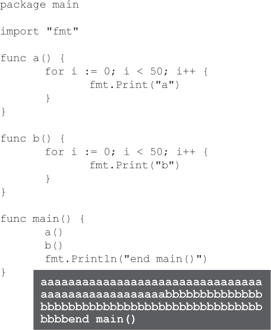
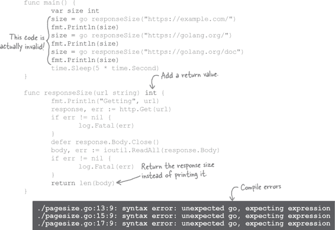

# 第十三章：分享工作：Goroutines 和 Channels


**一次只做一件事情并不总是完成任务最快的方法。** 有些大问题可以分解成更小的任务。**Goroutines** 允许你的程序同时处理多个不同的任务。你的 goroutines 可以使用**channels**来协调它们的工作，让它们互相发送数据并同步，以确保一个 goroutine 不会超过另一个。Goroutines 让你充分利用拥有多处理器的计算机，从而使你的程序运行尽可能快！

# 获取网页


本章将讨论通过同时执行多个任务来更快完成工作。但首先，我们需要一个可以分解成小部分的大任务。所以在接下来的几页中，请耐心等待我们布景...

网页越小，访问者的浏览器加载速度就越快。我们需要一个工具来测量页面的大小，以字节为单位。

多亏了 Go 的标准库，这不应该太难。下面的程序使用`net/http`包连接到一个站点，并仅通过几个函数调用获取网页。

我们将想要的站点的 URL 传递给`http.Get`函数。它将返回一个`http.Response`对象，以及它遇到的任何错误。

`http.Response`对象是一个结构体，具有代表页面内容的`Body`字段。`Body`满足`io`包的`ReadCloser`接口，意味着它有一个`Read`方法（允许我们读取页面数据）和一个`Close`方法（在完成读取后释放网络连接）。

我们推迟对`Close`的调用，所以在我们读完数据后，连接将被释放。然后我们将响应体传递给`ioutil`包的`ReadAll`函数，它将读取其所有内容并作为`byte`值的切片返回。


我们还没有涵盖`byte`类型；它是 Go 的基本类型之一（类似于`float64`或`bool`），用于保存原始数据，比如从文件或网络连接中读取的数据。如果直接打印`byte`值的切片，将不会显示任何有意义的内容，但是如果将`byte`值的切片转换为`string`类型，就可以得到可读的文本。（假设数据表示可读文本。）因此，我们最后将响应体转换为`string`并打印出来。


如果我们将这段代码保存到文件并用`go run`运行它，它将获取 *[`example.com`](https://example.com)* 页面的 HTML 内容，并显示出来。


如果您想获取有关此程序中使用的函数和类型的更多信息，可以通过终端上的`go doc`命令（我们在第四章中已经了解过）获取。 尝试右侧的命令来查看文档。（或者，如果您愿意，可以使用您喜欢的搜索引擎在浏览器中查找。）


从这里开始，将程序转换为打印多个页面的大小并不是太困难。

我们可以将检索页面的代码移动到单独的`responseSize`函数中，并将要检索的 URL 作为参数传递。 我们会打印我们正在检索的 URL，仅用于调试目的。 调用`http.Get`、读取响应和释放连接的代码基本上不会改变。 最后，我们不再将响应的字节片段转换为`string`，而是直接调用`len`获取该片段的长度。 这将给出响应的字节长度，我们将其打印出来。

我们更新我们的`main`函数，使用多个不同的 URL 调用`responseSize`。 运行程序时，它将打印 URL 和页面大小。


# 多任务处理

现在我们来到本章的重点：通过同时执行多个任务来加速程序。

我们的程序依次调用`responseSize`多次。 每次调用`responseSize`都会建立到网站的网络连接，等待网站响应，打印响应大小，然后返回。 只有一个`responseSize`调用返回后，下一个才能开始。 如果我们有一个所有代码都重复三次的大型函数，运行时间与我们的三个`responseSize`调用相同。


但是，如果有一种方法可以同时运行所有三个`responseSize`调用呢？ 程序可能只需三分之一的时间就能完成！


# 使用 goroutines 进行并发处理

当`responseSize`调用`http.Get`时，您的程序必须在那里等待远程网站响应。 在等待期间，它不执行任何有用的操作。

不同的程序可能需要等待用户输入。 另一个可能在从文件中读取数据时等待。 有许多情况下，程序只是坐在那里等待。

**并发**允许程序暂停一个任务并处理其他任务。 等待用户输入的程序可能在后台执行其他处理。 程序可能在读取文件时更新进度条。 我们的`responseSize`程序在等待第一个请求完成时可能会进行其他网络请求。

如果一个程序被写成支持并发，那么它可能也支持**并行处理**：同时运行任务。只有一个处理器的计算机一次只能运行一个任务。但是如今大多数计算机都有多个处理器（或者一个拥有多个核心的处理器）。您的计算机可能会将并发任务分配给不同的处理器以同时运行它们。（直接管理这些的情况很少见，通常操作系统会为您处理。）

将大任务分解为可以并发运行的更小子任务，有时可以显著提高程序的运行速度。

在 Go 语言中，并发任务被称为**goroutines**。其他编程语言有类似的概念称为*线程*，但是 goroutines 需要比线程更少的计算机内存，而且启动和停止时间也更短，这意味着您可以同时运行更多的 goroutines。

它们也更容易使用。要启动另一个 goroutine，您只需使用`go`语句，这只是一个普通的函数或方法调用，在其前面加上`go`关键字：

> **Goroutines 允许并发：暂停一个任务以处理其他任务。在某些情况下，它们还允许并行处理：同时处理多个任务！**


注意我们说*另一个*goroutine。每个 Go 程序的`main`函数都是使用一个 goroutine 启动的，所以每个 Go 程序至少运行一个 goroutine。你一直在使用 goroutines，只是不知道而已！

# 使用 goroutines

这是一个按顺序调用函数的程序。`a`函数使用循环 50 次打印字符串`"a"`，而`b`函数则打印字符串`"b"` 50 次。`main`函数先调用`a`，然后是`b`，最后在退出时打印一条消息。



这就好像`main`函数包含了所有`a`函数的代码，然后是所有`b`函数的代码，最后是自己的代码：


要在新的 goroutines 中启动`a`和`b`函数，您只需在函数调用前面加上`go`关键字即可：

```go
func main() {
       go a()
       go b()
       fmt.Println("end main()")
}
```

这会使新的 goroutines 与`main`函数并发运行：


但是如果我们现在运行程序，我们只会看到`main`函数末尾的`Println`调用的输出——我们看不到`a`或`b`函数的任何输出！


这里有个问题：一旦`main` goroutine（调用`main`函数的 goroutine）结束，Go 程序就会停止运行，即使其他 goroutine 仍在运行。我们的`main`函数在`a`和`b`函数的代码有机会运行之前就已经完成了。


我们需要保持 `main` goroutine 运行，直到 `a` 和 `b` 函数的 goroutine 能够完成。为了正确实现这一点，我们将需要 Go 语言的另一个特性——*通道*，但在本章后面我们会再详细介绍。所以现在，我们只需暂停 `main` goroutine 一段时间，以便其他 goroutine 可以运行。

我们将使用 `time` 包中的一个函数，称为 `Sleep`，它会暂停当前 goroutine 给定的时间。在 `main` 函数中调用 `time.Sleep(time.Second)` 将导致 `main` goroutine 暂停 1 秒。


如果我们重新运行程序，当它们的 goroutine 最终有机会运行时，我们会再次看到来自 `a` 和 `b` 函数的输出。这两者的输出会混合在一起，因为程序在两个 goroutine 之间切换。（您得到的模式可能与此处显示的不同。）当 `main` goroutine 再次唤醒时，它会进行 `fmt.Println` 的调用并退出。

`main` goroutine 中对 `time.Sleep` 的调用给了足够的时间让 `a` 和 `b` goroutine 完成运行。


# 使用 goroutine 和我们的`responseSize`函数

适应我们打印网页大小程序使用 goroutine 是非常容易的。我们只需要在每个对`responseSize`的调用前添加`go`关键字即可。

为了防止 `main` goroutine 在 `responseSize` goroutine 完成之前退出，我们还需要在 `main` 函数中添加对 `time.Sleep` 的调用。


仅休眠 1 秒可能不足以使网络请求完成。调用 `time.Sleep(5 * time.Second)` 将使 goroutine 休眠 5 秒。（如果您在慢速或无响应的网络上尝试此操作，则可能需要增加该时间。）

```go
func responseSize(url string) {
       fmt.Println("Getting", url)
       response, err := http.Get(url)
       if err != nil {
              log.Fatal(err)
       }
       defer response.Body.Close()
       body, err := ioutil.ReadAll(response.Body)
       if err != nil {
              log.Fatal(err)
       }
       fmt.Println(len(body))
}
```

如果我们运行更新后的程序，我们会看到它一次性打印出正在检索的 URL，因为三个 `responseSize` goroutine 同时启动。

对 `http.Get` 的三次调用也是并发进行的；程序在发送下一个请求之前不会等待一个响应返回。因此，使用 goroutine 打印三个响应大小比早期的顺序版本要快得多。然而，程序仍然需要 5 秒才能完成，因为我们等待 `main` 中的 `time.Sleep` 调用完成。


我们并没有控制调用 `responseSize` 的执行顺序，所以如果我们再次运行程序，我们可能会看到请求以不同的顺序发生。


即使所有站点的响应速度比 5 秒更快，程序仍然需要 5 秒才能完成，所以我们从切换到 goroutine 中仍然没有得到很好的速度增益。更糟糕的是，如果站点响应时间长，5 秒可能还不够。有时，您可能会看到程序在所有响应到达之前结束。


显然，`time.Sleep`并不是等待其他 goroutine 完成的理想方式。一旦我们在几页中看到通道，我们将有一个更好的替代方法。

# 我们不能直接控制 goroutine 运行的时间

每次运行程序时，我们可能会看到`responseSize` goroutine 以不同的顺序运行：


我们也无法知道前一个程序何时在`a`和`b` goroutine 之间切换：


在正常情况下，Go 不能保证何时会在 goroutine 之间切换，也不能保证切换的持续时间。这允许 goroutine 以最有效的方式运行。但如果您关心 goroutine 运行的顺序，您将需要使用通道来同步它们（我们很快将看到）。

# 代码磁铁


使用 goroutines 的程序在冰箱上被打乱了。您能够重构代码片段以使工作程序产生与给定示例*类似*的输出吗？（无法预测 goroutine 执行的顺序，所以不用担心，您的程序输出不需要完全匹配所示输出。）


 答案在“代码磁铁解决方案”中。

# `go`语句不能与返回值一起使用

转换为 goroutines 引出了另一个问题，我们需要解决：我们不能在`go`语句中使用函数返回值。假设我们想要修改`responseSize`函数以返回页面大小而不是直接打印它：



我们将会得到编译错误。编译器阻止您尝试从使用`go`语句调用的函数中获取返回值。

这实际上是一件好事。当您在`go`语句的一部分调用`responseSize`时，您的意思是：“Go 在一个单独的 goroutine 中运行`responseSize`。我将继续运行此函数中的指令。”`responseSize`函数不会立即返回值；它必须等待网站响应。但是您的`main` goroutine 中的代码会期望立即返回值，但此时还没有返回值！


这适用于使用`go`语句调用的任何函数，而不仅仅是像`responseSize`这样的长时间运行函数。您不能依赖于返回值及时准备好，因此 Go 编译器阻止任何尝试使用它们的行为。

Go 不允许您在使用`go`语句调用的函数中使用返回值，因为无法保证返回值在使用之前已经准备好：


但是有一种方法可以在 goroutine 之间进行通信：**通道（channels）**。通道不仅允许您从一个 goroutine 发送值到另一个 goroutine，还确保发送 goroutine 在接收 goroutine 尝试使用该值之前已经发送了它。

使用通道的唯一实际方式是从一个 goroutine 向另一个 goroutine 通信。因此，为了演示通道，我们需要能够做一些事情：

+   创建一个通道。

+   编写一个接收通道作为参数的函数。我们将在单独的 goroutine 中运行此函数，并使用它向通道发送值。

+   在我们的原始 goroutine 中接收发送的值。

每个通道只传递特定类型的值，所以你可能有一个`int`值的通道，另一个是结构类型的通道。要声明一个持有通道的变量，你使用`chan`关键字，后跟通道将要传递的值的类型。


要实际创建一个通道，你需要调用内置的`make`函数（这与创建映射和切片的方式相同）。你将通道类型作为参数传递给`make`函数（应该与你想要赋值的变量类型相同）。


大多数情况下，与其单独声明通道变量，不如使用简短的变量声明更容易：


# 使用通道发送和接收值

要在通道上发送值，你使用`<-`操作符（即小于号后跟一个短横线）。它看起来像是一个箭头，从你发送的值指向你发送它的通道。


你也可以使用`<-`操作符从通道*接收*值，但位置不同：将箭头放在你要接收的通道*左侧*。（看起来像是从通道中拉出一个值。）


这是前一页中的`greeting`函数，重写以使用通道。我们已经向`greeting`添加了一个`myChannel`参数，它接收一个传递`string`值的通道。现在`greeting`不再返回一个字符串值，而是通过`myChannel`发送一个字符串。

在`main`函数中，我们使用内置的`make`函数创建了要传递给`greeting`的通道。然后我们将`greeting`作为一个新的 goroutine 调用。使用单独的 goroutine 很重要，因为通道应该只用于在*不同*的 goroutine 之间通信。（稍后我们会详细讨论原因。）最后，我们从传递给`greeting`的通道接收一个值，并打印它返回的字符串。


我们不必直接将从通道接收到的值传递给`Println`。你可以在需要值的任何上下文中从通道接收值。（也就是说，在你可能使用变量或函数返回值的任何地方。）例如，我们可以先将接收到的值赋给一个变量：


# 使用通道同步 goroutine

我们提到通道还确保发送协程在接收通道尝试使用值之前已经发送了该值。通道通过**阻塞**来实现这一点——暂停当前协程中的所有后续操作。发送操作会阻塞发送协程，直到另一个协程在相同通道上执行接收操作。反之亦然：接收操作会阻塞接收协程，直到另一个协程在相同通道上执行发送操作。这种行为允许协程**同步**它们的操作，即协调它们的时序。


这是一个创建两个通道并将它们传递给两个新协程函数的程序。然后 `main` 协程从这些通道接收值并打印它们。与我们的协程程序不同，该程序会重复打印 `"a"` 或 `"b"`，我们可以预测这个程序的输出：它将始终按顺序打印 `"a"`，然后是 `"d"`，`"b"`，`"e"`，`"c"` 和 `"f"`。


我们知道顺序是什么，因为 `abc` 协程每次向通道发送值时都会阻塞，直到 `main` 协程接收到它的值。`def` 协程也是如此。`main` 协程成为 `abc` 和 `def` 协程的协调者，只有当它准备好读取它们发送的值时，它们才能继续进行。


# 观察协程同步

`abc` 和 `def` 协程通过它们的通道发送值的速度非常快，以至于很难看清发生了什么。这里有另一个程序可以减慢速度，这样你就可以看到阻塞发生的情况。

我们从一个 `reportNap` 函数开始，它会导致当前协程休眠指定的秒数。每秒协程休眠时，它将打印一个提示说它仍在休眠。

我们添加了一个 `send` 函数，它将在一个协程中运行，并向通道发送两个值。但在发送任何东西之前，它首先调用 `reportNap`，使其协程睡眠 2 秒。


在 `main` 协程中，我们创建一个通道并将其传递给 `send`。然后我们再次调用 `reportNap`，以便**这个**协程休眠**5**秒（比 `send` 协程长 3 秒）。最后，我们在通道上执行两次接收操作。

当我们运行这个程序时，我们会看到两个协程在前两秒内都会休眠。然后 `send` 协程醒来并发送它的值。但它不会继续做任何事情；发送操作会阻塞 `send` 协程，直到 `main` 协程接收到该值。

这并不会立即发生，因为 `main` 协程仍然需要睡眠另外 3 秒。当它醒来时，它会从通道接收值。只有在此之后，`send` 协程才会解除阻塞，以便发送它的第二个值。


# 破坏性的东西是教育性的！


这里是我们最早、最简单的通道演示代码：`greeting`函数在一个协程中运行，并向`main`协程发送一个字符串值。

做出以下任意一项更改并尝试运行代码。然后撤销您的更改并尝试下一项。看看会发生什么！

```go
func greeting(myChannel chan string) {
       myChannel <- "hi"
}

func main() {
       myChannel := make(chan string)
       go greeting(myChannel)
       fmt.Println(<-myChannel)
}
```

| 如果你这样做... | ...代码会因为... |
| --- | --- |
| 从`main`函数中向通道发送一个值：`myChannel <- "hi from main"` | 你会收到一个“所有协程都在睡眠 - 死锁”错误。这是因为`main`协程阻塞，等待另一个协程从通道接收。但另一个协程没有进行任何接收操作，所以`main`协程保持阻塞状态。 |
| 在调用`greeting`之前移除`go`关键字：``~~`go`~~ greeting(myChannel)`` | 这会导致`greeting`函数在`main`协程内部运行。同样的原因，这也会导致死锁错误：`greeting`中的发送操作导致`main`协程阻塞，但没有其他协程进行接收操作，所以它保持阻塞状态。 |
| 删除向通道发送值的那一行：`~~myChannel <- "hi"~~` | 这也导致了死锁，但原因不同：`main`协程尝试*接收*一个值，但现在没有*发送*任何值。 |
| 删除接收从通道接收值的那一行：`~~fmt.Println(<-myChannel)~~` | `greeting`中的发送操作导致该协程阻塞。但由于没有接收操作来使`main`协程也阻塞，`main`立即完成，程序在不产生任何输出的情况下结束。 |

# 使用通道来修复我们的网页大小程序

我们的报告网页大小的程序仍然存在两个问题：

+   在`go`语句中，我们不能使用`responseSize`函数的返回值。

+   我们的`main`协程在接收到响应大小之前就已经完成了，所以我们增加了一个对`time.Sleep`的调用，持续 5 秒钟。但有时 5 秒钟太长，有时又太短。


我们可以使用通道来同时解决这两个问题！

首先，我们从`import`语句中移除`time`包；我们不再需要`time.Sleep`了。然后，我们更新`responseSize`以接受一个`int`值的通道。不再返回页面大小，而是通过通道发送大小。


在`main`函数中，我们调用`make`创建了一个`int`值的通道。我们更新每个对`responseSize`的调用，将通道作为参数添加进去。最后，我们在通道上执行三次接收操作，每次接收`responseSize`发送的一个值。


如果我们运行这个程序，我们会看到程序的完成速度和网站的响应速度一样快。这个时间可能有所不同，但在我们的测试中，我们看到完成时间短至 1 秒！

我们还可以做的另一个改进是将我们想要检索的 URL 列表存储在一个切片中，然后使用循环调用`responseSize`，并从 channel 接收值。这将使我们的代码更少重复，并且如果以后想要添加更多 URL，则很重要。

我们根本不需要改变`responseSize`，只需修改`main`函数。我们创建一个包含我们想要的 URL 的`string`值切片。然后我们遍历该切片，并调用`responseSize`函数，传入当前的 URL 和 channel。最后，我们再进行第二个独立的循环，为切片中的每个 URL 运行一次，接收并打印来自 channel 的值。（在单独的循环中执行这些操作很重要。如果我们在启动`responseSize` goroutines 的同一个循环中接收值，`main` goroutine 会阻塞，直到接收完成，然后我们又回到了一次请求一个页面的方式。）


使用循环的方式更清晰，但结果仍然相同！

# 更新我们的 channel 以携带一个结构体

我们仍然需要修复`responseSize`函数的一个问题。我们不知道网站将以什么顺序响应。因为我们没有保持页面 URL 与响应大小在一起，所以我们不知道哪个大小属于哪个页面！


不过这并不难修复。Channels 可以像传递基本类型一样轻松地传递复合类型，比如切片、映射和结构体。我们可以创建一个结构体类型来存储页面 URL 以及其大小，这样我们可以一起将它们发送到 channel 中。

我们将声明一个具有底层`struct`类型的新`Page`类型。`Page`将有一个`URL`字段来记录页面的 URL，以及一个`Size`字段来记录页面的大小。

我们将在`responseSize`函数的 channel 参数上更新为保存新的`Page`类型，而不仅仅是`int`页面大小。我们将让`responseSize`创建一个带有当前 URL 和页面大小的新`Page`值，并将其发送到 channel 中。

在`main`函数中，我们还将更新`make`调用中 channel 持有的类型。当我们从 channel 接收一个值时，它将是一个`Page`值，因此我们将打印它的`URL`和`Size`字段。


现在输出将页面大小与它们的 URL 配对。这样就清楚了每个大小属于哪个页面。

以前，我们的程序必须逐个请求页面。Goroutines 允许我们在等待网站响应时开始处理下一个请求。程序完成的时间缩短了三分之一！

# 你的 Go 工具箱


**这就是第十三章的内容！你已经将 goroutines 和 channels 添加到你的工具箱中。**


# Code Magnets 解决方案


