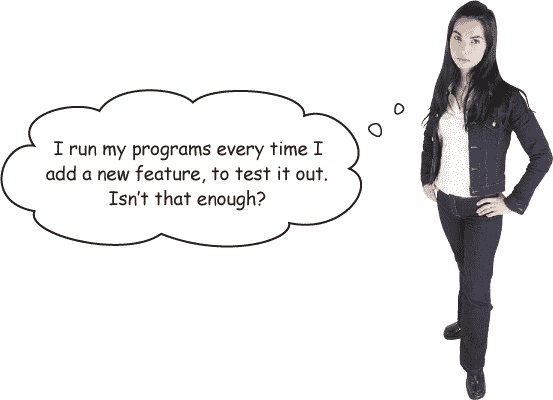

# 第十四章：代码质量保证：自动化测试


**你确定你的软件现在能正常工作吗？真的确定吗？** 在将新版本发送给用户之前，你可能试验了新功能以确保它们正常工作。但你是否试验了*旧*功能以确保没有破坏它们中的任何一个？*所有*的旧功能？如果这个问题让你担心，你的程序需要**自动化测试**。自动化测试确保你程序的组件在代码更改后仍能正常工作。Go 语言的`testing`包和`go test`工具使编写自动化测试变得简单，利用你已经掌握的技能！

# 自动化测试能在别人之前发现你的 bug

开发者 A 在他们经常去的一家餐馆里碰到了开发者 B……

| **开发者 A：** | **开发者 B：** |
| --- | --- |
| 新工作如何？ | 不太好。晚饭后我得回办公室。我们发现一个 bug 导致某些客户被多次计费。 |
| 哎呀。*那个*怎么进了你们的计费服务器？ | 我们认为可能是几个月前引入的。其中一个开发人员当时对计费代码做了一些更改。 |
| 哇，那么久以前了…… 你们的测试没发现这个 bug 吗？ | 测试？ |
| 你们的自动化测试。在引入 bug 时没有失败？ | 嗯，我们没有这方面的测试。 |
| *什么？！* |  |

你的客户依赖于你的代码。当它出错时，后果可能很严重。你公司的声誉会受损。而*你*将不得不加班修 bug。

这就是为什么发明了自动化测试。**自动化测试**是一个单独的程序，执行主程序的组件，并验证它们的行为是否符合预期。



> **除非你打算测试所有旧功能，确保你的更改没有破坏任何功能。自动化测试比手动测试节省时间，通常也更彻底。**

# 我们应该为其编写自动化测试的一个函数示例

让我们来看一个可以通过自动化测试捕获的 bug 示例。这里有一个简单的包，其中包含一个函数，将几个字符串连接成适合在英语句子中使用的单个字符串。如果有两个项目，它们将用“and”连接（如“苹果和橙子”）。如果有多于两个项目，逗号将根据需要添加（如“苹果、橙子和梨子”）。

###### 注意

最后一个很棒的例子来自《Head First Ruby》（这本书也有一章关于测试）！


代码使用了`strings.Join`函数，该函数接受一个字符串切片和一个用于连接它们的字符串。`Join`函数返回一个字符串，其中包含来自切片的所有项目，连接字符串分隔每个条目。


在`JoinWithCommas`中，我们使用切片操作符来收集切片中除最后一个短语外的所有短语，并将它们传递给`strings.Join`来将它们连接成一个字符串，每个短语之间用逗号和空格分隔。然后我们添加词语*and*（用空格包围），并以最后一个短语结束字符串。


这里有一个快速程序来尝试我们的新功能。我们导入我们的`prose`包，并传递一些切片给`JoinWithCommas`。


它能工作，但结果有个小问题。也许我们只是不成熟，但我们可以想象这会导致人们开玩笑说父母*是*一个小丑和一头奖牛。而且用这种方式格式化列表可能会导致其他误解。

为了消除任何混淆，让我们更新我们包的代码，在*and*之前再加一个额外的逗号（例如“apple, orange, and pear”）：


如果我们重新运行程序，我们将在结果字符串的*and*前看到逗号。现在应该清楚，父母在照片中*和*小丑和公牛一起。


# 我们引入了一个 bug！


哦，是的！该函数曾经对这个两项列表返回`"my parents and a rodeo clown"`，但这里也包含了一个额外的逗号！我们当时太专注于修复*三*项列表，结果引入了*两*项列表的 bug...


如果我们为这个函数编写了自动化测试，这个问题本可以避免。

自动化测试使用特定的输入运行你的代码，并寻找特定的结果。只要你的代码输出与预期值匹配，测试就会“通过”。

但假设你在你的代码中意外引入了一个 bug（就像我们在额外逗号的例子中做的那样）。你的代码输出将不再匹配预期值，测试将“失败”。你会立即知道有 bug。


> **拥有自动化测试就像在每次修改代码时自动检查代码中的 bug 一样！**

# 写测试

Go 包含一个`testing`包，你可以用它为你的代码编写自动化测试，并使用`go test`命令来运行这些测试。

让我们先写一个简单的测试。起初我们不会测试任何实际内容，只是展示一下测试的工作原理。然后我们会实际使用测试来帮助我们修复`JoinWithCommas`函数。

在你的*prose*包目录中，紧挨着*join.go*文件，创建一个*join_test.go*文件。文件名中的*join*部分并不重要，但*_test.go*部分是必须的；`go test`工具会寻找以该后缀命名的文件。


测试文件中的代码由普通的 Go 函数组成，但为了能够与`go test`工具一起工作，它需要遵循某些约定：

+   您不必将您的测试作为与您正在测试的代码相同的包的一部分，但如果您想要访问包中未导出的类型或函数，您将需要这样做。

+   测试需要使用`testing`包中的类型，因此您将需要在每个测试文件的顶部导入该包。

+   测试函数的名称应以`Test`开头。（其余部分可以任意，但应以大写字母开头。）

+   测试函数应接受一个参数：指向`testing.T`值的指针。

+   您可以通过调用`testing.T`值上的方法（如`Error`）报告测试失败。大多数方法接受一个带有说明测试失败原因的字符串。

# 使用“go test”命令运行测试

要运行测试，您可以使用`go test`命令。该命令接受一个或多个包的导入路径，就像`go install`或`go doc`一样。它将查找那些包目录中所有以*_test.go*结尾的文件，并运行这些文件中每个函数的每个函数，其名称以`Test`开头。

让我们运行刚刚添加到我们的`prose`包中的测试。在您的终端中运行此命令：

```go
go test github.com/headfirstgo/prose
```

测试函数将运行并打印它们的结果。


因为两个测试函数都调用了传递给它们的`testing.T`值上的`Error`方法，所以两个测试都失败了。打印了每个失败测试函数的名称，以及包含`Error`调用的行和给定的失败消息。

输出底部是整个`prose`包的状态。如果包内的任何测试失败（像我们的那样），则会打印整个包的“`FAIL`”状态。

如果我们从测试中删除对`Error`方法的调用…


…然后我们将能够重新运行相同的`go test`命令，并且测试将通过。由于每个测试都通过，`go test`将仅为整个`prose`包打印“`ok`”状态。


# 测试我们实际的返回值

我们可以使我们的测试通过，也可以使它们失败。现在让我们尝试编写一些实际帮助我们排查`JoinWithCommas`函数的测试。

我们将更新`TestTwoElements`以显示在调用具有两个元素切片时从`JoinWithCommas`函数*期望*的返回值。我们将对具有三个元素切片的`TestThreeElements`执行相同操作。我们将运行测试，并确认`TestTwoElements`当前失败而`TestThreeElements`通过。

一旦我们的测试设置为我们想要的方式，我们将修改`JoinWithCommas`函数以使所有测试通过。到那时，我们将知道我们的代码已修复！

在`TestTwoElements`中，我们将向`JoinWithCommas`传递一个包含两个元素的切片，`[]string{"apple", "orange"}`。如果结果不等于`"apple and orange"`，我们将测试失败。同样，在`TestThreeElements`中，我们将传递一个包含三个元素的切片，

`[]string{"apple", "orange", "pear"}`。如果结果不等于`"apple, orange, and pear"`，我们将测试失败。


如果我们重新运行测试，`TestThreeElements`测试将通过，但`TestTwoElements`测试将失败。


这是一件*好*事情；它与我们基于`join`程序输出所预期看到的相符。这意味着我们可以依赖我们的测试来判断`JoinWithCommas`是否正常工作！


# 使用“Errorf”方法生成更详细的测试失败消息

目前我们的测试失败信息对于诊断问题并不是很有帮助。我们知道预期有某个值，而且我们知道`JoinWithCommas`的返回值与预期不同，但我们不知道这些值是什么。


测试函数的`testing.T`参数还有一个可以调用的`Errorf`方法。与`Error`不同，`Errorf`接受带有格式化动词的字符串，就像`fmt.Printf`和`fmt.Sprintf`函数一样。您可以使用`Errorf`在测试失败消息中包含额外的信息，例如您传递给函数的参数、您得到的返回值以及您期望的值。

这里是我们测试的更新，使用`Errorf`生成更详细的失败消息。为了避免在每个测试中重复字符串，我们添加了一个`want`变量（表示我们*期望*的值），用于保存我们期望`JoinWithCommas`返回的值。我们还添加了一个`got`变量（表示我们实际*得到*的值），用于保存实际的返回值。如果`got`不等于`want`，我们将调用`Errorf`，并让它生成一个错误消息，包括我们传递给`JoinWithCommas`的切片（我们使用格式动词`%#v`，使切片的打印方式与 Go 代码中的一样），我们得到的返回值，以及我们期望的返回值。


如果我们重新运行测试，我们将看到确切的失败原因。

# 测试“辅助”函数

您并不局限于在*_test.go*文件中只有测试函数。通过将重复代码移动到测试文件中的其他“辅助”函数中，您可以减少测试中的重复代码。`go test`命令仅使用名称以`Test`开头的函数，因此只要您将函数命名为其他名称，就可以正常工作。

在我们的`TestTwoElements`和`TestThreeElements`函数之间存在相当繁琐的对`t.Errorf`的调用（随着我们添加更多测试，可能会出现更多重复）。一种解决方法是将字符串生成移至一个单独的`errorString`函数，测试可以调用它。

我们将让`errorString`接受传递给`JoinWithCommas`的切片，`got`值和`want`值。然后，不再在`testing.T`值上调用`Errorf`，而是让`errorString`调用`fmt.Sprintf`为我们生成一个（相同的）错误字符串来返回。测试本身然后可以使用返回的字符串调用`Error`来指示测试失败。这段代码稍微更清晰，但仍然能得到相同的输出。


# 使测试通过

现在我们的测试设置了有用的失败消息，是时候看看如何用它们来修复我们的主要代码了。

我们有两个关于`JoinWithCommas`函数的测试。通过包含三个项的切片的测试通过了，但通过包含两个项的切片的测试失败了。

这是因为`JoinWithCommas`当前在返回仅有两个项目的列表时仍然包括一个逗号。


让我们修改`JoinWithCommas`来解决这个问题。如果字符串切片中只有两个元素，我们将简单地用`" and "`将它们连接在一起，然后返回结果字符串。否则，我们将按照我们一直遵循的逻辑进行操作。


我们已经更新了我们的代码，但它是否工作正常？我们的测试可以立即告诉我们！如果我们现在重新运行我们的测试，`TestTwoElements`将通过，意味着所有测试都通过了。


我们可以确信`JoinWithCommas`现在能够处理两个字符串的切片，因为相应的单元测试现在通过了。而我们不需要担心它是否仍然正确处理三个字符串的切片；我们有一个单元测试向我们保证这也没问题。

这也反映在我们的`join`程序的输出中。如果我们现在重新运行它，我们将看到两个切片都被正确格式化了！


# 测试驱动开发

一旦你有了一些单元测试的经验，你可能会陷入一种被称为*测试驱动开发*的循环中：

1.  **编写测试：** 你为你*希望*的功能编写一个测试，即使它还不存在。然后你运行测试以确保它*失败*。

1.  **使其通过：** 你在主代码中实现了这个功能。不用担心你写的代码是笨拙还是低效；你的唯一目标是让它工作。然后你运行测试以确保它*通过*。

1.  **重构你的代码：** 现在，你可以自由地*重构*代码，随意改进它。你已经看到测试*失败*，所以你知道如果你的应用代码出错，它将再次失败。你已经看到测试*通过*，所以只要你的代码工作正常，它将继续通过。

这种自由*更改*你的代码而不必担心它会出错，这才是你想要单元测试的真正原因。每当你看到一种使你的代码更简短或更易读的方法时，你都会毫不犹豫地去做。当你完成时，只需再次运行你的测试，你就可以确信一切仍然正常运行。

>  **写测试！**
> 
>  **让它通过！**
> 
>  **重构你的代码！**

# 另一个需要修复的错误

可能 `JoinWithCommas` 会被调用时传递一个仅包含单个短语的切片。但在这种情况下，它的表现并不是很好，将该项视为列表末尾出现的情况：


在这种情况下，`JoinWithCommas` 应该返回什么？如果我们有一个只有一个项目的列表，我们实际上不需要逗号、单词*and*或任何其他东西。我们可以简单地返回一个包含该项目的字符串。


让我们在 *join_test.go* 中表达这个作为一个新的测试。我们将在现有的 `TestTwoElements` 和 `TestThreeElements` 测试旁边添加一个新的测试函数叫做 `TestOneElement`。我们的新测试看起来与其他测试类似，但我们将传递一个仅包含一个字符串的切片到 `JoinWithCommas`，并期望返回一个包含该字符串的返回值。


正如你所预料的，知道我们的代码中有一个 bug，测试失败了，显示 `JoinWithCommas` 返回的是 `", and apple"` 而不是 `"apple"`。

更新 `JoinWithCommas` 以修复我们的失败测试非常简单。我们检查给定的切片是否只包含一个字符串，如果是，则简单地返回该字符串。

```go
func JoinWithCommas(phrases []string) string {
       if len(phrases) == 1 {
              return phrases[0]
       } else if len(phrases) == 2 {
              return phrases[0] + " and " + phrases[1]
       } else {
              result := strings.Join(phrases[:len(phrases)-1], ", ")
              result += ", and "
              result += phrases[len(phrases)-1]
              return result
       }
}
```

修复了我们的代码后，如果我们重新运行测试，我们将看到一切都通过了。


当我们在代码中使用 `JoinWithCommas` 时，它将表现得像它应该的那样。


# 没有蠢问题

**Q: 这些测试代码会不会使我的程序变得更大和更慢？**

**A:** 别担心！正如 `go test` 命令已经被设置为只能处理文件名以 *_test.go* 结尾的文件一样，`go` 工具中的其他命令（如 `go build` 和 `go install`）也被设置为*忽略*以 *_test.go* 结尾的文件。`go` 工具可以将您的程序代码编译成可执行文件，但它将忽略您的测试代码，即使它们保存在同一个包目录中。

# 代码磁铁

糟糕！我们创建了一个 `compare` 包，其中包含一个 `Larger` 函数，该函数应返回传入的两个整数中较大的那个。但是我们的比较出错了，`Larger` 返回的是*较小*的整数！


我们已经开始编写测试来帮助诊断问题。您能重构代码片段以创建能生成所示输出的工作测试吗？您需要创建一个返回测试失败消息的辅助函数，然后在测试中添加两个对该辅助函数的调用。


 答案在 “Code Magnets Solution” 中。

# 运行特定的测试集

有时候你可能只想运行几个特定的测试，而不是整个集合。`go test` 命令提供了几个命令行标志来帮助你实现这一点。**标志**是一个参数，通常是一个连字符（`-`）后面跟着一个或多个字母，你可以提供给命令行程序以改变程序的行为。

`go test` 命令值得记住的第一个标志是 `-v` 标志，它代表“详细信息”。如果你将其添加到任何 `go test` 命令中，它将列出每个运行的测试函数的名称和状态。通常，通过的测试会被省略以保持输出“安静”，但在详细模式下，`go test` 将列出即使是通过的测试。


一旦你获得一个或多个测试的名称（无论是从 `go test -v` 的输出中还是从测试代码文件中查找），你可以添加 `-run` 选项来限制要运行的测试集。在 `-run` 后面，你指定部分或全部函数名，只有名称与你指定的测试函数才会运行。

如果我们在 `go run` 命令中添加 `-run Two`，那么只有函数名中带有 `Two` 的测试函数会被匹配执行。在我们的情况下，这意味着只会运行 `TestTwoElements`。（你可以使用 `-run` 选项与或不与 `-v` 标志一起使用，但我们发现添加 `-v` 可以避免混淆哪些测试正在运行。）


如果我们改为添加 `-run Elements`，那么 `TestTwoElements` 和 `TestThreeElements` 都会被运行。（但 `TestOneElement` 不会被运行，因为它的名字结尾没有 `s`。）


# 表驱动测试

在我们的三个测试函数之间存在相当多的重复代码。实际上，测试之间唯一变化的是我们传递给 `JoinWithCommas` 的切片和我们期望它返回的字符串。


我们可以建立一个“表格”，列出输入数据和我们期望的输出，然后使用一个单独的测试函数来检查表格中的每个条目，而不是维护单独的测试函数。

表格的格式没有标准，但一个常见的解决方案是定义一个新类型，专门用于你的测试，该类型包含每个测试中要传递给 `JoinWithCommas` 的字符串切片的 `list` 字段，以及我们期望它返回的相应字符串的 `want` 字段。这里是我们可能使用的 `testData` 类型。


我们可以在将要使用的 *lists_test.go* 文件中直接定义 `testData` 类型。

我们的三个测试函数可以合并成一个单独的 `TestJoinWithCommas` 函数。在顶部，我们设置一个 `tests` 切片，并将旧的 `TestOneElement`、`TestTwoElements` 和 `TestThreeElements` 中的 `list` 和 `want` 变量值移动到 `tests` 切片中的 `testData` 值中。

然后，我们循环遍历切片中的每个`testData`值。我们将`list`切片传递给`JoinWithCommas`，并将其返回的字符串存储在`got`变量中。如果`got`不等于`testData`值的`want`字段中的字符串，则调用`Errorf`并用它来格式化测试失败消息，就像我们在`errorString`辅助函数中所做的一样。（既然这使得`errorString`函数多余，我们可以将其删除。）


这个更新后的代码更短，重复性更少，但表格中的测试与它们分开时一样通过！


# 使用测试修复恐慌代码

不过，表驱动测试最好的一点是，需要时很容易添加新的测试。假设我们不确定当`JoinWithCommas`接收到空切片时会发生什么。要找出答案，我们只需在`tests`切片中添加一个新的`testData`结构。我们将指定，如果将空切片传递给`JoinWithCommas`，则应返回一个空字符串：


看来我们担心是正确的。如果运行测试，它将以堆栈跟踪恐慌：


显然，某些代码尝试访问一个超出切片范围的索引（它尝试访问一个不存在的元素）。


查看堆栈跟踪，我们看到恐慌发生在*lists.go*文件的第 11 行，在`JoinWithCommas`函数内部：


因此，恐慌发生在*lists.go*文件的第 11 行…… 那是我们访问切片中除最后一个元素外的所有元素，并用逗号将它们连接在一起的地方。但由于我们传入的`phrases`切片为空，根本*没有*要访问的元素。


如果`phrases`片段为空，我们确实不应尝试从中访问*任何*元素。没有什么可以加入的，因此我们只需返回一个空字符串。让我们在`if`语句中添加另一个子句，当`len(phrases)`为`0`时返回空字符串。


之后，如果再次运行测试，一切都通过了，甚至调用带有空切片的`JoinWithCommas`的测试也通过了！


或许您可以想象对`JoinWithCommas`想要进行的进一步更改和改进。请继续！您可以毫无顾虑地这样做。如果在每次更改后运行测试，您就可以确切地知道一切是否按预期工作。（如果没有，您将清楚地知道需要修复什么！）

# 您的 Go 工具箱


**这就是第十四章的内容！您已经将测试添加到了您的工具箱中。**


# 代码磁铁解决方案


