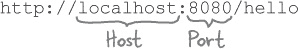

# 第十五章。响应请求：Web 应用程序


**这是 21 世纪。用户需要 Web 应用程序。** Go 在这方面有所覆盖！Go 标准库包含的包可以帮助您托管自己的 Web 应用程序，并使它们可以从任何 Web 浏览器访问。因此，我们将在本书的最后两章中向您展示如何构建 Web 应用程序。

您的 Web 应用程序需要的第一件事是在浏览器发送请求时能够做出响应。在本章中，我们将学习使用`net/http`包来实现这一点。

# 使用 Go 编写 Web 应用程序

在终端上运行的应用程序对于个人使用非常棒。但普通用户已经被互联网和万维网宠坏了。他们不想为了使用你的应用程序而学习使用终端。他们甚至不想安装你的应用程序。他们希望在他们点击浏览器中的链接时立即可以使用它。

但别担心！Go 也可以帮助您编写 Web 应用程序。


我们不会误导您——编写 Web 应用程序并不是一件小事。这将需要您迄今为止学到的所有技能，再加上一些新技能。但 Go 有一些出色的可用包，将使这个过程更容易！

这包括`net/http`包。HTTP 代表“**H**yper**T**ext **T**ransfer **P**rotocol”，它用于 Web 浏览器和 Web 服务器之间的通信。使用`net/http`，您将能够使用 Go 创建自己的 Web 应用程序！

# 浏览器、请求、服务器和响应

当您在浏览器中输入 URL 时，实际上是发送了对 Web 页面的*请求*。该请求发送到一个*服务器*。服务器的工作是获取适当的页面并将其发送回浏览器作为*响应*。

在 Web 的早期阶段，服务器通常会读取服务器硬盘上 HTML 文件的内容，并将该 HTML 返回给浏览器。


但今天，服务器通常与一个*程序*通信来满足请求，而不是从文件中读取。这个程序可以用几乎任何您想要的语言编写，包括 Go！


# 一个简单的 Web 应用程序

处理来自浏览器的请求是一项大量的工作。幸运的是，我们不必自己处理所有工作。回到第十三章，我们使用`net/http`包向服务器发出请求。`net/http`包还包括一个小型的 Web 服务器，因此它也能够*响应*请求。我们唯一需要做的就是编写代码，填充这些响应数据。

这里有一个使用`net/http`来向浏览器提供简单响应的程序。虽然程序很简短，但其中有很多新东西。我们将首先运行程序，然后逐步解释它。


将上述代码保存到任意文件中，并使用**`go run`**命令在终端中运行：


我们正在运行我们自己的 Web 应用程序！现在我们只需要连接一个 Web 浏览器并测试它。打开你的浏览器，将这个 URL 键入地址栏。（如果这个 URL 看起来有点奇怪，不要担心；我们马上解释它的含义。）

```go
http://localhost:8080/hello
```

浏览器将向应用程序发送请求，应用程序将回复“`Hello, web!`”。我们刚刚向浏览器发送了第一个响应！

应用程序会继续监听请求，直到我们停止它。当您完成页面时，在终端中按下 Ctrl-C 以向程序发出退出信号。


# 您的计算机正在自我通信

当我们启动我们的小型 Web 应用程序时，它会在您的计算机上启动自己的 Web 服务器。


因为该应用程序正在您的计算机上运行（而不是在互联网上的某个地方），所以我们在 URL 中使用特殊的主机名`localhost`。这告诉您的浏览器需要从您的计算机建立连接*到*同一台计算机。



我们还需要在 URL 中指定一个端口。（*端口*是应用程序可以监听消息的编号网络通信通道。）在我们的代码中，我们指定服务器应在端口 8080 上监听，所以我们在 URL 中包含它，跟在主机名后面。


# 没有愚蠢的问题

**Q:** 我收到一个错误，说浏览器无法连接！

**A:** 你的服务器可能实际上没有运行。在你的终端中查找错误消息。还要检查浏览器中的主机名和端口号，以防输错。

**Q:** 为什么我在 URL 中必须指定端口号？我在访问其他网站时不必这样做！

**A:** 大多数 Web 服务器在端口 80 上监听 HTTP 请求，因为这是 Web 浏览器默认发出 HTTP 请求的端口。但是出于安全原因，许多操作系统要求您运行监听端口 80 的服务时需要特殊权限。这就是为什么我们设置我们的服务器监听端口 8080 的原因。

**Q:** 我的浏览器显示“404 页面未找到”的消息。

**A:** 这是服务器的响应，这是好事，但也意味着你请求的资源未找到。检查你的 URL 是否以*/hello*结尾，并确保你在服务器程序代码中没有输错。

**Q:** 当我尝试运行我的应用程序时，我收到一个错误，说“listen tcp 127.0.0.1:8080: bind: 地址已在使用中”！

**A:** 你的程序试图监听与另一个程序相同的端口（这是你的操作系统不允许的）。你运行了服务器程序超过一次吗？如果是这样，在终端中完成操作后，确保停止旧的服务器。在运行新的服务器之前一定要停止旧的。

# 我们的简单 Web 应用程序，解释如下

现在让我们仔细看看我们小型 Web 应用程序的各个部分。

在`main`函数中，我们使用字符串`"/hello"`和`viewHandler`函数调用`http.HandleFunc`。（Go 支持*一等函数*，允许您将函数传递给其他函数。我们稍后会详细讨论这些。）这告诉应用程序在收到以`/hello`结尾的 URL 请求时调用`viewHandler`。


然后，我们调用`http.ListenAndServe`，启动 Web 服务器。我们将字符串`"localhost:8080"`传递给它，这将使它仅接受来自本机端口 8080 的请求。（当您准备向其他计算机的请求开放应用程序时，可以改用字符串`"0.0.0.0:8080"`。您也可以将端口号更改为其他值。）第二个参数中的`nil`值仅表示将使用通过`HandleFunc`设置的函数来处理请求。

###### 注意

（稍后，如果您想了解替代处理请求的其他方法，请查看“http”包中“ListenAndServe”函数、“Handler”接口和“ServeMux”类型的文档。）

我们在调用`HandleFunc`之后调用`ListenAndServe`，因为`ListenAndServe`会持续运行，除非遇到错误。如果有错误，它将返回该错误，我们在程序退出之前将其记录。但是，如果没有错误，此程序将继续运行，直到我们在终端中按下 Ctrl-C 来中断它。


与`main`相比，在`viewHandler`函数中没有什么特别出乎意料的地方。服务器将`viewHandler`传递给`http.ResponseWriter`，用于向浏览器响应写入数据，并传递给`http.Request`值的指针，表示浏览器的请求。（在此程序中，我们不使用`Request`值，但处理程序函数仍然必须接受它。）


在`viewHandler`内部，我们通过在`ResponseWriter`上调用`Write`方法向响应添加数据。`Write`方法不接受字符串，但它接受`byte`值的切片，因此我们将字符串`"Hello, web!"`转换为`[]byte`，然后传递给`Write`方法。


您可能还记得`byte`值来自第十三章。当在通过`http.Get`函数检索到的响应上调用`ioutil.Readall`函数时，该函数返回`byte`值的切片。


正如我们在第十三章中看到的，`[]byte`可以转换为`string`：


正如您刚刚在这个简单的 Web 应用程序中看到的那样，`string`可以转换为`[]byte`。


`ResponseWriter`的`Write`方法返回成功写入的字节数以及遇到的任何错误。我们无法使用写入的字节数做任何有用的事情，因此我们忽略它。但是，如果有错误，我们会将其记录并退出程序。

```go
_, err := writer.Write(message)
if err != nil {
        log.Fatal(err)
}
```

# 资源路径

当我们在浏览器中输入 URL 访问我们的 Web 应用时，我们确保它以*/hello*结尾。但是为什么我们需要这样做呢？

```go
http://localhost:8080/hello
```

服务器通常有许多不同的资源可发送到浏览器，包括 HTML 页面、图片等。


URL 中主机地址和端口后面的部分是资源*路径*。它告诉服务器你要操作它的哪个资源。`net/http` 服务器从 URL 的末尾提取路径，并在处理请求时使用它。


当我们在我们的 Web 应用程序中调用 `http.HandleFunc` 时，我们传递了字符串`"/hello"`和`viewHandler`函数。该字符串用作请求资源路径进行查找。从那时起，每当收到路径为`/hello`的请求时，应用程序将调用`viewHandler`函数。然后，`viewHandler`函数负责生成适合其收到的请求的响应。


在这种情况下，这意味着以文本“Hello, web!”作为响应。


你的应用程序不能仅仅对收到的每个请求响应“Hello, web!”。大多数应用程序将需要以不同方式响应不同的请求路径。

一种实现这一点的方法是为要处理的每个路径调用一次 `HandleFunc`，并提供一个不同的函数来处理每个路径。这样，您的应用程序将能够响应任何这些路径的请求。

# 对不同资源路径的不同响应

这是我们应用程序的更新，提供三种不同语言的问候语。我们调用了三次`HandleFunc`。具有`"/hello"`路径的请求将调用`englishHandler`函数，`"/salut"`的请求将由`frenchHandler`函数处理，而`"/namaste"`的请求将由`hindiHandler`处理。每个处理程序函数都将其`ResponseWriter`和字符串传递给新的`write`函数，该函数将字符串写入响应。


# 头等函数

当我们用处理函数调用 `http.HandleFunc` 时，并不是调用处理函数并将其结果传递给 `HandleFunc`。我们传递的是*函数本身*给 `HandleFunc`。该函数被存储起来，以便在接收到匹配请求路径时稍后调用。


Go 语言支持**头等函数**；也就是说，Go 中的函数被视为“头等公民”。

在支持头等函数的编程语言中，函数可以分配给变量，然后从这些变量调用。

下面的代码首先定义了一个 `sayHi` 函数。在我们的 `main` 函数中，我们声明了一个类型为 `func()` 的 `myFunction` 变量，这意味着该变量可以保存一个函数。

然后我们将 `sayHi` 函数本身分配给 `myFunction`。请注意，我们没有放任何括号 —— 我们不写 `sayHi()` —— 因为这样做会 *调用* `sayHi`。我们仅输入函数名，就像这样：

```go
myFunction = sayHi
```

这导致 `sayHi` 函数本身被分配给 `myFunction` 变量。

但在下一行，我们确实在 `myFunction` 变量名后面包含括号，像这样：

```go
myFunction()
```

这导致存储在 `myFunction` 变量中的函数被调用。


# 将函数传递给其他函数

具有一等公民函数的编程语言允许您将函数作为参数传递给其他函数。此代码定义了简单的 `sayHi` 和 `sayBye` 函数。它还定义了一个 `twice` 函数，该函数将另一个名为 `theFunction` 的函数作为参数。然后 `twice` 函数调用存储在 `theFunction` 中的任何函数两次。

在 `main` 中，我们调用 `twice` 并将 `sayHi` 函数作为参数传递，导致 `sayHi` 被运行两次。然后我们用 `sayBye` 函数再次调用 `twice`，导致 `sayBye` 被运行两次。


# 函数作为类型

当我们试图将 `sayHi` 函数作为参数传递给 `http.HandleFunc` 时，我们会得到编译错误：


函数的参数和返回值是其类型的一部分。持有函数的变量需要指定该函数应具有的参数和返回值。该变量只能持有参数和返回值数量与类型匹配的函数。

此代码定义了一个类型为 `func()` 的 `greeterFunction` 变量：它持有一个不接受参数并且不返回值的函数。然后，我们定义了一个类型为 `func(int, int) float64` 的 `mathFunction` 变量：它持有一个接受两个整数参数并返回一个 `float64` 值的函数。

代码还定义了 `sayHi` 和 `divide` 函数。如果我们将 `sayHi` 分配给 `greeterFunction` 变量，将 `divide` 分配给 `mathFunction` 变量，一切都能编译和正常运行：


但是如果我们尝试颠倒两者，将再次得到编译错误：


`divide` 函数接受两个 `int` 参数并返回一个 `float64` 值，因此无法存储在 `greeterFunction` 变量中（该变量期望不接受参数并且不返回值的函数）。而 `sayHi` 函数不接受参数并且不返回值，因此无法存储在 `mathFunction` 变量中（该变量期望接受两个 `int` 参数并返回一个 `float64` 值的函数）。

接受函数作为参数的函数也需要指定传入函数应具有的参数和返回类型。

这是一个具有 `passedFunction` 参数的 `doMath` 函数。传入的函数需要接受两个 `int` 参数，并返回一个 `float64` 值。

我们还定义了`divide`和`multiply`函数，两者都接受两个`int`参数并返回一个`float64`。`divide`或`multiply`都可以成功传递给`doMath`。


一个不符合指定类型的函数无法传递给`doMath`。


这就是为什么如果我们向`http.HandleFunc`传递错误的函数，我们会得到编译错误。`HandleFunc`期望传递一个接受`ResponseWriter`和`Request`指针作为参数的函数。如果传递其他内容，你将得到编译错误。

事实上，这是件好事。一个无法分析请求并写入响应的函数可能无法处理浏览器请求。如果尝试传递类型错误的函数，Go 将在程序编译之前提醒你问题。


# 池谜题


你的**工作**是从池中获取代码片段，并将它们放入此代码中的空白行。**不要**重复使用相同的片段，而且你不需要使用所有的片段。你的**目标**是创建一个能运行并产生所示输出的程序。


```go
func callFunction(passedFunction ________) {
       passedFunction()
}
func callTwice(passedFunction ________) {
       passedFunction()
       passedFunction()
}
func callWithArguments(passedFunction ________________) {
       passedFunction("This sentence is", false)
}
func printReturnValue(passedFunction func() string) {
       fmt.Println(____________________)
}

func functionA() {
       fmt.Println("function called")
}
func functionB() ________ {
       fmt.Println("function called")
       return "Returning from function"
}
func functionC(a string, b bool) {
       fmt.Println("function called")
       fmt.Println(a, b)
}

func main() {
       callFunction(___________)
       callTwice(___________)
       callWithArguments(functionC)
       printReturnValue(functionB)
}
```

**注意：每个池中的片段只能使用一次！**


 答案在“Pool Puzzle Solution”中。

# 接下来是什么

现在你知道如何从浏览器接收请求并发送响应了。最棘手的部分已经完成！


在最后一章，我们将利用这些知识构建一个更复杂的应用程序。

到目前为止，我们所有的响应都是使用纯文本。我们将学习如何使用 HTML 来为页面提供更多结构。并且我们将学习如何使用`html/template`包在将数据插入 HTML 后将其发送回浏览器。到那里见！

# 你的 Go 工具箱


**这就是第十五章的全部内容！你已经向你的工具箱中添加了 HTTP 处理程序函数和一流函数。**


# 池谜题解决方案


