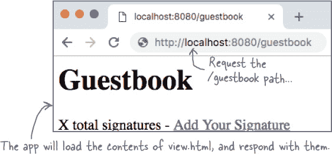
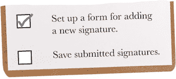
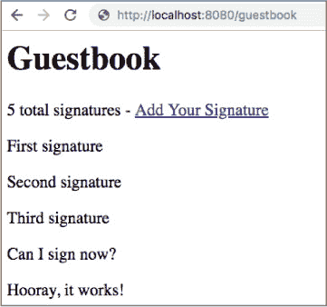

# 第十六章：一个遵循的模式：HTML 模板

**您的 Web 应用程序需要用 HTML 来响应，而不是纯文本。** 纯文本对于电子邮件和社交媒体帖子来说很好。但您的页面需要格式。它们需要标题和段落。它们需要表单，用户可以向您的应用程序提交数据。为了做到这些，您需要 HTML 代码。

最终，您将需要将数据插入到 HTML 代码中。这就是为什么 Go 提供了`html/template`包的原因，这是一种强大的方式，可以将数据包含到您应用程序的 HTML 响应中。模板是构建更大、更好的 Web 应用程序的关键，在这最后一章中，我们将向您展示如何使用它们！

# 一个留言板应用程序

让我们把我们在第十五章中学到的东西用起来。我们将为网站构建一个简单的留言板应用程序。您的访客将能够在表单中输入消息，并将其保存到文件中。他们还可以查看以前所有签名的列表。

在我们能让这个应用程序正常工作之前，还有很多内容需要覆盖，但不要担心——我们将把这个过程分解成小步骤。让我们看看将涉及哪些内容……

我们需要设置我们的应用程序，并使其响应主留言板页面的请求。这部分不会太难；我们已经在前一章中覆盖了所有需要了解的内容。

然后，我们需要在响应中包含 HTML。我们将创建一个简单的页面，只使用几个 HTML 标签，并将其存储在文件中。然后我们将从文件中加载 HTML 代码，并在我们应用程序的响应中使用它。

我们需要获取访客输入的签名，并将它们合并到 HTML 中。我们将向您展示如何使用`html/template`包来完成这一操作。

然后，我们需要创建一个单独的页面，用于添加签名的表单。我们可以使用 HTML 相当容易地完成这个任务。

最后，当用户提交表单时，我们需要将表单内容保存为新的签名。我们将其保存到文本文件中，并与所有其他提交的签名一起加载回来。

# 处理请求和检查错误的函数

我们的第一个任务将是显示主留言板页面。通过编写示例 Web 应用程序的实践，这应该不会太难。在我们的`main`函数中，我们将调用`http.HandleFunc`并设置应用程序，以便为路径为`"/guestbook"`的任何请求调用名为`viewHandler`的函数。然后，我们将调用`http.ListenAndServe`来启动服务器。

目前，`viewHandler`函数看起来与我们之前示例中的处理程序函数完全相同。它接受一个`http.ResponseWriter`和一个`http.Request`的指针，就像之前的处理程序一样。我们将一个字符串转换为`[]byte`，并使用`ResponseWriter`的`Write`方法将其添加到响应中。

`check`函数是此代码中唯一真正新的部分。在这个 Web 应用程序中，我们可能会有很多潜在的`error`返回值，并且我们不想在每个地方重复代码来检查和报告它们。因此，我们将每个错误传递给我们的新`check`函数。如果`error`为 nil，则`check`什么也不做，但否则它会记录错误并退出程序。

在`ResponseWriter`上调用`Write`可能会返回错误，所以我们将`error`返回值传递给`check`。注意，我们*不会*将`error`返回值从`http.ListenAndServe`传递给`check`。这是因为`ListenAndServe`总是返回一个错误。（如果没有错误，`ListenAndServe`永远不会返回。）由于我们知道这个错误永远不会是`nil`，我们只是立即在其上调用`log.Fatal`。

# 设置项目目录并尝试应用程序

对于这个项目，我们将创建几个文件，因此您可能希望花一点时间创建一个新目录来保存它们。（它不必在您的 Go 工作区目录内。）将前述代码保存在此目录中，文件名为*guestbook.go*。

让我们试着运行它。在您的终端中，切换到保存*guestbook.go*的目录，并使用**`go run`**运行它。

然后在浏览器中访问此 URL：

`*[`localhost:8080/guestbook`](http://localhost:8080/guestbook)*`

与先前应用程序的 URL 相同，只是在末尾加上了*/guestbook*路径。您的浏览器将向应用程序发出请求，应用程序将以我们的占位文本作出响应：

我们的应用现在正在响应请求。我们的第一个任务完成了！

虽然我们只是使用纯文本进行响应。接下来，我们将使用 HTML 格式化我们的响应。

# 在 HTML 中创建签名列表

到目前为止，我们只是向浏览器发送了一些文本片段。我们需要实际的 HTML，以便对页面应用格式。HTML 使用标签对文本应用格式。

如果您以前没有编写 HTML，不用担心；随着我们的进展，我们将涵盖基础知识！

在与*guestbook.go*相同的目录中，将下面的 HTML 代码保存在名为*view.html*的文件中。

这个文件中使用的 HTML 元素如下：

+   `<h1>`：一级标题。通常显示为大号加粗文本。

+   `
`：分割元素。单独使用时不直接可见，但用于将页面分割为各个部分。

+   `
`：段落文本。我们将每个签名视为独立的段落。

+   `<a>`：代表“锚点”。创建一个链接。

现在，让我们尝试在浏览器中查看 HTML。启动您喜欢的网络浏览器，从菜单中选择“打开文件…”，并打开您刚刚保存的 HTML 文件。

注意页面上的元素如何与 HTML 代码对应。每个元素都有一个开放标签（`<h1>`，`
`，`
`等），以及相应的闭合标签（`</h1>`，`
`，`
`等）。在开放和闭合标签之间的任何文本将用作页面上元素的内容。元素还可以包含其他元素（就像此页面上的`
`元素一样）。

如果您愿意，可以单击链接，但现在只会产生“页面未找到”错误。在我们修复这个问题之前，我们需要弄清楚如何通过我们的 Web 应用程序提供此 HTML...

# 使我们的应用程序响应 HTML

当我们直接从*view.html*文件加载 HTML 到浏览器时，我们的 HTML 可以正常工作，但我们需要通过应用程序提供它。让我们更新我们的*guestbook.go*代码以响应我们创建的 HTML。

Go 提供了一个包，可以从文件中加载 HTML 并为我们插入签名：`html/template`包。现在，我们将加载*view.html*的内容，插入签名将是我们的下一步。

我们需要更新`import`语句以添加`html/template`包。我们需要做的唯一其他更改是在`viewHandler`函数内部。我们将调用`template.ParseFiles`函数并传递要加载的文件名：`"view.html"`。这将使用*view.html*的内容创建一个`Template`值。`ParseFiles`将返回指向此`Template`的指针，可能还会返回一个`error`值，我们将其传递给我们的`check`函数。

要从`Template`值获取输出，我们调用其`Execute`方法并传入两个参数... 我们将我们的`ResponseWriter`值传递为写入输出的位置。第二个值是我们想要插入模板中的数据，但由于我们现在不插入任何内容，所以我们只传递`nil`。

我们很快将学习更多关于`html/template`包的知识，但现在让我们看看这是否有效。在终端中运行*guestbook.go*。（确保在运行此命令时您在项目目录中，否则`ParseFiles`函数将无法找到*view.html*。）

在浏览器中，返回到以下 URL：

*[`localhost:8080/guestbook`](http://localhost:8080/guestbook)*

您应该看到来自*view.html*的 HTML，而不是“签名列表在这里”占位符。

# “text/template”包

我们的应用程序正在响应我们的 HTML 代码。这是两个任务完成了！

不过，目前我们只显示了一个硬编码的占位符签名列表。我们下一个任务将是使用`html/template`包将签名列表插入到 HTML 中，当列表更改时将更新。

`html/template` 包基于 `text/template` 包。你几乎完全相同的方式使用这两个包，但 `html/template` 添加了一些必要的安全功能，用于处理 HTML。让我们先学习如何使用 `text/template` 包，稍后再将我们所学的应用到 `html/template` 包上。

下面的程序使用 `text/template` 来解析并打印一个模板字符串。它将输出打印到终端，因此您不需要使用浏览器来尝试它。

在 `main` 函数中，我们调用 `text/template` 包的 `New` 函数，它返回一个指向新 `Template` 值的指针。然后我们在 `Template` 上调用 `Parse` 方法，并传递字符串 `"Here's my template!\n"`。`Parse` 使用其字符串参数作为模板的文本，不同于 `ParseFiles` 从文件加载模板文本。`Parse` 返回模板和一个 `error` 值。我们将模板存储在 `tmpl` 变量中，并将 `error` 传递给一个 `check` 函数（与 *guestbook.go* 中的函数相同），以报告任何非 `nil` 错误。

然后我们在 `tmpl` 中调用 `Template` 值的 `Execute` 方法，就像在 *guestbook.go* 中一样。不过，这次我们将 `os.Stdout` 作为输出位置传递。这会导致程序运行时将 `"Here's my template!\n"` 模板字符串显示为输出。

# 使用 `io.Writer` 接口和模板的 `Execute` 方法

`os.Stdout` 值是 `os` 包的一部分。`Stdout` 代表“标准输出”。它的行为类似于文件，但将写入到它的任何数据都输出到终端，而不是保存到磁盘。（像 `fmt.Println`、`fmt.Printf` 等函数在后台写入数据到 `os.Stdout`。）

`http.ResponseWriter` 和 `os.Stdout` 如何都能作为 `Template.Execute` 的有效参数？让我们查看它的文档...

哦，这里说 `Execute` 的第一个参数应该是一个 `io.Writer`。那是什么？让我们查一下 `io` 包的文档：

看起来 `io.Writer` 是一个接口！它可以由任何具有接受 `byte` 值切片并返回写入的字节数和一个 `error` 值的 `Write` 方法满足。

# `ResponseWriters` 和 `os.Stdout` 都满足 `io.Writer` 接口。

我们已经看到 `http.ResponseWriter` 值有一个 `Write` 方法。我们在几个早期的示例中使用了 `Write`：

原来 `os.Stdout` 值也有一个 `Write` 方法！如果你向它传递一个 `byte` 值的切片，这些数据将被写入终端：

这意味着 `http.ResponseWriter` 值和 `os.Stdout` 都满足 `io.Writer` 接口，并且可以传递给 `Template` 值的 `Execute` 方法。`Execute` 方法会调用传递给它的值的 `Write` 方法来输出模板。

如果你传入一个`http.ResponseWriter`，意味着模板将被写入到 HTTP 响应中。如果你传入`os.Stdout`，意味着模板将被写入到终端的输出中：

# 使用动作向模板插入数据

`Template`值的`Execute`方法的第二个参数允许你传入要插入模板的数据。它的类型是空接口，意味着你可以传入任何类型的值。

到目前为止，我们的模板尚未提供任何插入数据的位置，因此我们一直使用`nil`作为数据值：

要在模板中插入数据，你需要在模板文本中添加**动作**。动作用双花括号`{{ }}`表示。在双花括号内部，你可以指定要插入的数据或者模板执行的操作。每当模板遇到一个动作时，它会评估其内容，并将结果插入到模板文本中，取代动作本身。

在动作内部，你可以使用一个句点引用传递给`Execute`方法的数据值，称为“dot”。

这段代码设置了一个带有单个动作的模板。然后它多次调用模板的`Execute`方法，每次使用不同的数据值。`Execute`在将结果写入`os.Stdout`之前，将动作替换为数据值。

还有许多其他可以使用模板动作实现的功能。让我们设置一个`executeTemplate`函数，让我们更轻松地进行实验。它将接受一个模板字符串，我们将其传递给`Parse`以创建新模板，并接受一个数据值，我们将其传递给该模板的`Execute`方法。与之前一样，每个模板将被写入到`os.Stdout`中。

正如前文提到的，你可以使用一个句点来引用“dot”，即模板正在处理的数据中的当前值。虽然句点的值在模板内的不同上下文中可能会改变，但最初它指的是传递给`Execute`的值。

# 使用“if”动作使模板的部分内容成为可选项

在`{{if}}`动作及其对应的`{{end}}`标记之间的模板部分仅在条件为真时才会包含。在此示例中，我们执行相同的模板文本两次，一次是在`dot`为`true`时，一次是在`dot`为`false`时。由于`{{if}}`动作的存在，只有在`dot`为`true`时，“Dot is true!”文本才会包含在输出中。

# 使用“range”动作重复模板的部分内容

在`{{range}}`动作及其对应的`{{end}}`标记之间的模板部分将根据数组、切片、映射或通道中收集的每个值重复。该部分内的任何动作也将被重复。

在重复的部分内，dot 的值将设置为集合中的当前元素，允许您将每个元素包含在输出中或对其进行其他处理。

这个模板包括一个`{{range}}`动作，将会输出切片中的每个元素。循环之前和之后，dot 的值将是切片本身。但是在循环*内部*，dot 指的是切片的当前元素。你会在输出中看到这一点。

这个模板处理一个`float64`值的切片，它会将其显示为价格列表。

如果提供给`{{range}}`动作的值为空或`nil`，则循环将不会运行：

# 使用动作将结构体字段插入模板

当执行模板时，简单类型通常无法保存填充模板所需的各种信息。在这种情况下，使用结构体类型更为常见。

如果 dot 中的值是一个结构体，那么接下来一个带有 dot 和字段名的动作将在模板中插入该字段的值。在这里，我们创建了一个`Part`结构体类型，然后设置了一个模板，该模板将输出`Part`值的`Name`和`Count`字段：

最后，在下面我们声明了一个`Subscriber`结构体类型和一个打印它们的模板。该模板将无论如何输出`Name`字段，但是它使用`{{if}}`动作仅在`Active`字段设置为`true`时才输出`Rate`字段。

在这里，你可以使用模板做很多其他事情，我们这里没有足够的空间来覆盖它们所有。要了解更多，请查阅`text/template`包的文档：

# 从文件中读取签名切片

现在我们知道如何将数据插入模板，我们几乎可以将签名插入到访客留言板页面中了。但是首先，我们需要一些可以插入的签名。

在你的项目目录中，保存几行文本到一个名为*signatures.txt*的纯文本文件中。这些暂时将作为我们的“签名”。

现在我们需要能够将这些签名加载到我们的应用程序中。在*guestbook.go*中，添加一个新的`getStrings`函数。这个函数的工作方式类似于我们在第七章中编写的`datafile.GetStrings`函数，它会读取文件并将每一行追加到一个字符串切片中，然后返回这个切片。

但是也有一些区别。首先，新的`getStrings`将依赖我们的`check`函数来报告错误，而不是直接返回它们。

第二，如果文件不存在，`getStrings`将会返回`nil`而不是报告错误，而是通过将从`os.Open`获取的任何`error`值传递给`os.IsNotExist`函数来做到这一点，如果错误指示文件不存在，则该函数将返回`true`。

我们还将对`viewHandler`函数进行小小的更改，添加一个调用`getStrings`的调用以及一个临时的`fmt.Printf`调用，以显示从文件加载的内容。

让我们试试`getStrings`函数。在您的终端中，切换到项目目录，并运行*guestbook.go*。在浏览器中访问*[`localhost:8080/guestbook`](http://localhost:8080/guestbook)*，这样就会调用`viewHandler`函数。它将调用`getStrings`，后者将加载并返回包含*signatures.txt*内容的切片。

# 没有愚蠢的问题

**Q：如果`signatures.txt`文件不存在，并且`getStrings`返回`nil`，会导致渲染模板时出现问题吗？**

**A:** 没有必要担心。就像我们已经在`append`函数中看到的那样，Go 中的其他函数通常会将`nil`切片和映射视为为空。例如，如果传递了`nil`切片，`len`函数会简单地返回`0`：

并且模板操作也将`nil`的切片和映射视为为空。正如我们所学的那样，例如，`{{range}}`操作如果给定了`nil`值，将简单地跳过输出其内容。因此，`getStrings`返回一个`nil`切片而不是一个切片将是合适的；如果从文件中没有加载任何签名，模板将跳过输出任何签名。

# 一个结构体来保存签名和签名计数

现在，我们可以将这些签名的切片直接传递给我们的 HTML 模板的`Execute`方法，并将签名插入模板中。但是我们还希望我们的主留言簿页面显示接收到的签名的*数量*，以及签名本身。

我们只能将一个值传递给模板的`Execute`方法。因此，我们需要创建一个结构类型，它将包含签名的总数以及签名本身的切片。

在*guestbook.go*文件的顶部附近，添加一个新的声明，用于新的`Guestbook`结构类型。它应该有两个字段：一个`SignatureCount`字段来保存签名的数量，和一个`Signatures`字段来保存签名本身的切片。

现在，我们需要更新`viewHandler`函数，以创建一个新的`Guestbook`结构，并将其传递给模板。首先，我们不再需要显示`signatures`切片内容的`fmt.Printf`调用，所以删除它（您还需要从`import`部分删除`"fmt"`）。然后，创建一个新的`Guestbook`值。将其`SignatureCount`字段设置为`signatures`切片的长度，并将其`Signatures`字段设置为`signatures`切片本身。最后，我们需要将数据实际传递给模板。因此，将作为`Execute`方法第二个参数传递的数据值从`nil`更改为我们的新`Guestbook`值。

# 更新我们的模板以包含我们的签名

现在让我们更新 *view.html* 中的模板文本以显示签名列表。

我们将 `Guestbook` 结构体传递给模板的 `Execute` 方法，因此在模板中，点号代表了 `Guestbook` 结构体。在第一个 `div` 元素中，用 `X total signatures` 中的 `X` 占位符替换为插入 `Guestbook` 的 `SignatureCount` 字段的操作：`{{.SignatureCount}}`。

第二个 `div` 元素包含一系列 `p`（段落）元素，每个签名对应一个。使用 `range` 操作循环遍历 `Signatures` 切片中的每个签名：`{{range .Signatures}}`。（不要忘记在 `div` 元素结束之前加上对应的 `{{end}}` 标记。）在 `range` 操作中，包含一个 `p` HTML 元素，并在其中输出点号的嵌套内容：`
{{.}}
`。请记住，点号会依次设置为切片中的每个元素，因此这将导致为切片中的每个签名输出一个 `p` 元素，其内容设置为该签名的文本。

最后，我们可以使用包含数据的模板进行测试！重新启动 *guestbook.go* 应用程序，并再次在浏览器中访问 *[`localhost:8080/guestbook`](http://localhost:8080/guestbook)*。响应应该显示您的模板。顶部应显示总签名数，并且每个签名应出现在其自己的 `
` 元素中！

# 没有愚蠢的问题

**Q: 你提到 `html/template` 包有一些“安全功能”。它们是什么？**

**A:** `text/template` 包将值原样插入模板中，无论其包含什么内容。但这意味着访问者可以添加 HTML 代码作为“签名”，并且它将被视为页面 HTML 的一部分。

您可以自行尝试。在 *guestbook.go* 中，将 `html/template` 导入更改为 `text/template`。（您不需要更改任何其他代码，因为这两个包中所有函数的名称都相同。）然后，在您的 *signatures.txt* 文件中添加以下内容作为新行：

``

这是一个包含 JavaScript 代码的 HTML 标签。如果你尝试运行该应用并重新加载签名页面，你会看到一个烦人的警报弹出，因为`text/template`包直接将这段代码包含在页面中。

现在回到 *guestbook.go*，将导入改回`html/template`，然后重新启动应用。如果重新加载页面，你将在页面中看到与上述脚本标签完全相同的文本。

但这是因为 `html/template` 包自动“转义”了 HTML，用导致它被视为 HTML 的字符替换为导致它显示在页面文本中的代码（这样是安全的）。以下是实际插入响应的内容：

`&lt;script&gt;alert(&#34;hi!&#34;);&lt;/script&gt;`

像这样插入脚本标签只是不良用户可以将恶意代码插入到您的网页中的众多方式之一。`html/template` 包使得防范这种以及许多其他攻击变得简单！

# 让用户使用 HTML 表单添加数据

又完成了另一个任务。我们接近尾声：只剩下两个任务！

接下来，我们需要允许访客添加他们自己的签名。我们需要创建一个 HTML *form*，让他们可以输入签名。表单通常提供一个或多个用户可以输入数据的字段，并提供一个提交按钮，让他们可以将数据发送到服务器。

在项目目录中，创建一个名为 *new.html* 的文件，并包含以下 HTML 代码。这里有一些我们以前没有见过的标签：

+   **`<form>`**: 此元素包含所有其他表单组件。

+   **`<input>` 的 `type` 属性为 `"text"`**: 用户可以输入字符串的文本字段。它的 `name` 属性将用于标记发送到服务器数据中的字段值（类似于映射键）。

+   **`<input>` 的 `type` 属性为 `"submit"`**: 创建一个用户可以点击以提交表单数据的按钮。

如果我们在浏览器中加载此 HTML，它将如下所示：

# 响应 HTML 表单

我们在 *view.html* 中已经有一个指向 */guestbook/new* 路径的“添加您的签名”链接。单击此链接将带您到同一服务器上的新路径，所以这就像在输入此 URL 一样：

*[`localhost:8080/guestbook/new`](http://localhost:8080/guestbook/new)*

但是当前访问此路径只会响应错误“404 页面未找到”。我们需要设置应用程序，在用户点击链接时响应 *new.html* 中的表单。

在 *guestbook.go* 中，添加一个 `newHandler` 函数。它将类似于我们的 `viewHandler` 函数的早期版本。与 `viewHandler` 一样，`newHandler` 应该接受一个 `http.ResponseWriter` 和一个 `http.Request` 的指针作为参数。它应该对 *new.html* 文件调用 `template.ParseFiles`。然后，它应该调用 `Execute` 在生成的模板上，以便 *new.html* 的内容被写入 HTTP 响应。我们不会向此模板插入任何数据，因此将 `nil` 作为调用 `Execute` 的数据值传递进去。

然后，我们需要确保在点击“添加您的签名”链接时调用 `newHandler` 函数。在 `main` 函数中，添加另一个对 `http.HandleFunc` 的调用，并将 `newHandler` 设置为路径为 */guestbook/new* 的请求的处理函数。

如果我们保存上述代码并重新启动 *guestbook.go*，然后点击“添加您的签名”链接，我们将被带到 */guestbook/new* 路径。将调用 `newHandler` 函数，该函数将从 *new.html* 加载我们的表单 HTML 并包含在响应中。

# 表单提交请求

我们又完成了另一个任务。就剩一个了！

当有人访问*/guestbook/new*路径时，无论是直接输入还是点击链接，我们都会显示一个用于输入签名的表单。但如果你填写该表单并点击提交，将不会发生任何有用的事情。

浏览器将会再次请求*/guestbook/new*路径。`"signature"`表单字段的内容将作为一个看起来不好看的参数添加到 URL 的末尾。因为我们的`newHandler`函数不知道如何处理表单数据，所以它将被简单丢弃。

我们的应用可以响应请求以显示表单，但没有办法将表单数据提交回应用程序。在我们能保存访客签名之前，我们需要解决这个问题。

# 表单提交的路径和 HTTP 方法

实际上，提交表单需要向服务器发送*两个*请求：一个用于*获取*表单，另一个用于*发送*用户的输入数据回服务器。让我们更新表单的 HTML 以指定第二个请求应该发送到何处以及如何发送。

编辑*new.html*，并向`form`元素添加两个新的 HTML 属性。第一个属性`action`将指定提交请求的路径。我们不会让路径默认回到*/guestbook/new*，而是指定一个新路径：*/guestbook/create*。

我们还需要第二个名为`method`的属性，其值应为`"POST"`。

需要对这个`method`属性进行一点解释... HTTP 定义了几种请求可以使用的*方法*。虽然这些不同于 Go 值上的方法，但意义类似。GET 和 POST 是最常见的方法之一。

+   **GET**：当您的浏览器需要*从服务器获取*某些内容时使用，通常是因为您输入了一个 URL 或点击了一个链接。这可以是 HTML 页面、图像或其他资源。

+   **POST**：当您的浏览器需要*向服务器添加*一些数据时使用，通常是因为您提交了带有新数据的表单。

我们正在向服务器添加新数据：一个新的访客留言签名。所以看起来我们应该使用 POST 请求提交数据。

尽管如此，默认情况下表单使用 GET 请求提交。这就是为什么我们需要向`form`元素添加一个值为`"POST"`的`method`属性的原因。

现在，如果我们重新加载*/guestbook/new*页面并重新提交表单，请求将使用路径*/guestbook/create*。我们会得到一个“404 页面找不到”错误，但这是因为我们还没有为*/guestbook/create*路径设置处理程序。

表单数据现在不再附加在 URL 的末尾。这是因为表单是通过 POST 请求提交的。

# 从请求中获取表单字段的值

现在我们正在使用 POST 请求提交表单，表单数据嵌入在请求本身中，而不是作为参数附加到请求路径中。

让我们解决一下当表单数据提交到*/guestbook/create*路径时出现的“404 页面未找到”错误。在此过程中，我们还将看到如何从 POST 请求中访问表单数据。

像往常一样，我们将通过添加请求处理函数来完成这项工作。在*guestbook.go*的`main`函数中，调用`http.HandleFunc`，并将路径为`"/guestbook/create"`的请求分配给一个新的`createHandler`函数。

然后添加`createHandler`函数本身的定义。它应该接受一个`http.ResponseWriter`和一个指向`http.Request`的指针，就像其他处理函数一样。

与其他处理函数不同，`createHandler`旨在处理表单数据。可以通过传递给处理程序函数的`http.Request`指针访问该数据。（是的，在忽略了这么长时间的`http.Request`值后，我们终于可以使用一个了！）

现在，让我们先查看请求包含的数据。在`http.Request`上调用`FormValue`方法，并传递字符串`"signature"`。这将返回一个包含`"signature"`表单字段值的字符串。将其存储在名为`signature`的变量中。

让我们将字段值写入响应中，以便在浏览器中查看。在`http.ResponseWriter`上调用`Write`方法，并将`signature`传递给它（但首先要将其转换为字节片）。与往常一样，`Write`将返回写入的字节数和一个`error`值。我们将通过将其赋值为`_`来忽略字节数，并对`error`调用`check`。

让我们看看我们的表单提交是否成功到达了`createHandler`函数。重新启动*guestbook.go*，访问*/guestbook/new*页面，然后再次提交表单。

您将被带到*/guestbook/create*路径，而不是显示“404 页面未找到”错误，应用程序将用您在`"signature"`字段中输入的值作出响应！

如果愿意，可以点击浏览器的后退按钮返回*/guestbook/new*页面，并尝试不同的提交。无论输入什么内容，都将回显到浏览器中。

为 HTML 表单提交设置处理程序是一个重要的步骤。我们正在接近！

# 保存表单数据

我们的`createHandler`函数正在接收包含表单数据的请求，并能从中检索出来宾客签名。现在我们所需要做的就是在`createHandler`函数内部将该签名添加到我们的*signatures.txt*文件中。我们将在`createHandler`函数内部处理这个问题。

首先，我们将去掉对`ResponseWriter`的`Write`方法的调用；我们只需要确认我们可以访问签名表单字段。

现在，让我们添加下面的代码。`os.OpenFile` 函数以略有不同的方式调用，细节与编写 Web 应用程序无直接关系，因此我们不会在这里完全描述它。（如果您想了解更多信息，请参见 附录 A。）现在，您需要知道的是，此代码执行三个基本操作：

1.  它打开了 *signatures.txt* 文件，如果文件不存在则创建它。

1.  它在文件末尾添加一行文本。

1.  它关闭文件。

`fmt.Fprintln` 函数向文件添加一行文本。它接受要写入的文件和要写入的字符串（无需转换为 `[]byte`）作为参数。就像我们在本章前面看到的 `Write` 方法一样，`Fprintln` 返回成功写入文件的字节数（我们忽略），以及遇到的任何错误（我们传递给 `check` 函数）。

最后，我们在文件上调用 `Close` 方法。你可能注意到我们没有使用 `defer` 关键字。这是因为我们正在向文件写入，而不是从中读取。在写入文件后调用 `Close` 可能会导致错误，我们需要处理这些错误，如果使用 `defer` 就无法很容易地做到这一点。因此，我们简单地在常规程序流程中调用 `Close`，然后将其返回值传递给 `check`。

保存前面的代码并重新启动 *guestbook.go*。在 */guestbook/go* 页面上填写并提交表单。

现在你的浏览器会加载 */guestbook/create* 路径，这个路径现在显示为完全空白（因为 `createHandler` 不再向 `http.ResponseWriter` 写入任何内容）。

但是，如果你查看 *signatures.txt* 文件的内容，你会看到新的签名保存在末尾！

如果你访问 */guestbook* 上的签名列表，你会看到签名数增加了一条，并且新的签名出现在列表中！

# HTTP 重定向

我们的 `createHandler` 函数保存新的签名。还有一件事需要处理。当用户提交表单时，他们的浏览器会加载 */guestbook/create* 路径，显示一个空白页面。

在 */guestbook/create* 路径上没有有用的内容可供展示；它只是用来接受添加新签名请求的。相反，让我们让浏览器加载 */guestbook* 路径，这样用户就可以在访客留言板中看到他们的新签名。

在 `createHandler` 函数的结尾，我们将添加一个调用 `http.Redirect`，它向浏览器发送一个响应，指示其加载与请求的资源不同的资源。`Redirect` 的前两个参数是 `http.ResponseWriter` 和 `*http.Request`，因此我们将从 `createHandler` 的 `writer` 和 `request` 参数中获取它们的值。然后 `Redirect` 需要一个字符串，指定将浏览器重定向到的路径；我们将重定向到 `"/guestbook"`。

`Redirect`的最后一个参数需要是一个状态码，以便向浏览器发送。每个 HTTP 响应都需要包含一个状态码。到目前为止，我们的响应已经自动设置了它们的代码：成功的响应代码为 200（“OK”），对不存在页面的请求代码为 404（“Not found”）。不过，对于`Redirect`，我们需要指定一个代码，因此我们将使用常量`http.StatusFound`，这将导致重定向响应的状态为 302（“Found”）。

现在我们已经添加了`Redirect`的调用，提交签名表单应该像这样工作：

1.  浏览器向*/guestbook/create*路径提交了一个 HTTP POST 请求。

1.  应用程序响应并重定向到*/guestbook*。

1.  浏览器发送了一个 GET 请求，用于*/guestbook*路径。

# 让我们试试所有功能！

让我们看看重定向是否有效！重新启动*guestbook.go*，并访问*/guestbook/new*路径。填写表单并提交。

应用程序将表单内容保存到*signatures.txt*，然后立即将浏览器重定向到*/guestbook*路径。当浏览器请求*/guestbook*时，应用程序将加载更新的*signatures.txt*文件，并且用户将在列表中看到他们的新签名！

我们的应用程序正在保存从表单提交的签名，并与所有其他签名一起显示。我们的所有功能都已完成。

需要很多组件才能使所有这些工作正常运行，但现在您拥有了一个可用的 Web 应用程序！

# 我们的完整应用程序代码

我们的应用程序代码已经变得如此之长，我们只能逐步查看它。让我们再花一点时间将所有代码放在一起看看吧！

*guestbook.go*文件占据了应用程序代码的大部分。（在一个旨在广泛使用的应用程序中，我们可能已将一些此代码拆分为多个包和源文件，位于我们的 Go 工作区目录中，如果您愿意，您也可以这样做。）我们已经浏览并添加了对`Guestbook`类型和每个函数的注释。

*view.html*文件为签名列表提供 HTML 模板。模板操作提供了插入签名数量以及整个签名列表的位置。

*new.html*文件只是包含用于新签名的 HTML 表单。不会向其中插入任何数据，因此不存在模板操作。

就是这样——一个完整的 Web 应用程序，可以存储用户提交的签名，并稍后再次检索它们！

编写 Web 应用程序可能很复杂，但`net/http`和`html/template`包利用 Go 的力量使整个过程对您来说更加简单！

# 您的 Go 工具箱

**这就是第十六章的全部内容！您已经将模板添加到了您的工具箱中。**

