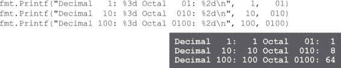

# 附录 A. 理解 os.openfile：打开文件


-   **有些程序需要向文件写入数据，而不仅仅是读取数据。** 在本书中，当我们想要处理文件时，你必须在文本编辑器中创建它们以供你的程序读取。但有些程序会*生成*数据，当它们这样做时，它们需要能够*写入*文件。

本书前面曾使用 `os.OpenFile` 函数来打开文件进行写入。但当时我们没有足够的空间来详细探讨它的工作原理。在这个附录中，我们将展示你在使用 `os.OpenFile` 时需要了解的一切！

# 理解 `os.OpenFile`

在第十六章中，我们必须使用 `os.OpenFile` 函数来打开一个文件进行写入，这要求一些看起来相当奇怪的代码：


当时，我们专注于编写 web 应用，所以我们没有太多时间来充分解释 `os.OpenFile`。但你在编写 Go 代码时几乎肯定会再次用到这个函数，因此我们添加了这个附录来更仔细地研究它。

当你试图弄清楚一个函数如何工作时，最好从它的文档开始。在你的终端中运行 **`go doc os OpenFile`**（或者在浏览器中搜索 `"os"` 包的文档）。


它的参数是一个 `string` 文件名，一个 `int` “flag”，以及一个 `os.FileMode` “perm”。很明显，文件名只是我们要打开的文件的名称。让我们先弄清楚这个“flag”意味着什么，然后再回头看 `os.FileMode`。

为了帮助保持附录中的代码示例简短，假设我们的所有程序都包含一个 `check` 函数，就像我们在第十六章中展示的那样。它接受一个 `error` 值，检查是否为 `nil`，如果不是，则报告错误并退出程序。


# 向 `os.OpenFile` 传递 flag 常量

描述中提到，flag 的一个可能值是 `os.O_RDONLY`。让我们查一下它的含义是什么...


根据文档，`os.O_RDONLY` 是几个 `int` 常量之一，用于传递给 `os.OpenFile` 函数，这些常量会改变函数的行为。

让我们尝试使用一些这些常量调用 `os.OpenFile`，看看会发生什么。

首先，我们需要一个要处理的文件。创建一个只有一行文本的纯文本文件。你可以将其保存在任何目录下，命名为 *aardvark.txt*。


然后，在相同的目录中，创建一个包含前一页的`check`函数和以下`main`函数的 Go 程序。在`main`中，我们使用`os.O_RDONLY`常量作为第二个参数调用`os.OpenFile`。（现在忽略第三个参数；稍后我们会讨论它。）然后我们创建一个`bufio.Scanner`并使用它来打印文件的内容。


在你的终端中，切换到保存了*aardvark.txt*文件和你的程序的目录，并使用**`go run`**来运行程序。它会打开*aardvark.txt*并输出其内容。


现在让我们尝试写入文件。更新你的`main`函数如下所示。（你还需要从`import`语句中删除未使用的包。）这次，我们将`os.O_WRONLY`常量传递给`os.OpenFile`，以便它打开文件进行写入。然后，我们将调用文件的`Write`方法，并传入要写入文件的字节片段。


如果运行程序，不会产生任何输出，但会更新*aardvark.txt*文件。但如果打开*aardvark.txt*，会发现程序不是在文件末尾追加文本，而是覆盖了文件的一部分！


这不是我们希望程序工作的方式。我们能做些什么？

哦，`os`包中还有一些其他可能会有所帮助的常量。这包括一个`os.O_APPEND`标志，应该会使程序将数据追加到文件末尾，而不是覆盖它。


但你不能单独将`os.O_APPEND`传递给`os.OpenFile`；如果尝试，会收到错误。


文档中提到了`os.O_APPEND`和`os.O_CREATE`“可以进行或操作”。这是指*二进制或*运算符。我们需要花几页的时间来解释它是如何工作的……

# 二进制表示法

在最低级别上，计算机必须使用简单的开关来表示信息，这些开关可以是开或关。如果使用一个开关来表示一个数字，你只能表示值`0`（开关“关闭”）或`1`（开关“打开”）。计算机科学家称之为*比特*。

如果将多个位组合起来，就能表示更大的数。这就是*二进制*表示法的思想。在日常生活中，我们最熟悉的是十进制表示法，它使用数字 0 到 9。但是二进制表示法只使用数字 0 和 1 来表示数值。

###### 注意

（如果你想了解更多，请在你喜爱的网络搜索引擎中输入“二进制”。）

你可以使用`fmt.Printf`和`%b`格式化动词查看各种数值的二进制表示（这些数值由位组成）：


# 位运算符

我们已经看到了`+`、`-`、`*`和`/`等运算符，它们允许你对整数进行数学运算。但 Go 语言还有**按位运算符**，允许你操作一个数字由哪些位组成。其中两个最常见的是按位与运算符`&`和按位或运算符`|`。

| 运算符 | 名称 |
| --- | --- |
| `&` | 按位与 |
| ` | ` | 按位或 |

# 按位与运算符

我们已经看到了`&&`运算符。它是一个布尔运算符，只有在其左边和右边的值都为`true`时才返回`true`：


然而，`&`运算符（只有一个和号）是一个*按位*运算符。它仅在其左侧值和右侧值的对应位都为`1`时才将该位设置为`1`。对于只需一个位表示的数字`0`和`1`来说，这是相当直接的：


然而，对于更大的数字，这可能看起来像是胡言乱语！


只有当你查看单个位的值时，按位操作才有意义。`&`运算符仅在左侧数字和右侧数字中相同位置的位都为`1`时，结果中的位才设置为`1`。


对于任意大小的数字都是如此。用于`&`运算符的两个值的位决定了结果值中相同位置的位。


# 按位或运算符

我们还看到了`||`运算符。它是一个布尔运算符，如果其左侧值或右侧值为`true`，则返回`true`。


`|`运算符会在结果中的位上设置为`1`，如果其左侧值或右侧值的相应位有一个为`1`。


就像按位与运算一样，按位或运算符也会查看它操作的两个值在特定位置的位，以决定结果中相同位置的位的值。


对于任意大小的数字都是如此。用于`|`运算符的两个值的位决定了结果值中相同位置的位。


# 在“os”包常量上使用按位或


**我们向你展示所有这些是因为你将需要使用按位或运算符来组合这些常量值！**

当文档说`os.O_APPEND`和`os.O_CREATE`值可以与`os.O_RDONLY`、`os.O_WRONLY`或`os.O_RDWR`值进行“或操作”时，意味着你应该在它们上面使用按位或运算符。

在幕后，这些常量实际上都是`int`值：


如果我们看一下这些值的二进制表示，我们会发现每个值只有一个位为`1`，而其他位都为`0`：


这意味着我们可以使用位或运算符结合这些值，而这些位不会互相干扰：


`os.OpenFile`函数可以检查第一位是否为`1`，以确定文件是否应为仅写入。如果第七位为`1`，`OpenFile`将知道在需要时创建文件。如果第十一位为`1`，`OpenFile`将在文件末尾追加。

# 使用位或修复我们的 os.OpenFile 选项

之前，当我们只传递`os.O_WRONLY`选项给`os.OpenFile`时，它覆盖了文件中已有数据的部分。让我们看看是否可以结合选项，使其追加新数据到文件末尾。

首先编辑*aardvark.txt*文件，使其再次只包含一行。


接下来，更新我们的程序，使用位或运算符将`os.O_WRONLY`和`os.O_APPEND`常量值组合成一个单独的值。将结果传递给`os.OpenFile`。


再次运行程序并查看文件的内容。你应该看到新添加的文本行追加到末尾。


让我们还尝试使用`os.O_CREATE`选项，这会导致`os.OpenFile`在文件不存在时创建指定的文件。首先删除*aardvark.txt*文件。


现在更新程序，将`os.O_CREATE`添加到传递给`os.OpenFile`的选项中。


当我们运行程序时，它将创建一个新的*aardvark.txt*文件，然后将数据写入其中。


# 类 Unix 风格的文件权限

我们一直在关注`os.OpenFile`的第二个参数，它控制文件的读取、写入、创建和追加。到目前为止，我们忽略了第三个参数，它控制文件的*权限*：即在程序创建文件后，哪些用户将被允许读取和写入该文件。


当开发人员谈论文件权限时，他们通常指的是类似 macOS 和 Linux 等类 Unix 系统上实现的权限。在 Unix 下，用户对文件可以有三种主要权限：

| 缩写 | 权限 |
| --- | --- |
| `r` | 用户可以**读取**文件的内容。 |
| `w` | 用户可以**写入**文件的内容。 |
| `x` | 用户可以执行文件。 （这仅适用于包含程序代码的文件。） |

如果用户对文件没有读取权限，例如，他们运行试图访问文件内容的任何程序将从操作系统获取错误：


如果用户对文件没有执行权限，他们将无法执行其中包含的任何代码。（不包含可执行代码的文件应*不*标记为可执行，因为试图运行它们可能会产生不可预测的结果。）


# 使用`os.FileMode`类型表示权限

Go 语言的`os`包使用`FileMode`类型来表示文件权限。如果文件不存在，你在调用`os.OpenFile`时传递给`FileMode`的值将决定文件创建时的权限，从而决定用户对文件的访问权限。

`FileMode`值有一个`String`方法，所以如果你将`FileMode`传递给`fmt.Println`等`fmt`包中的函数，你将得到该值的特殊字符串表示。该字符串显示了`FileMode`表示的权限，格式类似于你可能在 Unix 的`ls`实用程序中看到的格式。


```go
fmt.Println(os.FileMode(0700))
```

###### 注意

（如果你想了解更多信息，请在搜索引擎中搜索“Unix 文件权限”）

每个文件有三组权限，分别影响三类不同的用户。第一组权限仅适用于拥有文件的用户。（默认情况下，你创建的任何文件都属于你自己的用户帐户。）第二组权限适用于文件所分配的用户组。第三组权限适用于系统中既不是文件所有者也不是文件分配组的其他用户。


`FileMode`的底层类型是`uint32`，表示“32 位无符号整数”。这是一个我们之前没有讨论过的基本类型。因为它是无符号的，所以它不能表示任何负数，但是它可以在它的 32 位内存中表示比它能表示的更大的数值。

由于`FileMode`基于`uint32`，你可以使用类型转换将（几乎）任何非负整数转换为`FileMode`值。但是结果可能有点难以理解：


# 八进制表示法

实际上，指定整数转换为`FileMode`值时使用八进制表示法会更容易。我们已经看过十进制表示法，使用了 10 个数字：0 到 9。我们也看过二进制表示法，只使用了两个数字：0 和 1。八进制表示法使用了八个数字：0 到 7。

你可以使用`fmt.Printf`和`%o`格式化动词查看各种数字的八进制表示：


与二进制表示法不同，Go 语言允许你在程序代码中使用八进制表示法写入数字。任何以`0`开头的数字序列都会被视为八进制数。

如果你没有做好准备，这可能会让人感到困惑。十进制的`10`和八进制的`010`完全不同，十进制的`100`和八进制的`0100`也完全不同！



在八进制数中只有数字 0 到 7 是有效的。如果包含了 8 或 9，你将会得到编译错误。


# 将八进制值转换为 FileMode 值

那么为什么要使用这种（可以说有些奇怪的）八进制表示法来表示文件权限呢？因为八进制数的每一位可以用内存中的 3 位来表示：


三个位也正是存储一个用户类别（“用户”、“组”或“其他”）权限所需的确切数据量。您需要的任何用户类别的权限组合都可以用一个八进制数字表示！


注意下面的八进制数的二进制表示与相同数字的`FileMode`转换之间的相似性。如果二进制表示中的某位为`1`，则对应的权限被启用。


正因如此，Unix 的`chmod`实用程序（简称“change mode”）已经几十年来使用八进制数字设置文件权限。


| 八进制数字 | 权限 |
| --- | --- |
| `0` | 没有权限 |
| `1` | 执行 |
| `2` | 写入 |
| `3` | 写入、执行 |
| `4` | 读取 |
| `5` | 读取、执行 |
| `6` | 读取、写入 |
| `7` | 读取、写入、执行 |

Go 对八进制表示法的支持允许您在代码中遵循相同的约定！

# 对 os.OpenFile 的调用，解释

现在我们理解了位操作符和八进制表示法，我们终于能够理解`os.OpenFile`的调用所做的事情！

例如，这段代码将在现有的日志文件中追加新数据。拥有该文件的用户将能够从中读取和写入文件。所有其他用户只能从中读取。


并且这段代码将在文件不存在时创建一个文件，然后将数据追加到文件中。生成的文件将由其所有者可读和可写，但其他用户将无法访问它。


# 没有蠢问题

**Q: 八进制表示法和位操作符太麻烦了！为什么要这样做？**

**A:** 为了节省计算机内存！处理文件的这些约定根源于 Unix，在那时 RAM 和磁盘空间都更小更昂贵。但即使现在，当硬盘可以包含数百万个文件时，将文件权限压缩到几个位而不是几个字节可以节省大量空间（并使您的系统运行更快）。相信我们，这种努力是值得的！

**Q: `FileMode`字符串开头的那个额外的破折号是什么？**

**A:** 该位置上的破折号表示文件只是普通文件，但它可以显示几个其他值。例如，如果`FileMode`值表示一个目录，那么它将是`d`。


