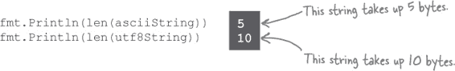
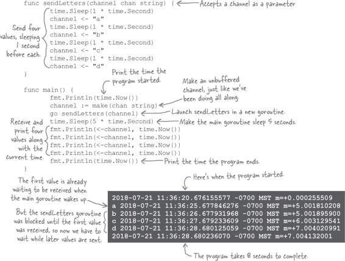

# 附录 B. 我们没有涵盖的六件事：剩余内容

**我们已经覆盖了很多内容，你离完成这本书只剩一点了。** 我们会想念你，但在让你离开去面对这个世界之前，我们觉得还是应该给你*一点*额外的准备。我们为这个附录留了六个重要的话题。

# #1 “if”语句的初始化语句

这里有一个`saveString`函数，它返回一个单一的`error`值（或者如果没有错误则为`nil`）。在我们的`main`函数中，我们可能会在处理之前将该返回值存储在一个`err`变量中：

现在假设我们在`main`函数中添加了另一个对`saveString`的调用，也使用了一个`err`变量。我们必须记住将第一次对`err`的使用作为短变量声明，并将后续的使用改为赋值语句。否则，由于尝试重新声明变量，我们将会得到编译错误。

但实际上，我们只在`if`语句及其块内使用`err`变量。如果有一种方法可以限制变量的作用域，使得我们可以将每个出现视为一个单独的变量，那该有多好呢？

还记得我们在第二章中首次介绍`for`循环时吗？我们说它们可以包含初始化语句，用于初始化变量。那些变量只在`for`循环的块内部有效。

类似于`for`循环，Go 语言允许在`if`语句中的条件之前添加初始化语句。初始化语句通常用于初始化一个或多个变量，以便在`if`块中使用。

在初始化语句内声明的变量的作用域仅限于`if`语句的条件表达式及其块中。如果我们重新编写之前的示例以使用`if`初始化语句，每个`err`变量的作用域将限制在`if`语句的条件和块内，这意味着我们将有两个完全独立的`err`变量。我们不需要担心哪个变量是首次定义的问题。

这种对范围的限制两面性很明显。如果一个函数有多个返回值，并且你需要其中一个*在*`if`语句内部和一个*在*外部，你可能无法在`if`初始化语句中调用它。如果尝试这样做，你会发现你需要的值在`if`块外部是不在范围内的。

相反，你需要在`if`语句之前像往常一样调用函数，以便它的返回值在`if`语句内部*和*外部都在范围内：

# #2 `switch`语句

当你根据表达式的值来执行多种操作时，会导致一堆`if`语句和`else`子句的混乱。`switch`语句是表达这些选择的更高效方式。

你写下`switch`关键字，后面跟上条件表达式。然后你可以添加几个`case`表达式，每个都是条件表达式可能具有的值。第一个与条件表达式匹配的`case`被选择，并且运行其包含的代码。其他的`case`表达式被忽略。你也可以提供一个`default`语句，如果没有`case`匹配，则运行该语句。

这是我们在第十二章中使用`if`和`else`语句编写的代码示例的重新实现。这个版本需要的代码明显更少。对于我们的`switch`条件，我们从`1`到`3`中选择一个随机数。我们为每个值提供了`case`表达式，每个表达式打印不同的消息。为了提醒我们理论上不可能的情况，即没有一个`case`匹配，我们还提供了一个`default`语句，它会导致 panic。

# 没有愚蠢的问题

**Q: 我看过其他语言，那里你必须在每个`case`的末尾提供“break”语句，否则会运行下一个`case`的代码。Go 语言不需要这样吗？**

**A:** 开发人员在其他语言中经常忘记“break”语句，导致 bug。为了避免这种情况，Go 语言会在`case`代码的末尾自动退出`switch`语句。

有一个`fallthrough`关键字，你可以在一个`case`中使用，如果你确实希望继续执行下一个`case`的代码。

# #3 更多基本类型

Go 语言还有其他基本类型我们没有讨论到。你可能不会在自己的项目中使用这些类型，但在一些库中会遇到，所以最好知道它们的存在。

| 类型 | 描述 |
| --- | --- |
| `int8 int16 int32 int64` | 这些类型与`int`一样，但它们在内存中有特定的大小（类型名称中的数字指定了位数）。较少的位数消耗更少的 RAM 或其他存储空间；更多的位数意味着可以存储更大的数值。除非有特定原因需要使用其中之一，否则应该使用`int`，这样更高效。 |
| `uint` | 这与`int`类似，但它只能存储*无符号*整数；不能存储负数。这意味着你可以在相同内存空间中存储更大的数值，前提是你确保这些值永远不会是负数。 |
| `uint8 uint16 uint32 uint64` | 这些也是无符号整数，但像`int`变体一样，在内存中占用特定位数。 |
| `float32` | `float64`类型表示浮点数，占用 64 位内存。这是其更小的 32 位版本。（浮点数没有 8 位或 16 位的变体。） |

# #4 关于符文的更多信息

我们在第一章中简要介绍了符文，之后就没有再详细讨论了。但是我们不希望结束本书而不多谈一点关于它们的细节...

在现代操作系统出现之前，大多数计算都是使用没有重音的英文字母表完成的，包括其大小写形式在内共 26 个字母。由于数量太少，每个字符可以由单个字节表示（还有 1 位空余）。一个名为 ASCII 的标准被用来确保在不同系统上相同的字节值转换为相同的字母。

当然，英文字母表并不是世界上唯一的书写系统；还有许多其他书写系统，有些拥有数千个不同的字符。Unicode 标准尝试创建一组可以表示每个不同书写系统中的每个字符（以及许多其他字符）的 *4 字节* 值。

Go 使用 `rune` 类型的值来表示 Unicode 值。通常，一个 `rune` 表示一个字符。（当然，也有例外情况，但这超出了本书的范围。）

Go 使用 UTF-8，这是一种标准，用于表示每个 Unicode 字符，每个字符使用 1 至 4 个字节。旧的 ASCII 集中的字符仍然可以使用单个字节表示；其他字符可能需要 2 至 4 个字节。

这里有两个字符串，一个是包含英文字母的，另一个是包含俄语字母的。

通常，您不需要担心字符存储的详细信息。也就是说，*直到* 您尝试将字符串转换为其组成的字节并返回。例如，如果我们尝试使用 `len` 函数来调用我们的两个字符串，则会得到非常不同的结果：

当您将字符串传递给 `len` 函数时，它会返回 *字节* 长度，而不是 *rune* 长度。英文字母表字符串适合 5 个字节 - 每个 `rune` 仅需要 1 个字节，因为它来自旧的 ASCII 字符集。但俄语字母表字符串却需要 10 个字节 - 每个 `rune` 需要 2 个字节来存储。

如果您想获得字符串的 *字符* 长度，您应该使用 `unicode/utf8` 包的 `RuneCountInString` 函数。此函数将返回正确的字符数，无论用于存储每个字符的字节数。

> **安全地处理部分字符串意味着将字符串转换为 `rune`，而不是字节。**

在本书之前，我们不得不将字符串转换为字节切片，以便将它们写入 HTTP 响应或终端。只要确保写入结果切片中的 *所有* 字节，这种方法就可以正常工作。但如果你试图处理结果切片中的 *部分* 字节，那就会麻烦不断。

下面是一些试图从前面字符串中剥离前三个字符的代码。我们将每个字符串转换为字节切片，然后使用切片操作符收集从第四个元素到切片末尾的所有内容。然后，我们将部分字节切片再转换回字符串并打印出来。

这在处理英文字母字符时效果很好，每个字符占用 1 字节。但是俄语字符每个占用*2 字节*。截取该字符串的前 3 个字节只会省略第一个字符和第二个字符的“一半”，导致一个不可打印字符。

Go 支持将字符串转换为`rune`值的切片，并从 rune 的切片转换回字符串。要处理部分字符串，应将其转换为`rune`值的切片，而不是字节值的切片。这样，您就不会意外地只抓取 rune 的部分字节。

这是一个更新后的代码，将字符串转换为`rune`片段而不是字节片段。我们的切片操作现在省略了每个切片的前三个*rune*，而不是前*3 个字节*。当我们将部分切片转换为字符串并打印它们时，我们只得到每个切片的最后两个（完整的）字符。

如果尝试使用字节片段处理字符串中的每个字符，会遇到类似的问题。只要您的字符串都是 ASCII 字符集中的字符，逐字节处理就可以。但是一旦出现需要 2 个或更多字节的字符，您将再次发现自己只处理了部分 rune 的字节。

此代码使用`for ... range`循环打印英文字母字符，每个字符 1 字节。然后尝试对俄文字母字符执行相同操作，每个字符 1 字节——但失败了，因为每个字符都需要 2 字节。

在 Go 中，您可以在字符串上使用`for...range`循环，它将逐个处理*rune*，而不是每次处理一个*字节*。这是一种更安全的方法。您提供的第一个变量将被分配为字符串中当前字节的索引（而不是 rune 的索引）。第二个变量将被分配为当前 rune。

这是上述代码的更新版本，使用`for...range`循环处理字符串本身，而不是它们的字节表示。您可以从输出中看到，处理英文字符时每次处理 1 字节，但处理俄文字符时每次处理*2 字节*。

Go 的 rune 使得在处理部分字符串时非常方便，并且无需担心它们是否包含 Unicode 字符。只需记住，每当您想处理字符串的一部分时，请将其转换为 rune，而不是字节！

# #5 有缓冲通道

Go 通道有两种类型：*无缓冲*和*有缓冲*。

到目前为止，我们向您展示的所有通道都是无缓冲的。当一个 goroutine 在无缓冲通道上发送一个值时，它立即阻塞，直到另一个 goroutine 接收该值。另一方面，有缓冲通道可以在导致发送 goroutine 阻塞之前保存一定数量的值。在适当的情况下，这可以提高程序的性能。

创建通道时，可以通过向`make`传递第二个参数来创建带缓冲的通道，该参数指定通道应在其缓冲区中能够容纳的值的数量。

当一个 goroutine 通过通道发送一个值时，该值被添加到缓冲区中。发送 goroutine 不会阻塞，而是继续运行。

发送 goroutine 可以继续向通道发送值，直到缓冲区满为止；只有在额外的发送操作导致 goroutine 阻塞时才会发生。

当另一个 goroutine 从通道接收一个值时，它从缓冲区中提取最早添加的值。

添加额外的接收操作将继续清空缓冲区，而添加额外的发送操作将重新填充缓冲区。

让我们尝试运行一个具有非缓冲通道的程序，然后将其更改为具有缓冲通道，以便您可以看到区别。下面，我们定义一个`sendLetters`函数作为一个 goroutine 运行。它向一个通道发送四个值，每个值之间睡眠 1 秒。在`main`中，我们创建一个非缓冲通道并将其传递给`sendLetters`。然后我们让`main` goroutine 睡眠 5 秒。

当`main` goroutine 醒来时，它从通道接收四个值。但`sendLetters` goroutine 被阻塞，等待`main`接收第一个值。因此，`main` goroutine 必须在每个剩余值之间等待 1 秒，直到`sendLetters` goroutine 赶上。

我们可以通过向通道添加单值缓冲区简单地加快程序运行速度。

当调用`make`时，只需添加第二个参数。与通道的交互除此之外完全相同，因此我们不必对代码进行其他更改。

当`sendLetters`向通道发送其第一个值时，它不会阻塞，直到`main` goroutine 接收它。发送的值放在通道的缓冲区中。只有当发送第二个值时（而尚未接收任何值），通道的缓冲区被填满，`sendLetters` goroutine 才会阻塞。向通道添加一个单值缓冲区可以减少程序运行时间 1 秒。

将缓冲区大小增加到`3`允许`sendLetters` goroutine 在不阻塞的情况下发送三个值。它在最后一个发送时阻塞，但这是在其所有 1 秒的`Sleep`调用完成之后。因此，当`main` goroutine 在 5 秒后唤醒时，它立即接收缓冲通道中等待的三个值，以及导致`sendLetters`阻塞的值。

这使得程序仅需 5 秒完成！

# #6 进一步阅读

这是本书的结尾。但这只是你作为 Go 程序员旅程的开端。我们想推荐一些资源，这些资源将帮助你在道路上前行。

***Head First Go 网站***

*[`headfirstgo.com/`](https://headfirstgo.com/)*  

这本书的官方网站。在这里，你可以下载我们所有的代码示例，练习额外的练习，并学习关于新主题的知识，所有内容都以同样易读且极具幽默感的文风编写！  

***Go 语言之旅***

*[`tour.golang.org`](https://tour.golang.org)*  

这是关于 Go 基本特性的互动教程。它涵盖了与本书大部分相同的内容，但包括一些额外的细节。在 Tour 中的示例可以直接在浏览器中编辑和运行（就像在 Go Playground 中一样）。  

***Effective Go***  

*[`golang.org/doc/effective_go.html`](https://golang.org/doc/effective_go.html)*  

由 Go 团队维护的关于如何编写符合社区约定的惯用 Go 代码的指南。  

***Go 博客***  

*[`blog.golang.org`](https://blog.golang.org)*  

官方的 Go 博客。提供有关使用 Go 的有用文章以及新版本和功能的公告。  

***包文档***  

*[`golang.org/pkg/`](https://golang.org/pkg/)*  

所有标准包的文档。这些文档与`go doc`命令提供的相同，但所有库都方便地列在一个列表中供浏览。`encoding/json`、`image` 和 `io/ioutil` 包可能是开始的有趣地方。  

***Go 语言编程***  

*[`www.gopl.io/`](https://www.gopl.io/)*  

这本书是这个页面上唯一不免费的资源，但是它是值得的。它众所周知且广泛使用。  

有两种技术书籍：教程类书籍（比如你手上的这本）和参考书籍（像*Go 语言编程*）。而这是一个很好的参考书籍：它涵盖了我们在这本书中没有空间的所有主题。如果你打算继续使用 Go，这本书是必读的。  
