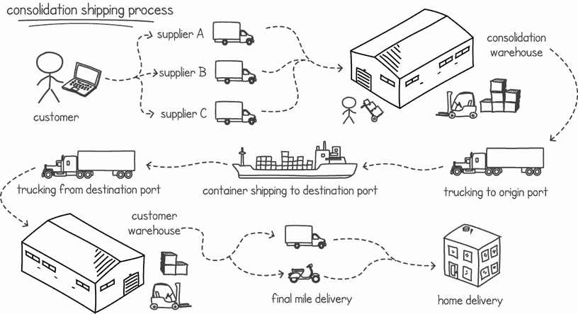
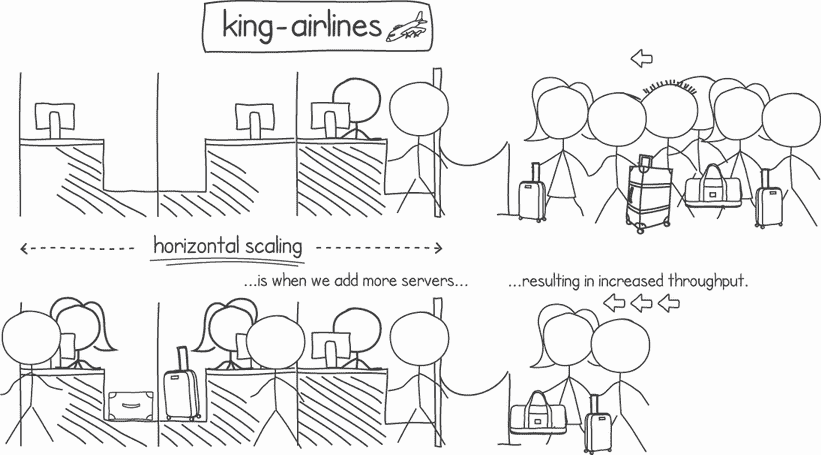
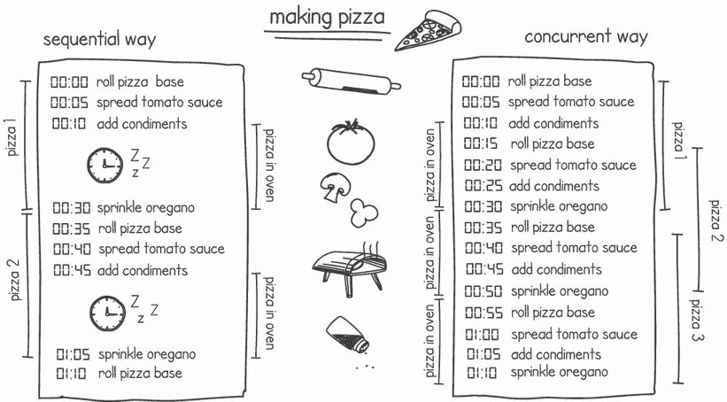
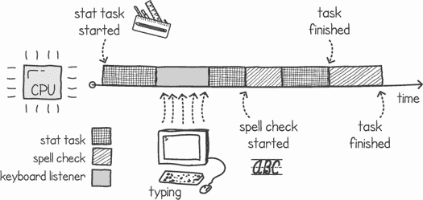
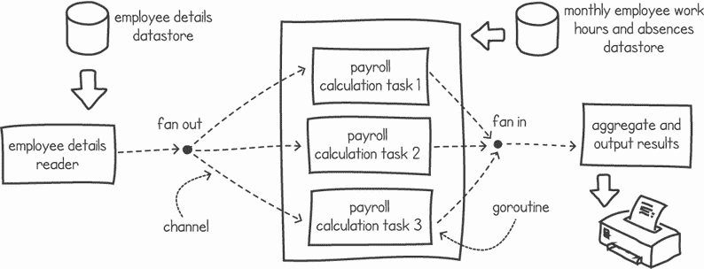
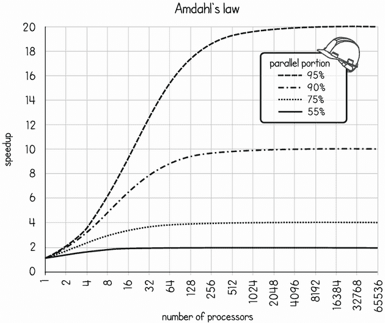
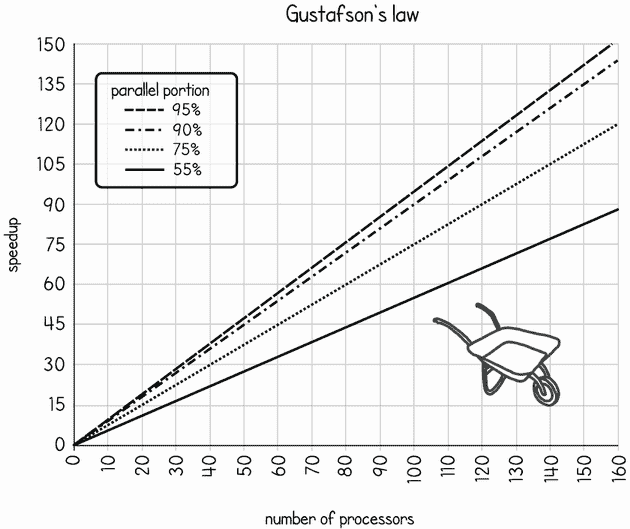

# 1 进入并发编程

本章涵盖

+   介绍并发编程

+   使用并发执行提高性能

+   扩展我们的程序

认识 Jane Sutton。Jane 已经在 HSS 国际会计师事务所担任软件开发者工作了三个月。在她的最新项目中，她一直在研究薪资系统中的一个问题。薪资软件模块在业务结束后运行于月底，并为 HSS 客户的员工计算所有薪资支付。Jane 的经理安排了与产品负责人、基础设施团队和一位销售代表的会议，试图找到问题的根源。出乎意料的是，CTO Sarika Kumar 通过视频会议加入了会议室。

产品负责人 Thomas Bock 开始说：“我不明白。我记得薪资模块一直运行得很好。突然，上个月，支付计算没有按时完成，我们收到了大量来自客户的投诉。这让我们在 Block Entertainment 面前显得非常不专业，他们是我们的新客户，也是迄今为止最大的客户，他们威胁要转向我们的竞争对手。”

Jane 的经理 Francesco Varese 插话道：“问题在于计算太慢，耗时过长。由于它们的复杂性质，需要考虑许多因素，如员工缺勤、入职日期、加班和成千上万的其它因素。软件的部分部分是在十多年前用 C++编写的。公司里没有开发者能理解这段代码是如何工作的。”

“我们即将签约我们最大的客户，一家拥有超过 30,000 名员工的公司。他们已经听说我们的薪资问题，并希望在签订合同之前看到问题得到解决。我们尽快解决这个问题非常重要，”来自销售和收购部门的 Rob Gornall 回应道。

“我们尝试在运行模块的服务器上添加更多处理器核心和内存，但这完全没有效果。当我们使用测试数据执行薪资计算时，无论我们分配多少资源，所需时间都是相同的。计算所有客户的薪资需要超过 20 小时，这对我们的客户来说太长了，”来自基础设施的 Frida Norberg 继续说道。

轮到 Jane 终于发言了。作为公司的新员工，她有些犹豫，但设法说道：“如果代码没有以利用额外核心的方式编写，那么分配多个处理器也没有用。代码需要使用并发编程，这样在添加更多处理资源时才能运行得更快。”

似乎每个人都承认简是这个主题最博学的人。短暂的停顿之后，简感觉好像每个人都希望她给出某种答案，于是她继续说：“对，好吧。我一直在用 Go 编写的简单程序进行实验。它将工资单分成更小的员工组，然后对每个组调用工资模块。我已经编程使其使用多个 goroutine 并发调用模块。我还使用 Go 通道来负载均衡工作负载。最后，我还有一个 goroutine 通过另一个通道收集结果。”

简迅速环顾四周，看到每个人的脸上都露出茫然的神情，于是她补充说：“在模拟中，它在相同的多核硬件上至少快了五倍。还有一些测试要运行以确保没有竞争条件，但我相当确信我可以让它运行得更快，特别是如果我能从会计那里得到一些帮助，将一些旧的 C++ 逻辑迁移到干净的 Go 并发代码中。”

简的经理现在脸上带着大大的笑容。会议上的其他人似乎都感到惊讶和无言。CTO 最后开口说：“简，你需要在月底前完成这项工作，你需要什么？”

并发编程是一种越来越受到科技公司青睐的技能。它是一种在几乎每个开发领域都使用的技巧，从网页开发到游戏编程，再到后端业务逻辑、移动应用、加密技术以及许多其他领域。企业希望充分利用硬件资源，因为这可以节省他们的时间和金钱。为了实现这一点，他们明白他们必须雇佣合适的人才——能够编写可扩展并发应用程序的开发者。

## 1.1 关于并发

在这本书中，我们将关注并发编程的原则和模式。我们如何编写同时发生的指令？我们如何管理并发执行，以确保它们不会相互干扰？我们应该使用什么技术使执行协作解决共同问题？何时以及为什么应该使用一种通信形式而不是另一种？我们将通过使用 Go 编程语言来回答所有这些问题以及更多。Go 为我们提供了一套完整的工具来展示这些概念。

如果你在并发编程方面经验很少或没有经验，但有一些使用 Go 或类似 C 风格语言的经验，这本书非常适合你。本书从操作系统中并发概念的温和介绍开始，描述了 Go 如何使用它们来模拟并发。然后，我们将继续解释竞争条件以及为什么它们在某些并发程序中发生。稍后，我们将讨论我们可以实现执行之间通信的两种主要方式：内存共享和消息传递。在本书的最后几章中，我们将讨论并发模式、死锁以及一些高级主题，如自旋锁。

除了帮助我们作为开发者获得雇佣或晋升外，了解并发编程还给我们提供了一组更广泛的技能，我们可以在新的场景中使用这些技能。例如，我们可以模拟同时发生的复杂商业交互。我们还可以通过迅速处理任务来使用并发编程提高我们软件的响应性。与顺序编程不同，并发编程可以利用多个 CPU 核心，这使我们能够通过加快执行速度来增加程序完成的工作量。即使只有一个 CPU 核心，并发也提供了好处，因为它实现了时间共享，并允许我们在等待 I/O 操作完成时执行任务。现在让我们更详细地看看这些场景中的一些。

## 1.2 与并发世界交互

我们生活和工作在一个并发世界中。我们编写的软件模拟了并发交互的复杂商业流程。即使是简单的业务通常也有许多这些并发交互。例如，考虑多个人同时在线订购，或者如图 1.1 所示，整合过程将包裹分组在一起，同时协调正在进行的运输。

图 1.1 显示复杂并发交互的整合运输流程

在我们的日常生活中，我们时刻都在处理并发。每次我们开车，我们都会与多个并发参与者互动，例如其他车辆、骑自行车的人和行人。在工作时，我们可能会在等待电子邮件回复时暂停一项任务，然后继续下一项任务。在烹饪时，我们规划我们的步骤，以便最大化我们的生产力并缩短烹饪时间。我们的大脑非常适应管理并发行为。事实上，它一直在这样做，而我们甚至没有注意到。

并发编程是编写代码，以便多个任务和进程可以同时执行和交互。如果两个客户同时下单，而只有一件库存商品，会发生什么？如果每次客户购买机票时机票价格都会上涨，那么当多个机票在同一确切时刻预订时会发生什么？如果我们由于额外需求而突然增加负载，当我们增加处理和内存资源时，我们的软件将如何扩展？这些都是开发者在设计和编程并发软件时需要处理的场景。

## 1.3 提高吞吐量

对于现代开发者来说，了解如何进行并发编程变得越来越重要。这是因为随着硬件景观的变化，这种编程类型得到了益处。

在多核技术出现之前，处理器性能与时钟频率和晶体管数量成比例增加，大约每两年翻一番。由于过热和功耗，处理器工程师开始遇到物理极限，这与移动硬件的爆炸性增长相吻合，例如笔记本电脑和智能手机。为了减少过度的电池消耗和 CPU 过热，同时增加处理能力，工程师引入了多核处理器。

此外，云计算服务的兴起使得开发者可以轻松访问大量廉价的处理资源，他们可以在这些资源上运行他们的代码。只有当我们的代码以充分利用额外处理单元的方式编写时，这种额外的计算能力才能被有效地利用。

**定义** 横向扩展是指通过在多个处理资源（如处理器和服务器机器）上分配负载来提高系统性能（见图 1.2）。**纵向扩展**是指通过获取更快的处理器来提高现有资源。

图 1.2 通过添加更多处理器来提高性能

拥有多个处理资源意味着我们可以进行横向扩展。我们可以使用额外的处理器并行执行任务，从而更快地完成任务。只有当我们以充分利用额外处理资源的方式编写代码时，这才能成为可能。

那么，如果一个系统只有一个处理器，如果我们的系统没有多个处理器，编写并发代码有什么优势吗？结果是，即使在这样的情况下，编写并发程序也有好处。

大多数程序只花费很少的时间在处理器上执行计算。例如，考虑一个等待键盘输入的文字处理器，或者一个文本文件搜索实用程序，它在运行时的大部分时间都在等待文本文件的部分从磁盘加载。我们可以在程序等待 I/O 时执行不同的任务。例如，当用户在思考下一个要输入的内容时，文字处理器可以对文档进行拼写检查。我们可以在将下一个文件读入内存的另一部分时，让文件搜索实用程序查找与我们已加载到内存中的文件匹配的内容。

作为另一个例子，想想烹饪或烘焙一道喜欢的菜肴。如果在菜肴在烤箱或炉子上时，我们做一些其他的事情而不是只是等待（见图 1.3），我们就可以更有效地利用我们的时间。这样，我们就能更有效地利用我们的时间，提高我们的生产力。这与我们的程序在等待网络消息、用户输入或文件写入时在 CPU 上执行其他指令类似。这意味着我们的程序可以在相同的时间内完成更多的工作。

图 1.3 即使只有一个处理器，如果我们利用空闲时间，也可以提高性能。

## 1.4 提高响应性

并发编程使我们的软件更具响应性，因为我们不需要等待一个任务完成后再响应用户的输入。即使我们只有一个处理器，我们也可以暂停一组指令的执行，响应用户的输入，然后在等待下一个用户输入时继续执行。

如果我们再次考虑文字处理器，在我们输入时，可能会有多个任务在后台运行。有一个任务监听键盘事件并在屏幕上显示每个字符。我们可能还有一个任务在后台检查我们的拼写和语法。另一个任务可能正在运行，为我们提供文档的统计数据（单词计数、页数等）。定期，我们可能还有一个任务自动保存我们的文档。所有这些任务一起运行，给人一种它们似乎同时运行的印象，但实际上，这些任务是由操作系统在 CPU 上快速切换的。图 1.4 展示了这三个任务在一个处理器上执行的简化时间线。这种交错系统是通过结合使用硬件中断和操作系统陷阱来实现的。

图 1.4 文字处理器中的简化任务交错

我们将在下一章中更详细地介绍操作系统和并发。现在，重要的是要意识到，如果没有这种交错系统，我们就必须一个接一个地执行每个任务。我们必须输入一个句子，然后点击拼写检查按钮，等待它完成，然后点击另一个按钮并等待文档统计信息出现。

## 1.5 Go 语言中的并发编程

Go 语言是学习并发编程的一个非常好的语言，因为它的创造者设计它时考虑了高性能的并发。他们的目标是创建一个在运行时效率高、可读性强且易于使用的语言。

### 1.5.1 一瞥 goroutines

Go 使用一种轻量级结构，称为*goroutine*，来模拟并发执行的基本单元。正如我们将在下一章中看到的，goroutines 为我们提供了一个用户级线程系统，这些线程在一组内核级线程上运行，并由 Go 的运行时管理。

由于 goroutines 的轻量级特性，该语言的前提是我们应该主要关注编写正确的并发程序，让 Go 的运行时和硬件机制处理并行性。原则是，如果你需要并发执行某事，创建一个 goroutine 来完成它。如果你需要并发执行许多事情，创建你需要的那么多 goroutine，无需担心资源分配。然后，根据你的程序运行的硬件和环境，你的解决方案将进行扩展。

除了 goroutines 之外，Go 还为我们提供了许多抽象，使我们能够协调在共同任务上的并发执行。其中一种抽象称为*通道*。通道允许两个或更多 goroutines 相互传递消息。这使得信息交换和多个执行的同步变得简单直观。

### 1.5.2 使用 CSP 和原语建模并发

1978 年，C.A.R. Hoare 首次将*通信顺序进程*（CSP）描述为一种用于表达并发交互的正式语言。许多语言，如 Occam 和 Erlang，都受到了 CSP 的影响。Go 试图实现 CSP 的许多想法，例如使用同步通道。

这种具有隔离 goroutines 通过通道进行通信和同步的并发模型（见图 1.5）降低了竞态条件的风险——这类编程错误发生在不良的并发编程中，通常很难调试，并可能导致数据损坏和意外行为。这种类型的并发建模更类似于我们在日常生活中遇到的情况，例如当我们有隔离的执行（人、进程或机器）并发工作时，通过相互发送消息进行通信。

图 1.5 使用 CSP 的并发 Go 应用程序

根据问题，与内存共享一起使用的经典并发原语（如许多其他语言中找到的互斥锁和条件变量）有时会做得更好，并产生更好的性能，比使用 CSP 风格的编程更好。幸运的是，Go 为我们提供了这些工具，除了 CSP 风格的工具之外。当 CSP 不是合适的模型时，我们可以退回到其他经典原语。

在这本书中，我们将故意从使用经典原语进行内存共享和同步开始。目的是当我们讨论 CSP 风格的并发编程时，你将拥有坚实的传统锁定和同步原语的基础。

### 1.5.3 构建自己的并发工具

在这本书中，你将学习如何使用各种工具来构建并发应用程序。这包括诸如互斥锁、条件变量、通道、信号量等并发构造。

知道如何使用这些并发工具是好的，但了解它们的内部工作原理呢？在这里，我们将更进一步，从零开始构建它们，即使它们在 Go 的库中可用。我们将选择常见的并发工具，看看它们如何使用其他并发原语作为构建块来实现。例如，Go 没有内置的信号量实现，因此除了理解何时以及如何使用信号量之外，我们还将自己实现一个。我们还将为 Go 中可用的某些工具做同样的事情，例如等待组和通道。

这个想法类似于拥有实现知名算法的知识。我们可能不需要知道如何实现排序算法就能使用排序函数；然而，了解算法的工作原理使我们接触到不同的场景和新思维方式，使我们成为更好的程序员。然后我们可以将这些场景应用到不同的问题中。此外，了解并发工具是如何构建的，使我们能够更明智地决定何时以及如何使用它。

## 1.6 性能扩展

*性能* *可扩展性*是衡量程序在可用资源数量增加时速度提升的指标。为了理解这一点，让我们尝试使用一个简单的类比。

想象一下，我们是一个房地产开发商。我们当前的项目是建造一栋小型多层住宅。我们给建筑工人一份建筑图纸，他们就开始建造小房子。所有工作都在八个月的时间内完成。

那个项目一完成，我们就收到了另一个相同建造请求，但地点不同。为了加快进度，我们雇佣了两个建筑工人而不是一个。这次，建筑工人只用了四个月就完成了房子的建造。

下次我们被要求建造同样的房子时，我们雇佣了更多的帮手，以便更快地完成房子。这次我们雇佣了四个建筑工人，他们花了两个半月的时间才完成。建造这所房子的成本比之前的那所房子要高一些。雇佣四个建筑工人两个半月的花费比雇佣两个建筑工人四个月的花费要多（假设他们的收费率相同）。

我们再次进行了两次实验，一次是雇佣 8 个建筑工人，另一次是雇佣 16 个。无论是 8 个还是 16 个建筑工人，房子都需要两个月才能完成。似乎无论我们投入多少人力，都无法在两个月内完成建造。用技术术语来说，我们达到了**可扩展性极限**。为什么会这样？为什么我们不能继续加倍我们的资源（人力、资金或处理器）并总是将所需时间减半？

### 1.6.1 Amdahl 定律

在 1967 年，计算机科学家 Gene Amdahl 在一次会议上提出了一个公式，用来衡量问题并行到顺序比的速度提升。这被称为 Amdahl 定律。

定义 *Amdahl 定律* 表示，通过优化系统的一个部分所获得的总体性能提升受到该改进部分实际使用时间的比例限制。

在我们的房屋建造场景中，可扩展性受多种因素限制。首先，我们解决问题的方法可能限制了我们的能力。例如，在建造第一层之前不能建造第二层。此外，建造的几个部分只能顺序完成。例如，如果只有一条道路通往建筑工地，任何时候只能有一辆运输工具使用这条道路。换句话说，建筑过程中的某些部分是顺序的（一个接一个），而其他部分可以并行完成（同时进行）。这些因素影响并限制了我们的任务的可扩展性。

阿姆达尔定律告诉我们，执行的不可并行部分充当瓶颈，并限制了并行执行的优势。图 1.6 显示了随着处理器数量的增加而获得的理论速度提升之间的关系。

图 1.6 根据阿姆达尔定律，速度提升与处理器数量的关系

如果我们将这张图应用于我们的构建问题，当我们使用单个构建者并且他们花费 5%的时间在只能顺序完成的部件上时，可扩展性遵循图表中最上面的线条（95%并行）。这部分顺序操作是只能由一个人完成的，例如通过狭窄的道路运输建筑材料。

如您从图表中可以看到，即使有 512 人在建造工作中，我们也只能比只有 1 个人时快大约 19 倍完成工作。在此之后，情况并没有多大改善。我们需要超过 4,096 名建造者才能使项目快 20 倍完成。我们在这个数字附近遇到了硬限制。雇佣更多的工人根本不会有所帮助，我们只是在浪费金钱。

如果可并行化的工作比例更低，情况会更糟。以 90%的比例，我们会在 512 个工作者的标记处达到这个可扩展性限制。以 75%的比例，我们会在 128 个工作者处达到，以 50%的比例在仅 16 个工作者处达到。请注意，不仅仅是这个限制在下降——速度提升也大大减少。当工作量为 90%、75%和 50%可并行化时，我们分别获得最大速度提升为 10、4 和 2。

阿姆达尔定律为并发编程和并行计算描绘了一幅相当黯淡的图景。即使并发代码只有极小比例的串行处理，可扩展性也会大大降低。幸运的是，这并不是全部的图景。

### 1.6.2 古斯塔夫森定律

在 1988 年，两位计算机科学家约翰·L·古斯塔夫森和爱德华·H·巴里斯重新评估了阿姆达尔定律，并发表了一篇文章，讨论了其一些不足之处（“重新评估阿姆达尔定律”，[`dl.acm.org/doi/pdf/10.1145/42411.42415`](https://dl.acm.org/doi/pdf/10.1145/42411.42415)）。这篇文章给出了关于并行限制的另一种观点。他们的主要论点是，在实践中，当我们能够访问更多资源时，问题的大小会发生变化。

继续我们的房屋建造类比，如果我们确实有数千名建筑工人可供使用，当我们有未来的项目在管道中时，将他们全部用于建造一个小房子将是浪费的。相反，我们会尝试将最佳数量的建筑工人用于我们的房屋建设，并将剩余的工人分配到其他项目中。

假设我们在开发软件时拥有大量的计算资源。如果我们注意到利用一半的资源就能达到相同的软件性能，我们可以将额外的资源分配去做其他事情，例如在其他区域提高该软件的准确性或质量。

反对阿姆达尔定律的第二个论点是，当你增加问题的大小，问题的非并行部分通常不会与问题大小成比例增长。事实上，古斯塔夫森认为，对于许多问题，这一点保持不变。因此，当你考虑这两个点时，加速可以与可用的并行资源成线性比例。这种关系在图 1.7 中显示。

图 1.7 根据古斯塔夫森定律的加速与处理器数量的关系

古斯塔夫森定律告诉我们，只要我们找到方法让我们的额外资源保持忙碌，加速应该会继续增加，而不会受到问题串行部分的限制。然而，这只在串行部分在我们增加问题大小时保持不变的情况下才成立，根据古斯塔夫森的说法，这在许多类型的程序中是成立的。

为了全面理解阿姆达尔定律和古斯塔夫森定律，让我们以一个电脑游戏为例。假设一个具有丰富图形的电脑游戏被编写来利用多个计算处理器。随着时间的推移，计算机变得越来越强大，拥有更多的并行处理核心，我们可以以更高的帧率运行相同的游戏，从而获得更平滑的体验。最终，我们会达到一个点，即我们添加更多的处理器，但帧率不再进一步增加。这发生在我们达到加速极限时。无论我们添加多少处理器，游戏都不会以更高的帧率运行。这就是阿姆达尔定律告诉我们的——如果一个问题有固定的大小并且有一个非并行部分，那么它有一个加速极限。

然而，随着技术的进步和处理器核心数量的增加，游戏设计师将充分利用这些额外的处理单元。尽管帧率可能不会增加，但由于额外的处理能力，游戏现在可以包含更多的图形细节和更高的分辨率。这就是古斯塔夫森定律在起作用。当我们增加资源时，我们期望系统能力有所增加，开发者将充分利用额外的处理能力。

## 摘要

+   并发编程使我们能够构建更响应的软件。

+   并发程序在多个处理器上运行时也可以提供更高的加速。

+   即使只有一个处理器，只要我们的并发编程能够有效地利用 I/O 等待时间，我们仍然可以增加吞吐量。

+   Go 为我们提供了 goroutines，这是一种用于建模并发执行的轻量级结构。

+   Go 提供了诸如通道等抽象，这些抽象使得并发执行能够进行通信和同步。

+   Go 允许我们选择使用通信顺序进程（CSP）风格的模型，或者使用经典原语来构建我们的并发应用程序。

+   使用 CSP 风格的模型，我们减少了某些类型并发错误的可能性；然而，对于某些问题，使用经典原语将给我们带来更好的结果。

+   阿姆达尔定律告诉我们，固定大小问题的性能可扩展性受到执行非并行部分的限制。

+   古斯塔夫森定律告诉我们，如果我们不断找到让我们的额外资源保持忙碌的方法，加速应该会继续增加，而不会受到问题串行部分的限制。
