# 2 处理线程

本章涵盖

+   操作系统中的并发建模

+   区分进程和线程

+   创建 goroutines

+   区分并发和并行

操作系统是我们系统资源的守门人。它决定何时以及哪些进程可以访问各种系统资源，包括处理时间、内存和网络。作为开发者，我们不一定需要成为操作系统内部运作的专家。然而，我们需要对其运作方式和它提供的工具有一个良好的理解，以便使我们的编程生活更加轻松。

我们将从这个章节开始，看看操作系统如何管理和分配资源以并发运行多个作业。在并发编程的背景下，操作系统为我们提供了各种工具来帮助我们管理这种并发。其中两个工具，进程和线程，代表我们代码中的并发参与者。它们可以并行执行或交错并相互交互。我们将详细探讨两者之间的区别。稍后，我们还将讨论 goroutines 及其在这个背景中的位置，然后我们将使用 goroutines 创建我们的第一个并发 Go 程序。

## 2.1 操作系统中的多进程

操作系统如何提供抽象来构建和支持并发程序？*多进程*（有时称为多道程序设计）是指操作系统可以同时处理多个任务时的术语。这很重要，因为它使我们能够有效地利用 CPU。每当 CPU 空闲时，例如当前作业等待用户输入时，我们可以让操作系统选择另一个作业在 CPU 上运行。

注意：在多进程方面，现代操作系统有各种程序和组件来管理它们的多个作业。了解这个系统和它如何与我们的编程交互可以帮助我们更有效地编程。

无论我们在系统上执行什么作业，无论是我们的家用笔记本电脑还是云服务器，该执行都会通过各种状态。为了完全理解作业所经历的生命周期，让我们选择一个示例并走过这些状态。假设我们在系统上运行一个命令来在大型文本文件中搜索特定的字符串。假设我们的系统是 UNIX 平台，我们使用以下命令：

```
grep 'hello' largeReadme.md
```

图 2.1 显示了此作业的路径示例。

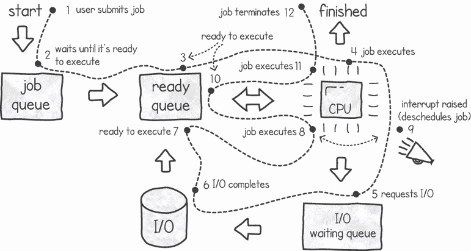

图 2.1 单 CPU 系统中操作系统的作业状态

注意：在某些操作系统（如 Linux）中，就绪队列被称为*运行队列*。

让我们一步一步地看看这些状态：

1.  用户提交字符串搜索作业以执行。

1.  操作系统将此作业放入作业队列。当作业尚未准备好运行时，它会进入此队列。

1.  一旦我们的文本搜索处于就绪可运行状态，它就会移动到就绪队列。

1.  在某个时刻，当 CPU 空闲时，操作系统从就绪队列中提取任务并在 CPU 上开始执行它。在这个阶段，处理器正在运行任务中包含的指令。

1.  一旦我们的文本搜索任务请求读取文件的指令，操作系统就会将任务从 CPU 中移除并将其放入 I/O 等待队列。在这里，它等待直到请求的 I/O 操作返回数据。如果就绪队列中还有其他任务可用，操作系统将选择它并在 CPU 上执行，从而保持处理器的忙碌。

1.  该设备将执行并完成 I/O 操作（从文本文件中读取一些字节）。

1.  一旦 I/O 操作完成，任务就会回到就绪队列。现在它正在等待操作系统将其选中以便继续执行。这种等待期的原因是 CPU 可能正忙于执行其他任务。

1.  在某个时刻，CPU 再次空闲，操作系统接管文本搜索任务并继续在 CPU 上执行其指令。在这种情况下，典型的指令是尝试从文件中加载的文本中找到匹配项。

1.  在任务执行过程中，系统可能会在此时引发中断。中断是一种用于停止当前执行并通知系统特定事件的机制。一个称为**中断控制器**的硬件设备处理来自多个设备的所有中断。然后，该控制器通知 CPU 停止当前任务并开始另一个任务。通常，这个任务涉及调用设备驱动程序或操作系统调度程序。这种中断可能由许多原因引发，例如

    +   一个 I/O 设备完成了一个操作，例如读取文件或网络，甚至是在键盘上的按键。

    +   另一个程序请求一个软件中断。

    +   一个硬件时钟（或计时器）滴答声发生，中断了当前执行。这确保了就绪队列中的其他任务也有机会执行。

1.  操作系统暂停当前任务的执行，并将任务放回就绪队列。操作系统还将从就绪队列中提取另一个项目并在 CPU 上执行它。操作系统调度算法的任务是确定从就绪队列中挑选哪个任务来执行。

1.  在某个时刻，我们的任务再次被操作系统调度程序选中，并在 CPU 上继续执行。步骤 4 到 10 在执行过程中通常会重复多次，具体取决于文本文件的大小以及系统上运行的其他任务数量。

1.  我们的文本搜索完成编程（完成搜索）并终止。

定义步骤 9 和 10 是**上下文切换**的例子，这发生在系统中断一个任务并且操作系统介入以调度另一个任务时。

每次上下文切换都会产生一些开销——操作系统需要保存当前作业状态，以便稍后可以从中恢复。操作系统还需要加载下一个要执行的作业的状态。这个状态被称为*进程上下文块*（PCB）。它是一种数据结构，用于存储有关作业的所有详细信息，例如程序计数器、CPU 寄存器和内存信息。

这种上下文切换给人一种同时进行许多任务的印象，即使我们只有一个 CPU。当我们编写并发代码并在只有一个处理器的系统上执行时，我们的代码会创建一系列*作业*以这种方式运行，以提供更快的响应。当我们有一个多 CPU 的系统时，我们也可以实现真正的并行性，因为我们的作业在不同的执行单元上同时运行。

在 20 世纪 90 年代，许多系统配备了双处理器主板，尽管这些主板通常价格昂贵。第一个双核处理器于 2005 年（来自英特尔）商业化。在提高处理能力和延长电池寿命的驱动下，大多数设备现在都配备了多个核心。这包括云服务器配置、家用笔记本电脑和移动电话。这些处理器的架构通常是共享主内存和总线接口；然而，每个核心都有自己的 CPU 和至少一个内存缓存。操作系统的角色与单核机器相同，区别在于现在调度器必须在多个 CPU 上调度作业。中断的实现相当复杂，这些系统具有高级中断控制器，可以根据场景中断一个处理器或一组处理器。

多处理和分时

尽管许多系统在 20 世纪 50 年代采用了多处理，但这些通常是专门定制的系统。一个例子是美国军事在 20 世纪 50 年代开发的半自动地面环境（SAGE）系统，用于监控空域。SAGE 由许多通过电话线连接的远程计算机组成。SAGE 系统在当时是超前的，其发展催生了今天仍在使用的许多想法，如实时处理、分布式计算和多处理。

后来，在 20 世纪 60 年代，IBM 推出了 System/360。在各种文献中，这被称为第一个真正的操作系统，尽管之前可用的类似系统有不同的名称和称呼（如批处理系统）。

然而，System/360 是第一个能够执行多处理器的商用系统之一。在此之前，在某些系统中，当作业需要从磁带加载数据或保存数据到磁带时，所有处理都会停止，直到系统访问慢速磁带。这导致了执行大量 I/O 的程序的低效率。在这段时间里，CPU 处于空闲状态，无法进行任何有用的工作。解决这个问题的方法是同时加载多个作业，并为每个作业分配一块固定内存。当一个作业等待其 I/O 时，CPU 会切换到执行另一个作业。

大约在这个时候，还出现了一种解决方案，即时间共享的概念。在此之前，当计算机仍然很大，是共享的主机时，编程涉及提交指令并需要等待数小时才能编译和执行作业。如果提交的程序中存在代码错误，程序员直到过程后期才知道。解决这个问题的方法是有一个 *时间共享* 系统，即许多程序员通过终端连接。由于编程主要是一个思考过程，只有一小部分连接的用户会编译和执行作业。当这些用户需要时，CPU 资源会交替分配给这一小部分用户，从而减少了漫长的反馈时间。

到目前为止，我们模糊地称由操作系统管理的这些执行单元为系统作业。在下一节中，我们将更详细地探讨操作系统如何为我们提供两种主要抽象来模拟这些执行单元。

## 2.2 使用进程和线程抽象并发

当我们需要执行我们的代码并管理并发（有作业同时运行或看似同时运行）或在多核系统的情况下启用真正的并行性时，操作系统提供了两种抽象：进程和线程。

一个 *进程* 代表当前在系统上运行的程序。它是操作系统中的一个基本概念。操作系统的主要目的是高效地在许多正在执行的过程中分配系统的资源（如内存和 CPU）。我们可以使用多个进程，并让它们如前节所述并发运行。

一个 *线程* 是在进程上下文中执行的一个额外结构，它为我们提供了一种更轻量级、更高效的并发方法。正如我们将看到的，每个进程都是以一个执行线程开始的，有时被称为主线程或主要线程。在本节中，我们将探讨使用多个进程来模拟并发与在单个进程中运行许多线程之间的区别。

### 2.2.1 使用进程的并发

当多个人在任务上工作时，我们如何完成一项大型工作？为了举一个具体的例子，让我们假设我们是一群著名的艺术家，有人委托我们画一幅大型艺术品。截止日期很紧，所以我们必须作为一个团队高效地工作并按时完成。

让我们的艺术家在相同的画上工作的方法之一是给每个人一张单独的纸张，并指示他们绘制完成画作的不同特征。团队成员中的每个人都会在自己的纸张上绘制他们的特征。当每个人都完成时，我们会合并我们的工作。我们可以将各自的纸张粘贴到空白画布上，覆盖纸张边缘的画，然后认为工作完成了。

在这个类比中，不同的团队成员代表我们的 CPU。我们遵循的指令是我们的程序代码。团队成员执行任务（如纸张上绘画）代表一个进程。我们每个人都有自己的资源（纸张、办公空间等），我们独立工作，最后我们聚集在一起合并我们的工作。在这个例子中，我们分两步完成工作。第一步是并行创建绘画的不同部分。第二步是将不同的部分粘合在一起（见图 2.2）。

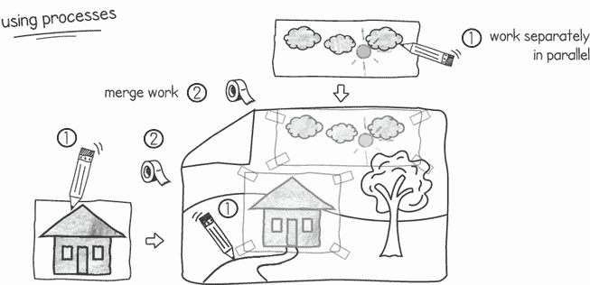

图 2.2 在执行任务时拥有自己的空间与使用进程类似。

这与操作系统中的进程发生的情况类似。画家的资源（纸张、铅笔等）代表系统资源，例如内存。每个操作系统进程都有自己的内存空间，与其他进程隔离。通常，进程会独立工作，与其他进程的交互最小。进程通过消耗更多资源来提供隔离。例如，如果一个进程由于错误而崩溃，它不会影响其他进程，因为它有自己的内存空间。这种隔离的缺点是我们最终会消耗更多的内存。此外，启动进程需要更长的时间（与线程相比），因为我们需要分配内存空间和其他系统资源。

由于进程之间不共享内存，它们倾向于与其他进程的通信最小化。就像我们的画家类比一样，使用进程来同步和合并工作最终会带来一些挑战。当进程需要相互通信和同步时，我们编程它们使用操作系统工具和其他应用程序，例如文件、数据库、管道、套接字等。

### 2.2.2 创建进程

进程是对系统如何执行我们的代码的一种抽象。如果我们想以隔离的方式执行我们的代码，告诉操作系统何时创建进程以及它应该执行哪个代码至关重要。幸运的是，操作系统为我们提供了创建、启动和管理进程的系统调用。

例如，Windows 有一个 `CreateProcess()` 系统调用。这个调用创建进程，分配所需的资源，加载程序代码，并以进程的形式开始执行程序。

或者，在 UNIX 系统上，有一个 `fork()` 系统调用。使用这个调用，我们可以创建一个执行的副本。当我们从一个正在执行的进程调用这个系统调用时，操作系统会完全复制内存空间和进程的资源处理器，包括寄存器、堆栈、文件处理器，甚至程序计数器。然后，新进程接管这个新的内存空间，并从那个点继续执行。

定义我们将新进程称为 *子进程*，创建它的进程称为 *父进程*。这个子父术语也适用于线程，我们将在第 2.2.4 节中探讨。

`fork()` 系统调用在父进程中返回进程 ID，在子进程中返回 `0`。在创建两个进程之后，每个进程都可以根据 `fork()` 系统调用的返回值来决定要执行哪些指令。子进程可以选择使用复制的资源（例如内存中的数据）或者清除它并重新开始。由于每个进程都有自己的内存空间，如果一个进程更改了其内存内容（例如，更改变量的值），另一个进程将不会看到这个更改。图 2.3 展示了在 UNIX 上 `fork()` 系统调用的结果。

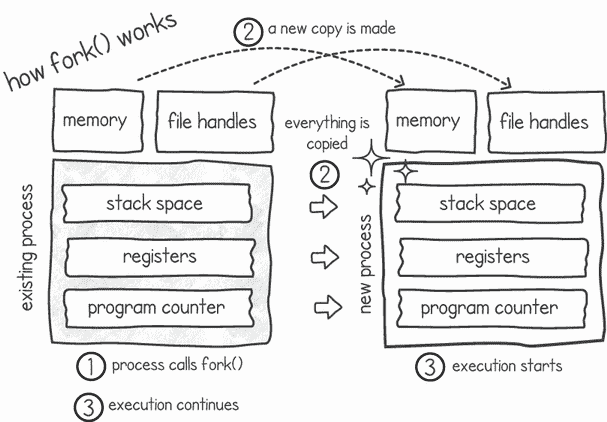

图 2.3 使用 `fork()` 系统调用创建新进程

如您所想象的那样，由于每个进程都有自己的内存空间，每次您创建一个新进程时，总内存消耗都会增加。除了消耗更多内存外，复制和分配系统资源还需要时间，并消耗宝贵的 CPU 周期。这意味着创建过多的进程会对系统造成沉重的负担。因此，一个程序同时使用大量进程来处理相同的问题是非常不寻常的。

UNIX 进程的写时复制

写时复制（COW）是引入到 `fork()` 系统调用中的优化。它通过不复制整个内存空间来减少所需的时间。对于使用这种优化的系统，每当调用 `fork()` 时，子进程和父进程共享相同的内存页面。然后，如果其中一个进程尝试修改一个内存页的内容，该页就会被复制到一个新位置，以便每个进程都有自己的副本。操作系统只复制被修改的内存页面。这是一种节省内存和时间的好方法，但如果一个进程修改了其内存的大部分内容，操作系统最终仍然会复制大多数页面。

在 Go 中，创建和派生进程的支持仅限于`syscall`包，并且是操作系统特定的。如果我们查看该包，我们将在 Windows 上找到`CreateProcess()`函数，在 UNIX 系统上找到`ForkExec()`和`StartProcess()`。Go 还通过调用`exec()`函数为我们提供了在新的进程中运行命令的能力，抽象了`syscall`包中的一些操作系统特定函数。然而，Go 中的并发编程通常不依赖于重量级进程。正如我们将看到的，Go 采用了一种更轻量级的线程和 goroutine 并发模型。

当一个进程执行完其代码或遇到无法处理的错误时，它将终止。一旦进程终止，操作系统将回收其所有资源，以便它们可以被其他进程使用。这包括内存空间、打开的文件句柄、网络连接等。在 UNIX 和 Windows 上，当父进程完成后，它不会自动终止子进程。

### 2.2.3 使用多进程处理常见任务

你是否考虑过当你运行像这样的 UNIX 命令时幕后发生了什么？

```
$ curl -s https://www.rfc-editor.org/rfc/rfc1122.txt | wc
```

当我们在 UNIX 系统上运行此命令时，命令行正在派生两个并发进程。我们可以通过打开另一个终端并运行`ps -a`来检查这一点：

```
PID   TTY      TIME     CMD
. . .
26013 pts/49   00:00:00 curl
26014 pts/49   00:00:00 wc
. . .
```

第一个进程（PID 26013，在此示例中）将运行 curl 程序，该程序将从给定的 URL 下载文本文件。第二个进程（PID 26014）将运行单词计数程序。在此示例中，我们将第一个进程（curl）的输出作为第二个进程（wc）的输入通过一个缓冲区（见图 2.4）。使用管道操作符，我们告诉操作系统分配一个缓冲区，并将 curl 进程的输出和单词计数的输入重定向到该缓冲区。当此缓冲区满时，curl 进程会阻塞，而当单词计数进程消耗它时，它会继续。当缓冲区为空时，单词计数进程会阻塞，直到 curl 积累更多数据。

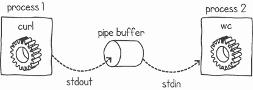

图 2.4 Curl 和 wc 通过管道并发运行

一旦 curl 从网页中读取所有文本，它将终止并在管道上放置一个标记，表示没有更多数据可用。这个标记作为对单词计数进程的信号，表明它可以终止，因为没有更多数据将到来。

### 2.2.4 使用线程进行并发

进程是并发问题的重量级解决方案。它们为我们提供了良好的隔离性，但消耗了大量的资源，并且创建需要一段时间。

线程是解决使用进程进行并发时出现的一些问题的答案。我们可以将线程视为多个进程的轻量级替代品。创建一个线程要快得多（有时快 100 倍），并且线程消耗的系统资源比进程少。从概念上讲，线程是进程内的另一个执行上下文（类似于微进程）。

让我们继续我们的简单类比，其中我们用一队人画画。而不是让我们的团队成员各自拥有一张纸并独立绘制，我们可以有一个大型的空白画布，并给每个人分发画笔和铅笔。每个人都会共享空间，并直接在大画布上绘制（见图 2.5）。

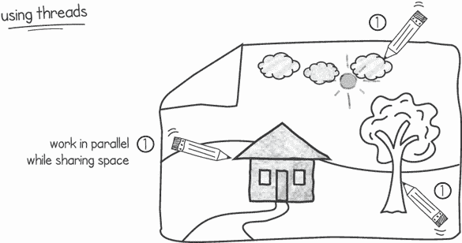

图 2.5 同时绘制和共享空间类似于使用线程。

这与使用线程时发生的情况相似。就像我们共享画布一样，多个线程将并发执行并共享相同的内存空间。这更有效率，因为我们不需要为每个执行消耗大量的内存。此外，共享内存空间通常意味着我们不需要在结束时合并我们的工作。根据我们正在解决的问题，我们可能通过与其他线程共享内存来更有效地解决问题。

当我们讨论进程时，我们看到了一个进程如何包含资源（程序和内存中的数据）以及正在运行程序的执行。从概念上讲，我们可以将资源与执行分离，因为这使我们能够创建多个执行并共享它们之间的资源。我们将每个单独的执行称为*线程*（或*执行线程*）。当你启动一个进程时，它默认包含一个主线程。当我们在一个进程中拥有多个线程时，我们说该进程是*多线程的*。多线程编程是指我们在同一应用程序中以不同线程协同工作的方式编写代码。图 2.6 展示了两个线程如何共享同一个进程的内存。

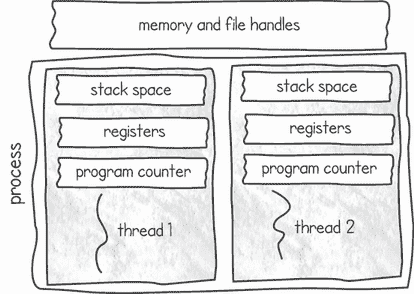

图 2.6 线程共享同一进程内存空间

当我们创建一个新的线程时，操作系统只需要创建足够的管理栈空间、寄存器和程序计数器的资源。新线程在同一个进程的上下文中运行。相比之下，当我们创建一个新的进程时，操作系统需要为它分配一个全新的内存空间。因此，线程比进程轻量得多，在系统开始耗尽资源之前，我们通常可以创建比进程多得多的线程。此外，因为需要分配的新资源很少，启动线程比启动进程要快得多。

栈空间里有什么？

*栈空间*存储函数内部存在的局部变量。这些通常是短生命周期的变量——当函数结束时，它们就不再被使用了。这个空间不包括在函数之间共享的变量（使用指针），这些变量分配在主内存空间，称为*堆*。

这种额外的性能是有代价的。在相同的内存空间中工作意味着我们无法获得进程提供的隔离性。这可能导致一个线程覆盖另一个线程的工作。在避免这种情况时，多个线程之间的通信和同步非常重要。在我们的画家团队类比中，情况也大致相同。当我们共同在一个项目上工作并共享相同的资源时，我们需要画家之间有良好的沟通和同步。我们需要不断交流我们在做什么以及何时做。如果没有这种合作，我们可能会覆盖彼此的艺术作品，导致结果不佳。

这与我们在多个线程中管理并发的方式相似。由于多个线程共享相同的内存空间，我们需要注意确保线程不会相互覆盖并引起问题。我们通过使用线程通信和同步来实现这一点。在本书中，我们将检查从共享内存中可能出现的错误类型，并提供解决方案。

由于线程共享内存空间，一个线程对主内存所做的任何更改（例如更改全局变量的值）对同一进程中的其他所有线程都是可见的。这是使用线程的主要优势——多个线程可以一起使用这个共享内存来处理相同的问题。这使得我们能够编写非常高效和响应快速的并发代码。

注意：线程不共享栈空间。尽管线程共享相同的内存空间，但重要的是要认识到每个线程都有自己的私有栈空间（如图 2.6 所示）。

每当我们在一个函数中创建一个局部非共享变量时，我们实际上是在栈空间中放置这个变量。因此，这些局部变量只能被创建它们的线程看到。每个线程都有自己的私有栈空间是很重要的，因为它可能调用与其他线程完全不同的函数，并且需要自己的私有空间来存储这些函数中使用的变量和返回值。

我们还需要每个线程都有自己的程序计数器。*程序计数器*（也称为*指令指针*）简单地说是指向 CPU 将要执行的下一个指令的指针。由于线程可能会执行我们程序的不同部分，因此每个线程都需要一个独立的指令指针。

当我们拥有多个线程而只有一个核心处理器时，进程中的每个线程都会获得处理器的时间片。这提高了响应性，在需要同时响应多个请求的应用程序中很有用（例如在 Web 服务器中）。如果系统中存在多个处理器（或处理器核心），线程将能够相互并行执行。这使我们的应用程序速度加快。

在本章的早期部分，我们讨论了操作系统如何管理多进程，并讨论了作业处于不同的状态（例如准备运行、运行中、等待 I/O 等）。在一个处理多线程程序的系统里，这些状态描述了系统上每个执行线程的状态。只有准备运行的线程才能被选中并移动到 CPU 进行执行。如果一个线程请求 I/O，系统会将其移动到等待 I/O 状态，依此类推。

当我们创建一个新的线程时，我们在程序中给它一个指令指针，指示新执行应该从哪里开始。许多编程语言隐藏了这个指针的复杂性，并允许程序指定线程应该开始执行的目标函数（或方法或过程）。操作系统只为新的线程状态分配空间，包括栈、寄存器和程序计数器（指向函数）。然后，子线程将与父线程并发运行，共享主内存和其他资源，例如打开的文件和网络连接。

一旦一个线程完成其执行，它就会终止，操作系统会回收栈内存空间。然而，根据线程的实现方式，线程的终止并不一定意味着整个进程都会终止。在 Go 语言中，当主执行线程终止时，整个进程也会终止，即使其他线程仍在运行。这与某些其他语言不同。例如，在 Java 中，进程只有在进程中的所有线程都完成时才会终止。

操作系统和编程语言以不同的方式实现线程。例如，在 Windows 上，我们可以使用`CreateThread()`系统调用来创建线程。在 Linux 上，我们可以使用带有`CLONE_THREAD`选项的`clone()`系统调用来创建线程。语言表示线程的方式也存在差异。例如，Java 将线程建模为对象，Python 使用全局解释器锁来阻止多个线程并行执行，而在 Go 语言中，正如我们将看到的，有一个更细粒度的 goroutine 概念。

POSIX Threads

IEEE 试图通过一个称为 POSIX Threads（简称 pthreads）的标准来标准化线程实现。这些线程通过使用标准的 POSIX Threads API 来创建、管理和同步。包括 Windows 和 UNIX 系统在内的各种操作系统都提供了这个标准的实现。不幸的是，并非所有语言都支持 POSIX Thread 标准。

尽管线程的创建、建模和销毁方式存在差异，但无论使用什么技术，编码并发程序所涉及的并发概念和技术都将非常相似。因此，了解一种语言中多线程编程的模型、技术和工具将有助于你在任何语言中使用。差异仅在于语言的多线程实现细节。

### 2.2.5 实际中的多线程应用程序

现在让我们看看一个利用多线程在 Web 服务器应用程序中的示例。假设我们已经开发了一个应用程序，通过服务向用户提供他们最喜欢的体育队伍的信息和比分。这个应用程序运行在服务器上，并通过用户的移动或桌面浏览器处理用户的请求。例如，保罗可能想知道他最喜欢的球队纽约巨人队正在进行的足球比赛的最新比分。这个应用程序的一个架构如图 2.7 所示。它由两个主要部分组成：客户端处理线程和流读取线程。

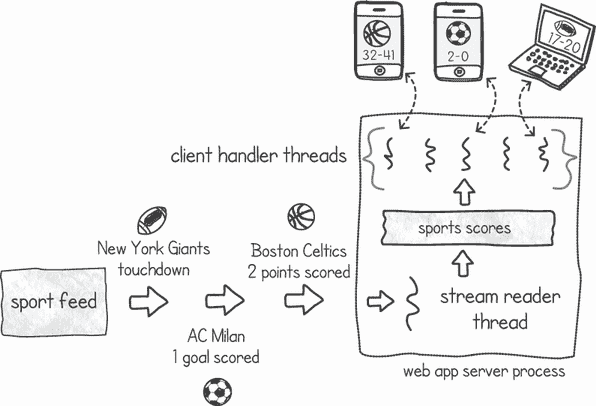

图 2.7 提供体育比分的 Web 服务器应用程序

流读取线程通过网络连接从体育直播中读取比赛事件。每个接收到的消息都会告诉应用程序特定游戏中的发生情况。例如，得分、犯规、场上的球员等。流读取线程使用这些信息来构建比赛的画面，将每场比赛的比分存储在共享的体育比分数据结构中。

每个客户端处理线程负责处理用户请求。根据用户发出的请求，线程将从体育比分数据结构中查找并读取所需的比赛信息。然后，它将信息返回给用户的设备。我们有一组这样的线程，这样我们就能同时处理多个请求，而不会让用户等待太长时间得到回复。

使用线程来实现这种类型的服务器应用程序有两个好处：

+   我们消耗的资源更少。我们可以启动多个客户端处理线程，而不会占用太多内存。此外，我们可以动态调整这个池的大小，在预期流量增加时增加线程数，在较不繁忙的时期减少它。我们可以这样做，因为创建和终止线程的成本低且速度快（相对于使用进程）。

+   我们有选择使用内存来存储和共享体育比分数据结构。当使用线程时，这很容易做到，因为它们共享相同的内存空间。

### 2.2.6 一起使用多个进程和线程

现在让我们考虑一个混合示例，比如现代浏览器，它可以使用进程和线程。当浏览器渲染网页时，它需要下载下载页面的各种资源：文本、图像、视频等。为了高效地完成这项任务，浏览器可以使用多个线程同时下载并渲染页面的各个元素。线程非常适合这种工作，因为结果页面可以保存在线程的共享内存中，而线程可以在完成任务时填充它。

如果页面包含一些需要大量计算（如图形）的脚本，我们可以分配更多的线程来执行这个计算，可能在多核 CPU 上并行执行。但是，当其中一个脚本行为不当并崩溃时会发生什么？它也会杀死浏览器中所有其他打开的窗口和标签页吗？

这就是进程可能派上用场的地方。我们可以设计浏览器以利用进程的隔离性，也许为每个窗口或标签页使用一个单独的进程。这确保了当某个网页由于错误的脚本而崩溃时，不会导致一切崩溃，确保包含你长篇草稿电子邮件的标签页不会丢失。

现代浏览器出于这个原因采用了混合线程和进程系统。通常，它们对可以创建的进程数量有限制，超过这个限制后，标签页开始共享同一个进程。这样做是为了减少内存消耗。

## 2.3 goroutine 有什么特别之处？

Go 语言对并发的回答是 goroutine。正如我们将看到的，它并不直接与操作系统线程绑定。相反，goroutine 由 Go 的运行时在更高层次上管理，以给我们提供一个更轻量级的构造，消耗的资源远少于操作系统线程。在本节中，我们将首先探讨如何创建 goroutine，然后再描述 goroutine 在操作系统线程和进程中的位置。

### 2.3.1 创建 goroutine

现在我们来看看如何在 Go 中创建 goroutine，我们将一个顺序程序转换为并发程序。我们将从以下顺序程序开始。

列表 2.1 模拟执行某些工作的函数

```
package main

import (
    "fmt"
    "time"
)

func doWork(id int) {
    fmt.Printf("*Work %d started at %s\n*",id,time.Now().Format("*15:04:05*"))
    time.Sleep(1 * time.Second)                                            ❶
    fmt.Printf("*Work %d finished at %s\n*",id,time.Now().Format("*15:04:05*"))
}
```

❶ 通过睡眠 1 秒来模拟执行计算工作

注意：访问[`github.com/cutajarj/ConcurrentProgrammingWithGo`](http://github.com/cutajarj/ConcurrentProgrammingWithGo)以查看本书中的所有列表。

如您所见，我们有一个模拟执行一些工作的函数。这项工作可以是任何东西，比如长时间运行的 CPU 计算或从网页上下载某些内容。在函数中，我们传递一个整数作为工作的标识符。然后我们通过将执行暂停 1 秒来模拟执行一些工作。在睡眠期结束后，我们将包含工作标识符的消息打印到控制台，以表示我们已经完成了工作。我们还在开始和结束时打印时间戳，以显示函数执行所需的时间。

让我们连续多次运行这个函数。在列表 2.2 中，我们使用循环调用函数五次，每次传递一个不同的`i`值，从`0`开始，到`4`结束。这个`main()`函数将在我们的主执行线程中运行，`doWork()`函数将以相同的执行顺序依次调用。

列表 2.2 `main()`线程依次调用`doWork()`函数

```
func main() {
    for i := 0; i < 5; i++ {
        doWork(i)
    }
}
```

如您所预期的那样，输出列表按顺序列出工作标识符，每个标识符需要 1 秒：

```
$ go run main.go
Work 0 started at 19:41:03
Work 0 finished at 19:41:04
Work 1 started at 19:41:04
Work 1 finished at 19:41:05
Work 2 started at 19:41:05
Work 2 finished at 19:41:06
Work 3 started at 19:41:06
Work 3 finished at 19:41:07
Work 4 started at 19:41:07
Work 4 finished at 19:41:08
```

整个程序大约需要 5 秒钟才能完成。当主线程没有更多的指令可以执行时，它会终止整个进程。

我们如何修改我们的指令，以便我们能够并行执行这项工作而不是顺序执行？我们可以在 goroutine 中放置对`doWork()`函数的调用，如列表 2.3 所示。与我们的先前顺序程序相比，有两个主要的变化。第一个变化是我们使用关键字`go`调用`doWork()`函数。结果是该函数在单独的执行中并行运行。`main()`函数不会等待它完成就继续执行。相反，它继续执行下一个指令，在这种情况下是创建更多的 goroutine。

列表 2.3 主线程并行调用`doWork()`函数

```
func main() {
    for i := 0; i < 5; i++ {
        go doWork(i)              ❶
    }
    time.Sleep(2 * time.Second)   ❷
}
```

❶ 启动一个新的 goroutine 来调用 doWork()函数

❷ 使用更长的 sleep 等待所有工作完成

我们也可以将这种调用函数的方式称为*异步*调用，这意味着我们不需要等待函数完成就可以继续执行。我们可以将正常的函数调用称为同步调用，因为我们需要在继续执行其他指令之前等待函数返回。

我们对`main()`函数的第二个变化是在我们异步调用`doWork()`函数后，`main()`函数休眠 2 秒钟。这个 sleep 指令是必要的，因为在 Go 中，当主执行没有更多的指令可以运行时，进程会终止。如果没有这个 sleep，进程就会在没有给 goroutine 运行机会的情况下终止。如果我们尝试省略这个语句，程序在控制台上将不会输出任何内容。列表 2.3 中程序的输出将类似于以下内容：

```
$ go run main.go
Work 2 started at 20:53:10
Work 1 started at 20:53:10
Work 3 started at 20:53:10
Work 4 started at 20:53:10
Work 0 started at 20:53:10
Work 0 finished at 20:53:11
Work 2 finished at 20:53:11
Work 3 finished at 20:53:11
Work 4 finished at 20:53:11
Work 1 finished at 20:53:11
```

首先要注意的是，程序大约在 2 秒内完成，而不是顺序版本所需的 5 秒。这仅仅是因为我们现在正在并行执行工作。我们不再是一个接一个地工作，完成一个然后开始另一个，我们一次完成所有的工作。您可以在图 2.8 中看到这种表示。在图的部分*a*中，我们有这个程序的顺序版本，显示了`doWork()`函数被多次调用，一次接一次。在部分*b*中，我们有 goroutine 执行`main()`函数并产生五个子 goroutine，每个子 goroutine 都并发调用`doWork()`函数。

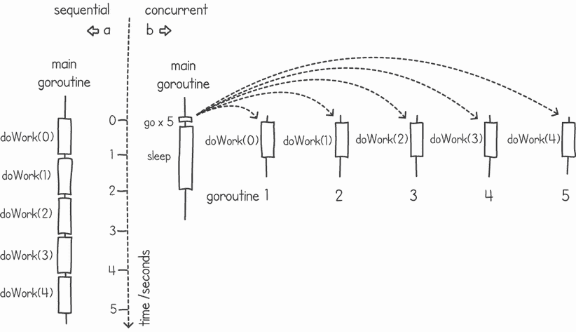

图 2.8 (a) 顺序调用`doWork()`函数 (b) 和并发调用函数

当我们运行 Go 程序时，需要注意的第二件事是函数消息输出的顺序已经改变。程序不再按顺序输出工作标识符。相反，它们似乎随机出现。再次运行程序会给我们不同的顺序：

```
$ go run main.go
Work 0 started at 20:58:13
Work 3 started at 20:58:13
Work 4 started at 20:58:13
Work 1 started at 20:58:13
Work 2 started at 20:58:13
Work 2 finished at 20:58:14
Work 1 finished at 20:58:14
Work 0 finished at 20:58:14
Work 4 finished at 20:58:14
Work 3 finished at 20:58:14
```

这是因为当我们并发运行作业时，我们永远无法保证这些作业的执行顺序。当我们的`main()`函数创建了五个 goroutines 并将它们提交时，操作系统可能会以不同于我们创建它们的顺序来选择执行。

### 2.3.2 在用户空间中实现 goroutines

在本章前面，我们讨论了操作系统进程和线程，并讨论了它们的不同和角色。goroutine 在这个背景下属于哪里？goroutine 是一个独立的进程还是一个轻量级线程？

事实证明，goroutines 既不是操作系统线程也不是进程。Go 语言的规范并没有严格规定 goroutines 应该如何实现，但当前的 Go 实现将一组 goroutine 执行分组到另一组操作系统线程执行上。为了更好地理解这一点，让我们首先谈谈另一种执行线程的建模方式，称为*用户级*线程。

在上一节中，我们讨论了存在于进程内部的线程并由操作系统管理。操作系统了解所有关于线程的信息，并决定何时或是否应该执行每个线程。操作系统还存储每个线程的上下文（寄存器、堆栈和状态），并在线程需要执行时使用它。我们将这类线程称为*内核级*线程，因为操作系统管理它们。每当需要上下文切换时，操作系统就会介入并选择下一个要执行的线程。

我们可以在内核级别之外实现线程，这样线程就可以完全在*用户空间*中运行，这意味着它是我们应用程序内存空间的一部分，而不是操作系统的空间。使用用户级线程就像在主内核级线程内部运行不同的执行线程，如图 2.9 所示。

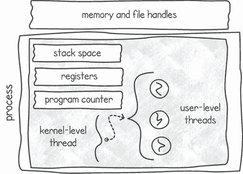

图 2.9 用户级线程在单个内核级线程中执行

从操作系统的角度来看，包含用户级线程的进程看起来只有一个执行线程。操作系统对用户级线程一无所知。进程本身负责管理、调度和上下文切换自己的用户级线程。为了执行这个内部上下文切换，需要一个单独的运行时来维护一个包含每个用户级线程所有数据（如状态）的表。我们在进程的主线程内部复制了操作系统在线程调度和管理方面所做的小规模工作。

用户级线程的主要优势是性能。用户级线程的上下文切换比内核级线程的上下文切换要快。这是因为对于内核级上下文切换，操作系统需要介入并选择下一个要执行的线程。当我们可以在不调用任何内核的情况下切换执行时，执行进程可以保持对 CPU 的控制，而无需刷新其缓存并减慢速度。

使用用户级线程的缺点在于当它们执行调用阻塞 I/O 调用的代码时。考虑我们需要从文件中读取的情况。由于操作系统将进程视为只有一个执行线程，如果一个用户级线程执行这个阻塞读取调用，整个进程将被取消调度。如果同一进程中存在其他用户级线程，它们将无法执行，直到读取操作完成。这并不理想，因为拥有多个线程的一个优势是在其他线程等待 I/O 时执行计算。为了克服这种限制，使用用户级线程的应用程序往往使用非阻塞调用来执行它们的 I/O 操作。然而，使用非阻塞 I/O 并不理想，因为并非每个设备都支持非阻塞调用。

用户级线程的另一个缺点是，如果我们有一个多处理器或多核系统，我们将在任何给定时间点只能利用一个处理器。操作系统将包含所有用户级线程的单个内核级线程视为单个执行。因此，操作系统在一个处理器上执行内核级线程，所以包含在该内核级线程中的用户级线程将不会以真正的并行方式执行。

那么，绿色线程又如何呢？

“绿色线程”这个术语是在 Java 编程语言的 1.1 版本中提出的。Java 最初的绿色线程是用户级线程的一种实现。它们只在单个核心上运行，并且完全由 JVM 管理。在 Java 1.3 版本中，绿色线程被内核级线程所取代。从那时起，许多开发者开始使用这个术语来指代其他用户级线程的实现。将 Go 的 goroutines 称为绿色线程可能并不准确，因为正如我们将看到的，Go 的运行时允许其 goroutines 充分利用多个 CPU。

为了进一步混淆命名问题，在 Java 的后续版本中引入了一种类似于 Go 的线程模型。然而，这一次，不是绿色线程，而是使用了“虚拟线程”这个名称。

Go 提供了一个混合系统，它为我们提供了用户级线程的优秀性能，而没有大多数缺点。它是通过使用一组内核级线程来实现的，每个线程管理一个 goroutine 队列。由于我们有多于一个的内核级线程，因此如果可用，我们可以利用多个处理器。

为了说明这种混合技术，假设我们的硬件恰好有两个处理器核心。我们可以有一个运行时系统，该系统创建并使用两个内核级线程——每个处理器核心一个——并且每个内核级线程可以管理一组用户级线程。在某个时刻，操作系统将并行调度这两个内核级线程，每个线程在一个单独的处理器上。然后，我们将有一组用户级线程在每个处理器上运行。

*M:N* 混合线程

Go 为其 goroutines 使用的系统有时被称为 *M:N* 线程模型。这是当你有 *M* 个用户级线程（goroutines）映射到 *N* 个内核级线程时。这与通常的用户级线程形成对比，用户级线程被称为 *N*:1 线程模型，意味着 N 个用户级线程对应 1 个内核级线程。实现 *M:N* 模型的运行时比其他模型复杂得多，因为它需要许多技术来在内核级线程集合上移动和平衡用户级线程。

Go 的运行时根据逻辑处理器的数量确定要使用多少内核级线程。这通过名为 `GOMAXPROCS` 的环境变量设置。如果没有设置此变量，Go 将通过查询操作系统来确定您的系统有多少个 CPU。您可以通过执行以下代码来检查 Go 看到的处理器数量和 `GOMAXPROCS` 的值。

列表 2.4 检查可用的 CPU 数量

```
package main

import (
    "*fmt*"
    "*runtime*"
)

func main() {
    fmt.Println("*Number of CPUs:*", runtime.NumCPU())    ❶

    fmt.Println("*GOMAXPROCS:*", runtime.GOMAXPROCS(0))   ❷
}
```

❶ Go 将 GOMAXPROCS 的默认值设置为 NumCPU()的值。

❷ 当 n < 1 时，调用 GOMAXPROCS(n)将返回当前值而不更改它。

列表 2.4 的输出将取决于其运行的硬件。以下是在具有八个核心的系统上的输出示例：

```
$ go run cpucheck.go
Number of CPUs: 8
GOMAXPROCS: 8
```

Go 的运行时将为每个内核级线程分配一个本地运行队列（LRQ）。每个 LRQ 将包含程序中 goroutines 的一个子集。此外，还有一个全局运行队列（GRQ）用于 Go 尚未分配给内核级线程的 goroutines（参见图 2.10 的左侧）。在处理器上运行的每个内核级线程将负责执行其 LRQ 中存在的 goroutines。

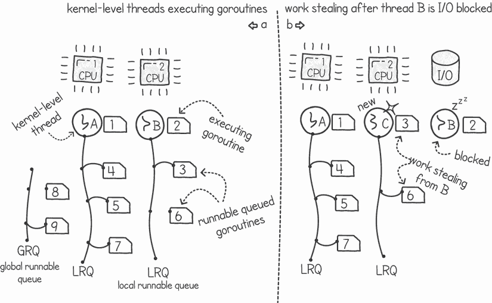

图 2.10（a）内核级线程 A 和 B 正在执行它们各自的 LRQ 中的 goroutines；（b）一个 goroutine 正在等待 I/O 阻塞线程 B，导致创建或重用新的线程 C，从之前的线程中窃取工作。

为了解决阻塞调用的问题，Go 会包装任何阻塞操作，以便它知道何时内核级线程即将被调度。当这种情况发生时，Go 会创建一个新的内核级线程（或从池中重用空闲的一个）并将 goroutine 队列移动到这个新线程，该线程从队列中选取一个 goroutine 并开始执行它。然后，带有等待 I/O 的 goroutine 的旧线程被操作系统取消调度。这个系统确保执行阻塞调用的 goroutine 不会阻塞整个本地 goroutine 运行队列（参见图 2.10 右侧）。

在 Go 中，这种将 goroutine 从一个队列移动到另一个队列的系统被称为 *工作窃取*。工作窃取不仅仅发生在 goroutine 执行阻塞调用时。当队列中 goroutine 的数量不平衡时，Go 也可以使用这种机制。例如，如果某个特定的 LRQ 为空，且内核级线程没有更多的 goroutine 可执行，它将从另一个线程的队列中窃取工作。这确保了我们的处理器在执行更多工作时有平衡的工作负载，并且当有更多工作要执行时，没有一个是空闲的。

锁定到内核级线程

在 Go 语言中，我们可以通过调用 `runtime.LockOSThread()` 函数强制一个 goroutine 锁定到操作系统线程。这个调用将 goroutine 独特地绑定到其内核级线程。除非 goroutine 调用 `runtime.UnlockOSThread()`，否则不会有其他 goroutine 在同一 OS 线程上运行。

这些函数可以在我们需要对内核级线程进行特殊控制时使用——例如，当我们与外部 C 库交互并需要确保 goroutine 不会移动到另一个内核级线程，从而造成访问库的问题。

### 2.3.3 goroutine 调度

当内核级线程在 CPU 上已经公平地分配了时间后，操作系统调度器会将运行队列中的下一个线程切换到。这被称为 *抢占式调度**。它通过一个时钟中断系统实现，该系统停止正在执行的内核级线程并调用操作系统调度器。由于中断只调用操作系统调度器，运行在用户空间的 Go 调度器需要一个不同的系统。

Go 调度器需要执行以进行上下文切换。因此，Go 调度器需要用户级事件来触发其执行（参见图 2.11）。这些事件包括启动一个新的 goroutine（使用关键字 `go`）、执行系统调用（例如，从文件中读取）或同步 goroutine。

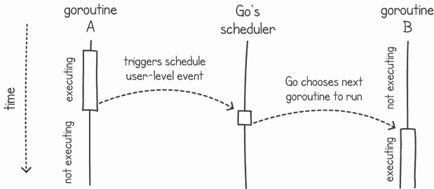

图 2.11 展示了 Go 中的上下文切换需要用户级事件。

我们也可以在我们的代码中调用 Go 调度器，试图让调度器进行上下文切换到另一个 goroutine。在并发术语中，这通常被称为*yield*命令。这是当线程决定放弃控制权，以便其他线程在 CPU 上获得其轮次时。在下面的列表中，我们使用命令`runtime.Gosched()`在我们的`main()` goroutine 中直接调用调度器。

列表 2.5 调用 Go 调度器

```
package main

import (
    "*fmt*"
    "*runtime*"
)

func sayHello() {
    fmt.Println("*Hello*")
}

func main() {
    go sayHello()
    runtime.Gosched()        ❶
    fmt.Println("*Finished*")
}
```

❶ 调用 Go 调度器给其他 goroutine 一个运行的机会。

不直接调用调度器，我们几乎没有机会执行`sayHello()`函数。`main()` goroutine 将在调用`sayHello()`函数的 goroutine 在 CPU 上获得任何运行时间之前终止。由于在 Go 中，我们在`main()` goroutine 终止时退出进程，所以我们不会看到“Hello”文本被打印出来。

警告：我们无法控制调度器将选择哪个 goroutine 来执行。当我们调用 Go 调度器时，它可能会选择其他 goroutine 并开始执行它，或者它可能会继续执行调用调度器的 goroutine。

在列表 2.5 中，调度器可能会再次选择`main()` goroutine，我们可能永远看不到“Hello”消息。实际上，通过在列表中调用`runtime.Gosched()`，我们只是在增加`sayHello()`被执行的机会。但这并不能保证它一定会被执行。

与操作系统调度器一样，我们无法可预测地确定 Go 调度器接下来会执行什么。作为编写并发程序的程序员，我们绝不能编写依赖于明显调度顺序的代码，因为下次运行程序时，顺序可能会不同。如果你尝试多次执行列表 2.5，你最终会得到一个执行输出`Finished`而不执行`sayHello()`函数的执行。如果我们需要控制线程的执行顺序，我们需要在我们的代码中添加同步机制，而不是依赖于调度器。我们将在第四章开始讨论这些技术。

## 2.4 并发与并行

许多开发者将术语*并发*和*并行*互换使用，有时将它们视为同一概念。然而，许多教科书在这两者之间做出了明确的区分。

我们可以将*并发*视为程序代码的属性，将*并行*视为执行程序的属性。并发编程发生在我们以将指令分组到单独的任务中的方式编写程序时，概述了边界和同步点。以下是一些此类任务的例子：

+   处理一个用户的请求。

+   在某个文件中搜索一些文本。

+   计算矩阵乘法中一行的结果。

+   渲染视频游戏的一帧。

这些任务可能并行执行，也可能不并行执行。它们是否并行执行将取决于我们执行程序时的硬件和环境。例如，如果我们的并发矩阵乘法程序在一个多核系统上运行，我们可能能够同时执行多个行计算。为了发生并行执行，我们需要多个处理单元。否则，系统可以在任务之间交错，给人一种同时执行多个任务的感觉。例如，两个线程可以轮流共享一个处理器，每个线程占用一定的时间份额。因为操作系统频繁且快速地切换线程，它们似乎同时运行。

注意：并发性是关于**规划**如何同时执行多个任务。并行性是关于**执行**多个任务同时进行。

显然，定义是重叠的。实际上，我们可以这样说，并行性是并发性的一个子集。只有并发程序才能并行执行，但并非所有并发程序都会并行执行。

当我们只有一个处理器时，能否实现并行性？你已经看到，并行性需要多个处理单元，但如果我们扩大处理单元的定义，一个等待 I/O 操作完成的线程实际上并不是空闲的。写入磁盘不是程序工作的一部分吗？如果我们有两个线程，一个正在写入磁盘，另一个正在 CPU 上执行指令，我们应该将其视为并行执行吗？其他组件，如磁盘和网络，也可以与 CPU 同时为程序工作。即使在这样的情况下，我们通常将术语**并行执行**保留用于指代计算，而不是 I/O。然而，许多教科书在此背景下提到了术语**伪并行**执行。这指的是一个处理器给人一种同时执行多个作业的印象。系统通过频繁地在定时器或执行作业请求阻塞 I/O 操作时进行任务上下文切换来实现这一点。

## 2.5 练习

注意：访问[`github.com/cutajarj/ConcurrentProgrammingWithGo`](http://github.com/cutajarj/ConcurrentProgrammingWithGo)以查看所有代码解决方案。

1.  编写一个类似于列表 2.3 的程序，该程序接受一个文本文件名列表作为参数。对于每个文件名，程序应该启动一个新的 goroutine，该 goroutine 将输出该文件的内容到控制台。你可以使用`time.Sleep()`函数等待子 goroutine 完成（直到你学会如何更好地做到这一点）。将程序命名为`catfiles.go`。以下是执行此 Go 程序的方法：

    ```
    go run catfiles.go txtfile1 txtfile2 txtfile3
    ```

1.  扩展你在第一个练习中编写的程序，使其不再打印文本文件的内容，而是搜索字符串匹配。要搜索的字符串是命令行上的第一个参数。当你启动一个新的 goroutine 时，它应该读取文件并搜索匹配项，而不是打印文件的内容。如果 goroutine 找到匹配项，它应该输出一条消息，说明文件名包含匹配项。将程序命名为 `grepfiles.go`。以下是如何执行此 Go 程序的示例（在这个例子中，“bubbles”是搜索字符串）：

    ```
    go run grepfiles.go bubbles txtfile1 txtfile2 txtfile3
    ```

1.  修改你在第二个练习中编写的程序，使其不再传递文本文件名列表，而是传递目录路径。程序将查找此目录并列出文件。对于每个文件，你可以启动一个 goroutine 来搜索字符串匹配（与之前相同）。将程序命名为 `grepdir.go`。以下是如何执行此 Go 程序的示例：

    ```
    go run grepdir.go bubbles ../../commonfiles
    ```

1.  将第三个练习中的程序修改为在任意子目录中递归地继续搜索。如果你给你的搜索 goroutine 一个文件，它应该在该文件中搜索字符串匹配，就像之前的练习一样。否则，如果你给它一个目录，它应该递归地为每个找到的文件或目录启动一个新的 goroutine。将程序命名为 `grepdirrec.go`，通过运行以下命令来执行它：

    ```
    go run grepdirrec.go bubbles ../../commonfiles
    ```

## 摘要

+   多处理操作系统和现代硬件通过它们的调度和抽象提供并发。

+   进程是建模并发的重量级方式；然而，它们提供了隔离。

+   线程是轻量级的，并且共享相同的进程内存空间。

+   用户级线程更轻量级且性能更好，但它们需要复杂的处理来防止管理所有用户级线程的进程被取消调度。

+   包含在单个内核级线程中的用户级线程一次只能使用一个处理器，即使系统有多个处理器。

+   Goroutines 采用一种混合线程系统，每个内核级线程包含一组 goroutines。使用此系统，多个处理器可以并行执行 goroutines。

+   Go 的运行时使用一种工作窃取系统，在出现负载不平衡或发生取消调度时，将 goroutines 移动到其他内核级线程。

+   并发是关于规划如何同时执行许多任务。

+   并行是关于同时执行许多任务。
