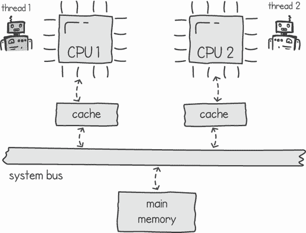
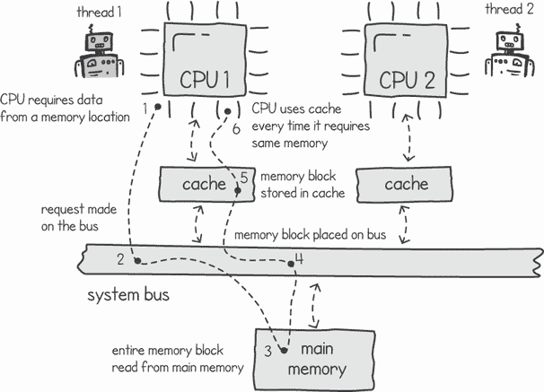
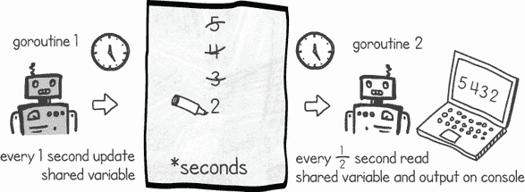
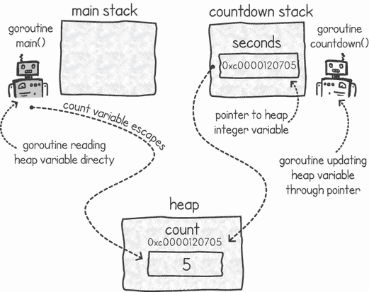
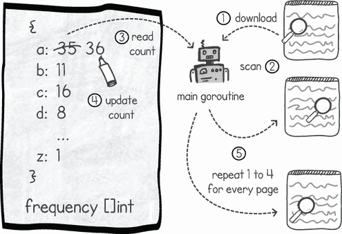
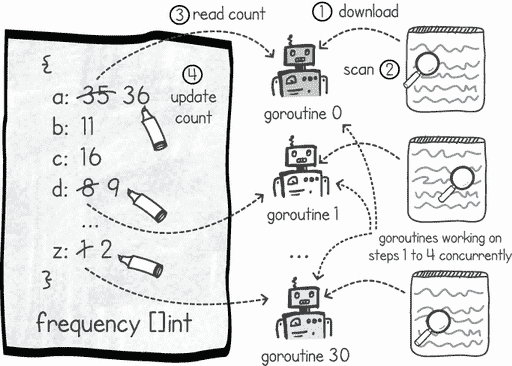
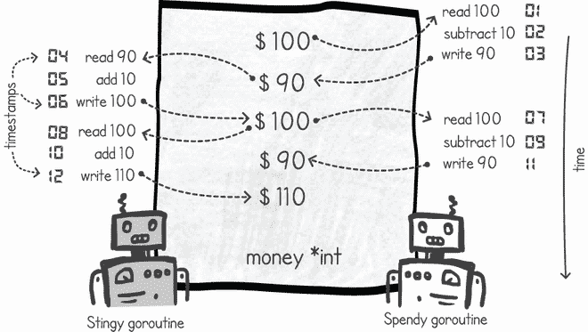

# 3 使用内存共享进行线程通信

本章涵盖

+   使用我们的硬件架构进行线程间通信

+   通过内存共享进行通信

+   识别竞态条件

共同解决一个问题的执行线程需要某种形式的通信。这就是所谓的*线程间通信*（ITC），或者当提到进程时称为*进程间通信*（IPC）。这种通信分为两大类：内存共享和消息传递。在本章中，我们将重点关注前者。

内存共享类似于所有我们的执行共享一个大的、空白的画布（进程的内存），每个执行都可以在这个画布上写下自己计算的结果。我们可以协调执行，使它们能够使用这个空白的画布进行协作。相比之下，消息传递正如其名。就像人一样，线程可以通过向彼此发送消息来进行通信。在第八章中，我们将研究使用通道在 Go 语言中的消息传递。

我们在应用程序中使用的线程通信类型将取决于我们试图解决的问题类型。内存共享是 ITC（内部线程通信）的一种常见方法，但正如我们在本章中将要看到的，它带来了一系列挑战。

## 3.1 内存共享

通过内存共享进行通信就像试图和朋友交谈，但不是通过交换消息，而是使用白板（或一大张纸），我们交换想法、符号和抽象（见图 3.1）。


图 3.1 通过内存共享进行通信

在使用内存共享的并发编程中，我们为进程的内存分配一部分——例如，共享数据结构或变量——并且让不同的 goroutines 在此内存上并发工作。在我们的类比中，白板是各种 goroutines 使用的共享内存。

在 Go 语言中，我们的 goroutines 可能位于多个内核级线程之下。因此，我们运行多线程应用程序的硬件和操作系统架构需要启用同一进程所属线程之间的此类内存共享。如果我们的系统只有一个处理器，架构可以很简单。我们可以将相同的内存访问权限赋予同一进程的所有内核级线程，并且我们可以在线程之间进行上下文切换，让每个线程按自己的意愿读取和写入内存。然而，当我们有一个多处理器（或多核系统）的系统时，情况变得更加复杂，因为计算机架构通常涉及 CPU 和主内存之间各种缓存层。

图 3.2 展示了典型总线架构的简化示例。在这里，处理器在需要从主内存中读取或写入时使用系统总线。在处理器使用总线之前，它会监听以确保总线空闲且未被其他处理器使用。一旦总线空闲，处理器就会向内存位置发出请求，然后返回监听并在总线上等待回复。



图 3.2 具有两个 CPU 和一层缓存的总线架构

随着我们增加系统中处理器的数量，总线变得更加繁忙，并成为我们添加更多处理器的瓶颈。为了减少总线负载，我们可以使用缓存将内存内容更靠近所需位置，从而提高性能。缓存还减少了系统总线的负载，因为 CPU 现在可以从缓存中读取大部分所需数据，而不是查询内存。这防止了总线成为瓶颈。图 3.2 所示的示例是一个包含两个 CPU 和一层缓存的简化架构。通常，现代架构包含更多的处理器和多层缓存。

在图 3.2 中，我们有两个并行运行的线程，它们希望通过内存共享进行通信。假设线程 1 试图从主内存中读取一个变量。系统会将包含该变量的内存块内容加载到更靠近 CPU 的缓存中（通过总线）。然后，当线程 1 需要再次读取或更新该变量时，它将能够通过缓存更快地执行该操作。它不需要再次通过从主内存中读取变量来过载系统总线。这如图 3.3 所示。



图 3.3 从主内存读取内存块并将其存储在处理器缓存中以实现更快的检索

现在假设线程 1 决定更新这个变量的值。这会导致缓存内容更新为这个变化。如果我们不做任何其他事情，线程 2 可能想要读取这个相同的变量，当它从主内存中获取它时，它将有一个过时的值，而没有线程 1 所做的更改。

解决这个问题的方法之一是执行所谓的*缓存写通*：当线程 1 更新缓存内容时，我们将更新镜像回主内存。然而，如果线程 2 在另一个本地 CPU 缓存中有该内存块的过时副本，这并不能解决问题。为了解决这个问题，我们可以让缓存监听总线内存更新消息。当一个缓存注意到它在其缓存空间中复制的内存更新时，它会应用更新或使包含更新内存的缓存行无效。如果我们使缓存行无效，那么下一次线程需要该变量时，它将不得不从内存中获取它，从而获得一个更新副本。这个系统如图 3.4 所示。


图 3.4 在具有缓存的架构中更新共享变量

在多处理器系统中处理内存和缓存的读写机制称为*缓存一致性协议*。之前提到的写回并失效是此类协议的一个概述。现代架构通常使用这些协议的混合。

一致性墙

微芯片工程师担心，随着他们扩展处理器核心的数量，缓存一致性将成为限制因素。随着处理器数量的增加，实现缓存一致性将变得更加复杂和昂贵，并可能最终限制性能。这个限制被称为*一致性墙*。

## 3.2 实践中的内存共享

让我们考察几个示例，展示我们如何在并发 Go 程序中使用共享内存。首先，我们将查看两个 goroutine 之间简单的变量共享，说明内存逃逸分析的概念。然后，我们将查看一个更复杂的应用，其中多个 goroutine 协同工作，并行下载和处理多个网页。

### 3.2.1 在 goroutine 之间共享变量

我们如何让两个 goroutine 共享内存？在这个第一个例子中，我们将创建一个 goroutine，它将与执行`main()`函数的`main()` goroutine 在内存中共享一个变量。这个变量将充当倒计时计时器。一个 goroutine 将每秒减少这个变量的值，另一个 goroutine 将更频繁地读取这个变量并在控制台上输出它。图 3.5 显示了这两个 goroutine 正在执行此操作。



图 3.5 两个 goroutine 共享倒计时计时器变量

在列表 3.1 中，主线程为名为`count`的整数变量分配空间，然后与一个新创建的 goroutine 共享内存指针引用，称为`*seconds`，调用`countdown()`函数。这个函数每秒更新一次共享变量，将其值减少`1`直到它变为`0`。`main()` goroutine 每半秒读取这个共享变量并输出它。这样，两个 goroutine 就在指针位置共享内存。

列表 3.1 Goroutine 在内存中共享变量

```
package main

import (
    "*fmt*"
    "*time*"
)

func main() {
    count := 5                                   ❶
    go countdown(&count)                         ❷
    for count > 0 {                              ❸
        time.Sleep(500 * time.Millisecond)       ❸
        fmt.Println(count)                       ❸
    }
}

func countdown(seconds *int) {
    for *seconds > 0 {
        time.Sleep(1 * time.Second)
        *seconds -= 1                            ❹
    }
}
```

❶ 为整数变量分配内存空间

❷ 在变量引用处启动 goroutine 并共享内存

❸ `main()` goroutine 每半秒读取共享变量的值。

❹ goroutine 更新共享变量的值。

注意：您可以访问[`github.com/cutajarj/ConcurrentProgrammingWithGo`](http://github.com/cutajarj/ConcurrentProgrammingWithGo)以查看本书中的任何列表。

由于我们读取共享变量的频率高于更新它的频率，相同的值在我们的控制台输出中记录了多次：

```
$ go run countdown.go
5
4
4
3
3
2
2
1
1
0
```

这里发生的情况是我们有一个非常简单的内存共享并发程序。一个 goroutine 更新特定内存位置的值，另一个 goroutine 读取它的内容。

如果你从列表 3.1 中移除了`go`关键字，程序将变为顺序执行。它会在主栈上创建变量`count`，并将它的引用传递给`countdown()`函数。`countdown()`函数将花费 5 秒钟返回，在这期间，它每秒通过减 1 来更新`main()`函数栈上的值。当函数返回时，`count`变量将具有`0`的值，而`main()`函数不会进入循环，而是会终止，因为`count`的值将是`0`。

### 3.2.2 逃逸分析

我们应该在哪里为变量`count`分配内存空间？这是一个 Go 编译器必须为每个新创建的变量做出的决定。它有两个选择：在函数的栈上分配空间或在主进程的内存中，我们称之为*堆* *空间*。

在上一章中，我们讨论了线程共享相同的内存空间，并看到每个线程都有自己的栈空间，但共享进程的主内存。当我们在一个单独的 goroutine 中执行`countdown()`函数时，`count`变量不能存在于`main()`函数的栈上。Go 的运行时允许 goroutine 读取或修改另一个 goroutine 栈的内存内容是没有意义的，因为 goroutines 可能有完全不同的生命周期。一个 goroutine 的栈可能在另一个 goroutine 需要修改它的时候已经不再可用。Go 的编译器足够智能，能够意识到我们在 goroutines 之间共享内存。当它注意到这一点时，它会将内存分配在堆上而不是栈上，即使我们的变量看起来像是属于栈上的局部变量。

定义 在技术术语中，当我们声明一个看起来属于局部函数栈的变量，但实际上是在堆内存中分配时，我们说这个变量已经*逃逸*到堆上了。*逃逸分析*包括编译器算法，这些算法决定一个变量是否应该分配在堆上而不是栈上。

有许多情况会导致变量逃逸到堆上。任何时间一个变量在函数栈帧的作用域外被共享，该变量就会在堆上分配。在 goroutines 之间共享变量的引用就是一个例子，如图 3.6 所示。



图 3.6 Goroutines 在堆内存中共享变量

在 Go 中，与使用栈相比，使用堆上的内存会有额外的微小成本。这是因为当我们完成对内存的使用后，堆需要由 Go 的垃圾回收器进行清理。垃圾回收器会遍历堆中不再被任何 goroutine 引用的对象，并将空间标记为空闲，以便可以重用。当我们使用栈上的空间时，当函数结束时，此内存会被回收。

我们可以通过要求编译器显示其优化决策来判断一个变量是否已逃逸到堆内存。我们可以通过使用`-m`编译时选项来完成此操作：

```
$ go tool compile -m countdown.go
countdown.go:7:6: can inline countdown
countdown.go:7:16: seconds does not escape
countdown.go:15:5: moved to heap: count
```

在这里，编译器告诉我们哪些变量正在逃逸到堆内存，哪些变量保持在栈上。在第 7 行，`seconds`指针变量没有逃逸到堆上，因此保持在`countdown()`函数的栈上。然而，编译器将`count`变量放在堆上，因为我们与另一个 goroutine 共享该变量。

如果我们从代码中移除`go`调用，将其转换为顺序程序，编译器不会将`count`变量移动到堆上。以下是移除`go`关键字后的输出：

```
$ go tool compile -m countdown.go
countdown.go:7:6: can inline countdown
countdown.go:16:14: inlining call to countdown
countdown.go:7:16: seconds does not escape
```

注意，我们不再收到`count`变量`moved to heap`的消息。另一个变化是我们现在收到一条消息，说明编译器正在内联`countdown()`函数调用。**内联**是一种优化，在特定条件下，编译器会替换函数调用为函数的内容。编译器这样做是为了提高性能，因为调用函数会有轻微的开销，这来自准备新的函数栈，将输入参数传递到新的栈上，以及使程序跳转到函数上的新指令。当我们并行执行函数时，内联函数没有意义，因为函数是使用单独的栈执行的，可能是在另一个内核级线程上。

通过使用 goroutines，我们放弃了某些编译器优化，例如内联，并且通过将我们的共享变量放在堆上增加了开销。这种权衡是通过并发执行我们的代码，我们可能实现加速。

### 3.2.3 从多个 goroutines 更新共享变量

现在让我们看看一个涉及多个 goroutines 的例子，其中 goroutines 同时更新相同的变量。对于这个例子，我们将编写一个程序来找出英文字母在常见文本中出现的频率。该程序将通过下载网页并计算字母表中每个字母在网页上出现的频率来处理网页。当程序完成后，它应该给出一个频率表，显示每个字符出现的次数。

让我们先以正常的顺序开发这个程序，然后再修改我们的代码，使其以并发方式运行。开发此类程序所需的步骤和数据结构如图 3.7 所示。我们将使用切片整数数据结构作为我们的字母表，包含每个字母计数的结果。我们的程序将逐个检查网页列表，下载和扫描网页的内容，并读取和更新页面上遇到的每个英语字母的计数。



图 3.7 单个 goroutine 在各个网页上统计字母

我们可以先编写一个简单的函数，从 URL 下载所有文本，然后遍历下载文本中的每个字符，如下一列表所示。在执行此操作的同时，我们可以更新任何英文字母（不包括标点符号、空格等）的字母频率计数表。

列表 3.2 生成网页字母频率计数的函数

```
package main

import (
    "*fmt*"
    "*io* "
    "*net/http*"
    "*strings*"
)

const allLetters = "*abcdefghijklmnopqrstuvwxyz*"

func countLetters(url string, frequency []int) {
    resp, _ := http.Get(url)                         ❶
    defer resp.Body.Close()                          ❷
    if resp.StatusCode != 200 {
        panic("*Server returning error status code:* " + resp.Status)
    }
    body, _ := io.ReadAll(resp.Body)
    for _, b := range body {                         ❸
        c := strings.ToLower(string(b))
        cIndex := strings.Index(allLetters, c)       ❹
        if cIndex >= 0 {
            frequency[cIndex] += 1                   ❺
        }
    }
    fmt.Println("*Completed:*", url)
}
```

❶ 从给定的 URL 下载网页

❷ 在函数结束时关闭响应

❸ 遍历每个下载的字符

❹ 找到字符在字母表中的索引

❺ 如果字符是字母表的一部分，则将计数增加 1

注意：为了简洁起见，我们在这些列表中忽略了某些错误处理。

函数首先通过其输入参数下载 URL 的内容。然后使用`for`循环遍历每个字符，并将其转换为小写。我们这样做是为了将大写和小写字符视为等效。如果我们发现该字符在包含英语字母的字符串中，那么我们就增加该字符在 Go 切片条目中的计数。在这里，我们使用 Go 切片作为我们的字符频率表。在这个表中，元素 0 代表字母*a*的计数，元素 1 是*b*，2 是*c*，依此类推。在函数结束时，在处理完整个下载的文档之后，我们输出一条消息，显示函数完成的 URL。

让我们使用一些网页来运行这个函数。理想情况下，我们希望是永远不会改变的静态页面。如果网页的内容只是文本，没有文档格式、图片、链接等，那就更好了。例如，新闻网页就不够，因为内容经常变化，格式丰富。

[www.rfc-editor.org](https://www.rfc-editor.org/)网站包含一个关于互联网的技术文档数据库（称为*请求评论*，或 RFC），包括规范、标准、政策和备忘录。它是这个练习的好来源，因为文档不会改变，我们可以下载没有格式的纯文本文档。另一个优点是 URL 具有递增的文档 ID，这使得它们可预测。我们可以使用`rfc-editor.org/rfc/rfc{ID}.txt`的 URL 格式。例如，我们可以通过 URL `rfc-editor.org/rfc/rfc1001.txt`获取文档 ID 1001。

现在我们只需要一个`main()`函数来多次运行`countLetters()`函数，每次使用不同的 URL，传入相同的频率表，并让它更新字符计数。下面的列表显示了此`main()`函数。

列表 3.3 `main()`函数调用`countLetters()`使用不同的 URL

```
func main() {
    var frequency = make([]int, 26)               ❶
    for i := 1000; i <= 1030; i++ {               ❷
        url := fmt.Sprintf("*https://rfc-editor.org/rfc/rfc%d.txt*", i)
        countLetters(url, frequency)              ❸
    }
    for i, c := range allLetters {
        fmt.Printf("*%c-%d* ", c, frequency[i])     ❹
    }
}
```

❶ 为频率表初始化切片空间

❷ 从文档 ID 1000 迭代到 1030 以下载 31 个文档

❸ 依次调用 countLetters()函数

❹ 输出每个字母及其频率

在`main()`函数中，我们创建一个新的切片来存储结果，包含字母频率表。然后我们指定从`rfc1000.txt`到`rfc1030.txt`下载 31 个文档。程序依次调用我们的`countLetters()`函数来下载和处理每个网页（即一个接一个）。根据我们的互联网连接速度，程序可能需要几秒钟到几分钟的时间。一旦完成，`main()`函数将输出`frequency`切片变量的内容：

```
$ time go run charcountersequential.go
Completed: https://rfc-editor.org/rfc/rfc1000.txt
Completed: https://rfc-editor.org/rfc/rfc1001.txt
. . .
Completed: https://rfc-editor.org/rfc/rfc1028.txt
Completed: https://rfc-editor.org/rfc/rfc1029.txt
Completed: https://rfc-editor.org/rfc/rfc1030.txt
a-103445 b-23074 c-61005 d-51733 e-181360 f-33381 g-24966 h-47722 i-103262 j-3279 k-8839 l-49958 m-40026 n-108275 o-106320 p-41404 q-3410 r-101118 s-101040 t-136812 u-35765 v-13666 w-18259 x-4743 y-18416 z-1404
real    0m17.035s
user    0m0.447s
sys    0m0.308s
```

程序输出的最后一行（在时间之前）包含所有 31 个文档中每个字母的计数。列表中的第一个条目代表字母*a*的计数，第二个为*b*，以此类推。快速浏览告诉我们，字母*e*是我们文档中最频繁的字母。程序完成大约需要 17 秒。

让我们现在尝试通过使用并发编程来提高我们程序的速度。图 3.8 显示了我们可以如何使用多个 goroutines 并发地下载和处理每个网页，而不是一个接一个。这里的技巧是使用`go`关键字并发运行我们的`countLetters()`函数。



图 3.8 Goroutines 协同计数字符

为了实现这一点，我们必须对我们的`main()`函数进行两项更改，如列表 3.4 所示。第一项是，我们将在`countLetters()`函数调用中添加`go`。这意味着我们将创建 31 个 goroutines，每个网页一个。然后，每个 goroutine 将并发（即同时，而不是一个接一个）下载和处理其文档。第二项更改是我们将等待几秒钟，直到所有 goroutines 都完成。我们需要这一步；否则，当`main()` goroutine 完成时，在完成所有下载之前，进程就会终止。这是因为 Go 中，当`main()` goroutine 完成时，整个进程都会终止。即使其他 goroutines 仍在执行也是如此。

警告：由于将在下一节讨论的竞态条件，从多个 goroutines 中使用`countLetters()`函数会产生错误的结果。我们在这里这样做只是为了演示目的。

列表 3.4 `main()`函数创建 goroutines 并共享频率切片

```
func main() {
    var frequency = make([]int, 26)
    for i := 1000; i <= 1030; i++ {
        url := fmt.Sprintf("*https://rfc-editor.org/rfc/rfc%d.txt*", i)
        go countLetters(fmt.Sprintf(url), frequency)    ❶
    }
    time.Sleep(10 * time.Second)                        ❷
    for i, c := range allLetters {
        fmt.Printf("*%c-%d* ", c, frequency[i])           ❸
    }
}
```

❶ 启动一个调用 countLetters()函数的 goroutine

❷ 等待 goroutines 完成

❸ 输出每个字母及其频率

注意：使用`Sleep()`等待另一个 goroutine 完成并不是一个好方法。实际上，如果你有慢速的互联网连接，你可能需要增加列表 3.4 中的等待时间。在第五章中，我们将讨论如何使用条件变量和信号量来完成这项任务。此外，在第六章中，我们将介绍等待组的概念，它允许我们在某些任务完成之前阻塞 goroutine 的执行。

注意在这个例子中，所有的 goroutines 都在内存中共享相同的数据结构。当我们初始化`main()`函数中的 Go 切片时，我们在堆上为其分配空间。当我们创建 goroutines 时，我们将包含 Go 切片的内存位置的相同引用传递给它们。然后，31 个 goroutines 并发地读取和写入相同的频率切片。这样，线程正在合作并共同更新相同的内存空间。这就是线程内存共享的全部内容。你有一个数据结构或变量，你正在与其他线程共享。与顺序编程相比，不同之处在于 goroutine 可能会向变量写入值，但当我们再次读取它时，值可能不同，因为另一个 goroutine 可能已经更改了它。

如果你运行了这个程序，你可能已经注意到它的问题。以下是运行后的输出结果：

```
$ time go run charcounterconcurrent.go
Completed: https://rfc-editor.org/rfc/rfc1022.txt
Completed: https://rfc-editor.org/rfc/rfc1019.txt
. . .
Completed: https://rfc-editor.org/rfc/rfc1012.txt
Completed: https://rfc-editor.org/rfc/rfc1021.txt
Completed: https://rfc-editor.org/rfc/rfc1010.txt
a-103074 b-23054 c-60854 d-51609 e-179936 f-33356 g-24933 h-47637 i-102856 j-3279 k-8835 l-49873 m-39962 n-107840 o-105948 p-41334 q-3408 r-100730 s-100659 t-136100 u-35709 v-13659 w-18240 x-4743 y-18411 z-1404
real    0m11.485s
user    0m0.940s
sys    0m0.430s
```

首先，你会注意到下载完成得比顺序版本快得多。我们预料到了这一点。一次性完成所有下载应该比一个接一个地下载要快。其次，输出消息不再按顺序排列。由于我们同时开始下载所有文档，由于它们的大小不同，一些文档会比其他文档先完成。先完成的文档会先输出完成消息。在这个应用程序中，我们处理页面的顺序实际上并不重要。

问题出在结果上。当我们将顺序运行和并发运行的字符计数进行比较时，我们注意到一个差异：大多数字符在并发版本中的计数较低。例如，字母 *e* 在顺序运行中的计数为 181,360，而在并发版本中的计数为 179,936（你的并发结果可能会有所不同）。

我们可以尝试多次运行顺序和并发程序。结果将取决于计算机设置，如互联网连接和处理器速度。然而，当我们比较它们时，我们会看到顺序版本每次都给出相同的结果，但并行版本每次运行都会给出略有不同的值。这是怎么回事？

这是所谓的竞争条件的结果——当我们有多个线程（或进程）共享资源并且它们相互干扰时，会给出意外的结果。让我们更详细地探讨为什么会出现竞争条件。（在下一章中，我们将看到如何通过我们的并发字母频率程序解决这个问题。）

## 3.3 竞争条件

竞争条件发生在你的程序试图同时做很多事情时，其行为依赖于独立不可预测事件的确切时间。正如我们在上一节中看到的，我们的字母频率程序最终给出了意外的结果，但有时结果甚至更为戏剧化。我们的并发代码可能长时间稳定运行，但有一天可能会崩溃，导致更严重的数据损坏。这可能是因为并发执行缺乏适当的同步，相互干扰。

全系统故障

特纳贝尔福特大厦 24 楼的会议气氛如同最糟糕的情况一样阴郁。这家大型国际投资银行的软件开发人员聚集在一起，讨论在关键核心应用程序失败并导致全系统故障后如何前进。系统故障导致客户账户报告了其持仓中的错误金额。

“各位，我们这里有个严重的问题。我发现这次故障是由我们代码中的竞争条件引起的，这个条件是在一段时间前引入的，昨晚触发的，”高级开发者马克·亚当斯说。

整个房间都安静了下来。在从地板到天花板的大窗户外面，微型汽车在繁忙的城市交通中缓慢而安静地行驶。资深开发者立即意识到情况的严重性，意识到他们现在将全天候工作以修复问题并整理数据存储库中的混乱。经验较少的开发者知道竞态条件很严重，但他们不知道确切的原因，因此闭口不言。

最终，交付经理大卫·霍姆斯打破了沉默，提出了这个问题：“该应用程序已经运行了几个月而没有出现任何问题，我们最近也没有发布任何代码，那么软件究竟是如何突然崩溃的呢？”

每个人都摇了摇头，回到了自己的桌子旁，留下大卫一个人在房间里感到困惑。他拿出手机并搜索了“竞态条件”这个术语。

这种错误不仅适用于计算机程序。有时我们在现实生活中看到这种例子，当我们有并发参与者相互作用时。例如，一对夫妇可能会共享一个家庭购物清单，比如写在冰箱门上的购物清单。在早上，在他们各自去办公室之前，他们独立决定下班后去购物。两人拍下清单的照片，后来去商店购买所有物品。他们各自并不知道对方已经决定做同样的事情。这就是他们如何结束于拥有两份所需的一切（见图 3.9）。


图 3.9 竞态条件在现实生活中也时有发生。

其他竞态条件

*软件竞态条件*是在并发程序中发生的一种情况。竞态条件也发生在其他环境中，例如在分布式系统、电子电路中，有时甚至在人类互动中。

在字母频率应用中，我们遇到了一个竞态条件，导致程序未能准确报告字母计数。让我们编写一个更简单的并发程序，以突出显示竞态条件，以便我们更好地理解这个问题。在接下来的章节中，我们将讨论避免竞态条件的不同方法，例如使用互斥锁修复字母计数程序（将在下一章讨论）。

### 3.3.1 吝啬与挥霍：创建竞态条件

吝啬与挥霍是两个独立的 goroutine。吝啬的人努力工作并赚取现金，但从未花过一美元。挥霍的人正好相反，花钱而不赚钱。这两个 goroutine 共享一个共同的银行账户。为了演示竞态条件，我们将让吝啬与挥霍每次各自赚取和花费 10 美元，共 1 百万次。由于挥霍的花费与吝啬的赚取相同，如果我们的编程正确，我们应该以与开始时相同的金额结束（见图 3.10）。


图 3.10 两个 goroutine 的竞态条件

在列表 3.5 中，我们首先创建了 Stingy 和 Spendy 函数。`stingy()`和`spendy()`函数都迭代一百万次，每次调整共享的 money 变量——`stingy()`函数每次增加 10 美元，而`spendy()`函数则减去它。

警告：从多个 goroutines 中使用以下`stingy()`和`spendy()`函数将产生竞争条件。我们在这里仅为了演示目的。

列表 3.5 Stingy 和 Spendy 函数

```
func stingy(money *int) {           ❶
    for i := 0; i < 1000000; i++ {
        *money += 10                ❷
    }
    fmt.Println("*Stingy Done*")
}

func spendy(money *int) {           ❶
    for i := 0; i < 1000000; i++ {
        *money -= 10                ❸
    }
    fmt.Println("*Spendy Done*")
}
```

❶ 函数接受一个指向银行账户中总和变量的指针。

❷ stingy()函数每次增加 10 美元

❸ spendy()函数减去 10 美元

我们现在需要使用单独的 goroutine 调用这两个函数。我们可以编写一个`main()`函数，初始化共享的`money`变量，创建 goroutines，并将变量引用传递给新创建的 goroutines。

在列表 3.6 中，我们初始化共同的银行账户为 100 美元。我们还让`main()` goroutine 在创建 goroutines 后睡眠 2 秒钟，以等待它们终止。（在第六章中，我们将讨论 waitgroups，这将允许我们阻塞直到任务完成，而不是需要睡眠几秒钟。）在主线程重新唤醒后，它打印`money`变量中的金额。

列表 3.6 Stingy 和 Spendy `main()`函数

```
package main

import (
    "*fmt*"
    "*time*"
)
. . .

func main() {
    money := 100                    ❶
    go stingy(&money)               ❷
    go spendy(&money)               ❷
    time.Sleep(2 * time.Second)     ❸
    println("*Money in bank account:* ", money)
}
```

❶ 将银行账户中的金额初始化为 100 美元

❷ 启动 goroutines 并传递 money 变量的引用

❸ 等待 2 秒钟，直到 goroutines 完成

在这个列表中，我们期望它会输出 100 美元作为结果。毕竟，我们只是在变量上重复加 10 和减 10 一百万次。这模拟了 Stingy 赚取一千万美元和 Spendy 花费相同金额，留下我们初始的 100 美元。然而，这里是程序的输出：

```
$ go run stingyspendy.go
Spendy Done
Stingy Done
Money in bank account: 4203750
```

账户中剩余超过 400 万美元！Stingy 对这个结果会非常满意。然而，这个结果是纯粹的偶然。事实上，如果我们再次运行它，我们的账户可能会降到零以下：

```
$ go run stingyspendy.go
Stingy Done
Spendy Done
Money in bank account: -1127120
```

海森堡虫

我们可以通过在关键位置设置断点来尝试调试我们的 Stingy 和 Spendy 程序中正在发生的事情。然而，我们不太可能发现这个问题，因为暂停在断点上会减慢执行速度，使得竞争条件发生的可能性降低。

竞争条件是*海森堡虫*的一个很好的例子。这个名字来源于物理学家维尔纳·海森堡，与他的量子力学不确定性原理有关，海森堡虫是在我们尝试调试和隔离它时消失或改变行为的 bug。由于它们很难调试，处理海森堡虫的最佳方式是根本不出现。因此，了解导致竞争条件的原因并学习防止它们在代码中出现的技巧至关重要。

让我们通过一个场景来尝试理解为什么我们会得到这些奇怪的结果。为了使事情简单起见，现在让我们假设我们只有一个处理器，因此没有并行处理发生。图 3.11 显示了在我们的 Stingy 和 Spendy 程序中发生的一个这样的竞争条件。



图 3.11 Stingy 和 Spendy 之间的竞争条件解释

在时间戳 1 到 3 之间，Spendy 正在执行。线程从共享内存中读取`100`的值并将其放入处理器的寄存器中。然后它减去 10，并将`90`美元写回共享内存。在时间戳 4 到 6 之间，轮到 Stingy。它读取`90`的值，加上 10，并将`100`写回堆上的共享变量。时间戳 7 到 11 是事情开始变坏的时候。在时间戳 7，Spendy 从主内存中读取`100`的值并将其写入其处理器寄存器。在时间戳 8，发生上下文切换，Stingy 的 goroutine 开始在处理器上执行。由于 Stingy 的线程还没有机会更新它，它开始从共享变量中读取`100`的值。在时间戳 9 和 10 之间，goroutines 减去和加上 10。然后 Spendy 将值写回`90`，在时间 11，Stingy 的线程通过将`110`写入共享变量来覆盖这个值。总的来说，我们花费了$20 并赚回了$20，但我们的账户中多出了$10。

定义单词*原子*起源于古希腊语，意为“不可分割的”。在计算机科学中，当我们提到*原子操作*时，我们指的是不能被中断的操作。

我们遇到这个问题是因为操作`*money += 10`和`*money -= 10`不是原子的；在编译后，它们转换成多个指令。执行中的中断可能发生在这些指令之间。来自另一个 goroutine 的不同指令可能会干扰并导致竞争条件。当这种越界发生时，我们会得到不可预测的结果。

定义在我们的代码中，*临界区*是一组应该在没有其他执行干扰该部分使用的状态的情况下执行的指令。当允许这种干扰发生时，可能会出现竞争条件。

即使指令是原子的，我们仍然可能会遇到问题。记得在本章开头我们讨论了处理器缓存和寄存器吗？每个处理器核心都有一个局部缓存和寄存器来存储频繁使用的变量。当我们编译我们的代码时，编译器有时会应用优化，以保持变量在 CPU 寄存器或缓存中，在给出指令将其刷新回内存之前。这意味着两个在单独 CPU 上操作的 goroutine 可能直到它们完成周期性的内存刷新才看不到彼此的变化。

当我们在并行环境中执行一个编写糟糕的并发程序时，这些类型的错误出现的可能性更大。并行运行的 Goroutines 增加了这些类型的竞态条件发生的几率，因为现在我们将同时执行一些步骤。在我们的 Stingy 和 Spendy 程序中，当并行运行时，两个 Goroutines 更有可能在写回之前同时读取 money 变量。

当我们使用 Goroutines（或任何用户级线程）并且只在单个处理器上运行时，运行时不太可能在这些指令的中间中断执行。这是因为用户级调度通常是不可抢占的；它只会在特定情况下进行上下文切换，例如 I/O 或当应用程序调用线程释放（在 Go 中为 `Gosched()`）时。这与操作系统调度不同，操作系统调度通常是可抢占的，可以在任何时间中断执行。也不太可能任何 Goroutine 会看到变量的过时版本，因为所有 Goroutines 都将在同一个处理器上运行，使用相同的缓存。实际上，如果你尝试使用 `runtime.GOMAXPROCS(1)` 列出 3.6，你可能不会看到相同的问题。

显然，这不是一个好的解决方案，主要是因为我们会放弃拥有多个处理器的优势，而且也没有保证它能完全解决问题。Go 的不同版本或未来版本可能会以不同的方式调度，从而破坏我们的程序。无论我们使用哪种调度系统，我们都应该防范竞态条件。这样，无论程序将在哪种环境中运行，我们都能确保安全。

### 3.3.2 释放执行并不能帮助解决竞态条件

如果我们告诉 Go 的运行时它应该在什么时候运行调度器会怎样？在前一章中，我们看到了如何使用 `runtime.Gosched()` 调用调度器，以便我们可以将执行权让给另一个 Goroutine。下面的列表显示了我们可以如何修改我们的两个函数并执行这个调用。

列表 3.7 Stingy 和 Spendy 函数调用 Go 的调度器

```
func stingy(money *int) {
    for i := 0; i < 1000000; i++ {
        *money += 10
        runtime.Gosched()            ❶
    }
    fmt.Println("*Stingy Done*")
}

func spendy(money *int) {
    for i := 0; i < 1000000; i++ {
        *money -= 10
        runtime.Gosched()            ❷
    }
    fmt.Println("*Spendy Done*")
}
```

❶ 在执行加法操作后调用 Go 调度器

❷ 在执行减法操作后调用 Go 调度器

不幸的是，这并没有解决我们的问题。这个列表的输出将根据系统差异（处理器的数量、Go 版本和实现、操作系统的类型等）而变化。然而，在多核系统中，这是输出结果：

```
$ go run stingyspendysched.go
Stingy Done
Spendy Done
Money in bank account: 170
```

再次运行这个程序产生了以下结果：

```
$ go run stingyspendysched.go
Spendy Done
Stingy Done
Money in bank account: -190
```

看起来竞态条件发生的频率降低了，但它仍然在发生。在这个片段中，两个 goroutines 在单独的处理器上并行运行。竞态条件发生频率降低可能有各种原因，但不太可能是由于我们指示调度器何时运行。让我们首先通过查看 Go 文档来提醒自己这个调用做了什么，文档地址为[`pkg.go.dev/runtime#Gosched`](https://pkg.go.dev/runtime#Gosched)：

```
func Gosched()
```

Gosched 让出处理器，允许其他 goroutines 运行。它不会挂起当前 goroutine，因此执行会自动恢复。

我们程序现在在关键部分（加法和减法）上花费的时间比例更小。它在调用 Go 调度器上花费了相当多的时间，因此两个 goroutines 同时读取或写入共享变量的可能性大大降低。

竞态条件发生频率降低的另一个原因可能是，由于我们现在调用了`runtime.Gosched()`，编译器在循环中优化代码的选项更少。

警告：永远不要依赖告诉运行时何时让处理器让出以解决竞态条件。没有保证另一个并行线程不会干扰。此外，即使系统只有一个处理器，如果我们使用了超过一个内核级线程——例如，通过使用`runtime.GOMAXPROCS(n)`设置不同的值——操作系统可以在任何时候中断执行。

### 3.3.3 正确的同步和通信消除了竞态条件

我们如何编写避免竞态条件的并发程序？这里没有灵丹妙药。没有一种单一的技术最适合解决每个案例。

第一步是确保我们使用了正确的工具来完成这项工作。内存共享对于这个问题真的需要吗？我们是否有其他方式可以在 goroutines 之间进行通信？在本书的第七章中，我们将探讨另一种通信方式——使用通道和通信顺序进程。这种方式建模并发消除了许多这类错误。

良好并发编程的第二步是识别何时可能发生竞态条件。当我们与其他 goroutines 共享资源时，我们必须保持警觉。一旦我们知道这些关键代码部分在哪里，我们就可以考虑采用最佳实践来确保资源安全共享。

之前我们讨论了一个涉及两个人共享购物清单的真实竞态条件。这导致他们买了两次杂货，因为他们不知道另一个人也决定去购物。我们可以通过采用更好的同步和通信方式来防止这种情况再次发生，如图 3.12 所示。


图 3.12 正确的同步和通信消除了竞态条件。

例如，我们可以在购物清单上留下便条或标记，以表明有人已经在购物。这将向其他人表明没有必要再次购物。为了在我们的编程中避免竞态条件，我们需要与 goroutine 的其他部分有良好的同步和通信，以确保它们不会相互干扰。良好的并发编程涉及有效地同步你的并发执行，以消除竞态条件，同时提高性能和吞吐量。在本书的后续章节中，我们将使用不同的技术和工具来同步和协调程序中的线程。通过这种方式，我们可以绕过这些竞态条件和同步问题，有时甚至可以完全避免它们。

### 3.3.4 Go 竞态检测器

Go 给我们提供了一个检测代码中竞态条件的工具：我们可以通过使用 `-race` 命令行标志来运行 Go 编译器。使用此标志时，编译器会向所有内存访问添加特殊代码以跟踪不同的 goroutine 在何时从内存中读取和写入。当我们使用此标志并且检测到竞态条件时，它会在控制台上输出警告信息。如果我们尝试在 Stingy 和 Spendy 程序（列表 3.5 和 3.6）上使用此标志运行，我们会得到以下结果：

```
$ go run -race stingyspendy.go
==================
WARNING: DATA RACE
Read at 0x00c00001a0f8 by goroutine 7:
  main.spendy()
      /home/james/go/stingyspendy.go:21 +0x3b
  main.main.func2()
      /home/james/go/stingyspendy.go:29 +0x39

Previous write at 0x00c00001a0f8 by goroutine 6:
  main.stingy()
      /home/james/go/stingyspendy.go:14 +0x4d
  main.main.func1()
      /home/james/go/stingyspendy.go:28 +0x39

Goroutine 7 (running) created at:
  main.main()
      /home/james/go/stingyspendy.go:29 +0x116

Goroutine 6 (running) created at:
  main.main()
      /home/james/go/stingyspendy.go:28 +0xae
==================
Stingy Done
Spendy Done
Money in bank account:  -808630
Found 1 data race(s)
exit status 66
```

在这个例子中，Go 的竞态检测器找到了我们的一个竞态条件。它指向代码中的关键部分，在第 21 行和第 14 行，这是我们向 `money` 变量添加和减去的部分。它还提供了关于内存读取和写入的信息。在前面的代码片段中，我们可以看到内存位置 `0x00c00001a0f8` 首先被 goroutine 6（运行 `stingy()`）写入，然后后来被 goroutine 7（运行 `spendy()`）读取。

警告：Go 的竞态检测器仅在特定的竞态条件被触发时才能找到竞态条件。因此，检测器并非完美无缺。在使用竞态检测器时，你应该使用类似生产环境的场景测试你的代码，但在生产环境中启用它通常是不受欢迎的，因为它会降低性能并使用更多的内存。

随着你编写更多的并发代码，识别竞态条件会变得更加容易。重要的是要记住，无论何时你在代码的关键部分与其他 goroutine 共享资源（如内存），除非你同步对共享资源的访问，否则可能会出现竞态条件。

## 3.4 练习

备注：访问 [`github.com/cutajarj/ConcurrentProgrammingWithGo`](http://github.com/cutajarj/ConcurrentProgrammingWithGo) 以查看所有代码解决方案。

1.  修改我们的顺序字母频率程序，以生成单词频率列表而不是字母频率列表。你可以使用与列表 3.3 中相同的 RFC 网页 URL。一旦完成，程序应该输出一个单词列表，其中包含每个单词在网页中出现的频率。以下是一些示例输出：

    ```
    $ go run wordfrequency.go
    the -> 5
    a -> 8
    car -> 1
    program -> 3
    ```

    当你尝试将顺序程序转换为并发程序，为每一页创建一个 goroutine 时，会发生什么？我们将在下一章中修复这些错误。

1.  在列表 3.1 上运行 Go 的竞态检测器。结果是否包含竞态条件？如果是，你能解释为什么会发生吗？

1.  考虑以下列表。你能在不运行竞态检测器的情况下找到这个程序中的竞态条件吗？提示：尝试运行程序几次，看看是否会导致竞态条件。

列表 3.8 寻找竞态条件

```
package main

import (
    "*fmt*"
    "*time*"
)

func addNextNumber(nextNum *[101]int) {
    i := 0
    for nextNum[i] != 0 { i++ }
    nextNum[i] = nextNum[i-1] + 1
}

func main() {
    nextNum := [101]int{1}
    for i := 0; i < 100; i++ {
        go addNextNumber(&nextNum)
    }
    for nextNum[100] == 0 {
        println("*Waiting for goroutines to complete*")
        time.Sleep(10 * time.Millisecond)
    }
    fmt.Println(nextNum)
}
```

## 摘要

+   内存共享是多个 goroutine 之间进行通信以完成任务的一种方式。

+   多处理器和多核系统为我们提供了硬件支持和系统，可以在线程之间共享内存。

+   竞态条件是指由于 goroutine 之间共享资源（如内存）而出现意外结果的情况。

+   临界区是一组应该在没有其他并发执行干扰的情况下执行的指令。当允许发生干扰时，可能会出现竞态条件。

+   在临界区外调用 Go 调度器不是解决竞态条件问题的方法。

+   使用适当的同步和通信可以消除竞态条件。

+   Go 语言为我们提供了一个竞态检测工具，帮助我们检测代码中的竞态条件。
