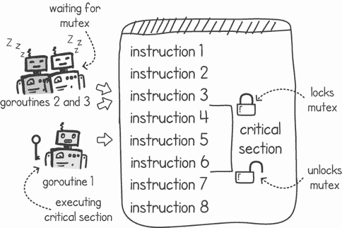
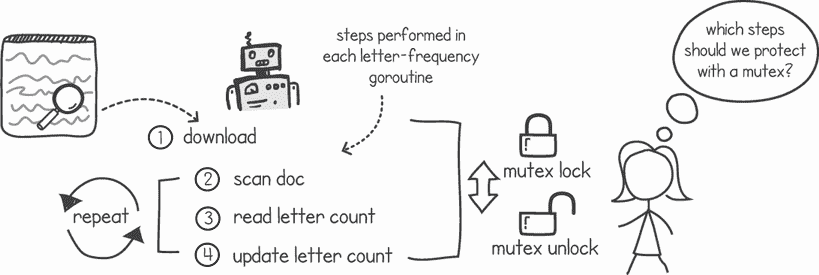
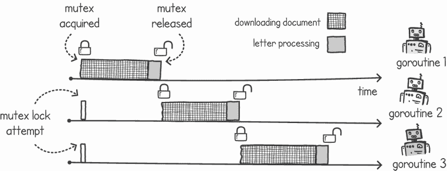
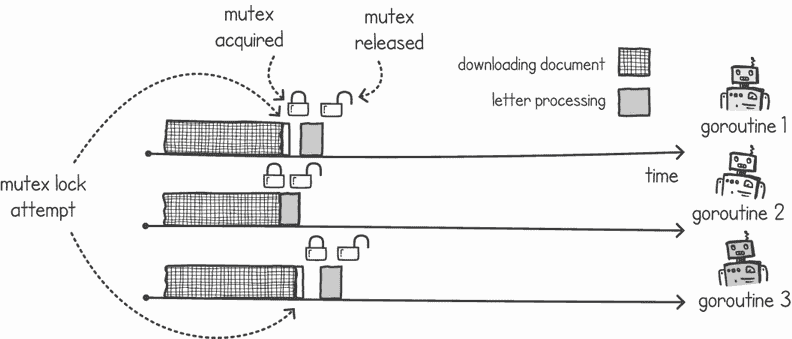
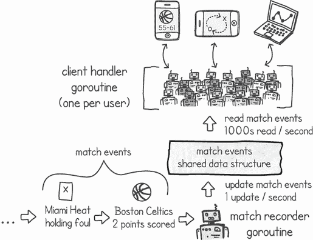
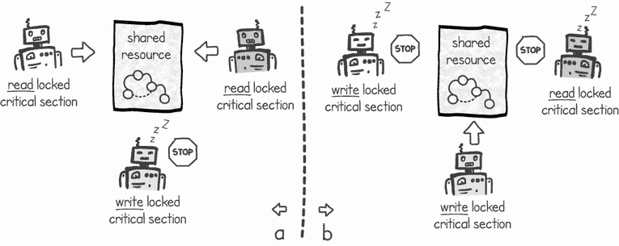
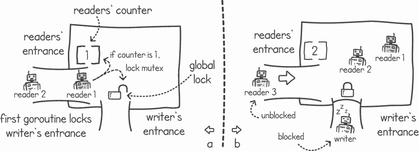
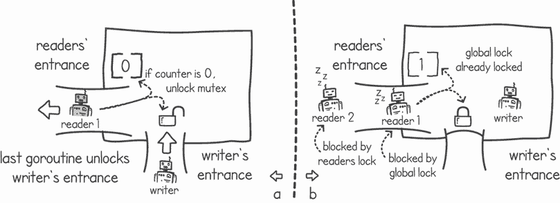

# 4 使用互斥锁进行同步

本章涵盖

+   使用互斥锁保护关键部分

+   使用读写锁提高性能

+   实现优先读的读写锁

我们可以使用互斥锁来保护代码中的关键部分，这样一次只有一个 goroutine 访问共享资源。通过这种方式，我们消除了竞态条件。互斥锁的变体，有时称为锁，被用于支持并发编程的每种语言中。在本章中，我们将首先查看互斥锁提供的功能。然后我们将查看一种称为 *读写互斥锁* 的互斥锁变体。

读写互斥锁在需要仅在修改共享资源时阻止并发的情况下提供了性能优化。它们使我们能够在共享资源上执行多个并发读取，同时仍然允许我们独占锁定写访问。我们将看到读写互斥锁的一个示例应用，并了解其内部结构，然后我们自己构建一个。

## 4.1 使用互斥锁保护关键部分

如果我们有一种方法可以确保只有一个执行线程运行关键部分，这将是什么样子？这正是互斥锁提供的功能。把它们想象成物理锁，它们阻止我们的代码的某些部分在任何时候被多个 goroutine 访问。如果一次只有一个 goroutine 访问关键部分，我们就安全了，因为竞态条件只发生在两个或更多 goroutine 之间有冲突的情况下。

### 4.1.1 我们如何使用互斥锁？

我们可以使用互斥锁来标记我们关键部分的开始和结束，如图 4.1 所示。当一个 goroutine 到达由互斥锁保护的关键部分代码时，它首先将此互斥锁显式锁定，作为程序代码中的指令。然后，goroutine 开始执行关键部分的代码，完成后，它将解锁互斥锁，以便另一个 goroutine 可以访问关键部分。



图 4.1 只允许一个 goroutine 在互斥锁保护的关键部分中。

如果另一个 goroutine 尝试锁定一个已经被锁定的互斥锁，该 goroutine 将被挂起，直到互斥锁被释放。如果有多个 goroutine 被挂起，等待锁变得可用，则只恢复一个 goroutine，并且它是下一个获得互斥锁锁的。

定义 *互斥锁*，简称 *mutex*，是一种并发控制形式，其目的是防止竞态条件。互斥锁允许只有一个执行（如 goroutine 或内核级线程）进入关键部分。如果有两个执行同时请求访问互斥锁，互斥锁的语义保证只有一个 goroutine 将获得对互斥锁的访问。其他执行将不得不等待直到互斥锁再次可用。

在 Go 中，互斥锁功能由 `sync` 包提供，类型为 `Mutex`。此类型为我们提供了两个主要操作，`Lock()` 和 `Unlock()`，我们可以使用它们分别标记临界代码段的开始和结束。作为一个简单的例子，我们可以修改上一章中的 `stingy()` 和 `spendy()` 函数，以保护我们的临界区。在以下列表中，我们将使用互斥锁来保护共享的 `money` 变量，防止两个 goroutine 同时修改它。

列表 4.1 使用互斥锁的 Stingy 和 Spendy 的函数

```
package main

import (
    "*fmt*"
    "*sync*"
    "*time*"
)

func stingy(money *int, mutex *sync.Mutex) {    ❶
    for i := 0; i < 1000000; i++ {
        mutex.Lock()                            ❷
        *money += 10
        mutex.Unlock()                          ❸
    }
    fmt.Println("*Stingy Done*")
}

func spendy(money *int, mutex *sync.Mutex) {    ❶
    for i := 0; i < 1000000; i++ {
        mutex.Lock()                            ❷
        *money -= 10
        mutex.Unlock()                          ❸
    }
    fmt.Println("*Spendy Done*")
}
```

❶ 接受共享互斥结构体的指针

❷ 在进入临界区之前锁定互斥锁

❸ 退出临界区后解锁

注意：本书中的所有列表均可在 [github.com/cutajarj/ConcurrentProgrammingWithGo](https://github.com/cutajarj/ConcurrentProgrammingWithGo) 上找到。

如果 Stingy 和 Spendy 的 goroutine 准确地在同一时间尝试锁定互斥锁，互斥锁将保证只有一个 goroutine 能够锁定它。其他 goroutine 将在互斥锁再次可用之前暂停执行。例如，Stingy 将必须等待 Spendy 减去金额并释放互斥锁。当互斥锁再次可用时，Stingy 的暂停 goroutine 将被恢复，获取临界区的锁。

以下列表显示了修改后的 `main()` 函数创建一个新的互斥锁并将引用传递给 `stingy()` 和 `spendy()`。

列表 4.2 创建互斥锁的 `main()` 函数

```
func main() {
    money := 100
    mutex := sync.Mutex{}                  ❶
    go stingy(&money, &mutex)              ❷
    go spendy(&money, &mutex)              ❷
    time.Sleep(2 * time.Second)
    mutex.Lock()                           ❸
    fmt.Println("*Money in bank account:* ", money)
    mutex.Unlock()                         ❸
}
```

❶ 创建一个新的互斥锁

❷ 将互斥锁的引用传递给两个 goroutine

❸ 使用互斥锁保护读取共享变量

注意：当我们创建一个新的互斥锁时，其初始状态总是未锁定。

在我们的 `main()` 函数中，我们在 goroutine 完成后读取 `money` 变量时也使用了互斥锁。由于我们睡眠一段时间以确保 goroutine 完成，这里的竞争条件非常不可能。然而，即使你确信不会有冲突，保护共享资源也是良好的实践。使用互斥锁（以及后续章节中介绍的其他同步机制）确保 goroutine 读取变量的更新副本。

注意：我们应该保护所有临界区，包括 goroutine 只读取共享资源的部分。编译器的优化可能会重新排序指令，导致它们以不同的方式执行。使用适当的同步机制，如互斥锁，可以确保我们读取共享资源的最新副本。

如果我们现在一起运行列表 4.1 和 4.2，我们可以看到我们已经消除了竞争条件。在 Stingy 和 Spendy goroutine 完成后，账户余额为 $100。以下是输出：

```
$ go run stingyspendymutex.go
Stingy Done
Spendy Done
Money in bank account:  100
```

我们还可以尝试使用 `-race` 标志运行此代码，以检查是否存在竞争条件。

互斥锁是如何实现的？

互斥锁通常需要操作系统和硬件的帮助来实现。如果我们有一个只有一个处理器的系统，我们可以在一个线程持有锁的时候禁用中断来实现互斥锁。这样，另一个执行将不会中断当前线程，并且没有干扰。然而，这并不是理想的，因为编写不良的代码可能会导致整个系统被所有其他进程和线程阻塞。一个恶意或编写不良的程序在获取互斥锁后可能会进入无限循环并崩溃系统。此外，这种方法在多处理器系统上也不适用，因为其他线程可能在另一个 CPU 上并行执行。

互斥锁的实现涉及到硬件的支持，以提供原子测试和设置操作。通过这个操作，一个执行可以检查一个内存位置，如果值是它所期望的，它将内存更新为锁定标志值。硬件保证这个测试和设置操作是原子的——也就是说，在操作完成之前，没有其他执行可以访问该内存位置。早期的硬件实现通过阻塞整个总线来保证这种原子性，这样就没有其他处理器可以在同一时间使用该内存。如果另一个执行执行了这个操作，并发现它已经设置为锁定标志值，操作系统将阻塞该线程的执行，直到内存位置变回空闲。

我们将在第十二章中探讨如何使用原子操作和操作系统调用来实现互斥锁。在那个章节中，我们还将检查 Go 语言是如何实现其自己的互斥锁的。

### 4.1.2 互斥锁与顺序处理

当然，当我们有超过两个 goroutine 时，我们也可以使用互斥锁。在前一章中，我们实现了一个字母频率程序，该程序使用了多个 goroutine 来下载并计算英文字母表中字符的出现次数。代码缺乏任何同步，当我们运行程序时，给出了错误的计数。如果我们想使用互斥锁来修复这个竞争条件，我们应该在代码的哪个点锁定和解锁互斥锁（见图 4.2）？



图 4.2 决定放置互斥锁和解锁的位置

注意：使用互斥锁的效果是限制并发性。在锁定和解锁互斥锁之间的代码在任何时候都由一个 goroutine 执行，有效地将这部分代码转换为顺序执行。正如我们在第一章中看到的，根据 Amdahl 定律，顺序到并行的比例将限制我们代码的性能可扩展性，因此我们减少持有互斥锁锁的时间至关重要。

列表 4.3 显示了我们可以如何首先修改`main()`函数以创建互斥锁并将其引用传递给我们的`countLetters()`函数。这与我们在 Stingy 和 Spendy 程序中使用的模式相同，即在`main()` goroutine 中创建互斥锁并与他人共享。我们还在输出结果时保护`frequency`变量的读取。

列表 4.3 `main()` 函数创建用于字母频率的互斥锁（省略了导入）

```
package main

import ( ... )

const AllLetters = "*abcdefghijklmnopqrstuvwxyz*"

func main() {
    mutex := sync.Mutex{}                         ❶
    var frequency = make([]int, 26)
    for i := 1000; i <= 1030; i++ {
        url := fmt.Sprintf("*https://rfc-editor.org/rfc/rfc%d.txt*", i)
        go CountLetters(url, frequency, &mutex)   ❷
    }
    time.Sleep(60 * time.Second)                  ❸
    mutex.Lock()                                  ❹
    for i, c := range AllLetters {                ❹
        fmt.Printf("*%c-%d* ", c, frequency[i])     ❹
    }                                             ❹
    mutex.Unlock()                                ❹
}
```

❶ 创建新的互斥锁

❷ 将互斥锁的引用传递给 goroutines

❸ 等待 60 秒

❹ 使用互斥锁保护读取共享变量

如果我们在`CountLetters()`函数的开始锁定互斥锁并在消息输出完毕后释放它会发生什么？您可以在以下列表中看到这一点，其中我们在调用函数后立即锁定互斥锁，并在输出完成消息后释放它。

列表 4.4 错误（慢速）的锁定和解锁互斥锁的方式

```
func CountLetters(url string, frequency []int, mutex *sync.Mutex) {
    mutex.Lock()                              ❶
    resp, _ := http.Get(url)
    defer resp.Body.Close()
    if resp.StatusCode != 200 {
        panic("*Server returning error status code:* " + resp.Status)
    }
    body, _ := io.ReadAll(resp.Body)
    for _, b := range body {
        c := strings.ToLower(string(b))
        cIndex := strings.Index(AllLetters, c)
        if cIndex >= 0 {
            frequency[cIndex] += 1
        }
    }
    fmt.Println("*Completed:*", url, time.Now().Format("*15:04:05*"))
    mutex.Unlock()                            ❷
}
```

❶ 锁定互斥锁以进行整个执行过程，使一切按顺序进行

❷ 解锁互斥锁

通过以这种方式使用互斥锁，我们已经将并发程序转换为顺序程序。由于我们无谓地阻塞了整个执行过程，我们将一次下载和处理一个网页。如果我们继续运行这个程序，所需的时间将与程序的非并发版本相同，尽管执行顺序将是随机的：

```
$ go run charcountermutexslow.go
Completed: https://rfc-editor.org/rfc/rfc1002.txt 08:44:21
Completed: https://rfc-editor.org/rfc/rfc1030.txt 08:44:23
. . .
Completed: https://rfc-editor.org/rfc/rfc1028.txt 08:44:33
Completed: https://rfc-editor.org/rfc/rfc1029.txt 08:44:34
Completed: https://rfc-editor.org/rfc/rfc1001.txt 08:44:34
Completed: https://rfc-editor.org/rfc/rfc1000.txt 08:44:35
a-103445 b-23074 c-61005 d-51733 e-181360 f-33381 g-24966 h-47722 i-103262 j-3279 k-8839 l-49958 m-40026 n-108275 o-106320 p-41404 q-3410 r-101118 s-101040 t-136812 u-35765 v-13666 w-18259 x-4743 y-18416 z-1404
```

图 4.3 显示了这种锁定方式的简化调度图，仅使用三个 goroutines。该图显示我们的 goroutines 大部分时间在下载文档，而处理文档的时间较短。（在此图中，为了说明目的，我们低估了下载和处理之间的时间比例。实际上，这个差异要大得多。）我们的 goroutines 大部分时间在下载文档，而处理文档的时间只有一秒钟。从性能的角度来看，阻塞整个执行过程是没有意义的。文档下载步骤与其他 goroutines 没有共享内容，因此在那里发生竞争条件的风险很小。



图 4.3 显示过多地锁定代码将我们的字母频率并发程序转换为顺序程序。

TIP 在决定如何以及何时使用互斥锁时，最好专注于我们应该保护哪些资源，并发现关键部分的开始和结束位置。然后我们需要考虑如何最小化`Lock()`和`Unlock()`调用的次数。

根据互斥锁的实现方式，如果我们频繁调用`Lock()`和`Unlock()`操作，通常会有性能开销。（在第十二章中，我们将看到原因。）在我们的字母频率程序中，我们可以尝试使用互斥锁仅保护一条语句：

```
mutex.Lock()
frequency[cIndex] += 1
mutex.Unlock()
```

然而，这意味着我们将为下载文档中的每个字母调用这两个操作。由于处理整个文档是一个非常快速的操作，因此，在循环之前调用`Lock()`并在退出循环后调用`Unlock()`可能更高效。这在上面的列表中显示。

列表 4.5 在处理部分使用互斥锁（省略了导入）

```
package listing4_5

import (...)

const AllLetters = "*abcdefghijklmnopqrstuvwxyz*"

func CountLetters(url string, frequency []int, mutex *sync.Mutex) {
    resp, _ := http.Get(url)                                        ❶
    defer resp.Body.Close()                                         ❶
    if resp.StatusCode != 200 {                                     ❶
        panic("*Server returning error code:* " + resp.Status)        ❶
    }                                                               ❶
    body, _ := io.ReadAll(resp.Body)                                ❶
    mutex.Lock()                                                    ❷
    for _, b := range body {                                        ❷
        c := strings.ToLower(string(b))                             ❷
        cIndex := strings.Index(AllLetters, c)                      ❷
        if cIndex >= 0 {                                            ❷
            frequency[cIndex] += 1                                  ❷
        }                                                           ❷
    }                                                               ❷
    mutex.Unlock()                                                  ❷
    fmt.Println("*Completed:*", url, time.Now().Format("*15:04:05*"))
}
```

❶ 并发执行函数的慢速部分（下载）

❷ 仅锁定函数的快速处理部分

在这个版本的代码中，下载部分，这是我们函数中的长部分，将并发执行。然后，快速的字母计数处理将顺序执行。我们基本上通过只在代码部分使用锁来最大化我们程序的扩展性，这些部分相对于其他部分运行得非常快。我们可以运行前面的列表，正如预期的那样，它运行得更快，并给出了持续的正确结果：

```
$ go run charcountermutex.go
Completed: https://rfc-editor.org/rfc/rfc1026.txt 08:49:52
Completed: https://rfc-editor.org/rfc/rfc1025.txt 08:49:52
. . .
Completed: https://rfc-editor.org/rfc/rfc1008.txt 08:49:53
Completed: https://rfc-editor.org/rfc/rfc1024.txt 08:49:53
a-103445 b-23074 c-61005 d-51733 e-181360 f-33381 g-24966 h-47722 i-103262 j-3279 k-8839 l-49958 m-40026 n-108275 o-106320 p-41404 q-3410 r-101118 s-101040 t-136812 u-35765 v-13666 w-18259 x-4743 y-18416 z-1404
```

程序的执行在图 4.4 中进行了说明。同样，为了视觉效果，下载和处理部分之间的比例被夸大了。实际上，处理所花费的时间是下载网页所花费时间的极小部分，因此加速效果更为显著。实际上，在我们的`main()`函数中，我们可以将睡眠时间减少到几秒钟（之前是 60 秒）。



图 4.4 仅锁定`countLetters()`函数的处理部分

第二种解决方案比我们的第一次尝试更快。如果你比较图 4.3 和图 4.4，你会看到当我们锁定较小的代码部分时，我们完成得更快。这里的教训是要最小化持有互斥锁锁的时间，同时尝试减少互斥锁调用的次数。如果你回想起 Amdahl 定律，它告诉我们如果我们的代码在并行部分花费更多时间，我们可以更快地完成并更好地扩展，这就有意义了。

### 4.1.3 非阻塞互斥锁

当一个 goroutine 调用`Lock()`操作时，如果互斥锁已经被另一个执行占用，它将会阻塞。这就是所谓的阻塞函数：goroutine 的执行会停止，直到另一个 goroutine 调用`Unlock()`。在某些应用中，我们可能不想阻塞 goroutine，而是在尝试再次锁定互斥锁和访问临界区之前执行其他工作。

因此，Go 的互斥锁提供了一个名为`TryLock()`的另一个函数。当我们调用这个函数时，我们可以预期两种结果之一：

+   锁可用，在这种情况下我们获取它，函数返回布尔值`true`。

+   锁不可用，因为另一个 goroutine 正在使用互斥锁，函数将立即返回（而不是阻塞）并返回一个布尔值`false`。

非阻塞的使用

Go 在版本 1.18 中为互斥锁添加了`TryLock()`函数。这种非阻塞调用的有用示例很难找到。这是因为与在其他语言中使用内核级线程相比，在 Go 中创建 goroutine 的成本非常低。如果互斥锁不可用，让 goroutine 做其他事情没有太多意义，因为在 Go 中，等待锁释放时，创建另一个 goroutine 来完成工作更容易。事实上，Go 的互斥锁文档提到了这一点（来自`pkg.go.dev/sync#Mutex.TryLock`）：

*请注意，虽然存在正确的`TryLock`使用方式，但它们很少见，`TryLock`的使用通常是一个特定互斥锁使用中更深层次问题的标志。*

使用`TryLock()`的一个例子是监控 goroutine，它检查某个任务的进度，而不想打扰任务的进度。如果我们使用正常的`Lock()`操作，并且应用程序正忙于许多其他 goroutine 想要获取锁，那么我们只是在监控目的上对互斥锁增加了额外的竞争。当我们使用`TryLock()`时，如果另一个 goroutine 正忙于持有互斥锁的锁，监控 goroutine 可以决定在系统不那么繁忙时稍后再尝试。想想看，当你看到入口处的大长队时，去邮局办一个非重要的事情，并决定改天再尝试（见图 4.5）。


图 4.5 尝试获取互斥锁，如果忙碌，稍后再尝试。

我们可以将我们的字母频率程序修改为在主 goroutine 中周期性地监控频率表，同时我们使用其他 goroutine 进行下载和文档扫描。列表 4.6 显示了`main()`函数每 100 毫秒打印`frequency`切片的内容。为了做到这一点，它必须获取互斥锁；否则，我们可能会读取错误的数据。然而，如果我们不想无谓地打扰忙碌的`CountLetters()` goroutine，我们就不希望这样做。因此，我们使用`TryLock()`操作，它尝试获取锁，但如果锁不可用，它将在下一个 100 毫秒周期再次尝试。

列表 4.6 使用`TryLock()`监控频率表

```
package main

import (
    "*fmt*"
    "*github.com/cutajarj/ConcurrentProgrammingWithGo/chapter4/listing4.5*"
    "*sync*"
    "*time*"
)

func main() {
    mutex := sync.Mutex{}
    var frequency = make([]int, 26)
    for i := 2000; i <= 2200; i++ {
        url := fmt.Sprintf("*https://rfc-editor.org/rfc/rfc%d.txt*", i)
        go listing4_5.CountLetters(url, frequency, &mutex)
    }
    for i := 0; i < 100; i++ {
        time.Sleep(100 * time.Millisecond)                 ❶
        if mutex.TryLock() {                               ❷
            for i, c := range listing4_5.AllLetters {      ❸
                fmt.Printf("*%c-%d* ", c, frequency[i])      ❸
            }                                              ❸
            mutex.Unlock()                                 ❸
        } else {
            fmt.Println("*Mutex already being used*")        ❹
        }
    }
}
```

❶ 睡眠 100 毫秒

❷ 尝试获取互斥锁

❸ 如果互斥锁可用，它会输出频率计数并释放互斥锁。

❹ 如果互斥锁不可用，它会输出一条消息并在稍后再次尝试。

当我们运行列表 4.6 时，我们可以在输出中看到`main()`goroutine 试图获取锁以打印频率表。有时它会成功；在其他时候，当它不成功时，它会等待下一个 100 毫秒再次尝试：

```
$ go run nonblockingmutex.go
a-0 b-0 c-0 d-0 e-0 f-0 g-0 h-0 i-0 j-0 k-0 l-0 m-0 n-0 o-0 p-0 q-0 r-0 s-0 t-0 u-0 v-0 w-0 x-0 y-0 z-0
. . .
Completed: https://rfc-editor.org/rfc/rfc2005.txt 11:18:39
a-2367 b-334 c-1270 d-1196 e-3685 f-1069 g-599 h-957 i-2537 j-22 k-112 l-1218 m-927 n-2131 o-2321 p-722 q-64 r-1673 s-2188 t-2609 u-628 v-204 w-510 x-65 y-364 z-15
Completed: https://rfc-editor.org/rfc/rfc2122.txt 11:18:39
. . .
Completed: https://rfc-editor.org/rfc/rfc2027.txt 11:18:41
Mutex already being used
Completed: https://rfc-editor.org/rfc/rfc2006.txt 11:18:41
a-462539 b-90971 c-258306 d-235639 e-766999 f-142655 g-106497 h-212728 i-460748 j-10833 k-32495 l-213285 m-170227 n-433419 o-426131 p-174817 q-12578 r-419110 s-441282 t-597287 u-160276 v-60274 w-63028 x-28231 y-80664 z-6908
Completed: https://rfc-editor.org/rfc/rfc2178.txt 11:18:41
. . .
```

## 4.2 使用读者-写者互斥锁提高性能

有时，互斥锁可能过于限制性。我们可以将互斥锁视为一种简单的工具，通过阻塞并发来解决并发问题。一次只能有一个 goroutine 执行我们的互斥锁保护的临界区。这对于保证我们不遭受竞态条件非常有用，但这也可能无谓地限制了某些应用程序的性能和可扩展性。读者-写者互斥锁为我们提供了一种标准互斥锁的变体，它只在需要更新共享资源时才阻塞并发。使用读者-写者互斥锁，我们可以提高那些在共享数据上执行大量读操作的应用程序的性能，与更新操作相比。

### 4.2.1 Go 的读者-写者互斥锁

如果我们有一个主要服务于许多并发客户端的静态数据应用程序呢？我们在第二章中概述了这样一个应用程序，当时我们有一个提供体育信息的 Web 服务器应用程序。让我们以一个类似的应用程序为例，该应用程序为用户提供关于篮球比赛的更新。图 4.6 展示了这样一个应用程序。



图 4.6 读取密集型服务器应用程序示例

在这个应用程序中，用户通过他们的设备检查实时篮球比赛的更新。运行在我们服务器上的 Go 应用程序提供这些更新。在这个应用程序中，我们有一个 match-recorder goroutine，每次游戏发生事件时都会更改共享数据的内容。事件可以是得分、犯规、传球等。

篮球是一项快节奏的运动，所以平均每秒我们会有几个这样的事件。在另一端，我们有一组大量的 goroutine 将整个游戏事件列表提供给大量连接的用户。用户出于各种原因使用这些数据：显示比赛统计数据、理解比赛策略，或者只是查看比分和比赛时间。这场比赛很受欢迎，所以我们应该构建能够处理尽可能多的每秒用户请求的东西。我们预计每秒会有数千个针对我们的比赛事件数据的请求。

让我们编写两种不同类型的 goroutine，从 match-recorder 函数开始，该函数在列表 4.7 中展示。运行此函数的 goroutine 会监听游戏期间发生的事件，例如得分、犯规等，然后将它们追加到一个共享数据结构中。在这种情况下，共享数据结构是一个`string`类型的 Go 切片。在我们的代码中，我们通过添加包含"`Match Event i`"的字符串来模拟每 200 毫秒发生一个事件。在现实世界中，goroutine 会监听体育直播或定期轮询 API，事件类型为"`3 pointer from Team A`"。

列表 4.7 模拟周期性游戏事件的 match recorder 函数

```
package main

import (
    "*fmt*"
    "*strconv*"
    "*sync*"
    "*time*"
)

func matchRecorder(matchEvents *[]string, mutex *sync.Mutex) {
    for i := 0; ; i++ {
        mutex.Lock()                           ❶
        *matchEvents = append(*matchEvents,    ❷
            "*Match event* " + strconv.Itoa(i))  ❷
        mutex.Unlock()                         ❸
        time.Sleep(200 * time.Millisecond)
        fmt.Println("*Appended match event*")
    }
}
```

❶ 使用互斥锁保护对 matchEvents 的访问

❷ 每 200 毫秒添加一个包含比赛事件的模拟字符串

❸ 解锁互斥锁

列表 4.8 显示了一个客户端处理器函数以及一个复制共享切片中所有事件的函数。我们可以将 `clientHandler()` 函数作为一个 goroutine 运行，每个处理一个已连接的用户。该函数锁定包含游戏事件的共享切片，并复制切片中的每个元素。这个函数模拟构建发送给用户的响应。在现实世界中，我们可以将这个响应格式化为类似 JSON 的格式。`clientHandler()` 函数有一个循环，重复 100 次，以模拟同一个用户多次请求。

列表 4.8 使用独占访问共享列表的客户端处理器

```
func clientHandler(mEvents *[]string, mutex *sync.Mutex, st time.Time) {
    for i := 0; i < 100; i ++ {
        mutex.Lock()                                                ❶
        allEvents := copyAllEvents(mEvents)                         ❷
        mutex.Unlock()                                              ❸

        timeTaken := time.Since(st)                                 ❹
        fmt.Println(len(allEvents), "*events copied in*", timeTaken)  ❺
    }
}

func copyAllEvents(matchEvents *[]string) []string {
    allEvents := make([]string, 0, len(*matchEvents))
    for _, e := range *matchEvents {
        allEvents = append(allEvents, e)
    }
    return allEvents
}
```

❶ 使用互斥锁保护对比赛事件列表的访问

❷ 复制比赛切片的全部内容，模拟构建发送给客户端的响应

❸ 解锁互斥锁

❹ 计算自开始以来经过的时间

❺ 将服务客户端所需的时间输出到控制台

在列表 4.9 中，我们将所有内容连接起来，并在 `main()` 函数中启动我们的 goroutines。在这个 `main()` 函数中，我们在创建一个普通互斥锁之后，预先填充比赛事件切片中的许多比赛事件。这模拟了一个已经进行了一段时间的游戏。我们这样做是为了测量当切片包含一些事件时，我们代码的性能。

列表 4.9 `main()` 函数预填充事件并启动 goroutines

```
func main() {
    mutex := sync.Mutex{}                                   ❶
    var matchEvents = make([]string, 0, 10000)
    for j := 0; j < 10000; j++ {                            ❷
        matchEvents = append(matchEvents, "*Match event*")    ❷
    }
    go matchRecorder(&matchEvents, &mutex)                  ❸
    start := time.Now()                                     ❹
    for j := 0; j < 5000; j++ {
        go clientHandler(&matchEvents, &mutex, start)       ❺
    }
    time.Sleep(100 * time.Second)
}
```

❶ 初始化一个新的互斥锁

❷ 在事件切片中预填充许多事件，模拟正在进行的游戏

❸ 启动比赛记录器 Go 协程

❹ 在启动客户端处理器 goroutines 之前记录开始时间

❺ 启动大量客户端处理器 goroutines

在 `main()` 函数中，然后启动一个比赛记录器 goroutine 和 5,000 个客户端处理器 goroutine。基本上，我们正在模拟一个正在进行的游戏，并且有大量用户同时请求获取游戏更新。我们还记录在启动客户端处理器 goroutines 之前的时间，以便我们可以测量处理所有请求所需的时间。最后，我们的 `main()` 函数休眠一段时间，等待客户端处理器 goroutines 完成。

与读取查询的数量相比，数据变化非常缓慢。当我们使用正常的互斥锁锁时，每次一个 goroutine 读取共享的篮球数据时，它会阻塞所有其他正在服务的 goroutines，直到它完成。即使客户端处理器只是读取共享的切片而不进行任何修改，我们仍然给每个处理器提供对切片的独占访问。请注意，如果有多个 goroutine 只是读取共享数据而不更新它，就没有必要这种独占访问；并发读取共享数据不会引起任何干扰。

注意：只有当我们没有适当同步地更改共享状态时，才会发生竞态条件。如果我们不修改共享数据，就不会有竞态条件的风险。

如果所有客户端处理 goroutine 都可以非独占地访问切片，那么在需要时它们可以同时读取列表。这将提高性能，因为它将允许多个仅读取共享数据的 goroutine 同时访问它。我们只有在需要更新共享数据时才会阻止对共享数据的访问。在这个例子中，我们更新数据的频率非常低（每秒几次），与我们的读取次数（每秒数千次）相比。因此，我们将从允许多个并发读取但独占写入的系统中获得好处。

这正是 *读者-写者锁* 给我们的。当我们只需要读取共享资源而不更新它时，读者-写者锁允许多个并发 goroutine 执行只读关键部分。当我们需要更新共享资源时，执行写关键部分的 goroutine 会请求写锁以获取独占访问。这一概念在图 4.7 中有所描述。在图的左侧，读锁允许并发读取访问，同时阻止任何写访问。在右侧，获取写锁阻止所有其他访问，无论是读取还是写入，就像正常的互斥锁一样。



图 4.7 使用读者-写者锁的 goroutine

Go 自带读者-写者锁的实现。除了提供常规的独占锁定和解锁功能外，Go 的 `sync.RWMutex` 还提供了额外的方法来使用互斥锁的读者端。以下是我们可以使用的函数列表：

```
type RWMutex
  //Locks mutex
  func (rw *RWMutex) Lock()
  //Locks read part of mutex
  func (rw *RWMutex) RLock()
  //Returns read part locker of mutex
  func (rw *RWMutex) RLocker() Locker
  //Unlocks read part of mutex
  func (rw *RWMutex) RUnlock()
  //Tries to lock mutex
  func (rw *RWMutex) TryLock() bool
  //Tries to lock read part of mutex
  func (rw *RWMutex) TryRLock() bool
  //Unlock mutex
  func (rw *RWMutex) Unlock()
```

函数名中带有 `R` 的锁定和解锁功能，例如 `RLock()` 函数，为我们提供了 `RWMutex` 的读者端。其他所有功能，如 `Lock()`，则让我们可以操作写者部分。现在，我们可以修改我们的篮球更新应用程序以使用这些新功能。在下面的列表中，我们将初始化这些读者-写者互斥锁之一，并将其传递给 `main()` 函数中的其他 goroutine。

列表 4.10 `main()` 函数创建 `RWMutex`

```
func main() {
    mutex := sync.RWMutex{}                             ❶
    var matchEvents = make([]string, 0, 10000)
    for j := 0; j < 10000; j++ {
        matchEvents = append(matchEvents, "*Match event*")
    }
    go matchRecorder(&matchEvents, &mutex)              ❷
    start := time.Now()
    for j := 0; j < 5000; j++ {
        go clientHandler(&matchEvents, &mutex, start)   ❸
    }
    time.Sleep(100 * time.Second)
}
```

❶ 初始化一个新的读者-写者互斥锁

❷ 将读者-写者互斥锁传递给匹配记录器

❸ 将读者-写者互斥锁传递给客户端处理 goroutine

接下来，我们的两个函数，`matchRecorder()` 和 `clientHandler()`，需要更新，以便它们分别调用写锁和读锁互斥锁函数。在列表 4.11 中，`matchRecorder()` 调用 `Lock()` 和 `UnLock()`，因为它需要更新共享数据结构。`clientHandler()` goroutine 使用 `RLock()` 和 `RUnlock()`，因为它们只读取共享数据结构。这里使用的读锁是必要的，因为我们不希望在遍历期间修改切片数据结构。例如，在另一个 goroutine 遍历时修改切片的指针和内容可能会导致我们跟随无效的指针引用。

列表 4.11 匹配记录器和客户端处理函数调用读写互斥锁

```
func matchRecorder(matchEvents *[]string, mutex *sync.RWMutex) {
    for i := 0; ; i++ {
        mutex.Lock()                           ❶
        *matchEvents = append(*matchEvents,    ❶
            "*Match event* " + strconv.Itoa(i))  ❶
        mutex.Unlock()                         ❶
        time.Sleep(200 * time.Millisecond)
        fmt.Println("*Appended match event*")
    }
}

func clientHandler(mEvents *[]string, mutex *sync.RWMutex, st time.Time) {
    for i := 0; i < 100; i ++ {
        mutex.RLock()                          ❷
        allEvents := copyAllEvents(mEvents)    ❷
        mutex.RUnlock()                        ❷
        timeTaken := time.Since(st)
        fmt.Println(len(allEvents), "*events copied in*", timeTaken)
    }
}
```

❶ 使用写互斥锁保护关键部分

❷ 使用读互斥锁保护关键部分

在我们的 `clientHandler()` 函数中，执行 `RLock()` 和 `RUnlock()` 之间的关键代码部分的 goroutine 会阻止另一个 goroutine 在我们的 `matchRecorder()` 函数中获取写锁。然而，它不会阻止另一个 goroutine 也获取对关键部分的读者锁。这意味着我们可以有并发执行 `clientHandler()` 的 goroutine，而没有任何读 goroutine 会相互阻塞。

当有游戏更新时，`matchRecorder()` 函数中的 goroutine 通过在互斥锁上调用 `Lock()` 函数来获取写锁。只有在任何活动的 `matchRecorder()` goroutine 释放其读锁时，才会获取写锁。当获取写锁后，它将阻止任何其他 goroutine 在我们 `clientHandler()` 函数中的关键部分访问，直到我们通过调用 `UnLock()` 释放写锁。

如果我们有一个运行多个核心的系统，这个例子应该会给我们比单核系统更高的速度提升。这是因为我们会并行运行多个客户端处理 goroutine，因为它们可以同时访问共享数据。在一次测试运行中，我使用读者-写者互斥锁实现了吞吐量性能的三倍增长：

```
$ go run matchmonitor.go
. . .
10064 events copied in 33.033974291s
Appended match event
Appended match event
. . .
$ go run matchmonitor.go
. . .
10033 events copied in 10.228970583s
Appended match event
Appended match event
. . .
```

图 4.8 将前面的结果转换为每秒请求数，并显示了在 10 核机器上运行此简单应用程序时使用读者-写者互斥锁的优势。该图表假设应用程序处理了总共 500,000 个请求（来自 5,000 个客户端的 100 个请求）。


图 4.8 在多核处理器上运行的以读为主的服务器应用程序的性能差异

注意：在不同的硬件上运行此应用程序会产生不同的结果。在较慢的机器上运行可能需要更改末尾的睡眠周期或减少客户端处理 goroutine 的数量。

### 4.2.2 构建自己的读优先读者-写者互斥锁

现在我们已经看到了如何使用读者-写者互斥锁，那么了解它们在内部是如何工作的会很好。在本节中，我们将尝试构建自己的读者-写者互斥锁，类似于 Go 的 `sync` 包中捆绑的互斥锁。为了使事情简单，我们只构建四个重要的函数：`ReadLock()`、`ReadUnlock()`、`WriteLock()` 和 `WriteUnlock()`。我们将它们的命名与 `sync` 版本略有不同，以便我们可以区分我们的实现与 Go 库中的实现。

为了实现我们的读者-写入者互斥锁，我们需要一个系统，当 goroutine 调用`ReadLock()`时，阻止对写入部分的任何访问，同时允许其他 goroutine 仍然可以调用`ReadLock()`而不被阻塞。我们将通过确保调用`WriteLock()`的 goroutine 挂起执行来阻止写入部分。只有当所有读取 goroutine 都调用`ReadUnlock()`后，我们才允许另一个 goroutine 从`WriteLock()`中解除阻塞。

为了帮助我们可视化这个系统，我们可以将 goroutines 想象成试图通过两个入口进入房间的实体。这个房间象征着对共享资源的访问。读者 goroutines 使用一个特定的入口，而写入者使用另一个入口。入口一次只允许一个 goroutine 进入，尽管同时可以有多个 goroutine 在房间里。我们保持一个计数器，读者 goroutine 通过读者入口进入时将其增加`1`，离开房间时将其减少`1`。写入者的入口可以通过我们称之为全局锁的东西从内部锁定。这个概念在图 4.9 的左侧显示。



图 4.9 锁定读者-写入者互斥锁的读取部分

程序是这样的，当第一个读者 goroutine 进入房间时，它必须锁定写入者的入口，如图 4.9 的右侧所示。这确保了写入者 goroutine 将无法进入，阻止了 goroutine 的执行。然而，其他读者 goroutine 仍然可以通过它们自己的入口进入。读者 goroutine 知道它是第一个进入房间的原因是计数器的值为`1`。

写入者的进入这里只是一个我们称之为全局锁的互斥锁。写入者需要获取这个互斥锁以持有读者-写入者锁的写入者部分。当第一个读者锁定这个互斥锁时，它会阻止任何请求写入者部分锁的 goroutine。

我们需要确保在任何时候只有一个 goroutine 使用读者入口，因为我们不希望两个同时的读取 goroutine 同时进入并认为他们是第一个进入房间的人。这会导致他们都尝试锁定全局锁，而只有一个是成功的。因此，为了同步访问，确保一次只有一个 goroutine 可以使用读者入口，我们可以使用另一个互斥锁。在下面的列表中，我们将称这个互斥锁为`readersLock`。读者计数器由`readersCounter`变量表示，我们将写入者的锁称为`globalLock`。

列表 4.12 读者-写入者互斥锁的类型结构

```
package listing4_12

import "*sync*"

type ReadWriteMutex struct {
    readersCounter int           ❶

    readersLock    sync.Mutex    ❷

    globalLock     sync.Mutex    ❸
}
```

❶ 计数整数变量，用于统计当前在临界区内的读者 goroutine 数量

❷ 用于同步读者访问的互斥锁

❸ 用于阻止任何写入者访问的互斥锁

下面的列表展示了我们概述的锁定机制的实现。在读者方面，`ReadLock()` 函数通过使用 `readersLock` 互斥锁来同步访问，确保一次只有一个 goroutine 使用该函数。

列表 4.13 `ReadLock()`函数的实现

```
func (rw *ReadWriteMutex) ReadLock() {
    rw.readersLock.Lock()               ❶
    rw.readersCounter++                 ❷
    if rw.readersCounter == 1 {
        rw.globalLock.Lock()            ❸
    }
    rw.readersLock.Unlock()             ❹
}

func (rw *ReadWriteMutex) WriteLock() {
    rw.globalLock.Lock()                ❺
}
```

❶ 同步访问，以确保在任何时候只允许一个 goroutine 访问

❷ 读者 goroutine 将`readersCounter`增加`1`

❸ 如果一个读者 goroutine 是第一个进入的，它将尝试锁定全局锁。

❹ 同步访问，以确保在任何时候只允许一个 goroutine 访问

❺ 任何写者访问都需要锁定全局锁。

一旦调用者获取了`readersLock`，它将读者的计数器增加`1`，表示另一个 goroutine 即将获得对共享资源的读取访问。如果 goroutine 意识到它是第一个获得读取访问的，它将尝试锁定`globalLock`以阻止任何写者 goroutine 的访问。（当`WriteLock()`函数需要获取互斥锁的写者部分时，它使用`globalLock`。）如果`globalLock`是空闲的，这意味着当前没有写者正在执行其关键部分。在这种情况下，第一个读者获得`globalLock`，释放`readersLock`，然后继续执行其读者的关键部分。

当一个读者 goroutine 完成其关键部分的执行时，我们可以将其视为通过相同的通道退出。在它离开的过程中，它会将计数器减`1`。使用相同的通道意味着在更新计数器时需要获取`readersLock`。最后离开房间的人（当计数器为`0`时），解锁全局锁，以便写者 goroutine 最终可以访问共享资源。这显示在图 4.10 的左侧。



图 4.10 读者-写者互斥锁中写部分的读取解锁和锁定

当一个写者 goroutine 正在执行其关键部分，即访问我们类比中的房间时，它持有`globalLock`的锁。这有两个效果。首先，它阻止了其他写者 goroutine 的访问，因为写者需要在获得访问权之前获取这个锁。其次，它也阻止了第一个读者 goroutine 在尝试获取`globalLock`时。第一个读者 goroutine 将会阻塞并等待直到`globalLock`变得可用。由于第一个读者 goroutine 也持有`readersLock`，它也会在等待期间阻止任何其他读者 goroutine 的访问。这就像第一个读者 goroutine 没有移动并因此阻止了读者的进入，不让任何其他 goroutine 进入。

一旦写者 goroutine 完成其关键部分的执行，它将释放`globalLock`。这会阻止第一个读者 goroutine，并允许任何其他阻塞的读者进入。

我们可以在我们的两个解锁函数中实现这个释放逻辑。列表 4.14 展示了 `ReadUnlock()` 和 `WriteUnlock()` 函数。`ReadUnlock()` 再次使用 `readersLock` 来确保一次只有一个 goroutine 执行此函数，保护共享的 `readersCounter` 变量。一旦读者获取了锁，它将 `readersCounter` 的计数减 `1`，如果计数达到 `0`，它也会释放 `globalLock`。这允许写者获得访问权限。在写者的方面，`WriteUnlock()` 简单地释放 `globalLock`，允许读者或单个写者访问。

列表 4.14 `ReadUnlock()` 函数的实现

```
func (rw *ReadWriteMutex) ReadUnlock() {
    rw.readersLock.Lock()                  ❶
    rw.readersCounter--                    ❷
    if rw.readersCounter == 0 {
        rw.globalLock.Unlock()             ❸
    }
    rw.readersLock.Unlock()                ❹
}

func (rw *ReadWriteMutex) WriteUnlock() {
    rw.globalLock.Unlock()                 ❺
}
```

❶ 同步访问，以确保任何时间只允许一个 goroutine 访问

❷ 读者 goroutine 将 `readersCounter` 减 `1`。

❸ 如果读者 goroutine 是最后一个离开的，它将解锁全局锁。

❹ 同步访问，以确保任何时间只允许一个 goroutine 访问

❺ 写者 goroutine 完成其关键部分后，释放全局锁。

注意：这个读者-写者锁的实现是**优先读取**的。这意味着如果我们有固定数量的读者 goroutine 占据互斥锁的读取部分，写者 goroutine 将无法获得互斥锁。从技术角度来说，我们说读者 goroutine 正在**饿死**写者 goroutine，不允许它们访问共享资源。在下一章中，我们将通过讨论条件变量来改进这一点。

## 4.3 练习

注意：访问 [`github.com/cutajarj/ConcurrentProgrammingWithGo`](http://github.com/cutajarj/ConcurrentProgrammingWithGo) 以查看所有代码解决方案。

1.  列表 4.15（最初来自第三章）没有使用任何互斥锁来保护对共享变量 `seconds` 的访问。这是不好的做法。改变这个程序，以便通过互斥锁保护对共享 `seconds` 变量的访问。提示：你可能需要复制一个变量。

    列表 4.15 Goroutines 共享变量而不进行同步

    ```
    package main

    import (
        "*fmt*"
        "*time*"
    )

    func countdown(seconds *int) {
        for *seconds > 0 {
            time.Sleep(1 * time.Second)
            *seconds -= 1
        }
    }

    func main() {
        count := 5
        go countdown(&count)
        for count > 0 {
            time.Sleep(500 * time.Millisecond)
            fmt.Println(count)
        }
    }
    ```

1.  在读者-写者互斥锁的实现中添加一个非阻塞的 `TryLock()` 函数。该函数应尝试锁定写者的锁部分。如果获得锁，则应返回 `true` 值；否则，函数应立即返回，不阻塞，并返回 `false` 值。

1.  在读者-写者锁的实现中添加一个非阻塞的 `TryReadLock()` 函数。该函数应尝试锁定读者的锁部分。就像在练习 2 中一样，如果它成功获得锁，则立即返回 `true`，否则返回 `false`。

1.  在上一章的练习 3.1 中，我们开发了一个程序来输出从下载的网页中获取的单词频率。如果你使用共享内存映射来存储单词频率，则需要保护对共享映射的访问。你能使用互斥锁来保证对映射的独占访问吗？

## 摘要

+   互斥锁可以用来保护我们的代码中的关键部分免受并发执行的影响。

+   我们可以通过在关键部分开始和结束时分别调用`Lock()`和`UnLock()`函数来使用互斥锁保护关键部分。

+   锁定互斥锁时间过长可能会将我们的并发代码转换为顺序执行，从而降低性能。

+   我们可以通过调用`TryLock()`来测试互斥锁是否已经被锁定。

+   读者-写者互斥锁可以为读取密集型应用提供性能提升。

+   读者-写者互斥锁允许多个读者 goroutine 并发执行关键部分，并为单个写者 goroutine 提供独占访问。

+   我们可以使用一个计数器和两个普通互斥锁来构建一个优先读取的读者-写者互斥锁。
