# 5 条件变量和信号量

本章涵盖

+   使用条件变量等待条件

+   实现偏向写者的读者-写者锁

+   使用计数信号量存储信号

在上一章中，我们看到了如何使用互斥锁来保护代码的关键部分，并防止多个 goroutine 同时执行。互斥锁并不是我们拥有的唯一同步工具：条件变量为我们提供了额外的控制，以补充独占锁定。它们使我们能够在解除阻塞执行之前等待某个条件的发生。信号量在互斥锁的基础上更进一步，因为它们允许我们控制多少个并发 goroutine 可以同时执行某个部分。此外，信号量还可以用来存储一个信号（发生事件的信号），以便稍后由执行过程访问。

除了在并发应用程序中很有用之外，条件变量和信号量还是我们可以用来构建更复杂工具和抽象的额外原始构建块。在本章中，我们还将重新审视上一章中开发的读者-写者锁，并使用条件变量对其进行改进。

## 5.1 条件变量

条件变量在互斥锁的基础上提供了额外的功能。我们可以在 goroutine 需要阻塞并等待特定条件发生的情况下使用它们。让我们通过一个例子来了解它们是如何使用的。

### 5.1.1 将互斥锁与条件变量结合

在前面的章节中，我们看到了两个 goroutine（Stingy 和 Spendy）共享同一个银行账户的例子。Stingy 和 Spendy 的 goroutine 会反复赚取和花费 10 美元。如果我们尝试创建一个不平衡的情况，其中 Spendy 的花费速度比 Stingy 的赚取速度快呢？之前我们的总收入和总支出平衡在 1000 万美元。在这个例子中，我们将保持相同的总金额平衡在 1000 万美元，但我们将花费率提高到 50，并将总迭代次数减少到 20 万次。这样，银行账户会很快出现负数（见图 5.1），因为我们现在花费的速度比赚取的速度快。当我们的账户出现负数时，银行也可能会有额外的成本。理想情况下，我们需要一种方法来减缓花费，以防止余额低于零。

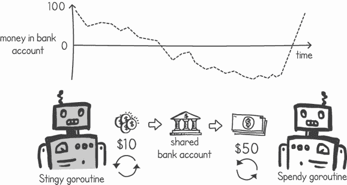

图 5.1 花费者 goroutine 花费的金额与 stingy 赚到的金额相同，但速度更快。

列表 5.1 展示了修改后的`spendy()`函数以展示这种场景。在这个列表中，当银行账户变成负数时，我们打印一条消息并退出程序。注意，在这两个函数中，赚取和花费的金额是相同的。只是在开始时，Spendy 的花费速度比 Stingy 的赚取速度快。如果我们省略`os.Exit()`，`spendy()`函数将更早完成，然后 Stingy 函数最终会将银行账户填满到原始值。

列表 5.1：以更快的速度花费（省略了`main()`函数以节省篇幅）

```
package main

import (
    "*fmt*"
    "*os*"
    "*sync*"
    "*time*"
)

func stingy(money *int, mutex *sync.Mutex) {
    for i := 0; i < 1000000; i++ {
        mutex.Lock()
        *money += 10                            ❶
        mutex.Unlock()
    }
    fmt.Println("*Stingy Done*")
}

func spendy(money *int, mutex *sync.Mutex) {
    for i := 0; i < 200000; i++ {
        mutex.Lock()
        *money -= 50                            ❶
        if *money < 0 {                         ❷
            fmt.Println("*Money is negative!*")   ❷
            os.Exit(1)                          ❷
        }
        mutex.Unlock()
    }
    fmt.Println("*Spendy Done*")
}
```

❶ 花费 50 元，而收入只有 10 元

❷ 当金钱变量变成负数时，输出消息并终止程序

当我们使用第四章中的`main()`方法运行列表 5.1 时，余额迅速变成负数，程序终止：

```
$ go run stingyspendynegative.go
Money is negative!
exit status 1
```

我们能做些什么来阻止余额变成负数吗？理想情况下，我们希望有一个系统不会花费我们没有的钱。我们可以尝试让`spendy()`函数在继续花费之前检查是否有足够的钱。如果没有足够的钱，我们可以让 goroutine 休眠一段时间，然后再次检查。`spendy()`函数的这种处理方式在下一列表中展示。

列表 5.2：当金钱用尽时`spendy()`函数的重试

```
func spendy(money *int, mutex *sync.Mutex) {
    for i := 0; i < 200000; i++ {
        mutex.Lock()
        for *money < 50 {                        ❶
            mutex.Unlock()                       ❷
            time.Sleep(10 * time.Millisecond)    ❸
            mutex.Lock()                         ❹
        }
        *money -= 50
        if *money < 0 {
            fmt.Println("*Money is negative!*")
            os.Exit(1)
        }
        mutex.Unlock()
    }
    fmt.Println("*Spendy Done*")
}
```

❶ 如果没有足够的钱，会持续尝试

❷ 解锁互斥锁，允许其他 goroutine 访问金钱变量

❸ 短暂休眠

❹ 再次锁定互斥锁以确保我们访问最新的金钱值

这个解决方案将适用于我们的用例，但并不理想。在我们的例子中，我们选择了任意的休眠值为 10 毫秒，但我们应该选择什么才是最佳数值呢？在一种极端情况下，我们可以选择完全不休眠。这会导致 CPU 资源浪费，因为 CPU 会无谓地循环，检查`money`变量即使它没有变化。在另一种极端情况下，如果 goroutine 休眠时间过长，我们可能会浪费时间等待已经发生的`money`变量变化。

这就是条件变量发挥作用的地方。条件变量与互斥锁协同工作，使我们能够挂起当前执行，直到我们收到特定条件已更改的信号。图 5.2 展示了使用条件变量与互斥锁的常见模式。

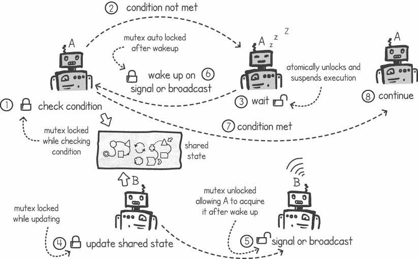

图 5.2：使用条件变量与互斥锁的常见模式

让我们深入到图 5.2 中每个步骤的细节，以了解使用条件变量的这种常见模式：

1.  当持有互斥锁时，goroutine A 检查共享状态上的特定条件。在我们的例子中，条件将是“共享银行账户变量中是否有足够的钱？”

1.  如果条件不满足，goroutine A 会在条件变量上调用`Wait()`函数。

1.  `Wait()`函数执行两个操作*原子性地*（定义在列表之后）：

    1.  它释放互斥锁。

    1.  它阻塞当前执行，实际上是将 Go 程置于睡眠状态。

1.  由于互斥锁现在可用，另一个 Go 程（Go 程 B）获取它以更新共享状态。例如，Go 程 B 增加共享银行账户变量中可用的资金量。

1.  在更新共享状态后，Go 程 B 在条件变量上调用 `Signal()` 或 `Broadcast()`，然后解锁互斥锁。

1.  当接收到 `Signal()` 或 `Broadcast()` 时，Go 程 A 会醒来并自动重新获取互斥锁。Go 程 A 可以重新检查共享状态上的条件，例如在花费之前检查共享银行账户中是否有足够的资金。步骤 2 到 6 可能会重复，直到条件得到满足。

1.  条件最终会被满足。

1.  Go 程继续执行其逻辑，例如通过使用银行账户中现在可用的资金。

注意：理解条件变量的关键是理解 `Wait()` 函数以原子方式释放互斥锁并暂停执行。这意味着在这两个操作之间，另一个执行不能进来获取锁并调用 `Signal()` 函数，在调用 `Wait()` 的执行被暂停之前。

Go 中的条件变量实现可以在 `sync.Cond` 类型中找到。如果我们查看此类型上可用的函数，我们会发现以下内容：

```
type Cond
  func NewCond(l Locker) *Cond
  func (c *Cond) Broadcast()
  func (c *Cond) Signal()
  func (c *Cond) Wait()
```

创建一个新的 Go 条件变量需要一个 `Locker`，它定义了两个函数：

```
type Locker interface {
    Lock()
    Unlock()
}
```

要使用 Go 的条件变量，我们需要实现这两个函数的东西，而互斥锁就是这样一种类型。以下列表显示了一个 `main()` 函数，它创建了一个互斥锁，然后将其用于条件变量。稍后，它将条件变量传递给 `stingy()` 和 `spendy()` Go 程中。

列表 5.3 `main()` 函数使用互斥锁创建条件变量

```
package main

import (
    "*fmt*"
    "*os*"
    "*sync*"
    "*time*"
)

func main() {
    money := 100
    mutex := sync.Mutex{}              ❶
    cond := sync.NewCond(&mutex)       ❷
    go stingy(&money, cond)            ❸
    go spendy(&money, cond)            ❸
    time.Sleep(2 * time.Second)
    mutex.Lock()
    fmt.Println("*Money in bank account:* ", money)
    mutex.Unlock()
}
```

❶ 创建一个新的互斥锁

❷ 使用互斥锁创建一个新的条件变量

❸ 将条件变量传递给两个 Go 程中

我们可以通过使用 Go 的 `sync.Cond` 类型提供的函数，在我们的 `stingy()` 和 `spendy()` 函数中应用之前在图 5.2 中概述的模式。图 5.3 展示了使用此模式的两个 Go 程的运行时间。如果我们让 Spendy Go 程在减去 50 美元之前检查条件，我们就可以保护余额不会变成负数。如果没有足够的资金，Go 程会等待，暂停其执行，直到有更多的资金可用。当 Stingy 添加资金时，它会向等待更多资金的任何执行发送信号以恢复。

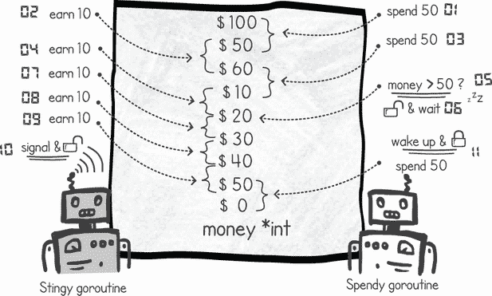

图 5.3 显示了 Stingy 和 Spendy 使用条件变量防止余额变为负数

修改节俭 goroutine 更简单，因为我们只需要发出信号。列表 5.4 显示了我们对此 goroutine 的修改。每次我们向共享的 `money` 变量添加资金时，我们通过在条件变量上调用 `Signal()` 函数来发送信号。另一个变化是我们正在使用条件变量上存在的互斥锁来保护对临界区的访问。

列表 5.4 节俭函数发出更多资金可用的信号

```
func stingy(money *int, cond *sync.Cond) {
    for i := 0; i < 1000000; i++ {
        cond.L.Lock()       ❶
        *money += 10
        cond.Signal()       ❷
        cond.L.Unlock()     ❶
    }
    fmt.Println("*Stingy Done*")
}
```

❶ 使用条件变量上的互斥锁

❷ 每次向共享资金变量添加资金时，在条件变量上发出信号

接下来，我们可以修改我们的 `spendy()` 函数，使其等待直到我们的 `money` 变量中有足够的资金。我们可以通过一个循环来实现这个条件检查，每次资金金额低于 50 美元时，就调用 `Wait()`。在列表 5.5 中，我们使用了一个 `for` 循环，只要 `*money` 小于 50 美元，它就会持续迭代。在每次迭代中，它会调用 `Wait()`。该函数现在还利用了条件变量类型中包含的互斥锁。

列表 5.5 节俭等待更多资金可用

```
func spendy(money *int, cond *sync.Cond) {
    for i := 0; i < 200000; i++ {
        cond.L.Lock()               ❶
        for *money < 50 {           ❷
            cond.Wait()             ❷
        }
        *money -= 50                ❸
        if *money < 0 {
            fmt.Println("*Money is negative!*")
            os.Exit(1)
        }
        cond.L.Unlock() 
    }
    fmt.Println("*Spendy Done*")
}
```

❶ 使用条件变量上的互斥锁

❷ 当我们没有足够的资金时等待，释放互斥锁并挂起执行

❸ 从 Wait() 返回时，一旦有足够的资金，就重新获取互斥锁并减去资金

注意：每当一个等待的 goroutine 收到信号或广播时，它都会尝试重新获取互斥锁。如果另一个执行正在持有互斥锁，那么 goroutine 将保持挂起状态，直到互斥锁变得可用。

当我们执行列表 5.3、5.4 和 5.5 时，程序不会因为负余额而退出。相反，我们得到以下输出：

```
$ go run stingyspendycond.go
Stingy Done
Spendy Done
Money in bank account:  100
```

监视器

有时我们在条件变量和互斥锁的上下文中听到 *monitor* 这个术语。*monitor* 是一种同步模式，它有一个与相关条件变量关联的互斥锁。我们可以使用这些来等待或向正在等待条件的其他线程发出信号，就像我们在本节中所做的那样。一些语言，如 Java，在每个对象实例上都有一个 monitor 构造。在 Go 中，每次我们使用带有条件变量的互斥锁时，都使用 monitor 模式。

### 5.1.2 丢失信号

如果一个 goroutine 调用 `Signal()` 或 `Broadcast()` 而没有等待执行的执行，会发生什么？它会被丢失还是存储以供下一个 goroutine 调用 `Wait()`？答案如图 5.4 所示。如果没有处于等待状态的 goroutine，`Signal()` 或 `Broadcast()` 调用将会丢失。让我们通过使用条件变量来解决另一个问题——等待我们的 goroutine 完成它们的任务。

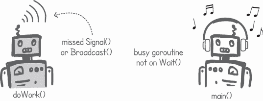

图 5.4 显示，在没有 `Wait()` 的情况下调用 `Signal()` 将导致信号丢失。

到目前为止，我们一直在`main()`函数中使用`time.Sleep()`来等待我们的 goroutine 完成。这并不好，因为我们只是在估计 goroutine 将花费多长时间。如果我们在一个较慢的计算机上运行我们的代码，我们将不得不增加我们睡眠的时间量。

我们可以修改`doWork()`函数，使其在准备好后通过条件变量让`main()`函数等待，然后子 goroutine 发送信号。以下列表显示了这种做法的不正确方式。

列表 5.6 信号的不正确方式

```
package main

import (
    "*fmt*"
    "*sync*"
)

func doWork(cond *sync.Cond) {
    fmt.Println("*Work started*")
    fmt.Println("*Work finished*")
    cond.Signal()                                     ❶
}

func main() {
    cond := sync.NewCond(&sync.Mutex{})
    cond.L.Lock()
    for i := 0; i < 50000; i++ {                      ❷
        go doWork(cond)                               ❸
        fmt.Println("*Waiting for child goroutine* ")
        cond.Wait()                                   ❹
        fmt.Println("*Child goroutine finished*")
    }
    cond.L.Unlock()
}
```

❶ Goroutine 发出信号，表明它已完成工作。

❷ 重复 50,000 次

❸ 启动一个 goroutine，模拟做一些工作

❹ 等待 goroutine 发送完成信号

当我们运行列表 5.6 时，我们得到以下输出：

```
$ go run signalbeforewait.go
Waiting for child goroutine
Work started
Work finished
Child goroutine finished
Waiting for child goroutine
Work started
Work finished
Child goroutine finished
. . .
Work started
Work finished
Waiting for child goroutine
fatal error: all goroutines are asleep - deadlock!

goroutine 1 [sync.Cond.Wait]:
sync.runtime_notifyListWait(0xc000024090, 0x9a9)
        sema.go:517 +0x152
sync.(*Cond).Wait(0xe4e1c4?)
        cond.go:70 +0x8c
main.main()
        signalbeforewait.go:19 +0xaf
exit status 2
```

提示：列表 5.6 的行为可能取决于我们运行它的硬件和操作系统。为了增加前一个错误发生的可能性，我们可以在`main()`函数中的`cond.Wait()`之前插入一个`runtime.Gosched()`调用。这给了子 goroutine 在`main()` goroutine 进入等待状态之前执行更多机会。

前一个输出中的问题是，我们可能在`main()` goroutine 没有在条件变量上等待时发出信号。当这种情况发生时，我们会错过信号。Go 的运行时会检测到一个 goroutine 在徒劳地等待，因为没有其他 goroutine 可能调用信号函数，并且它会抛出一个致命错误。

注意：我们需要确保在调用信号或广播函数时，有另一个 goroutine 正在等待它；否则，信号或广播不会被任何 goroutine 接收，并且会错过。

为了确保我们不错过任何信号和广播，我们需要将它们与互斥锁结合使用。也就是说，我们应该只在持有相关互斥锁时调用这些函数。这样，我们可以确信`main()` goroutine 处于等待状态，因为互斥锁只有在 goroutine 调用`Wait()`时才会释放。图 5.5 显示了两种场景：错过信号和使用互斥锁发出信号。

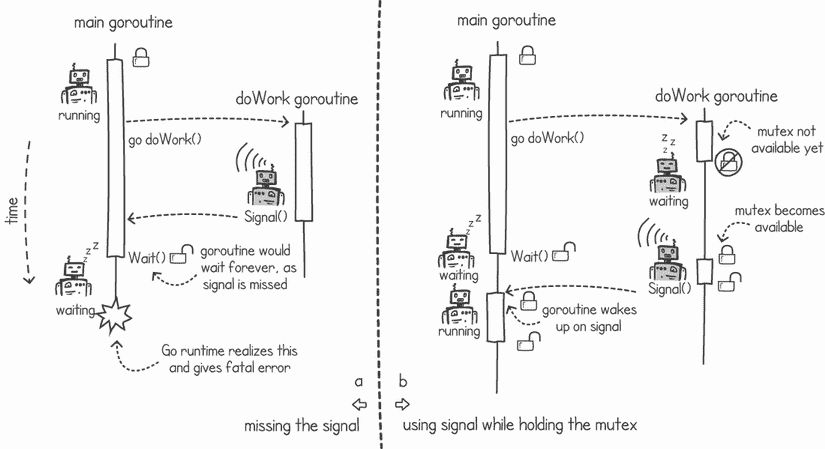

图 5.5 (a) 没有 goroutine 等待时错过信号；(b) 在`doWork()` goroutine 中使用互斥锁并在持有互斥锁时调用信号

我们可以修改列表 5.6 中的`doWork()`函数，使其在调用`signal()`之前锁定互斥锁，如图 5.5 的右侧所示。这确保了`main()` goroutine 处于等待状态，如下一个列表所示。

列表 5.7 在信号时持有互斥锁

```
func doWork(cond *sync.Cond) {
    fmt.Println("*Work started*")
    fmt.Println("*Work finished*")
    cond.L.Lock()                ❶
    cond.Signal()                ❷
    cond.L.Unlock()              ❸
}
```

❶ 在信号前锁定互斥锁

❷ 在条件变量上发出信号

❸ 信号后解锁互斥锁

提示：始终在持有互斥锁时使用`Signal()`、`Broadcast()`和`Wait()`，以避免同步问题。

### 5.1.3 使用等待和广播同步多个 goroutine

我们到目前为止只看了使用`Signal()`而不是`Broadcast()`的示例。当我们有多个 goroutine 在条件变量的`Wait()`上挂起时，`Signal()`将任意唤醒这些 goroutine 中的一个。另一方面，`Broadcast()`调用将唤醒所有挂起在`Wait()`上的 goroutine。

注意：当一个 goroutine 组在`Wait()`上挂起时，我们调用`Signal()`，我们只会唤醒其中一个 goroutine。我们无法控制系统将恢复哪个 goroutine，我们应该假设它可以是条件变量的`Wait()`上挂起的**任何**goroutine。使用`Broadcast()`，我们确保所有挂起的 goroutine 都会被恢复。

让我们现在用一个例子来演示`Broadcast()`功能。图 5.6 显示了一个游戏，玩家在游戏开始前等待所有人加入。这在在线多人游戏和游戏机中都是一个常见的场景。让我们想象我们的程序有一个 goroutine 处理与每个玩家的交互。我们如何编写代码来挂起执行直到所有玩家都加入游戏？

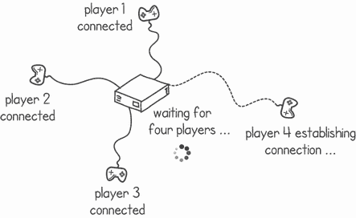

图 5.6 服务器在开始游戏之前等待四个玩家加入

为了模拟处理四个玩家的 goroutine，每个玩家在游戏中的连接时间不同，我们可以在`main()`函数中以时间间隔创建每个 goroutine（参见列表 5.8）。在我们的`main()`函数中，我们还在共享一个`playersInGame`变量。这告诉 goroutine 有多少玩家正在参加游戏。每个 goroutine 执行一个`playerHandler()`函数，我们将在稍后实现。

列表 5.8 `main()`函数以时间间隔启动玩家处理器

```
package main

import (
    "*fmt*"
    "*sync*"
    "*time*"
)

func main() {
    cond := sync.NewCond(&sync.Mutex{})                     ❶
    playersInGame := 4                                      ❷
    for playerId := 0; playerId < 4; playerId++ {
        go playerHandler(cond, &playersInGame, playerId)    ❸
        time.Sleep(1 * time.Second)                         ❹
    }
}
```

❶ 创建一个新的条件变量

❷ 初始化玩家总数为 4

❸ 开始一个共享条件变量、游戏玩家和玩家 ID 的 goroutine

❹ 在下一个玩家连接之前暂停 1 秒

我们可以通过让多个 goroutine 等待同一个条件来使用条件变量。由于我们有一个处理每个玩家的 goroutine，我们可以让每个 goroutine 等待一个条件，告诉我们所有玩家都已连接。然后我们可以使用相同的条件变量来检查所有玩家是否已连接，如果没有，我们调用`Wait()`。每次一个新的 goroutine 连接到新的玩家时，我们通过`1`减少这个共享变量的计数。当它达到`0`的计数时，我们可以通过调用`Broadcast()`唤醒所有挂起的线程。

图 5.7 显示了四个不同的 goroutine 检查`playersRemaining`变量，并等待最后一个玩家连接并且其 goroutine 调用`Broadcast()`。最后一个 goroutine 知道它是最后一个，因为共享变量`playersRemaining`的值为`0`。

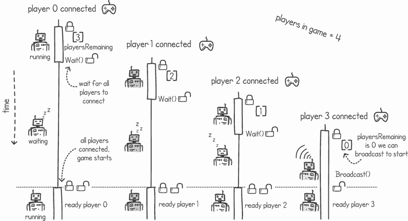

图 5.7 使用`Wait()`和`Broadcast()`模式等待四个玩家连接

玩家处理 goroutine 显示在列表 5.9 中。每个 goroutine 都遵循相同的条件变量模式。我们在从 `playersRemaining` 变量中减去计数并检查是否还有更多玩家需要连接时持有互斥锁。我们还在调用 `Wait()` 时原子性地释放这个互斥锁。这里的区别是，如果 goroutine 发现没有更多玩家剩余要连接，它将调用 `Broadcast()`。goroutine 知道没有更多玩家要连接，因为 `playersRemaining` 变量是 `0`。

当所有其他 goroutine 由于 `Broadcast()` 而从 `Wait()` 中解除阻塞时，它们退出条件检查循环并释放互斥锁。从这一点开始，如果这是一个真正的多人游戏，我们将有处理游戏玩法的代码。

列表 5.9 玩家处理函数

```
func playerHandler(cond *sync.Cond, playersRemaining *int, playerId int) {
    cond.L.Lock()                        ❶
    fmt.Println(playerId, "*: Connected*")
    *playersRemaining--                  ❷
    if *playersRemaining == 0 {
        cond.Broadcast()                 ❸
    }
    for *playersRemaining > 0 {
        fmt.Println(playerId, "*: Waiting for more players*")
        cond.Wait()                      ❹
    }
    cond.L.Unlock()                      ❺
    fmt.Println("*All players connected. Ready player*", playerId)
    *//Game started*
}
```

❶ 锁定条件变量的互斥锁以避免竞争条件

❷ 从共享剩余玩家变量中减去 1

❸ 当所有玩家都连接后发送广播

❹ 只要还有玩家要连接，就在条件变量上等待

❺ 解锁互斥锁，以便所有 goroutine 可以继续执行并开始游戏

当我们同时运行列表 5.8 和 5.9 中的代码时，每个 goroutine 都会等待所有玩家加入，直到最后一个 goroutine 发送广播并解除所有 goroutine 的阻塞。以下是输出：

```
$ go run gamesync.go
0 : Connected
0 : Waiting for more players
1 : Connected
1 : Waiting for more players
2 : Connected
2 : Waiting for more players
3 : Connected
All players connected. Ready player 3
All players connected. Ready player 2
All players connected. Ready player 1
All players connected. Ready player 0
```

### 5.1.4 使用条件变量重新审视读者-写者锁

在上一章中，我们使用互斥锁开发了自己的读者-写者锁实现。该实现是偏好读的，这意味着只要至少有一个读者 goroutine 持有锁，写者 goroutine 就无法在其关键部分访问资源。写者 goroutine 只有在所有读者都释放了它们的锁之后才能获取锁。如果没有读者空闲窗口，写者将被排除在外。图 5.8 展示了一个场景，其中两个 goroutine 交替持有读者锁，阻止写者获取锁。

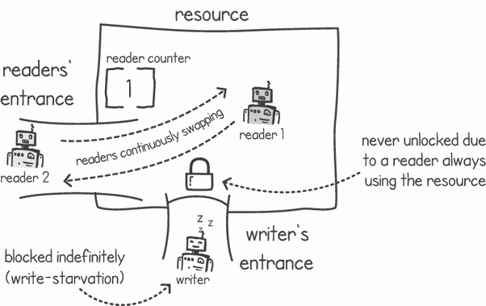

图 5.8 由于读者占用资源访问，写者 goroutine 无法无限期地访问资源。

在技术术语中，我们称这种情况为 *写饥饿*——我们无法更新我们的共享数据结构，因为执行中的读者部分持续访问它们，阻止了写者的访问。以下列表模拟了这种情况。

列表 5.10 读者 goroutine 占用读者锁，阻止写访问

```
package main

import (
    "*fmt*"
    "*github.com/cutajarj/ConcurrentProgrammingWithGo/chapter4/listing4.12*"
    "*time*"
)

func main() {
    rwMutex := listing4_12.ReadWriteMutex{}     ❶
    for i := 0; i < 2; i++ {
        go func() {                             ❷
            for {                               ❸
                rwMutex.ReadLock()
                time.Sleep(1 * time.Second)     ❹
                fmt.Println("*Read done*")
                rwMutex.ReadUnlock()
            }
        }()
    }
    time.Sleep(1 * time.Second)
    rwMutex.WriteLock()                         ❺
    fmt.Println("*Write finished*")               ❻
}
```

❶ 使用第四章中开发的读者-写者互斥锁

❷ 启动两个 goroutine

❸ 无限重复

❹ 在持有读者锁的同时睡眠 1 秒

❺ 尝试从 main() goroutine 获取写者锁

❻ 在获取写者锁后，输出消息并终止

尽管我们的 goroutine 中有一个无限循环，但我们期望最终`main()` goroutine 会获取写者锁，输出消息`Write finished`，并终止。这应该会发生，因为在 Go 中，每当`main()` goroutine 终止时，整个进程都会退出。然而，当我们运行列表 5.10 时，这是发生的情况：

```
$ go run writestarvation.go
Read done
Read done
Read done
Read done
Read done
Read done
Read done
Read done
. . . continues indefinitely
```

我们的两个 goroutine 持续持有互斥锁的读者部分，这阻止了`main()` goroutine 获取锁的写部分。如果我们很幸运，读者可能会同时释放读者锁，使写者 goroutine 能够获取它。然而，在实践中，两个读者线程同时释放锁的可能性不大。这导致我们的`main()` goroutine 发生写者饥饿。

定义*饥饿*是一种情况，其中执行被阻止访问共享资源，因为资源由于其他贪婪执行长时间（或无限期）不可用。

我们需要一个不同的设计来处理一个不是优先读取的读者-写者锁，一个不会饿死写者 goroutine 的锁。我们可以在写者调用`WriteLock()`函数时立即阻止新读者获取读锁。为了实现这一点，我们可以在条件变量上挂起 goroutine，而不是让它们在互斥锁上阻塞。使用条件变量，我们可以设置不同的条件来决定何时阻塞读者和写者。要设计一个优先写锁，我们需要一些属性：

+   *读者计数器*—初始设置为`0`，这告诉我们有多少读者 goroutine 正在积极访问共享资源。

+   *写者等待计数器*—初始设置为`0`，这告诉我们有多少写者 goroutine 正在挂起等待访问共享资源。

+   *写者活跃指示器*—初始设置为`false`，这个标志告诉我们资源当前是否正在被写者 goroutine 更新。

+   *带有互斥锁的条件变量*—这允许我们在前面的属性上设置各种条件，当条件不满足时挂起执行。

Go 的`RWMutex`

Go 附带`RWMutex`优先写。这在 Go 的文档中有突出显示（从[`pkg.go.dev/sync#RWMutex`](https://pkg.go.dev/sync#RWMutex)调用`Lock()`获取互斥锁的写部分）：

*如果一个 goroutine 持有 RWMutex 进行读取，而另一个 goroutine 可能会调用 Lock，那么没有任何 goroutine 应该期望能够获取读锁，直到最初的读锁被释放。特别是，这禁止了递归读锁定。这是为了确保锁最终可用；阻塞的 Lock 调用排除了新读者获取锁的可能性。*

让我们看看不同的场景，以帮助我们理解实现。第一个场景是当没有访问临界区且没有 goroutine 请求写访问时。在这种情况下，我们允许读者 goroutine 获取读锁的部分并访问共享资源。这个场景在图 5.9 的左侧显示。

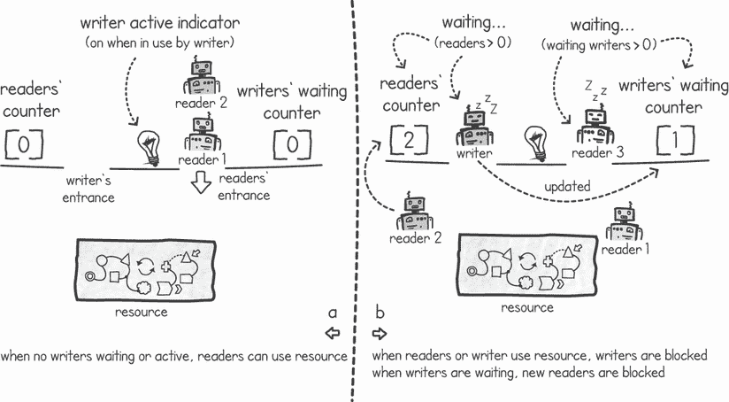

图 5.9 (a) 当没有写者活动或等待时，读者可以访问共享资源。(b) 当读者或写者正在使用时，我们阻止写者访问共享资源。当写者等待时，我们也阻止新的读者。

我们知道没有写者正在使用资源，因为写者活动指示器是关闭的。我们可以将写者活动指示器实现为一个布尔标志，当写者获取对锁的访问时设置为 `true`。我们还知道没有写者正在等待获取锁，因为写者等待计数器设置为 `0`。这个等待计数器可以作为一个整型数据类型实现。

图 5.9 的右侧显示的第二个场景是当读者获取锁时。当发生这种情况时，他们必须增加读者计数器。这向任何想要获取写锁的写者表明资源正在被读取。如果写者在此时尝试获取锁，它必须等待条件变量，直到读者使用资源。它还必须通过增加它来更新写者等待计数器。

写者等待计数器确保任何新来的读者都知道有等待的写者。然后读者将通过阻塞直到写者等待计数器回到 `0` 来优先考虑写者。这就是我们的读者-写者互斥锁优先考虑写者的原因。

要实现这两个场景，我们首先需要创建我们概述的属性。在下面的列表中，我们设置了一个新的结构体，其中包含所需的属性和一个初始化条件变量和互斥锁的函数。

列表 5.11 优先写读者的读写互斥锁类型

```
package main

import (
    "*sync*"
)

type ReadWriteMutex struct {
    readersCounter int                                         ❶
    writersWaiting int                                         ❷
    writerActive   bool                                        ❸
    cond           *sync.Cond
}

func NewReadWriteMutex() *ReadWriteMutex {
    return &ReadWriteMutex{cond: sync.NewCond(&sync.Mutex{})}  ❹
}
```

❶ 存储当前持有读锁的读者数量

❷ 存储当前等待的写者数量

❸ 指示是否有写者持有写锁

❹ 使用新的条件变量和相关的互斥锁初始化一个新的 ReadWriteMutex

列表 5.12 展示了读锁定函数的实现。在获取读者锁时，`ReadLock()` 函数使用条件变量的互斥锁，然后在有写者等待或活动的情况下条件性地等待。等待 `writersWaiting` 计数达到 `0` 确保我们优先给予写者 goroutine。一旦读者检查这两个条件，`readersCounter` 就会增加，并且互斥锁被释放。

列表 5.12 读者锁函数

```
func (rw *ReadWriteMutex) ReadLock() {
    rw.cond.L.Lock()                                  ❶
    for rw.writersWaiting > 0 || rw.writerActive {    ❷
        rw.cond.Wait()                                ❷
    }
    rw.readersCounter++                               ❸
    rw.cond.L.Unlock()                                ❹
}
```

❶ 获取互斥锁

❷ 当写者等待或活动时等待条件变量

❸ 增加读者计数器

❹ 释放互斥锁

在`WriteLock()`函数中，如列表 5.13 所示，我们使用相同的互斥锁和条件变量等待，直到有读者或写入者活跃。此外，该函数增加写入者等待计数器变量以指示它在等待锁变得可用。一旦我们可以获取写入者的锁，我们就将写入者等待计数器减`1`并将`writeActive`标志设置为`true`。

列表 5.13 写入者的锁定函数

```
func (rw *ReadWriteMutex) WriteLock() {
    rw.cond.L.Lock()                                  ❶

    rw.writersWaiting++                               ❷
    for rw.readersCounter > 0 || rw.writerActive {    ❸
        rw.cond.Wait()                                ❸
    }
    rw.writersWaiting--                               ❹
    rw.writerActive = true                            ❺

    rw.cond.L.Unlock()                                ❻
}
```

❶ 获取互斥锁

❷ 增加写入者等待计数器

❸ 只要存在读者或活跃的写入者，就在条件变量上等待

❹ 等待结束后，递减写入者等待计数器

❺ 等待结束后，标记写入者活跃标志

❻ 释放互斥锁

调用`WriteLock()`函数的 goroutine 将`writeActive`标志设置为`true`，这样就没有其他 goroutine 会尝试同时访问锁。设置为`true`的`writeActive`标志将阻止读者和写入者的 goroutine 获取锁。这种情况在图 5.10 的左侧显示。

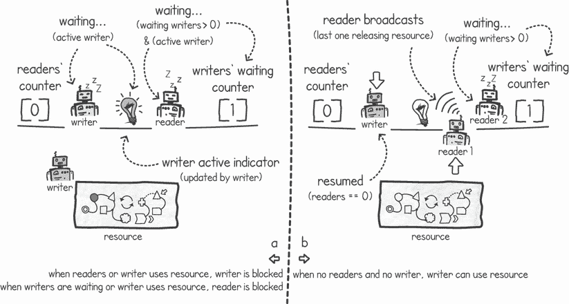

图 5.10 (a) 当写入者有访问权限时，读者和写入者被阻塞；(b) 最后一个读者广播以恢复任何写入者，使其能够访问

最后一种情况是我们 goroutines 释放锁时的情况。当最后一个读者释放锁时，我们可以通过在条件变量上广播来通知任何挂起的写入者。goroutine 知道它是最后一个读者，因为读者计数器在它递减后会变成`0`。这种情况在图 5.10 的右侧显示。`ReadUnlock()`函数在下面的列表中展示。

列表 5.14 读者的解锁函数

```
func (rw *ReadWriteMutex) ReadUnlock() {
    rw.cond.L.Lock()              ❶
    rw.readersCounter--           ❷
    if rw.readersCounter == 0 {
        rw.cond.Broadcast()       ❸
    }
    rw.cond.L.Unlock()            ❹
}
```

❶ 获取互斥锁

❷ 递减读者计数器 1

❸ 如果 goroutine 是最后一个剩余的读者，则发送广播

❹ 释放互斥锁

写入者的解锁函数更简单。由于在任何时候都只能有一个活跃的写入者，因此我们每次解锁时都可以发送广播。这将唤醒任何正在等待条件变量的写入者或读者。如果有读者和写入者都在等待，由于读者会在写入者等待计数器大于`0`时重新进入挂起状态，因此将优先选择写入者。`WriteUnlock()`函数在下面的列表中展示。

列表 5.15 写入者的解锁函数

```
func (rw *ReadWriteMutex) WriteUnlock() {
    rw.cond.L.Lock()             ❶
    rw.writerActive = false      ❷
    rw.cond.Broadcast()          ❸
    rw.cond.L.Unlock()           ❹
}
```

❶ 获取互斥锁

❷ 取消标记写入者活跃标志

❸ 发送广播

❹ 释放互斥锁

使用这种新的写入者优先实现，我们可以重新运行列表 5.10 中的代码以确认我们没有写入者饥饿。正如预期的那样，一旦有 goroutine 请求写入访问，读者 goroutine 就会等待并让出空间给写入者。然后我们的`main()` goroutine 完成，进程终止：

```
$ go run readwritewpref.go
Read done
Read done
Write finished
$
```

## 5.2 计数信号量

在上一章中，我们看到了互斥锁（mutexes）如何允许只有一个 goroutine 访问共享资源，而读写互斥锁（readers–writer mutex）则允许我们指定多个并发读取但独占写入。信号量（semaphores）为我们提供了不同类型的并发控制，因为我们能够指定允许的并发执行的数量。信号量还可以作为构建更复杂并发工具的基石，正如我们将在接下来的章节中看到的。

### 5.2.1 什么是信号量？

互斥锁（mutexes）为我们提供了一种允许一次只发生一个执行的方法。如果我们需要允许可变数量的执行并发发生呢？是否存在一种机制可以让我们指定可以访问我们资源的 goroutine 数量？一种允许我们限制并发的机制将使我们能够限制系统负载。例如，考虑一个慢速数据库，它只接受一定数量的并发连接。我们可以通过允许固定数量的 goroutine 访问数据库来限制交互次数。一旦达到限制，我们既可以让 goroutine 等待，也可以向客户端返回一个错误消息，说明系统已满负荷运行。

这正是*信号量*发挥作用的地方。它们允许固定数量的许可，使得并发执行能够访问共享资源。一旦所有许可都被使用，进一步的访问请求将不得不等待，直到有许可被释放（见图 5.11）。

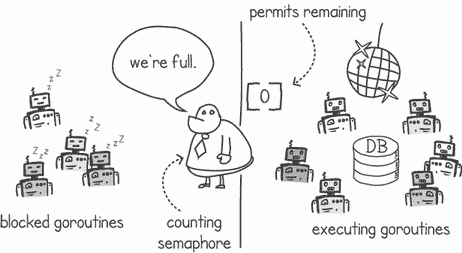

图 5.11 允许固定数量的 goroutine 访问。

为了更好地理解信号量，让我们将它们与互斥锁进行比较。互斥锁确保只有一个 goroutine 具有独占访问权，而信号量确保最多有*N*个 goroutine 可以访问。实际上，互斥锁提供了与信号量相同的功能，其中*N*的值为 1。计数信号量允许我们选择*N*的任何值。

定义 只有一个许可的信号量有时被称为*二进制信号量*。

注意 虽然互斥锁是只有一个许可的信号量的特殊情况，但它们的使用预期存在细微差别。当使用互斥锁时，持有互斥锁的执行也应该负责释放它。当使用信号量时，情况并不总是如此。

为了理解我们如何使用信号量，让我们首先看看它提供的三个函数：

+   *新的信号量函数*—创建一个具有*X*个许可的新的信号量。

+   *获取许可* *函数*—goroutine 将从信号量中获取一个许可。如果没有可用的许可，goroutine 将挂起并等待，直到有许可变得可用。

+   *释放许可* *函数*—释放一个许可，以便 goroutine 可以使用它再次通过获取函数。

### 5.2.2 构建信号量

在本节中，我们将实现自己的信号量，以便我们更好地理解它们是如何工作的。Go 的捆绑库中没有信号量类型，但有一个扩展的`sync`包在[`pkg.go.dev/golang.org/x/sync`](https://pkg.go.dev/golang.org/x/sync)，其中包含信号量的实现。这个包是 Go 项目的一部分，但它是在比核心包更宽松的兼容性要求下开发的。

要构建一个信号量，我们需要记录我们还有多少许可，我们还可以使用一个条件变量来帮助我们等待，当我们没有足够的许可时。以下列表显示了我们的信号量的类型结构，包含许可计数器和条件变量。还有一个创建信号量的函数，它接受信号量上包含的初始许可数。

列表 5.16 `Semaphore`类型

```
package listing5_16

import (
    "*sync*"
)

type Semaphore struct {
    permits int                               ❶
    cond *sync.Cond                           ❷
}

func NewSemaphore(n int) *Semaphore {
    return &Semaphore{
        permits: n,                           ❸
        cond: sync.NewCond(&sync.Mutex{}),    ❹
    }
}
```

❶ 信号量上剩余的许可

❷ 当没有足够的许可时使用的条件变量

❸ 新信号量上的初始许可数

❹ 在新的信号量上初始化一个新的条件变量和相关的互斥锁

要实现`Acquire()`函数，我们需要在许可数为`0`（或更少）时在条件变量上调用`wait()`。如果有足够的许可，我们只需从许可计数中减去`1`。`Release()`函数做相反的操作：将许可计数增加`1`并发出一个新许可可用的信号。我们使用`Signal()`函数而不是`Broadcast()`，因为只释放了一个许可，我们只想让一个 goroutine 被解除阻塞。

列表 5.17 `Acquire()`和`Release()`函数

```
\func (rw *Semaphore) Acquire() {
    rw.cond.L.Lock()               ❶
    for rw.permits <= 0 {
        rw.cond.Wait()             ❷
    }
    rw.permits--                   ❸
    rw.cond.L.Unlock()             ❹
}

func (rw *Semaphore) Release() {
    rw.cond.L.Lock()               ❺

    rw.permits++                   ❻
    rw.cond.Signal()               ❼

    rw.cond.L.Unlock()             ❽
}
```

❶ 获取互斥锁以保护许可变量

❷ 等待直到有可用的许可

❸ 将可用许可的数量减少 1

❹ 释放互斥锁

❺ 获取互斥锁以保护许可变量

❻ 将可用许可的数量增加 1

❼ 信号条件变量表示还有一个许可可用

❽ 释放互斥锁

### 5.2.3 使用信号量永不错过信号

从另一个角度来看信号量，它们提供了与条件变量的等待和信号类似的功能，并且还有一个附加的好处，即即使没有 goroutine 在等待，也能记录一个信号。

名字中有什么？

信号量是由荷兰计算机科学家 Edsger Dijkstra 在他的未发表 1962 年论文“Over Seinpalen”（“关于信号量”）中发明的。这个名字的灵感来源于一个早期的铁路信号系统，该系统使用一个枢轴臂来向火车司机发出信号。信号的含义取决于枢轴臂的倾斜角度。

在列表 5.6 中，我们看到了一个使用条件变量等待 goroutine 完成任务示例。我们遇到的问题是，我们可能会在`main()` goroutine 调用`Wait()`之前调用`Signal()`函数，导致信号丢失。

我们可以通过使用初始化为 `0` 许可证的信号量来解决这个问题。这给我们一个系统，其中调用 `Release()` 函数作为我们的工作完成信号。然后 `Acquire()` 函数作为我们的 `Wait()`。在这个系统中，我们调用 `Acquire()` 的时间（在任务完成之前或之后）并不重要，因为信号量通过许可计数记录了 `Release()` 被调用的次数。如果我们先调用它，goroutine 将阻塞并等待 `Release()` 信号。如果我们之后调用它，由于有可用的许可，goroutine 将立即返回。

图 5.12 展示了使用信号量等待并发任务完成的示例。它显示了一个执行 `doWork()` 函数的 goroutine，在完成其任务后调用 `Release()`。我们的执行 `main()` 的 goroutine 想要知道这个任务是否完成，但它仍然忙碌，还没有停下来等待并检查。由于我们使用信号量，这个释放调用被记录为一个许可。稍后，当 `main()` goroutine 调用 `Acquire()` 时，函数将立即返回，表示 `doWork()` goroutine 已经完成了其分配的工作。

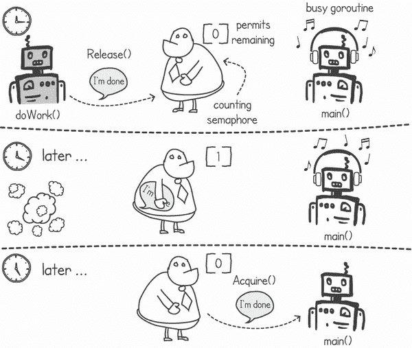

图 5.12 使用信号量知道 goroutine 是否完成

列表 5.18 展示了这一实现的代码。当我们启动 `doWork()` goroutine 时，我们传递一个对信号量的引用，正如图 5.11 所示。在这个函数中，我们模拟 goroutine 执行一些并发快速任务。当 goroutine 完成其任务时，它调用 `Release()` 来表示已完成。在 `main()` 函数中，我们创建了许多这样的 goroutine，并在每个创建后，通过在信号量上调用 `Acquire()` 来等待其完成。

列表 5.18 使用信号量来指示任务完成

```
package main

import (
    "*fmt*"
    "*github.com/cutajarj/ConcurrentProgrammingWithGo/chapter5/listing5.16*"
)

func main() {
    semaphore := listing5_16.NewSemaphore(0)       ❶
    for i := 0; i < 50000; i++ {                   ❷
        go doWork(semaphore)                       ❸
        fmt.Println("*Waiting for child goroutine* ")
        semaphore.Acquire()                        ❹
        fmt.Println("*Child goroutine finished*")
    }
}

func doWork(semaphore *listing5_16.Semaphore) {
    fmt.Println("*Work started*")
    fmt.Println("*Work finished*")
    semaphore.Release()                            ❺
}
```

❶ 使用之前的实现创建一个新的信号量

❷ 重复 50,000 次

❸ 通过传递信号量的引用来启动 goroutine

❹ 等待信号量上的可用许可，表示任务已完成

❺ 当 goroutine 完成，它释放一个许可来通知 main() goroutine

如果首先调用 `Release()`，信号量将存储这个释放许可，当 `main()` goroutine 调用 `Acquire()` 函数时，它将立即返回而不阻塞。如果我们使用没有互斥锁定的条件变量，这会导致我们的 `main()` goroutine 错过信号。

## 5.3 练习

注意：您可以在 [`github.com/cutajarj/ConcurrentProgrammingWithGo`](https://github.com/cutajarj/ConcurrentProgrammingWithGo) 上看到所有代码解决方案。

1.  在列表 5.4 中，Stingy 的 goroutine 每次向银行账户添加钱时都会在条件变量上发出信号。你能修改这个函数，使其仅在账户中有 50 美元或更多时发出信号吗？

1.  将游戏同步列表 5.8 和 5.9 进行修改，使得，仍然使用条件变量，玩家需要等待固定的时间数。如果玩家没有在规定时间内全部加入，协程应停止等待，并允许游戏在没有所有玩家的情况下开始。提示：尝试使用另一个带有过期计时器的协程。

1.  **加权信号量**是信号量的一个变体，允许你同时获取和释放多个许可证。加权信号量的函数签名如下：

    ```
    func (rw *WeightedSemaphore) Acquire(permits int)
    func (rw *WeightedSemaphore) Release(permits int)
    ```

    使用这些函数签名来实现一个具有类似计数信号量功能的加权信号量。它应该允许你获取或释放多个许可证。

## 摘要

+   通过使用条件变量和互斥锁，一个执行可以被挂起，等待直到满足某个条件。

+   在条件变量上调用 `Wait()` 会**原子性地**解锁互斥锁并挂起当前执行。

+   调用 `Signal()` 会恢复一个已调用 `Wait()` 的挂起协程的执行。

+   调用 `Broadcast()` 会恢复所有已调用 `Wait()` 的挂起协程的执行。

+   如果我们调用 `Signal()` 或 `Broadcast()`，但没有协程在 `Wait()` 调用上挂起，那么信号或广播就会被错过。

+   我们可以使用条件变量和互斥锁作为构建块来构建更复杂的并发工具，例如信号量和优先写入的读写锁。

+   当一个执行因为共享资源长时间不可用而被阻塞时，就会发生饥饿。

+   优先写入的读写互斥锁解决了写饥饿问题。

+   信号量让我们能够限制对共享资源的并发访问，使其固定数量的并发执行。

+   与条件变量一样，信号量可以用来向另一个执行发送信号。

+   当用作信号时，信号量具有额外的优势，即如果执行尚未等待该信号，则信号会被存储。
