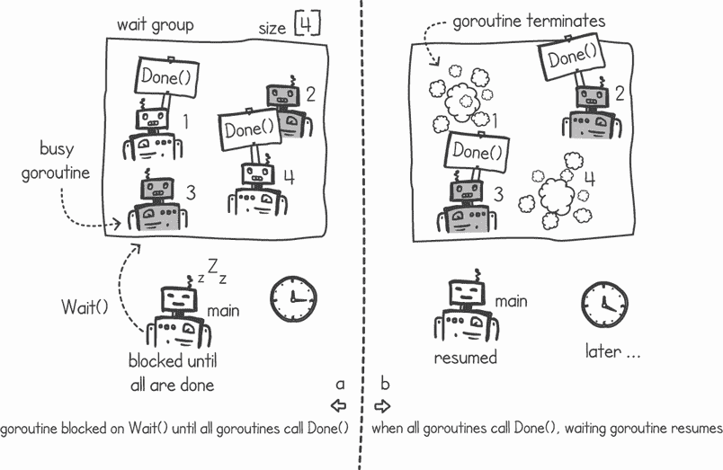
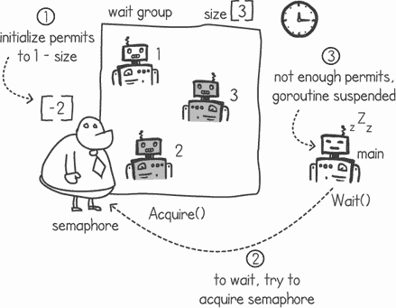
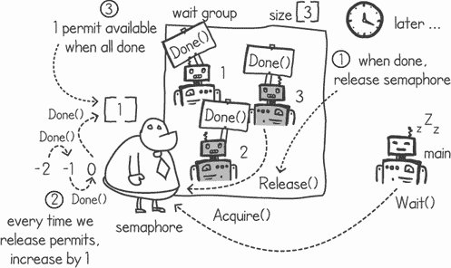
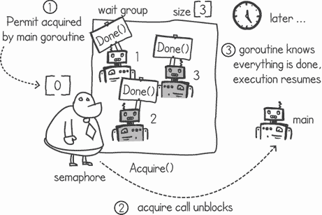
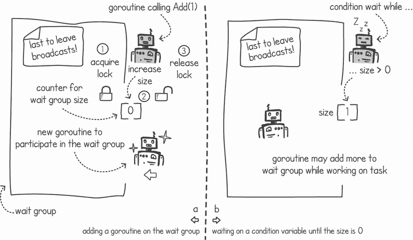
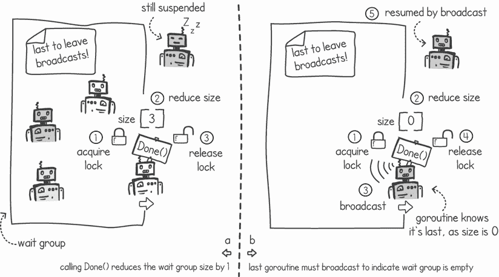
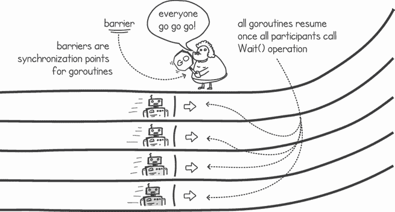
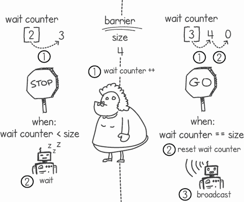
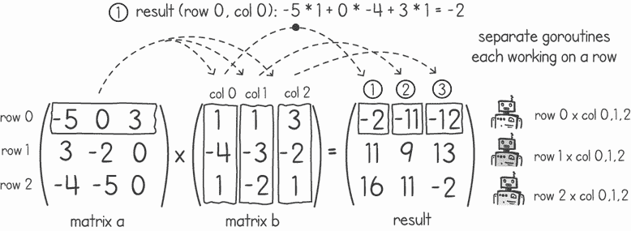
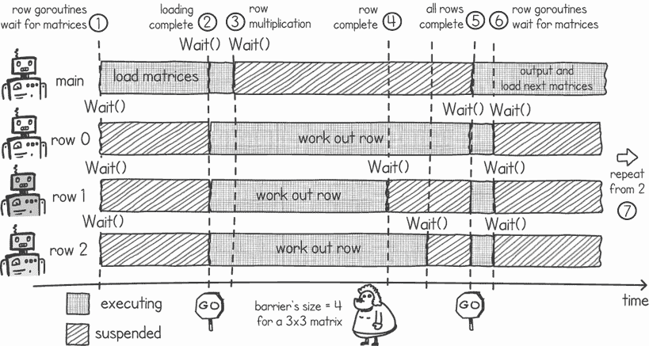

# 6 使用 waitgroups 和屏障同步

本章涵盖了

+   使用 waitgroups 等待已完成的任务

+   使用信号量构建 waitgroups

+   使用条件变量实现 waitgroups

+   使用屏障同步并发工作

Waitgroups 和屏障是两种在执行组（如 goroutines）上工作的同步抽象。我们通常使用*waitgroups*来等待一组任务完成。我们使用*barriers*在共同点上同步多个执行。

我们将首先通过几个应用程序来检查 Go 的内置 waitgroups。稍后，我们将研究两种 waitgroups 的实现：一种使用信号量构建，另一种使用条件变量构建，功能更完整。

Go 的库中没有捆绑屏障，因此我们将构建自己的屏障类型。然后，我们将在这个简单的并发矩阵乘法算法中使用这个屏障类型。

## 6.1 Go 中的 waitgroups

使用 waitgroups，我们可以让一个 goroutine 等待一组并发任务完成。我们可以将 waitgroup 视为一个项目经理，管理分配给不同工人的任务集。一旦所有任务都完成，项目经理会通知我们。

### 6.1.1 使用 waitgroups 等待任务完成

在前面的章节中，我们看到了一个并发模式，其中主 goroutine 将问题分解成多个任务，并将每个任务传递给一个单独的 goroutine。goroutines 随后并发地完成这些任务。例如，在第三章中，当我们开发字母频率程序时，我们看到了这种模式。主 goroutine 创建了多个 goroutine，每个 goroutine 下载并处理一个单独的网页。在我们的第一个实现中，我们使用`sleep()`函数等待几秒钟，直到所有 goroutine 完成下载。使用 waitgroup 将使等待所有 goroutine 完成任务变得更加容易。

图 6.1 显示了使用 waitgroup 的典型模式。我们设置 waitgroup 的大小，然后使用两个操作`Wait()`和`Done()`。在这个模式中，我们通常有多个 goroutine 需要并发完成一些任务。我们可以创建一个 waitgroup，并将其大小设置为分配的任务数。主 goroutine 将任务交给新创建的 goroutines，并在调用`Wait()`操作后暂停执行。一旦一个 goroutine 完成其任务，它将在 waitgroup 上调用`Done()`操作（见图 6.1 的左侧）。当所有 goroutine 都对其分配的所有任务调用了`Done()`操作后，主 goroutine 将解除阻塞。此时，主 goroutine 知道所有任务都已完成（见图 6.1 的右侧）。



图 6.1 waitgroup 的典型使用

Go 的`sync`包中内置了`WaitGroup`实现。它包含三个函数，允许我们使用图 6.1 中描述的模式：

+   `Done()`—将 waitgroup 的大小计数器减`1`

+   `Wait()`—阻塞直到 waitgroup 的大小计数器为`0`

+   `Add(delta int)`—将 waitgroup 的大小计数器增加 delta

列表 6.1 展示了我们如何使用这三个操作的简单示例。我们有一个`doWork()`函数，通过睡眠随机长度的时间来模拟完成任务。一旦完成，它打印一条消息并在 waitgroup 上调用`Done()`函数。`main()`函数调用`Add(4)`函数，创建四个这样的`doWork()`协程，并在 waitgroup 上调用`Wait()`。

一旦所有协程都表示已完成，`Wait()`解除阻塞，`main()`函数继续执行。

列表 6.1 简单使用 waitgroup

```
package main

import (
    "*fmt*"
    "*math/rand*"
    "*sync*"
    "*time*"
)

func main() {
    wg := sync.WaitGroup{}                                 ❶
    wg.Add(4)                                              ❷
    for i := 1; i <= 4; i++ {
        go doWork(i, &wg)                                  ❸
    }
    wg.Wait()                                              ❹
    fmt.Println("*All complete*")
}

func doWork(id int, wg *sync.WaitGroup) {
    i := rand.Intn(5)
    time.Sleep(time.Duration(i) * time.Second)             ❺
    fmt.println(id, "*Done working after*", i, "*seconds*")
    wg.Done()                                              ❻
}
```

❶ 创建一个新的 waitgroup

❷ 由于我们有四项工作，将 4 添加到 waitgroup 中

❸ 创建四个协程，传递 waitgroup 的引用

❹ 等待工作完成

❺ 随机睡眠一段时间（最多 5 秒）

❻ 信号表示协程已完成其任务

当我们运行列表 6.1 时，所有协程在睡眠了略微不同的时间后完成。它们在 waitgroup 上调用`Done()`，然后`main()`协程解除阻塞，给出以下输出：

```
$ go run waitforgroup.go
1 Done working after 1 seconds
4 Done working after 2 seconds
2 Done working after 2 seconds
3 Done working after 4 seconds
All complete
```

现在我们有了这个额外的工具，让我们修复字母频率程序（来自列表 4.5），使其使用 waitgroups。在`main()`协程中，我们不再调用`sleep()`函数等待 10 秒，而是可以创建一个协程，调用我们现有的`CountLetters()`函数，然后在该 waitgroup 上调用`Done()`，如下所示。注意，我们不需要修改`CountLetters()`函数来调用`Done()`；相反，我们使用一个在单独的协程中运行的匿名函数，调用这两个函数。

列表 6.2 使用 waitgroup 计算频率

```
package main

import (
    "*fmt*"
    "*github.com/cutajarj/ConcurrentProgrammingWithGo/chapter4/listing4.5*"
    "*sync*"
)

func main() {
    wg := sync.WaitGroup{}                                        ❶
    wg.Add(31)                                                    ❷
    mutex := sync.Mutex{}
    var frequency = make([]int, 26)
    for i := 1000; i <= 1030; i++ {
        url := fmt.Sprintf("*https://rfc-editor.org/rfc/rfc%d.txt*", i)
        go func() {                                               ❸
            listing4_5.CountLetters(url, frequency, &mutex)
            wg.Done()                                             ❹
        }()
    }
    wg.Wait()                                                     ❺
    mutex.Lock()
    for i, c := range listing4_5.AllLetters {
        fmt.Printf("*%c-%d* ", c, frequency[i])
    }
    mutex.Unlock()
}
```

❶ 创建一个新的 waitgroup

❷ 添加一个 delta 为 31——为每个要并发下载的网页添加一个

❸ 创建一个带有匿名函数的协程

❹ 在完成字母计数后调用 Done()

❺ 等待所有协程完成

当我们运行列表 6.2 时，我们不需要等待所有协程完成固定时间，`main()`函数将在 waitgroup 解除阻塞后立即输出结果。

### 6.1.2 使用信号量创建 waitgroup 类型

现在，让我们看看我们如何自己实现 waitgroup，而不是使用 Go 捆绑的实现。我们可以在上一章中开发的信号量类型的基础上创建 waitgroup 的简单版本。

我们可以在 `Wait()` 函数中包含逻辑来调用信号量的 `Acquire()` 函数。在信号量中，如果可用的许可数是 `0` 或更少，`Acquire()` 调用将挂起 goroutine 的执行。我们可以使用一个技巧，用一个等于 `1 – n` 的许可数初始化信号量，以作为大小为 `n` 的 waitgroup。这意味着我们的 `Wait()` 函数将阻塞，直到许可数增加到 `n` 次，从 `1 – n` 到 `1`。图 6.2 展示了一个大小为 `3` 的 waitgroup 的示例。对于大小为 `3` 的组，我们可以使用大小为 `-2` 的信号量。



图 6.2 使用负数许可数初始化信号量以用作 waitgroup

每次一个 goroutine 在 waitgroup 上调用 `Done()` 时，我们都可以在信号量上调用 `Release()` 操作。这将每次将信号量上可用的许可数增加 `1`。一旦所有 goroutine 完成它们的任务并都调用了 `Done()`，信号量中的许可数最终将变成 `1`。这个过程在图 6.3 中展示。



图 6.3 当一个 goroutine 完成，它会导致一个 Acquire() 调用，许可数增加 1，最终留下 1 个许可。

当许可数大于 `0` 时，`Acquire()` 调用将解除阻塞，释放我们挂起的 goroutine。在图 6.4 中，许可被 `main()` goroutine 获取，许可数回到 `0`。这样，`main()` goroutine 就会恢复，并且知道所有 goroutine 都完成了它们分配的任务。



图 6.4 一旦有许可可用，`Acquire()` 将解除 `main()` goroutine 的阻塞。

列表 6.3 展示了使用信号量实现 waitgroup 的一个示例。在这个列表中，我们使用了第五章中关于信号量的实现。正如之前所讨论的，当我们创建 waitgroup 时，我们初始化一个具有 `1 – size` 许可的信号量。当我们调用 `Wait()` 函数时，我们尝试获取一个许可，当我们调用 `Done()` 函数时，我们释放一个许可。

列表 6.3 使用信号量实现的 Waitgroup

```
package listing6_3

import (
    "*github.com/cutajarj/ConcurrentProgrammingWithGo/chapter5/listing5.16*"
)

type WaitGrp struct {
    sema *listing5_16.Semaphore                                 ❶
}

func NewWaitGrp(size int) *WaitGrp {
    return &WaitGrp{sema: listing5_16.NewSemaphore(1 - size)}   ❷
}

func (wg *WaitGrp) Wait() {
    wg.sema.Acquire()                                           ❸
}

func (wg *WaitGrp) Done() {
    wg.sema.Release()                                           ❹
}
```

❶ 在 WaitGrp 类型上存储信号量引用（在上一章中开发）

❷ 使用 1 – size 许可初始化一个新的信号量

❸ 在 Wait() 函数中调用信号量的 Acquire()

❹ 完成后，在信号量上调用 Release()

列表 6.4 展示了我们对信号量 waitgroup 的简单使用。Go 的内置 waitgroup 和我们的实现之间的主要区别是我们需要在开始使用它之前指定 waitgroup 的大小。在 Go 的 `sync` 包中的 waitgroup，我们可以在任何时间点增加组的大小——即使有 goroutine 正在等待工作完成。

列表 6.4 简单使用信号量 waitgroup

```
package main

import (
    "*fmt*"
    "*github.com/cutajarj/ConcurrentProgrammingWithGo/chapter6/listing6.3*"
)

func doWork(id int, wg *listing6_3.WaitGrp) {
    fmt.Println(id, "*Done working* ")
    wg.Done()                         ❶
}

func main() {
    wg := listing6_3.NewWaitGrp(4)    ❷
    for i := 1; i <= 4; i++ {
        go doWork(i, wg)              ❸
    }
    wg.Wait()                         ❹
    fmt.Println("*All complete*")
}
```

❶ 当 goroutine 完成，它会在 waitgroup 上调用 Done()

❷ 创建一个大小为 4 的新 waitgroup

❸ 创建一个 goroutine，传递对 waitgroup 的引用

❹ 等待 waitgroup 以完成工作

### 6.1.3 在等待时更改我们的 waitgroup 大小

我们使用信号量实现的 waitgroup 实现有限制，因为我们必须在开始时指定 waitgroup 的大小。这意味着我们无法在创建 waitgroup 后更改其大小。为了更好地理解这种限制，让我们看看一个在创建后需要调整 waitgroup 大小的应用场景。

想象我们正在编写一个使用多个 goroutine 的文件名搜索程序。程序将从输入目录递归地搜索文件名字符串。我们希望程序接受输入目录和文件名字符串作为两个输入参数。它应该输出一个包含完整路径的匹配列表：

```
$ go run filesearch.go /home cat
/home/photos/holiday/cat.jpg
/home/art/cat.png
/home/sketches/cat.svg
. . .
```

使用多个 goroutine 可以帮助我们更快地找到文件，尤其是在跨多个驱动器搜索时。我们可以为我们在搜索中遇到的每个目录创建一个单独的 goroutine。图 6.5 显示了这一概念。


图 6.5 递归并发文件名搜索

这里的想法是让一个 goroutine 找到与输入字符串匹配的文件。如果这个 goroutine 遇到一个目录，它将`1`添加到一个全局 waitgroup，并启动一个新的 goroutine，该 goroutine 为该目录运行相同的逻辑。搜索在每一个 goroutine 在 waitgroup 上调用`Done()`后结束。这意味着我们已经探索了我们第一个输入目录的每一个子目录。下面的列表实现了这个递归搜索函数。

列表 6.5 递归搜索函数（为简洁起见省略了错误处理）

```
package main

import (
    "*fmt*"
    "*os*"
    "*path/filepath*"
    "*strings*"
    "*sync*"
)

func fileSearch(dir string, filename string, wg *sync.WaitGroup) {
    files, _ := os.ReadDir(dir)                          ❶
    for _, file := range files {
        fpath := filepath.Join(dir, file.Name())         ❷
        if strings.Contains(file.Name(), filename) {
            fmt.Println(fpath)                           ❸
        }
        if file.IsDir() {
            wg.Add(1)                                    ❹
            go fileSearch(fpath, filename, wg)           ❺
        }
    }
    wg.Done()                                            ❻
}
```

❶ 读取函数提供的目录中的所有文件

❷ 将每个文件连接到目录：’cat.jpg’变为’/home/pics/cat.jpg’

❸ 如果有匹配，将在控制台打印路径

❹ 如果它是一个目录，在启动新 goroutine 之前将 1 添加到 waitgroup

❺ 递归地创建 goroutine，在新目录中进行搜索

❻ 在处理完所有文件后在 waitgroup 上标记 Done()

现在我们只需要一个`main()`函数，该函数创建一个 waitgroup，将其增加 1，然后启动一个调用我们的`fileSearch()`函数的 goroutine。`main()`函数可以简单地等待 waitgroup 以完成搜索，如下面的列表所示。在这个列表中，我们使用命令行参数来读取搜索目录和要匹配的文件名字符串。

列表 6.6 `main()`函数调用文件搜索函数并等待 waitgroup

```
func main() {
    wg := sync.WaitGroup{}                        ❶
    wg.Add(1)                                     ❷
    go fileSearch(os.Args[1], os.Args[2], &wg)    ❸
    wg.Wait()                                     ❹
}
```

❶ 创建一个新的、空的 waitgroup

❷ 将 1 的增量添加到 waitgroup

❸ 创建一个新的 goroutine，执行文件搜索并传递 waitgroup 的引用

❹ 等待搜索完成

### 6.1.4 构建一个更灵活的 waitgroup

文件搜索程序展示了使用 Go 的内置 waitgroup 而不是我们自己的信号量 waitgroup 实现的优点。不知道我们将在开始时创建多少 goroutine，这迫使我们随着进程的进行而调整 waitgroup 的大小。此外，我们的信号量 waitgroup 实现有一个限制，即只有一个 goroutine 可以等待在 waitgroup 上。如果我们有多个 goroutine 调用`Wait()`函数，只有一个会被恢复，因为我们只将信号量的许可计数增加到了`1`。我们能否改变我们的实现以匹配 Go 内置 waitgroup 的功能？

我们可以使用条件变量来实现一个更完整的 waitgroup。图 6.6 展示了我们如何使用条件变量实现`Add(delta)`和`Wait()`函数。`Add()`函数简单地增加 waitgroup 的大小变量。我们可以使用互斥锁保护这个变量，这样我们就不与其他 goroutine 同时修改它（见图 6.6 的左侧）。为了实现`Wait()`操作，我们可以有一个条件变量，当 waitgroup 的大小大于`0`时等待（见图 6.6 的右侧）。



图 6.6 (a) 在 waitgroup 上的`Add()`操作； (b) `Wait()`操作导致在条件变量上等待。

下一个列表实现了一个包含此 waitgroup 大小变量和条件变量的`WaitGrp`类型。Go 默认将组大小初始化为`0`。列表还显示了一个初始化条件变量及其互斥锁的函数。

列表 6.7 使用条件变量初始化 waitgroup

```
package listing6_7

import (
    "*sync*"
)

type WaitGrp struct {
    groupSize int                           ❶
    cond      *sync.Cond                    ❷
}

func NewWaitGrp() *WaitGrp {
    return &WaitGrp{
        cond: sync.NewCond(&sync.Mutex{}),  ❸
    }
}
```

❶ waitgroup 大小属性，默认初始化为 0

❷ 在 waitgroup 中使用的条件变量

❸ 使用新的互斥锁初始化条件变量

要编写我们的`Add(delta)`函数，我们需要获取条件变量的互斥锁，将 delta 加到`groupSize`变量上，然后最后释放互斥锁。在`Done()`操作中，我们再次需要使用`Lock()`和`Unlock()`互斥锁保护`groupSize`变量。我们还执行条件等待，当组大小大于`0`时。这个逻辑在下面的列表中展示。

列表 6.8 waitgroup 的`Add(delta)`和`Wait()`操作

```
func (wg *WaitGrp) Add(delta int) {
    wg.cond.L.Lock()                 ❶
    wg.groupSize += delta            ❷
    wg.cond.L.Unlock()               ❶
}

func (wg *WaitGrp) Wait() {
    wg.cond.L.Lock()                 ❸
    for wg.groupSize > 0 {
        wg.cond.Wait()               ❹
    }
    wg.cond.L.Unlock()               ❸
}
```

❶ 使用条件变量的互斥锁保护对 groupSize 更新的操作

❷ 通过 delta 增加 groupSize

❸ 使用条件变量的互斥锁保护对 groupSize 变量的读取

❹ 当 groupSize 大于 0 时等待并原子性地释放互斥锁

当 goroutine 想要表示它已经完成其任务时，它会调用`Done()`函数。当这种情况发生时，在等待组的`Done()`函数内部，我们可以通过`1`减少组的大小。我们还需要添加逻辑，以便等待组中最后一个调用`Done()`函数的 goroutine 向当前挂起在`Wait()`操作上的任何其他 goroutine 广播。goroutine 知道它是最后一个，因为减少组大小后组的大小将是`0`。



图 6.7（a）`Done()`操作减少组大小；（b）最后一个`Done()`操作导致广播。

图 6.7 的左侧显示了 goroutine 如何获取互斥锁（mutex lock），减少组的大小值，然后释放互斥锁。图 6.7 的右侧显示，当组的大小达到`0`时，goroutine 知道它是最后一个，它会在条件变量上广播，以便任何挂起的 goroutine 都能继续执行。这样，我们就表明所有由等待组完成的工作都已经完成。我们使用广播调用而不是信号调用，因为可能有多个 goroutine 在`Wait()`操作上挂起。

列表 6.9 实现了等待组的`Done()`操作。像往常一样，我们使用互斥锁来保护`groupSize`变量。之后，我们减少这个变量的值。最后，我们检查是否是等待组中最后一个调用`Done()`函数的 goroutine，通过检查值是否为`0`。如果是`0`，我们在条件变量上调用`Broadcast()`操作以恢复任何挂起的 goroutine。

列表 6.9 `Done()`操作使用条件变量实现等待组

```
func (wg *WaitGrp) Done() {
    wg.cond.L.Lock()           ❶
    wg.groupSize--             ❷
    if wg.groupSize == 0 {
        wg.cond.Broadcast()    ❸
    }
    wg.cond.L.Unlock()         ❶
}
```

❶ 使用互斥锁保护对 groupSize 变量的更新

❷ 通过 1 减少 groupSize

❸ 如果它是等待组中最后一个完成的 goroutine，它将在条件变量上广播。

这种新的实现满足了我们的初始要求。我们可以在创建等待组之后更改等待组的大小，并且我们可以解除在`Wait()`操作上挂起的多个 goroutine 的阻塞。

## 6.2 屏障

Waitgroups（等待组）在任务完成后进行同步非常出色。但如果我们需要在开始任务之前协调我们的 goroutines（协程）怎么办？我们可能还需要在不同时间点对不同的执行进行对齐。屏障（Barriers）赋予我们在代码的特定点同步 goroutines 组的能力。

让我们用一个简单的类比来帮助我们比较等待组和屏障。一架私人飞机只有在所有乘客到达出发终端时才会起飞。这代表了一个屏障。每个人都必须等待直到每个乘客到达这个屏障（机场终端）。当所有人都最终到达后，乘客可以继续并登机。

对于同一航班，飞行员必须在起飞前等待一系列任务完成，例如加油、存放行李和装载乘客。在我们的类比中，这代表着 waitgroup。飞行员正在等待这些并发任务完成，然后飞机才能起飞。

### 6.2.1 什么是屏障？

要理解程序屏障，可以想象一组 goroutines，它们共同在不同的计算部分工作。在 goroutines 开始之前，它们都需要等待它们的输入数据。一旦完成，它们又需要等待另一个执行来收集和合并它们计算的结果。这个周期可能会重复多次，只要还有需要计算更多的输入数据。图 6.8 说明了这个概念。


图 6.8 屏障挂起执行，直到所有 goroutines 赶上。

当思考屏障时，我们可以将我们的 goroutines 想象成处于两种可能的状态之一：要么正在执行它们的任务，要么暂停并等待其他人赶上。例如，一个 goroutine 可能执行一些计算，然后等待（通过调用一个`Wait()`函数）其他 goroutines 完成它们的计算。这个`Wait()`函数将挂起 goroutine 的执行，直到所有参与这个屏障组的其他 goroutines 也通过调用`Wait()`来赶上。此时，屏障将一起释放所有挂起的 goroutines（见图 6.9），以便它们可以继续或重新开始它们的执行。



图 6.9 在所有 goroutines 都调用了`Wait()`操作后，goroutines 将恢复执行。

与 waitgroups 不同，屏障将 waitgroup 的`Done()`和`Wait()`操作合并成一个原子的调用。另一个区别是，根据实现方式，屏障可以被重复使用多次。

定义 可以重复使用的屏障有时被称为*循环屏障*。

### 6.2.2 在 Go 中实现屏障

很不幸，Go 语言并没有自带屏障的实现，所以如果我们想使用它，就需要自己实现。就像使用 waitgroups 一样，我们可以使用一个条件变量来实现我们的屏障。

首先，我们需要知道将要使用这个屏障的执行组的大小。在实现中，我们将称之为*屏障大小**。我们可以使用这个大小来知道何时足够的 goroutines 到达屏障。

在屏障实现中，我们只需担心 `Wait()` 操作。图 6.10 展示了调用此函数的两个场景。第一个场景是当 goroutine 调用此函数而并非所有执行都在屏障上（如图 6.10 的左侧所示）。在这种情况下，调用 `Wait()` 函数会导致等待计数器的增加，这告诉我们有多少 goroutine 正在等待屏障释放。当等待的 goroutine 数量少于屏障大小时，我们通过在条件变量上等待来挂起 goroutine。



图 6.10 当并非所有 goroutine 都在屏障上时的等待，以及当所有 goroutine 都在屏障上时的广播和恢复屏障

当等待计数器达到屏障的大小（如图 6.10 的右侧所示）时，我们需要将计数器重置为 `0` 并在条件变量上广播以唤醒任何挂起的 goroutine。这样，任何在屏障上等待的 goroutine 将被解除阻塞并可以继续执行。

在列表 6.10 中，我们实现了屏障的结构类型和 `NewBarrier(size)` 构造函数。Go 结构包含屏障的大小、一个等待计数器和条件变量的引用。在构造函数中，我们初始化等待计数器为 `0`，创建一个新的条件变量，并将屏障大小设置为与函数输入参数相同的值。

列表 6.10 屏障的 `Type struct` 和 `NewBarrier()` 函数

```
package listing6_10

import "*sync*"

type Barrier struct {
    size      int                            ❶
    waitCount int                            ❷
    cond      *sync.Cond                     ❸
}

func NewBarrier(size int) *Barrier {
    condVar := sync.NewCond(&sync.Mutex{})   ❹
    return &Barrier{size, 0, condVar}        ❺
}
```

❶ 屏障的参与者总数

❷ 表示当前挂起执行数量的计数器变量

❸ 屏障中使用的条件变量

❹ 创建新的条件变量

❺ 创建并返回新屏障的引用

列表 6.11 实现了 `Wait()` 函数及其两种场景。在函数中，我们立即在条件变量上获取互斥锁，然后增加等待计数。如果等待计数器尚未达到屏障的大小，我们通过在条件变量上调用 `Wait()` 函数来挂起 goroutine 的执行。这个 `if` 语句的第二部分代表了图 6.10 的左侧，其中计数器达到屏障的大小。在这种情况下，我们只需将计数器重置为 `0` 并在条件变量上广播。这将唤醒所有在屏障上等待的挂起 goroutine。

列表 6.11 屏障的 `Wait()` 函数

```
func (b *Barrier) Wait() {
    b.cond.L.Lock()              ❶
    b.waitCount += 1             ❷

    if b.waitCount == b.size {
        b.waitCount = 0          ❸
        b.cond.Broadcast()       ❸
    } else {
        b.cond.Wait()            ❹
    }

    b.cond.L.Unlock()            ❺
}
```

❶ 使用互斥锁保护对 waitCount 变量的访问

❷ 将计数变量增加 1

❸ 如果 waitCount 达到屏障大小，重置 waitCount 并在条件变量上广播

❹ 如果 waitCount 未达到屏障大小，则在条件变量上等待

❺ 使用互斥锁保护对 waitCount 变量的访问

我们可以通过让两个 goroutine 模拟执行不同时间段来测试我们的屏障。在列表 6.12 中，我们有一个 `workAndWait()` 函数，它模拟了一段时间的工作，然后等待在屏障上。像往常一样，我们通过使用 `time.Sleep()` 函数来模拟工作。goroutine 从屏障中解除阻塞后，它会用相同的时间继续工作。在每一个阶段，该函数都会打印从 goroutine 开始以来的秒数。

列表 6.12 简单使用屏障

```
package main

import (
    "*fmt*"
    "*github.com/cutajarj/ConcurrentProgrammingWithGo/chapter6/listing6.10*"
    "*time*"
)

func workAndWait(name string, timeToWork int, barrier *listing6_10.Barrier) {
    start := time.Now()
    for {
        fmt.Println(time.Since(start), name,"*is running*")
        time.Sleep(time.Duration(timeToWork) * time.Second)           ❶
        fmt.Println(time.Since(start), name,"*is waiting on barrier*")
        barrier.Wait()                                                ❷
    }
}
```

❶ 模拟工作若干秒

❷ 等待其他 goroutine 赶上

我们现在可以启动两个使用 `workAndWait()` 函数的 goroutine，每个 goroutine 有不同的 `timeToWork`。这样，先完成工作的 goroutine 将被屏障挂起，并在开始工作之前等待较慢的 goroutine。在下一个列表中，我们创建了一个屏障并启动了两个 goroutine，将它们的引用传递过去。我们将这两个 goroutine 命名为 `Red` 和 `Blue`，分别给它们 4 秒和 10 秒的工作时间。

列表 6.13 启动快慢不同的 goroutine 并共享一个屏障

```
func main() {
    barrier := listing6_10.NewBarrier(2)   ❶

    go workAndWait("*Red*", 4, barrier)      ❷

    go workAndWait("*Blue*", 10, barrier)    ❸

    time.Sleep(100 * time.Second)          ❹
}
```

❶ 使用列表 6.10 中的实现创建一个新的屏障，包含两个参与者

❷ 使用名为 Red 的 goroutine 并设置工作时间为 4 秒

❸ 使用名为 Blue 的 goroutine 并设置工作时间为 10 秒

❹ 等待 100 秒

当我们同时运行列表 6.12 和 6.13 时，程序运行了 100 秒，之后 `main()` goroutine 终止。正如预期的那样，快速 4 秒的 goroutine，称为 `Red`，提前完成并等待较慢的，称为 `Blue` 的 goroutine，它需要 10 秒。我们可以从输出时间戳中看到这一点：

```
$ go run simplebarrierexample.go
0s Blue is running
0s Red is running
4.0104152s Red is waiting on barrier
10.0071386s Blue is waiting on barrier
10.0076689s Blue is running
10.0076689s Red is running
14.0145434s Red is waiting on barrier
20.0096403s Blue is waiting on barrier
20.010348s Blue is running
20.010348s Red is running
. . .
```

现在我们来看一个使用屏障来同步多个执行的实际应用。

### 6.2.3 使用屏障进行并发矩阵乘法

矩阵乘法是线性代数中的一个基本操作，它在计算机科学的各个领域中都有应用。图论、人工智能和计算机图形学中的许多算法都采用了矩阵乘法。不幸的是，计算这个线性代数操作是一个耗时的过程。

使用简单的迭代方法将两个 *n* × *n* 矩阵相乘，其运行时间复杂度为 O(*n*³)。这意味着计算结果所需的时间将与矩阵大小 *n* 的立方成正比。例如，如果我们用 10 秒来计算两个 100 × 100 矩阵的乘法，那么当我们将矩阵的大小加倍到 200 × 200 时，计算结果将需要 80 秒。输入大小的加倍会导致所需时间按 2³ 的比例扩展。

更快的矩阵乘法算法

存在一些矩阵乘法算法的运行时间复杂度比 O(*n*³)更好。1969 年，德国数学家 Volker Strassen 设计了一个运行时间复杂度为 O(*n*^(2.807))的更快算法。尽管这比简单方法有很大的改进，但只有在矩阵的大小非常大时，这种加速才是显著的。对于较小的矩阵大小，简单方法似乎效果最好。

其他更近期的算法甚至有更好的运行时间复杂度。然而，这些算法在实际应用中并不使用，因为它们只有在矩阵的输入大小极端巨大时才会更快——实际上，如此之大以至于它们无法适应今天计算机的内存。这些解决方案属于一类称为*银河算法*的算法，其中算法对于太大以至于无法在实际中使用的输入优于其他算法。

我们如何使用并行计算并构建矩阵乘法算法的并发版本来加速这个操作？让我们首先回顾一下矩阵乘法是如何工作的。为了使实现简单，我们将在本节中仅考虑方阵(*n* × *n*)。例如，当计算矩阵 A 与矩阵 B 的乘积时，第一个单元格（行 0，列 0）的结果是 A 的行 0 与 B 的列 0 相乘的结果。一个 3 × 3 矩阵乘法的示例如图 6.11 所示。要计算第二个单元格（行 0，列 1），我们需要将 A 的行 0 与 B 的列 1 相乘，依此类推。



图 6.11 使用每个结果行的单独 goroutine 进行并行矩阵乘法

以下列表显示了一个在单个 goroutine 中执行此乘法的函数。该函数使用三个嵌套循环，首先遍历行，然后遍历列，并在最后的循环中相乘和相加。

列表 6.14 一个简单的矩阵乘法函数

```
package main

const matrixSize = 3

func matrixMultiply(matrixA, matrixB, result *[matrixSize][matrixSize]int) {
    for row := 0; row < matrixSize; row++ {                ❶
        for col := 0; col < matrixSize; col++ {            ❷
            sum := 0
            for i := 0; i < matrixSize; i++ {
                sum += matrixA[row][i] * matrixB[i][col]   ❸
            }
            result[row][col] = sum                         ❹
        }
    }
}
```

❶ 遍历每一行

❷ 遍历每一列

❸ 将矩阵 A 的每一行的值与矩阵 B 的每一列的值相乘后的总和

❹ 使用总和更新结果矩阵

将我们的算法转换为可由多个处理器并行执行的一种方法是将矩阵乘法分解成不同的部分，并让每个部分由一个 goroutine 计算。图 6.11 展示了我们可以如何使用每个行对应的 goroutine 分别计算每行的结果。对于一个 *n* × *n* 的结果矩阵，我们可以创建 *n* 个 goroutine，并将一个 goroutine 分配给每一行。然后，每个 goroutine 将负责计算其行的结果。

为了使我们的矩阵乘法应用程序更真实，我们可以让它经过三个步骤，然后重复这三个步骤，模拟长时间的计算：

1.  加载矩阵 A 和 B 的输入。

1.  使用每个行一个 goroutine 的方式并发计算 A × B 的结果。

1.  在控制台上输出结果。

对于步骤 1，加载输入矩阵，我们可以简单地使用随机整数生成它们。在实际应用中，我们会从源读取这些输入，例如网络连接或文件。下面的列表显示了我们可以使用的函数，用于用随机整数填充矩阵。

列表 6.15 使用随机整数生成矩阵

```
package main

import (
    "*math/rand*"
)

const matrixSize = 3

func generateRandMatrix(matrix *[matrixSize][matrixSize]int) {
    for row := 0; row < matrixSize; row++ {
        for col := 0; col < matrixSize; col++ {
            matrix[row][col] = rand.Intn(10) – 5    ❶
        }
    }
}
```

❶ 对于每一行和每一列，分配一个介于 -5 和 4 之间的随机数

为了计算并发乘法（步骤 2），我们需要一个函数来评估结果矩阵中单行的乘法。想法是，我们从多个协程中运行这个函数，每个协程对应一行。一旦协程计算出结果矩阵的所有行，我们就可以在控制台上输出结果矩阵（步骤 3）。

如果我们要多次执行步骤 1 到 3，我们还需要一个机制来协调这些步骤。例如，在加载输入矩阵之前我们不能执行乘法。同样，在协程完成计算所有行之前，我们也不应该输出结果。

这就是我们在上一节中开发的屏障实用程序发挥作用的地方。我们可以通过使用我们的屏障来确保各个步骤之间的适当同步，这样我们就不在完成其他步骤之前开始一个步骤。图 6.12 显示了我们可以如何做到这一点。该图显示，对于一个 3 × 3 矩阵，我们可以使用一个大小为 4 的屏障（总行数 + 1）。这是包括 `main()` 协程在内的我们 Go 程序中的总协程数。



图 6.12 使用屏障在矩阵乘法中进行同步

让我们逐步分析并发矩阵乘法程序的各种步骤，如图 6.12 所示：

1.  初始时，`main()` 协程加载输入矩阵，而行协程则在屏障上等待。在我们的应用程序中，我们将使用第 6.15 列表中开发的函数随机生成矩阵。

1.  一旦加载完成，`main()` 协程调用最后的 `Wait()` 操作，释放所有协程。

1.  现在轮到 `main()` 协程在屏障上等待，直到协程完成行乘法。

1.  一旦协程在其行上计算出结果，它将在屏障上调用另一个 `Wait()`。

1.  一旦所有协程完成并在屏障上调用 `Wait()`，所有协程将解除阻塞，`main()` 协程将输出结果并加载下一个输入矩阵。

1.  每个行协程将通过在屏障上调用 `Wait()` 等待，直到 `main()` 协程的加载完成。

1.  只要我们还有更多的矩阵要乘，就重复步骤 2。

列表 6.16 展示了我们可以如何实现单行乘法。该函数接受两个输入矩阵、一个可以放置结果的空格、一个屏障和一个表示它应该计算哪一行的行号。它不会迭代每一行，而只会处理作为参数传入的行号。它的实现与列表 6.14 相同，但缺少外层行循环。在并行性的方面，根据我们有多少空闲处理器，Go 的运行时应该能够平衡行计算在可用的 CPU 资源上。在理想情况下，我们会有一个 CPU 可用于每个执行每行计算的 goroutine。

列表 6.16 为单独的 goroutines 实现的矩阵单行乘法函数

```
package main

import (
    "*fmt*"
    "*github.com/cutajarj/ConcurrentProgrammingWithGo/chapter6/listing6.10*"
)

const matrixSize = 3

func rowMultiply(matrixA, matrixB, result *[matrixSize][matrixSize]int,
    row int, barrier *listing6_10.Barrier) {
    for {                                                   ❶
        barrier.Wait()                                      ❷
        for col := 0; col < matrixSize; col++ {
            sum := 0
            for i := 0; i < matrixSize; i++ {
                sum += matrixA[row][i] * matrixB[i][col]    ❸
            }
            result[row][col] = sum                          ❹
        }
        barrier.Wait()                                      ❺
    }
}
```

❶ 启动一个无限循环

❷ 在屏障上等待，直到 main() goroutine 加载矩阵

❸ 在这个 goroutine 中计算行的结果

❹ 将结果分配给正确的行和列

❺ 在屏障上等待，直到其他每一行都被计算

列表 6.16 中的 `rowMultiply()` 函数使用了屏障两次。第一次是在等待 `main()` goroutine 加载两个输入矩阵。第二次，在循环的末尾，它等待所有其他 goroutine 完成它们各自行的计算。这样，它可以与 main 和其他 goroutine 保持同步。

现在我们可以编写我们的 `main()` 函数，该函数将执行矩阵的加载、在屏障上等待以及输出结果。`main()` 函数还初始化大小为 `matrixSize + 1` 的屏障，并在开始时启动 goroutines，如下列所示。

列表 6.17 矩阵乘法的 `main()` 函数

```
func main() {
    var matrixA, matrixB, result [matrixSize][matrixSize]int
    barrier := listing6_10.NewBarrier(matrixSize + 1)              ❶
    for row := 0; row < matrixSize; row++ {
        go rowMultiply(&matrixA, &matrixB, &result, row, barrier)  ❷
    }

    for i := 0; i < 4; i++ {
        generateRandMatrix(&matrixA)                               ❸
        generateRandMatrix(&matrixB)                               ❸

        barrier.Wait()                                             ❹

        barrier.Wait()                                             ❺

        for i := 0; i < matrixSize; i++ {
            fmt.Println(matrixA[i], matrixB[i], result[i])         ❻
        }
        fmt.Println()
    }
}
```

❶ 创建一个大小为行 goroutine + main() goroutine 的新屏障

❷ 为每一行创建一个 goroutine，并分配正确的行号

❸ 通过随机生成来加载两个矩阵

❹ 释放屏障，以便 goroutines 可以开始它们的计算

❺ 等待 goroutines 完成它们的计算

❻ 将结果输出到控制台

将列表 6.15、6.16 和 6.17 一起运行，我们在控制台上得到以下结果：

```
$ go run matrixmultiplysimple.go
[-4 2 2] [-5 -1 -4] [12 4 22]
[4 -4 3] [-3 4 3] [-11 -32 -28]
[0 -5 1] [-1 -4 0] [14 -24 -15]
. . .
[-5 0 3] [1 1 3] [-2 -11 -12]
[3 -2 0] [-4 -3 -2] [11 9 13]
[-4 -5 0] [1 -2 1] [16 11 -2]
```

使用屏障还是不使用屏障？

屏障是有用的并发工具，它允许我们在代码的某些点上同步执行，正如我们在矩阵乘法应用中看到的那样。这种加载工作、等待其完成以及收集结果的模式是屏障的典型应用。然而，当创建新的执行是一个相当昂贵的操作时，例如当我们使用内核级线程时，它主要是有用的。使用这种模式，你可以在每次加载周期上节省创建新线程的时间。

在 Go 中，创建 goroutines 既便宜又快，因此使用障碍（barriers）来提高这种模式的性能提升并不大。通常，直接加载工作，创建你的工作 goroutines，使用等待组等待它们的完成，然后收集结果会更简单。尽管如此，在需要同步大量 goroutines 的场景中，障碍（barriers）仍然可能带来性能上的好处。

## 6.3 练习

1.  在列表 6.5 和 6.6 中，我们开发了一个递归并发文件搜索。当一个 goroutine 找到文件匹配时，它会在控制台上输出。你能修改这个文件搜索的实现，使其在搜索完成后按字母顺序打印所有文件匹配项吗？提示：尝试在共享数据结构中收集结果，而不是从 goroutine 在控制台上打印它们。

1.  在前面的章节中，我们看到了互斥锁上的 `TryLock()` 操作。这是一个非阻塞调用，会立即返回而不等待。如果锁不可用，函数返回 `false`；否则，它会锁定互斥锁并返回 `true`。你能为我们列表 6.8 中的等待组实现一个类似的非阻塞函数，称为 `TryWait()` 吗？如果等待组尚未完成，此函数会立即返回 `false`；否则，它返回 `true`。

1.  在列表 6.14 和 6.15 以及 6.16 和 6.17 中，我们实现了单线程和多线程的矩阵乘法程序。你能测量计算大小为 1000 × 1000 或更大的大型矩阵乘法所需的时间吗？为了使时间测量准确，你应该移除 `Println()` 调用，因为大型矩阵在控制台上打印将花费很长时间。你可能只有在系统有多个核心的情况下才会注意到差异。

1.  在列表 6.16 和 6.17 中，在并发矩阵乘法中，我们使用障碍（barriers）在 goroutines 需要开始处理新行时重用 goroutines。由于在 Go 中创建新线程既便宜又快，你能修改这个实现，使其不使用障碍（barriers）吗？相反，你可以在每次生成新矩阵时创建一组 goroutines（每个 goroutine 对应一行）。提示：你仍然需要一种方法来通知 `main()` goroutine 所有行都已计算完成。

## 摘要

+   等待组（Waitgroups）允许我们等待一组 goroutines 完成其工作。

+   当使用等待组时，goroutine 在完成一个任务后会调用 `Done()`。

+   要使用等待组等待所有任务完成，我们调用 `Wait()` 函数。

+   我们可以使用初始化为负许可数的信号量来实现固定大小的等待组。

+   Go 的内置等待组允许我们通过使用 `Add(``)` 函数在创建等待组后动态调整组的大小。

+   我们可以使用条件变量来实现动态大小的等待组。

+   障碍（Barriers）允许我们在 goroutines 执行的特定点进行同步。

+   当一个 goroutine 调用`Wait()`时，屏障会暂停执行，直到所有参与屏障的 goroutine 也调用`Wait()`。

+   当所有参与屏障的 goroutine 调用`Wait()`时，屏障上所有暂停的执行都会恢复。

+   屏障可以被多次重用。

+   我们还可以使用条件变量来实现屏障。
