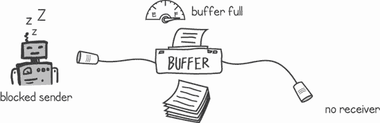
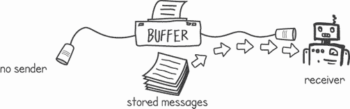
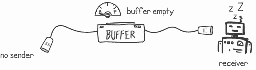
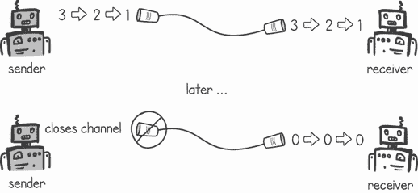
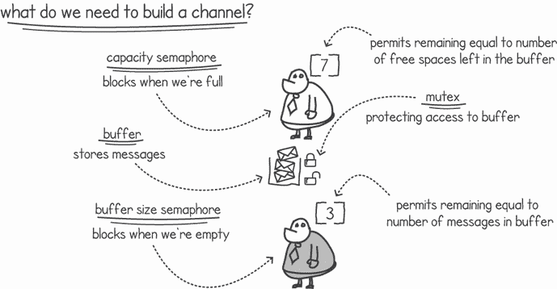
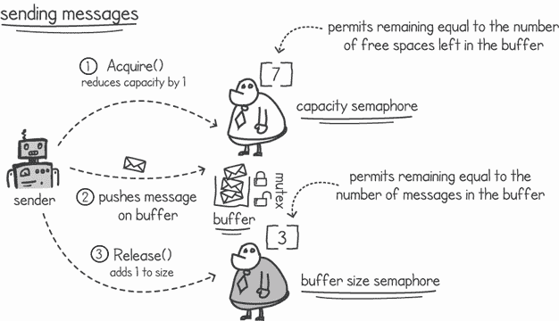
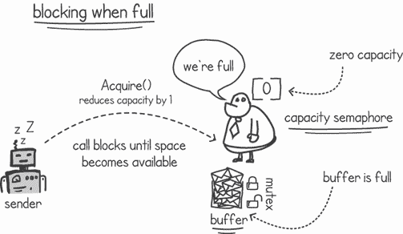
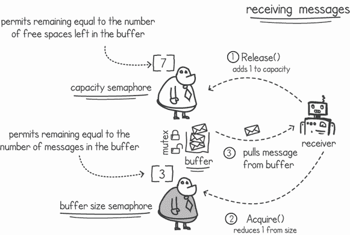
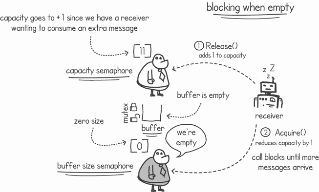
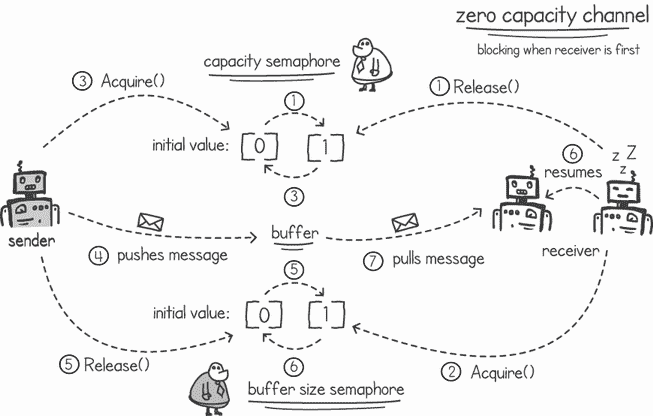

# 7 使用消息传递进行通信

本章涵盖

+   用于线程通信的消息交换

+   采用 Go 的通道进行消息传递

+   使用通道收集异步结果

+   构建我们自己的通道

到目前为止，我们讨论了让我们的 goroutines 通过共享内存和使用同步控制来防止它们相互跨越来解决问题。消息传递是另一种实现 *线程间通信*（ITC）的方式，即 goroutines 向其他 goroutines 发送消息或等待来自其他 goroutines 的消息。

在本章中，我们将探讨使用 Go 的通道在我们的 goroutines 之间发送和接收消息。本章将作为使用来自形式化语言通信顺序进程（CSP）的抽象来编程并发的介绍。我们将在接下来的章节中更详细地介绍 CSP。

## 7.1 传递消息

无论我们与朋友、家人或同事交谈或沟通，我们都是通过相互传递消息来进行的。在言语中，我们说些什么，通常期望从我们说话的人那里得到回复或反应。当我们通过信件、电子邮件或电话进行沟通时，这种期望也是有效的。goroutines 之间的消息传递与此类似。在 Go 中，我们可以在两个或更多 goroutines 之间打开一个通道，然后编程 goroutines 在它们之间发送和接收消息（见图 7.1）。


图 7.1 Goroutines 之间传递消息

消息传递和分布式系统

当我们在多台机器上运行分布式应用程序时，消息传递是它们之间通信的主要方式。由于应用程序运行在不同的机器上，并且不共享任何内存，它们通过发送消息通过常见的协议（如 HTTP）来共享信息。

使用消息传递的优势在于，我们大大降低了因编程错误而引起竞态条件的风险。由于我们不是在修改任何共享内存的内容，goroutines 在内存中不能相互跨越。使用消息传递，每个 goroutine 只与自己的隔离内存进行工作。

### 7.1.1 使用通道传递消息

Go 通道允许两个或更多 goroutines 交换消息。从概念上讲，我们可以将通道视为我们的 goroutines 之间的直接线路，如图 7.2 所示。goroutines 可以使用通道的两端来发送或接收消息。


图 7.2 通道是 goroutines 之间的直接线路。

要使用通道，我们首先使用`make()`内置函数创建一个通道。然后，每次我们创建协程时都可以将其作为参数传递。要发送消息，我们使用`<-`操作符。在列表 7.1 中，我们初始化了一个类型为`string`的通道。通道指定的类型允许我们发送相同类型的消息。正如这个例子所示，我们只能通过这个通道发送字符串。在创建这个通道后，我们将其传递给一个新创建的名为`receiver()`的协程。然后我们通过通道发送三个字符串消息。

列表 7.1 创建和使用通道

```
package main

import "*fmt*"

func main() {
    msgChannel := make(chan string)    ❶
    go receiver(msgChannel)            ❷
    fmt.Println("*Sending HELLO...*")
    msgChannel <- "*HELLO*"              ❸
    fmt.Println("*Sending THERE...*")    ❸
    msgChannel <- "*THERE*"              ❸
    fmt.Println("*Sending STOP...*")     ❸
    msgChannel <- "*STOP*"               ❸
}
```

❶ 创建一个新的字符串类型通道

❷ 使用通道引用启动一个新的协程

❸ 通过通道发送三个字符串消息

要从通道消费消息，我们使用相同的`<-`操作符。然而，我们将通道放在操作符的右边而不是左边。这在上面的`receiver()`协程实现中显示，它从通道读取消息，直到接收到消息`STOP`。

列表 7.2 从通道读取消息

```
func receiver(messages chan string) {
    msg := ""
    for msg != "*STOP*" {                  ❶
        msg = <-messages                 ❷
        fmt.Println("*Received:*", msg)    ❸
    }
}
```

❶ 在接收到消息不是 STOP 时继续

❷ 从通道读取下一个消息

❸ 在控制台上输出消息

将列表 7.1 和 7.2 合并会导致`main()`协程在公共通道上推送消息，而`receiver`协程消费它们。一旦`main()`协程发送停止消息，接收器将退出`for`循环并终止。以下是输出：

```
$ go run messagepassing.go
Sending HELLO...
Sending THERE...
Received: HELLO
Received: THERE
Sending STOP...
```

注意在输出中，我们缺少接收器的最终`STOP`消息。这是因为`main()`协程发送停止消息然后终止。一旦`main`协程终止，整个进程就会退出，我们永远不会看到在控制台上打印的停止消息。

如果一个协程在没有任何其他协程读取该消息的情况下向通道推送消息会发生什么？Go 的通道默认是同步的，这意味着发送者协程将阻塞，直到有接收者协程准备好消费消息。图 7.3 显示了没有接收者的协程发送者被阻塞。


图 7.3 在无接收者的情况下向通道发送消息

我们可以通过将列表 7.2 中的接收器更改为以下内容来尝试这一点。在这个接收器中，我们在终止之前等待 5 秒钟，而不是从通道中消费任何消息。

列表 7.3 接收器不消费任何消息

```
func receiver(messages chan string) {
    time.Sleep(5 * time.Second)                  ❶
    fmt.Println("*Receiver slept for 5 seconds*")
}
```

❶ 等待 5 秒钟而不是从通道读取消息

当我们运行列表 7.1 中的`main()`函数和列表 7.3 时，`main()`协程会阻塞 5 秒钟。这是因为没有东西可以消费`main()`协程试图放置在通道上的消息：

```
$ go run noreceiver.go
Sending HELLO...
Receiver slept for 5 seconds
fatal error: all goroutines are asleep - deadlock!

goroutine 1 [chan send]:
main.main()
        /chapter7/listing7.3/noreceiver.go:12 +0xb9
exit status 2
```

由于我们的`receiver ()`协程在 5 秒后终止，没有其他协程可用于从通道中消费消息。Go 的运行时意识到这一点，并引发致命错误。如果没有这个错误，我们的程序将保持阻塞状态，直到我们手动终止它。错误信息提到我们遇到了死锁——我们将在第十一章探讨如何处理死锁。

如果有一个等待消息的接收者而没有发送者，也会出现相同的情况。接收者的协程将暂停，直到有消息可用（见图 7.4）。


图 7.4 接收者被阻塞，直到有消息可用。

在下面的列表中，我们有一个`sender()`协程，它不是将消息写入通道，而是睡眠 5 秒。`main()`协程试图从同一个通道中消费一个消息，但它将被阻塞，因为没有发送者发送消息。

列表 7.4 接收者被阻塞，因为发送者没有发送任何消息

```
package main

import (
    "*fmt*"
    "*time*"
)

func main() {
    msgChannel := make(chan string)                ❶
    go sender(msgChannel)
    fmt.Println("*Reading message from channel**...*")
    msg := <-msgChannel                            ❷
    fmt.Println("*Received:*", msg)
}

func sender(messages chan string) {
    time.Sleep(5 * time.Second)                    ❸
    fmt.Println("*Sender slept for 5 seconds*")
}
```

❶ 创建一个新的字符串类型通道

❷ 从通道读取消息

❸ 替代发送消息，睡眠 5 秒

运行列表 7.4 会产生与列表 7.3 类似的结果。我们得到一个等待消息的接收者，当`sender()`协程终止时，Go 的运行时会输出一个错误。以下是控制台输出：

```
$ go run nosender.go
Reading message from channel...
Sender slept for 5 seconds
fatal error: all goroutines are asleep - deadlock!

goroutine 1 [chan receive]:
main.main()
        /chapter7/listing7.4/nosender.go:12 +0xbd
exit status 2
```

这里的关键思想是，默认情况下，Go 的通道是**同步的**。如果没有协程消费其消息，发送者将阻塞，同样，如果没有协程发送消息，接收者也会阻塞。

### 7.1.2 使用通道缓冲消息

虽然通道是同步的，但我们可以配置它们，在它们阻塞之前存储一定数量的消息（见图 7.5）。当我们使用带缓冲的通道时，只要缓冲区有空间，发送者协程就不会阻塞。


图 7.5 在协程之间使用带缓冲的通道

当我们创建一个通道时，可以指定其缓冲区容量。然后，每当发送者协程写入消息而没有接收者消费该消息时，通道将存储该消息（如图 7.6 所示）。这意味着只要缓冲区有空间，我们的发送者就不会阻塞，我们也不必等待接收者读取消息。


图 7.6 当没有接收者消费消息时，消息存储在缓冲区中。

只要缓冲区中还有容量，通道就会继续存储消息。一旦缓冲区被填满，发送者将再次阻塞，如图 7.7 所示。如果接收端响应慢，没有足够快地消费消息以跟上发送者，也可能发生这种消息缓冲区积累。



图 7.7 一个满缓冲区阻止了发送者。

一旦有接收器 goroutine 可以消费消息，消息将以与发送时相同的顺序被发送到接收器。即使发送器 goroutine 不再发送任何新消息（如图 7.8 所示），也是如此。只要缓冲区中有消息，接收器 goroutine 就不会阻塞。



图 7.8 接收器即使在没有发送者的情况下也会从缓冲区中消费存储的消息。

一旦接收器 goroutine 消耗了所有消息并且缓冲区为空，接收器 goroutine 将再次阻塞。当缓冲区为空时，如果没有发送者或者发送者产生消息的速度比接收者读取它们的速度快，接收者将阻塞。这如图 7.9 所示。



图 7.9 没有发送者的空缓冲区将阻塞接收器。

让我们现在尝试一下。列表 7.5 显示了一个慢速消息接收器，它以每秒一个消息的速率从整数通道中消费消息。我们使用`time.Sleep()`来减慢 goroutine 的速度。一旦`receiver()` goroutine 接收到`-1`值，它就停止接收消息，并在 waitgroup 上调用`Done()`。

列表 7.5 每秒读取一个消息的慢速接收器

```
package main

import (
    "*fmt*"
    "*sync*"
    "*time*"
)

func receiver(messages chan int, wGroup *sync.WaitGroup) {
    msg := 0
    for msg != -1 {                    ❶
        time.Sleep(1 * time.Second)    ❷
        msg = <-messages               ❸
        fmt.Println("*Received:*", msg)
    }
    wGroup.Done()                      ❹
}
```

❶ 从通道中读取消息，直到接收到-1

❷ 等待 1 秒

❸ 从通道读取下一个消息

❹ 在读取所有消息后在 waitgroup 上调用 Done()

我们现在可以编写一个`main()`函数，该函数创建一个带缓冲的通道，并以比我们的读者消费它们更快的速度将消息喂入通道。在列表 7.6 中，我们创建了一个容量为三个消息的带缓冲通道。然后我们使用这个通道快速发送六个消息，每个消息都包含从`1`到`6`的序列中的下一个数字。之后，我们发送一个包含`-1`值的最终消息。最后，我们通过等待 waitgroup 来等待`receiver()` goroutine 完成。

列表 7.6 `main()`函数在带缓冲的通道上发送消息

```
func main() {
    msgChannel := make(chan int, 3)              ❶
    wGroup := sync.WaitGroup{}                   ❷
    wGroup.Add(1)                                ❷
    go receiver(msgChannel, &wGroup)             ❸
    for i := 1; i <= 6; i++ {
        size := len(msgChannel)                  ❹
        fmt.Printf("%s Sending: %d. Buffer Size: %d\n",
            time.Now().Format("15:04:05"), i, size)
        msgChannel <- i                          ❺
    }
    msgChannel <- -1                             ❻
    wGroup.Wait()                                ❼
}
```

❶ 创建一个容量为 3 个消息的新通道

❷ 创建一个大小为 1 的 waitgroup

❸ 使用带缓冲的通道和 waitgroup 启动接收器 goroutine

❹ 读取带缓冲通道中的消息数量

❺ 发送从 1 到 6 的六个整数消息

❻ 发送包含-1 的消息

❼ 等待 waitgroup 直到接收器完成

注意：我们可以通过使用`len(buffer)`函数来检查缓冲区中有多少消息。

结合列表 7.5 和 7.6，我们得到一个快速发送者，它试图发送六个消息。由于我们的接收者速度要慢得多，`main()` goroutine 将用三个消息填满通道缓冲区，然后阻塞。接收者将每秒消费一个消息，为发送者快速填充缓冲区腾出空间。以下是显示每个发送和接收操作时间戳的输出：

```
11:09:15 Sending: 1\. Buffer Size: 0
11:09:15 Sending: 2\. Buffer Size: 1
11:09:15 Sending: 3\. Buffer Size: 2
11:09:15 Sending: 4\. Buffer Size: 3
11:09:16 Received: 1
11:09:16 Sending: 5\. Buffer Size: 3
11:09:17 Received: 2
11:09:17 Sending: 6\. Buffer Size: 3
11:09:18 Received: 3
11:09:19 Received: 4
11:09:20 Received: 5
11:09:21 Received: 6
11:09:22 Received: -1
```

### 7.1.3 为通道分配方向

Go 的通道默认是 *双向的*。这意味着一个 goroutine 可以同时作为消息的接收者和发送者。然而，我们可以给通道指定一个方向，这样使用该通道的 goroutine 就只能发送或接收消息。

例如，当我们声明一个函数的参数时，我们可以指定通道的方向。列表 7.7 声明了接收者和发送者函数，允许消息只能单向流动。在接收者中，当我们声明通道为 `messages <-chan int` 时，我们是在说这个通道是一个只接收通道。发送者函数中 `messages chan<- int` 的声明则表示相反的意思——通道只能用来发送消息。

列表 7.7 声明具有方向的通道

```
package main

import (
    "*fmt*"
    "*time*"
)

func receiver(messages <-chan int) {     ❶
    for {
        msg := <-messages                ❷
        fmt.Println(time.Now().Format("*15:04:05*"), "*Received:*", msg)
    }
}

func sender(messages chan<- int) {       ❸
    for i := 1; ; i++ {
        fmt.Println(time.Now().Format("*15:04:05*"), "*Sending:*", i)
        messages <- i                    ❹
        time.Sleep(1 * time.Second)      ❹
    }
}

func main() {
    msgChannel := make(chan int)
    go receiver(msgChannel)
    go sender(msgChannel)
    time.Sleep(5 * time.Second)
}
```

❶ 声明一个只接收通道

❷ 从通道接收消息

❸ 声明一个只发送通道

❹ 每秒在通道上发送一条消息

在列表 7.7 中，如果我们尝试使用接收者的通道来发送消息，我们会得到一个编译错误。例如，如果在 `receiver()` 函数中我们这样做

```
messages <- 99
```

在编译时我们会得到一个错误信息：

```
$ go build directional.go
# command-line-arguments
.\directional.go:11:9: invalid operation: cannot send to receive-only channel 
➥ messages (variable of type <-chan int)
```

### 7.1.4 关闭通道

我们一直使用特殊值消息来表示通道上没有更多数据可用。例如，在列表 7.6 中，接收者正在等待通道上出现 `–1` 值。这向接收者发出信号，表明它可以停止消费消息。这个消息包含了一个被称为 *哨兵值* 的内容。

定义 在软件开发中，*哨兵值* 是一个预定义的值，它向执行、进程或算法发出信号，表明它应该终止。在多线程和分布式系统的上下文中，这有时被称为 *毒药丸* 消息。

而不是使用这个 *哨兵值* 消息，Go 允许我们关闭一个通道。我们可以通过调用 `close(channel)` 函数来实现。一旦我们关闭了通道，就不应该再向其发送任何消息，因为这样做会引发错误。如果我们尝试从已关闭的通道接收消息，我们会收到包含通道数据类型默认值的消息。例如，如果我们的通道是整型，从已关闭的通道读取将导致读取操作返回 `0` 值。这如图 7.10 所示。



图 7.10 关闭通道并继续消费消息

我们可以通过实现一个在关闭通道后仍然持续消费消息的接收者来展示这一点。下面的列表显示了一个 `receiver()` 函数，其中包含一个循环，从通道读取消息并在每秒将其输出到控制台。

列表 7.8 无限通道接收器

```
package main

import (
    "*fmt*"
    "*time*"
)

func receiver(messages <-chan int) {        ❶
    for {
        msg := <-messages                   ❷
        fmt.Println(time.Now().Format("*15:04:05*"), "*Received:*", msg)
        time.Sleep(1 * time.Second)         ❸
    }
}
```

❶ 声明一个只接收通道

❷ 从通道读取一条消息

❸ 等待 1 秒

接下来，我们可以实现一个`main()`函数，该函数在通道上发送几条消息，然后关闭通道。在下面的列表中，我们发送了三条消息，每秒一条，然后关闭了通道。我们还添加了 3 秒的休眠时间，以显示`receiver()`协程从关闭的通道中读取的内容。

列表 7.9 `main()`函数发送消息并关闭通道

```
func main() {
    msgChannel := make(chan int)
    go receiver(msgChannel)
    for i := 1; i <= 3 ; i++ {
        fmt.Println(time.Now().Format("*15:04:05*"), "*Sending:*", i)
        msgChannel <- i
        time.Sleep(1 * time.Second)
    }
    close(msgChannel)
    time.Sleep(3 * time.Second)
}
```

将列表 7.8 和 7.9 一起运行，我们得到接收器首先输出从`1`到`3`的消息，然后读取 3 秒的`0`：

```
$ go run closing.go
17:19:50 Sending: 1
17:19:50 Received: 1
17:19:51 Sending: 2
17:19:51 Received: 2
17:19:52 Sending: 3
17:19:52 Received: 3
17:19:53 Received: 0
17:19:54 Received: 0
17:19:55 Received: 0
```

我们能否使用这个默认值让接收器知道通道已被关闭？使用默认值并不理想，因为默认值可能对我们用例是有效的值。想象一下，例如，一个通过通道发送温度的天气预报应用程序。在这种情况下，当温度降到 0 时，接收器会认为通道已被关闭。

幸运的是，Go 提供了几种处理关闭通道的方法。每次我们从通道中消费时，都会返回一个额外的标志，告诉我们通道的状态。这个标志仅在通道被关闭时设置为`false`。下面的列表显示了如何修改列表 7.8 中的接收器函数来读取这个标志。通过使用这个标志，我们可以决定是否停止从通道读取。

列表 7.10 当通道指示已关闭时，接收器停止

```
func receiver(messages <-chan int) {
    for {
        msg, more := <-messages                  ❶
        fmt.Println(time.Now().Format("*15:04:05*"), "*Received:*", msg, more)
        time.Sleep(1 * time.Second)
        if !more {                               ❷
            return                               ❷
        }
    }
}
```

❶ 读取消息和一个打开的通道标志，当通道关闭时该标志设置为 false

❷ 当没有更多消息时，它停止从通道中消费。

如预期，当我们运行列表 7.10 与列表 7.9 中的`main()`函数时，我们会消费消息直到通道关闭。我们还可以看到，当通道关闭时，打开通道标志被设置为`false`：

```
$ go run closingFlag.go
08:07:41 Sending: 1
08:07:41 Received: 1 true
08:07:42 Sending: 2
08:07:42 Received: 2 true
08:07:43 Sending: 3
08:07:43 Received: 3 true
08:07:44 Received: 0 false
```

正如我们在下一章中将要看到的，这种语法在特定情况下很有用，例如当它与`select`语句结合使用时。然而，我们可以使用更简洁的语法来停止接收器在关闭的通道上读取。如果我们想读取所有消息直到关闭通道，我们可以使用以下`for`循环语法：

```
for msg := range messages
```

在这里，`messages`变量是我们的通道。这样，我们可以继续迭代，直到发送者最终关闭通道。下面的列表显示了如何将列表 7.9 中的`receiver()`函数更改为使用这种新语法。

列表 7.11 接收器迭代通道中的消息

```
func receiver(messages <-chan int) {
    for msg := range messages {                  ❶
        fmt.Println(time.Now().Format("*15:04:05*"), "*Received:*", msg)
        time.Sleep(1 * time.Second)
    }
    fmt.Println("*Receiver finished.*")
}
```

❶ 从通道中消费直到它关闭，将消息分配给 msg 变量

将列表 7.11 与列表 7.9 中的相同`main()`函数一起运行，我们最终会消费来自`main()`协程的所有发送的消息。该列表输出以下内容：

```
$ go run forchannel.go
09:52:11 Sending: 1
09:52:11 Received: 1
09:52:12 Sending: 2
09:52:12 Received: 2
09:52:13 Sending: 3
09:52:13 Received: 3
Receiver finished.
```

### 7.1.5 使用通道接收函数结果

我们可以在后台并发执行函数，一旦完成，就可以通过通道收集它们的结果。通常，在正常的顺序编程中，我们调用一个函数并期望它返回一个结果。在并发编程中，我们可以在不同的 goroutine 中调用函数，稍后从输出通道中获取它们的返回值。

让我们用一个简单的例子来探讨这个问题。以下列表显示了一个寻找输入数字因子的函数。例如，如果我们调用`findFactors(6)`，它将返回值`[1 2 3 6]`。

列表 7.12 寻找数字所有因子的函数

```
package main

import (
    "*fmt*"
)

func findFactors(number int) []int {    ❶
    result := make([]int, 0)
    for i := 1; i <= number; i++ {
        if number%i == 0 {
            result = append(result, i)
        }
    }
    return result
}
```

❶ 寻找输入数字的所有因子

如果我们为两个不同的数字两次调用`findFactors()`函数，在顺序编程中，我们将有两个调用，一个接一个。例如：

```
fmt.Println(findFactors(3419110721))
fmt.Println(findFactors(4033836233))
```

但如果我们想用第一个数字调用函数，同时它在计算这些因子时，我们再次用第二个数字调用该函数呢？如果我们有多个可用核心，将第一个`findFactors()`调用与第二个并行执行将加快我们的程序。寻找大数的因子可能是一个耗时的操作，因此将工作分配到多个处理核心上会更好。

我们当然可以启动一个 goroutine 来处理第一次调用，然后进行第二次调用：

```
go findFactors(3419110721)
fmt.Println(findFactors(4033836233))
```

然而，我们如何轻松地等待并收集第一次调用的结果呢？我们可以使用共享变量和 waitgroup，但有一个更简单的方法：使用通道。在下一个列表中，我们使用一个匿名函数，作为一个 goroutine 运行，并执行第一次`findFactors()`调用。

列表 7.13 使用通道收集结果

```
func main() {
    resultCh := make(chan []int)              ❶
    go func() {
        resultCh <- findFactors(3419110721)   ❷
    }()
    fmt.Println(findFactors(4033836233))
    fmt.Println(<- resultCh)                  ❸
}
```

❶ 创建一个新的整数切片类型的通道

❷ 在匿名 goroutine 中调用函数并将结果放置到通道中

❸ 从通道中收集结果

我们使用这个匿名 goroutine 来收集`findFactors()`函数的结果并将它们写入通道。在我们`main()` goroutine 中完成第二次调用之后，我们可以从通道中读取这些结果。如果第一次`findFactors()`调用尚未完成，从通道中读取将阻塞`main()` goroutine，直到我们得到结果。以下是显示所有因子的输出：

```
$ go run collectresults.go
[1 7 131 917 4398949 30792643 576262319 4033836233]
[1 13 113 1469 2327509 30257617 263008517 3419110721]
```

## 7.2 实现通道

通道的内部逻辑是什么样的？在其基本形式中，一个带缓冲的通道类似于固定大小的队列数据结构。区别在于它可以安全地从多个并发 goroutine 中使用。此外，当缓冲区为空时，通道需要阻塞接收 goroutine；当缓冲区满时，需要阻塞发送 goroutine。在本节中，我们将使用之前章节中构建的并发原语来构建通道的发送和接收函数，以便我们更好地理解其内部工作原理。

### 7.2.1 使用信号量创建通道

我们需要一些元素来构建我们频道的功能：

+   一个共享队列数据结构，它像一个缓冲区一样存储发送者和接收者之间的消息

+   对共享数据结构的并发访问保护，以确保多个发送者和接收者不会相互干扰

+   当缓冲区为空时阻止接收器执行的访问控制

+   当缓冲区满时阻止发送器执行的访问控制

我们有几种实现我们的共享数据结构的方法，我们将在这里存储我们的消息。例如，我们可以在数组上构建一个队列结构，并使用 Go 切片或链表。无论我们选择哪种工具，它都需要给我们提供队列语义，即先进先出。

为了保护我们的共享数据结构免受并发访问的影响，我们可以使用一个简单的互斥锁。当我们从队列中添加或删除消息时，我们需要确保对队列的并发修改不会相互干扰。

为了控制访问，以便在队列满或空时阻塞执行，我们可以使用信号量。在这种情况下，信号量是一个很好的基本原语，因为它们允许对特定数量的并发执行进行并发访问。从接收者的角度来看，我们可以将使用信号量视为共享队列中消息数量的自由许可证。一旦队列空了，信号量将阻止下一个请求消费消息，因为信号量上的自由许可证数量将是 `0`。我们可以在发送者的一侧使用同样的技巧——我们可以使用另一个信号量，当队列满时它将下降到 `0`。一旦发生这种情况，信号量将阻止下一个发送请求。

这四个元素构成了图 7.11 中的 10 个缓冲区大小的通道。我们使用两个信号量，容量和缓冲区大小信号量，分别用于在容量达到或缓冲区为空时阻塞 goroutines。在图中，缓冲区中有三个消息，因此缓冲区大小信号量显示为 `3`。这意味着我们还有七个空间直到缓冲区满，容量信号量被设置为这个值。



图 7.11 构建通道所需的结构和工具

我们可以通过创建一个包含这四个元素的 `channel` struct 类型来将此转换为代码，如列表 7.14 所示。对于我们的缓冲区，我们将使用 `container` 包中的链表实现。链表是实现队列的理想结构，因为我们总是在链表的头部或尾部添加和删除消息。在 `channel` struct 类型中，我们还使用了 Go 的泛型，这使得我们的通道实现更容易与各种数据类型一起使用。

列表 7.14 用于自定义通道实现的类型 struct

```
package listing7_14

import (
    "*container/list*"
    "*github.com/cutajarj/ConcurrentProgrammingWithGo/chapter5/listing5.16*"
    "*sync*"
)

type Channel[M any] struct {
    capacitySema *listing5_16.Semaphore    ❶

    sizeSema     *listing5_16.Semaphore    ❷

    mutex        sync.Mutex                ❸

    buffer       *list.List                ❹
}
```

❶ 容量信号量，当缓冲区满时阻止发送器

❷ 缓冲区大小信号量，当缓冲区为空时阻止接收器

❸ 互斥锁保护我们的共享列表数据结构

❹ 将用作队列数据结构的链表

接下来，我们需要一个函数来初始化`struct`类型中的元素，使用默认空值。当我们创建一个新的通道时，我们需要缓冲区为空，缓冲区大小信号量具有`0`个许可，容量信号量的许可计数等于输入容量。这将确保我们允许发送者添加消息，但接收者因为缓冲区当前为空而被阻塞。以下列表中的`NewChannel()`函数执行此初始化。

列表 7.15：创建新通道的函数

```
func NewChannelM any *Channel[M] {
    return &Channel[M]{
        capacitySema: listing5_16.NewSemaphore(capacity),  ❶

        sizeSema:     listing5_16.NewSemaphore(0),         ❷

        buffer:       list.New(),                          ❸
    }
}
```

❶ 创建一个许可数等于输入容量的新信号量

❷ 创建一个许可数为 0 的新信号量

❸ 创建一个新的、空的链表

### 7.2.2 在我们的通道中实现 Send()函数

让我们探索一下信号量、缓冲区和互斥锁如何协同工作，以给我们提供通道的发送功能。`Send(message)`函数需要满足以下三个要求：

+   如果缓冲区已满，阻止 goroutine。

+   否则，安全地将`message`添加到缓冲区。

+   如果有任何接收者 goroutine 被阻塞，等待消息，恢复其中一个。



图 7.12 在通道上发送消息

我们可以通过执行图 7.12 中概述的三个步骤来满足所有这些要求：

1.  发送者从容量信号量中获取一个许可，许可计数减少`1`。这将满足第一个要求；如果缓冲区已满，goroutine 将因为不再有可用的许可而阻塞。

1.  发送者将消息推送到缓冲区数据结构中。在我们的实现中，这个数据结构是链表队列。为了保护队列免受并发更新，我们可以使用互斥锁来同步访问。

1.  发送者 goroutine 通过在信号量上调用`Release()`函数来释放缓冲区大小信号量上的许可。这满足了最终要求；如果有阻塞的 goroutine 正在等待消息，它将被恢复。

下一个列表显示了发送者的实现。`Send(message)`函数包含三个步骤：减少容量信号量的许可数，将消息推送到队列中，并增加缓冲区大小信号量的许可数。

列表 7.16：通道实现的`Send()`函数

```
func (c *Channel[M]) Send(message M) {
    c.capacitySema.Acquire()            ❶

    c.mutex.Lock()                      ❷
    c.buffer.PushBack(message)          ❷
    c.mutex.Unlock()                    ❷

    c.sizeSema.Release()                ❸
}
```

❶ 从容量信号量中获取一个许可

❷ 在使用互斥锁保护以防止竞争条件的情况下，将消息添加到缓冲区队列中

❸ 从缓冲区大小信号量中释放一个许可

如果缓冲区已满，我们的容量信号量将没有剩余的许可，因此发送者 goroutine 将在第一步（见图 7.13）上被阻塞。如果使用初始容量为`0`的通道且没有接收者，发送者也会阻塞，这给我们提供了 Go 中默认通道的相同同步功能。



图 7.13 当缓冲区已满且我们具有`0`容量时阻止发送者

### 7.2.3 在我们的通道中实现 Receive()函数

现在我们来看看我们通道实现的接收端。`Receive()`函数需要满足以下要求：

+   解除等待容量空间的发送器的阻塞。

+   如果缓冲区为空，则阻塞接收器。

+   否则，安全地消费缓冲区中的下一条消息。



图 7.14 从通道接收消息

满足所有这些要求所需的步骤如图 7.14 所示：

1.  接收器在容量信号量上释放一个许可证。这将解除等待容量以放置其消息的发送器的阻塞。

1.  接收器尝试从缓冲区大小信号量中获取一个许可证。如果缓冲区中没有消息，这将导致接收器 goroutine 阻塞，满足第二个要求。

1.  一旦信号量解除接收器的阻塞，goroutine 将读取并从缓冲区中移除下一条消息。在这里，我们应该使用与发送器函数中相同的互斥锁，以确保我们保护共享缓冲区免受并发执行的干扰。

注意：首先释放容量信号量许可证的原因是我们希望实现也能在零缓冲区通道的情况下工作。这就是发送器和接收器都等待直到两者同时可用的情况。

列表 7.17 显示了`Receive()`函数的实现，执行图 7.14 中概述的三个步骤。它释放容量信号量，获取缓冲区信号量，并从实现队列缓冲区的链表中提取第一条消息。该函数使用与`Send()`函数相同的互斥锁来保护链表免受并发干扰。

列表 7.17 通道实现的`Receive()`函数

```
 func (c *Channel[M]) Receive() M {
    c.capacitySema.Release()                     ❶

    c.sizeSema.Acquire()                         ❷

    c.mutex.Lock()                               ❸
    v := c.buffer.Remove(c.buffer.Front()).(M)   ❸
    c.mutex.Unlock()                             ❸

    return v                                     ❹
}
```

❶ 从容量信号量中释放一个许可证

❷ 从缓冲区大小信号量中获取一个许可证

❸ 在使用互斥锁保护以防止竞态条件的同时，从缓冲区中移除一条消息

❹ 返回消息的值

如果我们的缓冲区为空，缓冲区大小信号量将没有可用的许可证。在这种情况下，当接收器 goroutine 尝试获取许可证时，缓冲区大小信号量将阻塞，直到发送器推送一条消息并调用同一信号量的`Release()`。图 7.15 显示了接收器 goroutine 在具有`0`个许可证的缓冲区大小信号量上阻塞的情况。



图 7.15 当缓冲区为空且我们在缓冲区大小信号量上有`0`个许可证时，接收器阻塞

使用信号量的这种阻塞逻辑，当通道容量设置为 `0` 时也会工作，如图 7.16 所示。这是 Go 通道的默认行为。在这种情况下，接收者会增加容量信号量上的许可，并阻塞在获取缓冲区大小信号量上。一旦有发送者到来，它将从容量信号量获取许可，将一条消息推入缓冲区，并释放缓冲区大小信号量。这将导致接收者 goroutine 被解除阻塞。然后接收者将从缓冲区中拉取消息。



图 7.16 零容量通道阻塞接收者，直到发送者推送一条消息

如果在零容量通道中发送者先于接收者到达，当发送者尝试获取容量信号量时，它将被阻塞，直到有接收者到来并释放同一信号量上的许可。

Go 通道是如何实现的？

实际的 Go 语言通道实现与运行时调度器集成，以提高性能。与我们的实现不同，它不使用双信号量系统来挂起 goroutines。相反，它使用两个链表来存储挂起的接收者和发送者 goroutines 的引用。

实现还有一个缓冲区来存储任何挂起的消息。当这个缓冲区满了或者通道是同步的，任何新的发送者 goroutine 会被挂起并排队在发送者列表中。相反，当缓冲区为空时，任何新的接收者 goroutine 会被挂起并排队在接收者列表中。

当需要恢复 goroutine 时，这些列表会被使用。当有消息可用时，接收者列表中的第一个 goroutine 被选中并恢复。当有新的接收者可用时，发送者列表中的第一个 goroutine 被恢复（如果有的话）。与我们的实现不同，这个系统确保了挂起 goroutines 之间的公平性；第一个挂起的 goroutine 也将是第一个被恢复的。

通道的源代码可以在 Go 的 GitHub 项目中找到，位于 `runtime` 包下，具体位置为 [`github.com/golang/go/blob/master/src/runtime/chan.go`](https://github.com/golang/go/blob/master/src/runtime/chan.go)。

## 7.3 练习

注意：访问 [`github.com/cutajarj/ConcurrentProgrammingWithGo`](http://github.com/cutajarj/ConcurrentProgrammingWithGo) 查看所有代码解决方案。

1.  在列表 7.1 和 7.2 中，接收者没有输出最后的消息 `STOP`。这是因为 `main()` goroutine 在 `receiver()` goroutine 有机会打印最后一条消息之前就终止了。你能否在不使用额外的并发工具和不使用 sleep 函数的情况下改变逻辑，以便打印最后一条消息？

1.  在列表 7.8 中，当通道关闭时，接收者读取到 `0`。你能否尝试使用不同的数据类型？如果通道是字符串类型会发生什么？如果是切片类型呢？

1.  在列表 7.13 中，我们使用子 goroutine 来计算一个数的因子，而`main()` goroutine 来计算另一个数的因子。修改这个列表，以便使用多个 goroutine 收集 10 个随机数的因子。

1.  将列表 7.14 至 7.17 修改为使用条件变量而不是信号量来实现通道。实现还需要支持零大小缓冲区的通道。

## 概述

+   消息传递是并发执行之间通信的另一种方式。

+   消息传递类似于我们日常通过传递消息并期待行动或回复的方式进行沟通。

+   在 Go 中，我们可以使用通道在 goroutine 之间传递消息。

+   Go 中的通道是同步的。默认情况下，如果没有接收者，发送者将会阻塞，如果没有发送者，接收者也会阻塞。

+   如果我们想允许发送者在阻塞接收者之前发送*N*条消息，我们可以配置通道上的缓冲区来存储消息。

+   使用缓冲通道时，如果缓冲区有足够容量，发送者即使没有接收者也可以继续向通道中写入消息。一旦缓冲区填满，发送者将会阻塞。

+   使用缓冲通道时，如果缓冲区不为空，接收者可以继续从通道中读取消息。一旦缓冲区清空，接收者将会阻塞。

+   我们可以为通道声明分配方向，以便我们可以从通道接收或向通道发送，但不能同时进行。

+   可以通过使用`close()`函数来关闭通道。

+   通道上的读操作会返回一个标志，告诉我们通道是否仍然打开。

+   我们可以使用`for` `range`循环继续从通道中消费消息，直到通道关闭。

+   我们可以使用通道收集并发 goroutine 执行的结果。

+   我们可以通过使用队列、两个信号量和互斥锁来实现通道功能。
