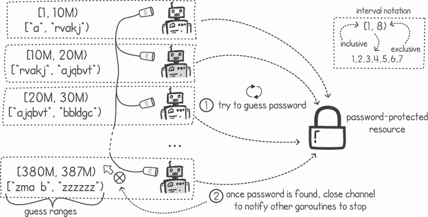
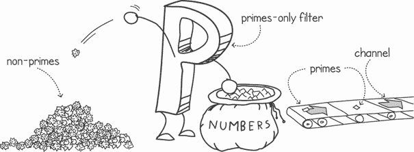
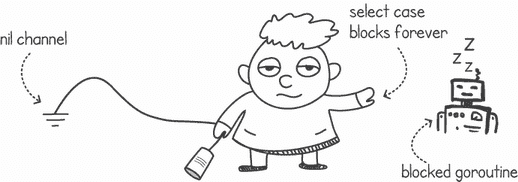
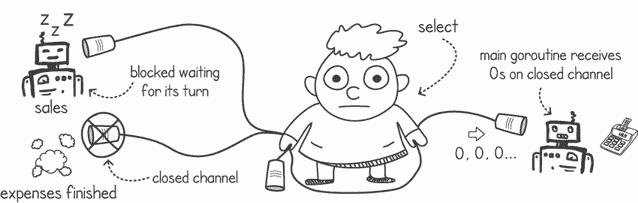
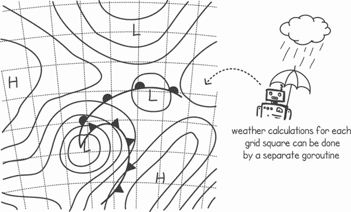

# 8 选择 channel

本章涵盖

+   从多个 channel 中选择

+   禁用 select 情况

+   在消息传递和内存共享之间选择

在上一章中，我们使用了 channel 在两个 goroutine 之间实现消息传递。在这一章中，我们将看到如何使用 Go 的`select`语句在多个 channel 上读取和写入消息，以及实现超时和非阻塞 channel。我们还将检查一种排除已关闭 channel 并仅从剩余的开放 channel 中消费的技术。最后，我们将讨论内存共享与消息传递之间的区别，以及何时应该选择一种技术而不是另一种。

## 8.1 结合多个 channel

我们如何让一个 goroutine 响应来自多个 goroutine 通过多个 channel 的消息？Go 的`select`语句允许我们指定多个 channel 操作作为单独的情况，然后根据哪个 channel 准备好来执行一个情况。

### 8.1.1 从多个 channel 读取

让我们考虑一个简单的场景，其中 goroutine 期望从不同的 channel 接收消息，但我们不知道下一个消息将在哪个 channel 上接收。`select`语句允许我们将多个 channel 上的读取操作组合在一起，阻塞 goroutine 直到任何一个 channel 上到达消息（见图 8.1）。


图 8.1 Select 语句会阻塞，直到某个 channel 可用。

一旦任何 channel 上到达消息，goroutine 将被解除阻塞，并运行该 channel 的代码处理器，如图 8.2 所示。然后我们可以决定接下来做什么——要么继续执行，要么再次使用`select`语句等待下一个消息。


图 8.2 一旦 channel 可用，select 解除阻塞。

让我们看看这如何转化为代码。在列表 8.1 中，我们有一个创建匿名 goroutine 的函数，该 goroutine 周期性地在 channel 上发送消息。周期由`seconds`输入变量指定。正如我们将在本章后面看到的那样，使用函数返回输出-only channel 的模式使我们能够将这些函数作为构建更复杂行为的构建块重用。我们可以这样做，因为 Go channels 是一等对象。

列表 8.1 函数周期性地在 channel 上输出消息

```
package main

import (
    "*fmt*"
    "*time*"
)

func writeEvery(msg string, seconds time.Duration) <-chan string {
    messages := make(chan string)    ❶
    go func() {                      ❷
        for {
            time.Sleep(seconds)      ❸
            messages <- msg          ❹
        }
    }()
    return messages                  ❺
 }
```

❶ 创建一个新的字符串类型 channel

❷ 创建一个新的匿名 goroutine

❸ 睡眠指定的时间段

❹ 在 channel 上发送指定的消息

❺ 返回新创建的消息 channel

定义 Channels 是**一等对象**，这意味着我们可以将它们存储为变量，从函数中传递或返回，甚至通过 channel 发送。

我们可以通过两次调用 `writeEvery()` 函数（如前一个列表所示）来演示 `select` 语句。如果我们指定不同的消息和睡眠周期，我们将得到两个通道和两个在不同时间发送消息的 goroutine。以下列表在 `select` 语句中读取这些通道，每个通道作为一个单独的 select 情况。

列表 8.2 使用 `select` 从多个通道读取

```
func main() {
    messagesFromA := writeEvery("*Tick*", 1 * time.Second)    ❶
    messagesFromB := writeEvery("*Tock*", 3 * time.Second)    ❷

    for {                                                   ❸
        select {
        case msg1 := <-messagesFromA:                       ❹
            fmt.Println(msg1)                               ❹
        case msg2 := <-messagesFromB:                       ❺
            fmt.Println(msg2)                               ❺
        }
    }
}
```

❶ 在通道 A 上创建一个每秒发送消息的 goroutine

❷ 在通道 B 上创建一个每 3 秒发送消息的 goroutine

❸ 无限循环

❹ 如果通道 A 有可用的消息，则输出该消息

❺ 如果通道 B 有可用的消息，则输出该消息

当我们同时运行列表 8.1 和 8.2 时，我们得到 `main()` goroutine 在每次收到来自任一通道的消息之前循环并阻塞。当我们收到消息时，`main()` goroutine 执行 `case` 语句下的代码。在这个例子中，代码只是将消息输出到控制台：

```
$ go run selectmanychannels.go
Tick
Tick
Tock
Tick
Tick
Tick
Tock
Tick
Tick
. . .
```

**注意**：当使用 `select` 时，如果多个情况都准备好了，则会随机选择一个情况。你的代码不应该依赖于情况指定的顺序。

`select` 语句的起源

UNIX 操作系统包含一个名为 `select()` 的系统调用，它接受一组文件描述符（如文件或网络套接字），并在一个或多个描述符准备好 I/O 操作时阻塞。当您想从单个内核级线程监控多个文件或套接字时，该系统调用非常有用。

Go 的 `select` 语句的名字来源于 Newsqueak 编程语言的 `select` 命令。Newsqueak（不要与乔治·奥威尔虚构的语言 Newspeak 混淆）是一种语言，就像 Go 一样，从 C.A.R. Hoare 的 CSP 形式语言中获取其并发模型。Newsqueak 的 `select` 语句可能得名于 1983 年为 Blit 图形终端构建的多路复用 I/O 的 select 系统调用。

不清楚 Go 的 `select` 语句的命名是否受到了 UNIX 系统调用的启发；然而，我们可以说 UNIX 的 `select()` 系统调用与 Go 的 `select` 语句类似，因为它将多个阻塞操作多路复用到单个执行中。

### 8.1.2 使用 `select` 进行非阻塞通道操作

`select` 的另一个用例是我们需要以非阻塞方式使用通道。回想一下，当我们讨论互斥锁时，我们看到 Go 提供了一个非阻塞的 `tryLock()` 操作。这个函数调用尝试获取锁，但如果锁正在被使用，它将立即返回一个 `false` 的返回值。我们能否采用这种模式进行通道操作？例如，我们能否尝试从通道读取消息？然后，如果没有消息可用，而不是阻塞，我们能否让当前执行在默认指令集上工作（参见图 8.3）？


图 8.3 当没有通道可用时，执行默认情况的指令。

`select`语句为我们提供了恰好这种场景的*默认情况*。如果没有其他情况可用，将执行默认情况下的指令。这让我们可以尝试访问一个或多个通道，但如果没有任何通道准备好，我们可以做其他事情。

在下面的列表中，我们有一个带有默认情况的`select`语句。在这个列表中，我们正在尝试从通道读取消息，但由于消息到达较晚，我们执行了默认情况的代码。

列表 8.3 从通道进行非阻塞读取

```
package main

import (
    "*fmt*"
    "*time*"
)

func sendMsgAfter(seconds time.Duration) <-chan string {
    messages := make(chan string)
    go func() {
        time.Sleep(seconds)
        messages <- "*Hello*"
    }()
    return messages
}

func main() {
    messages := sendMsgAfter(3 * time.Second)         ❶
    for {
        select {
        case msg := <-messages:                       ❷
            fmt.Println("*Message received:*", msg)
            return                                    ❸
        default:                                      ❹
            fmt.Println("*No messages waiting*")
            time.Sleep(1 * time.Second)
        }
    }
}
```

❶ 在 3 秒后发送通道消息

❷ 如果有消息，则从通道读取消息

❸ 当有消息可用时，终止执行

❹ 当没有消息可用时，执行默认情况。

在前面的列表中，由于我们在循环中有`select`语句，默认情况会反复执行，直到我们收到消息。当发生这种情况时，我们会打印消息并在`main()`函数中返回，终止程序。以下是输出：

```
$ go run nonblocking.go
No messages waiting
No messages waiting
No messages waiting
Message received: Hello
```

### 8.1.3 在默认情况下执行并发计算

一个有用的场景是使用默认的 select 情况来执行并发计算，然后使用通道来表示我们需要停止。为了说明这个概念，假设我们有一个示例应用程序，它将通过暴力破解来发现遗忘的密码。为了使事情简单，让我们假设我们有一个受密码保护的文件，我们知道它的密码是六位或更少，只使用小写字母*a*到*z*和空格。

从"`a`"到"`zzzzzz`"，包括空格，可能的字符串数量是 27 的 6 次方减 1（387,420,488）。下面的列表中的函数为我们提供了一种将 1 到 387,420,488 的整数转换为字符串的方法。例如，调用`toBase27(1)`会得到"`a`"，调用它时使用`2`会得到"`b`"，`28`会得到"`aa`"，依此类推。

列表 8.4 枚举字符串的所有可能组合

```
package main

import (
    "*fmt*"
    "*time*"
)

const (
    passwordToGuess = "*go far*"                      ❶
    alphabet = " *abcdefghijklmnopqrstuvwxyz*"        ❷
)

func toBase27(n int) string {
    result := ""
    for n > 0 {                                     ❸
        result = string(alphabet[n%27]) + result    ❸
        n /= 27                                     ❸
    }
    return result
}
```

❶ 设置我们需要猜测的密码

❷ 定义密码可能由的所有可能字符

❸ 算法使用字母常量将十进制整数转换为基 27 的字符串

如果我们不得不在顺序程序中使用暴力方法，我们就会创建一个循环，枚举从"`a`"到"`zzzzzz`"的所有字符串，并且每次都会检查它是否与变量`passwordToGuess`匹配。在现实生活中，我们不会有密码的值；相反，我们会尝试使用每个字符串枚举作为密码来访问我们的资源（例如文件）。

为了更快地找到我们的密码，我们可以将猜测的范围分配给几个 goroutine。例如，goroutine A 将尝试从字符串枚举 1 到 1000 万，goroutine B 将尝试从 1000 万到 2000 万，依此类推（见图 8.4）。这样，我们可以有多个 goroutine，每个 goroutine 都在我们问题空间的不同部分工作。



图 8.4 在执行之间分配工作并关闭通道以停止它们

为了避免不必要的计算，我们希望在任何一个 goroutine 做出正确猜测时停止每个 goroutine 的执行。为了实现这一点，我们可以使用一个通道来通知所有其他 goroutine 当一个执行发现密码时，如图 8.4 所示。一旦一个 goroutine 找到匹配的密码，它就关闭一个公共通道。这会中断所有参与 goroutine 并停止处理。

注意 我们可以在通道上使用`close()`操作来向所有消费者广播信号。

我们如何实现关闭公共通道后停止所有 goroutine 处理的逻辑？一个解决方案是在`select`语句的默认情况下执行必要的计算，然后有一个等待公共通道的另一个情况。在我们的例子中，我们可以调用我们的`toBase27()`函数并在默认情况下尝试猜测密码，每次只猜测一个密码。我们可以将停止生成和尝试密码的逻辑放在一个单独的`select`情况中，这将触发当公共通道关闭时。

列表 8.5 显示了一个接受这个公共通道，称为`stop`的函数。在函数中，我们生成给定范围的密码猜测，这些范围由`from`和`upto`整数变量表示。每次我们生成下一个密码猜测时，我们尝试将其与`passwordToGuess`常量匹配。这模拟了程序尝试访问受密码保护的资源。一旦密码匹配，函数关闭通道，导致所有 goroutine 在自己的`select`情况下收到关闭消息，并由于`return`语句而停止处理。

列表 8.5 强制力密码发现 goroutine

```
func guessPassword(from int, upto int, stop chan int, result chan string) {
    for guessN := from; guessN < upto; guessN += 1 {                       ❶

        select {

        case <-stop:                                                       ❷
            fmt.Printf("*Stopped at %d %d,%d)\n*", guessN, from, upto)
            return

        default:
            if toBase27(guessN) == passwordToGuess {                       ❸
                result <- toBase27(guessN)                                 ❹
                close(stop)                                                ❺
                return
            }
        }
    }
    fmt.Printf("*Not found between [%d,%d)\n*", from, upto)
}
```

❶ 使用 from 和 upto 作为起始点和结束点循环遍历所有密码组合

❷ 在收到停止通道的消息后，输出一条消息并停止处理

❸ 检查密码是否匹配（在现实生活中的系统中，我们会尝试访问受保护的资源）

❹ 在结果通道上发送匹配的密码

❺ 关闭通道，以便其他 goroutine 停止检查密码

我们现在可以创建几个执行前面列表的 goroutine。每个 goroutine 将尝试在特定范围内找到正确的密码。在下面的列表中，`main()`函数创建了必要的通道，并以每步 1000 万为单位启动所有 goroutine。

列表 8.6 `main()` 函数创建具有各种密码范围的多个 goroutine

```
func main() {
    finished := make(chan int)                                          ❶

    passwordFound := make(chan string)                                  ❷

    for i := 1; i <= 387_420_488; i += 10_000_000 {                     ❸
        go guessPassword(i, i+ 10_000_000, finished, passwordFound)     ❸
    }                                                                   ❸

    fmt.Println("*password found:*", <-passwordFound)                     ❹
    close(passwordFound)
    time.Sleep(5 * time.Second)                                         ❺
}
```

❶ 创建一个在 goroutine 中使用，用于在找到密码时发出信号的公共通道

❷ 创建一个通道，在找到密码后它将包含找到的密码

❸ 创建一个输入范围为[1, 10M), [10M, 20M), ... [380M, 390M)的 goroutine

❹ 等待找到密码

❺ 使用密码模拟程序访问资源

在启动所有 goroutine 后，`main()`函数等待`passwordFound`通道上的输出消息。一旦某个 goroutine 发现正确的密码，它将向`main()`函数发送密码到其`result`通道。当我们一起运行所有列表时，我们得到以下输出：

```
Not found between [1,10000001)
Stopped at 277339743 [270000001,280000001)
Stopped at 267741962 [260000001,270000001)
Stopped at 147629035 [140000001,150000001)
. . .
password found: go far
Stopped at 378056611 [370000001,380000001)
Stopped at 217938567 [210000001,220000001)
Stopped at 357806660 [350000001,360000001)
Stopped at 287976025 [280000001,290000001)
. . .
```

### 8.1.4 通道超时

另一个有用的场景是仅阻塞指定的时间，等待通道上的操作。就像在前两个例子中一样，我们想要检查通道上是否收到了消息，但我们想等待几秒钟看看是否收到消息，而不是立即解除阻塞并做其他事情。这在许多通道操作对时间敏感的情况下很有用。例如，考虑一个金融交易应用程序，如果我们没有在时间窗口内收到股票价格更新，我们需要发出警报。

我们可以通过使用一个单独的 goroutine，在指定超时后向额外的通道发送消息来实现这种行为。然后我们可以使用这个额外的通道在我们的`select`语句中，与其他通道一起使用。这将给我们阻塞在`select`语句上的效果，直到任何通道变得可用或超时发生（见图 8.5）。

![

图 8.5 使用定时器在通道上发送消息以实现带超时的阻塞

幸运的是，Go 中的`time.Timer`类型为我们提供了这个功能，我们不需要实现自己的定时器 goroutine。我们可以通过调用`time.After(duration)`来创建这样的定时器。这将返回一个在持续时间过后发送消息的通道。以下列表展示了我们如何使用`select`语句与这个通道结合来实现带超时的通道阻塞。

列表 8.7 带超时的阻塞

```
package main

import (
    "*fmt*"
    "*os*"
    "*strconv*"
    "*time*"
)

func sendMsgAfter(seconds time.Duration) <-chan string {     ❶
    messages := make(chan string)
    go func() {
        time.Sleep(seconds)
        messages <- "*Hello*"
    }()
    return messages
}

func main() {
    t, _ := strconv.Atoi(os.Args[1])                         ❷
    messages := sendMsgAfter(3 * time.Second)                ❸
    timeoutDuration := time.Duration(t) * time.Second
    fmt.Printf("Waiting for message for %d seconds...\n", t)
    select {
    case msg := <-messages:                                  ❹
        fmt.Println("*Message received:*", msg)
    case tNow := <-time.After(timeoutDuration):              ❺
        fmt.Println("*Timed out. Waited until:*", tNow.Format("*15:04:05*"))
    }
}
```

❶ 在指定秒数后，在返回的通道上发送“Hello”消息

❷ 从程序参数中读取超时值

❸ 启动一个 goroutine，在 3 秒后向返回的通道发送消息

❹ 如果有消息，则从`messages`通道读取消息

❺ 创建一个通道和定时器，在指定持续时间后接收消息

列表 8.7 接受一个超时值作为程序参数。我们使用这个超时来等待`messages`通道上的消息到达，该消息在 3 秒后到达。以下是当我们指定小于 3 秒的超时时，这个程序的输出：

```
$ go run selecttimer.go 2
Waiting for message for 2 seconds...
Timed out. Waited until: 16:31:50
```

当我们指定大于 3 秒的超时时，消息如预期那样到达：

```
$ go run selecttimer.go 4
Waiting for message for 4 seconds...
Message received: Hello
```

当我们使用`time.After(duration)`调用时，返回的通道将接收到一个包含消息发送时间的消息。在列表 8.7 中，我们只是简单地输出了它。

### 8.1.5 使用 select 向通道写入

我们也可以在需要向通道写入消息时使用`select`语句，而不仅仅是当我们从通道读取消息时。`Select`语句可以组合读取或写入阻塞通道操作，选择首先解锁的情况。与先前的场景一样，我们可以使用`select`来实现非阻塞通道发送或带有超时的通道发送。让我们演示一个在单个`select`语句中结合写入和读取通道的场景。

假设我们必须生成 100 个随机质数。在现实生活中，我们可以从一个包含大量数字的袋子中随机抽取一个数字，然后只有当它是质数时才保留该数字（见图 8.6）。



图 8.6 从随机数中过滤质数

在编程中，我们可以有一个质数过滤器，给定一个随机数流，从中挑选出任何找到的质数，并将其输出到另一个流。在列表 8.8 中，`primesOnly()`函数正是这样做的：它接受一个包含输入数字的通道，并过滤出质数。质数输出在返回的通道上。

为了证明一个数，*C*，是非质数，我们只需要在 2 到*C*的平方根范围内找到一个质数，它是*C*的因子。一个*因子*是除另一个数时没有余数的数。如果不存在这样的因子，那么*C*就是质数。为了使我们的`primesOnly()`函数实现简单，我们将检查这个范围内的每一个整数，而不是检查每一个质数。

列表 8.8 质数 Goroutine 过滤

```
package main

import (
    "*fmt*"
    "*math*"
    "*math/rand*"
)

func primesOnly(inputs <-chan int) <-chan int {                   ❶
    results := make(chan int)
    go func() {                                                   ❷
        for c := range inputs {
            isPrime := c != 1                                     ❸
            for i := 2; i <= int(math.Sqrt(float64(c))); i++ {    ❹
                if c%i == 0 {                                     ❹
                    isPrime = false                               ❹
                    break
                }
            }
            if isPrime {                                          ❺
                results <- c                                      ❺
            }
        }
    }()
    return results
}
```

❶ 接受输入通道中的数字并返回只包含质数的通道

❷ 创建一个只过滤质数的匿名 goroutine

❸ 检查以确保 c 不是 1，因为 1 不是质数

❹ 检查 c 在 2 到 c 的平方根范围内是否有因子

❺ 如果 c 是质数，则在结果通道上输出 c

注意，在列表 8.8 中，我们的 goroutine 输出它在输入通道上接收到的数字的一个子集。通常，goroutine 会接收到一个非质数，然后被丢弃，这意味着没有数字被输出。我们如何在单个 goroutine 中同时读取另一个通道上返回的质数并输入一个随机数流？答案是使用`select`语句来同时输入随机数和读取质数。这在下述列表中显示，其中`main()` goroutine 使用了两个`select`情况：一个用于输入随机数，另一个用于读取质数。

列表 8.9 输入随机数并收集 100 个质数

```
func main() {
    numbersChannel := make(chan int)
    primes := primesOnly(numbersChannel)
    for i := 0; i < 100; {                                 ❶
        select {
        case numbersChannel <- rand.Intn(1000000000) + 1:  ❷
        case p := <-primes:                                ❸
            fmt.Println("*Found prime:*", p)
            i++
        }
    }
}
```

❶ 重复直到我们收集到 100 个质数

❷ 将 1 亿之间的随机数输入到 isPrimeChannel 输入通道

❸ 读取输出质数

在列表 8.9 中，我们继续执行，直到收集到 100 个质数。运行此代码后，我们得到以下输出：

```
$ go run selectsender.go
Found prime: 646203301
Found prime: 288845803
Found prime: 265690541
Found prime: 263958077
Found prime: 280061603
Found prime: 214167823
. . .
```

### 8.1.6 使用 nil 通道禁用 select 情况

在 Go 中，我们可以将`nil`值赋给通道。这会阻止通道发送或接收任何内容，如下面的列表所示。`main()` goroutine 尝试在一个 nil 通道上发送一个字符串，操作会阻塞，阻止任何进一步语句的执行。

列表 8.10 在 nil 通道上阻塞

```
package main

import "*fmt*"

func main() {
    var ch chan string = nil              ❶
    ch <- "*message*"                       ❷
    fmt.Println("*This is never printed*")
}
```

❶ 创建一个 nil 通道

❷ 尝试在 nil 通道上发送消息时阻塞执行

当我们运行列表 8.10 时，`Println()`命令永远不会被执行，因为执行在消息发送上阻塞。Go 有死锁检测，所以当 Go 注意到程序陷入僵局且没有恢复的希望时，它会给我们以下信息：

```
$ go run blockingnils.go
fatal error: all goroutines are asleep - deadlock!

goroutine 1 [chan send (nil chan)]:
main.main()
  /ConcurrentProgrammingWithGo/chapter8/listing8.10/blockingnils.go:7 +0x28
exit status 2
```

同样的逻辑也适用于`select`语句。在`select`语句中尝试向 nil 通道发送或从 nil 通道接收会导致使用该通道的 case 阻塞（见图 8.7）。



图 8.7 在 nil 通道上阻塞

使用只有一个 nil 通道的`select`并不那么有用，但我们可以使用将`nil`赋给通道的模式来在`select`语句中禁用一个 case。考虑一个场景，我们正在从两个不同的 goroutine 和两个不同的通道中消费消息，这些 goroutine 在不同的时间关闭它们的通道。

例如，我们可能正在开发会计软件，该软件从各种来源接收销售和费用金额。在业务结束时，我们希望输出当天的总利润或亏损。我们可以通过让一个 goroutine 在一个通道上输出销售详情，另一个 goroutine 在另一个通道上输出费用详情来模拟这种情况。然后我们可以在另一个 goroutine 中汇总这两个来源，一旦两个通道都关闭，就可以将日终余额输出给用户（见图 8.8）。


图 8.8 一个从两个来源读取销售和费用的会计应用程序

列表 8.11 模拟我们的费用和销售应用程序。`generateAmounts()`函数将创建 n 个随机交易金额并将它们发送到输出通道。然后我们可以调用这个函数两次，一次用于销售，再次用于费用，我们的主 goroutine 可以合并这两个通道。

在循环中有一个小的睡眠，这样我们就可以交错销售和费用 goroutine。

列表 8.11 生成销售和费用的`generateAmounts()`函数

```
package main

import (
    "*fmt*"
    "*math/rand*"
    "*time*"
)

func generateAmounts(n int) <-chan int {
    amounts := make(chan int)                    ❶
    go func() {
        defer close(amounts)                     ❷
        for i := 0; i < n; i++ {                 ❸
            amounts <- rand.Intn(100) + 1        ❸
            time.Sleep(100 * time.Millisecond)   ❸
        }
    }()
    return amounts                               ❹
}
```

❶ 创建一个输出通道

❷ 完成后关闭输出通道

❸ 每 100 毫秒将 n 个随机金额写入[1, 100]范围内的输出通道

❹ 返回输出通道

如果我们使用正常的`select`语句从销售和费用 goroutine 中消费，其中一个 goroutine 比另一个 goroutine 先关闭其通道，我们最终总是在关闭通道的 case 上执行。每次我们从关闭的通道中消费时，它都会返回默认数据类型而不会阻塞。这也适用于 select cases。在我们的简单会计应用程序中，如果我们使用`select`语句从两个来源中消费，我们最终会在关闭通道的 select case 上无谓地循环，每次都接收到`0`（见图 8.9）。

警告：当我们在一个关闭的通道上使用 select case 时，该 case 将始终执行。



图 8.9 使用带有关闭通道的 select case 将导致该 select case 始终执行。

解决此问题的一种方法是将销售和费用 goroutine 的输出都发送到同一个通道，然后在两个 goroutine 都完成后关闭通道。然而，这不一定总是可行的，因为这需要我们更改 goroutine 函数的签名，以便我们可以将相同的输出通道传递给两个来源。有时，例如在使用第三方库时，更改函数的签名是不可能的。

另一种解决方案是在通道关闭时将其更改为`nil`通道。从通道读取总是返回两个值：消息和一个标志告诉我们通道是否仍然开放。我们可以读取标志，如果标志指示通道已关闭，我们可以将通道引用设置为`nil`（见图 8.10）。


图 8.10 当通道关闭时分配一个 nil 通道以禁用 select case

接收器检测到通道已关闭后，将通道变量赋值为`nil`，这将禁用该`case`语句。这允许接收 goroutine 从剩余的开放通道中读取。

列表 8.12 展示了我们如何在我们的会计应用程序中使用这种`nil`通道模式。在`main()` goroutine 中，我们初始化销售和费用来源，然后使用`select`语句从两者中消费。如果任一通道返回一个标志表示通道已关闭，我们将通道设置为`nil`以禁用 select case。只要有一个非空通道，我们就继续从通道中选择。

列表 8.12 使用`nil` select 模式的`main()` goroutine

```
func main() {
    sales := generateAmounts(50)                ❶
    expenses := generateAmounts(40)             ❷
    endOfDayAmount := 0
    for sales != nil || expenses != nil {       ❸
        select {
        case sale, moreData := <-sales:         ❹
            if moreData {
                fmt.Println("*Sale of:*", sale)
                endOfDayAmount += sale          ❺
            } else {
                sales = nil                     ❻
            }
        case expense, moreData := <-expenses:   ❼
            if moreData {
                fmt.Println("*Expense of:*", expense)
                endOfDayAmount -= expense       ❽
            } else {
                expenses = nil                  ❾
            }
        }
    }
    fmt.Println("*End of day profit and loss:*", endOfDayAmount)
}
```

❶ 在销售通道上生成 50 个金额

❷ 在费用通道上生成 40 个金额

❸ 当存在非空通道时继续循环

❹ 从销售通道中消费下一个金额和通道开放标志

❺ 将销售金额添加到每日结束时的总余额中

❻ 如果通道已关闭，将通道标记为`nil`，禁用此 select case

❽ 从费用通道中消费下一个金额和通道开放标志

❽ 从每日结束时的总余额中减去费用金额

❾ 如果通道已被关闭，则将通道标记为 nil，禁用此 `select` 情况

在列表 8.12 中，一旦两个通道都已关闭并设置为 nil，我们就退出 `select` 循环并输出日终余额。将列表 8.11 和 8.12 一起运行，我们得到销售和费用金额交替出现，直到我们消耗完所有费用并且通道已关闭。在此阶段，`select` 语句清空销售通道，然后退出循环，打印总余额：

```
$ go run selectwithnil.go
Expense of: 82
Sale of: 88
Sale of: 48
Expense of: 60
Sale of: 82
. . .
Sale of: 34
Sale of: 44
Sale of: 92
Sale of: 3
End of day profit and loss: 387
```

注意：将通道数据合并到一个流中的这种模式被称为 *扇入* 模式。使用 `select` 语句合并不同的来源仅在我们有固定数量的来源时才有效。在下一章中，我们将看到一种扇入模式，该模式可以合并动态数量的来源。

## 8.2 在消息传递和内存共享之间进行选择

我们可以根据我们试图实现的解决方案类型来决定是否使用内存共享或消息传递来构建我们的并发应用程序。在本节中，我们将检查我们在决定使用两种方法中的哪一种时应考虑的因素和影响。

### 8.2.1 平衡代码的简洁性

在当今复杂的企业需求和大型开发团队中，生产简单、可读且易于维护的软件代码变得越来越重要。使用消息传递进行并发编程往往会产生包含定义良好的模块的代码，每个模块运行自己的并发执行，并将消息传递给其他执行。这使得代码更简单，更容易理解。此外，具有清晰的输入和输出通道到并发执行意味着我们的程序数据流更容易掌握，如果需要，也更容易修改。

相比之下，内存共享意味着我们需要使用更原始的方式来管理并发。就像阅读低级语言一样，使用并发原语（如互斥锁和信号量）的代码往往更难跟踪。代码通常更冗长，并充满了受保护的临界区。与消息传递不同，确定数据如何通过应用程序流动更困难（参见图 8.11）。


图 8.11 在代码简洁性和性能之间取得正确的平衡

### 8.2.2 设计紧密耦合与松散耦合的系统

术语*紧密*耦合和*松散*耦合软件指的是不同模块之间相互依赖的程度。*紧密*耦合软件意味着当我们更改一个组件时，它将对软件的许多其他部分产生连锁反应，通常这些部分也需要进行更改。在松散耦合软件中，组件往往具有清晰的边界，对其他模块的依赖性很少。在*松散*耦合软件中，对某个组件的更改只需要对其他组件进行少量或没有更改（见图 8.12）。松散耦合通常是软件设计目标和一个理想的代码属性。这意味着我们的软件更容易测试和更易于维护，在引入新功能时所需的工作量更少。


图 8.12 紧密耦合和松散代码耦合的区别

使用内存共享进行并发编程通常会产生更紧密耦合的软件。线程间的通信使用一个共同的内存块，每个执行的边界并不明确。任何执行都可以读取和写入同一位置。在使用内存共享的同时编写松散耦合的软件比使用消息传递更困难，因为更改一个执行更新共享内存的方式将对整个应用程序产生重大影响。

相比之下，使用消息传递，执行可以具有明确定义的输入和输出契约，这意味着我们知道一个执行中的更改将如何影响另一个执行。例如，如果我们通过通道维护输入和输出契约，我们可以轻松地更改 goroutine 的内部逻辑。这使我们更容易构建松散耦合的系统，并且在一个模块中重构逻辑不会对应用程序的其他部分产生大的连锁反应。

注意：这并不是说所有使用消息传递的代码都是松散耦合的。也不是所有使用内存共享的软件都是紧密耦合的。只是使用消息传递来设计松散耦合的方案更容易，因为我们可以为每个并发执行定义简单的边界，并具有清晰的输入和输出通道。

### 8.2.3 优化内存消耗

使用消息传递时，每个 goroutine 都有其自己的隔离状态，存储在内存中。当我们从一个 goroutine 向另一个 goroutine 传递消息时，每个 goroutine 都会在其内存中组织数据以计算其任务。通常，在多个 goroutine 之间会有相同数据的复制。

例如，考虑我们在第三章中实现的字母频率应用。在我们的实现中，我们使用了在 goroutines 之间共享的 Go 切片。程序使用并发 goroutines 下载网页，并使用这个共享切片来存储下载文档中每个英文字母出现的次数（见图 8.13 的左侧）。我们可以将程序修改为使用消息传递，让每个 goroutine 在下载其网页时构建一个包含遇到频率的本地切片实例。在计算字母频率后，每个 goroutine 会在输出通道上发送一个包含结果的切片消息。然后，在我们的`main()`函数中，我们可以收集这些结果并将它们合并（见图 8.13 的右侧）。


图 8.13 消息传递可能导致内存消耗增加。

列表 8.13 显示了如何实现一个 goroutine，该 goroutine 下载网页并计算字母表中每个字母的出现次数。它有自己的本地切片数据结构，而不是共享的。

一旦完成，它将结果发送到其输出通道。

列表 8.13 使用消息传递的字母频率函数（省略了导入）

```
package main

import (...)

const allLetters = "*abcdefghijklmnopqrstuvwxyz*"

func countLetters(url string) <-chan []int {
    result := make(chan []int)                    ❶
    go func() {
        defer close(result)
        frequency := make([]int, 26)              ❷
        resp, _ := http.Get(url)
        defer resp.Body.Close()
        if resp.StatusCode != 200 {
            panic("*Server returning error code:* " + resp.Status)
        }
        body, _ := io.ReadAll(resp.Body)
        for _, b := range body {
            c := strings.ToLower(string(b))
            cIndex := strings.Index(allLetters, c)
            if cIndex >= 0 {
                frequency[cIndex] += 1            ❸
            }
        }
        fmt.Println("*Completed:*", url)
        result <- frequency                       ❹
    }()
    return result
}
```

❶ 创建一个包含 int 切片类型的输出通道

❷ 创建一个本地频率切片

❸ 更新本地频率切片中的每个字符计数

❹ 一旦完成，频率切片将通过通道发送。

我们现在可以添加一个`main()`函数，为每个网页启动一个 goroutine，并等待每个输出通道的消息。一旦我们开始接收包含切片的消息，我们就可以将它们合并到一个最终的切片中。下面的列表显示了我们可以如何做到这一点，将每个切片累加到`totalFrequencies`切片中。

列表 8.14 消息传递字母频率程序的主函数

```
func main() {
    results := make([]<-chan []int, 0)                                ❶
    totalFrequencies := make([]int, 26)                               ❷
    for i := 1000; i <= 1030; i++ {
        url := fmt.Sprintf("*https://rfc-editor.org/rfc/rfc%d.txt*", i)
        results = append(results, countLetters(url))                  ❸
    }
    for _, c := range results {                                       ❹
        frequencyResult := <-c                                        ❺
        for i := 0; i < 26; i++ {                                     ❻
            totalFrequencies[i] += frequencyResult[i]                 ❻
        }
    }
    for i, c := range allLetters {
        fmt.Printf("*%c-%d* ", c, totalFrequencies[i])
    }
}
```

❶ 创建一个包含所有输出通道的切片

❷ 创建一个切片来存储英文字母的频率

❸ 为每个网页创建一个 goroutine 并将输出通道存储在结果切片中

❹ 遍历每个输出通道

❺ 从每个输出通道接收包含一个网页频率的消息

❻ 将频率计数添加到每个字母的总频率中

在将我们的程序转换为使用消息传递时，我们避免了使用互斥锁来控制对共享内存的访问，因为每个 goroutine 现在只在自己的数据上工作。然而，这样做增加了内存使用，因为我们为每个网页分配了一个切片。对于这个简单的应用，内存增加是微不足道的，因为我们只使用了一个大小为 26 的小切片。对于传递包含大量数据的结构的应用，我们可能更倾向于使用内存共享来减少内存消耗。

### 8.2.4 高效通信

如果我们在传递消息上花费太多时间，消息传递将降低我们应用程序的性能。由于我们从 goroutine 到 goroutine 传递消息的副本，我们承受了复制消息中数据的时间性能损失。如果消息很大或数量很多，这种额外的性能成本是明显的。

一种情况是当消息大小太大时。例如，考虑一个图像或视频处理应用程序，它对图像进行并发处理，应用各种过滤器。仅仅为了通过通道传递，就复制包含图像或视频的大量内存块，可能会大大降低我们的性能。如果共享的数据量很大，并且我们有性能限制，我们可能更倾向于使用内存共享。

另一种情况是我们的执行非常频繁——当并发执行需要相互发送大量消息时。例如，我们可以想象一个使用并发编程来加速其天气预报的天气预报应用程序。图 8.14 显示了我们可以如何将天气预报区域分割成网格，并将预测每个网格方块天气的计算工作分配给单独的 goroutine。



图 8.14 使用并发执行加速天气预报

要计算每个网格方块中的天气预报，goroutine 可能需要从所有其他网格的计算中获取信息。每个 goroutine 可能需要从所有其他 goroutine 发送和接收部分计算结果，这个过程可能需要重复多次，直到预测计算收敛。我们编写的算法，在每个 goroutine 中运行，可能看起来像这样：

1.  为 goroutine 的网格方块计算部分结果。

1.  将部分结果发送给所有其他 goroutine，每个 goroutine 都在其自己的网格方块上工作。

1.  从每个其他 goroutine 接收部分结果，并将它们包含在下一个计算中。

1.  从`1`开始重复，直到计算完全完成。

在这种情况下使用消息传递意味着我们会在每次迭代中发送大量的消息。每个 goroutine 都必须将其部分结果发送给所有其他 goroutine，然后从每个 goroutine 接收其他网格的结果。在这种情况下，我们的应用程序最终会花费大量时间和内存来复制和传递值。

在这种情况下，我们可能更倾向于使用内存共享。例如，我们可以分配一个共享的二维数组空间，并让 goroutines 读取彼此的网格结果，使用适当的同步工具，如读者-写者锁。

## 8.3 练习

注意：访问[`github.com/cutajarj/ConcurrentProgrammingWithGo`](http://github.com/cutajarj/ConcurrentProgrammingWithGo)以查看所有代码解决方案。

1.  在列表 8.15 中，我们有两个 goroutine。`generateTemp()`函数模拟每 200 毫秒在通道上读取和发送温度。`outputTemp()`函数简单地每 2 秒在通道上输出一条消息。你能写一个`main()`函数，使用`select`语句读取来自`generateTemp()` goroutine 的消息，并将最新的温度发送到`outputTemp()`通道吗？由于`generateTemp()`函数输出值的速度比`outputTemp()`函数快，你需要丢弃一些值，以确保只显示最新的温度。

    列表 8.15 最新温度练习

    ```
    package main

    import (
        "*fmt*"
        "*math/rand*"
        "*time*"
    )

    func generateTemp() chan int {
        output := make(chan int)
        go func() {
            temp := 50 *//fahrenheit*
            for {
                output <- temp
                temp += rand.Intn(3) - 1
                time.Sleep(200 * time.Millisecond)
            }
        }()
        return output
    }

    func outputTemp(input chan int) {
        go func() {
            for {
                fmt.Println("*Current temp:*", <-input)
                time.Sleep(2 * time.Second)
            }
        }()
    }
    ```

1.  在列表 8.16 中，`generateNumbers()`函数中有一个 goroutine 输出随机数。你能写一个使用`select`语句的`main()`函数，持续从输出通道中消费，直到程序开始后的 5 秒内打印到控制台上的输出吗？5 秒后，函数应停止从输出通道中消费，程序应终止。

    列表 8.16 停止读取 5 秒练习

    ```
    package main

    import (
        "*math/rand*"
        "*time*"
    )

    func generateNumbers() chan int {
        output := make(chan int)
        go func() {
            for {
                output <- rand.Intn(10)
                time.Sleep(200 * time.Millisecond)
            }
        }()
        return output
    }
    ```

1.  考虑包含`player()`函数的列表 8.17。此函数创建一个 goroutine 模拟在二维平面上移动的游戏玩家。goroutine 通过在输出通道上写入`UP`、`DOWN`、`LEFT`或`RIGHT`在随机时间返回移动。创建一个`main()`函数，创建四个玩家 goroutine，并在控制台上输出四个玩家的所有移动。`main()`函数应在游戏中只剩下一个玩家时终止。以下是一个输出示例：

    ```
    Player 1: DOWN
    Player 0: LEFT
    Player 3: DOWN
    Player 2 left the game. Remaining players: 3
    Player 1: UP
    . . .
    Player 0: LEFT
    Player 3 left the game. Remaining players: 2
    Player 1: RIGHT
    . . .
    Player 1: RIGHT
    Player 0 left the game. Remaining players: 1
    Game finished
    ```

    列表 8.17 模拟游戏玩家

    ```
    package main

    import (
        "*fmt*"
        "*math/rand*"
        "*time*"
    )

    func player() chan string {
        output := make(chan string)
        count := rand.Intn(100)
        move := []string{"*UP*", "*DOWN*", "*LEFT*", "*RIGHT*"}
        go func() {
            defer close(output)
            for i := 0; i < count; i++ {
                output <- move[rand.Intn(4)]
                d := time.Duration(rand.Intn(200))
                time.Sleep(d * time.Millisecond)
            }
        }()
        return output
    }
    ```

## 摘要

+   当使用`select`语句组合多个通道操作时，首先解除阻塞的操作将被执行。

+   我们可以通过在`select`语句中使用默认情况，在阻塞通道上实现非阻塞行为。

+   在`select`语句中将发送或接收通道操作与`Timer`通道结合会导致在指定超时时间内阻塞通道。

+   `select`语句不仅可以用于接收消息，还可以用于发送。

+   尝试向或从 nil 通道发送或接收消息会导致执行阻塞。

+   当我们使用 nil 通道时，可以禁用`select`情况。

+   消息传递产生更简单、更容易理解的代码。

+   紧密耦合的代码会导致难以添加新功能的应用程序。

+   以松散耦合方式编写的代码更容易维护。

+   使用消息传递的松散耦合软件通常比使用内存共享更简单、更易读。

+   使用消息传递的并发应用程序可能会消耗更多内存，因为每个执行都有自己的独立状态，而不是共享状态。

+   需要交换大量数据的同时运行的应用程序可能更适合使用内存共享，因为为消息传递而复制这些数据可能会极大地降低性能。

+   内存共享更适合那些如果使用消息传递将会交换大量消息的应用程序。
