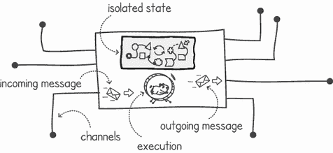
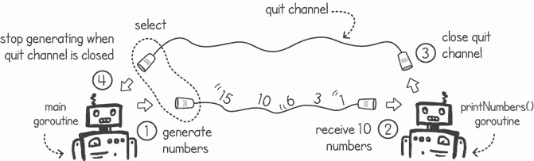
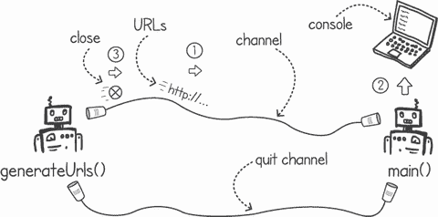
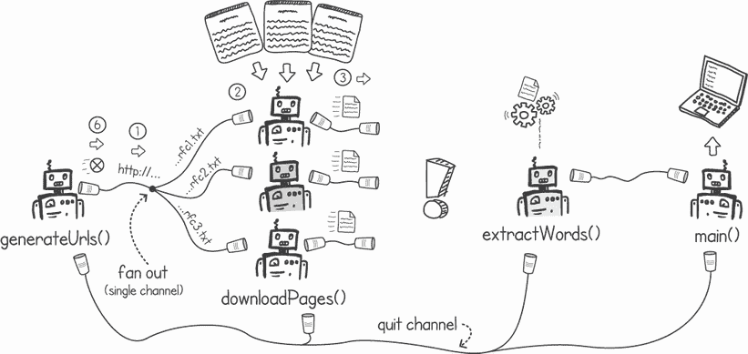
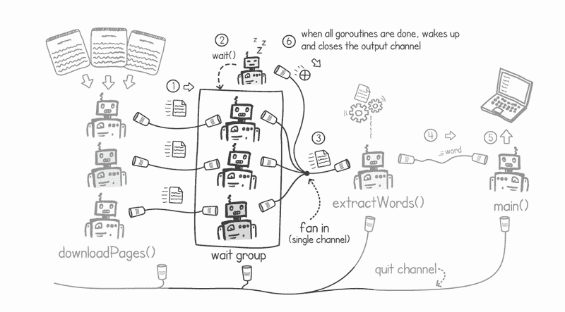
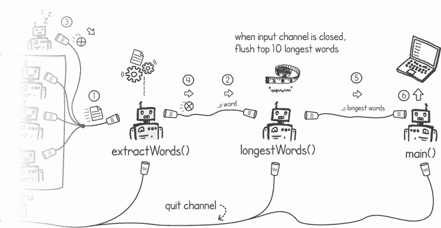
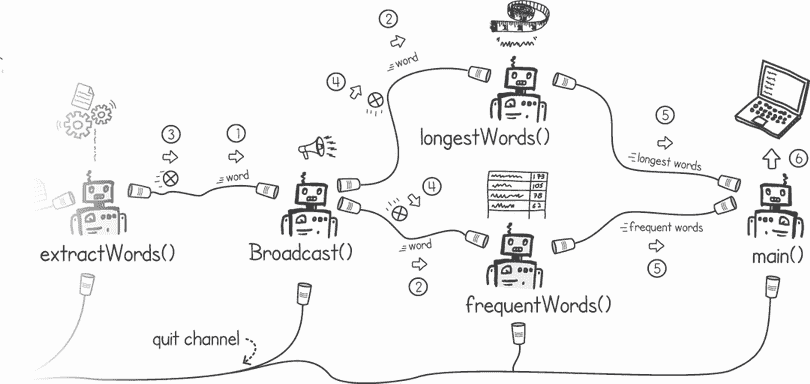
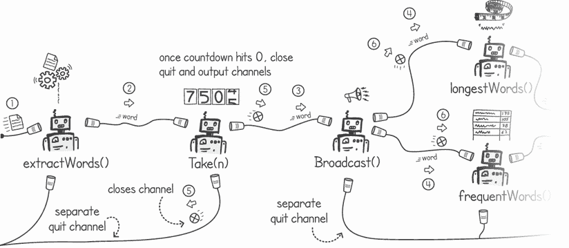
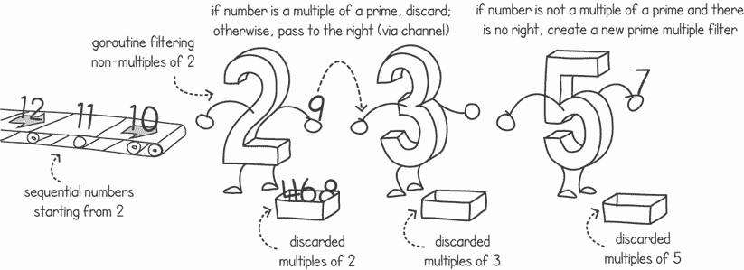
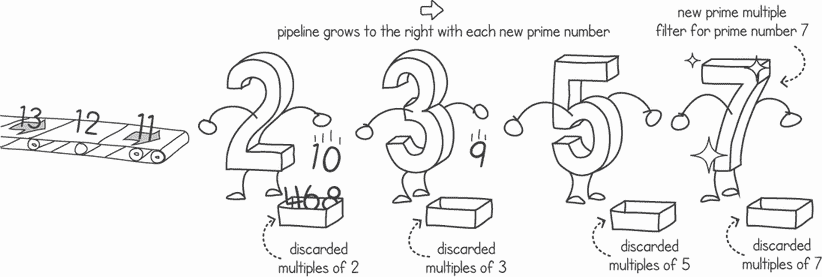

# 9 使用通道编程

本章涵盖

+   介绍通信顺序进程

+   重复使用常见的通道模式

+   利用通道作为一等对象的优势

使用通道需要与使用内存共享不同的编程方式。想法是有一组 goroutines，每个 goroutine 都有自己的内部状态，通过在 Go 的通道上传递消息与其他 goroutines 交换信息。这样，每个 goroutine 的状态就与来自其他执行的直接干扰隔离，从而降低了竞态条件的风险。

Go 的自身格言不是通过共享内存进行通信，而是通过通信来共享内存。由于内存共享更容易出现竞态条件并需要复杂的同步技术，因此我们应该尽可能避免它，而改用消息传递。

在本章中，我们将首先讨论通信顺序进程（CSP），然后转向查看在使用通道进行消息传递时使用的常见模式。我们将通过展示将通道视为一等对象的价值来结束本章，这意味着我们可以将通道作为函数参数传递，并将它们作为函数返回类型接收。

## 9.1 通信顺序进程

在前面的章节中，我们讨论了使用 goroutines、共享内存和互斥锁、条件变量、信号量等原语来建模并发性的模型。这是建模并发的经典方式。对这个模型的主要批评是，对于许多应用程序来说，它太低级了。

SRC 模型

使用共享内存与并发原语，如互斥锁，有时被称为*SRC 模型*。该名称来源于 Andrew D. Birrell 的一篇论文，标题为“使用线程进行编程的介绍”（系统研究中心，1989 年）。这篇论文是关于并发编程的流行介绍，使用共享内存的线程，并使用并发原语进行同步。

使用低级并发模型进行编程意味着，作为程序员，我们需要更努力地管理复杂性并减少软件中的错误。我们不知道操作系统何时会调度执行线程，这创造了一个非确定性的环境——指令在没有事先知道执行顺序的情况下交错。这种非确定性，加上内存共享，创造了竞态条件的可能性。为了避免这些，我们必须跟踪哪些执行正在同时访问内存，并且我们需要使用互斥锁或信号量等同步原语来限制这种访问。

使用这种低级工具进行并发编程，当与现代软件开发团队和不断增长的业务复杂性相结合时，会导致存在错误、复杂且维护成本高的代码。包含竞态条件的软件难以调试，因为竞态条件难以重现和测试。在某些行业和应用中，如健康和基础设施软件，代码可靠性至关重要（见图 9.1）。对于这些应用，由于其非确定性，很难证明以这种方式编写的并发代码是正确的。


图 9.1 对于关键应用来说，证明软件的正确性非常重要。

### 9.1.1 避免与不可变性冲突

一种大大降低竞态条件风险的方法是不允许我们的程序从多个并发执行中修改相同的内存。我们可以通过在共享内存时使用不可变概念来限制这一点。

不可变性的定义字面意思是 *不可改变*。在计算机编程中，我们在初始化结构时使用不可变性，不提供任何修改它们的方式。当编程需要更改这些结构时，我们创建一个新的结构副本，包含所需的更改，而保留旧副本不变。

如果我们的执行线程只共享包含永不更新的数据的内存，我们可以确信没有数据竞态条件。毕竟，大多数竞态条件发生是因为多个执行同时写入相同的内存位置。如果一个执行需要修改共享数据，例如一个变量，它可以创建一个包含所需更新的单独、局部副本，而保留旧副本不变。

当我们需要更新共享数据时创建副本，这会给我们留下一个问题：我们如何共享现在位于内存中不同位置的新、更新后的数据？我们需要一个模型来管理和共享这种新、修改后的数据。这就是消息传递和 CSP 发挥作用的地方。

### 9.1.2 使用 CSP 进行并发编程

C.A.R Hoare 在其 1978 年的文章“Communicating Sequential Processes”（[`www.cs.cmu.edu/~crary/819-f09/Hoare78.pdf`](https://www.cs.cmu.edu/~crary/819-f09/Hoare78.pdf)）中提出了一个不同层次、更高级的并发模型。CSP，即 *communicating sequential processes* 的缩写，是一种用于描述并发系统的形式化语言。它不是通过共享内存，而是基于通过通道的消息传递来实现。CSP 的思想和概念已被用于 Erlang、Occam、Go、Scala 的 Akka 框架、Clojure 的 core.async 以及许多其他编程语言和框架中的并发模型。

在 CSP（Communicating Sequential Processes）中，进程通过交换值的副本相互通信。通信是通过命名的不带缓冲的通道完成的。CSP 进程不应与操作系统进程（我们在第二章中讨论过的）混淆；相反，CSP 进程是一种顺序执行，它具有自己的独立状态，如图 9.2 所示。



图 9.2 一个顺序进程与其他进程通信

使用 CSP 模型时的关键区别在于执行不会共享内存。相反，它们相互传递数据的副本。就像使用不可变性一样，如果每个执行都没有修改共享数据，就没有干扰的风险，因此我们避免了大多数竞态条件。如果每个执行都有自己的独立状态，我们可以消除数据竞态条件，而无需使用涉及互斥锁、信号量或条件变量的复杂同步逻辑。

Go 通过 goroutines 和通道实现此模型。就像在 CSP 模型中一样，Go 的通道默认是同步且不带缓冲的。CSP 模型与 Go 实现之间的一个关键区别是，在 Go 中，通道是一等对象，这意味着我们可以在函数或甚至在其他通道中传递它们。这为我们提供了更多的编程灵活性。我们不是创建连接的顺序进程的静态拓扑，而是可以根据我们的逻辑需求在运行时创建和删除通道。

其他语言中的 CSP

许多其他语言实现了 CSP 模型的一些方面。例如，在 Erlang 中，进程通过发送消息相互通信。然而，在 Erlang 中，没有通道的概念，发送的消息也不是同步的。

在 Java 和 Scala 中，Akka 框架使用 Actor 模型。这是一个执行单元被称为*actors*的消息传递框架。Actors 有自己的独立内存空间，并相互传递消息。与 CSP 不同，没有通道的概念，消息传递也不是同步的。

## 9.2 使用通道重用常见模式

当我们在 Go 中使用通道进行消息传递时，有两个主要指南需要遵循：

+   *尽量只在通道上传递数据的副本*。这暗示了在大多数情况下，你不应该在通道上传递直接指针。传递指针可能导致多个 goroutines 共享内存，从而产生竞态条件。如果你必须传递指针引用，以不可变的方式使用数据结构——一次性创建它们，并且不要更新它们。或者，通过通道传递一个引用，然后从发送者那里不再使用它。

+   *尽可能不要混合消息传递* *模式与内存共享*。将内存共享与消息传递结合使用可能会在解决方案采用的方法上造成混淆。

让我们现在看看一些常见的并发模式、最佳实践和可重用组件的例子，以了解我们如何将一些 CSP 思想应用到我们的应用程序中。

### 9.2.1 关闭通道

我们将要检查的第一个模式是有一个公共通道，指示 goroutine 停止处理消息。在前一章中，我们看到了如何使用 Go 的 `close(channel)` 调用来通知 goroutine 没有更多的消息到来。然后 goroutine 可以终止其执行。但是，如果我们的 goroutine 从多个通道中消费数据，我们应该在收到第一个 `close()` 调用还是所有通道都关闭时终止执行？

一种解决方案是使用一个 `quit` 通道与 `select` 语句一起使用。图 9.3 展示了一个示例，其中 goroutine 生成数字，直到它被指示在另一个 `quit` 通道上停止。右侧的 goroutine 接收这 10 个数字，然后在 `quit` 通道上调用 `close(channel)`，指示数字生成停止。



图 9.3 使用 `quit` 通道停止 goroutine 的执行

让我们先实现一个 goroutine，它接收并打印数字。列表 9.1 展示了一个接受输入 `numbers` 通道和 `quit` 通道的函数。该函数简单地从 `numbers` 通道中取出 10 个项目，然后关闭 `quit` 通道。我们使用的 `quit` 通道的数据类型并不重要，因为除了关闭信号外，永远不会在该通道上发送数据。

列表 9.1 打印 10 个数字然后关闭 `quit` 通道

```
package main

import "*fmt*"

func printNumbers(numbers <-chan int, quit chan int) {
    go func() {
        for i := 0; i < 10; i++ {   ❶
            fmt.Println(<-numbers)  ❶
        }
        close(quit)                 ❷
    }()
}
```

❶ 从数字通道消费 10 个项目

❷ 关闭 `quit` 通道

接下来，让我们看看在通道上生成一个数字流，以便由我们之前的功能消费。在我们的数字流中，我们可以写入图 9.4 所示的三角数序列。


图 9.4 生成三角数序列

在列表 9.2 中，`main()` goroutine 创建了 `numbers` 和 `quit` 通道，并调用了 `printNumbers()` 函数。然后我们可以继续生成数字并将它们发送到 `numbers` 通道，直到 `select` 语句告诉我们 `quit` 通道已解除阻塞。一旦 `quit` 通道解除阻塞，我们可以终止 `main()` goroutine。

列表 9.2 生成数字直到 `quit` 通道关闭

```
func main() {
    numbers := make(chan int)                            ❶
    quit := make(chan int)                               ❶
    printNumbers(numbers, quit)                          ❷
    next := 0
    for i := 1; ; i++ {
        next += i                                        ❸
        select {
        case numbers <- next:                            ❹
        case <-quit:                                     ❺
            fmt.Println("*Quitting number generation*")    ❺
            return                                       ❺
        }
    }
}
```

❶ 创建数字和 `quit` 通道

❷ 调用 `printNumbers()` 函数，传递通道

❸ 生成下一个三角数

❹ 在数字通道上发送数字

❺ 当 `quit` 通道解除阻塞时，输出一条消息并终止执行

注意：我们在通道上传递数字的副本。我们没有共享任何内存，因为 goroutine 有它自己的独立内存空间。

在 goroutine 中使用的所有变量都没有被共享。例如，在列表 9.2 中，`next` 变量保持在 `main()` 函数的栈上本地。运行列表 9.1 和 9.2，我们得到以下结果：

```
$ go run closingchannel.go
1
3
6
10
15
21
28
36
45
55
Quitting number generation
```

### 9.2.2 使用通道和 goroutine 进行管道化

现在我们来看一下连接 goroutine 以形成一个执行管道的模式。我们可以通过一个处理网页文本内容的应用程序来演示这一点。在第三章和第四章中，我们使用了一个并发内存共享应用程序，从互联网下载文本文档并计算字符频率。在下一节中，我们将开发一个类似的应用程序，该应用程序使用通过通道的消息传递而不是内存共享。

我们应用程序的第一步是生成我们可以稍后下载的网页 URL。我们可以让一个 goroutine 生成几个 URL，并将它们发送到通道以供消费（见图 9.5）。一开始，我们可以在`main()` goroutine 中简单地从控制台打印出 URL。一旦我们完成，生成 URL 的 goroutine 将关闭输出通道以通知`main()` goroutine 没有更多的网页需要处理。



图 9.5 生成 URL 并打印它们

列表 9.3 展示了`generateUrls()`函数的实现，该函数创建一个 goroutine，在输出通道上生成 URL 字符串。该函数返回输出通道。该函数还接受一个退出通道，它监听该通道以防止需要提前停止生成 URL。我们将采用一个常见的模式，将输入通道作为函数参数传递，并返回输出通道（`generateUrls()`函数没有输入通道）。这使我们能够轻松地将这些 goroutine 以管道的形式连接起来。在我们的实现中，就像在第三章中一样，我们使用从[`rfc-editor.org`](https://rfc-editor.org)获得的文档。这为我们提供了具有可预测 Web 地址的静态在线文本文档。

列表 9.3 从 goroutine 生成 URL

```
package main

import "*fmt*"

func generateUrls(quit <-chan int) <-chan string {   ❶
    urls := make(chan string)                        ❷
    go func() {
        defer close(urls)                            ❸
        for i := 100; i <= 130; i++ {
            url := fmt.Sprintf("*https://rfc-editor.org/rfc/rfc%d.txt*", i)
            select {
            case urls <- url:                        ❹
            case <-quit:
                return
            }
        }
    }()
    return urls                                      ❺
}
```

❶ 接受退出通道并返回输出通道

❷ 创建输出通道

❸ 完成后，关闭输出通道

❹ 将 50 个 URL 写入输出通道

❺ 返回输出通道

接下来，让我们通过编写`main()`函数来完成我们的简单应用程序，该函数如列表 9.4 所示。在`main()`函数中，我们创建`quit`通道，然后调用`generateUrls()`，该函数返回 goroutine 的输出通道（在这个例子中称为`results`）。然后我们监听输出和`quit`通道。我们继续从输出通道向控制台写入消息，直到`quit`通道关闭，此时我们通过在`main()`函数中返回来终止应用程序。

列表 9.4 打印输出的`main()`函数

```
func main() {
    quit := make(chan int)            ❶
    defer close(quit)
    results := generateUrls(quit)     ❷
    for result := range results {     ❸
        fmt.Println(result)           ❹
    }
}
```

❶ 创建退出通道

❷ 调用函数以启动返回 URL 的 goroutine，这些 URL 在结果通道上

❸ 读取结果通道上的所有消息

❹ 打印结果

将列表 8.7 和 8.8 一起运行，我们得到以下输出：

```
$ go run generateurls.go
https://rfc-editor.org/rfc/rfc100.txt
https://rfc-editor.org/rfc/rfc101.txt
https://rfc-editor.org/rfc/rfc102.txt
https://rfc-editor.org/rfc/rfc103.txt
https://rfc-editor.org/rfc/rfc104.txt
. . .
```

接下来，让我们编写下载这些页面内容的逻辑。为此任务，我们只需要一个接受 URL 流并输出文本内容的另一个输出流的 goroutine。这个 goroutine 可以连接到`generateUrls()`goroutine 的输出和`main()`goroutine 的输入，如图 9.6 所示。


图 9.6 向我们的管道添加下载网页的 goroutine

列表 9.5 展示了`downloadPages()`函数的实现。它接受`quit`和`urls`通道，并返回一个包含下载页面的输出通道。该函数创建一个 goroutine，使用`select`语句下载每个页面，直到`urls`通道或`quit`通道关闭。goroutine 通过读取读取下一个消息时返回的`moreData`布尔标志来检查输入通道是否仍然打开。当它返回`false`，意味着通道已被关闭时，我们停止在`select`语句上迭代。

列表 9.5 下载页面的 Goroutine（省略了导入以节省篇幅）

```
func downloadPages(quit <-chan int, urls <-chan string) <-chan string {
    pages := make(chan string)                                   ❶
    go func() {
        defer close(pages)                                       ❷
        moreData, url := true, ""
        for moreData {                                           ❸
            select {
            case url, moreData = <-urls:                         ❹
                if moreData {                                    ❺
                    resp, _ := http.Get(url)                     ❺
                    if resp.StatusCode != 200 {                  ❺
                        panic("*Server’s error:* " + resp.Status)  ❺
                    }                                            ❺
                    body, _ := io.ReadAll(resp.Body)             ❺
                    pages <- string(body)                        ❺
                    resp.Body.Close()                            ❺
                }
            case <-quit:                                         ❻
                return
            }
        }
    }()
    return pages                                                 ❼
}
```

❶ 创建输出通道，该通道将包含下载的网页

❷ 完成后关闭输出通道

❸ 如果输入通道上有更多数据，则继续选择

❹ 使用新消息和标志更新变量以显示是否有更多数据

❺ 当收到新的 URL 消息时，下载页面并将页面上的文本发送到页面通道

❻ 当退出通道上收到消息时，终止 goroutine

❼ 返回输出通道

警告 在列表 9.5 中，我们在通道上传递了网页文档的副本。我们可以这样做，因为网页的大小只有几 KB。以这种方式使用消息传递来处理大型对象，如图片或视频，可能会对性能产生不利影响。使用内存共享架构可能更适合需要高性能且共享大量数据的应用程序。

由于它接受与`generateUrls()`函数输出相同的通道数据类型，我们可以轻松地将这个新的 goroutine 连接到我们的管道中。它还返回与我们的`main()`goroutine 可以使用的相同输出通道数据类型。在下面的列表中，我们将`main()`函数修改为也调用`downloadPages()`函数。

列表 9.6 修改后的`main()`函数以调用`downloadPages()`

```
func main() {
    quit := make(chan int)
    defer close(quit)
    results := downloadPages(quit, generateUrls(quit))   ❶
    for result := range results {
        fmt.Println(result)
    }
}
```

❶ 将新的下载页面 goroutine 添加到我们现有的管道中

当我们运行前面的`main()`函数时，我们从网页中获取文本，并将它们打印在控制台上。打印我们的文本页面并不很有用，因此我们可以向我们的管道添加另一个 goroutine 来从下载的文本中提取单词。

通过接受输入通道作为函数输入参数并返回输出通道的模式，构建管道变得容易。我们只需要创建一个新的 goroutine 来提取单词，然后将其连接到我们的管道中，如图 9.7 所示。


图 9.7 向页面添加 goroutine 以提取单词

列表 9.7 显示了`extractWords()`函数的实现。与`downloadPages()`相同的模式被使用。该函数接受包含文本的输入通道，并返回包含在接收到的文本中找到的所有单词的输出通道。它通过使用正则表达式（regex）从文档中提取单词。

就像在列表 9.6 中一样，我们继续从输入通道中读取，直到从输入或`quit`通道接收到关闭信号。我们通过使用`select`语句和读取输入通道上的`moreData`标志来实现这一点。

列表 9.7 从文本页面中提取单词（为了简洁，省略了导入）

```
func extractWords(quit <-chan int, pages <-chan string) <-chan string {
    words := make(chan string)                               ❶
    go func() {
        defer close(words)
        wordRegex := regexp.MustCompile(*`[a-zA-Z]+`*)         ❷
        moreData, pg := true, ""
        for moreData {
            select {
            case pg, moreData = <-pages:                     ❸
                if moreData {
                    for _, word := range wordRegex.FindAllString(pg, -1) {
                        words <- strings.ToLower(word)       ❹
                    }
                }
            case <-quit:                                     ❺
                return
            }
        }
    }()
    return words                                             ❻
}
```

❶ 创建输出通道，其中将包含提取的单词

❷ 创建正则表达式以提取单词

❸ 使用新的消息和标志更新变量以显示是否有更多数据

❹ 当接收到新的文本页面时，使用正则表达式提取所有单词并发送到输出通道

❺ 当 quit 通道上到达消息时，终止 goroutine

❻ 返回输出通道

再次，我们可以修改我们的`main()`函数，将这个新的 goroutine 包含到我们的管道中，如列表 9.8 所示。管道中的每个函数都是一个 goroutine，它接受`quit`通道和一个输入通道，并返回一个输出通道，结果将发送到该通道。使用`quit`通道将允许我们控制管道不同部分的流程。

列表 9.8 将`extractWords()`添加到管道中

```
func main() {
    quit := make(chan int)
    defer close(quit)
    results := extractWords(quit, downloadPages(quit, generateUrls(quit)))
    for result := range results {
        fmt.Println(result)
    }
}
```

在我们的管道中使用新的`extractWords()`运行前面的列表，我们得到包含在文本中的单词列表：

```
$ go run extractwords.go
network
working
group
p
karp
request
for
comments
. . .
```

注意：这种管道模式使我们能够轻松地将执行连接起来。每个执行都由一个函数表示，该函数启动一个接受输入通道作为参数并返回输出通道作为返回值的 goroutine。

当运行列表 9.8 时，网页是顺序下载的，一个接一个，使得执行速度相当慢。理想情况下，我们希望加快这个速度并实现并发下载。这正是下一个模式（扇入和扇出）发挥作用的地方。

### 9.2.3 扇入和扇出

在我们的示例应用程序中，如果我们想加快速度，可以通过负载均衡 URL 到多个 goroutine 来实现并发下载。我们可以创建一定数量的 goroutine，每个 goroutine 从相同的 URL 输入通道中读取。每个 goroutine 将从`generateUrls()`goroutine 接收一个单独的 URL，并且它们可以并发地执行下载。然后，下载的文本页面可以写入每个 goroutine 自己的输出通道。

定义 在 Go 中，*扇出*并发模式是指多个 goroutine 从同一个通道读取。通过这种方式，我们可以在一组 goroutine 之间分配工作。

图 9.8 展示了我们如何将 URL 扇出到多个`downloadPage()` goroutine，每个 goroutine 执行不同的下载。在这个例子中，并发 goroutine 正在通过`generateUrls()` goroutine 发送的 URL 进行负载均衡；当一个`downloadPage()` goroutine 空闲时，它将从共享输入通道读取下一个 URL。这类似于在你当地的咖啡馆中，多个咖啡师从同一个队列服务客户。



图 9.8 使用扇出模式进行负载均衡请求，但与`extractWords()`的连接缺失

注意 由于并发处理是非确定性的，一些消息的处理速度会比其他消息快，导致消息以不可预测的顺序处理。只有当我们不关心传入消息的顺序时，扇出模式才有意义。

在我们的代码中，我们可以通过创建一组`downloadPages()` goroutine 并将相同的通道作为输入通道参数来实现这个简单的扇出模式。如下所示。

列表 9.9 扇出到多个`downloadPages()` goroutine

```
const downloaders = 20

func main() {
    quit := make(chan int)
    defer close(quit)
    urls := generateUrls(quit)
    pages := make([]<-chan string, downloaders)   ❶
    for i := 0; i < downloaders; i++ {            ❷
        pages[i] = downloadPages(quit, urls)      ❷
    }                                             ❷
    . . .
```

❶ 创建一个切片以存储从下载 goroutines 输出的通道

❷ 创建 20 个 goroutine 下载网页并存储输出通道

我们应用程序中的扇出模式创建了一个问题：我们的下载 goroutine 的输出在单独的通道中。我们如何将它们连接到下一阶段的单个输入通道：`extractWords()` goroutine？

一个解决方案是更改`downloadPages()` goroutine，并让它们都输出到同一个通道。为此，我们必须将相同的输出通道传递给每个下载器。这将破坏我们易于插入单元的模式，其中每个单元接受输入通道作为参数，并返回输出通道作为返回值。

为了保持这种模式，我们需要一个机制将不同通道的输出消息合并到单个输出通道中。然后我们可以将单个输出通道连接到`extractWords()` goroutine。这就是所谓的*扇入*模式。

定义 在 Go 中，当我们将多个通道的内容合并到一个通道时，发生*扇入*并发模式。

由于 goroutine 非常轻量级，我们可以通过创建一组 goroutine（每个输出通道一个）并将每个 goroutine 连接到一个公共通道来实现这种扇入模式，如图 9.9 所示。每个 goroutine 监听输出通道的消息，当消息到达时，它只需将其转发到公共通道。



图 9.9 通过使用扇入合并通道

当多个 goroutines 都向单个公共通道提供数据时，会引发问题。当我们有一个一对一的输入到输出通道的 goroutine 时，通道关闭策略很简单：在输入通道关闭后关闭输出通道。当我们有一个多对一的扇入场景时，我们必须决定何时关闭公共通道。如果我们继续在 goroutine 注意到它消费的通道已被关闭时关闭通道的方法，我们可能会过早地关闭通道。另一个 goroutine 可能仍在输出消息。

解决方案是仅在**所有**goroutines 都注意到它们消费的通道已被关闭时才关闭公共通道。如图 9.9 所示，我们可以使用一个 waitgroup 来实现这一点。扇入组中的每个 goroutine 在发送其最后一条消息后将其标记为完成。我们有一个单独的 goroutine，它会在这个 waitgroup 上调用`wait()`，这将导致其执行暂停，直到所有扇入 goroutine 都完成。一旦这个 goroutine 恢复，它将关闭输出通道。这种技术在下述列表中展示。

列表 9.10 实现扇入函数

```
package listing9_10

import (
    "*sync*"
)

func FanInK any chan K {
    wg := sync.WaitGroup{}              ❶
    wg.Add(len(allChannels))            ❶
    output := make(chan K)              ❷
    for _, c := range allChannels {
        go func(channel <-chan K) {     ❸
            defer wg.Done()             ❹
            for i := range channel {
                select {
                case output <- i:       ❺
                case <-quit:            ❻
                    return              ❻
                }
            }
        }(c)                            ❼
    }
    go func() {                         ❽
        wg.Wait()                       ❽
        close(output)                   ❽
    }()
    return output                       ❾
}
```

❶ 创建一个 waitgroup，设置大小等于输入通道的数量

❷ 创建输出通道

❸ 为每个输入通道启动一个 goroutine

❹ 一旦 goroutine 终止，将 waitgroup 标记为完成

❺ 将接收到的每条消息转发到共享输出通道

❻ 如果退出通道被关闭，终止 goroutine

❼ 将一个输入通道传递给 goroutine

❽ 等待所有 goroutine 完成，然后关闭输出通道

❾ 返回输出通道

我们现在可以将我们的扇入模式连接到我们的应用程序，并将其包含在管道中。列表 9.11 修改了我们的`main()`函数，以包含列表 9.10 中的`fanIn()`函数。`fanIn()`函数接受包含网页的通道列表，并返回一个公共聚合通道，然后我们将其输入到我们的`extractWords()`函数中。

列表 9.11 向管道添加`fanIn()`函数

```
const downloaders = 20

func main() {
    quit := make(chan int)
    defer close(quit)
    urls := generateUrls(quit)
    pages := make([]<-chan string, downloaders)
    for i := 0; i < downloaders; i++ {
        pages[i] = downloadPages(quit, urls)
    }
    results := extractWords(quit, listing9_10.FanIn(quit, pages...))   ❶
    for result := range results {
        fmt.Println(result)
    }
}
```

❶ 使用扇入模式将所有页面通道合并为一个通道

当我们运行新的实现时，它运行得更快，因为下载是并发执行的。作为一起执行下载的副作用，每次运行程序时提取单词的顺序都不同。

### 9.2.4 关闭时刷新结果

除了提取单词之外，我们的 URL 下载应用程序并没有真正做任何有趣的事情。如果我们用下载的网页做些有用的事情会怎样？比如尝试找出这些文本文档中的 10 个最长单词？

如果我们继续遵循我们的管道构建模式，这个任务就很简单了。我们只需要添加一个新的 goroutine，它接受一个输入通道并返回一个输出通道。在图 9.10 中，这个新 goroutine，称为 `longestWords()`，被插入到我们的 `extractWords()` goroutine 之后。



图 9.10 向我们的文本添加 `longestWords()` goroutine 以找到 10 个最长单词

这个新的 `longestWords()` goroutine 与我们在管道中开发的其它 goroutine 略有不同。它在内存中累积一组唯一单词。一旦它从网页中读取了所有单词并收到关闭消息，它将审查这个集合并输出最长的 10 个单词。然后，我们的 `main()` goroutine 将在控制台上打印出来。

`longestWords()` 函数的实现展示在列表 9.12 中。在这个函数中，我们使用一个映射来存储唯一单词的集合。由于这个映射与我们的并发执行是隔离的，并且只有我们的 `longestWords()` goroutine 访问它，所以我们不需要担心数据竞争条件。我们还将单词存储在单独的切片中，以便于后续排序。

列表 9.12 输出最长单词的 goroutine（为了简洁省略了导入）

```
func longestWords(quit <-chan int, words <-chan string) <-chan string {
    longWords := make(chan string)
    go func() {
        defer close(longWords)
        uniqueWordsMap := make(map[string]bool)                 ❶
        uniqueWords := make([]string, 0)                        ❷
        moreData, word := true, ""
        for moreData {
            select {
            case word, moreData = <-words:
                if moreData && !uniqueWordsMap[word] {          ❸
                    uniqueWordsMap[word] = true                 ❸
                    uniqueWords = append(uniqueWords, word)     ❸
                }
            case <-quit:
                return
            }
        }
        sort.Slice(uniqueWords, func(a, b int) bool {           ❹
            return len(uniqueWords[a]) > len(uniqueWords[b])    ❹
        })
        longWords <- strings.Join(uniqueWords[:10], "*,* ")       ❺
    }()
    return longWords
}
```

❶ 创建一个映射来存储唯一单词

❷ 创建切片来存储唯一单词列表，以便于后续排序

❸ 如果通道没有关闭且单词是新的，将新单词添加到映射和列表中

❹ 一旦输入通道关闭，就按单词长度对唯一单词列表进行排序

❺ 一旦输入通道关闭，就在输出通道上发送包含 10 个最长单词的字符串

在列表 9.12 中，goroutine 将所有唯一单词存储在映射和列表中。一旦输入通道关闭，意味着没有更多消息，goroutine 将按长度对唯一单词列表进行排序。然后，在输出通道上，它发送列表上的前 10 项，即最长的 10 个单词。这样，我们在收集所有数据后刷新结果。

现在，我们可以在 `main()` 函数中将这个新组件连接到我们的管道中。在下面的列表中，`longestWords()` goroutine 从 `extractWords()` 的输出通道中消费数据。

列表 9.13 向我们的管道添加 `longestWords()`

```
func main() {
    quit := make(chan int)
    defer close(quit)
    urls := generateUrls(quit)
    pages := make([]<-chan string, downloaders)
    for i := 0; i < downloaders; i++ {
        pages[i] = downloadPages(quit, urls)
    }
    results := longestWords(quit,                                 ❶
        extractWords(quit, listing8_14.FanIn(quit, pages...)))    ❶
    fmt.Println("*Longest Words:*", <-results)                      ❷
}
```

❶ 在 extractWords() goroutine 之后将 longestWords() goroutine 连接到管道

❷ 打印包含最长单词的单条消息

当我们运行这些列表时，管道将在下载的文档中找到最长的单词，并在控制台上输出。以下是输出：

```
$ go run longestwords.go
Longest Words: interrelationships, misunderstandings, telecommunication, administratively, implementability, characteristics, insufficiencies, implementations, synchronization, representatives
```

### 9.2.5 向多个 goroutine 广播

如果我们想从下载的网页中获取更多统计数据呢？对于这种情况，假设除了找到最长的单词外，我们还想找出出现频率最高的单词。

对于这种场景，我们将`extractWords()`的输出传递给两个 goroutine：现有的`longestWords()`和一个额外的名为`frequentWords()`的 goroutine。新函数的模式将与`longestWords()`相同。它将存储每个唯一单词的频率，当输入通道关闭时，它将输出出现频率最高的前 10 个单词。

在上一节中，当我们需要将一个计算的输出传递给多个并发 goroutine 时，我们使用了扇出模式。我们平衡了消息负载，每个 goroutine 接收输出数据的不同子集。这种模式在这里不适用，因为我们希望将每个输出消息的副本发送给`longestWords()`和`frequentWords()` goroutine。

而不是扇出模式，我们可以使用广播模式——一种将消息复制到一组输出通道的模式。图 9.11 显示了我们可以如何使用一个单独的 goroutine 来广播到多个通道。在我们的管道中，我们可以将广播的输出连接到`frequentWords()`和`longestWords()` goroutine 的输入。



图 9.11 将并发`frequentWords()` goroutine 连接到我们的管道

为了实现这个广播工具，我们只需要创建一个输出通道列表，然后使用一个 goroutine 将每个接收到的消息写入每个通道。在列表 9.14 中，广播函数接受输入通道和一个整数`n`，指定所需的输出数量。然后函数返回这些`n`个输出通道的切片。在这个实现中，我们使用了泛型，以便广播可以使用任何通道数据类型。

列表 9.14 向多个输出通道广播

```
package listing9_14

func BroadcastK any []chan K {
    outputs := CreateAllK                           ❶
    go func() {
        defer CloseAll(outputs...)                       ❷
        var msg K
        moreData := true
        for moreData{
            select {
            case msg, moreData = <-input:                ❸
                if moreData {                            ❹
                    for _, output := range outputs {     ❹
                        output <- msg                    ❹
                    }
                }
            case <-quit:
                return
            }
        }
    }()
    return outputs                                       ❺
}
```

❶ 创建 n 个类型为 K 的输出通道（请参阅下一列表以获取实现方法）

❷ 完成后，关闭所有输出通道（请参阅下一列表以获取实现方法）

❸ 从输入通道读取下一个消息

❹ 如果输入通道尚未关闭，则将消息写入每个输出通道

❺ 返回输出通道集合

注意：在列表 9.14 中的广播实现中，我们只在当前消息被发送到所有通道之后才读取下一个消息。从这个广播实现中来的慢消费者会减慢所有消费者的速度。

上一列表使用了两个函数，`CreateAll()`和`CloseAll()`，分别用于创建和关闭一组通道。以下列表显示了它们的实现。

列表 9.15 `CreateAll()`和`CloseAll()`函数

```
func CreateAllK any []chan K {       ❶
    channels := make([]chan K, n)
    for i, _ := range channels {
        channels[i] = make(chan K)
    }
    return channels
}

func CloseAllK any {    ❷
    for _, output := range channels {
        close(output)
    }
}
```

❶ 创建 n 个类型为 K 的通道

❷ 关闭所有通道

我们现在可以编写我们的`frequentWords()`函数，该函数将识别下载页面中频率最高的前 10 个单词。以下列表中的实现与`longestWords()`函数类似。这次，我们使用一个名为`mostFrequentWords`的映射来计数每个单词的出现次数。在输入通道关闭后，我们根据映射中的出现次数对单词列表进行排序。

列表 9.16 寻找最频繁的单词（省略了导入以节省空间）

```
func frequentWords(quit <-chan int, words <-chan string) <-chan string {
    mostFrequentWords := make(chan string)
    go func() {
        defer close(mostFrequentWords)
        freqMap := make(map[string]int)                           ❶
        freqList := make([]string, 0)                             ❷
        moreData, word := true, ""
        for moreData {
            select {
            case word, moreData = <-words:                        ❸
                if moreData {
                    if freqMap[word] == 0 {                       ❹
                        freqList = append(freqList, word)         ❹
                    }
                    freqMap[word] += 1                            ❺
                }
            case <-quit:
                return
            }
        }
        sort.Slice(freqList, func(a, b int) bool {                ❻
            return freqMap[freqList[a]] > freqMap[freqList[b]]    ❻
        })
        mostFrequentWords <- strings.Join(freqList[:10], "*,* ")    ❼
    }()
    return mostFrequentWords
}
```

❶ 创建一个映射来存储每个唯一单词的频率出现次数

❷ 创建一个切片来存储唯一单词列表

❸ 消费输入通道上的下一个消息

❹ 如果消息包含一个新单词，则将其添加到唯一单词的切片中

❺ 增加单词的计数

❻ 一旦消耗完所有输入消息，就按出现次数对单词列表进行排序

❼ 将 10 个最频繁的单词写入输出通道

现在我们可以使用我们之前开发的广播实用程序将`frequentWords()`单元连接起来。在以下列表中，我们调用`Broadcast()`函数创建两个输出通道，并使其从`extractWords()`中消费。然后我们使用广播的两个输出通道作为`longestWords()`和`frequentWords()` goroutine 的输入。

列表 9.17 将广播模式连接到查找最频繁和最长的单词

```
const downloaders = 20

func main() {
    quit := make(chan int)
    defer close(quit)
    urls := generateUrls(quit)
    pages := make([]<-chan string, downloaders)
    for i := 0; i < downloaders; i++ {
        pages[i] = downloadPages(quit, urls)
    }
    words := extractWords(quit, listing9_10.FanIn(quit, pages...))
    wordsMulti := listing9_14.Broadcast(quit, words, 2)               ❶
    longestResults := longestWords(quit, wordsMulti[0])               ❷
    frequentResults := frequentWords(quit, wordsMulti[1])             ❸
    fmt.Println("*Longest Words:*", <-longestResults)                   ❹
    fmt.Println("*Most frequent Words:*", <-frequentResults)            ❺
}
```

❶ 创建一个 goroutine，该 goroutine 将向两个输出通道广播单词通道的内容

❷ 创建 goroutine 以从输入通道中查找最长的单词

❸ 创建 goroutine 以从输入通道中查找最常用的单词

❹ 从`longestWords()` goroutine 读取结果并打印

❺ 从`mostFrequentWords()` goroutine 读取结果并打印

由于`longestWords()`和`frequentWords()` goroutine 只输出包含结果的一个消息，因此我们的`main()`函数只需从每个 goroutine 中消费一个消息，并在控制台上打印它。以下片段包含运行完整管道时的输出。不出所料，*the*是最频繁的单词：

```
$ go run wordstats.go
Longest Words: interrelationships, telecommunication, misunderstandings, implementability, administratively, transformations, reconfiguration, representatives, experimentation, interpretations
Most frequent Words: the, to, a, of, is, and, in, be, for, rfc
```

### 9.2.6 在满足条件后关闭通道

到目前为止，我们还没有真正使用我们在应用程序中的每个 goroutine 中连接的退出通道。这些退出通道可以在某些条件下停止管道的部分。

在我们的应用程序中，我们正在读取固定数量的网页并处理它们，但如果我们只想处理下载的前 10,000 个单词怎么办？解决方案是在我们的管道消耗了指定数量的消息后停止其一部分的执行。如果我们在这个新的 goroutine（称为 `Take(n)`）之后插入这个新的 goroutine，我们就可以指示它在接收指定数量的消息后关闭 `quit` 通道（见图 9.12）。`Take(n)` goroutine 将通过在 `quit` 通道上调用 `close()` 来仅终止管道的一部分。我们可以通过将管道的左侧（在 `take(n)` goroutine 之前）与一个单独的 `quit` 通道连接来实现这一点。



图 9.12 将 `Take(n)` goroutine 添加到我们的管道中

要实现 `Take(n)`，我们需要一个 goroutine，它简单地转发从输入接收到的消息到输出通道，同时进行倒计时，每次转发的消息都会使倒计时减少 `1`。一旦倒计时达到 `0`，goroutine 将关闭 `quit` 和输出通道。列表 9.18 展示了 `Take(n)` 的一个实现，其中倒计时由变量 `n` 表示。只要还有更多数据，倒计时大于 `0`，并且 `quit` 通道未被关闭，goroutine 就会继续转发消息。它只有在倒计时达到 `0` 时才会关闭 `quit` 通道。

列表 9.18 实现 `Take(n)` 函数

```
package listing9_18

func TakeK any <-chan K {
    output := make(chan K)
    go func() {
        defer close(output)
        moreData := true
        var msg K
        for n > 0 && moreData {            ❶
            select {
            case msg, moreData = <-input:  ❷
                if moreData {
                    output <- msg          ❸
                    n--                    ❹
                }
            case <-quit:
                return
            }
        }
        if n == 0 {                        ❺
            close(quit)                    ❺
        }
    }()
    return output
}
```

❶ 只要还有更多数据且倒计时 n 大于 0，就继续转发消息

❷ 从输入读取下一个消息

❸ 将消息转发到输出

❹ 将倒计时变量 n 减少到 1

❺ 如果倒计时达到 0，则关闭 quit 通道

我们现在可以将这个新组件添加到我们的管道中，并在达到特定的单词计数时停止处理。以下列表显示了如何修改我们的 `main()` 函数以包括配置为在达到 10,000 个单词计数时停止处理的 `Take(n)` goroutine。

列表 9.19 将 `Take(n)` 连接到我们的管道

```
const downloaders = 20

func main() {
    quitWords := make(chan int)                               ❶
    quit := make(chan int)
    defer close(quit)
    urls := generateUrls(quitWords)
    pages := make([]<-chan string, downloaders)
    for i := 0; i < downloaders; i++ {
        pages[i] = downloadPages(quitWords, urls)
    }
    words := listing9_18.Take(quitWords, 10000,               ❷
        extractWords(quitWords, listing9_10.FanIn(quitWords, pages...)))
    wordsMulti := listing9_14.Broadcast(quit, words, 2)       ❸
    longestResults := longestWords(quit, wordsMulti[0])       ❸
    frequentResults := frequentWords(quit, wordsMulti[1])     ❸

    fmt.Println("*Longest Words:*", <-longestResults)
    fmt.Println("*Most frequent Words:*", <-frequentResults)
}
```

❶ 在 `Take(n)` 函数之前创建一个单独的 quit 通道

❷ 创建一个带有 10,000 个倒计时的 `Take(n)` goroutine，从 `extractWords()` 输出中获取数据

❸ 为管道的其余部分使用单独的 quit 通道

运行列表 9.19 结果只处理下载的前 10,000 个单词。由于下载是并行进行的，下载的页面顺序无法预测，并且每次运行应用程序时可能都不同。因此，遇到的第一个 10,000 个单词将根据首先下载的页面而变化。以下是此类运行的一个输出示例：

```
$ go run wordstatsearlyquit.go
Longest Words: implementations, characteristics, recommendations, considerations, implementation, effiectiveness, simultaneously, specifications, irrecoverable, informational
Most frequent Words: the, to, of, is, a, and, be, for, in, not
```

### 9.2.7 采用通道作为一等对象

在他的 CSP 语言论文中，C.A.R. Hoare 使用了一个例子，即使用通信顺序进程列表生成 1 万以内的素数。该算法基于埃拉托斯特尼筛法，这是一种检查一个数是否为素数的简单方法。CSP 论文中的方法使用了一个静态线性管道，其中管道中的每个进程都会过滤掉一个素数的倍数，并将其传递给下一个进程。因为管道是静态的（它不会随着问题规模的增长而增长），它只能生成到固定数量的素数。

Go 语言相较于原始论文中定义的 CSP 语言可用的改进是，通道是一等对象。这意味着通道可以被存储为变量并传递给其他函数。在 Go 中，一个通道也可以传递给另一个通道。这允许我们通过使用动态线性管道来改进原始解决方案，这种管道随着问题规模的增长而增长，并且允许我们生成多达`n`个素数，而不是生成到固定数量的素数。

素数管道算法的起源

虽然使用管道生成素数的解决方案在 CSP 论文中提到了，但原始的想法被归功于数学家和程序员 Douglas McIlroy。

图 9.13 展示了我们如何使用并发管道生成素数。一个数`c`是素数，如果`c`不是小于`c`的所有素数的倍数。例如，要检查 7 是否为素数，我们需要确保 7 不能被 2、3 或 5 整除。由于 7 不能被这些数中的任何一个整除，所以 7 是一个素数。然而，数字 9 可以被 3 整除，所以 9 不是一个素数。



图 9.13 通过管道检查一个数是否为素数

检查一个数是否为素数

要检查数字`c`是否为素数，我们只需要检查`c`不能被小于`c`的平方根的所有素数整除。然而，在本节中，我们简化了要求以保持列表更简单、更短。

对于我们的素数检查管道，我们可以让一个 goroutine 从 2 开始生成候选的连续数字。这个 goroutine 的输出将输入到一个由 goroutine 链组成的管道中，每个 goroutine 都会过滤掉一个素数的倍数。这个链中的 goroutine 被分配一个素数`p`，它将丢弃所有是`p`的倍数的数字。如果一个数字没有被丢弃，它将被传递到链的右侧。如果它一路存活到链的末端，这意味着我们找到了一个新的素数，并且会创建一个新的 goroutine，其`p`等于新的素数。这个过程在图 9.14 中展示。



图 9.14 当找到一个新素数时，我们启动一个新的 goroutine 来过滤该新素数的倍数。

在我们的管道中，当一个数字通过所有现有的 goroutine 并且没有被丢弃时，这意味着我们找到了一个新的素数。管道中的最后一个 goroutine 将在管道尾部初始化一个新的 goroutine 并将其连接。这个新的 goroutine 将成为管道的新尾部，并且它将过滤掉新找到的素数的倍数。这样，管道会随着素数的数量动态增长。

让这个管道随着素数的数量动态增长显示了将 channel 视为一等对象的优势，与 C.A.R. Hoare 在 CSP 论文中的原始 channel 相比。Go 给了我们像普通变量一样处理 channel 的能力。

列表 9.20 实现了这个素数过滤 goroutine。创建时，goroutine 在其 channel 上接收第一个消息，其中包含将要用于倍数过滤的素数`p`。然后它在其输入 channel 上监听新的数字，并检查接收到的任何数字是否是`p`的倍数。如果是，goroutine 简单地丢弃它；否则，它将数字传递到其右边的 channel。如果 goroutine 恰好是管道的尾部，它将创建一个新的右边的 channel 并将 channel 传递给一个新创建的 goroutine。

列表 9.20 `primeMultipleFilter()` goroutine

```
package main

import "*fmt*"

func primeMultipleFilter(numbers <-chan int, quit chan<- int) {
    var right chan int
    p := <-numbers                                     ❶
    fmt.Println(p)                                     ❶
    for n := range numbers {                           ❷
        if n%p != 0 {                                  ❸
            if right == nil {                          ❹
                right = make(chan int)                 ❹
                go primeMultipleFilter(right, quit)    ❹
            }
            right <- n                                 ❺
        }
    }
    if right == nil {
        close(quit)                                    ❻
    } else {
        close(right)                                   ❼
    }
}
```

❶ 在输入 channel 上接收包含素数 p 的第一个消息并打印它

❷ 从输入 channel 读取下一个数字

❸ 丢弃任何接收到的 p 的倍数

❹ 如果当前 goroutine 没有权限，它将启动一个新的 goroutine 并通过一个 channel 连接到它。

❺ 将过滤后的数字传递到右边的 channel

❻ 如果没有更多的数字要过滤并且 goroutine 没有右边的 channel，关闭退出 channel

❼ 否则，关闭右边的 channel

现在我们只需要将我们的素数倍数过滤器连接到一个连续数字生成器。我们可以使用`main()` goroutine 来完成这个任务。在列表 9.21 中，我们的`main()`函数使用输入 channel 启动我们的第一个素数倍数过滤器 goroutine，然后从 2 到 100,000 连续地给它喂数字。之后，它关闭输入 channel 并等待退出 channel 关闭。这样，我们确保在终止`main()` goroutine 之前打印出最后一个素数。

列表 9.21 `main()` 函数将连续数字喂给素数过滤器

```
func main() {
    numbers := make(chan int)               ❶
    quit := make(chan int)                  ❷
    go primeMultipleFilter(numbers, quit)   ❸
    for i := 2; i < 100000; i++ {           ❹
        numbers <- i                        ❹
    }
    close(numbers)                          ❺
    <-quit                                  ❻
}
```

❶ 创建一个将喂给素数倍数过滤器的输入 channel

❷ 创建一个公共的退出 channel

❸ 启动管道中的第一个 goroutine，传递数字和退出 channel

❹ 从 2 开始，将连续数字喂到输入 channel，直到 100,000

❺ 关闭输入 channel，表示将没有更多的数字

❻ 等待退出 channel 关闭

将列表 9.20 和 9.21 一起运行，我们可以得到小于 100,000 的所有素数：

```
$ go run primesieve.go
2
3
5
7
11
13
. . .
99989
99991
```

## 9.3 练习

注意：访问[`github.com/cutajarj/ConcurrentProgrammingWithGo`](http://github.com/cutajarj/ConcurrentProgrammingWithGo)以查看所有代码解决方案。

1.  编写一个类似于列表 9.2 的生成器 goroutine，它不是生成 URL 字符串，而是在输出通道上生成一个无限的平方数流（1, 4, 9, 16, 25 ...）。以下是函数签名：

    ```
    func GenerateSquares(quit <-chan int) <-chan int
    ```

1.  在列表 9.18 中，我们开发了一个`take(n)` goroutine。扩展此 goroutine 的功能以实现`TakeUntil(f)`，其中`f`是一个返回布尔值的函数。当`f`的返回值为`true`时，goroutine 需要继续消费和转发其输入通道上的消息。使用泛型确保我们可以重用`TakeUntil(f)`函数并将其插入到许多其他管道中。以下是函数签名：

    ```
    func TakeUntilK any bool,quit chan int,input <-chan K) <-chan K
    ```

1.  编写一个 goroutine，它将打印接收到的任何消息的内容到控制台，然后将消息转发到输出通道。再次使用泛型，以便函数可以在许多情况下重用：

    ```
    func PrintT any <-chan T
    ```

1.  编写一个 goroutine，它从其输入通道中读取内容但不对其进行任何操作。这个 goroutine 只是读取一个消息然后丢弃它：

    ```
    func DrainT any
    ```

1.  使用以下伪代码，在`main()`函数中将练习 1 到 4 中开发的组件连接起来：

    ```
    Create quit channel
    Drain(quitChannel,
        Print(quitChannel,
            TakeUntil({ s <= 1000000 }, quitChannel,
                GenerateSquares(quitChannel))))
    Wait on quit channel
    ```

## 摘要

+   通信顺序进程（CSP）是一种使用同步通道通过消息传递的并发模型。

+   在 CSP 中，每个执行都有自己的独立状态，并且不与其他执行共享内存。

+   Go 借鉴了 CSP 的核心思想，并增加了将通道视为一等对象的处理，这意味着我们可以在函数调用和其他通道中传递通道。

+   可以使用退出通道模式来通知 goroutines 停止它们的执行。

+   有一个共同的模式，即 goroutine 接受输入通道并返回输出，这使得我们能够轻松地将管道的各个阶段连接起来。

+   扇入模式将多个输入通道合并为一个。只有当所有输入通道都关闭后，合并的通道才会关闭。

+   扇出模式是指多个 goroutines 从同一个通道读取。在这种情况下，通道上的消息在 goroutines 之间进行负载均衡。

+   扇出模式只有在消息的顺序不重要时才有意义。

+   使用广播模式，输入通道的内容会被复制到多个通道中。

+   在 Go 中，让通道作为一等对象意味着我们可以在程序执行时动态地修改我们的消息传递并发程序的结构。
