# 10 并发模式

本章涵盖

+   通过任务分解程序

+   通过数据分解程序

+   识别常见并发模式

当我们有工作要做，并且有许多帮手时，我们需要决定如何划分工作，以便高效地完成。开发并发解决方案的一个重大任务是识别主要独立的计算——如果它们同时执行，不会相互影响的任务。将我们的编程分解为单独的并发任务的过程被称为*分解*。

在本章中，我们将看到执行这种分解的技术和想法。稍后，我们将讨论在各种并发场景中使用的常见实现模式。

## 10.1 分解程序

我们如何将程序或算法转换为可以使用并发编程运行得更高效的版本？*分解*是将程序细分为许多任务并识别其中哪些任务可以并发执行的过程。让我们通过一个现实生活中的例子来看看分解是如何工作的。

想象我们正坐在一辆车里，和一群朋友一起开车。突然，我们听到车前传来奇怪的噪音。我们停车检查，发现我们有一个轮胎没气了。不想迟到，我们决定用备用轮胎更换轮胎，而不是等待拖车。以下是我们需要执行的步骤：

1.  应用手刹。

1.  卸下备用轮胎。

1.  松开轮胎螺母。

1.  将车顶起。

1.  移除漏气的轮胎。

1.  放置备用轮胎。

1.  拧紧螺母。

1.  降低车辆。

1.  存放坏轮胎。

由于我们不是孤身一人，我们可以将一些步骤分配给其他人，这样我们就可以更快地完成工作。例如，我们可以让一个人卸下备用轮胎，同时另一个人松开轮胎螺母。为了决定哪些步骤可以与其他步骤并行执行，我们可以通过绘制如图 10.1 所示的任务依赖图来对工作进行依赖分析。

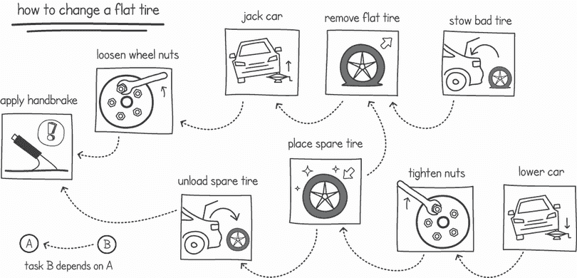

图 10.1 更换漏气轮胎的任务依赖图

通过查看任务依赖图，我们可以做出明智的决定，关于如何最佳地分配任务，以便我们更有效地完成工作。在这个例子中，我们可以指派一个人从后备箱卸下备用轮胎，同时另一个人松开轮胎螺母。我们还可以在移除坏轮胎后让另一个人存放它，同时另一个人放置备用轮胎。

构建任务依赖图是一个好的开始。然而，我们如何得出所需的步骤列表？如果我们能想出一个不同的步骤列表，这些步骤在并行执行时可能更有效，会怎样？为了帮助我们分解编程任务并考虑各种并发任务，我们可以从两个不同的角度考虑我们的程序：任务和数据分解。我们将结合使用这两种分解技术，并尝试将常见的并发模式应用于我们的问题。

### 10.1.1 任务分解

*任务分解*发生在我们考虑程序中可以并行执行的各种动作时。在任务分解中，我们提出问题，“我们可以执行哪些不同的并行动作来更快地完成任务？”作为一个类比，想想两个飞行员分配降落飞机和并行执行各种任务的工作（见图 10.2）。在我们的类比中，飞行员可以通过飞机的仪表访问相同的数据，但每个飞行员都在执行不同的任务，以确保飞机安全有效地降落。


图 10.2 飞行员在降落飞机时执行不同的任务

在上一章中，我们看到了我们可以将不同的任务分配给不同的执行方式，例如当我们编写一个程序来查找一组网络文档中最长的单词时。在任务分解中，我们需要将问题分解成几个任务，例如

+   下载网页

+   提取单词

+   查找最长单词

在获得任务分解后，我们可以先概述每个任务的依赖关系。在我们的查找最长单词的程序中，每个任务都依赖于前一个任务。例如，在下载网页之前，我们不能提取单词。

### 10.1.2 数据分解

我们也可以通过考虑数据在程序中的流动来分解我们的程序。例如，我们可以将输入数据分割并分配给多个并行执行（见图 10.3）。这被称为*数据分解*，其中我们提出问题，“我们如何组织程序中的数据，以便我们可以并行执行更多的工作？”

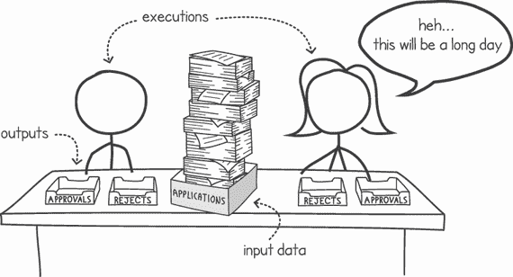

图 10.3 数据可以在多个执行之间分割。

定义 数据分解可以在我们过程的各个点进行。*输入数据分解*发生在我们将程序输入数据分割并通过多个并发执行处理时。

在输入数据分解中，我们将程序输入数据分割并分配给我们的各种执行。例如，在第三章中，我们编写了一个并发程序，下载了各种网络文档并计算了字母频率。我们选择了输入数据分解设计，其中每个输入 URL 都分配给一个单独的 goroutine。该 goroutine 从输入 URL 下载文档，并在共享数据结构上计算字母。

定义 在*输出数据分解*中，我们使用程序的输出数据来在执行之间分配工作。

相比之下，我们在第六章中的矩阵乘法是基于输出数据分解的。在那个例子中，我们有单独的 goroutine，每个 goroutine 负责计算一个输出矩阵行的结果（见图 10.4）。对于一个 3×3 的矩阵，goroutine 0 计算第 0 行的结果，goroutine 1 计算第 1 行的结果，依此类推，直到整个矩阵。

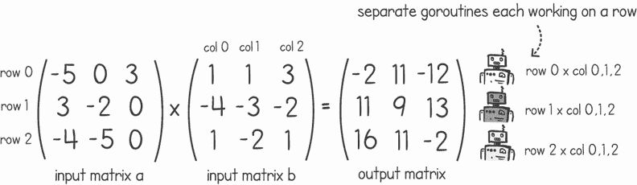

图 10.4 使用每执行一行输出数据的输出数据分解

注意：任务和数据分解是设计并发程序时应一起应用的原则。大多数并发应用程序都采用任务和数据分解的混合方法来实现高效的解决方案。

### 10.1.3 考虑粒度

当我们将问题的一部分分配给各种并发执行时，我们的子任务或数据块应该有多大？这就是我们所说的*任务粒度*。在粒度谱的一端，我们有*细粒度*任务，其中问题被分解成大量的小任务。在另一端，当问题被分解成几个大型任务时，我们说我们有*粗粒度*任务。

要理解任务粒度，我们可以想象一个开发者团队共同努力交付一个在线网店。我们可以将项目交付分解成更小的任务，并分配给开发者。如果我们使任务过于粗略，任务就很少且很大。如此少的任务，我们可能没有足够的任务分配给每个人。即使我们有每个开发者的任务，如果它们过于粗略，我们可能会有些开发者忙于处理他们的大型任务，而其他人则在快速完成他们的较小任务后闲置。这是因为每个任务中的工作量会有所不同。

如果另一方面，我们将项目分解成过于细粒度的任务，我们就能将工作分配给更多的开发者（如果他们可用）。此外，我们不太可能遇到不平衡的情况，即一些开发者空闲没有工作，而其他人正忙于处理大型任务。然而，在将任务分解得太细的情况下，我们创造了一个开发者浪费大量时间在会议上讨论谁做什么以及何时做的局面。大量的努力将花费在协调和同步各种任务上，整体效率将下降。

在这两个极端之间，存在一个最佳点，将给我们带来最大的加速——一个能够使我们以最短时间交付项目的任务粒度。这个甜蜜点的位置（见图 10.5）将取决于许多因素，例如我们有多少开发者以及他们需要参加多少次会议（在沟通上花费的时间）。最大的因素将是我们的项目性质，这将决定我们可以并行化多少任务，因为项目的某些部分将依赖于其他任务。

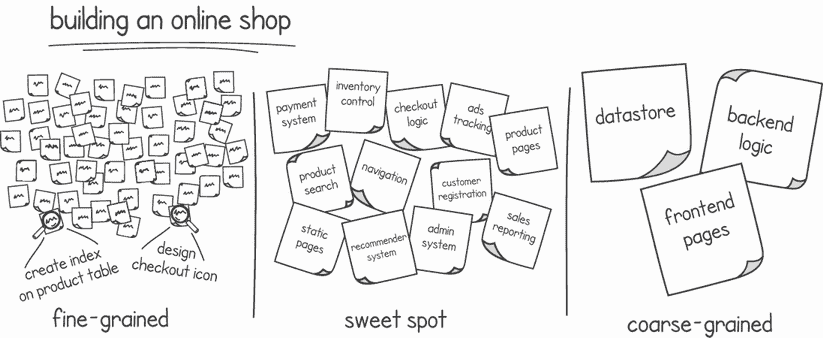

图 10.5 构建在线商店时的任务粒度

选择合适的任务粒度类型的原则同样适用于我们的算法和程序。任务粒度对我们的软件并行执行性能有重大影响。确定最佳粒度取决于许多因素，但主要取决于你试图解决的问题。将问题分解成许多小任务（细粒度）意味着当我们的程序执行时，它将具有更多的并行性（如果存在额外的处理器）和更大的加速效果。然而，由于我们的任务过于细粒度而导致的增加的同步和通信将限制可扩展性。随着我们增加并行性，我们可能会对加速效果产生可忽略或甚至负面的影响。

如果我们选择粗粒度，我们将减少执行之间的许多通信和同步需求。然而，拥有少量的大型任务可能会导致较小的加速效果，并可能导致我们的执行之间出现负载不平衡。正如我们在在线商店的例子中一样，我们需要找到适合我们场景的正确平衡。这可以通过建模、实验和测试来实现。

提示：需要非常少的通信和同步（由于解决问题的性质）的并发解决方案通常允许我们拥有更细粒度的解决方案并实现更大的加速效果。

## 10.2 并发实现模式

一旦我们使用任务和数据分解的组合将问题分解，我们就可以为我们的实现应用常见的并发模式。这些模式中的每一个都适用于特定的场景，尽管我们有时可以在单个解决方案中结合多个模式。

### 10.2.1 循环级并行性

当我们需要对一组数据进行任务操作时，我们可以使用并发来同时在不同部分上执行多个任务。一个串行程序可能有一个循环来依次对集合中的每个项目执行任务。循环级并行模式将每个迭代任务转换为一个并发任务，以便可以并行执行。

假设我们需要编写一个程序来计算特定目录中文件列表的哈希码。在顺序编程中，我们会编写一个文件哈希函数（如下所示）。然后我们的程序会从目录中收集文件列表并遍历它们。在每次迭代中，我们会调用我们的哈希函数并打印结果。

列表 10.1 SHA256 文件哈希函数（为简洁起见省略了错误处理）

```
package listing10_1

import (
    "*crypto/sha256*"
    "*io*"
    "*os*"
)

func FHash(filepath string) []byte {
    file, _ := os.Open(filepath)      ❶
    defer file.Close()

    sha := sha256.New()               ❷
    io.Copy(sha, file)                ❷

    return sha.Sum(nil)               ❸
}
```

❶ 打开文件

❷ 使用 crypto sha256 库计算哈希码

❸ 返回哈希结果

我们可以不按顺序逐个处理目录中的每个文件，而是使用循环级别的并行性，并将每个文件馈送到一个单独的 goroutine。列表 10.2 从指定的目录读取所有文件，然后在一个循环中遍历每个文件。对于每个迭代，它启动一个新的 goroutine 来计算该迭代中文件的哈希码。这个列表使用 waitgroup 来暂停`main()` goroutine，直到所有任务完成。

列表 10.2 使用循环级别并行性计算文件哈希码

```
package main

import (
    "*fmt*"
    "*github.com/cutajarj/ConcurrentProgrammingWithGo/chapter10/listing10.1*"
    "*os*"
    "*path/filepath*"
    "*sync*"
)

func main() {
    dir := os.Args[1]
    files, _ := os.ReadDir(dir)                          ❶
    wg := sync.WaitGroup{}
    for _, file := range files {
        if !file.IsDir() {
            wg.Add(1)
            go func(filename string) {                   ❷
                fPath := filepath.Join(dir, filename)
                hash := listing10_1.FHash(fPath)         ❸
                fmt.Printf("*%s - %x\n*", filename, hash)  ❸
                wg.Done()
            }(file.Name())
        }
    }
    wg.Wait()                                            ❹
}
```

❶ 从指定的目录获取文件列表

❷ 启动一个 goroutine 来计算迭代中文件的哈希码

❸ 使用先前开发的函数计算并输出文件的哈希码

❹ 等待所有任务完成，这些任务正在计算哈希码

在特定目录上运行前面的列表会产生目录中文件的哈希码列表：

```
$ go run dirfilehash.go ~/Pictures/
surf.jpg - e3b0c44298fc1c149afbf4c8996fb92427ae41e4649b934ca495991b7852b855
wave.jpg - 89e723f1dbd4c1e1cedb74e9603a4f84df617ba124ffa90b99a8d7d3f90bd535
sand.jpg - dd1b143226f5847dbfbcdc257fe3acd4252e45484732f17bdd110d99a1e451dc
. . .
```

在这个例子中，我们可以轻松地使用循环级别的并行模式，因为任务之间没有依赖关系。计算一个文件的哈希码的结果不会影响下一个文件的哈希码计算。如果我们有足够的处理器，我们可以在每个迭代上执行一个单独的处理器。但如果我们迭代中的计算依赖于前一个迭代中计算的一个步骤呢？

定义*循环携带依赖*是指同一循环中一个迭代中的一个步骤依赖于另一个迭代中的不同步骤。

让我们扩展我们的程序来计算整个目录的单个哈希码，以说明循环携带依赖的例子。计算整个目录内容的哈希码将告诉我们是否有任何文件被添加、删除或修改。为了简化问题，我们只考虑一个目录中的文件，并假设没有子目录。为了实现这一点，我们可以遍历每个文件并计算其哈希码。在相同的迭代中，我们可以将每个哈希结果组合成一个单一的哈希值。最后，我们将有一个代表整个目录的单个哈希值。

在列表 10.3 中，我们使用一个顺序的`main()`函数来做这件事。顺序程序显示每个迭代都依赖于前一个迭代。循环中的步骤`i`需要步骤`i-1`完成。我们将哈希码添加到我们的`sha256`函数中的顺序很重要。如果我们改变这个顺序，我们将产生不同的结果。

列表 10.3 计算整个目录的哈希码（省略了导入）

```
func main() {
    dir := os.Args[1]
    files, _ := os.ReadDir(dir)                        ❶
    sha := sha256.New()                                ❷
    for _, file := range files {
        if !file.IsDir() {
            fpath := filepath.Join(dir, file.Name())
            hashOnFile := listing10_1.FHash(fpath)     ❸
            sha.Write(hashOnFile)                      ❹
        }
    }
    fmt.Printf("*%s - %x\n*", dir, sha.Sum(nil))         ❺
}
```

❶ 从指定的目录获取文件列表

❷ 为目录创建一个新的、空的哈希容器

❸ 计算目录中每个文件的哈希码

❹ 将计算出的哈希码连接到目录中

输出最终的哈希码

在前面的列表中，我们有一个循环依赖；在我们添加当前迭代之前，我们必须将前一个迭代的哈希码添加到全局目录哈希中。这给我们的并发程序带来了问题。我们不能像之前那样使用同样的技巧，因为现在我们必须在开始下一个迭代之前等待前一个迭代完成。相反，我们可以利用每个迭代内部指令的部分是独立的事实，并并发执行这些指令。然后我们可以使用同步技术来按正确的顺序计算携带依赖步骤。

在我们的目录哈希应用中，由于它是独立的，我们可以并行计算文件哈希码。在每次迭代中，我们需要等待前一个迭代完成，然后才能将文件哈希码添加到全局目录哈希中。图 10.6 展示了如何实现这一点。每次迭代的冗长部分——读取文件和计算文件哈希码——与同一循环中的任何其他迭代完全独立。这意味着我们可以在一个 goroutine 中执行这部分，而不需要等待。

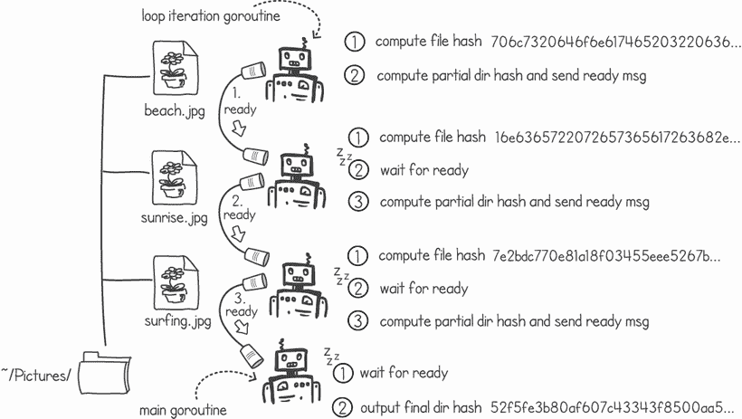

图 10.6 每个迭代中的文件哈希计算可以并行进行。

一旦 goroutine 完成文件哈希的计算，它必须等待前一个迭代完成。在我们的实现中，我们使用通道来实现这个等待。每个 goroutine 等待从前一个迭代接收信号。一旦它计算了部分目录哈希码，它就通过向下一个迭代发送通道消息来发送完成信号。这在上面的列表中有所展示。

列表 10.4 目录哈希中的循环依赖（省略导入）

```
func main() {
    dir := os.Args[1]
    files, _ := os.ReadDir(dir)
    sha := sha256.New()
    var prev, next chan int
    for _, file := range files {
        if !file.IsDir() {
            next = make(chan int)                        ❶
            go func(filename string, prev, next chan int) {
                fpath := filepath.Join(dir, filename)
                hashOnFile := listing10_1.FHash(fpath)   ❷
                if prev != nil {                         ❸
                    <-prev                               ❸
                }                                        ❸
                sha.Write(hashOnFile)                    ❹
                next <- 0                                ❺
            }(file.Name(), prev, next)
            prev = next                                  ❻
        }
    }
    <-next                                               ❼
    fmt.Printf("*%x\n*", sha.Sum(nil))
}
```

❶ 创建 goroutine 用于发送就绪信号的下一个通道

❷ 在文件上计算哈希码

❸ 如果 goroutine 不在第一个迭代中，则等待直到前一个迭代发送信号

❹ 计算目录部分哈希

❺ 向下一个迭代发送完成信号

❻ 将下一个通道分配为前一个；下一个 goroutine 将等待当前迭代的信号

❽ 在输出结果之前等待最后一个迭代完成

注意 Go 的`os.ReadDir()`函数按目录顺序返回条目。这是我们列表正确工作的关键要求。如果顺序未定义，每次运行程序（目录未更改）时，哈希结果可能不同。

`main()` goroutine 通过在`next`通道上等待就绪消息来等待最终迭代完成。然后它打印出目录哈希码的结果。在上面的列表中，就绪消息只是发送到通道上的一个`0`。以下是列表 10.4 的输出：

```
$ go run dirhashsequential.go ~/Pictures/
7200bdf2b90fc5e65da4b2402640986d37c9a40c38fd532dc0f5a21e2a160f6d
```

### 10.2.2 分支/合并模式

fork/join 模式在需要创建多个执行以并行执行任务，然后收集和合并这些执行结果的情况下很有用。在这个模式中，程序为每个任务启动一个执行，然后等待所有这些任务完成后再继续。让我们在一个程序中使用 fork/join 模式来搜索具有深层嵌套代码块的源文件。

深层嵌套的代码难以阅读。以下代码的嵌套深度为 3，因为它在关闭之前打开了三个嵌套的代码块：

```
    if x > 0 {
        if y > 0 {
            if z > 0 {
                //do something
            }
        } else {
            //do something else
        }
    }
```

我们希望编写一个程序，递归地扫描目录并找到具有最深嵌套块的源文件。列表 10.5 显示了一个函数，当给定一个文件名时，它会读取该文件并返回该源文件的嵌套代码深度。它是通过每次找到开括号时增加计数器，找到闭括号时减少计数器来实现的。该函数跟踪找到的最高值，并将其与文件名一起返回。

列表 10.5 查找最深嵌套的代码块（省略了导入和错误处理）

```
package main

import (*...*)

type CodeDepth struct {file  string; level int}

func deepestNestedBlock(filename string) CodeDepth {
    code, _ := os.ReadFile(filename)                            ❶
    max := 0
    level := 0
    for _, c := range code {                                    ❷
        if c == *’{’* {
            level += 1                                          ❸
            max = int(math.Max(float64(max), float64(level)))   ❹
        } else if c == *’}’* {
            level -= 1                                          ❺
        }
    }
    return CodeDepth{filename, max}                             ❻
}
```

❶ 将整个文件读入内存缓冲区

❷ 遍历文件中的每一个字符

❸ 当字符是一个开括号时，将层级加 1

❹ 记录层级变量的最大值

❺ 当花括号关闭时，将层级减 1

❻ 返回包含文件名的结果

我们现在需要逻辑来递归地在目录中找到的所有源文件上运行这个函数。在一个顺序程序中，我们会简单地依次调用这个函数处理所有文件，并跟踪代码深度的最大值。图 10.7 展示了我们如何使用 fork/join 模式来并发地解决这个问题。在 fork 部分，`main()` goroutine 生成了一个执行`deepestNestedBlock()`函数的 goroutine 集合，然后它将结果输出到一个公共通道上。

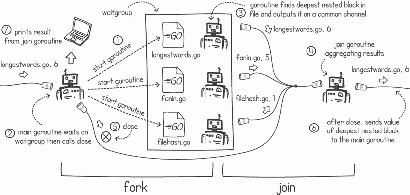

图 10.7 使用 fork/join 模式扫描源文件

模式的 join 部分是我们消费公共输出通道并等待所有 goroutine 完成的时候。在这个例子中，我们通过一个单独的 join goroutine 来实现这一部分，它收集结果并跟踪最深嵌套块。当它完成时，这个 goroutine 将结果发送到`main()` goroutine 以在控制台上输出。

在我们的实现中，`main()` goroutine 等待一个 waitgroup 直到所有 forked goroutines 完成。当 waitgroup 完成（意味着 forked goroutines 已经完成），它关闭公共输出通道。当 join goroutine 注意到公共通道已被关闭时，它将包含最深嵌套块文件名的结果发送到另一个通道给`main()`。`main()` goroutine 简单地等待这个结果并在控制台上打印它。

列表 10.6 实现了此模式中的 fork 部分。它验证给定的路径不是目录，将 1 添加到 waitgroup，并启动一个 goroutine 在文件名上执行`deepestNestedBlock()`函数。在此列表中，我们不处理目录，因为我们稍后在`main()`函数中从`filepath.Walk()`调用此函数。`deepestNestedBlock()`的返回值发送到公共结果通道。一旦函数完成，它就在 waitgroup 上调用`Done()`。

列表 10.6 实现了 fork/join 模式中的 fork 部分

```
func forkIfNeeded(path string, info os.FileInfo,
    wg *sync.WaitGroup, results chan CodeDepth) {
    if !info.IsDir() && strings.HasSuffix(path, "*.go*") {  ❶
        wg.Add(1)                                         ❷
        go func() {                                       ❸
            results <- deepestNestedBlock(path)           ❹
            wg.Done()                                     ❺
        }()
    }
}
```

❶ 通过检查扩展名验证路径是一个文件，并且它是一个 Go 源文件

❷ 将 1 添加到 waitgroup

❸ 启动一个新的 goroutine

❹ 调用函数并将返回值写入公共结果通道

❺ 标记 waitgroup 上的工作完成

对于 fork/join 模式中的 join 部分，我们需要一个 goroutine 来收集来自公共输出通道的结果，如列表 10.7 所示。`joinResults()` goroutine 从该公共通道消费并记录接收到的结果中最深嵌套块的最大值。一旦公共通道关闭，它将结果写入主通道，`finalResult`。

列表 10.7 将结果合并到最终结果通道

```
func joinResults(partialResults chan CodeDepth) chan CodeDepth {
    finalResult := make(chan CodeDepth)    ❶
    max := CodeDepth{"", 0}
    go func() {
        for pr := range partialResults {   ❷
            if pr.level > max.level {      ❸
                max = pr                   ❸
            }                              ❸
        }
        finalResult <- max                 ❹
    }()
    return finalResult
}
```

❶ 创建一个将包含最终结果的通道

❷ 接收通道中的结果，直到它关闭

❸ 记录最深嵌套块的值

❹ 在通道关闭后，将结果写入输出通道

在列表 10.8 中，我们的`main()`函数将所有东西连接起来。我们首先创建公共通道和 waitgroup。然后我们递归地遍历参数中指定的目录中的所有文件，并为遇到的每个源文件创建一个 goroutine。最后，我们通过启动收集结果的 goroutine 来连接一切，我们等待 forked goroutines 完成，关闭公共通道，然后最终从`finalResult`通道读取结果。

列表 10.8 `main()`函数创建 goroutine 并输出结果

```
func main() {
    dir := os.Args[1]                                             ❶
    partialResults := make(chan CodeDepth)                        ❷
    wg := sync.WaitGroup{}

    filepath.Walk(dir,                                            ❸
        func(path string, info os.FileInfo, err error) error {    ❸
            forkIfNeeded(path, info, &wg, partialResults)         ❸
            return nil                                            ❸
        })                                                        ❸

    finalResult := joinResults(partialResults)                    ❹

    wg.Wait()                                                     ❺

    close(partialResults)                                         ❻

    result := <-finalResult                                       ❼
    fmt.Printf("*%s has the deepest nested code block of %d\n*",    ❼
        result.file, result.level)                                ❼
}
```

❶ 从参数中读取根目录

❷ 创建所有 forked goroutines 使用的公共通道

❸ 遍历根目录，并对每个文件调用 fork 函数，创建 goroutines

❹ 调用 join 函数并获取包含最终结果的通道

❺ 等待所有 forked goroutines 完成其工作

❻ 关闭公共通道，向 join goroutine 发出工作完成的信号

❼ 接收最终结果并在控制台输出

注意：与之前的目录哈希场景不同，此示例不依赖于部分结果的顺序来计算完整结果。没有这个要求使我们能够轻松采用 fork/join 模式，其中我们可以在 join 部分聚合结果。

当我们将所有列表放在一起时，我们可以用它来扫描指定的顶级源目录，以找出哪个文件具有最深的代码块。以下是输出：

```
$ go run deepestnestedfile.go ~/projects/ConcurrentProgrammingWithGo/
~/projects/ConcurrentProgrammingWithGo/chapter9/listing9.12_13/longestwords.go has the deepest nested code block of 6
```

### 10.2.3 使用工作池

在某些情况下，我们不知道我们将得到多少工作量。如果工作量将根据需求而变化，那么分解我们的算法并使它们并发工作可能会很困难。例如，我们可能有一个 HTTP 服务器，它每秒处理的请求数量会根据访问网站的用户的数量而变化。

在现实生活中，解决方案是拥有一定数量的工作者和一个工作队列。想象一下，一个银行分行有几位出纳员为单个客户队列提供服务。在并发编程中，工作池模式复制了这种现实生活中的队列和工作者模型。

同一模式的多种名称

工作池模式及其轻微的变化以许多不同的名称为人所知，例如线程池模式、复制工作者、主/工作模式或工作者-团队模型。

在工作池模式中，我们创建并准备好接受工作的 goroutine 数量是固定的。在这个模式中，goroutine 要么是空闲的，等待任务，要么正忙于执行一个任务。工作通过公共工作队列传递给工作池。当所有工作者都忙碌时，工作队列的大小会增加。如果工作队列填满其全部容量，我们可以停止接受更多的工作。在某些工作池实现中，通过增加 goroutine 的数量，工作池的大小也可以增加到一定限制，以处理额外的负载。

要看到这种并发模式的实际应用，让我们实现一个非常简单的 HTTP 网络服务器，它将静态文件作为网络资源提供服务。我们 HTTP 服务器中的工作池模式可以在图 10.8 中看到。在我们的设计中，几个 goroutine 参与工作池，等待工作队列中的工作到来。我们使用 Go 通道实现工作队列。当所有工作 goroutine 都从同一个通道中读取时，这会对通道上的项目进行负载均衡，使所有工作都分配给所有工作者。

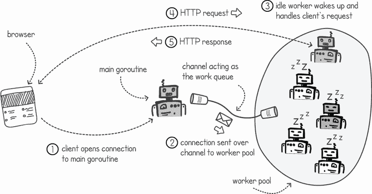

图 10.8 在 HTTP 服务器中使用工作池

在我们的 HTTP 网络服务器中，我们的`main()` goroutine 从客户端接受套接字连接。一旦连接打开，`main()` goroutine 通过将连接放入通道将它们传递给任何空闲的工作者。空闲工作者处理 HTTP 请求，并以适当的响应回复。一旦响应发送，工作者 goroutine 就会回到通道上等待下一个连接。

列表 10.9 显示了最简单的 HTTP 协议处理。在列表中，我们从连接中读取请求（使用正则表达式），从资源目录中加载请求的文件，并以适当的头信息将文件内容作为响应返回。如果文件不存在或请求无效，函数会以适当的 HTTP 错误响应。这是工作池中的每个 goroutine 在从`main()` goroutine 在通道中接收到连接时将执行的逻辑。

列表 10.9 简单的 HTTP 响应处理器

```
package listing10_9

import (
    "*fmt*"
    "*net*"
    "*os*"
    "*regexp*"
)

var r, _ = regexp.Compile("*GET (.+) HTTP**/1.1\r\n*")

func handleHttpRequest(conn net.Conn) {
    buff := make([]byte, 1024)              ❶
    size, _ := conn.Read(buff)              ❷
    if r.Match(buff[:size]) {               ❸
        file, err := os.ReadFile(           ❸
            fmt.Sprintf("*../resources/%s*", r.FindSubmatch(buff[:size])[1]))
        if err == nil {                     ❹
            conn.Write([]byte(fmt.Sprintf(
               "*HTTP**/1.1 200 OK\r\nContent-Length: %d\r\n\r\n*",len(file))))
            conn.Write(file)
        } else {                            ❺
            conn.Write([]byte(              ❺
               "*HTTP**/1.1 404 Not Found\r\n\r\n<html>Not Found</html>*"))
        }
    } else {                                ❻
        conn.Write([]byte("*HTTP**/1.1 500 Internal Server Error\r\n\r\n*"))
    }
    conn.Close()                            ❼
}
```

❶ 创建缓冲区以存储 HTTP 请求

❷ 从连接读取到缓冲区

❸ 如果请求是有效的，则从资源目录读取请求文件

❹ 如果文件存在，则向客户端响应 HTTP 头和文件内容

❺ 如果文件不存在，则响应错误

❻ 如果 HTTP 请求无效，则响应错误

❼ 在处理请求后关闭连接

以下列表初始化工作池中的所有 goroutine。该函数简单地启动 `n` 个 goroutine，每个 goroutine 从包含客户端连接的输入通道中读取。当通道接收到新的连接时，调用 `handleHttpRequest()` 函数来处理客户端的请求。

列表 10.10 启动工作池

```
func StartHttpWorkers(n int, incomingConnections <-chan net.Conn) {
    for i := 0; i < n; i++ {                        ❶
        go func() {                                 ❶
            for c := range incomingConnections {    ❷
                handleHttpRequest(c)                ❸
            }
        }()
    }
}
```

❶ 启动 n 个 goroutine

❷ 从工作队列通道消耗连接，直到通道关闭

❸ 处理接收到的连接上的 HTTP 请求

接下来，我们需要 `main()` goroutine 在一个端口上监听新的连接，并将任何新建立的连接传递到工作队列通道。在列表 10.11 中，`main()` 函数创建工作队列通道，启动工作池，然后在端口 8080 上绑定 TCP 监听连接。在一个无限循环中，当建立新的连接时，`Accept()` 函数解除阻塞并返回连接。然后，这个连接通过通道传递给工作池中的某个 goroutine 使用。

列表 10.11 `main()` 函数将工作传递给工作池（省略错误处理）

```
package main

import (
    "*github.com/cutajarj/ConcurrentProgrammingWithGo/chapter10/listing10.9*"
    "*net*"
)

func main() {
    incomingConnections := make(chan net.Conn)             ❶
    listing10_9.StartHttpWorkers(3, incomingConnections)   ❷

    server, _ := net.Listen("*tcp*", "*localhost:8080*")       ❸
    defer server.Close()
    for {
        conn, _ := server.Accept()                         ❹
        incomingConnections <- conn                        ❺
    }
}
```

❶ 创建工作队列通道

❷ 使用三个 goroutine 启动工作池

❸ 将 TCP 监听连接绑定到端口 8080

❹ 阻塞直到有来自客户端的新连接

❺ 将连接通过工作队列通道传递

我们可以通过将浏览器指向 http://localhost:8080/index.html 或使用以下 `curl` 命令来测试前面的列表：

```
$ go run httpserver.go &
. . .
$ curl localhost:8080/index.html
<!DOCTYPE html>
<html>
<head>
    <title>Learn Concurrent Programming with Go</title>
</head>
<body><h1>Learn Concurrent Programming with Go</h1></body>
```

注意：工作池模式在创建新的执行线程成本高昂时特别有用。在我们有新工作要做时，不是即时创建线程，而是在处理开始之前创建工作池，并且重用工作者。这样，当我们需要新工作来完成时，可以节省更多的时间。在 Go 中，创建 goroutine 是一个非常快速的过程，因此这种模式在性能方面不会带来很多好处。

尽管在工作池中 Go 不提供很多性能优势，但它们仍然可以用来限制并发量，以便程序和服务器不会耗尽资源。在我们的 HTTP 服务器中，我们可以选择在整个工作池忙碌时停止处理客户端连接，如图 10.9 所示。我们可以以非阻塞方式使用通道，以便 `main()` goroutine 向客户端返回“服务器忙碌”错误。

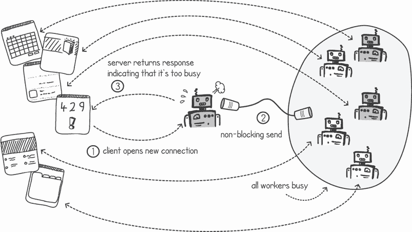

图 10.9 服务器检测到太忙并返回错误消息

列表 10.12 在工作队列通道上实现了这种非阻塞行为。在这个列表中，我们使用了一个`select`语句，当没有空闲的工作池 goroutines 时，触发默认情况。默认情况中的逻辑向客户端返回“忙碌”错误信息。

列表 10.12 使用`select`的默认情况来限制服务器的负载

```
package main

import (
    "*fmt*"
    "*github.com/cutajarj/ConcurrentProgrammingWithGo/chapter10/listing10.9*"
    "*net*"
)

func main() {
    incomingConnections := make(chan net.Conn)
    listing10_9.StartHttpWorkers(3, incomingConnections)
    server, _ := net.Listen("*tcp*", "*localhost:8080*")
    defer server.Close()
    for {
        conn, _ := server.Accept()
        select {
        case incomingConnections <- conn:
        default:                               ❶
            fmt.Println("*Server is busy*")
            conn.Write([]byte("*HTTP**/1.1 429 Too Many Requests\r\n\r\n*" +
                "*<html>Busy</html>\n*")         ❷
            conn.Close()                       ❸
        }
    }
}
```

❶ 当没有 goroutines 从工作队列中消费时，触发默认情况。

❷ 向客户端返回“忙碌”信息

❸ 关闭客户端连接

当我们打开许多同时连接时，我们可以触发这个“忙碌”的错误信息。我们的工作池非常小，只有三个 goroutines，所以很容易让整个池子变得忙碌。使用以下命令，我们可以看到服务器返回这个错误信息。在这个命令中，带有`-P100`选项的`xargs`并行执行`curl`请求，有 100 个进程：

```
$ seq 1 2000 | xargs -Iname  -P100  curl -s "http://localhost:8080/index.html" | grep Busy
</html><html>Busy</html>
</html><html>Busy</html>
</html><html>Busy</html>
. . .
```

### 10.2.4 管道化

如果分解我们问题的唯一方式是拥有一系列任务，其中每个任务完全依赖于前一个任务完成，那会怎样？例如，考虑这样一个场景：我们正在运营一个纸杯蛋糕工厂。在我们工厂中制作纸杯蛋糕涉及以下步骤：

1.  准备烘焙托盘。

1.  倒入纸杯蛋糕混合物。

1.  在烤箱中烘烤混合物。

1.  添加配料。

1.  将纸杯蛋糕装箱以供配送。

如果我们想要加快速度，仅仅雇佣员工并让他们去完成任何需要做的任务，从效率的角度来看，这并不是一个非常有效的策略，因为除了第一个步骤之外，每个步骤都依赖于前一个步骤。当我们有这种沉重的任务依赖时，应用管道模式将允许我们在相同的时间内完成更多的工作。

管道模式在许多制造业中都有应用。一个常见的例子是现代汽车装配线。汽车的底盘沿着生产线移动，在每一个阶段，不同的机器人会对正在建造的汽车执行不同的动作（例如安装零件）。

我们可以在我们的例子中使用同样的原则。我们可以让人们在不同的纸杯蛋糕批次上并行工作。每个人都在执行之前概述的不同步骤，一个步骤的输出被输入到下一个步骤（见图 10.10）。这样，我们可以充分利用劳动力，并在给定的时间内增加可以生产的纸杯蛋糕数量。


图 10.10 使用管道模式的纸杯蛋糕工厂

在某些技术问题中，我们只能以这种方式分解任务。例如，考虑一个声音处理应用程序，其中需要将多个过滤器（如降噪、高切、带通等）叠加应用于声音流。还有类似的例子适用于视频和图像处理。在前一章中，我们使用管道模式构建了一个应用程序，该应用程序从网页下载文档，提取单词，然后计算单词频率。

让我们继续使用我们的纸杯蛋糕示例，并尝试实现一个模拟此过程的程序。然后我们可以使用这个程序来检查典型管道的各种属性。在以下列表中，我们在图 10.10 中概述的步骤在单独的函数中。在每个函数中，我们通过暂停 2 秒来模拟工作，除了 `Bake()` 函数，在那里我们暂停 5 秒。

列表 10.13 制作纸杯蛋糕的步骤

```
package listing10_13

import (
    "*fmt*"
    "*time*"
)

const (
    ovenTime           = 5
    everyThingElseTime = 2
)

func PrepareTray(trayNumber int) string {
    fmt.Println("*Preparing empty tray*", trayNumber)
    time.Sleep(everyThingElseTime * time.Second)        ❶
    return fmt.Sprintf("*tray number %d*", trayNumber)    ❷
}

func Mixture(tray string) string {
    fmt.Println("*Pouring cupcake Mixture in*", tray)
    time.Sleep(everyThingElseTime * time.Second)
    return fmt.Sprintf("*cupcake in %s*", tray)
}

func Bake(mixture string) string {
    fmt.Println("*Baking*", mixture)
    time.Sleep(ovenTime * time.Second)                  ❸
    return fmt.Sprintf("*baked %s*", mixture)
}

func AddToppings(bakedCupCake string) string {
    fmt.Println("*Adding topping to*", bakedCupCake)
    time.Sleep(everyThingElseTime * time.Second)
    return fmt.Sprintf("*topping on %s*", bakedCupCake)
}

func Box(finishedCupCake string) string {
    fmt.Println("*Boxing*", finishedCupCake)
    time.Sleep(everyThingElseTime * time.Second)
    return fmt.Sprintf("*%s boxed*", finishedCupCake)
}
```

❶ 除了烘焙步骤外，每个步骤都暂停 2 秒来模拟工作。

❷ 每个函数返回所执行操作的描述。

❸ 烘焙步骤暂停 5 秒而不是 2 秒。

为了比较并行执行与顺序执行的速度提升，让我们首先使用以下列表中概述的顺序程序依次执行所有步骤。在这里，我们通过依次执行一个步骤来模拟一个人生产 10 盒纸杯蛋糕。

列表 10.14 `main()` 函数顺序生产 10 盒纸杯蛋糕

```
package main

import (
    "*fmt*"
   "*github.com/cutajarj/ConcurrentProgrammingWithGo/chapter10/listing10.13*"
)

func main() {
    for i := 0; i < 10; i++ {                               ❶
        result := listing10_13.Box(                         ❷
            listing10_13.AddToppings(                       ❷
                listing10_13.Bake(                          ❷
                    listing10_13.Mixture(                   ❷
                        listing10_13.PrepareTray(i)))))     ❷
        fmt.Println("*Accepting*", result)
    }
}
```

❶ 执行 10 次

❷ 依次顺序执行一个步骤

当依次顺序执行一个步骤时，完成一盒纸杯蛋糕大约需要 13 秒。在我们的程序中，完成 10 盒纸杯蛋糕大约需要 130 秒，如执行前两个列表的输出所示：

```
$ time go run cupcakeoneman.go
Preparing empty tray 0
Pouring cupcake Mixture in tray number 0
Baking cupcake in tray number 0
Adding topping to baked cupcake in tray number 0
Boxing topping on baked cupcake in tray number 0
Accepting topping on baked cupcake in tray number 0 boxed
Preparing empty tray 1
. . .
Boxing topping on baked cupcake in tray number 9
Accepting topping on baked cupcake in tray number 9 boxed

real    2m10.979s
user    0m0.127s
sys    0m0.152s
```

现在我们将我们的程序转换为以管道方式运行的多重执行。简单管道中的步骤都遵循相同的模式：从类型为 X 的输入通道接收输入，处理 X，并在类型为 Y 的输出通道上产生结果 Y。图 10.11 显示了我们可以构建一个可重用组件，该组件创建一个从输入通道读取类型 X 的 goroutine，调用将 X 映射到 Y 的函数，并在输出通道上输出 Y。

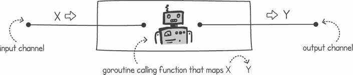

图 10.11 管道步骤接受 X，调用函数将其映射到 Y，并输出 Y

在列表 10.15 中，我们实现了这一点。在签名中，我们接受输入和输出通道以及一个映射函数 `f`。`AddOnPipe()` 函数创建一个输出通道并启动一个无限循环调用映射函数的 goroutine。在实现中，我们使用通常的退出通道模式，如果退出通道（列表中命名为 `q` 的参数）被关闭，则停止。我们利用 Go 的泛型，以确保通道和映射函数的类型匹配。

列表 10.15 可重用管道节点

```
package main

import (
    "*fmt*"
   "*github.com/cutajarj/ConcurrentProgrammingWithGo/chapter10/listing10.13*"
)

func AddOnPipeX, Y any Y, in <-chan X) chan Y {
    output := make(chan Y)              ❶
    go func() {                         ❷
        defer close(output)
        for {                           ❸
            select {                    ❸
            case <-q:                   ❹
                return                  ❹
            case input := <-in:         ❺
                output <- f(input)      ❻
            }
        }
    }()
    return output
}
```

❶ 创建类型为 Y 的输出通道

❷ 启动 goroutine

❸ 在无限循环中调用 select

❹ 当退出通道关闭时，退出循环并终止 goroutine

❺ 如果有可用的消息，则在输入通道上接收消息

❻ 调用函数 f 并在输出通道上输出函数的返回值

我们现在可以使用列表 10.15 中的函数，将我们曲奇工厂的所有步骤添加到一个公共管道中。在下面的列表中，我们有一个`main()`函数，它使用`AddOnPipe()`函数包装每个步骤。然后它启动一个 goroutine，向`PrepareTray()`步骤中输入 10 条消息。这相当于运行我们的管道 10 次。

列表 10.16 连接和启动我们的曲奇管道

```
func main() {
    input := make(chan int)                        ❶
    quit := make(chan int)                         ❷
    output := AddOnPipe(listing10_1.Box, quit,     ❸
        AddOnPipe(quit, listing10_1.AddToppings,
            AddOnPipe(quit, listing10_1.Bake,
                AddOnPipe(quit, listing10_1.Mixture,
                    AddOnPipe(quit, listing10_1.PrepareTray, input)))))
    go func() {                                    ❹
        for i := 0; i < 10; i++ {                  ❹
            input <- i                             ❹
        }                                          ❹
    }()
    for i := 0; i < 10; i++ {                      ❺
        fmt.Println(<-output, "*received*")          ❺
    }                                              ❺
}
```

❶ 创建第一个输入通道，用于连接到第一个步骤

❷ 创建退出通道

❸ 将管道上的每个步骤连接起来，将每个步骤的输出馈送到下一个步骤的输入

❹ 创建一个 goroutine，向管道发送 10 个整数以生产 10 个曲奇盒子

❺ 从上一个管道步骤读取 10 个曲奇盒子作为输出

在`main()`函数的末尾，我们等待 10 条消息到达并在控制台上打印出消息。以下是运行上一个列表时的输出：

```
$ time go run cupcakefactory.go
Preparing empty tray 0
Preparing empty tray 1
Pouring cupcake Mixture in tray number 0
Pouring cupcake Mixture in tray number 1
Preparing empty tray 2
Baking cupcake in tray number 0
Baking cupcake in tray number 1
Pouring cupcake Mixture in tray number 2
Preparing empty tray 3
Adding topping to baked cupcake in tray number 0
. . .
Boxing topping on baked cupcake in tray number 8
topping on baked cupcake in tray number 8 boxed received
Adding topping to baked cupcake in tray number 9
Boxing topping on baked cupcake in tray number 9
topping on baked cupcake in tray number 9 boxed received

real    0m58.780s
user    0m0.106s
sys    0m0.289s
```

使用我们算法的管道版本导致执行速度加快，大约为 58 秒而不是 130 秒。我们能否通过加快完成某些步骤所需的时间来进一步提高它？让我们对时间进行实验，在这个过程中，我们将发现管道模式的一些属性。

### 10.2.5 管道属性

如果我们加快所有手动步骤（不包括烘焙时间）的速度会发生什么？在我们的程序中，我们可以将常数`everyThingElseTime`（从列表 10.1）减小到一个更小的值。这样，除了烘焙时间之外的所有步骤都会运行得更快。以下是设置`everyThingElseTime = 1`时的输出：

```
$ time go run cupcakefactory.go
Preparing empty tray 0
. . .
topping on baked cupcake in tray number 9 boxed received

real    0m55.579s
user    0m0.117s
sys    0m0.242s
```

这里发生了什么？我们几乎加倍了几乎每个步骤的速度，但生产 10 个盒子的总时间几乎保持不变。要了解发生了什么，请看图 10.12。

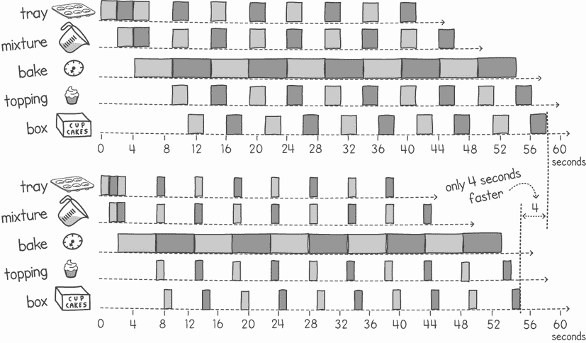

图 10.12 增加非烘焙部分的速度并不会显著提高吞吐量。

注意：在管道中，*吞吐量* *速率* 由最慢的步骤决定。系统的*延迟*是执行每一步所需时间的总和。

如果我们的管道是真实的，四个人会工作得快两倍，但在吞吐量方面几乎没有任何区别。这是因为我们的管道中的瓶颈是烘焙时间。我们最慢的步骤受限于我们有一个慢烤箱，它使一切变慢。为了提高单位时间内生产的曲奇数量，我们应该专注于加快我们最慢的步骤。

提示：为了提高系统的吞吐量，始终最好关注该系统的瓶颈。这是对降低我们性能影响最大的部分。

加快大多数步骤已经对从开始到结束生产一盒纸杯蛋糕所需的时间产生了影响。在第一次运行中，我们用了 13 秒来生产一盒。当我们设置`everyThingElseTime = 1`时，这个时间下降到了 9 秒。我们可以将这视为系统延迟。对于某些应用程序（如后端批量处理），高吞吐量更重要，而对于其他应用程序（如实时系统），提高延迟更好。

提示：为了减少管道系统的延迟，我们需要提高管道中大多数步骤的速度。

让我们进一步通过改进烘焙步骤并使其更快来实验我们的管道。在现实生活中，我们可以得到一个更强大的烤箱，或者可能有多个可以并行工作的烤箱。在我们的程序中，我们可以简单地设置变量`ovenTime = 2`而不是`5`，并将`everyThingElseTime`恢复到`2`。当我们再次运行程序时，我们得到以下输出：

```
$ time go run cupcakefactory.go
Preparing empty tray 0
. . .
topping on baked cupcake in tray number 9 boxed received

real    0m30.197s
user    0m0.094s
sys    0m0.135s
```

我们大大提高了生产 10 盒纸杯蛋糕所需的时间。这种加速的原因在图 10.13 中很清楚。我们可以看到，我们现在在时间上更有效率。每个 goroutine 都在不断忙碌，没有任何空闲时间。这意味着我们提高了吞吐量——单位时间内生产的纸杯蛋糕数量。

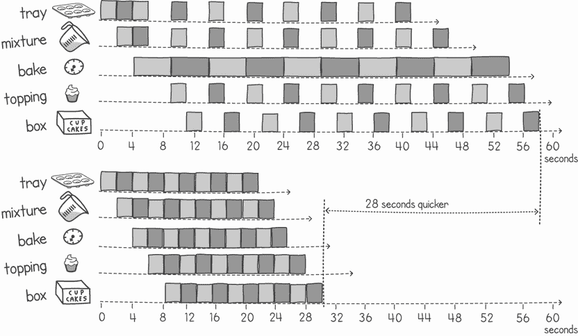

图 10.13 加快最慢的步骤对吞吐量的影响更大。

值得注意的是，尽管我们已经提高了吞吐量，但生产一盒纸杯蛋糕（系统延迟）的时间并没有受到很大影响。现在从开始到结束生产一盒纸杯蛋糕需要 10 秒，而不是 13 秒。

## 10.3 练习

注意：访问[`github.com/cutajarj/ConcurrentProgrammingWithGo`](http://github.com/cutajarj/ConcurrentProgrammingWithGo)以查看所有代码解决方案。

1.  实现与列表 10.4 中相同的目录哈希，但不是使用通道在迭代之间同步，而是尝试使用 waitgroups。

1.  修改列表 10.2，使得`main()` goroutine 和工作者池之间的工作队列通道具有 10 条消息的缓冲区。这样做将为您提供容量缓冲区，以便当所有 goroutine 都忙碌时，一些请求在它们被选中之前可以排队。

1.  以下列表下载 30 个网页，并按顺序计算所有文档的总行数。将此程序转换为使用本章中解释的并发编程模式。

列表 10.17 网页行数

```
package main

import (
    "*fmt*"
    "*io*"
    "*net/http*"
    "*strings*"
)

func main() {
    const pagesToDownload = 30
    totalLines := 0
    for i := 1000; i < 1000 + pagesToDownload; i++ {
        url := fmt.Sprintf("*https://rfc-editor.org/rfc/rfc%d.txt*", i)
        fmt.Println("*Downloading*", url)
        resp, _ := http.Get(url)
        if resp.StatusCode != 200 {
            panic("*Server’s error:* " + resp.Status)
        }
        bodyBytes, _ := io.ReadAll(resp.Body)
        totalLines += strings.Count(string(bodyBytes), "*\n*")
        resp.Body.Close()
    }
    fmt.Println("*Total lines:*", totalLines)
}
```

## 摘要

+   分解是将程序分解为不同的部分，并找出哪些部分可以并发执行。

+   构建依赖图有助于我们了解哪些任务可以与其他任务并行执行。

+   任务分解是将问题分解为完成整个工作所需的不同动作。

+   数据分解是将数据划分成一种方式，使得对数据的任务可以并行执行。

+   在将程序分解时选择细粒度意味着在同步和通信上花费时间以限制可扩展性的同时，可以获得更多的并行性。

+   选择粗粒度意味着并行性较少，但它减少了所需的同步和通信量。

+   如果任务之间没有依赖关系，可以使用循环级别的并行性来并发执行一系列任务。

+   在循环级别的并行性中，将问题分解为并行和同步部分，允许依赖于前一个任务迭代。

+   Fork/join 是一种并发模式，当问题有一个初始的并行部分和一个最终步骤来合并各种结果时可以使用。

+   当并发需求需要按需扩展时，工作池是有用的。

+   在工作池中预先创建执行比动态创建对大多数语言来说都要快。

+   在 Go 语言中，由于 goroutines 的轻量级特性，预先创建工作池与动态创建 goroutines 的性能差异极小。

+   当需求意外增加时，可以使用工作池来限制并发性，以免服务器过载。

+   当每个任务都依赖于前一个任务完成时，管道对于提高吞吐量是有用的。

+   增加管道中最慢节点的速度会导致整个管道的吞吐量性能提高。

+   增加管道中任何节点的速度会导致管道延迟的减少。
