# 11 避免死锁

本章涵盖

+   识别死锁

+   避免死锁

+   使用通道进行死锁

在并发程序中，*死锁*发生时，执行会无限期地阻塞，等待彼此释放资源。死锁是某些并发程序的不可取副作用，在这些程序中，并发执行尝试同时获取多个资源的独占访问权限。在本章中，我们将分析可能导致死锁的条件，并提出防止它们发生的策略。我们还将讨论在使用 Go 通道时可能发生的某些死锁条件。

死锁可能非常难以识别和调试。与竞态条件一样，我们可能有一个长时间运行而没有任何问题的程序，然后突然执行停止，没有明显的原因。了解死锁发生的原因使我们能够做出编程决策来避免它们。

## 11.1 识别死锁

我们可以编写最简单的并发程序，创建所有可能导致死锁发生的条件是什么？我们可以创建一个简单的程序，其中包含两个协程竞争两个独占资源，如图 11.1 所示。这两个协程，称为`red()`和`blue()`，都试图同时持有两个互斥锁。由于锁是独占的，只有一个协程可以在另一个协程不持有任何锁的情况下获得这两个锁。

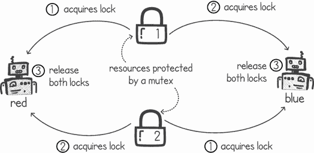

图 11.1 两个协程竞争两个独占资源

列表 11.1 显示了`red()`和`blue()`协程的简单实现。这两个函数接受我们的两个互斥锁，当我们以单独的协程运行这些函数时，它们将尝试同时获取这两个锁，然后再释放它们。这个过程会无限循环。在列表中，有多个消息指示我们何时获取、保持和释放锁。

列表 11.1 `red()`和`blue()`协程（为了简洁省略了导入）

```
func red(lock1, lock2 *sync.Mutex) {
    for {
        fmt.Println("*Red: Acquiring lock1*")
        lock1.Lock()                             ❶
        fmt.Println("*Red: Acquiring lock2*")      ❶
        lock2.Lock()                             ❶
        fmt.Println("*Red: Both locks Acquired*")
        lock1.Unlock(); lock2.Unlock()           ❷
        fmt.Println("*Red: Locks Released*")
    }
}

func blue(lock1, lock2 *sync.Mutex) {
    for {
        fmt.Println("*Blue: Acquiring lock2*")
        lock2.Lock()                             ❶
        fmt.Println("*Blue: Acquiring lock1*")     ❶
        lock1.Lock()                             ❶
        fmt.Println("*Blue: Both locks Acquired*")
        lock1.Unlock(); lock2.Unlock()           ❷
        fmt.Println("*Blue: Locks Released*")
    }
}
```

❶ 获取并保持两个锁

❷ 释放两个锁

我们现在可以在`main()`函数中创建我们的两个互斥锁，并启动`red()`和`blue()`协程，如列表 11.2 所示。启动协程后，`main()`函数将休眠 20 秒，在此期间我们预计`red()`和`blue()`协程将连续输出控制台消息。20 秒后，`main()`协程终止，程序退出。

列表 11.2 `main()`函数启动`red()`和`blue()`协程

```
func main() {
    lockA := sync.Mutex{}
    lockB := sync.Mutex{}
    go red(&lockA, &lockB)         ❶
    go blue(&lockA, &lockB)        ❷
    time.Sleep(20 * time.Second)   ❸
    fmt.Println("*Done*")
}
```

❶ 启动红色()协程

❷ 启动蓝色()协程

❸ 允许红色()和蓝色()协程运行 20 秒

以下是运行列表 11.1 和 11.2 的输出示例：

```
$ go run simpledeadlock.go
. . .
Blue: Locks Released
Blue: Acquiring lock2
Red: Acquiring lock1
Red: Acquiring lock2
Blue: Acquiring lock1
```

一段时间后，程序停止输出消息，看起来在 20 秒休眠期结束前就卡住了。此时，我们的`red()`和`blue()`协程陷入了死锁，无法继续进行。大约 20 秒后，`main()`协程完成并退出程序。为了理解发生了什么以及死锁是如何发生的，我们将在下一节中查看资源分配图。

注意：由于并发执行的非确定性，运行列表 11.1 和 11.2 并不总是会导致死锁。我们可以在`red()`和`blue()`协程的第一个和第二个`mutex.Lock()`调用之间添加`Sleep()`调用，以进一步提高死锁的可能性。

### 11.1.1 使用资源分配图描绘死锁

*资源分配图* (RAG)显示了各种执行所使用的资源。它们在操作系统中用于各种功能，包括死锁检测。

绘制这些图可以帮助我们想象并发程序中的死锁。图 11.2 显示了列表 11.1 和 11.2 中发生的简单死锁情况。

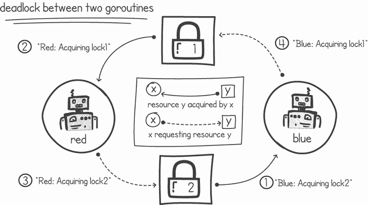

图 11.2 `red()`和`blue()`协程的资源分配图

在资源分配图中，节点代表执行或资源。例如，在图 11.2 中，节点是我们的两个协程，与两个互斥锁进行交互。在图中，我们使用矩形节点表示资源，圆形节点表示协程。边显示了执行请求或持有哪些资源。从执行指向资源的边（图 11.2 中的虚线）表示执行正在请求使用该资源。从资源指向执行的边（实线）告诉我们资源正在被该执行使用。

图 11.2 显示了我们的简单程序中死锁发生的情况。在`blue()`协程获取锁 2 之后，它需要请求锁 1。`red()`协程持有锁 1，并需要请求锁 2。每个协程都持有一个锁，然后继续请求另一个锁。由于另一个锁被另一个协程持有，第二个锁永远不会被获取。这导致了两个协程将永远等待对方释放其锁的死锁情况。

注意：图 11.2 包含一个图环：从任何节点开始，我们可以沿着边追踪一条路径，最终回到我们的起始节点。每当资源分配图中存在这样的环时，这意味着发生了死锁。

死锁不仅仅发生在软件中。有时，现实生活中的场景会创造死锁发生的条件。例如，考虑一个铁路交叉布局，如图 11.3 所示。在这个简单的布局中，一列长火车可能需要同时使用多个铁路交叉道。

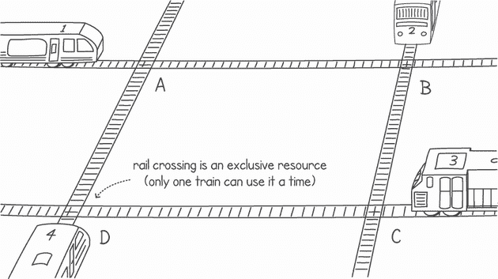

图 11.3 可能导致死锁的铁路交叉路口布局

铁路交叉路口，从本质上讲，是排他性资源——在任何时候只能有一列火车使用它们。因此，接近交叉路口的火车需要请求并预留对其的访问权限，以便其他火车不能使用它。如果另一列火车已经在使用交叉路口，任何需要相同交叉路口的其他火车都必须等待交叉路口再次空闲。

一列足够长以至于可以跨越多个交叉口的火车可能需要同时使用多个交叉路口。这类似于我们的执行同时持有多个排他性资源（如互斥锁）。图 11.3 显示，从不同方向接近的每列火车都需要同时使用两个交叉路口。例如，从左向右移动的火车 1 需要交叉 A 和 B，从上向下移动的火车 2 需要交叉 B 和 C，依此类推。

获取多个交叉口的用途不是一个原子操作；火车 1 将首先获取并使用交叉 A，然后，稍后，再使用交叉 B。这可能会造成每种火车都对其第一个交叉路口持有控制权，但它在等待前面的火车释放第二个交叉路口。由于火车轨道是以创建循环资源（一个交叉路口）依赖关系的方式设置的，可能会出现死锁情况。图 11.4 展示了示例死锁。

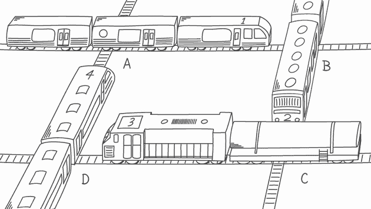

图 11.4 铁路系统中发生的死锁

正如 goroutines 可能会永远等待资源被释放一样，火车司机甚至可能不知道系统已经陷入死锁。从那个人的角度来看，他们正在等待前面的火车移动，以便他们可以释放交叉路口。同样，我们可以通过使用资源分配图来识别系统是否处于死锁状态，如图 11.5 所示。

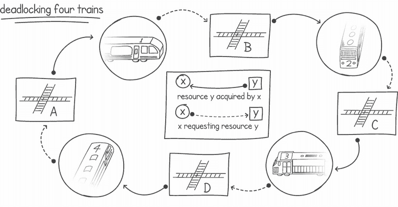

图 11.5 铁路死锁的资源分配图

资源分配图清楚地显示，存在一个循环，这表明我们遇到了死锁。每列火车都获取了交叉路口的使用权，但正在等待下一列火车释放下一个交叉路口。这是一个具有四个单独执行（火车）的死锁示例，尽管死锁可以发生在任何大于一的数量。我们可以通过以循环方式添加更多交叉路口和火车来轻松地设计出涉及任何数量火车的火车布局。

在 1971 年发表的一篇题为“系统死锁”的论文中，Coffman 等人阐述了必须**全部**满足以下四个条件才能发生死锁：

+   **互斥**—系统中的每个资源要么被一个执行使用，要么是空闲的。

+   **等待条件**—持有一个或多个资源的执行可以请求更多资源。

+   **无抢占**—执行持有的资源不能被夺走。只有持有资源的执行可以释放它们。

+   *循环等待*——存在一个由两个或更多执行组成的循环链，其中每个执行都在等待链中下一个执行释放资源时被阻塞。

在现实生活中，我们可以看到许多其他死锁的例子。这些例子包括关系冲突、谈判和道路交通。事实上，道路工程师花费大量时间和精力设计系统以最小化交通死锁的风险。现在让我们看看软件中更复杂的死锁例子。

### 11.1.2 账本中的死锁

假设我们在一家银行工作，并被分配实施读取账本交易以将资金从一个账户转移到另一个账户的软件。一笔交易会从源账户中扣除余额并添加到目标账户。例如，山姆支付保罗 10 美元意味着我们需要

1.  读取山姆的账户余额

1.  从山姆的账户中扣除 10 美元

1.  读取保罗的账户余额

1.  向保罗的余额中添加 10 美元

由于我们希望能够处理大量交易，我们将使用多个 goroutine 和共享内存来并发处理交易。为了避免竞态条件，我们可以在源账户和目标账户上使用互斥锁。这确保了在从某个账户中扣除资金并添加到另一个账户时，goroutine 不会被中断。图 11.6 展示了处理账本交易的 goroutine 的逻辑。程序是首先获取源账户的互斥锁，然后是目标账户的互斥锁，然后才移动资金。

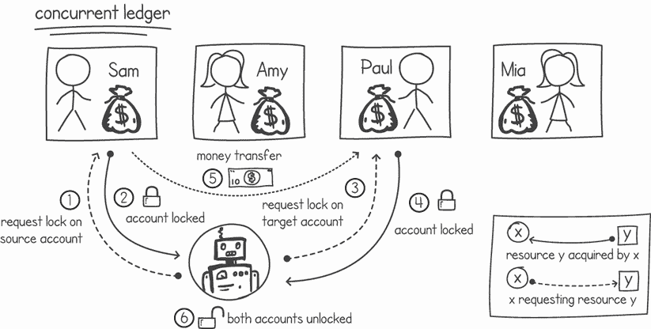

图 11.6 在处理账本交易时使用互斥锁锁定源账户和目标账户

使用单独的互斥锁，每个账户一个，这样当我们处理交易时，我们只锁定所需的账户。列表 11.3 展示了一个包含此互斥锁、标识符和余额的 `BankAccount` 类型结构。列表还包含一个 `NewBankAccount()` 函数，该函数实例化一个新的银行账户，默认余额为 100 美元和一个新的互斥锁。

列表 11.3 银行账户类型结构

```
package listing11_3_4

import (
    "*fmt*"
    "*sync*"
)

type BankAccount struct {
    id      string
    balance int
    mutex   sync.Mutex
}

func NewBankAccount(id string) *BankAccount {   ❶
    return &BankAccount{
        id:      id,
        balance: 100,
        mutex:   sync.Mutex{},
    }
}
```

❶ 创建一个带有 100 美元和一个新互斥锁的银行账户实例

列表 11.4 展示了如何实现一个 `Transfer()` 函数，该函数的逻辑在图 11.6 中概述。该函数通过 `amount` 参数从源 (`src`) 银行账户向目标 (`to`) 银行账户转账。出于日志记录的目的，该函数还接受一个 `exId` 参数。此参数表示调用此函数的执行过程。调用此函数的 goroutine 会传递一个唯一 ID，以便我们可以在控制台上记录它。

列表 11.4 资金转账函数

```
func (src *BankAccount) Transfer(to *BankAccount, amount int, exId int) {
    fmt.Printf("*%d Locking %s’s account\n*", exId, src.id)
    src.mutex.Lock()                                      ❶
    fmt.Printf("*%d Locking %s’s account\n*", exId, to.id)
    to.mutex.Lock()                                       ❷
    src.balance -= amount                                 ❸
    to.balance += amount                                  ❸
    to.mutex.Unlock()                                     ❹
    src.mutex.Unlock()                                    ❹
    fmt.Printf("*%d Unlocked %s and %s\n*", exId, src.id, to.id)
}
```

❶ 锁定源账户的互斥锁

❷ 锁定目标账户的互斥锁

❸ 从源账户扣除资金并将其添加到目标账户

❹ 解锁目标账户和源账户

我们现在可以有几个 goroutine 执行随机生成的转移，模拟我们正在接收大量交易的场景。列表 11.5 创建了四个银行账户，然后启动了四个 goroutine，每个 goroutine 执行 1,000 次转移。每个 goroutine 通过随机选择源账户和目标账户来生成转移。如果源账户和目标账户恰好相同，则选择另一个目标账户。每次转移的金额为 10 美元。

列表 11.5：goroutine 执行随机生成的转移

```
package main

import (
  "*fmt*"
  "*github.com/cutajarj/ConcurrentProgrammingWithGo/chapter11/listing11.3_4*"
  "*math/rand*"
  "*time*"
)

func main() {
    accounts := []listing11_3_4.BankAccount{
        *listing11_3_4.NewBankAccount("*Sam*"),
        *listing11_3_4.NewBankAccount("*Paul*"),
        *listing11_3_4.NewBankAccount("*Amy*"),
        *listing11_3_4.NewBankAccount("*Mia*"),
    }
    total := len(accounts)
    for i := 0; i < 4; i++ {
        go func(eId int) {                                         ❶
            for j := 1; j < 1000; j++ {                            ❷
                from, to := rand.Intn(total), rand.Intn(total)     ❸
                for from == to {                                   ❸
                    to = rand.Intn(total)                          ❸
                }
                accounts[from].Transfer(&accounts[to], 10, eId)    ❹
            }
            fmt.Println(eId, "*COMPLETE*")                           ❺
        }(i)
    }
    time.Sleep(60 * time.Second)                                   ❻
}
```

❶ 创建一个具有唯一执行 ID 的 goroutine

❷ 执行 1,000 次随机生成的转移

❸ 选择转移的源账户和目标账户

❹ 执行转移操作

❺ 一旦所有 1,000 次转移完成，输出完整消息

❻ 在终止程序前等待 60 秒

运行列表 11.5，我们期望在控制台上为我们的四个 goroutine 打印出 1,000 次转移，然后输出消息`COMPLETE`。不幸的是，我们的程序陷入了一个死锁，最后的消息没有被打印出来：

```
$ go run ledgermutex.go
1 Locking Paul’s account
1 Locking Mia’s account
1 Unlocked Paul and Mia
. . .
2 Locking Amy’s account
0 Locking Sam’s account
3 Locking Mia’s account
3 Locking Paul’s account
3 Unlocked Mia and Paul
3 Locking Paul’s account
3 Locking Sam’s account
0 Locking Amy’s account
2 Locking Paul’s account
1 Unlocked Amy and Mia
1 Locking Mia’s account
1 Locking Paul’s account
```

注意：每次我们运行列表 11.5 时，我们都会得到略微不同的输出，并不总是导致死锁。这是由于并发执行的非确定性性质。

从我们的输出中，我们可以观察到一些 goroutine 正在持有某些账户的锁，并试图获取其他账户的锁。在我们的例子中，死锁发生在 goroutine 0、2 和 3 之间。我们可以创建一个资源分配图来更好地理解死锁（见图 11.7）。

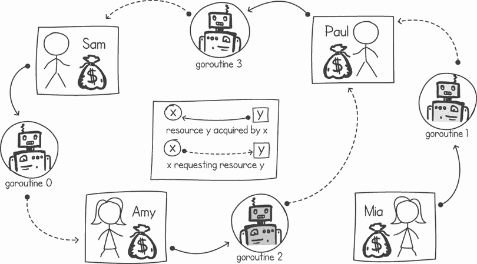

图 11.7：处理账本交易时的死锁

我们在图 11.7 中的资源分配图显示，死锁是由 goroutine 0、2 和 3 引起的，因为它包含了一个以这些 goroutine 为节点的循环。它还显示死锁可以通过阻止对它们的资源访问来影响其他 goroutine。在这个例子中，goroutine 1 在尝试获取保罗的账户锁时被阻塞。

## 11.2 处理死锁

我们应该怎么做才能确保我们的编程不会受到死锁的影响？我们有三种主要方法：检测、使用避免死锁的机制，以及以防止死锁场景的方式编写我们的并发编程。在接下来的几节中，我们将探讨这三种选项。

值得注意的是，在处理死锁时还有另一种方法：什么都不做。一些教科书将这种方法称为*鸵鸟法*，因为鸵鸟在危险时会将头埋在沙子里（尽管这是一个普遍的误解）。如果我们确定在我们的系统中，死锁很少发生，并且当它们发生时，后果并不严重，那么不采取任何措施来防止死锁才有意义。

### 11.2.1 检测死锁

我们可以采取的第一种方法是检测死锁，这样我们就可以采取一些措施。例如，在检测到发生死锁后，我们可以有一个警报，通知可以重启进程的人。更好的是，我们可以在代码中添加逻辑，每当发生死锁时，就会执行重试操作。

Go 内置了一些死锁检测机制。Go 的运行时会检查下一个应该执行的 goroutine 是哪个，如果它发现所有的 goroutine 都在等待一个资源（例如互斥锁）而阻塞，它将抛出一个致命错误。不幸的是，这意味着它只能检测到所有 goroutine 都阻塞的情况。

考虑列表 11.6，其中主 goroutine 正在等待 waitgroup，直到两个子 goroutine 完成它们的工作。这两个 goroutine 都会反复锁定互斥锁 A 和 B，以增加发生死锁的风险。

列表 11.6 触发 Go 的死锁检测

```
package main

import (
    "*fmt*"
    "*sync*"
)

func lockBoth(lock1, lock2 *sync.Mutex, wg *sync.WaitGroup) {
    for i := 0; i < 10000; i++ {
        lock1.Lock(); lock2.Lock()      ❶
        lock1.Unlock(); lock2.Unlock()  ❶
    }
    wg.Done()                           ❷
}

func main() {
    lockA, lockB := sync.Mutex{}, sync.Mutex{}
    wg := sync.WaitGroup{}
    wg.Add(2)
    go lockBoth(&lockA, &lockB, &wg)    ❸
    go lockBoth(&lockB, &lockA, &wg)    ❸
    wg.Wait()                           ❹
    fmt.Println("*Done*")
}
```

❶ 锁定和解锁两个互斥锁

❷ 标记 waitgroup 为完成

❸ 同时启动两个 goroutine，锁定两个互斥锁

❹ 等待 goroutine 终止

当运行前面的代码示例时，如果发生死锁，所有 goroutine 都将阻塞，包括主 goroutine。这两个 goroutine 将陷入死锁等待对方，而`main()` goroutine 将卡在等待 waitgroup 完成。以下是 Go 给出的错误消息摘要：

```
$ go run deadlockdetection.go
fatal error: all goroutines are asleep - deadlock!

goroutine 1 [semacquire]:
. . .
    /usr/local/go/src/sync/waitgroup.go:139 +0x80
main.main()
    /deadlockdetection.go:22 +0x13c

goroutine 18 [semacquire]:
. . .
sync.(*Mutex).Lock(...)
    /usr/local/go/src/sync/mutex.go:90
main.lockBoth(0x1400011c008, 0x1400011c010, 0x0?)
    /deadlockdetection.go:10 +0x104
. . .

goroutine 19 [semacquire]:
. . .
sync.(*Mutex).Lock(...)
    /usr/local/go/src/sync/mutex.go:90
main.lockBoth(0x1400011c010, 0x1400011c008, 0x0?)
    deadlockdetection.go:10 +0x104
. . .

exit status 2
```

除了告诉我们有死锁之外，Go 还会输出我们的程序卡住时 goroutine 的详细信息。在这个例子中，我们可以看到标记为 18 和 19 的 goroutine 都在尝试锁定互斥锁，而我们的`main()` goroutine（标记为 goroutine 1）正在等待 waitgroup。

我们可以轻松地编写一个绕过这种死锁检测机制的程序。考虑下面的代码示例，我们修改了`main()`函数以创建另一个 goroutine 来等待 waitgroup。然后`main()` goroutine 休眠 30 秒，模拟执行其他工作。

列表 11.7 绕过 Go 的死锁检测

```
func main() {
    lockA, lockB := sync.Mutex{}, sync.Mutex{}
    wg := sync.WaitGroup{}
    wg.Add(2)
    go lockBoth(&lockA, &lockB, &wg)
    go lockBoth(&lockB, &lockA, &wg)
    go func() {                                     ❶
        wg.Wait()                                   ❶
        fmt.Println("*Done waiting on waitgroup*")    ❶
    }()                                             ❶
    time.Sleep(30 * time.Second)                    ❷
    fmt.Println("*Done*")                             ❸
}
```

❶ 在输出消息之前创建一个等待 waitgroup 的 goroutine

❷ 等待 30 秒

❸ 输出一条消息，然后程序终止

由于现在`main()` goroutine 并没有真正阻塞，而是在等待`sleep()`函数，Go 的运行时将不会检测到死锁。当发生死锁时，不会返回消息`"Done waiting on waitgroup"`；相反，30 秒后，`main()` goroutine 输出`"Done"`消息，程序在没有死锁错误的情况下终止：

```
$ go run deadlocknodetection.go
Done
```

检测死锁的一个更完整的方法是程序化地构建一个资源分配图，该图将所有 goroutine 和资源作为节点，通过边连接，正如你在图 11.2、11.5 和 11.7 中看到的。然后我们可以有一个检测图中循环的算法。如果图中包含循环，系统就处于死锁状态。

要检测图中的循环，我们可以修改深度优先搜索算法以查找循环。如果我们跟踪在遍历过程中访问的节点，并且遇到已经访问过的节点，我们就知道存在循环。

这是一些其他框架、运行时和系统（如数据库）采用的方法。以下是一个由 MySQL（一个流行的开源数据库）返回的错误示例。在这种情况下，当有两个并发会话同时运行事务并尝试同时获取相同的锁时，会发生死锁。MySQL 跟踪所有会话和分配的资源，并在检测到任何死锁时，向客户端返回以下错误：

```
ERROR 1213 (40001): Deadlock found when trying to get lock;
try restarting transaction
```

如果我们的运行时或系统提供了死锁检测，我们可以在检测到死锁时执行各种操作。一个选项是终止陷入死锁的执行。这与 Go 运行时采取的方法类似，不同之处在于 Go 终止了包含所有 goroutine 的整个进程。

另一个选项是在请求资源时，如果请求导致死锁，则向请求资源的执行返回错误。然后，执行可以决定在一段时间后执行某些操作以响应错误，例如释放资源并重试。这种方法在许多数据库中使用时通常被采用。通常，当数据库返回死锁错误时，数据库客户端可以回滚事务并重试。

为什么 Go 的运行时不提供完整的死锁检测？

通过检查资源分配图中的任何循环来检测死锁是一种相对昂贵的性能操作。Go 的运行时会维护一个资源分配图，并且每次有资源请求或释放时，Go 都必须在图上运行循环检查算法。在一个有大量 goroutine 请求和释放资源的应用程序中，这种死锁检测检查会减慢速度。在许多情况下，当 goroutine 没有同时使用多个独占资源时，这也会是不必要的。

在数据库事务中实现完整的死锁检测通常不会影响性能。这是因为相对于缓慢的数据库操作，检测算法速度很快。

### 11.2.2 避免死锁

我们可以通过以不会引起死锁的方式调度执行来尝试避免死锁。在图 11.8 中，我们再次使用列车死锁的例子，但这次，我们展示了每列火车在陷入死锁状态时的时间线。

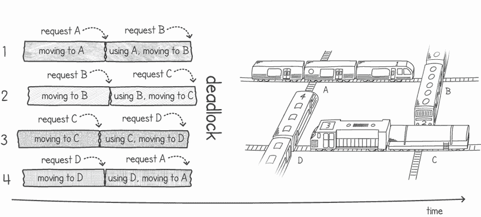

图 11.8 导致死锁的列车时间线

分配资源（例如，在本例中为火车道口）的系统可以拥有更智能的逻辑来分配资源，从而避免死锁。在我们的火车例子中，我们事先知道每列火车的行程和长度。因此，当火车 1 请求道口 A 时，我们已经知道道口 B 可能很快就会被请求。当火车 2 到来并请求道口 B 时，我们不是分配给它并允许火车继续前进，而是可以指示火车停车等待。

同样的事情也可能发生在火车 3 和 4 之间。当火车 4 到来并请求道口 D 时，我们已经知道它可能稍后会请求道口 A，而道口 A 目前正在被火车 1 使用。因此，我们再次指示火车 4 停车等待。然而，火车 3 可以无干扰地继续前进，因为道口 C 和 D 都是空闲的。目前没有火车正在使用可能在未来请求其中任何一个的道口。

这个火车调度示例在图 11.9 中展示。火车 1 和 3 无间断地通过道口，而火车 2 和 4 则停车等待。一旦道口再次空闲，火车 2 和 4 可以继续它们的行程。

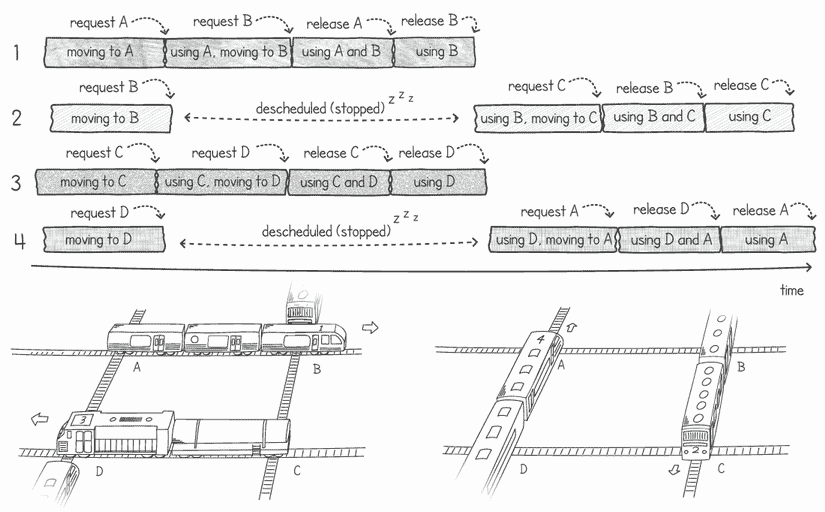

图 11.9 铁道交叉场景中的避免死锁

由 Edsger Dijkstra 开发的**银行家算法**就是这样一种算法，可以用来检查资源是否可以安全分配并避免死锁。只有当以下信息已知时，该算法才能使用：

+   每个执行可以请求的每种资源的最大数量

+   每个执行当前持有的资源

+   每种资源的可用数量

定义 使用这些信息，我们可以决定系统是处于*安全*还是*不可安全*状态。只有当存在一种方式可以调度我们的执行，使它们都能完成（从而避免死锁），即使它们请求最大数量的资源，我们的系统状态才被认为是*安全*的。否则，系统状态被认为是*不可安全*的。

该算法通过决定是否授予资源请求来工作。只有在分配资源后系统仍然处于安全状态的情况下，它才会授予资源请求。如果会导致不可安全状态，请求资源的执行将被暂停，直到可以安全地授予其请求。

例如，考虑一个可以以有限方式被多个执行使用的资源，例如具有固定会话数的数据库连接池。图 11.10 展示了安全和不可安全场景。在场景 A 中，如果执行*a*请求并获得另一个数据库会话资源，系统最终会进入不可安全状态，如场景 B 所示。这是因为没有方法可以授予任何执行其最大数量的资源。在场景 B 中，我们只剩下两个资源，但执行*a*、*b*和*c*可以请求额外的五个、三个和五个资源。现在不可避免地存在陷入死锁的风险。

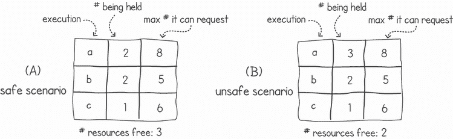

图 11.10 安全和不安全状态情景的示例

情景 A 被说成仍然处于安全状态，因为存在我们可以应用的调度，这将导致所有执行完成。在情景 A 中，我们仍然处于一个可以通过谨慎的资源分配来避免死锁的点。在图 11.10 的情景 A 中应用银行家算法，当它们请求更多资源时，我们可以挂起执行 *a* 和 *c*，因为批准这些请求会导致不安全状态。算法只会允许 *b* 的请求，因为批准这些请求将使系统处于安全状态。一旦 *b* 释放足够的资源，我们就可以将它们授予 *c*，然后是 *a*（见图 11.11）。


图 11.11 安全资源分配的序列

银行家算法也可以与多种资源一起工作，例如锁定我们账本应用中的不同银行账户，如第 11.1.2 节所述。然而，对于我们的应用，我们不需要实现完整的银行家算法，因为我们事先知道每个 goroutine 将需要的全部资源集合。由于我们只锁定两个特定的银行账户，即源账户和目标账户，因此如果这两个账户中的任何一个当前正被另一个 goroutine 使用，我们的系统可以挂起 goroutine 的执行。

为了实现这一点，我们可以创建一个仲裁者，其任务是挂起请求当前正在使用的账户的 goroutines 的执行。一旦账户变得可用，仲裁者可以恢复 goroutines 的执行。仲裁者可以通过使用条件变量来阻塞 goroutine 的执行，直到所有账户都变得可用。这种逻辑在图 11.12 中显示。


图 11.12 使用条件变量在账户不可用时挂起 goroutines

当一个 goroutine 从仲裁者请求正在使用的资源时，该 goroutine 被迫在条件变量上等待。当另一个 goroutine 释放资源时，它会广播，以便任何挂起的 goroutine 可以检查所需资源是否已变得可用。通过这种方式，我们避免了死锁，因为资源只有在全部可用时才会被锁定。

在列表 11.8 中，我们定义了将在仲裁者中使用的结构。我们还包括一个初始化结构体字段的函数。`accountsInUse` 映射用于标记任何当前正在用于资金转移的账户，而条件变量用于在账户在使用时挂起执行。

列表 11.8 构建仲裁者

```
type Arbitrator struct {
    accountsInUse map[string]bool      ❶
    cond *sync.Cond                    ❷
}

func NewArbitrator() *Arbitrator{
    return &Arbitrator{
        accountsInUse: map[string]bool{},
        cond:          sync.NewCond(&sync.Mutex{}),
    }
}
```

❶ 存储账户及其可用状态，要么是空闲的，要么是在使用中

❷ 用于在账户不可用时挂起 goroutines 的条件变量

接下来，我们需要实现一个函数，允许我们在账户空闲时阻塞它们，或者在账户不空闲时暂停 goroutine 的执行。这可以在列表 11.9 中看到，其中包含了`LockAccounts()`函数。该函数获取与条件变量关联的互斥锁，并使用`accountsInUse`映射检查所有账户是否空闲。如果任何账户正在使用中，goroutine 将在条件变量上调用`Wait()`。这将暂停 goroutine 的执行并解锁互斥锁。一旦执行恢复，goroutine 重新获取互斥锁，并重复此检查，直到所有账户都空闲。此时，映射被更新以指示资源正在使用中，互斥锁被解锁。这样，goroutine 在获取所有所需的账户之前永远不会执行转账逻辑。

列表 11.9 暂停执行以避免死锁

```
func (a *Arbitrator) LockAccounts(ids... string) {
    a.cond.L.Lock()                                 ❶
    for allAvailable := false; !allAvailable; {     ❷
        allAvailable = true
        for _, id := range ids {
            if a.accountsInUse[id] {                ❸
                allAvailable = false                ❸
                a.cond.Wait()                       ❸
            }
        }
    }
    for _, id := range ids {                        ❹
        a.accountsInUse[id] = true                  ❹
    }                                               ❹
    a.cond.L.Unlock()                               ❺
}
```

❶ 在条件变量上锁定互斥锁

❷ 循环直到所有账户都空闲

❸ 如果账户正在使用中，则暂停 goroutine 的执行

❹ 一旦所有账户都可用，将请求的账户标记为正在使用中

❺ 在条件变量上解锁互斥锁

一旦 goroutine 完成了其转账逻辑，它需要将账户标记为不再使用。列表 11.10 展示了`UnlockAccounts()`函数。调用此函数的 goroutine 持有条件变量的互斥锁，将所有所需的账户标记为空闲，然后在条件变量上广播。这会唤醒任何挂起的 goroutine，然后它们将继续检查其账户是否已可用。

列表 11.10 使用广播恢复 goroutine

```
func (a *Arbitrator) UnlockAccounts(ids... string) {
    a.cond.L.Lock()                   ❶
    for _, id := range ids {          ❷
        a.accountsInUse[id] = false   ❷
    }                                 ❷
    a.cond.Broadcast()                ❸
    a.cond.L.Unlock()                 ❹
}
```

❶ 在条件变量上锁定互斥锁

❷ 将账户标记为空闲

❸ 向挂起的 goroutine 发送广播以恢复其执行

❹ 在条件变量上解锁互斥锁

我们现在可以在我们的货币转账逻辑中使用这两个函数。下一个列表显示了修改后的`Transfer()`函数，它在进行货币转账之前调用`LockAccounts()`，并在之后调用`UnlockAccounts()`。

列表 11.11 在转账期间使用仲裁者锁定账户

```
func (src *BankAccount) Transfer(to *BankAccount, amount int, tellerId int,
    arb *Arbitrator) {
    fmt.Printf("*%d Locking %s and %s\n*", tellerId, src.id, to.id)
    arb.LockAccounts(src.id, to.id)       ❶
    src.balance -= amount                 ❷
    to.balance += amount                  ❷
    arb.UnlockAccounts(src.id, to.id)     ❸
    fmt.Printf("*%d Unlocked %s and %s\n*", tellerId, src.id, to.id)
}
```

❶ 锁定源账户和目标账户

❷ 在获得两个锁之后执行转账

❸ 在转账后解锁两个账户

最后，我们可以更新我们的`main()`函数以创建仲裁者实例并将其传递给 goroutine，以便在转账期间使用。这将在以下列表中展示。

列表 11.12 使用仲裁者（为简洁起见省略了导入）

```
package main

import (...)

func main() {
    accounts := []BankAccount{
        *NewBankAccount("*Sam*"),
        *NewBankAccount("*Paul*"),
        *NewBankAccount("*Amy*"),
        *NewBankAccount("*Mia*"),
    }
    total := len(accounts)
    arb := NewArbitrator()        ❶
    for i := 0; i < 4; i++ {
        go func(tellerId int) {
            for i := 1; i < 1000; i++ {
                from, to := rand.Intn(total), rand.Intn(total)
                for from == to {
                    to = rand.Intn(total)
                }
                accounts[from].Transfer(&accounts[to], 10, tellerId, arb)
            }
            fmt.Println(tellerId,"*COMPLETE*")
        }(i)
    }
    time.Sleep(60 * time.Second)
}
```

❶ 创建一个用于转账的新仲裁者

操作系统和语言运行时的死锁避免

能否在操作系统或 Go 的运行时中实现死锁避免算法，以便以避免死锁的方式调度执行？在实践中，当在操作系统和语言运行时中使用时，死锁避免算法，如银行家算法，并不非常有效，因为它们需要提前知道执行将需要的最大资源数量。这种要求是不切实际的，因为操作系统和运行时无法预期知道每个进程、线程或 goroutine 可能会提前请求哪些资源。

此外，银行家算法假设执行集不会改变。对于任何现实中的操作系统来说，进程都在不断启动和终止，这不是这种情况。

### 11.2.3 防止死锁

如果我们提前知道我们的并发执行将使用的全部独占资源集，我们可以使用排序来防止死锁。再次考虑列表 11.1 中概述的简单死锁。这个死锁发生是因为`red()`和`blue()` goroutine 各自以不同的顺序获取互斥锁。`red()` goroutine 使用锁 1 然后是锁 2，而`blue()`使用锁 2 然后是锁 1。如果我们改变列表，使它们以相同的顺序使用锁，如以下列表所示，死锁就不会发生。

列表 11.13 排序互斥锁防止死锁

```
func red(lock1, lock2 *sync.Mutex) {
    for {
        fmt.Println("*Red: Acquiring lock1*")
        lock1.Lock()
        fmt.Println("*Red: Acquiring lock2*")
        lock2.Lock()
        fmt.Println("*Red: Both locks Acquired*")
        lock1.Unlock(); lock2.Unlock()
        fmt.Println("*Red: Locks Released*")
    }
}

func blue(lock1, lock2 *sync.Mutex) {
    for {
        fmt.Println("*Blue: Acquiring lock1*")
        lock1.Lock()
        fmt.Println("*Blue: Acquiring lock2*")
        lock2.Lock()
        fmt.Println("*Blue: Both locks Acquired*")
        lock1.Unlock(); lock2.Unlock()
        fmt.Println("*Blue: Locks Released*")
    }
}
```

死锁没有发生，因为我们从未处于两个 goroutine 都持有不同锁并请求另一个锁的情况。在这种情况下，当它们同时尝试获取锁 1 时，只有一个 goroutine 会成功。另一个将被阻塞，直到两个锁都可用。这创造了一个情况，即 goroutine 可以获取所有锁或一个也不获取。

我们可以将此规则应用于我们的账目应用。每当我们要执行一个事务时，我们可以定义一个简单的规则，指定获取互斥锁的顺序。规则可能是我们应该根据账户 ID 的字母顺序获取锁。例如，如果我们有一个从 Mia 转到 Amy 的 10 美元转账事务，我们应该首先锁定 Amy 的账户，然后是 Mia 的，因为 Amy 的账户 ID 在字母顺序中排在前面。如果在同一时间，我们还有另一个从 Amy 转到 Mia 的 10 美元转账事务，这个事务将在其第一个锁请求（Amy 的锁）上被阻塞。这个例子在图 11.13 中显示。

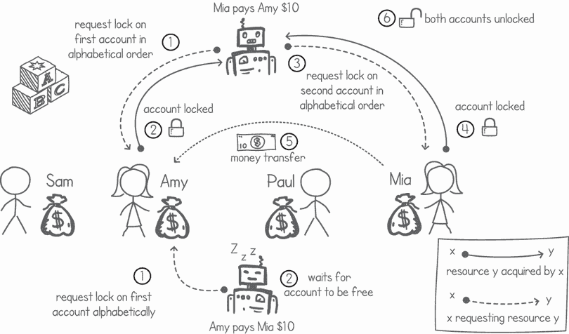

图 11.13 在账目应用中使用排序来避免死锁

在我们的账目应用示例中，为了简化，我们将账户 ID 等同于账户持有者的姓名。在实际应用中，账户 ID 可能是数字或版本 4 的 UUID，两者都可以排序。以下列表显示了我们对应用中修改后的转账函数，其中我们按账户 ID 对账户进行排序，然后按顺序锁定它们。

列表 11.14 账户转账函数排序

```
func (src *BankAccount) Transfer(to *BankAccount, amount int, tellerId int) {
    accounts := []*BankAccount{src, to}            ❶
    sort.Slice(accounts, func(a, b int) bool {     ❷
        return accounts[a].id < accounts[b].id     ❷
    })                                             ❷
    fmt.Printf("*%d Locking %s’s account\n*", tellerId, accounts[0].id)
    accounts[0].mutex.Lock()                       ❸
    fmt.Printf("*%d Locking %s’s account\n*", tellerId, accounts[1].id)
    accounts[1].mutex.Lock()                       ❹
    src.balance -= amount
    to.balance += amount
    to.mutex.Unlock()                              ❺
    src.mutex.Unlock()                             ❺
    fmt.Printf("*%d Unlocked %s and %s\n*", tellerId, src.id, to.id)
}
```

❶ 将源账户和目标账户放入一个切片中

❷ 按 ID 对包含两个账户的切片进行排序

❸ 按 ID 锁定优先级较低的账户

❹ 按 ID 锁定优先级更高的账户

❺ 解锁两个账户

现在，我们可以运行前面的函数并看到账户总是按字母顺序锁定。此外，所有 goroutines 都完成了任务而没有陷入任何死锁。以下是输出样本：

```
$ go run ledgermutexorder.go
3 Locking Amy’s account
2 Locking Amy’s account
3 Locking Paul’s account
3 Unlocked Amy and Paul
. . .
1 Locking Mia’s account
1 Locking Paul’s account
. . .
2 COMPLETE
. . .
0 COMPLETE
. . .
3 COMPLETE
. . .
1 COMPLETE
```

我们还可以使用这种排序策略来防止死锁，如果我们事先不知道需要使用哪些互斥资源。这里的想法是不要获取低于我们当前持有的资源优先级的资源。当出现需要我们获取更高优先级资源的情况时，我们总是可以释放所持有的资源，并按正确的顺序重新请求它们。

在我们的账本应用中，考虑一个正在执行特殊事务的 goroutine，例如：“从艾米的账户中支付保罗 10 美元；如果艾米的账户资金不足，则使用米娅的账户。”在这种情况下，我们可以在 goroutine 中编写逻辑以执行以下步骤：

1.  锁定艾米的账户。

1.  锁定保罗的账户。

1.  如果艾米的余额足以覆盖转账：

    1.  从艾米的账户中扣除资金并添加到保罗的账户中。

    1.  解锁艾米和保罗的账户。

1.  否则：

    1.  解锁艾米和保罗的账户。

    1.  锁定米娅的账户。

    1.  锁定保罗的账户。

    1.  从米娅的账户中扣除资金并添加到保罗的账户中。

    1.  解锁米娅和保罗的账户。

这里的重要规则是，如果执行过程中持有更高优先级的资源，则绝不要锁定低优先级的资源。在这个例子中，我们必须在锁定米娅的账户之前释放保罗和艾米账户。这确保了我们永远不会陷入死锁状态。

## 11.3 使用通道的死锁

重要的是要理解，死锁不仅限于互斥锁的使用。当执行过程中持有互斥资源并请求其他资源时，都可能发生死锁——这也适用于通道。通道的容量可以被视为一个互斥资源。Goroutines 可以在持有通道的同时尝试使用另一个通道（通过发送或接收消息）。

我们可以将通道视为包含读取和写入资源的集合。最初，非缓冲通道没有读取和写入资源。当另一个 goroutine 尝试写入消息时，读取资源变得可用。写入操作在尝试获取写入资源的同时使一个读取资源可用。同样，读取操作在尝试获取一个读取资源的同时使一个写入资源可用。

让我们看看一个涉及两个通道的死锁示例。考虑一个简单的程序，它需要递归地输出文件详细信息，例如目录下所有文件的文件名、文件大小和最后修改日期。一个解决方案是有一个 goroutine 处理文件，另一个处理目录。目录 goroutine 的任务是读取目录内容，并使用通道将每个文件提供给文件处理程序。这将在下面的`handleDirectories()`函数中显示。

列表 11.15 目录处理程序（为了简洁，省略了错误处理）

```
package main

import (
    "*fmt*"
    "*os*"
    "*path/filepath*"
    "*time*"
)

func handleDirectories(dirs <-chan string, files chan<- string) {
    for fullpath := range dirs {                                    ❶
        fmt.Println("*Reading all files from*", fullpath)
        filesInDir, _ := os.ReadDir(fullpath)                       ❷
        fmt.Printf("*Pushing %d files from %s\n*", len(filesInDir), fullpath)
        for _, file := range filesInDir {                           ❸
            files <- filepath.Join(fullpath, file.Name())           ❸
        }                                                           ❸
    }
}
```

❶ 从输入主题读取完整的目录路径

❷ 读取目录的内容

❸ 将目录内容的每个项目推送到输出主题

在文件处理程序的 goroutine 中发生相反的情况。当文件处理程序遇到一个新的目录时，它将其发送到目录处理程序的通道。如果项目是文件，文件处理程序会从输入通道消费项目，并输出有关它的信息，例如文件大小和最后修改日期。如果项目是目录，它将目录转发给目录处理程序。这将在下面的列表中显示。

列表 11.16 文件处理程序（为了简洁，省略了错误处理）

```
func handleFiles(files chan string, dirs chan string) {
    for path := range files {                                        ❶
        file, _ := os.Open(path)
        fileInfo, _ := file.Stat()                                   ❷
        if fileInfo.IsDir() {                                        ❸
            fmt.Printf("*Pushing %s directory\n*", fileInfo.Name())    ❸
            dirs <- path                                             ❸
        } else {                                                     ❹
            fmt.Printf("*File %s, size: %dMB, last modified: %s\n*",
                fileInfo.Name(), fileInfo.Size() / (1024 * 1024),
                fileInfo.ModTime().Format("*15:04:05*"))
        }
    }
}
```

❶ 读取文件的完整路径

❷ 读取有关文件的信息

❸ 如果文件是目录，则将其写入输出通道

❹ 如果文件不是目录，则在控制台上显示文件信息

我们现在可以使用`main()`函数将两个 goroutine 连接起来。在列表 11.17 中，我们创建了两个通道并将它们传递给新创建的文件和目录处理程序 goroutine。然后我们将从参数中读取的初始目录推送到目录通道。为了简化列表（用于演示目的），我们让`main()` goroutine 睡眠 60 秒而不是使用 waitgroups 等待 goroutine 完成。

列表 11.17 `main()`函数创建文件和目录处理程序

```
func main() {
    filesChannel := make(chan string)                   ❶
    dirsChannel := make(chan string)                    ❶
    go handleFiles(filesChannel, dirsChannel)           ❷
    go handleDirectories(dirsChannel, filesChannel)     ❷
    dirsChannel <- os.Args[1]                           ❸
    time.Sleep(60 * time.Second)                        ❹
}
```

❶ 创建文件和目录通道

❷ 启动文件和目录处理程序 goroutine

❸ 从目录参数向目录通道提供数据

❹ 睡眠 60 秒

当我们在具有一些子目录的目录上运行所有列表时，我们立即陷入死锁。以下示例输出显示了目录处理程序尝试将 26 个文件推送到通道后不久，文件处理程序的 goroutine 尝试发送名为`CodingInterviewWorkshop`的目录时 goroutine 发生死锁：

```
$ go run allfilesinfo.go ~/projects/
Reading all files from ~/projects/
Pushing 26 files from ~/projects/
File .DS_Store, size: 8.00KB, last modified: Mon Mar 13 13:50:45 2023
Pushing CodingInterviewWorkshop directory
```

这里显示的死锁问题在图 11.14 中。我们在两个 goroutine 之间创建了一个循环等待条件。目录处理程序正在等待文件处理程序的 goroutine 从`files`通道读取，同时它阻止对`dirs`通道的任何写入。文件处理程序正在等待目录处理程序的 goroutine 从`dirs`通道读取，同时它阻止对`files`通道的任何写入。

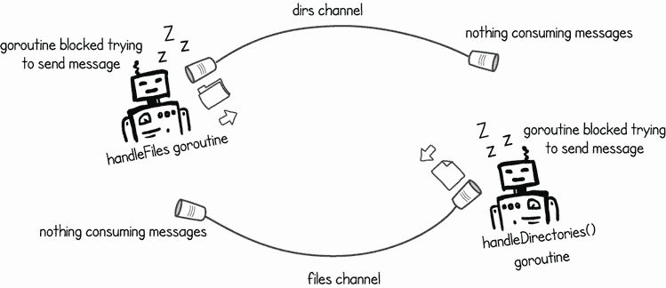

图 11.14 两个通道的死锁

我们可能会想，通过在文件或目录通道上添加缓冲区来解决死锁问题。然而，这只会推迟死锁的发生。一旦我们遇到一个文件或子目录数量超过我们缓冲区处理能力的目录，问题仍然会出现。

我们还可以尝试增加运行文件处理器的 goroutine 数量。毕竟，一个典型的文件系统中的文件数量远多于目录。然而，这只会延迟问题。一旦我们的程序导航到一个包含的文件数量超过执行`handleFiles()`的 goroutine 数量的目录，我们又将陷入死锁状态。

我们可以通过移除循环等待来防止这种场景下的死锁。一个简单的方法是将我们的一个函数修改为通过使用新创建的 goroutine 来发送通道。列表 11.18 修改了`handleDirectories()`函数，使其每次需要将新文件推送到`files`通道时都启动一个新的 goroutine。这样，我们就让 goroutine 摆脱了等待通道可用的需要，并将等待委托给另一个 goroutine，从而打破了循环等待。

列表 11.18 使用单独的 goroutine 在通道上写入

```
func handleDirectories(dirs <-chan string, files chan<- string) {
    for fullpath := range dirs {
        fmt.Println("*Reading all files from*", fullpath)
        filesInDir, _ := os.ReadDir(fullpath)
        fmt.Printf("*Pushing %d files from %s\n*", len(filesInDir), fullpath)
        for _, file := range filesInDir {
            go func(fp string) {                       ❶
                files <- fp                            ❶
            }(filepath.Join(fullpath, file.Name()))    ❶
        }
    }
}
```

❶ 启动一个新的 goroutine，将每个文件发送到文件通道

一种不涉及创建大量单独 goroutine 的替代解决方案是使用`select`语句同时从我们的通道读取和写入。这同样会打破使用通道时导致死锁的循环等待。我们可以在目录或文件 goroutine 中采用这种方法。以下列表显示了`handleDirectories()` goroutine 的示例。

列表 11.19 使用`select`来打破循环等待

```
func handleDirectories(dirs <-chan string, files chan<- string) {
    toPush := make([]string, 0)                                         ❶
    appendAllFiles := func(path string) {
        fmt.Println("*Reading all files from*", path)
        filesInDir, _ := os.ReadDir(path)
        fmt.Printf("*Pushing %d files from %s\n*", len(filesInDir), path)
        for _, f := range filesInDir {                                  ❷
            toPush = append(toPush, filepath.Join(path, f.Name()))      ❷
        }                                                               ❷
    }
    for {
        if len(toPush) == 0 {                                           ❸
            appendAllFiles(<-dirs)                                      ❸
        } else {
            select {
            case fullpath := <-dirs:                                    ❹
                appendAllFiles(fullpath)                                ❹
            case files <- toPush[0]:                                    ❺
                toPush = toPush[1:]                                     ❻
            }
        }
    }
}
```

❶ 创建一个切片来存储需要推送到文件处理器通道的文件

❷ 将目录中的所有文件追加到切片中

❸ 如果没有文件要推送，则从输入通道读取目录，并将目录中的所有文件添加

❹ 从输入通道读取下一个目录，并将目录中的所有文件添加

❺ 将切片中的第一个文件推送到通道

❻ 从切片中移除第一个文件

根据哪个通道可用，让我们的 goroutine 完成接收或发送操作，可以消除导致死锁的循环等待。如果文件处理器的 goroutine 正忙于在其输出通道上发送目录路径，我们的目录 goroutine 不会被阻塞，仍然可以接收目录路径。`select`语句允许我们同时等待两个操作。目录的内容追加到切片中，以便当输出通道可用时，它们被推送到通道。

注意：在消息传递程序中存在死锁通常是一个程序设计不良的迹象。在使用通道时出现死锁意味着我们已经编写了一个通过相同 goroutines 传递的循环消息流。大多数情况下，我们可以通过设计程序使消息流不循环来避免可能的死锁。

## 11.4 练习

注意：访问 [`github.com/cutajarj/ConcurrentProgrammingWithGo`](http://github.com/cutajarj/ConcurrentProgrammingWithGo) 以查看所有代码解决方案。

1.  在以下列表中，`incrementScores()` 如果与多个 goroutines 并发运行可能会产生死锁。你能修改这个函数以避免或防止死锁吗？

    列表 11.20 玩家分数的死锁

    ```
    type Player struct {
        name  string
        score int
        mutex sync.Mutex
    }

    func incrementScores(players []*Player, increment int) {
        for _, player := range players {
            player.mutex.Lock()
        }
        for _, player := range players {
            player.score += increment
        }
        for _, player := range players {
            player.mutex.Unlock()
        }
    }
    ```

1.  在列表 11.19 中，我们修改了 `handleDirectories()` 函数，使其使用 `select` 语句来避免两个 goroutines 之间的循环等待。你也能以同样的方式修改列表 11.16 中的 `handleFiles()` 函数吗？goroutine 应该使用 `select` 语句在两个通道上同时接收和发送。

## 摘要

+   死锁是指程序有多个执行无限期地阻塞，等待彼此释放各自的资源。

+   资源分配图（RAG）通过连接它们来显示执行如何使用资源。

+   在 RAG 中，一个请求资源的执行是通过从执行到资源的定向边来表示的。

+   在 RAG（资源分配图）中，一个执行持有资源是通过从资源到执行的定向边来表示的。

+   当 RAG 包含一个循环时，它表示系统处于死锁状态。

+   可以在 RAG 上使用图循环检测算法来检测死锁。

+   Go 的运行时提供了死锁检测，但它只能在所有 goroutines 都阻塞的情况下检测到死锁。

+   当 Go 的运行时检测到死锁时，整个程序将带错误退出。

+   通过以特定方式调度执行来避免死锁只能在事先知道将使用哪些资源的情况下进行。

+   可以通过以预定义的顺序请求资源来程序化地防止死锁。

+   死锁也可能出现在使用 Go 通道的程序中。通道的容量可以被视为一个互斥资源。

+   在使用通道时，请注意避免循环等待，以防止死锁。

+   通过使用单独的 goroutines 发送或接收，通过将通道操作与 `select` 语句结合，或者通过更好地设计程序以避免循环消息流，可以使用通道避免循环等待。
