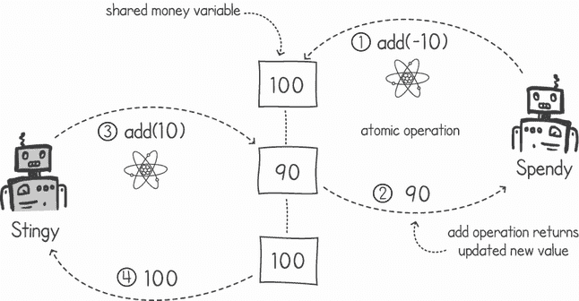
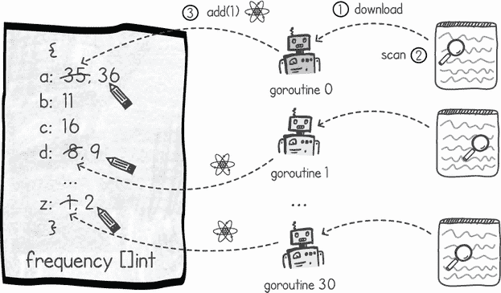
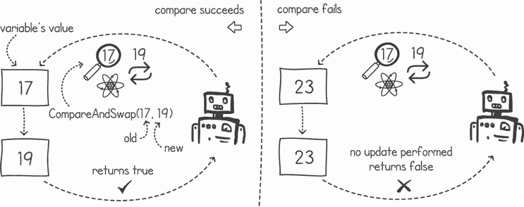
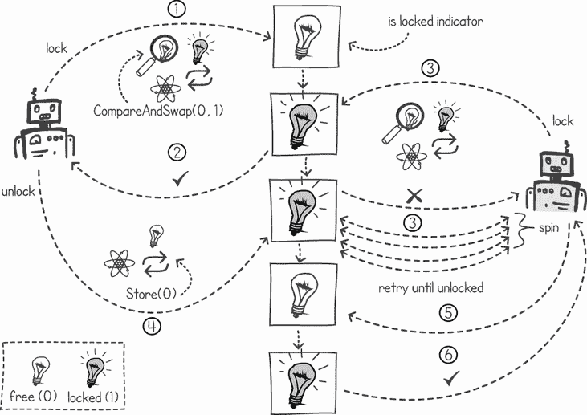
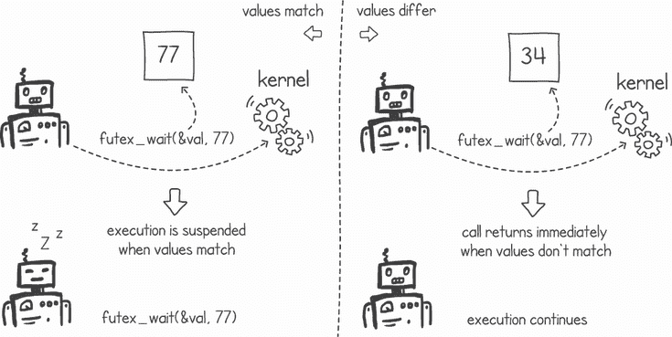
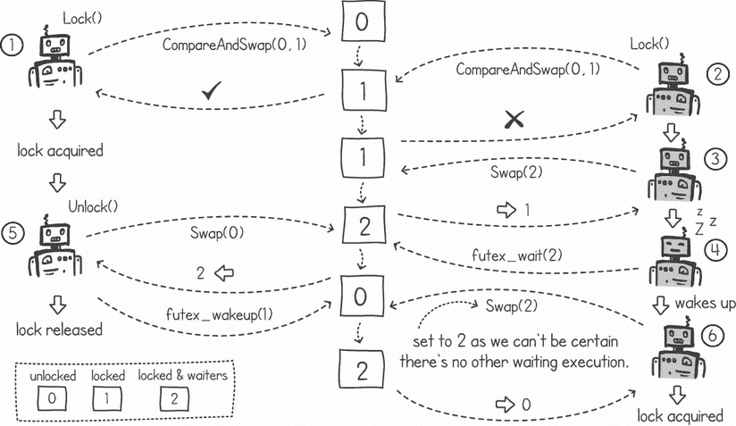
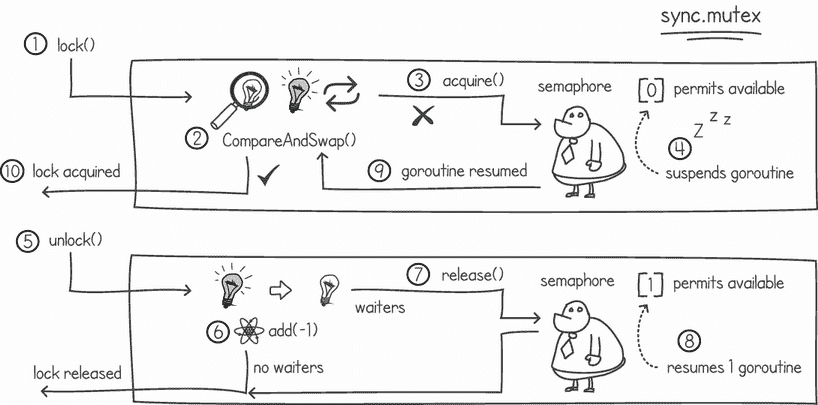

# 12 原子操作、自旋锁和 futex

本章涵盖

+   使用原子变量进行同步

+   使用自旋锁开发互斥锁

+   使用 futex 提升自旋锁

在前面的章节中，我们使用了互斥锁来同步线程对共享变量的访问。我们还看到了如何使用互斥锁作为原语来构建更复杂的并发工具，如信号量和通道。我们尚未探讨这些互斥锁是如何构建的。

在本章中，我们将介绍同步工具中最基础的：原子变量。然后，我们将探讨如何使用它通过称为 *自旋锁* 的技术来构建互斥锁。稍后，我们将看到如何通过使用 futex（一个操作系统调用，允许我们在等待锁变为空闲时减少 CPU 循环次数）来优化互斥锁的实现。最后，我们将关注 Go 如何实现捆绑的互斥锁。

## 12.1 使用原子变量进行无锁同步

互斥锁确保我们的并发代码的关键部分一次只由一个 goroutine 执行。它们用于防止竞态条件。然而，互斥锁的效果是将我们的并发编程的部分转变为顺序瓶颈。如果我们只是更新一个简单的变量，例如一个整数，我们可以使用原子变量来在 goroutines 之间保持一致性，而无需依赖于将我们的代码转变为顺序块的互斥锁。

### 12.1.1 使用原子数共享变量

在前面的章节中，我们查看了一个名为 Stingy 和 Spendy 的两个 goroutine 的示例，它们共享一个表示其银行账户的整数变量。对共享变量的访问是通过互斥锁保护的。每次我们想要更新变量时，我们都会获取互斥锁。一旦我们完成更新，我们就会释放它。

原子变量允许我们执行某些不会中断的操作。例如，我们可以在单个原子操作中向现有共享变量的值中添加，这保证了并发添加操作不会相互干扰。一旦操作执行，它就会完全应用到变量的值上，而不会中断。我们可以在某些场景下使用原子变量来替换互斥锁。

例如，我们可以轻松地将我们的 Stingy 和 Spendy 程序更改为使用这些原子变量操作。我们不会使用互斥锁，而是简单地在我们的共享金钱变量上调用原子 `add()` 操作。这保证了 goroutines 不会产生导致不一致结果的竞态条件（见图 12.1）。



图 12.1 在 Stingy 和 Spendy 上使用原子变量

在 Go 中，原子操作位于 `sync/atomic` 包中。该包中的所有调用都接受一个指向要执行原子操作的变量的指针。以下是从 `sync/atomic` 包中可以应用于 32 位整数的函数列表：

```
func AddInt32(addr *int32, delta int32) (new int32)
func CompareAndSwapInt32(addr *int32, old, new int32) (swapped bool)
func LoadInt32(addr *int32) (val int32)
func StoreInt32(addr *int32, val int32)
func SwapInt32(addr *int32, new int32) (old int32)
```

注意：相同的`atomic`包包含其他数据类型（如布尔型和无符号整数）的类似操作。

对于我们的 Stingy 和 Spendy 应用程序，我们可以在每次想要向或从共享变量中添加或减去时使用`AddInt32()`操作，如以下列表所示。除了将加法和减法更改为使用原子操作外，我们还消除了使用任何互斥锁的需要。

列表 12.1 使用原子操作的 Stingy 和 Spendy

```
package main

import (
    "*fmt*"
    "*sync*"
    "*sync/atomic*"                      ❶
)

func stingy(money *int32) {
    for i := 0; i < 1000000; i++ {
        atomic.AddInt32(money, 10)     ❷
    }
    fmt.Println("*Stingy Done*")
}

func spendy(money *int32) {
    for i := 0; i < 1000000; i++ {
        atomic.AddInt32(money, -10)    ❸
    }
    fmt.Println("*Spendy Done*")
}
```

❶ 导入原子包

❷ 原子地将 10 美元添加到共享的金钱变量中

❸ 原子地从共享的金钱变量中减去 10 美元

注意：`AddInt32()`函数在添加 delta 后返回新值。然而，在我们的 Stingy 和 Spendy goroutines 中，我们没有使用返回值。

我们可以通过使用`LoadInt32()`函数调用来修改我们的`main()`函数，以便读取原子变量的值。以下列表使用 waitgroup 等待 goroutines 完成，然后读取共享的`money`变量。

列表 12.2 使用原子变量的`main()`函数

```
func main() {
    money := int32(100)                                         ❶
    wg := sync.WaitGroup{}
    wg.Add(2)
    go func() {
        stingy(&money)
        wg.Done()
    }()
    go func() {
        spendy(&money)
        wg.Done()
    }()
    wg.Wait()                                                   ❷
    fmt.Println("*Money in account:* ", atomic.LoadInt32(&money)) ❸
}
```

❶ 创建一个值为 100 的 32 位整数

❷ 等待 waitgroup 直到两个 goroutines 都完成

❸ 读取共享金钱变量的值并在控制台上输出

如预期的那样，当我们一起运行列表 12.1 和 12.2 时，我们没有得到任何竞争条件，共享的`money`变量的最终值是 100 美元：

```
$ go run atomicstingyspendy.go
Spendy Done
Stingy Done
Money in account:  100
```

### 12.1.2 使用原子时的性能惩罚

为什么我们不直接使用原子操作来消除共享变量和意外忘记使用同步技术的风险呢？不幸的是，每次我们使用这些原子变量时，都需要付出性能代价。以正常方式更新变量比使用原子操作更新变量要快得多。

让我们看看这个性能差异。列表 12.3 使用 Go 的内置基准测试工具来测试原子更新变量与普通更新相比有多快。在 Go 中，我们可以通过在函数签名前缀添加`Benchmark`并使函数接受`testing.B`类型来编写基准单元测试。列表 12.3 展示了这个例子。在第一个基准函数中，我们使用正常的读取和更新操作更新`total` 64 位整数，而在第二个中，我们使用原子的`AddInt64()`操作来更新它。当使用 Go 的基准函数时，`bench.N`是我们基准将执行的迭代次数。此值会动态变化，以确保测试运行特定的时间（默认为 1 秒）。

列表 12.3 微基准测试原子加法运算符

```
package main

import (
    "sync/atomic"
    "testing"
)

var total = int64(0)                       ❶

func BenchmarkNormal(bench *testing.B) {
    for i := 0; i < bench.N; i++ {
        total += 1                         ❷
    }
}

func BenchmarkAtomic(bench *testing.B) {
    for i := 0; i < bench.N; i++ {
        atomic.AddInt64(&total, 1)         ❸
    }
}
```

❶ 创建一个 64 位整数

❷ 使用普通加法运算符向总变量中添加

❸ 使用原子操作函数向总变量中添加

我们现在可以通过在`go test`命令中添加`-bench`标志来运行这个基准测试。这个测试将告诉我们原子变量操作和普通变量操作之间的性能差异。以下是输出结果：

```
$ go test -bench=. -count 3
goos: darwin
goarch: arm64
pkg: github.com/cutajarj/ConcurrentProgrammingWithGo/chapter12/listing12.3
BenchmarkNormal-10      555129141           2.158 ns/op
BenchmarkNormal-10      550122879           2.163 ns/op
BenchmarkNormal-10      555068692           2.167 ns/op
BenchmarkAtomic-10      174523189           6.865 ns/op
BenchmarkAtomic-10      175444462           6.902 ns/op
BenchmarkAtomic-10      175469658           6.869 ns/op
PASS
ok    github.com/cutajarj/ConcurrentProgrammingWithGo/chapter12/listing12.3  
➥ 9.971s
```

我们的微基准测试结果表明，在 64 位整数上进行原子加法比使用正常操作慢三倍以上。这些结果会因不同的系统和架构而异，但在所有系统中，性能差异都是显著的。这是因为当使用原子时，我们放弃了编译器和系统的大量优化。例如，当我们像列表 12.3 中那样重复访问相同的变量时，系统会将变量保存在处理器的缓存中，使访问变量更快，但可能会定期将变量刷新回主内存，尤其是在缓存空间不足时。当使用原子时，系统需要确保任何并行运行的执行都能看到变量的更新。因此，每当使用原子操作时，系统都需要保持缓存的变量一致性。这可以通过刷新到主内存并使任何其他缓存无效来实现。需要保持各种缓存一致性最终会导致我们的程序性能降低。

### 12.1.3 使用原子数计数

使用原子变量的典型应用场景是在需要从多次执行中计数相同事物的出现次数时。在第三章中，我们开发了一个程序，该程序使用了多个 goroutine 来下载网页并计算英语字母的频率。每个字母的总计数保存在一个共享的切片数据结构中。后来，在第四章中，我们添加了一个互斥锁来确保对共享切片的更新是一致的。

我们可以将实现方式改为每次需要增加切片中字母的计数时都使用原子更新。图 12.2 显示我们仍然在使用内存共享，但这次我们只是向变量发送原子更新。之前的方法使用了读取值然后写入更新的两个步骤，迫使我们使用互斥锁。通过使用原子更新，如果我们需要更新计数，就不必等待另一个 goroutine 释放互斥锁。我们的 goroutine 将无任何阻塞中断地运行。即使两个 goroutine 试图同时应用原子更新，这两个更新也会顺序执行，不会发生冲突。



图 12.2 使用原子操作进行我们的字母频率程序

列表 12.4 通过移除互斥锁的锁定和解锁操作，修改了`countLetters()`函数的先前实现，并改用原子变量操作。在列表中，我们直接使用切片中包含的整数的引用，并在遇到字母时每次增加计数`1`。

列表 12.4 `countLetters()` 中的原子变量（省略了导入）

```
package main

import (...)

const allLetters = "*abcdefghijklmnopqrstuvwxyz*"

func countLetters(url string, frequency []int32) {
    resp, _ := http.Get(url)
    defer resp.Body.Close()
    if resp.StatusCode != 200 {
        panic("*Server returning error code:* " + resp.Status)
    }
    body, _ := io.ReadAll(resp.Body)                 ❶
    for _, b := range body {                         ❷
        c := strings.ToLower(string(b))
        cIndex := strings.Index(allLetters, c)       ❸
        if cIndex >= 0 {                             ❸
            atomic.AddInt32(&frequency[cIndex], 1)   ❹
        }
    }
    fmt.Println("*Completed:*", url)
}
```

❶ 读取网页正文

❷ 遍历文档正文中的每个字母

❸ 检查字母是否是英语字母表的一部分

❹ 使用原子加操作来增加字母的计数

接下来，我们需要稍微修改 `main()` 函数，以便切片数据结构使用 32 位整数。这是必需的，因为原子操作仅在特定的数据类型上工作，例如 `int32` 或 `int64`。此外，我们需要使用原子函数 `LoadInt32()` 来读取结果。以下列表显示了一个经过这些更改的 `main()` 函数，并使用等待组等待所有协程完成。

列表 12.5 原子字母计数器的 `main()` 函数

```
func main() {
    wg := sync.WaitGroup{}
    wg.Add(31)
    var frequency = make([]int32, 26)                                 ❶
    for i := 1000; i <= 1030; i++ {
        url := fmt.Sprintf("*https://rfc-editor.org/rfc/rfc%d.txt*", i)
        go func() {
            countLetters(url, frequency)
            wg.Done()
        }()
    }
    wg.Wait()                                                         ❷
    for i, c := range allLetters {
        fmt.Printf("*%c-%d* ", c, atomic.LoadInt32(&frequency[i]))      ❸
    }
}
```

❶ 创建一个大小为 26 的 32 位整数切片

❷ 等待直到所有协程完成

❸ 从频率切片中加载每个计数值并在控制台上输出它们

注意：在上面的列表中，使用 `LoadInt32()` 函数并不是严格必要的，因为所有协程都已完成，我们读取结果时。然而，当与原子一起工作时，使用原子加载操作是一种好习惯，以确保我们从主内存中读取最新的值，而不是过时的缓存值。

在第三章，当我们没有使用任何互斥锁运行字母频率应用程序时（列表 3.2 和 3.4），它产生了不一致的结果。使用原子变量与使用互斥锁消除竞争条件的效果相同。然而，这次，我们的协程并没有互相阻塞。以下是当我们一起运行列表 12.4 和 12.5 时的输出：

```
$ go run atomiccharcounter.go
Completed: https://rfc-editor.org/rfc/rfc1018.txt
. . . 
Completed: https://rfc-editor.org/rfc/rfc1002.txt
a-103445 b-23074 c-61005 d-51733 e-181360 f-33381 g-24966 h-47722 i-103262 j-3279 k-8839 l-49958 m-40026 n-108275 o-106320 p-41404 q-3410 r-101118 s-101040 t-136812 u-35765 v-13666 w-18259 x-4743 y-18416 z-1404
```

## 12.2 使用自旋锁实现互斥锁

在上一个场景中，我们修改了字母频率程序以使用原子变量。这些更改很简单，因为我们只需要一次更新一个变量。那么，当我们有一个需要同时更新多个变量的应用程序时怎么办呢？在上一章中，我们有一个这样的场景——账本应用程序需要从一个账户中减去钱并添加到另一个账户中。在那个例子中，我们使用了互斥锁来保护多个账户。我们在整本书中使用了互斥锁，但从未查看过它们的实现细节。让我们选择一个必须使用互斥锁的不同场景，然后使用原子操作，这样我们就可以使用称为 *自旋锁* 的技术来构建自己的互斥锁实现。

假设我们正在为一家航空公司开发航班预订软件。当预订航班时，客户希望购买整个航线的机票，或者如果航线的一部分不可用，则根本不购买。图 12.3 显示了我们要解决的问题。当我们向用户展示整个航线有座位可用，而在此期间有人预订了部分航线的最后一张座位，整个购买就需要取消。否则，我们可能会让客户购买无用的机票，而这些机票并不能带他们到达他们想要的目的地。更糟糕的是，如果外程预订成功，但回程航班预订失败（因为座位已满），乘客可能会在目的地滞留。航班预订软件需要具备控制措施来避免这类竞争条件。


图 12.3 一个编写不良的航班预订系统并发程序会导致竞争条件。

要实现这样一个预订系统，我们可以将每趟航班建模为一个独立的实体，包含诸如出发地、目的地、航班剩余座位数、出发时间、飞行时间等详细信息。使用原子操作来更新航班剩余座位数并不能解决图 12.3 中概述的竞争条件，因为当客户同时预订多趟航班时，我们需要确保我们以原子单元更新所有预订航班上的剩余座位变量。原子变量只能保证一次只对一个变量进行原子更新。

为了解决这个问题，我们可以采用与账本应用相同的方法，即对每个账户加锁。在这种情况下，在调整每趟航班之前，我们将对客户预订的每趟航班获取锁。列表 12.6 展示了我们如何使用结构类型来建模每趟航班的详细信息。在这个实现中，我们保持简单，只存储航班的出发地和目的地以及航班剩余的座位数。我们还使用了`Locker`接口，该接口只包含两个函数：`Lock()`和`Unlock()`。这正是互斥锁实现的接口。

列表 12.6 表示航班的结构类型

```
package listing12_6

import (
    "*sync*"
)

type Flight struct {
    Origin, Dest string
    SeatsLeft int
    Locker    sync.Locker    ❶
}
```

❶ 提供一个包含锁定和解锁功能的接口

现在我们可以开发一个函数，当给定包含航班列表的预订时，调整`SeatsLeft`变量。列表 12.7 实现了这个函数，只有在输入切片中的所有航班都包含足够的座位来满足预订请求时才返回`true`。实现从使用起点和终点对输入航班列表进行字母排序开始。这种排序是为了避免死锁（见第十一章）。然后函数通过锁定所有请求的航班，以确保在更新它们时每个航班的剩余座位数不会改变。然后我们检查每个航班是否包含足够的座位来满足预订请求。如果它们都满足，我们将每个航班的座位数减少客户想要购买的座位数。

列表 12.7 航班预订函数

```
package listing12_7

import (
    "*github.com/cutajarj/ConcurrentProgrammingWithGo/chapter12/listing12.6*"
    "*sort*"
)

func Book(flights []*listing12_6.Flight, seatsToBook int) bool {
    bookable := true
    sort.Slice(flights, func(a, b int) bool {             ❶
        flightA := flights[a].Origin + flights[a].Dest    ❶
        flightB := flights[b].Origin + flights[b].Dest    ❶
        return flightA < (flightB)                        ❶
    })
    for _, f := range flights {                           ❷
        f.Locker.Lock()                                   ❷
    }
    for i := 0; i < len(flights) && bookable; i++ {       ❸
        if flights[i].SeatsLeft < seatsToBook {           ❸
            bookable = false                              ❸
        }                                                 ❸
    }
    for i := 0; i < len(flights) && bookable; i++ {       ❹
        flights[i].SeatsLeft-=seatsToBook                 ❹
    }
    for _, f := range flights {                           ❺
        f.Locker.Unlock()                                 ❺
    }
    return bookable                                       ❻
}
```

❶ 根据起点和目的地对航班进行字母排序

❷ 锁定所有请求的航班

❸ 检查所有请求的航班是否有足够的座位

❹ 仅在预订所需的所有座位都足够的情况下，从每个航班中减去座位数

❺ 解锁所有已锁定的航班

❻ 返回预订的结果

我们可以使用 Go 的`sync.mutex`，因为这为我们提供了`Lock()`和`Unlock()`函数，但相反，让我们利用这个机会来实现我们自己的`sync.Locker`实现。通过这样做，我们将学习如何实现互斥锁。

### 12.2.1 比较和交换

原子变量的任何操作能帮助我们实现互斥锁吗？`CompareAndSwap()`函数可以用来检查并设置一个标志，指示资源已被锁定。这个函数通过接受一个值指针和`old`和`new`参数来工作。如果`old`参数等于指针存储的值，则值被更新为与`new`参数匹配。这个操作（就像`atomic`包中的所有操作一样）是原子的，因此不能被其他执行中断。

图 12.4 显示了`CompareAndSwap()`函数在两种场景下的使用。图中的左侧，变量的值是我们预期的，等于`old`参数。在这种情况下，值被更新为`new`参数的值，并且函数返回`true`。图中的右侧显示了当我们对一个不等于`old`参数的值调用函数时会发生什么。在这种情况下，更新不会被应用，函数返回`false`。



图 12.4 `CompareAndSwap()`函数在两种场景下的操作

这两种情况可以在列表 12.8 中看到实际操作。我们使用相同的参数调用同一个函数两次。对于第一次调用，我们将变量设置为与旧参数相同的值，而对于第二次调用，我们改变变量的值使其与旧参数不同。

列表 12.8 应用`CompareAndSwap()`函数

```
package main

import (
    "*fmt*"
    "*sync/atomic*"
)

func main() {
    number := int32(17)                                                    ❶
    result := atomic.CompareAndSwapInt32(&number, 17, 19)                  ❷
    fmt.Printf("*17 <- swap(17,19): result %t, value: %d\n*", result, number)
    number = int32(23)                                                     ❸
    result = atomic.CompareAndSwapInt32(&number, 17, 19)                   ❹
    fmt.Printf("*23 <- swap(17,19): result %t, value: %d\n*", result, number)
}
```

❶ 在 CompareAndSwap()中将变量设置为与旧参数相同的值

❷ 更改变量的值并返回 true

❸ 在 CompareAndSwap() 上设置变量为与旧参数不同的值

❹ 比较失败，变量值保持不变，并返回 false

当我们运行前面的代码列表时，第一次调用成功，更新了变量并返回 `true`。在更改变量的值之后，第二次调用失败，`CompareAndSwap()` 函数返回 `false`，变量保持不变。以下是输出：

```
$ go run atomiccompareandswap.go
17 <- swap(17,19): result true, value: 19
23 <- swap(17,19): result false, value: 23
```

现在我们知道了 `CompareAndSwap()` 函数的工作原理，让我们看看它是如何帮助我们实现 `Locker` 接口的。

### 12.2.2 构建互斥锁

我们可以使用 `CompareAndSwap()` 函数在用户空间中完全实现互斥锁，而无需依赖于操作系统。我们将首先使用原子变量作为指示器，显示互斥锁是否被锁定。然后我们可以使用 `CompareAndSwap()` 函数在需要锁定互斥锁时检查和更新指示器的值。要解锁互斥锁，我们可以调用原子变量的 `Store()` 函数。图 12.5 展示了这一概念。



图 12.5 实现自旋锁

如果指示器显示为空闲，`CompareAndSwap(unlocked, locked)` 将成功，并将指示器更新为锁定。如果指示器显示为锁定，`CompareAndSwap(unlocked, locked)` 操作将失败，返回 `false`。在这种情况下，我们可以继续重试，直到指示器值改变并变为解锁。这种类型的互斥锁称为自旋锁。

定义 A *自旋锁* 是一种锁，其中执行将进入循环以重复尝试获取锁，直到锁变为可用。

要实现我们的自旋锁指示器，我们可以使用一个整型变量。该整型变量可以具有 `0` 的值，表示锁是空闲的，如果它被锁定，则具有 `1` 的值。在列表 12.9 中，我们使用 32 位整数作为我们的指示器。

列表还展示了如何实现 `lock()` 和 `Unlock()` 函数，完全实现 `Locker` 接口。在 `lock()` 函数中，循环调用 `CompareAndSwap()` 操作，直到调用成功并原子变量更新为 `1`。这是我们锁的自旋部分。锁定自旋锁的 goroutine 将继续循环，直到锁变为空闲。在 `Unlock()` 函数中，我们只需调用原子的 `Store()` 函数将指示器的值设置为 `0`，表示锁是空闲的。

列表 12.9 自旋锁实现

```
package listing12_9

import (
    "*runtime*"
    "*sync*"
    "*sync/atomic*"
)

type SpinLock int32                                        ❶

func (s *SpinLock) Lock() {
    for !atomic.CompareAndSwapInt32((*int32)(s), 0, 1) {   ❷
        runtime.Gosched()                                  ❸
    }
}

func (s *SpinLock) Unlock() {
    atomic.StoreInt32((*int32)(s), 0)                      ❹
}

func NewSpinLock() sync.Locker {
    var lock SpinLock
    return &lock
}
```

❶ 值为 0 表示锁是空闲的，而值为 1 表示锁已被锁定。

❷ 循环直到 CompareAndSwap() 成功并将值设置为 1

❸ 调用 Go 调度器以给其他 goroutines 分配执行时间

❹ 更新整数值为 0，标记锁为空闲

在我们的自旋锁实现中，每次 goroutine 发现锁已被另一个 goroutine 使用时，我们都会调用 Go 调度器。这个调用不是严格必要的，但它应该给其他 goroutines 一个执行的机会，并可能解锁自旋锁。用技术术语来说，我们可以说是 goroutine 正在 *让步* 它的执行。

列表 12.9 包含一个创建我们的自旋锁的函数，返回 `Locker` 接口的指针。我们可以在我们的航班预订程序中使用这个实现。以下列表展示了使用自旋锁创建一个新的、空的航班的实现。

列表 12.10 使用自旋锁创建新的航班

```
package listing12_10

import (
    "*github.com/cutajarj/ConcurrentProgrammingWithGo/chapter12/listing12.6*"
    "*github.com/cutajarj/ConcurrentProgrammingWithGo/chapter12/listing12.9*"
)

func NewFlight(origin, dest string) *listing12_6.Flight {
    return &listing12_6.Flight{
        Origin:    origin,
        Dest:      dest,
        SeatsLeft: 200,
        Locker:    listing12_9.NewSpinLock(),    ❶
    }
}
```

❶ 创建一个新的自旋锁

*资源竞争* 的定义是当一个执行（如线程、进程或 goroutine）以阻止和减慢另一个执行的方式使用资源。

使用自旋锁实现互斥锁的问题在于，当我们有高资源竞争，例如一个 goroutine 长时间占用锁时，其他执行将浪费宝贵的 CPU 周期，在自旋和等待锁释放。在我们的实现中，goroutines 将陷入循环，反复执行 `CompareAndSwap()`，直到另一个 goroutine 调用 `unlock()`。这种循环等待浪费了本可以用来执行其他任务的宝贵 CPU 时间。

## 12.3 改进自旋锁定

我们如何改进 `Locker` 实现以避免在锁不可用时连续循环？在我们的实现中，我们调用 `runtime.Gosched()` 以提供其他 goroutines 执行的机会。这被称为 *让步* 执行，在某些其他语言（如 Java）中，这个操作被称为 `yield()`。

让步的问题在于，运行时（或操作系统）不知道当前执行正在等待锁变得可用。在锁释放之前，等待锁的执行可能会被多次恢复，浪费宝贵的 CPU 时间。为了解决这个问题，操作系统提供了一个称为 futex 的概念。

### 12.3.1 使用 futex 锁定

*Futex* 是 *fast userspace mutex* 的缩写。然而，这个定义是误导性的，因为 futex 实际上根本不是互斥锁。*futex* 是一个我们可以从用户空间访问的等待队列原语。它赋予我们挂起和唤醒特定地址上执行的能力。当我们需要实现如互斥锁、信号量和条件变量等高效的并发原语时，futex 非常有用。

当使用 futex 时，我们可能会使用几个系统调用。每个操作系统的名称和参数都不同，但大多数操作系统都提供了类似的功能。为了简化起见，让我们假设我们有两个名为 `futex_wait(address, value)` 和 `futex_wake(address, count)` 的系统调用。

不同操作系统中 futex 的实现

在 Linux 上，`futex_wait()` 和 `futex_wake()` 都可以通过系统调用 `syscall(SYS_futex, ...)` 实现。对于等待和唤醒功能，我们可以分别使用 `FUTEX_WAIT` 和 `FUTEX_WAKE` 参数。

在 Windows 上，对于 `futex_wait()`，我们可以使用 `WaitOnAddress()` 系统调用。`futex_wake()` 调用可以通过使用 `WakeByAddressSingle()` 或 `WakeByAddressAll()` 实现。

当我们调用 `futex_wait(addr, value)` 时，我们指定一个内存地址和一个值。如果内存地址处的值等于指定的参数 `value`，调用者的执行将被挂起并放置在队列的末尾。队列停放所有在相同地址值上调用 `futex_wait()` 的执行。操作系统为每个内存地址值建模不同的队列。

当我们调用 `futex_wait(addr, value)` 并且内存地址的值与参数值不同时，函数将立即返回，执行继续。这两个结果在图 12.6 中展示。



图 12.6 使用两种不同结果调用 `futex_wait()`

`futex_wake(addr, count)` 唤醒在指定地址上等待的挂起执行（线程和进程）。操作系统恢复总共 `count` 个执行，并从队列的前端获取执行。如果计数参数为 `0`，则所有挂起的执行都将恢复。

这两个函数可以用来实现一个用户空间互斥锁，它仅在需要挂起执行时切换到内核。这就是我们的原子变量，代表锁，不是空闲的时候。想法是当一个执行发现锁被标记为锁定时，当前执行可以通过调用 `futex_wait()` 去睡觉。内核接管并将执行放置在 futex 等待队列的末尾。当锁再次可用时，我们可以调用 `futex_wake()`，内核从等待队列中恢复一个执行，以便它能够获得锁。这个简单的算法在列表 12.11 中展示。

注意：在 Go 中，我们没有访问 futex 系统调用的权限。下面的代码列表是 Go 的伪代码，以说明运行时如何使用 futex 实现高效的锁定库。

列表 12.11 使用 futex 锁定和解锁，尝试 #1（伪 Go）

```
package listing12_11

import "*sync/atomic*"

type FutexLock int32

func (f *FutexLock) Lock() {
    for !atomic.CompareAndSwapInt32((*int32)(f), 0, 1) {    ❶
        futex_wait((*int32)(f), 1)                          ❷
    }
}

func (f *FutexLock) Unlock() {
    atomic.StoreInt32((*int32)(f), 0)                       ❸
    futex_wakeup((*int32)(f), 1)                            ❹
}
```

❶ 尝试将原子变量标记为锁定，如果它是 0 则将其设置为 1

❷ 如果锁不可用，则等待，但只有当锁变量值为 1 时

❸ 更新原子变量使其值为 0，释放锁

❹ 唤醒 1 个执行

将值 `1` 传递给 `futex_wait()` 确保我们避免了一个竞争条件，即锁在我们调用 `CompareAndSwap()` 之后但 `futex_wait()` 之前被释放。如果发生这种情况，由于 `futex_wait()` 期望一个值为 `1` 但找到 `0`，它将立即返回，然后我们会再次检查锁是否空闲。

在之前的列表中，我们的互斥锁实现是对自旋锁实现的改进。当有资源竞争时，执行不会无谓地循环，浪费 CPU 周期。相反，它们会在 futex 上等待。它们将被排队，直到锁再次可用。

虽然我们在有竞争的场景中使实现更高效，但在反向情况下我们减慢了速度。当没有竞争时，例如当我们使用单个执行时，我们的`Unlock()`函数比自旋锁版本慢。这是因为我们总是在`futex_wakeup()`中进行昂贵的系统调用，即使没有其他执行在 futex 上等待。

系统调用很昂贵，因为它们会中断当前执行，切换上下文到操作系统，然后，一旦调用完成，再切换回用户空间。理想情况下，我们希望找到一种方法来避免在 futex 上没有其他执行等待时调用`futex_wakeup()`。

### 12.3.2 减少系统调用

如果我们改变代表锁的原子变量的含义，使其告诉我们是否有执行正在等待锁，我们可以进一步改进我们互斥锁的实现性能。我们可以将`0`的值视为未锁定，`1`视为锁定，`2`表示告诉我们它已锁定且执行正在等待锁。这样，我们只有在值为`2`时才调用`futex_wakeup()`，并且在没有竞争时节省时间。

列表 12.12 展示了使用这个新系统的解锁函数。在这个列表中，我们首先更新原子变量为`0`来解锁互斥锁，然后，如果其前一个值是`2`，我们通过调用`futex_wakeup()`唤醒任何等待的执行。这样，我们只有在需要时才进行系统调用。

列表 12.12 仅在需要时唤醒 futex

```
package listing12_12

import "*sync/atomic*"

type FutexLock int32

func (f *FutexLock) Unlock() {
    oldValue := atomic.SwapInt32((*int32)(f), 0)  ❶
    if oldValue == 2 {                            ❷
        futex_wakeup((*int32)(f), 1)              ❸
    }
}
```

❶ 将锁标记为未锁定，并存储旧值

❷ 如果旧值是 2，这意味着执行正在等待。

❸ 唤醒一个执行

为了实现`lock()`函数，我们可以使用`CompareAndSwap()`和`Swap()`函数共同工作。图 12.7 展示了这个想法。在这个例子中，左侧的执行首先执行正常的`CompareAndSwap()`并将原子变量标记为锁定。一旦完成锁定，它就调用带有`0`值的`Swap()`来解锁。由于`Swap()`函数返回`2`，它调用`futex_wakeup()`。在右侧，另一个执行发现原子变量已经被锁定后，交换值为`2`，由于`Swap()`函数返回了非零值，我们调用`futex_wait()`。这样，当我们标记变量为锁定且带有等待者（值为`2`）时，我们也会再次检查锁在此期间是否变为空闲。这个`Swap()`步骤会重复进行，直到它返回`0`，表示我们已经获得了锁。



图 12.7 仅在有竞争时使用 futexes

列表 12.13 展示了 `Lock()` 函数。该函数首先尝试通过执行正常的 `CompareAndSwap()` 来获取锁。如果锁不可用，它进入一个循环，尝试获取锁并同时在等待者上标记它为已锁定。它是通过使用 `Swap()` 函数来做到这一点的。如果 `Swap()` 函数返回非零结果，它将调用 `futex_wait()` 来挂起执行。

列表 12.13 标记锁变量为已锁定并带有等待者

```
func (f *FutexLock) Lock() {
    if !atomic.CompareAndSwapInt32((*int32)(f), 0, 1) {   ❶
        for atomic.SwapInt32((*int32)(f), 2) != 0 {       ❷
            futex_wait((*int32)(f), 2)                    ❸
        }
    }
}
```

❶ 当锁的值为 0 时交换 1。如果交换成功，就没有其他事情要做了。

❷ 否则，在将锁标记为值 2 的同时，再次尝试获取锁

❸ 如果在获取锁时失败，只有当锁的值为 2 时才在 futex 上等待

注意：在执行从 `futex_wait()` 唤醒后，它总是会将该变量设置为值 `2`。这是因为没有办法知道是否还有其他执行在等待。因此，我们采取安全起见，将其设置为 `2`，尽管这偶尔会导致不必要的 `futex_wakeup()` 系统调用。

### 12.3.3 Go 的互斥锁实现

既然我们现在知道了如何实现一个高效的互斥锁，那么研究 Go 的互斥锁实现以了解其工作原理就很有价值。在 futex 上调用等待会导致操作系统挂起内核级线程。由于 Go 使用用户级线程模型，Go 的互斥锁不直接使用 futex，因为这会导致底层的内核级线程被挂起。

Go 中使用用户级线程意味着可以完全在用户空间中实现一个类似于我们使用 futex 实现的排队系统。Go 的运行时将 goroutines 排队，就像操作系统为内核级线程所做的那样。这意味着我们通过不需要每次等待被锁定的互斥锁时切换到内核模式来节省时间。每当 goroutine 请求一个已经锁定的互斥锁时，Go 的运行时可以将该 goroutine 放入等待队列中等待互斥锁变为可用。然后运行时可以选取另一个 goroutine 来执行。一旦互斥锁被解锁，运行时可以从等待队列中选取第一个 goroutine，恢复其执行，并让它再次尝试获取互斥锁。

要完成所有这些，Go 中 `sync.mutex` 的实现使用了信号量。这个信号量实现负责在锁不可用的情况下排队 goroutines。这个信号量是 Go 内部的一部分，不能直接访问，但我们可以探索它以了解其工作原理。源代码可以在以下位置找到：[`github.com/golang/go/blob/master/src/runtime/sema.go`](https://github.com/golang/go/blob/master/src/runtime/sema.go)。

就像我们的互斥锁一样，这个信号量的实现使用一个原子变量来存储可用的许可证。它首先对表示可用许可证的原子变量执行 `CompareAndSwap()`，以减少一个许可证。当它发现许可证不足（就像被锁定的互斥锁一样），它就会将 goroutine 放入一个内部队列，并挂起 goroutine，暂停其执行。此时，Go 的运行时可以自由地从其运行队列中选取另一个 goroutine 并执行它，而无需切换到内核模式。

Go 的信号量实现中的代码难以理解，因为它有额外的功能，使其能够与 Go 的运行时一起工作并处理许多边缘情况。为了帮助我们理解信号量的工作原理，以下列表显示了使用原子变量实现信号量获取函数的伪代码。列表显示了 Go 源代码中 `semacquire1()` 函数的核心功能。

列表 12.14 使用原子变量实现信号量获取（伪代码）

```
func semaphoreAcquire(permits *int32, queueAtTheBack bool) {
    for {
        v := atomic.LoadInt32(permits)                               ❶
        if v != 0 && atomic.CompareAndSwapInt32(permits, v, v-1) {   ❷
            break                                                    ❸
        }
        *//The queue functions will only queue and park the*
        *//goroutine if the permits atomic variable* *is zero*
        if queueAtTheBack {                                          ❹
            queueAndSuspendGoroutineAtTheEnd(permits)                ❹
        } else {                                                     ❹
            queueAndSuspendGoroutineInFront(permits)                 ❹
        }
    }
}
```

❶ 读取原子变量的值

❷ 如果原子变量的值不是 0，则尝试原子性地将值减少 1

❸ 如果我们获取了信号量，则退出循环

❹ 只有当许可证为 0 时，才在队列的后面或前面排队和挂起 goroutine

此外，这个信号量实现还具有通过将其放置在队列的前面而不是后面来优先处理 goroutine 的功能。当我们想要给 goroutine 更高的优先级，以便在许可证可用时首先被选中时，可以使用此功能。我们将看到，这在完整的 `sync.mutex` 实现中非常有用。

`sync.mutex` 作为信号量的包装器，并且，它还添加了另一层复杂性，目的是提高性能。就像一个普通的自旋锁一样，Go 的互斥锁首先尝试通过在原子变量上执行简单的 `CompareAndSwap()` 来获取锁。如果失败，它就会回退到信号量，让 goroutine 睡眠，直到解锁被调用。这样，它就使用内部信号量来实现我们在前几节中看到的 futex 的功能。这个概念在图 12.8 中展示。



图 12.8 Go 的互斥锁内部结构

这还不是全部的故事。`sync.mutex` 有一个额外的复杂层——它有两种操作模式：正常模式和饥饿模式。在正常模式下，当互斥锁被锁定时，goroutines 会正常排队到信号量队列的后面。每当释放锁时，Go 的运行时会从这个队列中恢复第一个等待的 goroutine。

正常模式下运行的互斥锁有一个问题：等待的 goroutine，无论何时恢复，都必须与刚到达的 goroutine 竞争。这些是刚刚调用`lock` `()`函数并且尚未被放入等待队列的 goroutine。新到达的 goroutine 相对于恢复的 goroutine 有优势：因为它们已经在运行，所以它们获得锁的可能性比从队列中取出并恢复的 goroutine 要大。这可能导致等待队列中的第一个 goroutine 恢复是徒劳的，因为当它尝试执行`CompareAndSwap()`时，它会发现互斥锁已经被新到达的 goroutine 占用。这种情况可能会发生多次，使互斥锁容易发生饥饿；goroutine 将一直停留在队列中，直到有新的 goroutine 获得锁（见图 12.9）。


图 12.9 新到达的 goroutine 相对于等待的 goroutine 有优势。

在`sync.mutex`的实现中，当一个恢复的 goroutine 未能获得互斥锁时，同一个 goroutine 再次被挂起，但这次它被放置在队列的前端。这确保了下次互斥锁被解锁时，goroutine 首先被选中。如果这种情况持续一段时间（设置为 1 毫秒），并且 goroutine 在一段时间后（设置为 1 毫秒）未能获得锁，互斥锁将切换到饥饿模式。

当互斥锁处于饥饿模式时，互斥锁的行为更加公平。一旦互斥锁被解锁，它就被传递给等待队列前端的 goroutine。新到达的 goroutine 不会尝试获得互斥锁，而是直接移动到队列的尾部并挂起，直到轮到它们。一旦队列变空或等待的 goroutine 在不到 1 毫秒内获得锁，互斥锁将切换回正常模式。

注意：Go 的`mutex`源代码可以在[`go.dev/src/sync/mutex.go`](https://go.dev/src/sync/mutex.go)找到。

这额外复杂性的目的是在避免 goroutine 饥饿的同时提高性能。在正常模式下，当我们有低竞争时，互斥锁非常高效，因为 goroutine 可以快速获得互斥锁，而无需在队列上等待。当我们有高竞争并切换到饥饿模式时，互斥锁确保 goroutine 不会在等待队列上卡住。

## 12.4 练习

注意：访问[`github.com/cutajarj/ConcurrentProgrammingWithGo`](http://github.com/cutajarj/ConcurrentProgrammingWithGo)以查看所有代码解决方案。

1.  在列表 12.9 中，我们通过使用整数实现了自旋锁。你能修改这个实现，使其使用`sync/atomic` Go 包中找到的原子布尔类型吗？就像在列表 12.9 中一样，实现需要提供`sync.Locker`中找到的`Lock()`和`Unlock()`函数。

1.  Go 的互斥锁实现还包括一个`TryLock()`函数。使用之前的自旋锁实现和原子布尔值来包含这个额外的`TryLock()`函数。此函数应尝试获取互斥锁，并在获取成功时立即返回`true`，否则返回`false`。以下是完整的函数签名：

    ```
    func (s *SpinLock) TryLock() bool
    ```

1.  原子变量也可以用来实现自旋信号量。编写一个可以初始化为指定许可数量的信号量实现。该信号量可以使用原子变量来实现以下函数签名：

    ```
    func (s *SpinSemaphore) Acquire()
    ```

    `Acquire()` 函数将可用许可的数量减少 `1`。如果没有更多许可可用，它将自旋在原子变量上，直到有一个可用：

    ```
    func (s *SpinSemaphore) Release()
    ```

    `Release()` 函数将可用许可的数量增加 `1`：

    ```
    func NewSpinSemaphore(permits int32) *SpinSemaphore
    ```

    `NewSpinSemaphore()` 函数创建一个具有指定许可数量的新信号量。

## 摘要

+   原子变量提供了对各种数据类型执行原子更新的能力，例如原子地增加一个整数。

+   原子操作不能被其他执行中断。

+   在多个 goroutines 同时更新和读取变量的应用程序中，可以使用原子变量而不是互斥锁来避免竞态条件。

+   更新原子变量比更新普通变量要慢。

+   原子变量一次只处理一个变量。如果我们需要保护多个变量的同时更新，我们需要使用互斥锁或其他同步工具。

+   `CompareAndSwap()` 函数原子地检查原子变量的值是否具有指定的值，如果是，则使用另一个值更新变量。

+   `CompareAndSwap()` 函数仅在交换成功时返回 `true`。

+   自旋锁是完全在用户空间中实现的互斥锁。

+   自旋锁使用一个标志来指示资源是否被锁定。

+   如果标志已被其他执行锁定，自旋锁将反复尝试使用`CompareAndSwap()`函数来确定标志是否解锁。一旦标志指示锁是空闲的，它就可以再次被标记为锁定。

+   当存在高竞争时，自旋锁通过循环直到锁变得可用来浪费 CPU 周期。

+   与不断循环在原子变量上实现自旋锁不同，可以使用 futex 来挂起和排队执行，直到锁变得可用。

+   要使用原子变量和 futex 实现互斥锁，我们可以让原子变量存储三种状态：未锁定、锁定和带有等待执行的锁定。

+   Go 的互斥锁在用户空间中实现了一个排队系统，以挂起等待获取锁的 goroutines。

+   `sync` 包中的互斥锁围绕一个信号量实现，当没有更多许可可用时，它会排队并挂起 goroutines。

+   Go 中的互斥锁实现，在出现新到达的 goroutine 阻塞排队中的 goroutine 获取锁的情况下，会从正常模式切换到饥饿模式。
