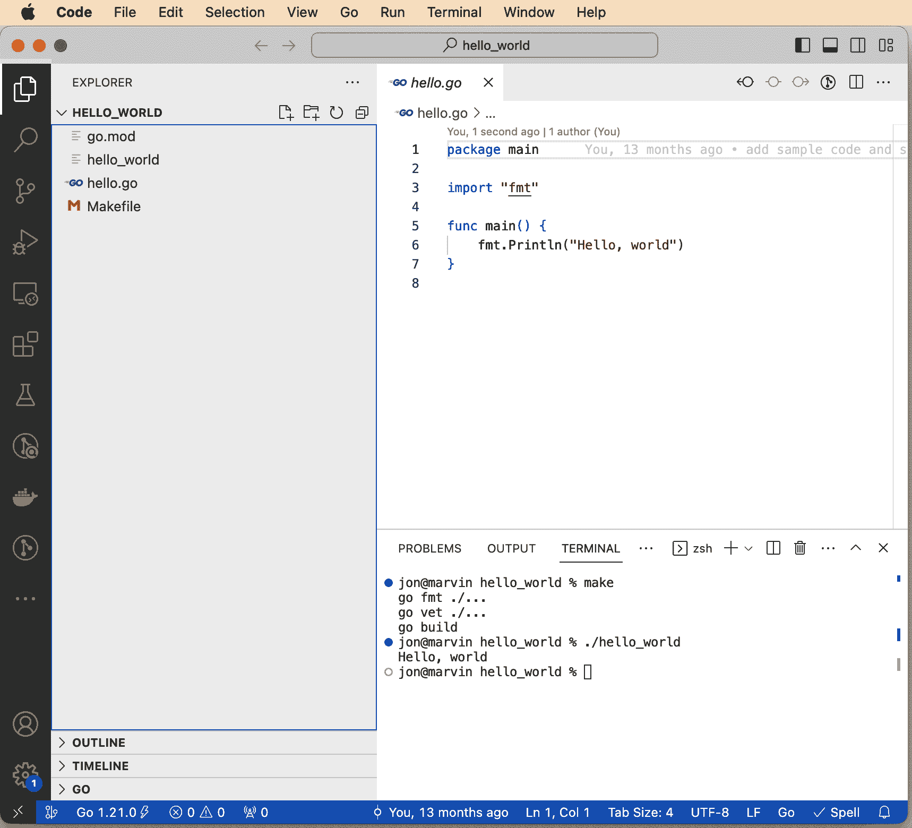
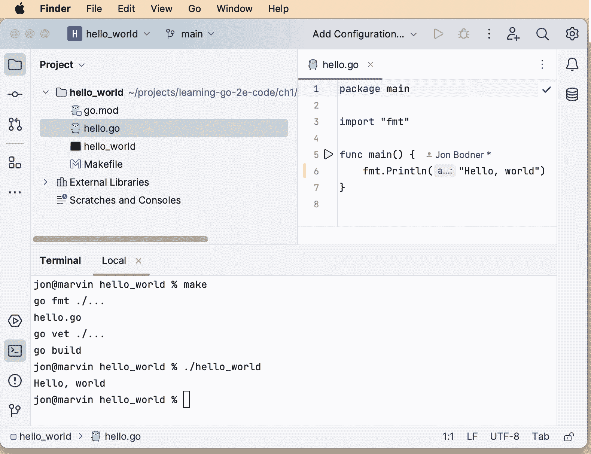
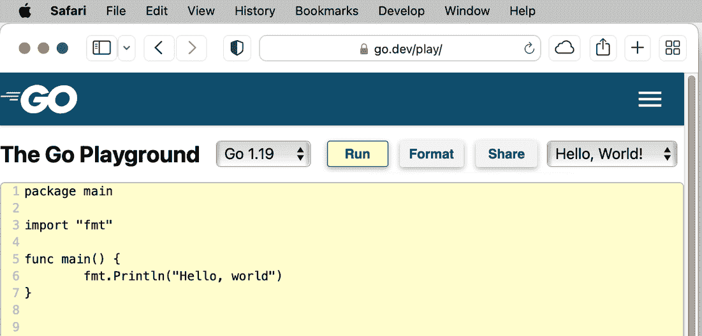
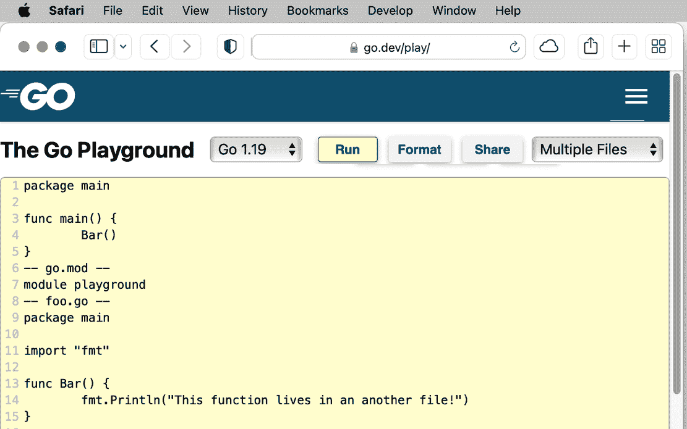

# 第一章 设置你的 Go 开发环境

每种编程语言都需要一个开发环境，Go 也不例外。如果你已经构建了一两个 Go 程序，那么你有一个工作的环境，但你可能错过了一些更新的技术和工具。如果这是你第一次在计算机上设置 Go，不用担心；安装 Go 及其支持工具非常简单。设置环境并验证后，你将构建一个简单的程序，了解不同构建和运行 Go 代码的方式，然后探索一些使 Go 开发更轻松的工具和技术。

# 安装 Go 工具

要构建 Go 代码，你需要下载并安装 Go 开发工具。你可以在[Go 官网下载页面](https://go.dev/dl)找到最新版本的工具。选择适合你平台的下载并安装。Mac 使用*.pkg*安装程序，Windows 使用*.msi*安装程序会自动将 Go 安装到正确的位置，移除旧版本安装，并将 Go 二进制文件放在默认的可执行路径中。

###### 提示

如果你是 Mac 开发者，可以使用[Homebrew](https://brew.sh)命令`brew install go`安装 Go。使用[Chocolatey](https://chocolatey.org)的 Windows 开发者可以使用命令`choco install golang`安装 Go。

各种 Linux 和 BSD 安装程序都是 gzip 压缩的 TAR 文件，会解压缩为一个名为*go*的目录。将此目录复制到*/usr/local*并将*/usr/local/go/bin*添加到你的`$PATH`，以便`go`命令可用：

```go
$ tar -C /usr/local -xzf go1.20.5.linux-amd64.tar.gz
$ echo 'export PATH=$PATH:/usr/local/go/bin' >> $HOME/.bash_profile
$ source $HOME/.bash_profile

```

你可能需要 root 权限才能写入*/usr/local*。如果`tar`命令失败，请使用`sudo tar -C /usr/local -xzf go1.20.5.linux-amd64.tar.gz`重新运行。

###### 注意

Go 程序编译为单个本地二进制文件，不需要安装其他软件即可运行它们。这与需要安装虚拟机来运行程序的 Java、Python 和 JavaScript 等语言形成对比。使用单个本地二进制文件使得 Go 程序的分发变得更加容易。本书不涵盖容器技术，但使用 Docker 或 Kubernetes 的开发者通常可以将 Go 应用程序打包在 scratch 或 distroless 镜像中。你可以在 Geert Baeke 的博客文章["Distroless or Scratch for Go Apps"](https://oreil.ly/W0VUB)中找到详细信息。

你可以通过打开终端或命令提示符并输入以下命令来验证你的环境是否设置正确：

```go
$ go version
```

如果一切设置正确，你应该看到类似以下内容的输出：

```go
go version go1.20.5 darwin/arm64
```

这告诉你这是在 macOS 上的 Go 版本 1.20.5。（Darwin 是 macOS 核心的操作系统，arm64 是基于 ARM 设计的 64 位芯片的名称。）在 x64 Linux 上，你会看到：

```go
go version go1.20.5 linux/amd64
```

## 解决 Go 安装问题

如果你收到错误而不是版本消息，则可能是你的可执行路径中没有`go`，或者你的路径中有另一个名为`go`的程序。在 macOS 和其他类 Unix 系统上，使用`which go`命令查看是否执行了`go`命令，如果没有返回任何内容，则需要修复你的可执行路径。

如果你使用的是 Linux 或 BSD 系统，在 32 位系统上安装了 64 位 Go 开发工具，或者安装了错误芯片架构的开发工具，这是有可能的。

## Go 工具

所有的 Go 开发工具都通过`go`命令访问。除了`go version`之外，还有编译器(`go build`)、代码格式化器(`go fmt`)、依赖管理器(`go mod`)、测试运行器(`go test`)、扫描常见编码错误的工具(`go vet`)等。它们在第 10、11 和 15 章节详细讨论。现在，让我们通过编写大家最喜欢的第一个应用程序“Hello, World!"”来快速看看最常用的工具。

###### 注意

自 2009 年 Go 发布以来，Go 开发者在组织代码和处理依赖方面发生了几次变化。因此，有许多互相矛盾的建议，大多数已经过时（例如，你可以安全地忽略关于`GOROOT`和`GOPATH`的讨论）。

对于现代的 Go 开发，规则很简单：你可以按自己的意愿组织项目并将其存储在任何地方。

# 你的第一个 Go 程序

让我们来学习编写 Go 程序的基础知识。在此过程中，你会看到构成简单 Go 程序的各个部分。你可能暂时不会理解所有内容，没关系，书中的其余部分会帮你理解！

## 制作一个 Go 模块

你需要做的第一件事是创建一个目录来容纳你的程序。将其命名为*ch1*。在命令行中，进入这个新目录。如果你的计算机终端使用 bash 或 zsh，看起来会像这样：

```go
$ mkdir ch1
$ cd ch1
```

在目录内部，运行`go mod init`命令将这个目录标记为 Go 模块：

```go
$ go mod init hello_world
go: creating new go.mod: module hello_world
```

你将在第 Chapter 10 学到更多关于模块的内容，但现在你只需要知道，一个 Go 项目被称为*module*（模块）。一个模块不仅仅是源代码，它还是该模块内代码依赖的精确规范。每个模块在其根目录下都有一个*go.mod*文件。运行`go mod init`会为你创建这个文件。一个基本的*go.mod*文件内容如下：

```go
module hello_world

go 1.20
```

*go.mod*文件声明了模块的名称、模块支持的最低 Go 版本，以及任何其他依赖于该模块的模块。你可以将它视为类似于 Python 使用的*requirements.txt*文件或 Ruby 使用的*Gemfile*文件。

您不应直接编辑*go.mod*文件。相反，请使用`go get`和`go mod tidy`命令来管理对文件的更改。再次强调，与模块相关的所有内容都在第十章中讨论。

## go build

现在让我们写些代码！打开文本编辑器，输入以下文本，并将其保存在*ch1*文件夹内，文件名为*hello.go*：

```go
package main

import "fmt"

func main() {
fmt.Println("Hello, world!")
}
```

（是的，这个代码示例中的缩进看起来很杂乱：我故意这样做的！你很快就会明白为什么。）

让我们快速浏览一下您创建的 Go 文件的各部分。第一行是包声明。在 Go 模块中，代码被组织为一个或多个包。Go 模块中的`main`包包含启动 Go 程序的代码。

接下来是一个导入声明。`import`语句列出了此文件中引用的包。您在这里使用了标准库中`fmt`（通常发音为“fumpt”）包中的函数。与其他语言不同，Go 只导入整个包。您不能将导入限制为包内的特定类型、函数、常量或变量。

所有的 Go 程序都从`main`包中的`main`函数开始。您可以使用`func main()`和左括号来声明这个函数。与 Java、JavaScript 和 C 类似，Go 使用大括号来标记代码块的开始和结束。

函数的主体由一行组成。它表示您正在调用`fmt`包中的`Println`函数，并传递参数`"Hello, world!"`。作为经验丰富的开发者，您可能已经猜到这个函数调用的作用。

文件保存后，返回到您的终端或命令提示符，并键入：

```go
$ go build
```

创建一个名为`hello_world`的可执行文件（在 Windows 上为*hello_world.exe*），保存在当前目录中。运行它，你会惊讶地看到屏幕上打印出`Hello, world!`：

```go
$ ./hello_world
Hello, world!
```

二进制文件的名称与模块声明中的名称相匹配。如果您希望应用程序有不同的名称，或者希望将其存储在不同的位置，请使用`-o`标志。例如，如果您想将代码编译为名为“hello”的二进制文件，可以使用以下命令：

```go
$ go build -o hello
```

在“使用`go run`来尝试运行小程序”中，我将介绍执行 Go 程序的另一种方式。

## go fmt

Go 语言的主要设计目标之一是创建一种能够高效编写代码的语言。这意味着具有简单的语法和快速的编译器。这也导致 Go 语言的作者重新考虑了代码格式化的问题。大多数语言允许以多种方式格式化代码。但 Go 语言不允许这样做。强制执行标准格式使得编写操作源代码的工具变得更加容易。这简化了编译器，并允许创建一些聪明的用于生成代码的工具。

还有一个次要的好处。开发人员历来在格式争论上浪费了大量时间。由于 Go 定义了一种标准的代码格式化方式，Go 开发者避免了关于[大括号风格](https://oreil.ly/dAsbS)和[制表符还是空格](https://oreil.ly/dSkol)的争论。例如，Go 程序使用制表符缩进，如果开括号不与声明或开始块的命令在同一行，会导致语法错误。

###### 注意

许多 Go 开发者认为，Go 团队定义标准格式是为了避免开发者争论，并后来发现了工具化的优势。然而，[Go 的开发主导人 Russ Cox 公开表示](https://oreil.ly/rZEUv) 更好的工具化是他最初的动机。

Go 开发工具包含一个命令，`go fmt`，它可以自动修复代码中的空白以匹配标准格式。但它无法修复放置在错误行的大括号。运行以下命令：

```go
$ go fmt ./...
hello.go
```

使用 `./...` 告诉 Go 工具将命令应用于当前目录及其所有子目录中的所有文件。当你了解更多 Go 工具时，你会再次遇到它。

如果你打开 *hello.go*，你会看到包含 `fmt.Println` 的行现在使用单个制表符正确缩进了。

###### 提示

记得在编译代码之前运行 `go fmt`，并且至少在提交源代码更改到仓库之前！如果忘记了，请进行单独的提交，只包含 **`go fmt ./...`**，这样你就不会把逻辑变更混入格式更改的大雪崩中。

## go vet

在一个类别的 bug 中，代码在语法上是有效的，但很可能是不正确的。`go` 工具包括一个称为 `go vet` 的命令来检测这些类型的错误。向程序添加一个并观察它被检测到。将 *hello.go* 中的 `fmt.Println` 行修改为以下内容：

```go
fmt.Printf("Hello, %s!\n")
```

###### 注意

`fmt.Printf` 类似于 C、Java、Ruby 和许多其他语言中的 `printf`。如果你以前没有见过 `fmt.Printf`，它是一个函数，其第一个参数是模板，其余参数是模板中占位符的值。

在这个示例中，你有一个模板（`"Hello, %s!\n"`），其中包含 `%s` 占位符，但没有为占位符指定值。这段代码可以编译和运行，但是不正确。`go vet` 的其中一个检测项目是检查格式化模板中每个占位符是否有值。在修改后的代码上运行 `go vet`，它会发现一个错误：

```go
$ go vet ./...
# hello_world
./hello.go:6:2: fmt.Printf format %s reads arg #1, but call has 0 args

```

现在 `go vet` 发现了这个 bug，你可以轻松修复它。将 *hello.go* 中的第 6 行修改为：

```go
fmt.Printf("Hello, %s!\n", "world")
```

虽然 `go vet` 可以捕获几种常见的编程错误，但它无法检测一些问题。幸运的是，第三方的 Go 代码质量工具可以填补这个空白。一些最受欢迎的代码质量工具在 “使用代码质量扫描器” 中有介绍。

###### 提示

就像您应该运行`go fmt`来确保代码格式正确一样，运行`go vet`来扫描有效代码中可能存在的错误。这些命令只是确保代码高质量的第一步。除了本书的建议外，所有 Go 开发者都应该阅读["Effective Go"](https://oreil.ly/GBRut)和[Go 代码审查评论页面](https://oreil.ly/FHi_h)，以了解符合习惯用法的 Go 代码是什么样子的。

# 选择您的工具

虽然您可以仅使用文本编辑器和`go`命令编写小型 Go 程序，但在处理更大项目时，您可能需要更高级的工具。与文本编辑器相比，Go IDE 提供了许多优势，包括保存时自动格式化、代码完成、类型检查、错误报告和集成调试。大多数文本编辑器和 IDE 都提供了出色的[Go 开发工具](https://oreil.ly/cav8N)。如果您还没有喜欢的工具，两个最受欢迎的 Go 开发环境是 Visual Studio Code 和 GoLand。

## Visual Studio Code

如果您正在寻找一个免费的开发环境，[Microsoft 的 Visual Studio Code](https://oreil.ly/zktT8) 是您的最佳选择。自 2015 年发布以来，VS Code 已成为开发者最受欢迎的源代码编辑器。它不包含 Go 支持，但您可以通过从扩展库下载 Go 扩展来将其打造成 Go 开发环境。

VS Code 的 Go 支持依赖于通过其内置市场访问的第三方扩展。这包括 Go 开发工具、[Delve 调试器](https://oreil.ly/sosLu)，以及[由 Go 团队开发的 gopls](https://oreil.ly/TLapT)，一个 Go 语言服务器。虽然您需要自行安装 Go 编译器，但 Go 扩展会为您安装 Delve 和 gopls。

###### 注意

什么是语言服务器？它是一个标准规范，用于启用编辑器实现智能编辑行为，如代码完成、质量检查或查找变量或函数在代码中使用的所有位置。您可以通过访问[语言服务器协议网站](https://oreil.ly/2T2fw)了解更多关于语言服务器及其能力的信息。

设置好工具后，您可以打开项目并开始使用它。图 1-1 展示了项目窗口的样子。["使用 VS Code 进行 Go 编程入门"](https://oreil.ly/XhoeB)是一个教程，演示了 VS Code 的 Go 扩展。



###### 图 1-1\. Visual Studio Code

## GoLand

[GoLand](https://oreil.ly/6cXjL) 是 JetBrains 推出的 Go 专用 IDE。尽管 JetBrains 以 Java 为中心的工具而闻名，GoLand 是一个出色的 Go 开发环境。正如你在 图 1-2 中所见，GoLand 的用户界面类似于 IntelliJ、PyCharm、RubyMine、WebStorm、Android Studio 或其他 JetBrains 的 IDE。其支持包括重构、语法高亮、代码补全和导航、文档弹出、调试器、代码覆盖等。除了 Go 支持外，GoLand 还包括 JavaScript/HTML/CSS 和 SQL 数据库工具。不像 VS Code 需要你安装插件才能使用。



###### 图 1-2\. GoLand

如果你已经订阅了 IntelliJ Ultimate，可以通过插件添加 Go 支持。虽然 GoLand 是商业软件，JetBrains 为学生和核心开源贡献者提供 [免费许可计划](https://oreil.ly/48gEF)。如果你不符合免费许可的条件，可以使用 30 天的免费试用。之后，你需要付费购买 GoLand。

## The Go Playground

还有一个重要的 Go 开发工具，但这并不是你需要安装的。访问 [The Go Playground](http://go.dev/play) ，你会看到一个类似于 图 1-3 的窗口。如果你曾使用过 `irb`、`node` 或 `python` 这样的命令行环境，你会发现 The Go Playground 的感觉很类似。它为你提供一个地方来尝试和分享小程序。将你的程序输入窗口并点击运行按钮来执行代码。点击格式化按钮会运行 `go fmt` 并更新你的导入。点击分享按钮会创建一个独特的 URL，你可以将其发送给他人查看你的程序，或在未来的某个日期返回你的代码（这些 URL 已被证明长期有效，但我不建议将 Playground 作为你的源代码仓库）。



###### 图 1-3\. The Go Playground

正如你在 图 1-4 中看到的，你可以通过像 `-- filename.go --` 这样的行来模拟多个文件。你甚至可以通过在文件名中包含 `/`，如 `-- subdir/my_code.go --`，来创建模拟的子目录。

请注意，Go Playground 是在别人的计算机上（特别是 Google 的计算机），所以你没有完全自由。它为您提供了几个版本的 Go（通常是当前版本、上一个版本和最新的开发版本）。您只能连接到 `localhost`，并且长时间运行或使用过多内存的进程会被停止。如果您的程序依赖于时间，请考虑时钟设置为 2009 年 11 月 10 日 23:00:00 UTC（Go 初始公告的日期）。即使存在这些限制，Go Playground 也是一个有用的方式，可以在不在本地创建新项目的情况下尝试新想法。在本书的整个过程中，您将找到指向 Go Playground 的链接，以便您可以运行代码示例而无需将它们复制到您的计算机上。

###### 警告

不要将敏感信息（例如个人身份信息、密码或私钥）放入您的 Playground 中！如果单击“共享”按钮，信息将保存在 Google 的服务器上，并可通过相关的共享 URL 访问。如果不小心这样做，请联系 Google 的 *security@golang.org* 并提供 URL 及删除内容的原因。



###### 图 1-4\. Go Playground 支持多文件

# Makefile

使用 IDE 很方便，但很难自动化。现代软件开发依赖于可重复、可自动化的构建，可以由任何人、任何地方、任何时候运行。需要这种工具的做法是良好的软件工程实践。它避免了开发人员用耸肩和声明“在我的机器上可以运行！”来摆脱任何构建问题的情况。做到这一点的方法是使用某种脚本来指定构建步骤。Go 开发者已经采用 `make` 作为他们的解决方案。它允许开发者指定构建程序所需的一组操作以及执行步骤的顺序。您可能不熟悉 `make`，但它自 1976 年以来就被用来构建 Unix 系统上的程序。

在 *ch1* 目录中创建名为*Makefile*的文件，并包含以下内容：

```go
.DEFAULT_GOAL := build

.PHONY:fmt vet build
fmt:
        go fmt ./...

vet: fmt
        go vet ./...

build: vet
        go build
```

即使你以前没有见过 Makefile，弄清楚其中的情况也不是太困难。每个可能的操作被称为*目标*。`.DEFAULT_GOAL` 定义了在没有指定目标时运行的目标。在本例中，默认是`build`目标。接下来是目标的定义。冒号（`:`）前的单词是目标的名称。目标后面的任何单词（例如在`build: vet`行中的`vet`）是在指定目标运行之前必须运行的其他目标。目标执行的任务位于目标后的缩进行中。`.PHONY` 行防止 `make` 在项目中的目录或文件与列出的目标之一同名时混淆。

运行 `make`，您应该看到以下输出：

```go
$ make
go fmt ./...
go vet ./...
go build

```

输入单个命令可以正确格式化代码，检查非明显错误并编译它。你也可以用`make vet`来审核代码，或者只是运行格式化器`make fmt`。这可能看起来不是很大的改进，但确保在触发构建之前总是进行格式化和审核，无论是开发人员还是运行在持续集成构建服务器上的脚本，都意味着你不会错过任何步骤。

Makefile 的一个缺点是它们非常挑剔。在目标中，你*必须*用制表符缩进步骤。它们也不会默认支持 Windows。如果你在 Windows 计算机上进行 Go 开发，你需要先安装`make`。最简单的方法是先安装像[Chocolatey](https://chocolatey.org)这样的包管理器，然后使用它来安装`make`（对于 Chocolatey，命令是`choco install make`）。

如果你想了解更多关于编写 Makefile 的内容，Chase Lambert 有一篇很好的[教程](https://oreil.ly/Vytcj)，但它确实使用了少量的 C 来解释这些概念。

你可以在本书的[第一章代码库](https://oreil.ly/eOfkK)中找到本章的代码。

# Go 兼容性承诺

与所有编程语言一样，Go 开发工具定期更新。自 Go 1.2 以来，大约每六个月发布一次新版本。还会根据需要发布包含错误修复和安全修复的补丁版本。考虑到快速的开发周期和 Go 团队对向后兼容性的承诺，Go 的发布往往是增量的而非扩展的。[Go 兼容性承诺](https://oreil.ly/p_NMY)详细描述了 Go 团队计划如何避免破坏 Go 代码。它表明，除非为了修复错误或安全漏洞，否则不会对以 1 开头的任何 Go 版本进行向后兼容性变更。在他的 GopherCon 2022 主题演讲[“兼容性：如何保持 Go 程序的正常运行”](https://oreil.ly/Ohkr7)中，Russ Cox 讨论了 Go 团队确保 Go 代码不破坏的所有方法。他说：“我认为，优先考虑兼容性是我们在 Go 1 中做出的最重要的设计决策。”

这一保证不适用于`go`命令。`go`命令的标志和功能发生了不兼容的更改，这种情况很可能会再次发生。

# 保持更新

Go 程序编译为独立的本地二进制文件，因此你不必担心更新开发环境会导致当前部署的程序失败。你可以在同一台计算机或虚拟机上同时运行使用不同 Go 版本编译的程序。

当您准备更新计算机上安装的 Go 开发工具时，Mac 和 Windows 用户有最简单的路径。那些使用 `brew` 或 `chocolatey` 安装的用户可以使用这些工具进行更新。那些使用[*https://golang.org/dl*](https://golang.org/dl)上的安装程序的用户可以下载最新的安装程序，在安装新版本时删除旧版本。

Linux 和 BSD 用户需要下载最新版本，将旧版本移动到备份目录，解压新版本，然后删除旧版本：

```go
$ mv /usr/local/go /usr/local/old-go
$ tar -C /usr/local -xzf go1.20.6.linux-amd64.tar.gz
$ rm -rf /usr/local/old-go

```

###### 注意

从技术上讲，您无需将现有安装移动到新位置；您可以直接删除它并安装新版本。但是，这属于“安全第一”的范畴。如果在安装新版本时出现问题，保留之前的版本是很有好处的。

# 练习

每章末尾都有练习，让您可以尝试我介绍的想法。您可以在[第一章代码库](https://oreil.ly/c-oc3)中找到这些练习的答案。

1.  取“Hello, world!” 程序并在 Go Playground 上运行它。与希望学习有关 Go 的同事分享代码在 playground 上的链接。

1.  在 Makefile 中添加一个名为 `clean` 的目标，用于删除 `hello_world` 二进制文件和 `go build` 创建的任何其他临时文件。查看[Go 命令文档](https://oreil.ly/uqsMy)，找到帮助实现此功能的 `go` 命令。

1.  尝试修改“Hello, world!” 程序中的格式。添加空行、空格，更改缩进，插入新行。在做出修改后，运行 `go fmt` 查看格式化是否被撤销。此外，运行 `go build` 查看代码是否仍然可以编译。您还可以在函数中间添加额外的 `fmt.Println` 调用，以查看会发生什么。

# 总结

在本章中，您学习了如何安装和配置您的 Go 开发环境。您还了解了构建 Go 程序和确保代码质量的工具。现在您的环境已准备就绪，接下来将进入下一章，在那里您将探索 Go 中的内置类型以及如何声明变量。
