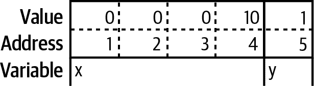
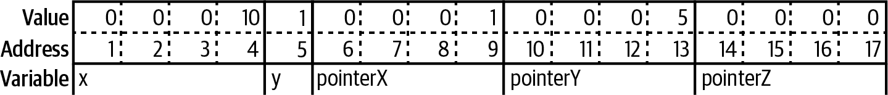
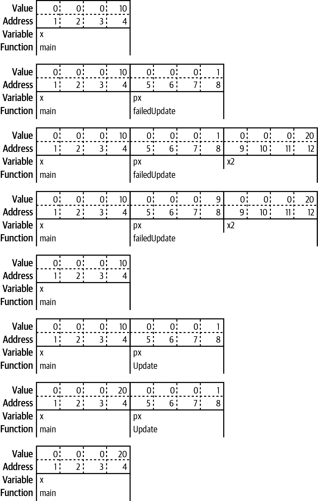
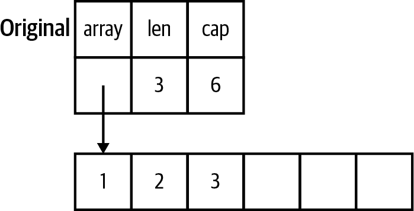
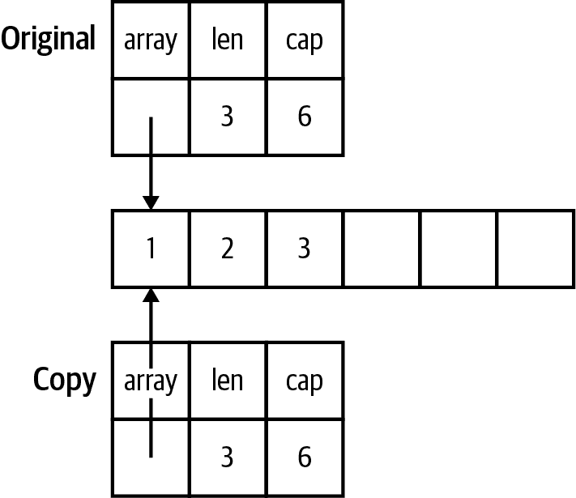
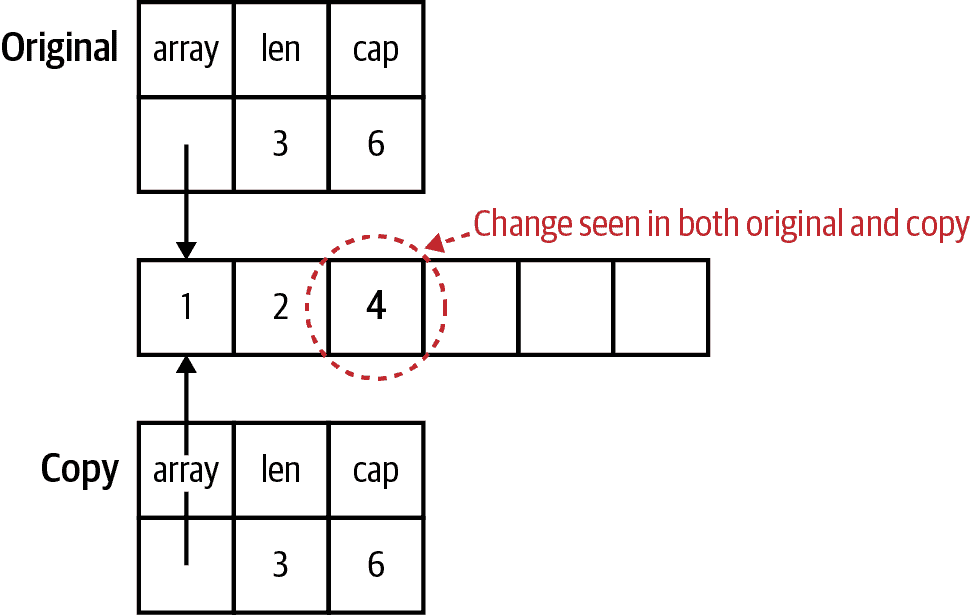
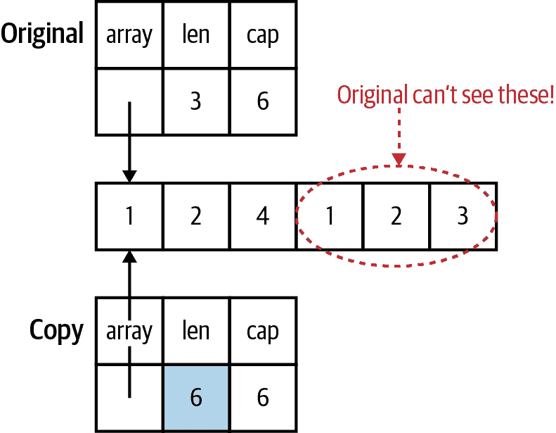
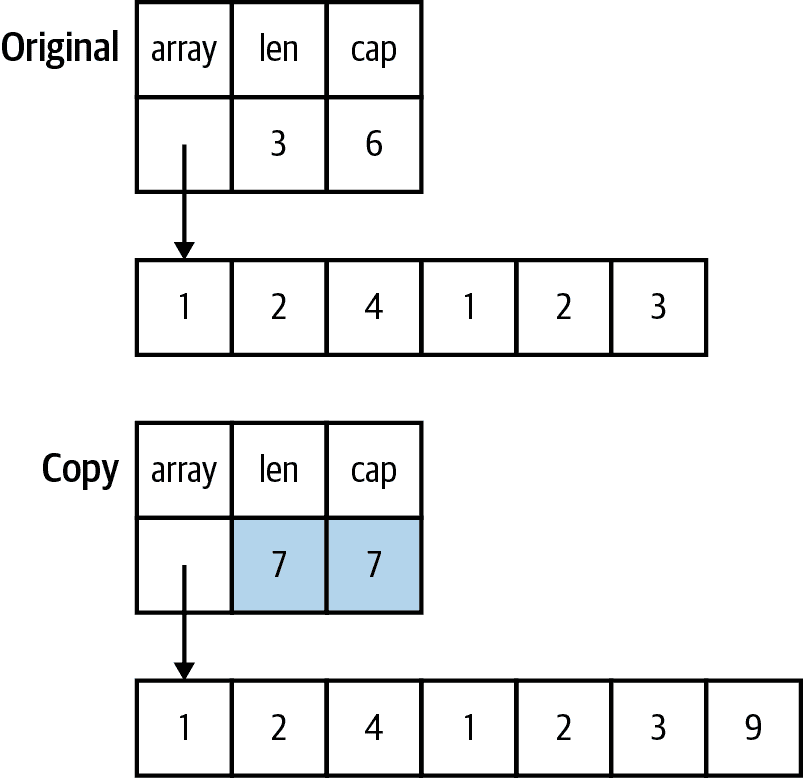

# 第六章 指针

现在你已经了解了变量和函数，是时候学习指针语法了。接下来我将通过将 Go 语言中指针的行为与其他语言中类的行为进行比较来澄清指针的行为。你还将学习如何以及何时使用指针，在 Go 语言中如何分配内存，以及如何正确使用指针和值使 Go 程序更快、更高效。

# 快速指针入门

*指针*是一个变量，它保存值存储的内存位置。如果你学过计算机科学课程，可能已经看过用图形表示变量存储在内存中的方式。以下两个变量的表示形式类似于图 6-1：

```go
var x int32 = 10
var y bool = true
```



###### 图 6-1\. 在内存中存储两个变量

每个变量都存储在一个或多个连续的内存位置中，称为*地址*。不同类型的变量可能占用不同数量的内存。在这个例子中，你有两个变量，`x`是一个 32 位的整数，`y`是一个布尔值。存储一个 32 位整数需要四个字节，因此`x`的值存储在从地址 1 到地址 4 的四个字节中。布尔值只需要一个字节（只需一个位来表示`true`或`false`，但可以独立寻址的最小内存单位是一个字节），因此`y`的值存储在地址 5 处的一个字节中，其中`true`的值表示为 1。

指针是一个变量，它包含另一个变量存储的地址。图 6-2 展示了以下指针如何在内存中存储：

```go
var x int32 = 10
var y bool = true
pointerX := &x
pointerY := &y
var pointerZ *string
```



###### Figure 6-2\. 在内存中存储指针

虽然不同类型的变量可能占用不同数量的内存位置，但无论指向何种类型，每个指针始终占据相同数量的内存位置。本章的示例使用 4 字节的指针，但许多现代计算机使用 8 字节的指针。指针保存一个数字，该数字表示被指向的数据存储的内存位置。这个数字称为*地址*。我们指向`x`的指针`pointerX`存储在位置 6，并具有值 1，即`x`的地址。类似地，我们指向`y`的指针`pointerY`存储在位置 10，并具有值 5，即`y`的地址。最后一个指针`pointerZ`存储在位置 14，并具有值 0，因为它没有指向任何东西。

指针的零值为`nil`。你之前几次见过`nil`，作为切片、映射和函数的零值。这些类型都是用指针实现的。（还有两种类型，通道和接口，也是用指针实现的。你将在“接口快速入门”和“通道”中详细了解它们。）正如我在第三章中所述，`nil`是一个无类型标识符，表示某些类型的缺失值。与 C 中的`NULL`不同，`nil`不是 0 的另一个名称；你不能将其与数字来回转换。

###### 警告

正如在第四章中所提到的，`nil`在宇宙块中有定义。因为`nil`是在宇宙块中定义的值，它可以被隐藏。除非你试图愚弄你的同事且不关心你的年度审查，否则永远不要将变量或函数命名为`nil`。

Go 的指针语法部分借鉴自 C 和 C++。由于 Go 具有垃圾回收器，大多数内存管理痛点被消除。此外，一些你可以在 C 和 C++中使用的指针技巧，包括*指针算术*，在 Go 中是不允许的。

###### 注意

Go 标准库确实有一个`unsafe`包，它允许你在数据结构上进行一些低级操作。虽然在 C 中常用指针操作进行常规操作，但在 Go 开发者中极少使用`unsafe`。你将在第十六章中快速了解它。

`&`是*地址*运算符。它前置于值类型，并返回存储值的地址：

```go
x := "hello"
pointerToX := &x
```

`*`是*间接*运算符。它前置于指针类型的变量，并返回指向的值。这称为*解引用*：

```go
x := 10
pointerToX := &x
fmt.Println(pointerToX)  // prints a memory address
fmt.Println(*pointerToX) // prints 10
z := 5 + *pointerToX
fmt.Println(z)           // prints 15
```

在解引用指针之前，你必须确保指针非`nil`。如果尝试对`nil`指针进行解引用，程序将会崩溃：

```go
var x *int
fmt.Println(x == nil) // prints true
fmt.Println(*x)       // panics
```

*指针类型*是表示指针的类型。它在类型名前写上`*`。指针类型可以基于任何类型：

```go
x := 10
var pointerToX *int
pointerToX = &x
```

内置函数`new`创建一个指针变量。它返回所提供类型的零值实例的指针：

```go
var x = new(int)
fmt.Println(x == nil) // prints false
fmt.Println(*x)       // prints 0
```

`new`函数很少使用。对于结构体，请在结构体文字之前加上`&`以创建指针实例。你不能在原始文字（数字、布尔值和字符串）或常量之前使用`&`，因为它们没有内存地址；它们只存在于编译时。当你需要一个指向原始类型的指针时，请声明一个变量并指向它：

```go
x := &Foo{}
var y string
z := &y
```

有时无法取常量的地址有点不方便。如果你有一个结构体，其中一个字段是指向原始类型的指针，你不能直接将字面量赋给该字段：

```go
type person struct {
    FirstName  string
    MiddleName *string
    LastName   string
}

p := person{
  FirstName:  "Pat",
  MiddleName: "Perry", // This line won't compile
  LastName:   "Peterson",
}
```

编译此代码会返回错误：

```go
cannot use "Perry" (type string) as type *string in field value
```

如果你尝试在`"Perry"`之前加上`&`，你将会得到错误消息：

```go
cannot take the address of "Perry"
```

有两种方法可以解决这个问题。第一种方法是做之前展示的事情，即引入一个变量来保存常量值。第二种方法是编写一个通用的辅助函数，接受任何类型的参数并返回该类型的指针：

```go
func makePointerT any *T {
    return &t
}
```

有了那个函数，你现在可以写：

```go
p := person{
  FirstName:  "Pat",
  MiddleName: makePointer("Perry"), // This works
  LastName:   "Peterson",
}
```

为什么这样做？当你将一个常量传递给一个函数时，该常量被复制到一个参数中，该参数是一个变量。因为它是一个变量，它在内存中有一个地址。然后函数返回变量的内存地址。编写通用函数在第八章中有介绍。

###### 提示

使用一个辅助函数将一个常量值转换为指针。

# 不要害怕指针

指针的第一条规则是不要害怕它们。如果你习惯于 Java、JavaScript、Python 或 Ruby，你可能会觉得指针很吓人。然而，指针实际上是类中熟悉的行为。在 Go 语言中，非指针的结构体才是不寻常的。

在 Java 和 JavaScript 中，原始类型和类之间的行为有所不同（Python 和 Ruby 没有原始值，但使用不可变实例来模拟它们）。当将原始值分配给另一个变量或传递给函数或方法时，对其他变量进行的任何更改不会反映在原始变量中，就像在示例 6-1 中所示的那样。

##### 示例 6-1\. 在 Java 中分配原始变量不共享内存

```go
int x = 10;
int y = x;
y = 20;
System.out.println(x); // prints 10
```

然而，让我们看看当一个类的实例被分配给另一个变量或传递给函数或方法时会发生什么（示例 6-2 中的代码是用 Python 编写的，但是你可以在[第六章代码示例](https://oreil.ly/riOYA)的*sample_code/language_pointer_examples*目录中找到类似的 Java、JavaScript 和 Ruby 代码）。

##### 示例 6-2\. 将类实例传递给函数

```go
class Foo:
    def __init__(self, x):
        self.x = x

def outer():
    f = Foo(10)
    inner1(f)
    print(f.x)
    inner2(f)
    print(f.x)
    g = None
    inner2(g)
    print(g is None)

def inner1(f):
    f.x = 20

def inner2(f):
    f = Foo(30)

outer()
```

运行此代码会打印以下输出：

```go
20
20
True
```

这是因为在 Java、Python、JavaScript 和 Ruby 中以下场景是正确的：

+   如果你将一个类的实例传递给一个函数，并且改变字段的值，则这种改变将反映在传入的变量中。

+   如果重新分配参数，则传入的变量不会*反映*变化。

+   如果你为参数值传递`nil/null/None`，则将参数本身设置为新值不会修改调用函数中的变量。

有些人解释这种行为时说，在这些语言中类实例是通过引用传递的。这是不正确的。如果它们是通过引用传递的，场景二和场景三将改变调用函数中的变量。这些语言始终是按值传递的，就像在 Go 语言中一样。

你所看到的是这些语言中每个类的每个实例都作为指针实现。当将类实例传递给函数或方法时，被复制的值是指向实例的指针。由于 `outer` 和 `inner1` 引用同一内存，对 `inner1` 中的 `f` 字段的更改会反映在 `outer` 中的变量上。当 `inner2` 将 `f` 重新分配给一个新的类实例时，这创建了一个单独的实例，并且不会影响 `outer` 中的变量。

当你在 Go 中使用指针变量或参数时，你会看到完全相同的行为。Go 和这些语言的不同之处在于，Go 给你选择使用指针或值的*选择*，无论是基本类型还是结构体。大多数情况下，你应该使用值。值使得更容易理解数据何时以及如何被修改。第二个好处是，使用值减少了垃圾收集器需要做的工作量。我将在 “减少垃圾收集器的工作负荷” 中讨论这一点。

# 指针表示可变参数

正如你已经看到的，Go 常量为可以在编译时计算的字面表达式提供了名称。Go 没有机制声明其他类型的值是不可变的。现代软件工程推崇不可变性。[MIT 的《软件构造课程》](https://oreil.ly/FbUTJ) 总结了原因：“不可变类型更安全，更易于理解，并且更容易变更。可变性使得理解程序的运行变得更加困难，并且更难强制执行合同。”

Go 语言中缺乏不可变声明可能看起来是个问题，但可以选择值或指针参数类型来解决这个问题。正如《软件构造课程材料》所解释的那样：“使用可变对象是完全可以的，只要在方法内部完全本地使用，并且只有一个对该对象的引用。” 而不是声明某些变量和参数是不可变的，Go 开发者使用指针来指示参数是可变的。

由于 Go 是按值传递的语言，传递给函数的是值的副本。对于非指针类型（如基本类型、结构体和数组），这意味着被调用函数无法修改原始数据。由于被调用函数有原始数据的副本，原始数据的不可变性是得到保证的。

###### 注意

我将在 “映射和切片的区别” 中讨论将映射和切片传递给函数的情况。

然而，如果将指针传递给函数，函数将获得指针的副本。这仍然指向原始数据，这意味着被调用函数可以修改原始数据。

这带来了几个相关的影响。

首先的含义是，当你将一个 `nil` 指针传递给一个函数时，你不能使其值变为非 `nil`。你只能在指针已经有值的情况下重新赋值。虽然刚开始会感到困惑，但这是有道理的。由于内存位置是通过按值调用函数传递的，你不能改变内存地址，就像你不能改变 `int` 参数的值一样。你可以用以下程序来演示这一点：

```go
func failedUpdate(g *int) {
    x := 10
    g = &x
}

func main() {
    var f *int // f is nil
    failedUpdate(f)
    fmt.Println(f) // prints nil
}
```

该代码的流程如 图 6-3 所示。


###### 图 6-3\. 更新 `nil` 指针失败

你在 `main` 中开始有一个 `nil` 变量 `f`。当你调用 `failedUpdate` 时，你将 `f` 的值，即 `nil`，复制到名为 `g` 的参数中。这意味着 `g` 也被设置为 `nil`。然后在 `failedUpdate` 中声明一个值为 10 的新变量 `x`。接下来，你将 `failedUpdate` 中的 `g` 改为指向 `x`。这并不会改变 `main` 中的 `f`，当你退出 `failedUpdate` 并返回到 `main` 时，`f` 仍然是 `nil`。

复制指针的第二个含义是，如果你希望在退出函数时保留指针参数分配的值，你必须对指针进行解引用并设置值。如果改变指针，你改变的是副本而不是原始的值。解引用将新值放入原始和副本指向的内存位置。以下是展示这一过程的简短程序：

```go
func failedUpdate(px *int) {
    x2 := 20
    px = &x2
}

func update(px *int) {
    *px = 20
}

func main() {
    x := 10
    failedUpdate(&x)
    fmt.Println(x) // prints 10
    update(&x)
    fmt.Println(x) // prints 20
}
```

该代码的流程如 图 6-4 所示。

在这个例子中，你在 `main` 中将 `x` 设置为 10。当你调用 `failedUpdate` 时，你将 `x` 的地址复制到参数 `px` 中。接下来，在 `failedUpdate` 中声明 `x2` 并设置为 20。然后你将 `px` 在 `failedUpdate` 中指向 `x2` 的地址。当你返回到 `main` 时，`x` 的值保持不变。当你调用 `update` 时，再次将 `x` 的地址复制到 `px` 中。但是，这次你改变了 `update` 中 `px` 指向的值，也就是 `main` 中的变量 `x`。当你返回到 `main` 时，`x` 的值已经改变了。



###### 图 6-4\. 更新指针的错误方法和正确方法

# 指针是最后的选择。

说到这里，在 Go 中使用指针时应当小心。正如前面讨论的那样，它们使得数据流程更难理解，并可能为垃圾收集器增加额外的工作。与其通过将指针传递到函数中来填充结构体，不如让函数实例化并返回结构体（参见示例 6-3 和 6-4）。

##### 示例 6-3\. 不要这样做

```go
func MakeFoo(f *Foo) error {
  f.Field1 = "val"
  f.Field2 = 20
  return nil
}
```

##### 示例 6-4\. 这样做

```go
func MakeFoo() (Foo, error) {
  f := Foo{
    Field1: "val",
    Field2: 20,
  }
  return f, nil
}
```

唯一应该使用指针参数修改变量的时机是当函数期望一个接口时。在使用 JSON 时你会看到这种模式（我将在 “encoding/json” 中更多地讨论 Go 标准库中的 JSON 支持）：

```go
f := struct {
  Name string `json:"name"`
  Age int `json:"age"`
}{}
err := json.Unmarshal([]byte(`{"name": "Bob", "age": 30}`), &f)
```

`Unmarshal`函数从包含 JSON 的字节片段中填充变量。它声明为接受一个字节片段和一个`any`参数。传递给`any`参数的值必须是一个指针。如果不是，将返回错误。

为什么要将指针传递给`Unmarshal`而不是让它返回一个值？有两个原因。首先，这个函数早于 Go 泛型的添加，而没有泛型（我将在第八章详细讨论），没有办法知道要创建和返回什么类型的值。

第二个原因是，传递指针可以控制内存分配。迭代数据并将其从 JSON 转换为 Go 结构体是一种常见的设计模式，因此`Unmarshal`针对这种情况进行了优化。如果`Unmarshal`函数返回一个值，并且在循环中调用`Unmarshal`，则每个循环迭代都会创建一个结构体实例。这会给垃圾收集器带来更多工作量，从而减慢程序的速度。在查看“Slices as Buffers”时，您会看到此模式的另一个用途，而在“Reducing the Garbage Collector’s Workload”中我将详细讨论高效内存使用。

由于 JSON 集成非常普遍，这个 API 有时被新的 Go 开发人员视为常见情况，而不是应该是的例外情况。

当从函数返回值时，应优先考虑值类型。仅当数据类型内部存在需要修改的状态时，才使用指针类型作为返回类型。在查看“io and Friends”中的 I/O 时，您将看到用于读取或写入数据的缓冲区。此外，某些与并发使用的数据类型必须始终作为指针传递。您将在第十二章中看到这些内容。

# 指针传递性能

如果一个结构体足够大，使用结构体的指针作为输入参数或返回值可以提升性能。将指针传递给函数的时间对于所有数据大小都是常数级别的，大约一纳秒。这是有道理的，因为指针的大小对所有数据类型都是相同的。将值传递给函数随着数据变大会花费更长的时间。当值达到大约 10 兆字节时，传递值大约需要 0.7 毫秒。

返回指针与返回值的行为更有趣。对于小于 10 兆字节的数据结构，返回指针类型实际上比返回值类型*更慢*。例如，一个 100 字节的数据结构返回大约需要 10 纳秒，但指向该数据结构的指针则需要约 30 纳秒。随着数据结构变得更大，性能优势则会反转。返回 10 兆字节的数据需要将近 1.5 毫秒，但返回指向它的指针则少于半毫秒。

您应该知道这些时间非常短暂。在绝大多数情况下，使用指针和值之间的差异不会影响程序的性能。但是，如果在函数之间传递的数据量达到几兆字节，请考虑使用指针，即使该数据旨在是不可变的。

所有这些数字来自一台配备 32 GB RAM 的 i7-8700 计算机。不同的 CPU 可能会产生不同的交叉点。例如，在配备 16 GB RAM 的 Apple M1 CPU 上，在大约 100 千字节的大小时，返回指针（5 微秒）比返回值（8 微秒）更快。您可以在[第六章代码库](https://oreil.ly/riOYA)中的 *sample_code/pointer_perf* 目录中运行自己的性能测试。运行命令 `go test ./…​ -bench=.` 来查找您自己的结果。（性能基准测试在“使用基准测试”中介绍。）

# 零值与无值

Go 指针也常用于指示已分配了零值的变量或字段与根本没有分配值的变量或字段之间的区别。如果此区别在您的程序中很重要，请使用`nil`指针来表示未分配的变量或结构体字段。

因为指针还表示可变性，在使用此模式时要小心。与其从函数中返回设置为`nil`的指针，不如使用您在映射中看到的逗号 ok 惯用法，并返回一个值类型和一个布尔值。

请记住，如果通过参数或参数上的字段将`nil`指针传递到函数中，则无法在函数内部设置值，因为没有地方存储该值。如果传入指针的值不为`nil`，则不要修改它，除非您记录了该行为。

再次提醒，JSON 转换是证明规则的例外。在将数据在 JSON 中来回转换时（是的，我会在“encoding/json”中更多地讨论 Go 标准库中的 JSON 支持），您经常需要一种区分零值和根本没有分配值的方式。对于结构体中可为空的字段，请使用指针值。

当不使用 JSON（或其他外部协议）时，请抵制使用指针字段来表示无值的诱惑。虽然指针确实提供了一种方便的方式来指示无值，但如果您不打算修改该值，则应改为使用值类型，配合布尔值使用。

# 映射和切片之间的区别

正如您在前一章节中看到的那样，对传递给函数的映射所做的任何修改都会反映在传递的原始变量中。现在您已经了解了指针，您可以理解其中的原因：在 Go 运行时中，映射被实现为指向结构体的指针。将映射传递给函数意味着您在复制一个指针。

因此，在使用映射作为输入参数或返回值时，尤其是在公共 API 上，你应该仔细考虑。从 API 设计的角度来看，映射是一个不好的选择，因为它们并未明确定义映射中包含的值；没有任何东西明确定义映射中的任何键，所以唯一了解它们的方法是通过代码进行跟踪。从不可变性的角度来看，映射也不好，因为了解映射中最终包含了什么的唯一方法是跟踪与其交互的所有函数。这会阻止你的 API 自我记录。如果你习惯于动态语言，请不要将映射作为替代其他语言缺乏结构的方式。Go 是一种强类型语言；与其传递映射，不如使用结构体。（当我讨论内存布局时，你会了解更喜欢结构体的另一个原因，见“减少垃圾收集器的工作量”。）

###### 注意

在某些情况下，映射输入参数或返回值是正确的选择。结构体要求在编译时命名其字段。如果你的数据键在编译时不是已知的，那么映射是理想的选择。

与此同时，将切片传递给函数具有更复杂的行为：对切片内容的任何修改都会反映在原始变量中，但使用 `append` 来改变长度则不会反映在原始变量中，即使切片的容量大于其长度。这是因为切片被实现为一个具有三个字段的结构体：一个 `int` 类型的长度字段，一个 `int` 类型的容量字段，以及指向内存块的指针。图 6-5 演示了它们之间的关系。



###### 图 6-5\. 切片的内存布局

当切片被复制到另一个变量或传递给函数时，会复制长度、容量和指针。图 6-6 展示了两个切片变量指向相同内存的情况。



###### 图 6-6\. 切片及其副本的内存布局

修改切片中的值会改变指针指向的内存，因此更改会在副本和原始切片中都可见。你可以在图 6-7 中看到内存中的变化。



###### 图 6-7\. 修改切片的内容

如果切片副本被追加，并且切片有足够的容量来存放新值，则副本的长度会改变，并且新值将存储在副本和原始切片共享的内存块中。然而，原始切片中的长度保持不变。由于这些值超出了原始切片的长度，Go 运行时阻止了原始切片看到这些值。图 6-8 强调了在一个切片变量中可见但在另一个中不可见的值。



###### 图 6-8\. 改变长度在原始中是不可见的

如果切片副本被追加并且切片没有足够的容量来存放新值，那么会分配一个新的、更大的内存块，将值复制过去，并更新复制品中的指针、长度和容量字段。因为这些信息只在副本中，所以在原始切片中不会反映出这些更改。图 6-9 展示了现在每个切片变量指向不同的内存块。



###### 图 6-9\. 改变容量改变存储

结果是，传递给函数的切片可以修改其内容，但切片本身无法调整大小。作为唯一可用的线性数据结构，切片经常在 Go 程序中传递。默认情况下，你应该假设一个函数不会修改切片。你的函数文档应该说明它是否修改了切片的内容。

###### 注意

你可以将任何大小的切片传递给函数的原因是，传递给函数的数据类型对于任何大小的切片都是相同的：一个包含两个`int`值和一个指针的结构体。你不能编写一个接受任何大小数组的函数的原因是，整个数组会传递给函数，而不仅仅是数据的指针。

有一种情况非常有用，即能够修改切片输入参数的内容（但不能改变大小）。这使它们成为可重复使用的缓冲区的理想选择。

# 作为缓冲区的切片

当从外部资源（如文件或网络连接）读取数据时，许多语言会使用如下代码：

```go
r = open_resource()
while r.has_data() {
  data_chunk = r.next_chunk()
  process(data_chunk)
}
close(r)
```

这种模式的问题在于，每次你通过那个`while`循环迭代时，都会分配另一个`data_chunk`，尽管每个都只使用一次。正如我在“指针是最后的选择”中讨论`Unmarshal`函数时所述，这样会产生大量不必要的内存分配。垃圾收集语言会自动处理这些分配，但在处理完成后仍需要进行清理工作。

即使 Go 是一种垃圾收集语言，编写符合惯用 Go 的代码意味着避免不必要的分配。与每次从数据源读取时返回新分配相比，你可以创建一个字节切片并将其用作从数据源读取数据的缓冲区：

```go
file, err := os.Open(fileName)
if err != nil {
    return err
}
defer file.Close()
data := make([]byte, 100)
for {
    count, err := file.Read(data)
    process(data[:count])
    if err != nil {
        if errors.Is(err, io.EOF) {
            return nil
        }
        return err
    }
}
```

记住，当切片传递到函数时，你不能改变其长度或容量，但你可以改变当前长度内的内容。在这段代码中，你创建了一个 100 字节的缓冲区，每次循环时，你将下一个字节块（最多 100 个字节）复制到切片中。然后将填充好的缓冲区部分传递给`process`函数。如果发生错误（除了`io.EOF`，表示没有更多数据可读的特殊错误），则返回该错误。当返回`io.EOF`作为错误时，表示没有更多数据，函数返回`nil`。你将在“io 和朋友们”中详细了解更多关于 I/O 的细节，错误处理则在第九章中涵盖。

# 减少垃圾收集器的工作负载

使用缓冲区仅仅是减少垃圾收集器工作量的一个例子。当程序员谈论“垃圾”的时候，他们指的是“没有指针指向它的数据”。一旦某些数据没有指针指向它，那么这些数据占用的内存可以被重复使用。如果内存没有被回收，程序的内存使用将会持续增长，直到计算机的 RAM 用完。垃圾收集器的工作是自动检测未使用的内存并回收，以便可以重复使用。Go 语言拥有垃圾收集器是非常棒的，因为数十年的经验表明，手动正确管理内存对人类来说非常困难。但是仅仅因为有了垃圾收集器，并不意味着你应该大量创建垃圾。

如果你花时间学习编程语言的实现方式，你可能已经了解了堆（*heap*）和栈（*stack*）。如果你不熟悉，这里是栈的工作原理。*栈*是连续的内存块。执行线程中的每个函数调用共享同一个栈。在栈上分配内存是快速且简单的。*栈指针*跟踪最后一次分配内存的位置。通过更改栈指针的值来进行额外的内存分配。当函数被调用时，为函数的数据创建一个新的*栈帧*。局部变量与传入函数的参数一起存储在栈上。每个新变量都会使栈指针移动相应值的大小。当函数退出时，其返回值通过栈复制回调用函数，并且栈指针移回已退出函数的栈帧开头，释放该函数的所有局部变量和参数使用的栈内存。

###### 注意

自版本 1.17 以来，Go 语言使用寄存器（CPU 上直接的一小块非常高速的内存）和栈来传递函数的输入和输出值。这样做更快速也更复杂，但仍然适用于仅栈的函数调用一般概念。

要将东西存储在堆栈上，必须在编译时确切地知道它的大小。当你看 Go 中的值类型时（原始值、数组和结构体），它们都有一个共同点：你在编译时知道它们占用多少内存。这就是为什么数组的大小被视为类型的一部分的原因。因为它们的大小是已知的，所以它们可以在堆栈上分配，而不是在堆上。指针类型的大小也是已知的，并且也存储在堆栈上。

###### 注意

Go 的一个不寻常之处在于它可以在程序运行时增加堆栈的大小。这是可能的，因为每个 goroutine 都有自己的堆栈，并且 goroutine 是由 Go 运行时管理的，而不是由底层操作系统管理的（我在讨论并发时会详细介绍 goroutine，参见第十二章）。这既有优势（Go 的堆栈从小开始，并且使用的内存较少），也有劣势（当堆栈需要增长时，需要复制堆栈上的所有数据，这是缓慢的）。还有可能编写最坏情况下的代码，导致堆栈反复增长和缩小。

当涉及到指针指向的数据时，规则变得更加复杂。为了让 Go 将指针指向的数据分配在堆栈上，必须满足几个条件。数据必须是一个局部变量，其数据大小在编译时是已知的。指针不能从函数中返回。如果将指针传递给函数，编译器必须能够确保这些条件仍然成立。如果大小未知，你无法通过移动堆栈指针来为其腾出空间。如果返回指针变量，当函数退出时，指针指向的内存将不再有效。当编译器确定无法将数据存储在堆栈上时，我们称指针指向的数据 *逃逸* 出堆栈，并且编译器将数据存储在堆上。

堆是由垃圾回收器（或在像 C 和 C++ 这样的语言中手动管理）管理的内存。我不会讨论垃圾回收器算法实现的细节，但它们比移动堆栈指针要复杂得多。任何存储在堆上的数据在能够追溯到堆栈上的指针类型变量时都是有效的。一旦没有更多的指向该数据的堆栈变量，无论是直接还是通过指针链，该数据就变成了 *垃圾*，垃圾回收器的工作就是清理它。这个在[Go Playground](https://oreil.ly/VDi4t)上的程序演示了堆上的数据何时变成垃圾。

###### 注意

C 语言程序中常见的 bug 源自于返回指向局部变量的指针。在 C 语言中，这会导致指针指向无效的内存。Go 编译器更加智能。当它发现返回一个指向局部变量的指针时，局部变量的值会被存储在堆上。

Go 编译器进行的*逃逸分析*并不完美。在某些情况下，本应存储在栈上的数据会逃逸到堆上。然而，编译器必须保守，不能冒将值留在栈上的风险，因为留下对无效数据的引用会导致内存损坏。更新的 Go 发行版改进了逃逸分析。

也许你会想知道：将东西存储在堆上有什么不好？与性能相关的问题涉及两个方面。首先，垃圾收集器需要时间来执行其工作。追踪堆上所有可用的空闲内存块或跟踪仍具有有效指针的已使用内存块并非易事。这些时间会从程序本应执行的处理中抽取。已编写许多垃圾收集算法，并可以大致分为两类：设计用于更高吞吐量（在单次扫描中找到尽可能多的垃圾）或更低延迟（尽快完成垃圾扫描）。Jeffrey Dean，Google 工程成功背后的天才之一，与其合作的 2013 年文章名为[“The Tail at Scale”](https://oreil.ly/cvLpa)。文章主张系统应优化以降低延迟，以保持响应时间低延迟。Go 运行时使用的垃圾收集器偏向于低延迟。每个垃圾收集周期被设计为“停止世界”（即暂停程序）少于 500 微秒。然而，如果你的 Go 程序创建大量垃圾，垃圾收集器在一个周期内可能无法找到所有垃圾，从而减慢收集器并增加内存使用。

###### 注意

如果你对实现细节感兴趣，可以听听 Rick Hudson 在 2018 年国际内存管理研讨会上的演讲，描述了 Go 垃圾收集器的[历史和实现](https://oreil.ly/UUhGK)。

计算机硬件的第二个问题涉及其性质。RAM 可能意味着“随机存取存储器”，但从内存中读取最快的方式是顺序读取。在 Go 语言中，结构体切片的数据是顺序存储在内存中的。这使得加载和处理速度都非常快。指向结构体的指针切片（或者结构体的字段是指针）的数据则分散在 RAM 中，使得读取和处理速度要慢得多。Forrest Smith 写了一篇深入的[博客文章](https://oreil.ly/v_urr)，探讨了这对性能的影响有多大。他的数据表明，通过随机存储在 RAM 中存储的指针来访问数据大约慢了两个数量级。

编写软件时考虑到它运行的硬件的方法被称为*机械同情心*。这个术语源自汽车赛车界，意思是了解汽车正在做什么的司机可以最有效地挤出最后一点性能。2011 年，Martin Thompson 开始将这个术语应用于软件开发。在 Go 中遵循最佳实践会自动带给你这种效果。

比较 Go 和 Java 的方法。在 Java 中，本地变量和参数存储在堆栈中，与 Go 类似。然而，正如之前讨论的那样，Java 中的对象实现为指针。对于每个对象变量实例，只在堆栈上分配指向它的指针；对象内部的数据分配在堆上。只有原始值（数字、布尔值和字符）完全存储在堆栈上。这意味着 Java 中的垃圾回收器需要做大量的工作。这也意味着 Java 中`List`接口的实现是使用指向指针数组的指针。尽管它们*看起来*像是线性数据结构，但实际上从中读取数据涉及通过内存跳转，这是非常低效的。Python、Ruby 和 JavaScript 中的顺序数据类型有类似的行为。为了避免所有这些低效，Java 虚拟机包含一些非常聪明的垃圾回收器，可以进行大量的工作，有些优化了吞吐量，有些优化了延迟，并且都有配置设置，可以调整它们以获得最佳性能。Python、Ruby 和 JavaScript 的虚拟机则没有那么优化，它们的性能相应受到影响。

现在你可以看到为什么 Go 鼓励你节制地使用指针了。通过尽可能地将数据存储在堆栈上，你可以减少垃圾收集器的工作量。结构体或原始类型的切片在内存中按顺序排列，以便快速访问。当垃圾收集器确实进行工作时，它被优化为快速返回而不是收集大量垃圾。使这种方法奏效的关键是在第一次创建时减少垃圾。虽然专注于优化内存分配可能会感觉像是过早优化，但在 Go 中的惯用方法也是最有效的方法。

如果你想了解更多关于 Go 中堆与栈分配和逃逸分析的信息，可以阅读一些优秀的博客文章，包括[Bill Kennedy 的 Ardan Labs](https://oreil.ly/juu44)和[Achille Roussel 以及 Rick Branson 的 Segment](https://oreil.ly/c_gvC)。

# 调优垃圾回收器

垃圾收集器并不会在不再被引用的内存立即回收。这样做会严重影响性能。相反，它会让垃圾堆积一段时间。堆中几乎总是包含既存数据又包含不再需要的内存。Go 运行时提供了一些设置来控制堆的大小。第一个是 `GOGC` 环境变量。垃圾收集器在垃圾收集周期结束时查看堆大小，并使用公式 `CURRENT_HEAP_SIZE + CURRENT_HEAP_SIZE*GOGC/100` 计算需要达到的堆大小以触发下一个垃圾收集周期。

###### 注意

`GOGC` 的堆大小计算比刚刚描述的更复杂。它考虑的不仅仅是堆大小，还包括所有 goroutines 的所有堆栈的大小以及用于保存包级变量的内存。大多数情况下，堆大小远远大于这些其他内存区域的大小，但在某些情况下，它们确实会产生影响。

默认情况下，`GOGC` 设置为 `100`，这意味着触发下一个收集的堆大小大约是当前收集结束时堆大小的两倍。将 `GOGC` 设置为较小的值将减少目标堆大小，将其设置为较大的值将增加它。粗略估计，将 `GOGC` 的值翻倍将使 GC 消耗的 CPU 时间减少一半。

将 `GOGC` 设置为 `off` 可以禁用垃圾收集。这将使你的程序运行更快。然而，在长时间运行的进程中关闭垃圾收集可能会使用计算机上的所有可用内存。这通常不被认为是最优的行为。

第二个垃圾收集设置指定了你的 Go 程序允许使用的总内存量的限制。Java 开发者可能熟悉 `-Xmx` JVM 参数，而 `GOMEMLIMIT` 类似。默认情况下，它是禁用的（技术上设置为 `math.MaxInt64`，但你的计算机不太可能有那么多内存）。`GOMEMLIMIT` 的值以字节为单位指定，但你可以选择使用后缀 `B`、`KiB`、`MiB`、`GiB` 和 `TiB`。例如，`GOMEMLIMIT=3GiB` 将内存限制设置为 3 gibibytes（等于 3,221,225,472 字节）。

###### 注意

如果你以前没有见过这些后缀，它们是更常用的十进制 KB、MB、GB 和 TB 的官方二进制对应物。KiB 等于 2¹⁰，MiB 等于 2²⁰，以此类推。在处理计算机时使用 KiB、MiB 等朋友是 [技术上正确的](https://oreil.ly/W3XkL)。

限制最大内存量可能会提高程序性能似乎有些违反直觉，但增加这个标志有很好的原因。主要原因是计算机（或虚拟机或容器）没有无限的 RAM。如果内存使用出现突然的临时峰值，仅依赖 `GOGC` 可能导致堆大小超过可用内存量。这会导致内存交换到磁盘，非常慢。根据操作系统及其设置，这可能会导致程序崩溃。指定最大内存限制可防止堆超出计算机资源。

`GOMEMLIMIT` 是一个在特定情况下可以超过的*软*限制。在垃圾回收系统中经常出现的问题是，当收集器无法释放足够的内存以达到内存限制或者垃圾回收周期频繁触发时，就会出现这种情况。被称为*抖动*，这导致程序除了运行垃圾回收器外什么也不做。如果 Go 运行时检测到抖动即将发生，它会选择结束当前的垃圾回收周期并超出限制。这意味着你应该将 `GOMEMLIMIT` 设定在可用内存的绝对最大量之下，以便有备用容量。

如果为 `GOMEMLIMIT` 指定了一个值，你可以将 `GOGC` 设置为 `off` 而不会耗尽内存，但这可能不会产生期望的性能效果。你可能会发现自己在频繁且非常短暂的暂停之间进行交换，以换取不经常的更长暂停。如果你运行的是 web 服务，这会导致不一致的响应时间，而这正是 Go 垃圾回收设计的行为之一，它旨在避免这种情况。

最佳选择是将这两个环境变量一起使用，以确保垃圾回收的合理节奏和应该遵守的最大值。你可以通过阅读[“Go 垃圾回收指南”](https://oreil.ly/lM_X8)来了解更多关于如何使用 `GOGC` 和 `GOMEMLIMIT` 的信息，这是由 Go 开发团队提供的。

# 练习

现在你已经了解了 Go 中的指针和内存，通过完成这些练习来加强有效使用指针。你可以在[第六章的代码库](https://oreil.ly/riOYA)中找到这些练习的答案。

1.  创建一个名为 `Person` 的结构体，具有三个字段：类型为 `string` 的 `FirstName` 和 `LastName`，以及类型为 `int` 的 `Age`。编写一个名为 `MakePerson` 的函数，接受 `firstName`、`lastName` 和 `age`，并返回一个 `Person`。再编写一个名为 `MakePersonPointer` 的函数，接受 `firstName`、`lastName` 和 `age`，并返回一个 `*Person`。从 `main` 函数中调用这两个函数。使用 `go build -gcflags="-m"` 编译你的程序。这会同时编译你的代码并打印出哪些值逃逸到堆上。你对逃逸的结果感到惊讶吗？

1.  编写两个函数。`UpdateSlice` 函数接收一个 `[]string` 和一个 `string`。它将传入切片的最后位置设置为传入的 `string`。在 `UpdateSlice` 结束时，打印修改后的切片。`GrowSlice` 函数也接收一个 `[]string` 和一个 `string`。它将 `string` 追加到切片中。在 `GrowSlice` 结束时，打印修改后的切片。从 `main` 函数中调用这些函数。在调用每个函数之前和之后打印出切片。你能理解为什么某些变化在 `main` 函数中可见，而某些变化则不可见吗？

1.  编写一个程序，用 10,000,000 个条目构建一个 `[]Person`（它们可以是相同的姓名和年龄）。看看运行所需的时间。更改 `GOGC` 的值，看看它如何影响程序完成所需的时间。设置环境变量 `GODEBUG=gctrace=1`，查看垃圾收集的发生时间，并查看更改 `GOGC` 如何改变垃圾收集的次数。如果创建容量为 10,000,000 的切片会发生什么？

# 总结

本章稍微揭示了一些底层细节，帮助你理解指针，它们是什么，如何使用它们，以及最重要的是什么时候使用它们。在下一章中，你将深入了解 Go 语言的方法、接口和类型的实现方式，以及它们与其他语言的不同之处及其所具有的强大能力。
