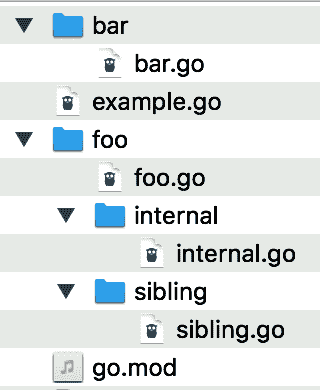

# 第十章。模块、包和导入

大多数现代编程语言都有一个将代码组织成命名空间和库的系统，Go 也不例外。正如你在探索其他特性时所见，Go 引入了一些新的方法来实现这一古老的理念。在这一章中，你将学习如何使用包和模块组织代码，如何导入它们，如何使用第三方库，以及如何创建自己的库。

# 仓库、模块和包

Go 中的库管理基于三个概念：仓库、模块和包。*仓库* 对所有开发者来说都很熟悉。它是版本控制系统中存储项目源代码的地方。*模块* 是一组作为单个单元分发和版本化的 Go 源代码。模块存储在仓库中。模块由一个或多个 *包* 组成，包是源代码的目录。包给模块提供了组织和结构。

###### 注意

虽然你可以在一个仓库中存储多个模块，但并不鼓励这样做。每个模块内的所有内容都是一起进行版本管理的。在一个仓库中维护两个模块需要你在单个仓库中跟踪两个不同模块的版本。

不幸的是，不同的编程语言使用这些术语来表示不同的概念。虽然 Java 和 Go 中的包是相似的，但 Java 仓库是存储多个 *构件*（类似于 Go 模块的东西）的集中地点。Node.js 和 Go 交换了这些术语的含义：Node.js 包类似于 Go 所称的模块，而 Go 包类似于 Node.js 模块。起初这些术语可能会令人困惑，但当你对 Go 越来越熟悉时，这些术语会变得更加熟悉。

在使用来自标准库之外的包的代码之前，你需要确保你有一个正确创建的模块。每个模块都有一个全局唯一的标识符。这不仅仅是 Go 的特性。Java 使用反向域名约定 (`com.*companyname*.*projectname*.library`) 定义全局唯一的包声明。

在 Go 中，这个名字被称为 *模块路径*。通常基于存储模块的仓库。例如，你可以在 [*https://github.com/jonbodner/proteus*](https://github.com/jonbodner/proteus) 找到 Proteus，这是我编写的一个简化 Go 中关系型数据库访问的模块。它的模块路径是 *github.com/jonbodner/proteus*。

###### 注意

回到 “你的第一个 Go 程序”，你创建了一个名为 `hello_world` 的模块，显然这不是全局唯一的。如果你只是为本地使用创建一个模块，那么这没问题。但是如果你将一个具有非唯一名称的模块放入源代码仓库中，那么其他模块将无法导入它。

# 使用 go.mod

当目录树中的 Go 源代码包含有效的 *go.mod* 文件时，它变成一个模块。不要手动创建此文件，使用 `go mod` 命令的子命令来管理模块。命令 `go mod init *MODULE_PATH*` 创建使当前目录成为模块根的 *go.mod* 文件。*MODULE_PATH* 是唯一标识您的模块的全局唯一名称。模块路径区分大小写。为避免混淆，不要在其中使用大写字母。

查看 *go.mod* 文件的内容：

```go
module github.com/learning-go-book-2e/money

go 1.21

require (
    github.com/learning-go-book-2e/formatter v0.0.0-20220918024742-18...
    github.com/shopspring/decimal v1.3.1
)

require (
    github.com/fatih/color v1.13.0 // indirect
    github.com/mattn/go-colorable v0.1.9 // indirect
    github.com/mattn/go-isatty v0.0.14 // indirect
    golang.org/x/sys v0.0.0-20210630005230-0f9fa26af87c // indirect
)
```

每个 *go.mod* 文件都以一个 `module` 指令开始，包含 `module` 一词和模块的唯一路径。接下来，*go.mod* 文件使用 `go` 指令指定 Go 的最低兼容版本。模块中的所有源代码必须与指定版本兼容。例如，如果指定了（相当旧的）版本 `1.12`，则编译器不允许在数字文字中使用下划线，因为该功能是在 Go 1.13 中添加的。

## 使用 `go` 指令管理 Go 构建版本

如果 `go` 指令指定的 Go 版本比已安装的版本更新，会发生什么？如果安装的是 Go 1.20 或更早版本，则会忽略更新的 Go 版本，并使用已安装版本的功能。如果安装的是 Go 1.21 或更新版本，则默认行为是下载更新的 Go 版本并用其构建您的代码。您可以在 Go 1.21 及更新版本中通过 `toolchain` 指令和 `GOTOOLCHAIN` 环境变量来控制此行为。可以为它们分配以下值：

+   `auto`，会下载更新的 Go 版本。（这是 Go 1.21 及更高版本的默认行为。）

+   `local`，恢复 Go 1.21 之前发布的行为。

+   特定的 Go 版本（例如 `go1.20.4`），这意味着将下载并使用特定的版本来构建程序。

例如，命令行 `GOTOOLCHAIN=go1.18 go build` 将使用 Go 1.18 构建您的 Go 程序，必要时进行下载。

如果同时设置了 `GOTOOLCHAIN` 环境变量和 `toolchain` 指令，则使用分配给 `GOTOOLCHAIN` 的值。

有关 `go` 指令、`toolchain` 指令和 `GOTOOLCHAIN` 环境变量的详细信息，请参阅[官方 Go 工具链文档](https://oreil.ly/hv3Mg)。

如《for-range 值是一个副本》中所讨论的，Go 1.22 引入了语言的首个向后不兼容的更改。当使用 Go 1.22 或更高版本时，如果 `go` 指令设置为 `1.22` 或更高，则 `for` 循环在每次迭代时创建新的索引和值变量。此行为适用于每个模块。每个导入模块中 `go` 指令的值确定该模块的语言级别。(《导入第三方代码》介绍了如何在程序中使用和管理多个模块。)

您可以通过一个简短的示例看到这种差异。您可以在 [第十章存储库](https://oreil.ly/eCRCH) 中的 *sample_code/loop_test* 目录中找到代码。

*loop.go* 文件中的代码很简单：

```go
func main() {
    x := []int{1, 2, 3, 4, 5}
    for _, v := range x {
        fmt.Printf("%p\n", &v)
    }
}
```

如果您以前没有见过，在 `fmt` 格式化语言中 `%p` 动词返回指针的内存位置。存储库的 *go.mod* 文件中的 `go` 指令设置为 `1.21`。构建和运行程序将产生以下输出：

```go
140000140a8
140000140a8
140000140a8
140000140a8
140000140a8
```

当使用较早版本的 Go 构建时，程序会五次打印相同的内存地址。（这里显示的内存地址可能会有所不同，但所有地址都是相同的值。）

将 *go.mod* 中的 `go` 指令值更改为 `1.22`，然后重新构建和运行程序。您现在将得到如下输出：

```go
1400000e0b0
1400000e0b8
1400000e0d0
1400000e0d8
1400000e0e0
```

注意每个内存地址值都不同，表明在每次迭代中创建了一个新变量。（这里显示的内存地址可能会有所不同，但每个地址都是不同的值。）

## require 指令

*go.mod* 文件中的下一节是 `require` 指令。`require` 指令仅在您的模块具有依赖项时才存在。它们列出了您的模块依赖的模块及其所需的最低版本。第一个 `require` 部分列出了您的模块的直接依赖项。第二个部分列出了您模块依赖的依赖项。此部分中的每行都以 `// indirect` 注释结尾。标记为间接依赖项和未标记的模块之间没有功能上的区别；这只是在查看 *go.mod* 文件时为人们提供的文档。在使用 `go get` 的方式时，有一种情况下会标记直接依赖项为间接依赖项，我将在讨论 `go get` 的方式时进行说明。在 “导入第三方代码” 中，您将学习如何添加和管理模块的依赖项。

虽然 `module`、`go` 和 `require` 指令是 *go.mod* 文件中最常用的指令，但还有其他三个指令。我将在 “覆盖依赖项” 中介绍 `replace` 和 `exclude` 指令，并在 “撤回模块的版本” 中介绍 `retract` 指令。

# 构建包

现在您已经学会将您的代码目录变成一个模块，是时候开始使用包来组织您的代码了。您将从了解 `import` 的工作原理开始，然后转向创建和组织包，然后再看看 Go 包的一些特性，包括好的和坏的。

## 导入和导出

即使我还没有讨论它的功能及其在 Go 中与其他语言的不同之处，示例程序一直在使用 `import` 语句。Go 的 `import` 语句允许您访问另一个包中导出的常量、变量、函数和类型。包的导出标识符（标识符是变量、常量、类型、函数、方法或结构体中的字段的名称）在没有 `import` 语句的情况下无法从当前包的另一个包中访问。

这引出了一个问题，如何在 Go 中导出标识符？Go 使用 *大写字母* 来确定包级别标识符是否对外部可见，而不是使用特殊的关键字。以大写字母开头的标识符被称为 *导出的* 标识符。相反，以小写字母或下划线开头的标识符只能从声明它的包内部访问。在 Go 中，标识符不能以数字开头，但可以包含数字。

任何您导出的内容都是包的 API 的一部分。在导出标识符之前，请确保您打算将其暴露给客户端。记录所有导出的标识符，并保持向后兼容，除非您有意进行主要版本更改（有关更多信息，请参阅“模块版本化”）。

## 创建和访问包

在 Go 中创建包很容易。让我们看一个小程序来演示这一点。您可以在[*package_example* 本书目录](https://oreil.ly/E1st2)中找到它。在 *package_example* 中，您会看到两个额外的目录，*math* 和 *do-format*。在 *math* 中，有一个名为 *math.go* 的文件，内容如下：

```go
package math

func Double(a int) int {
    return a * 2
}
```

文件的第一行称为 *包声明*。它由关键字 `package` 和包的名称组成。包声明始终是 Go 源文件中的第一行，且不能为空且非注释。

在 *do-format* 目录中有一个名为 *formatter.go* 的文件，内容如下：

```go
package format

import "fmt"

func Number(num int) string {
    return fmt.Sprintf("The number is %d", num)
}
```

请注意，包声明中的包名是 `format`，但它位于 *do-format* 目录中。很快将介绍如何与此包交互。

最后，在根目录中的文件 *main.go* 中包含以下内容：

```go
package main

import (
    "fmt"

    "github.com/learning-go-book-2e/package_example/do-format"
    "github.com/learning-go-book-2e/package_example/math"
)

func main() {
    num := math.Double(2)
    output := format.Number(num)
    fmt.Println(output)
}
```

本文件的第一行很熟悉。在本章之前的所有程序中，代码的第一行都是`package main`。稍后我会详细讨论这意味着什么。

接下来是导入部分。它导入了三个包。第一个是标准库中的 `fmt` 包。您在之前的章节中已经做过这个操作。接下来的两个导入引用程序内部的包。除了标准库之外，当从任何地方导入时，您必须指定 *导入路径*。导入路径由模块路径和模块内包路径组成。例如，导入 `"github.com/learning-go-book-2e/package_example/math"` 其中模块路径为 `github.com/learning-go-book-2e/package_example`，而 `/math` 是模块内包路径。

导入包但未使用包导出的任何标识符是编译时错误。这确保了由 Go 编译器生成的二进制文件仅包含程序中实际使用的代码。

###### 警告

您可能会在网络上遇到关于相对路径导入路径的过时文档。它们不适用于模块。（而且本来就不是一个好主意。）

运行此程序时，您将看到以下输出：

```go
$ go build
$ ./package_example
The number is 4

```

`main` 函数通过在函数名前加上包名调用了 `math` 包中的 `Double` 函数。在之前的章节中调用标准库中的函数时，您也调用了 `format` 包中的 `Number` 函数。您可能会想知道这个 `format` 包是从哪里来的，因为导入中写的是 `github.com/learning-go-book-2e/package_example/do-format`。

目录中的每个 Go 文件必须具有相同的包子句。（在“测试您的公共 API”中，您会看到一个微小的例外。）您使用 *github.com/learning-go-book-2e/package_example/do-format* 导入了 `format` 包。这是因为 *包的名称由其包子句确定，而不是其导入路径*。

作为一般规则，应使包名与包含包的目录名相匹配。如果包名与包含它的目录名不匹配，则很难发现包的名称。但在少数情况下，您将为包使用与目录不同的名称。

第一个是您一直在做的事情，但没有意识到。通过使用特殊包名 `main`，您声明了一个 Go 应用程序的起始点。由于无法导入 `main` 包，这不会产生混淆的导入语句。

包名与目录名不匹配的其他原因较少见。如果您的目录名包含 Go 标识符中不合法的字符，则必须选择与目录名不同的包名。在您的情况下，`do-format` 不是有效的标识符名称，因此它被替换为 `format`。最好通过永远不创建名称不是有效标识符的目录来避免这种情况。

创建一个名称与包名不匹配的目录的最终原因是使用目录支持版本控制。我将在“版本化您的模块”中更详细地讨论这一点。

如在“块”中讨论的那样，`import`语句中的包名位于*文件块*中。如果您在另一个包的两个不同文件中使用一个包中的导出符号，则必须在第二个包的两个文件中都导入第一个包。

## 包命名

包名应具有描述性。而不是称为`util`的包，应创建一个描述包功能的包名。例如，假设您有两个辅助函数：一个从字符串中提取所有名称，另一个正确格式化名称。不要在名为`util`的包中创建名为`ExtractNames`和`FormatNames`的两个函数。如果这样做，每次使用这些函数时，它们将被称为`util.ExtractNames`和`util.FormatNames`，而`util`包并未告诉您这些函数的实际功能。

一个选择是在称为`extract`的包中创建一个名为`Names`的函数，以及在称为`format`的包中创建一个名为`Names`的第二个函数。这两个函数具有相同的名称是可以接受的，因为它们始终会通过其包名称加以区分。第一个将在导入时被称为`extract.Names`，第二个将被称为`format.Names`。

更好的选择是考虑语法成分。函数或方法执行某些操作，因此它应该是一个动词或动作词。包将是一个名词，用来描述由包中的函数创建或修改的项目类型。遵循这些规则，您将创建一个名为`names`的包，其中包含两个函数，`Extract`和`Format`。第一个将被称为`names.Extract`，第二个将被称为`names.Format`。

您还应避免在包内函数和类型的名称中重复包的名称。当标识符的名称与包的名称相同时，此规则的例外情况会发生。例如，标准库中的`sort`包具有名为`Sort`的函数，而`context`包定义了`Context`接口。

## 覆盖包的名称

有时你会发现自己导入了两个包名冲突的包。例如，标准库包括两个生成随机数的包；一个是加密安全的（`crypto/rand`），另一个则不是（`math/rand`）。在不需要为加密生成随机数时，可以使用常规生成器，但需要用不可预测的值对其进行种子化。常见模式是使用加密生成器的值来初始化常规随机数生成器。在 Go 中，这两个包都有相同的名称（`rand`）。当发生这种情况时，在当前文件中为其中一个包提供替代名称。在[Go Playground](https://oreil.ly/YVwkm)或[第十章库中的*sample_code/package_name_override*目录](https://oreil.ly/eCRCH)中尝试这段代码。首先，查看导入部分：

```go
import (
    crand "crypto/rand"
    "encoding/binary"
    "fmt"
    "math/rand"
)
```

你用名称`crand`导入了`crypto/rand`。这样会覆盖包内声明的`rand`名称。然后你正常地导入了`math/rand`。当你查看`seedRand`函数时，你会看到你使用`rand`前缀访问`math/rand`中的标识符，并使用`crand`前缀访问`crypto/rand`包中的标识符：

```go
func seedRand() *rand.Rand {
    var b [8]byte
    _, err := crand.Read(b[:])
    if err != nil {
        panic("cannot seed with cryptographic random number generator")
    }
    r := rand.New(rand.NewSource(int64(binary.LittleEndian.Uint64(b[:]))))
    return r
}
```

###### 注意

你可以使用另外两个符号作为包名。包名`.`（点）将所有导出的标识符放入当前包的命名空间中；你不需要前缀来引用它们。这是不鼓励的，因为它会使你的源代码不够清晰。你不能仅仅通过看它的名称就知道某些东西是在当前包中定义的还是被导入的。

你还可以使用`_`（下划线）作为包名。当我讨论“尽量避免使用 init 函数”时，你将了解它的作用。

正如我在“变量遮蔽”中讨论的那样，包名可以被遮蔽。声明与包相同名称的变量、类型或函数会使得该包在声明的区块内无法访问。如果这是不可避免的（例如，新导入的包与现有标识符冲突），请修改包名以解决冲突。

## 使用 Go Doc 注释文档化您的代码

创建供他人使用的模块的一个重要部分是正确地进行文档化。Go 有自己的写入注释的格式，这些注释会自动转换为文档。它称为*Go Doc*格式，非常简单。以下是规则：

+   将注释直接放在要文档化的项之前，注释与项的声明之间不要留空行。

+   每行注释以双斜杠（//）开始，后跟一个空格。虽然使用/*和*/标记注释块是合法的，但习惯上使用双斜杠更为惯用。

+   对于符号的注释（函数、类型、常量、变量或方法），注释中的第一个词应该是符号的名称。您也可以在符号名称前使用“A”或“An”来帮助使注释文本在语法上正确。

+   使用空白注释行（双斜杠和一个换行符）将您的注释分成多个段落。

正如我将在“使用`pkg.go.dev`”中讨论的那样，您可以在线查看以 HTML 格式发布的公共文档。如果您想让您的文档看起来更加漂亮，有几种格式化方式：

+   如果您希望您的注释包含一些预格式化的内容（如表格或源代码），请在双斜杠后面加一个额外的空格，以使内容的行缩进。

+   如果您想在注释中添加标题，请在双斜杠后面放置 `#` 和一个空格。与 Markdown 不同，您不能使用多个 `#` 字符来创建不同级别的标题。

+   要创建指向另一个包的链接（无论该包是否在当前模块中），请将包路径放在方括号内（`[` 和 `]`）。

+   要链接到导出的符号，请将其名称放在方括号中。如果该符号在另一个包中，请使用`[pkgName.SymbolName]`。

+   如果在注释中包含原始 URL，它将被转换为链接。

+   如果您想要包含指向网页的文本，请将文本放在方括号内（`[` 和 `]`）。在注释块的末尾，使用格式 `// [*TEXT*]: *URL*` 声明您的文本与其 URL 之间的映射。您将很快看到一个示例。

在包声明之前的注释创建包级别的注释。如果您对包有详尽的注释（例如`fmt`包中的广泛格式化文档），惯例是将注释放在名为 *doc.go* 的文件中。

让我们浏览一个有详细注释的文件，从示例 10-1 中的包级别注释开始。

##### 示例 10-1\. 一个包级别的注释

```go
// Package convert provides various utilities to
// make it easy to convert money from one currency to another.
package convert
```

接下来，在一个导出的结构体上放置一个注释（参见示例 10-2）。注意它以结构体的名称开头。

##### 示例 10-2\. 一个结构体的注释

```go
// Money represents the combination of an amount of money
// and the currency the money is in.
//
// The value is stored using a [github.com/shopspring/decimal.Decimal]
type Money struct {
    Value    decimal.Decimal
    Currency string
}
```

最后，这是一个函数的注释（参见示例 10-3）。

##### 示例 10-3\. 一个有详细注释的函数

```go
// Convert converts the value of one currency to another.
//
// It has two parameters: a Money instance with the value to convert,
// and a string that represents the currency to convert to. Convert returns
// the converted currency and any errors encountered from unknown or unconvertible
// currencies.
//
// If an error is returned, the Money instance is set to the zero value.
//
// Supported currencies are:
//   - USD - US Dollar
//   - CAD - Canadian Dollar
//   - EUR - Euro
//   - INR - Indian Rupee
//
// More information on exchange rates can be found at [Investopedia].
//
// [Investopedia]: https://www.investopedia.com/terms/e/exchangerate.asp
func Convert(from Money, to string) (Money, error) {
    // ...
}
```

Go 包含一个名为`go doc`的命令行工具，用于显示 godoc 文档。命令`go doc` *`PACKAGE_NAME`* 会显示指定包的文档以及包中标识符的列表。使用`go doc` *`PACKAGE_NAME.IDENTIFIER_NAME`* 可以显示包中特定标识符的文档。

如果您想在文档发布到 Web 之前预览其 HTML 格式化，请使用`pkgsite`。这是与`pkg.go.dev`相同的程序（稍后在本章中将详细讨论）。要安装`pkgsite`，请使用以下命令：

```go
$ go install golang.org/x/pkgsite/cmd/pkgsite@latest

```

（我将在“使用`go install`添加第三方工具”中详细讨论`go install`。）

要查看源代码的注释以 HTML 格式呈现，请转到您模块的根目录并运行以下命令：

```go
$ pkgsite

```

然后去[*http://localhost:8080*](http://localhost:8080)查看您的项目及其源代码。

您可以通过阅读官方的[Go Doc Comments 文档](https://oreil.ly/cakQm)找到有关注释和潜在陷阱的更多详细信息。

###### 提示

确保适当地注释您的代码。至少，任何导出的标识符都应该有注释。在“使用代码质量扫描工具”中，您将看到一些第三方工具，它们可以报告导出标识符缺失的注释。

## 使用`internal`包

有时候，您想要在模块中的多个包之间共享函数、类型或常量，但又不希望将其作为 API 的一部分。Go 通过特殊的`internal`包名来支持这一点。

当您创建一个名为`internal`的包时，该包及其子包中的导出标识符仅对`internal`的直接父包和`internal`的同级包可访问。让我们通过一个示例来看看它是如何工作的。您可以在[GitHub](https://oreil.ly/pJokh)上找到该代码。目录树如图 10-1 所示。

您在`internal`包的*internal.go*文件中声明了一个简单的函数：

```go
func Doubler(a int) int {
    return a * 2
}
```

您可以从`foo`包中的*foo.go*和`sibling`包中的*sibling.go*访问此函数。



###### 图 10-1. `internal_package_example`的文件树

请注意，试图从`bar`包的*bar.go*或根包的*example.go*中使用内部函数会导致编译错误：

```go
$ go build ./...
package github.com/learning-go-book-2e/internal_example
example.go:3:8: use of internal package
github.com/learning-go-book-2e/internal_example/foo/internal not allowed

package github.com/learning-go-book-2e/internal_example/bar
bar/bar.go:3:8: use of internal package
github.com/learning-go-book-2e/internal_example/foo/internal not allowed

```

## 避免循环依赖

Go 语言的两个目标是快速编译器和易于理解的源代码。为支持这一点，Go 不允许包之间存在*循环依赖*。如果包 A 直接或间接导入包 B，那么包 B 就不能直接或间接导入包 A。

让我们看一个快速示例来解释这个概念。您可以在[第十章存储库](https://oreil.ly/eCRCH)的*sample_code/circular_dependency_example*目录中找到代码。有两个包，`pet`和`person`。在`pet`包的*pet.go*中，您有以下内容：

```go
import "github.com/learning-go-book-2e/ch10/sample_code/
circular_dependency_example/person"

var owners = map[string]person.Person{
	"Bob":   {"Bob", 30, "Fluffy"},
	"Julia": {"Julia", 40, "Rex"},
}
```

而在`person`包的*person.go*中，您有以下内容：

```go
import "github.com/learning-go-book-2e/ch10/sample_code/
circular_dependency_example/pet"

var pets = map[string]pet.Pet{
	"Fluffy": {"Fluffy", "Cat", "Bob"},
	"Rex":    {"Rex", "Dog", "Julia"},
}
```

如果您尝试构建此程序，将会收到一个错误：

```go
$ go build ./sample_code/circular_dependency_example
package github.com/learning-go-book-2e/ch10/sample_code/
    circular_dependency_example
	imports github.com/learning-go-book-2e/ch10/sample_code/
        circular_dependency_example/person
	imports github.com/learning-go-book-2e/ch10/sample_code/
        circular_dependency_example/pet
	imports github.com/learning-go-book-2e/ch10/sample_code/
        circular_dependency_example/person: import cycle not allowed

```

如果您发现自己处于循环依赖中，您有几个选择。在某些情况下，这是由于将包分割得过细造成的。如果两个包彼此依赖，它们应该合并为一个单独的包的可能性很高。您可以将`person`和`pet`包合并为一个包，问题就解决了。

如果您有充分的理由保持包的分离，可能可以将导致循环依赖的项仅移动到两个包中的一个或者移动到一个新包中。

## 组织您的模块

没有官方的方式来组织 Go 模块中的包，但是多年来出现了几种模式。它们的指导原则是你应该专注于使你的代码易于理解和维护。

当你的模块很小的时候，将所有代码放在一个包中。只要没有其他模块依赖于你的模块，延迟组织是没有害处的。

当你的模块逐渐增大时，你会希望进行一些整理，以使你的代码更易读。首先要问的问题是你正在创建什么类型的模块。你可以将模块分为两大类：那些用作单个应用程序的模块和主要用作库的模块。如果你确定你的模块只用作应用程序，那么将项目的根目录命名为`main`包。`main`包中的代码应该尽量精简；将所有逻辑放在一个*internal*目录中，而`main`函数中的代码仅需调用*internal*中的代码。这样，你可以确保没有人会创建依赖于你应用程序实现的模块。

如果你希望你的模块作为库被使用，那么你的模块根目录应该有一个与存储库名称匹配的包名。这确保了导入名称与包名匹配。为使其工作，你必须确保你的存储库名称是有效的 Go 标识符。特别地，你不能在存储库名称中使用连字符作为单词分隔符，因为连字符在包名中不是有效的字符。

对于库模块而言，包含一个或多个与其一起作为实用工具的应用程序是很常见的。在这种情况下，在你的模块根目录下创建一个名为*cmd*的目录。在*cmd*中，为从你的模块构建的每个二进制文件创建一个目录。例如，你可能有一个模块，其中既包含一个 Web 应用程序，又包含一个分析 Web 应用程序数据库中数据的命令行工具。在这些目录中，使用`main`作为包名。

更详细的信息，请参考 Eli Bendersky 的[这篇博文](https://oreil.ly/faMHH)，它提供了关于如何组织一个简单 Go 模块的良好建议。

随着项目变得更加复杂，你会有将包拆分的冲动。确保组织你的代码以限制包之间的依赖关系。一个常见的模式是按功能划分代码。例如，如果你在 Go 语言中编写了一个购物网站，你可以将所有客户管理的代码放在一个包中，将所有库存管理的代码放在另一个包中。这种风格限制了包之间的依赖关系，使得以后将单个 Web 应用程序重构为多个微服务变得更容易。这种风格与许多 Java 应用程序的组织方式相反，后者将所有业务逻辑放在一个包中，所有数据库逻辑放在另一个包中，将数据传输对象放在第三个包中。

在开发库时，请利用 `internal` 包。如果在模块中创建多个包，并且它们不在 `internal` 包中，则导出符号以便其他包在您的模块中使用，这意味着*任何人*都可以使用它。在软件工程中有一个原则叫做 [Hyrum’s law](https://oreil.ly/820xv)：“只要 API 有足够多的用户，那么您在合同中承诺的内容就无关紧要：系统的所有可观察行为都会被某人依赖。”一旦某物成为您的 API 的一部分，您有责任继续支持它，直到决定发布一个不向后兼容的新版本。您将在 “更新到不兼容版本” 中学习如何做到这一点。如果您有一些符号希望仅在模块内共享，请将它们放在 `internal` 中。如果您改变主意，随时可以稍后将包移出 `internal`。

要了解有关 Go 项目结构建议的概述，请观看 Kat Zien 在 GopherCon 2018 的演讲[“你如何组织你的 Go 应用程序”](https://oreil.ly/0zHY4)。

###### 警告

GitHub 上的 “golang-standards” 仓库声称是 “标准” 模块布局。Go 的开发主管 Russ Cox 已经[公开表示](https://oreil.ly/PAhWS)这不被 Go 团队认可，并且它推荐的结构实际上是反模式。请不要将此仓库作为组织代码的方法。

## 优雅地重命名和重新组织您的 API

使用模块一段时间后，您可能会意识到其 API 不理想。您可能想要重命名一些导出标识符或将它们移动到模块中的另一个包中。为避免破坏向后兼容性的变更，请勿移除原始标识符；而是提供替代名称。

对于函数或方法，这很容易。您声明一个调用原始函数或方法的函数或方法。对于常量，只需声明一个新常量，类型和值相同，但名称不同。

如果您想重命名或移动一个导出类型，可以使用别名。简单地说，*别名* 是类型的新名称。您在第七章 中看到如何使用 `type` 关键字基于现有类型声明一个新类型。您也可以使用 `type` 关键字声明一个别名。假设您有一个名为 `Foo` 的类型：

```go
type Foo struct {
    x int
    S string
}

func (f Foo) Hello() string {
    return "hello"
}

func (f Foo) goodbye() string {
    return "goodbye"
}
```

如果您想让用户通过名称 `Bar` 访问 `Foo`，您所需做的只是这样：

```go
type Bar = Foo
```

要创建别名，请使用 `type` 关键字、别名的名称、一个等号以及原始类型的名称。别名具有与原始类型相同的字段和方法。

别名甚至可以分配给原始类型的变量，而无需进行类型转换：

```go
func MakeBar() Bar {
    bar := Bar{
        x: 20,
        S: "Hello",
    }
    var f Foo = bar
    fmt.Println(f.Hello())
    return bar
}
```

重要的一点要记住：别名只是类型的另一个名称。如果您想要添加新的方法或更改别名结构中的字段，必须将它们添加到原始类型中。

你可以为在同一个包中定义的原始类型或在不同包中定义的类型设置别名。甚至可以为另一个模块中的类型设置别名。在另一个包中设置别名的一个缺点是：你不能使用别名来引用原始类型的未导出方法和字段。这种限制是有道理的，因为别名存在的目的是允许逐步更改包的 API，并且 API 只包括包的导出部分。为了解决这个限制，调用类型的原始包中的代码来操作未导出的字段和方法。

两种类型的导出标识符不能有备用名称。第一种是包级变量。第二种是结构体中的字段。一旦为导出的结构体字段选择了名称，就没有办法创建备用名称。

## 避免使用 `init` 函数

当你阅读 Go 代码时，通常清楚哪些方法和函数被调用。Go 没有方法重写或函数重载的一个原因是为了更容易理解哪些代码正在运行。然而，有一种方法可以在不显式调用任何内容的情况下设置包中的状态：`init` 函数。当你声明一个名为 `init` 的函数，它不带参数并且不返回任何值时，它会在另一个包首次引用该包时运行。由于 `init` 函数没有任何输入或输出，它们只能通过副作用工作，与包级别的函数和变量进行交互。

`init` 函数还有另一个独特的特性。Go 允许在单个包中或甚至在包中的单个文件中声明多个 `init` 函数。有一个记录的顺序来运行单个包中的多个 `init` 函数，但与其记住它，不如简单地避免使用它们。

有些包，比如数据库驱动程序，使用 `init` 函数来注册数据库驱动程序。然而，你并不使用包中的任何标识符。正如前面提到的，Go 不允许你有未使用的导入。为了解决这个问题，Go 允许*空白导入*，其中分配给导入的名称是下划线 (`_`)。正如下划线允许你跳过从函数返回的未使用值一样，空白导入触发包中的 `init` 函数，但不允许你访问包中的任何导出标识符：

```go
import (
    "database/sql"

    _ "github.com/lib/pq"
)
```

这种模式被认为是过时的，因为不清楚是否正在执行注册操作。Go 对其标准库的兼容性保证意味着你被限制使用它来注册数据库驱动程序和图像格式，但如果你在自己的代码中有一个注册模式，要显式地注册你的插件。

今天`init`函数的主要用途是初始化不能在单个赋值中配置的包级变量。在包的顶层有可变状态是个坏主意，因为这会使得理解数据在你的应用程序中的流动变得更加困难。这意味着通过`init`配置的任何包级变量都应该是*有效不可变的*。虽然 Go 没有提供强制确保它们的值不会改变的方法，但你应确保你的代码不会改变它们。如果你有需要在程序运行时修改的包级变量，看看是否可以重构你的代码，将该状态放入一个由包中的函数初始化并返回的结构体中。

隐式调用`init`函数意味着你应该记录它们的行为。例如，一个包含`init`函数的包，用于加载文件或访问网络，应该在包级别的注释中说明，以便对代码安全性敏感的用户不会因意外的 I/O 而感到惊讶。

# 使用模块

你已经学习了如何在单个模块内使用包，现在是时候学习如何与第三方模块及其内部的包集成了。接下来，你将学习如何发布和版本化你自己的模块，以及 Go 的集中服务：pkg.go.dev、模块代理和校验和数据库。

## 导入第三方代码

到目前为止，你已经从标准库中导入了`fmt`、`errors`、`os`和`math`等包。Go 使用相同的导入系统来集成来自第三方的包。与许多其他编译语言不同，Go 总是将应用程序从源代码构建成单个二进制文件。这包括你的模块的源代码以及你的模块依赖的所有模块的源代码。（Go 编译器足够智能，不会在生成的二进制文件中包含未引用的包。）正如你从自己的模块内导入包时看到的那样，当你导入第三方包时，你需要指定源代码仓库中包的位置。

让我们来看一个例子。我在第二章中提到，当你需要准确表示小数时，永远不要使用浮点数。如果确实需要准确的表示，一个好的选择是来自[ShopSpring](https://oreil.ly/UZfMN)的`decimal`模块。你还将看到我为本书编写的一个简单的[格式化模块](https://oreil.ly/q-Ce5)。这两个模块都在本书的[money repository](https://oreil.ly/vSiNr)中的一个小程序中使用。该程序计算包含税款的商品价格，并以整洁的格式输出。

下面的代码在*main.go*中：

```go
package main

import (
    "fmt"
    "log"
    "os"

    "github.com/learning-go-book-2e/formatter"
    "github.com/shopspring/decimal"
)

func main() {
    if len(os.Args) < 3 {
        fmt.Println("Need two parameters: amount and percent")
        os.Exit(1)
    }
    amount, err := decimal.NewFromString(os.Args[1])
    if err != nil {
        log.Fatal(err)
    }
    percent, err := decimal.NewFromString(os.Args[2])
    if err != nil {
        log.Fatal(err)
    }
    percent = percent.Div(decimal.NewFromInt(100))
    total := amount.Add(amount.Mul(percent)).Round(2)
    fmt.Println(formatter.Space(80, os.Args[1], os.Args[2],
                                total.StringFixed(2)))
}
```

两个导入`github.com/learning-go-book-2e/formatter`和`github.com/shopspring/decimal`指定了第三方导入。请注意，它们包含包在存储库中的位置。一旦导入，您可以像任何其他导入的包一样访问这些包中的导出项。

在构建应用程序之前，请查看*go.mod*文件。其内容应如下所示：

```go
module github.com/learning-go-book-2e/money

go 1.20
```

如果尝试构建，会收到以下消息：

```go
$ go build
main.go:8:2: no required module provides package
    github.com/learning-go-book-2e/formatter; to add it:
        go get github.com/learning-go-book-2e/formatter
main.go:9:2: no required module provides package
    github.com/shopspring/decimal; to add it:
        go get github.com/shopspring/decimal

```

正如错误所指出的，直到您向*go.mod*文件添加对第三方模块的引用，才能构建程序。`go get`命令下载模块并更新*go.mod*文件。在使用`go get`时有两个选项。最简单的选项是告诉`go get`扫描您模块的源代码，并添加任何在`import`语句中找到的模块到*go.mod*中：

```go
$ go get ./...
go: downloading github.com/shopspring/decimal v1.3.1
go: downloading github.com/learning-go-book-2e/formatter
    v0.0.0-20220918024742-1835a89362c9
go: downloading github.com/fatih/color v1.13.0
go: downloading github.com/mattn/go-colorable v0.1.9
go: downloading github.com/mattn/go-isatty v0.0.14
go: downloading golang.org/x/sys v0.0.0-20210630005230-0f9fa26af87c
go: added github.com/fatih/color v1.13.0
go: added github.com/learning-go-book-2e/formatter
    v0.0.0-20220918024742-1835a89362c9
go: added github.com/mattn/go-colorable v0.1.9
go: added github.com/mattn/go-isatty v0.0.14
go: added github.com/shopspring/decimal v1.3.1
go: added golang.org/x/sys v0.0.0-20210630005230-0f9fa26af87c

```

由于包的位置在源代码中，`go get`能够获取包的模块并下载它。如果现在查看*go.mod*文件，您将看到这个内容：

```go
module github.com/learning-go-book-2e/money

go 1.20

require (
    github.com/learning-go-book-2e/formatter v0.0.0-20220918024742-1835a89362c9
    github.com/shopspring/decimal v1.3.1
)

require (
    github.com/fatih/color v1.13.0 // indirect
    github.com/mattn/go-colorable v0.1.9 // indirect
    github.com/mattn/go-isatty v0.0.14 // indirect
    golang.org/x/sys v0.0.0-20210630005230-0f9fa26af87c // indirect
)
```

*go.mod*文件的第一个`require`部分列出了导入到您模块的模块。模块名后面是版本号。对于`formatter`模块来说，它没有版本标签，因此 Go 会生成一个*伪版本*。

您还会看到第二个`require`指令部分，其中的模块带有*indirect*注释。这些模块中的一个（`github.com/fatih/color`）直接被`formatter`使用。而`formatter`又依赖于第二个`require`指令部分的其他三个模块。您模块的所有依赖（及其依赖的依赖等等）使用的所有模块都包含在您模块的*go.mod*文件中。只在依赖中使用的模块标记为间接。

除了更新*go.mod*文件外，还创建了一个*go.sum*文件。您项目的依赖树中每个模块在*go.sum*文件中都有一到两个条目：一个是模块及其版本及模块哈希的条目；另一个是模块的*go.mod*文件的哈希条目。下面是*go.sum*文件的示例：

```go
github.com/fatih/color v1.13.0 h1:8LOYc1KYPPmyKMuN8QV2DNRWNbLo6LZ0iLs...
github.com/fatih/color v1.13.0/go.mod h1:kLAiJbzzSOZDVNGyDpeOxJ47H46q...
github.com/learning-go-book-2e/formatter v0.0.0-20220918024742-1835a8...
github.com/learning-go-book-2e/formatter v0.0.0-20220918024742-1835a8...
github.com/mattn/go-colorable v0.1.9 h1:sqDoxXbdeALODt0DAeJCVp38ps9Zo...
github.com/mattn/go-colorable v0.1.9/go.mod h1:u6P/XSegPjTcexA+o6vUJr...
github.com/mattn/go-isatty v0.0.12/go.mod h1:cbi8OIDigv2wuxKPP5vlRcQ1...
github.com/mattn/go-isatty v0.0.14 h1:yVuAays6BHfxijgZPzw+3Zlu5yQgKGP...
github.com/mattn/go-isatty v0.0.14/go.mod h1:7GGIvUiUoEMVVmxf/4nioHXj...
github.com/shopspring/decimal v1.3.1 h1:2Usl1nmF/WZucqkFZhnfFYxxxu8LG...
github.com/shopspring/decimal v1.3.1/go.mod h1:DKyhrW/HYNuLGql+MJL6WC...
golang.org/x/sys v0.0.0-20200116001909-b77594299b42/go.mod h1:h1NjWce...
golang.org/x/sys v0.0.0-20200223170610-d5e6a3e2c0ae/go.mod h1:h1NjWce...
golang.org/x/sys v0.0.0-20210630005230-0f9fa26af87c h1:F1jZWGFhYfh0Ci...
golang.org/x/sys v0.0.0-20210630005230-0f9fa26af87c/go.mod h1:oPkhp1M...
```

您会看到这些哈希用途在“模块代理服务器”中。您可能还注意到某些依赖项有多个版本。我将在“最小版本选择”中讨论这一点。

让我们验证一下您的模块现在是否设置正确。再次运行`go build`，然后运行`money`二进制文件并传递一些参数：

```go
$ go build
$ ./money 99.99 7.25
99.99           7.25                                                 107.24

```

###### 注意

此示例程序已经检入，但没有*go.sum*文件，并且*go.mod*文件不完整。这样做是为了让您看到这些文件填充后的效果。在提交自己的模块到源代码控制时，请务必包含最新的*go.mod*和*go.sum*文件。这样做可以明确指定正在使用的依赖项的确切版本。这样可以实现*可重复构建*；当其他人（包括未来的您自己）构建此模块时，他们将获得完全相同的二进制文件。

正如我之前提到的，还有另一种使用 `go get` 的方式。而不是让它扫描你的源代码来发现模块，你可以直接传递模块路径给 `go get`。要看到这一点的效果，请回滚对 *go.mod* 文件的更改并删除 *go.sum* 文件。在类 Unix 系统上，以下命令将执行此操作：

```go
$ git restore go.mod
$ rm go.sum

```

现在，直接将模块路径传递给 `go get`：

```go
$ go get github.com/learning-go-book-2e/formatter
go: added github.com/learning-go-book-2e/
    formatter v0.0.0-20200921021027-5abc380940ae
$ go get github.com/shopspring/decimal
go: added github.com/shopspring/decimal v1.3.1

```

###### 注意

一些眼尖的读者可能已经注意到，当我们第二次使用 `go get` 时，并没有显示 `go: downloading` 的消息。原因是 Go 在你的本地计算机上维护了一个 *模块缓存*。一旦下载了模块的某个版本，就会在缓存中保留一个副本。源代码非常紧凑，而驱动器非常大，所以通常不会引起关注。然而，如果你想删除模块缓存，可以使用命令 `go clean -modcache`。

查看 *go.mod* 的内容，它们会与之前略有不同：

```go
module github.com/learning-go-book-2e/money

go 1.20

require (
    github.com/fatih/color v1.13.0 // indirect
    github.com/learning-go-book-2e/
    formatter v0.0.0-20220918024742-1835a89362c9 // indirect
    github.com/mattn/go-colorable v0.1.9 // indirect
    github.com/mattn/go-isatty v0.0.14 // indirect
    github.com/shopspring/decimal v1.3.1 // indirect
    golang.org/x/sys v0.0.0-20210630005230-0f9fa26af87c // indirect
)
```

请注意，所有的导入都标记为 *indirect*，而不仅仅是来自 `formatter` 的导入。当你运行 `go get` 并传递一个模块名时，它不会检查你的源代码以确定你指定的模块是否在你的主模块中使用。为了安全起见，它添加了一个间接注释。

如果你想自动修复这个标签，请使用命令 `go mod tidy`。它会扫描你的源代码，并与你模块的源代码同步 *go.mod* 和 *go.sum* 文件，添加和删除模块引用。它还确保间接注释是正确的。

也许你想知道为什么要费心使用 `go get` 来管理模块名称。原因在于它允许你更新单个模块的版本。

## 版本管理

让我们看看 Go 的模块系统如何使用版本。我写了一个[简单的模块](https://oreil.ly/zx0GR)，你将在另一个[税收程序](https://oreil.ly/AyAz_)中使用它。在 *main.go* 中，有以下第三方导入：

```go
"github.com/learning-go-book-2e/simpletax"
"github.com/shopspring/decimal"
```

与之前一样，示例程序没有与 *go.mod* 和 *go.sum* 一起检入，因此你可以看到发生了什么。当构建程序时，你会看到以下内容：

```go
$ go get ./...
go: downloading github.com/learning-go-book-2e/simpletax v1.1.0
go: added github.com/learning-go-book-2e/simpletax v1.1.0
go: added github.com/shopspring/decimal v1.3.1
$ go build

```

*go.mod* 文件已更新：

```go
module github.com/learning-go-book-2e/region_tax

go 1.20

require (
    github.com/learning-go-book-2e/simpletax v1.1.0
    github.com/shopspring/decimal v1.3.1
)
```

你的依赖关系还有一个 *go.sum* 文件，其中包含哈希值。运行代码，看看是否工作正常：

```go
$ ./region_tax 99.99 12345
2022/09/19 22:04:38 unknown zip: 12345

```

看起来这个答案有些出乎意料。模块的最新版本可能存在 bug。默认情况下，当你将一个依赖项添加到你的模块时，Go 会选择其最新版本。然而，版本控制的一个有用之处在于，你可以指定一个较早的模块版本。首先，你可以用 `go list` 命令查看模块的所有版本：

```go
$ go list -m -versions github.com/learning-go-book-2e/simpletax
github.com/learning-go-book-2e/simpletax v1.0.0 v1.1.0

```

默认情况下，`go list` 命令列出你模块中使用的包。使用 `-m` 标志可以改变输出，列出模块而非包；`-versions` 标志则改变 `go list` 的输出，报告指定模块的可用版本。在这种情况下，你会看到有两个版本，v1.0.0 和 v1.1.0\. 让我们降级到版本 v1.0.0，看看是否能解决你的问题。你可以使用 `go get` 命令来做到这一点：

```go
$ go get github.com/learning-go-book-2e/simpletax@v1.0.0
go: downloading github.com/learning-go-book-2e/simpletax v1.0.0
go: downgraded github.com/learning-go-book-2e/simpletax v1.1.0 => v1.0.0

```

`go get` 命令允许你使用模块，更新你的依赖项版本。

现在如果你查看 *go.mod*，你会看到版本已经更改了：

```go
module github.com/learning-go-book-2e/region_tax

go 1.20

require (
    github.com/learning-go-book-2e/simpletax v1.0.0
    github.com/shopspring/decimal v1.3.1
)
```

你还可以在 *go.sum* 中看到 `simpletax` 包含两个版本：

```go
github.com/learning-go-book-2e/simpletax v1.0.0 h1:KZU8aXRCHkvgFmBWkV...
github.com/learning-go-book-2e/simpletax v1.0.0/go.mod h1:lR4YYZwbDTI...
github.com/learning-go-book-2e/simpletax v1.1.0 h1:sG83gscauX/b8yKKY9...
github.com/learning-go-book-2e/simpletax v1.1.0/go.mod h1:lR4YYZwbDTI...
```

这没问题；如果你更改模块的版本，甚至从你的模块中删除一个模块，它的条目可能仍然会留在 *go.sum* 中。这不会引起问题。

当你再次构建和运行代码时，问题已经解决了：

```go
$ go build
$ ./region_tax 99.99 12345
107.99

```

## 最小版本选择

在某些情况下，你的模块将依赖于两个或更多依赖于同一模块的模块。通常情况下，这些模块声明依赖于该模块的不同次要或修订版本。Go 如何解决这个问题？

模块系统使用*最小版本选择*原则：你总是会获得在所有依赖项的 *go.mod* 文件中都声明可以工作的最低版本的依赖项。假设你的模块直接依赖于模块 A、B 和 C。这三个模块都依赖于模块 D。模块 A 的 *go.mod* 文件声明依赖于 v1.1.0，模块 B 声明依赖于 v1.2.0，模块 C 声明依赖于 v1.2.3\. Go 只会导入模块 D 一次，并且它会选择 v1.2.3 版本，因为这是满足所有要求的最低版本，如 [Go 模块参考](https://oreil.ly/6YRBy) 所述。

你可以在 “导入第三方代码” 中的示例程序中看到这个操作。命令 `go mod graph` 显示了你模块及其所有依赖项的依赖图。以下是部分输出：

```go
github.com/learning-go-book-2e/money github.com/fatih/color@v1.13.0
github.com/learning-go-book-2e/money github.com/mattn/go-colorable@v0.1.9
github.com/learning-go-book-2e/money github.com/mattn/go-isatty@v0.0.14
github.com/fatih/color@v1.13.0 github.com/mattn/go-colorable@v0.1.9
github.com/fatih/color@v1.13.0 github.com/mattn/go-isatty@v0.0.14
github.com/mattn/go-colorable@v0.1.9 github.com/mattn/go-isatty@v0.0.12
```

每一行列出两个模块，第一个是父模块，第二个是依赖及其版本。你会注意到 `github.com/fatih/color` 模块依赖于 `github.com/mattn/go-isatty` 的 v0.0.14 版本，而 `github.com/mattn/go-colorable` 则依赖于 v0.0.12\. Go 编译器选择使用版本 v0.0.14，因为它是满足所有要求的最低版本。尽管截至撰写本文时，`github.com/mattn/go-isatty` 的最新版本是 v0.0.16，但你的最低版本要求满足了 v0.0.14，所以就使用了这个版本。

这个系统并不完美。您可能会发现，虽然模块 A 与模块 D 的版本 v1.1.0 兼容，但却无法与版本 v1.2.3 兼容。那么该怎么办呢？Go 的答案是，您需要联系模块作者修复其不兼容性。*导入兼容性规则*说，“如果旧包和新包具有相同的导入路径，则新包必须向后兼容旧包。”一个模块的所有次要和补丁版本必须向后兼容。如果不兼容，则是一个 bug。在我们的假设示例中，要么模块 D 需要修复因为它打破了向后兼容性，要么模块 A 需要修复因为它对模块 D 行为的假设是错误的。

你可能不会觉得这个答案令人满意，但它是诚实的。一些构建系统，如 npm，将包含同一包的多个版本。这可能会引入一系列自己的 bug，尤其是在存在包级状态时。它还会增加应用程序的大小。最终，有些问题最好由社区而不是代码来解决。

## 更新到兼容版本

如果您明确希望升级依赖关系怎么办？假设在编写初始程序后，`simpletax` 还有三个版本。第一个修复了初始 v1.1.0 版本中的问题。由于这是一个修复 bug 的补丁发布，没有新功能，它将发布为 v1.1.1。第二个保留当前功能，但还添加了一个新功能。它将版本号为 v1.2.0。最后一个修复了在版本 v1.2.0 中发现的 bug。它的版本号是 v1.2.1。

要升级到当前次要版本的错误修复版本，请使用命令 `go get -u=patch github.com/learning-go-book-2e/simpletax`。由于您已降级到 v1.0.0，因此将保持在该版本，因为没有具有相同次要版本的修补版本。

使用 `go get github.com/learning-go-book-2e/simpletax@v1.1.0` 升级到版本 v1.1.0，然后运行 `go get -u=patch github.com/learning-go-book-2e/​sim⁠pletax`。这将升级版本至 v1.1.1。

最后，使用命令 `go get -u github.com/learning-go-book-2e/simpletax` 来获取 `simpletax` 的最新版本。这将使您升级到版本 v1.2.1。

## 更新到不兼容的版本

让我们回到程序。你们正在扩展到加拿大，幸运的是，`simpletax` 模块的一个版本同时处理美国和加拿大。然而，这个版本与之前的版本有稍微不同的 API，因此其版本为 v2.0.0。

为处理不兼容性，Go 模块遵循*语义化导入版本规则*。该规则有两部分：

+   模块的主要版本必须递增。

+   对于除了 0 和 1 之外的所有主要版本，模块的路径必须以 v*N*结尾，其中*N*是主要版本号。

路径更改是因为导入路径唯一标识一个包。根据定义，不同版本的包不属于同一个包。使用不同的路径意味着您可以在程序的不同部分导入两个不兼容的包版本，从而实现平滑升级。

让我们看看这如何改变程序。首先，将`simpletax`的导入更改为以下内容：

```go
"github.com/learning-go-book-2e/simpletax/v2"
```

这将把您的导入改为指向 v2 模块。

接下来，将 `main` 中的代码更改为以下内容：

```go
func main() {
    amount, err := decimal.NewFromString(os.Args[1])
    if err != nil {
        log.Fatal(err)
    }
    zip := os.Args[2]
    country := os.Args[3]
    percent, err := simpletax.ForCountryPostalCode(country, zip)
    if err != nil {
        log.Fatal(err)
    }
    total := amount.Add(amount.Mul(percent)).Round(2)
    fmt.Println(total)
}
```

程序现在从命令行读取第三个参数，即国家代码。程序还在`simpletax`包中调用不同的函数。当您运行`go get ./...`时，依赖项将自动更新：

```go
$ go get ./...
go: downloading github.com/learning-go-book-2e/simpletax/v2 v2.0.0
go: added github.com/learning-go-book-2e/simpletax/v2 v2.0.0

```

构建并运行程序，查看新输出：

```go
$ go build
$ ./region_tax 99.99 M4B1B4 CA
112.99
$ ./region_tax 99.99 12345 US
107.99

```

查看 *go.mod* 文件时，您会看到包括新版本的 `simpletax`：

```go
module github.com/learning-go-book-2e/region_tax

go 1.20

require (
    github.com/learning-go-book-2e/simpletax v1.0.0
    github.com/learning-go-book-2e/simpletax/v2 v2.0.0
    github.com/shopspring/decimal v1.3.1
)
```

*go.sum*也已更新：

```go
github.com/learning-go-book-2e/simpletax v1.0.0 h1:KZU8aXRCHkvgFmBWkV...
github.com/learning-go-book-2e/simpletax v1.0.0/go.mod h1:lR4YYZwbDTI...
github.com/learning-go-book-2e/simpletax v1.1.0 h1:sG83gscauX/b8yKKY9...
github.com/learning-go-book-2e/simpletax v1.1.0/go.mod h1:lR4YYZwbDTI...
github.com/learning-go-book-2e/simpletax/v2 v2.0.0 h1:EUFWy1BBA2omgkm...
github.com/learning-go-book-2e/simpletax/v2 v2.0.0/go.mod h1:yGLh6ngH...
github.com/shopspring/decimal v1.3.1 h1:2Usl1nmF/WZucqkFZhnfFYxxxu8LG...
github.com/shopspring/decimal v1.3.1/go.mod h1:DKyhrW/HYNuLGql+MJL6WC...
```

即使不再使用，旧版本的 `simpletax` 仍然被引用。使用 `go mod tidy` 删除那些未使用的版本。然后您将只看到 *go.mod* 和 *go.sum* 中引用的 v2.0.0 版本的 `simpletax`。

## Vendoring

为了确保模块始终使用相同的依赖项构建，一些组织喜欢在其模块内部保留依赖项的副本。这称为 *vendoring*。通过运行命令 `go mod vendor` 启用它。这将在您的模块顶层创建一个名为 *vendor* 的目录，其中包含所有您模块的依赖项。这些依赖项用于替代存储在您计算机上的模块缓存。

如果在 *go.mod* 中添加了新的依赖项，或者使用 `go get` 升级了现有依赖项的版本，您需要再次运行 `go mod vendor` 更新 *vendor* 目录。如果忘记执行此操作，`go build`、`go run` 和 `go test` 将显示错误消息并拒绝运行。

较旧的 Go 依赖管理系统需要进行 vendoring，但随着 Go 模块和代理服务器的出现（详见“模块代理服务器”），这一做法已不再受欢迎。您仍然可能想要进行 vendoring 的一个原因是在某些 CI/CD（持续集成/持续交付）流水线中，这样可以加快构建代码的速度和效率。如果流水线的构建服务器是短暂存在的，模块缓存可能不会被保留。将依赖项 vendoring 可以避免每次触发构建时都进行多次网络调用以下载依赖项。不过，其缺点是会显著增加您的代码库在版本控制中的大小。

## 使用 pkg.go.dev

虽然没有单一的 Go 模块集中存储库，但有一个单一的服务收集 Go 模块的文档信息。Go 团队创建了一个名为[*pkg.go.dev*](https://pkg.go.dev)的站点，它自动索引开源 Go 模块。对于每个模块，包索引发布了 godocs、使用的许可证、*README*、模块的依赖项以及依赖于该模块的开源模块。你可以在图 10-2 中看到*pkg.go.dev*对你的`simpletax`模块的信息。


###### 图 10-2\. 使用 pkg.go.dev 查找并了解第三方模块

# 发布你的模块

使你的模块对其他人可用就像将其放入版本控制系统一样简单。无论你是在公共版本控制系统（如 GitHub）还是你自己或公司托管的私有版本控制系统上发布你的模块作为开源，都适用这一点。由于 Go 程序从源代码构建并使用仓库路径来标识自己，所以不需要显式地将你的模块上传到像 Maven Central 或 npm 这样的中央库仓库。确保同时检入你的*go.mod*文件和*go.sum*文件。

###### 注意

大多数 Go 开发者使用 Git 进行版本控制，但 Go 也支持 Subversion、Mercurial、Bazaar 和 Fossil。默认情况下，Git 和 Mercurial 可用于公共存储库，任何支持的版本控制系统都可用于私有存储库。有关详细信息，请查看[Go 模块的版本控制系统文档](https://oreil.ly/Oz608)。

在发布开源模块时，你应该在仓库根目录中包含一个名为*LICENSE*的文件，该文件指定了你发布代码的开源许可证。[*It’s FOSS*](https://oreil.ly/KVlrd)是一个了解各种开源许可证的好资源。

大致上，你可以将开源许可证分为两类：宽松许可（允许你的代码使用者保持其代码私有）和非宽松许可（要求你的代码使用者将其代码开源）。虽然你可以选择自己喜欢的许可证，但 Go 社区更青睐宽松许可证，例如 BSD、MIT 和 Apache。由于 Go 直接将第三方代码编译到每个应用程序中，使用类似 GPL 的非宽松许可证将要求使用你的代码的人也将他们的代码开源化。对于许多组织来说，这是不可接受的。

最后一点需要注意：不要编写自己的许可证。很少有人会相信这种许可证已经得到律师的适当审查，他们也无法知道你在他们的模块上作出了什么声明。

# 模块版本控制

无论你的模块是公共的还是私有的，你都应该正确地为你的模块版本化，以便它能够与 Go 的模块系统正确地工作。只要你在添加功能或修复错误，这个过程就很简单。将你的更改存储在你的源代码仓库中，然后应用一个遵循我在“语义化版本控制”中讨论的语义版本规则的标签。

Go 的语义化版本支持*预发布*的概念。假设你的模块当前版本标记为`v1.3.4`。你正在开发的版本是 1.4.0，虽然还没有完成，但你想尝试将其导入另一个模块。你应该在你的版本标签的末尾添加一个连字符（*-*），然后跟上预发布构建的标识符。在这种情况下，使用如`v1.4.0-beta1`来表示版本 1.4.0 的 beta 1 或`v1.4.0-rc2`来表示发布候选 2。如果你想依赖于一个预发布候选版本，你必须在`go get`中显式地指定它的版本，因为 Go 不会自动选择预发布版本。

如果你达到了需要破坏向后兼容性的程度，这个过程会变得更加复杂。正如你在导入`simpletax`模块的第 2 版时所看到的，一个向后兼容性的变化需要不同的导入路径。需要执行几个步骤。

首先，你需要选择一种存储新版本的方式。Go 支持两种方式来创建不同的导入路径：

+   在你的模块中创建一个名为*vN*的子目录，其中*N*是你的模块的主要版本。例如，如果你正在创建模块的第 2 版，将此目录命名为*v2*。将你的代码复制到这个子目录中，包括*README*和*LICENSE*文件。

+   在你的版本控制系统中创建一个分支。你可以将旧代码或新代码放在新分支上。如果将新代码放在分支上，则将分支命名为*vN*；如果将旧代码放在那里，则将分支命名为*vN-1*。例如，如果你正在创建模块的第 2 版并希望将第 1 版代码放在分支上，则将分支命名为*v1*。

在决定如何存储你的新代码之后，你需要在子目录或分支的代码中更改导入路径。你的*go.mod*文件中的模块路径必须以*/vN*结尾，并且模块内的所有导入也必须使用*/vN*。遍历所有代码可能会很繁琐，但是 Marwan Sulaiman 已经创建了一个[自动化工具](https://oreil.ly/BeOAr)来完成这项工作。一旦路径修复好了，就可以开始实施你的更改。

###### 注意

从技术上讲，你可以只修改*go.mod*和你的导入语句，标记你的主分支为最新版本，而不必费心使用子目录或带版本的分支。然而，这并不是一个好的实践，因为它会让人不清楚在哪里找到你模块的旧主要版本。

当您准备发布新代码时，在您的代码库上放置一个标签，格式如 v*N*.0.0\. 如果您使用子目录系统或将最新代码放在主分支上，请在主分支上打标签。如果您将新代码放在不同的分支上，请在该分支上打标签。

您可以在文章 [“Go 模块：v2 及更高版本”](https://oreil.ly/E-3Qo) 中和 [“开发主要版本更新”](https://oreil.ly/_Li5v) 中找到关于将代码更新到不兼容版本的更多细节。

## 覆盖依赖项

分支会发生。虽然开源社区对分支持有偏见，但有时模块停止维护，或者您想要尝试未被模块所有者接受的更改。`replace` 指令会将所有依赖您模块的模块中的所有模块引用重定向，并用指定的模块分支替换它们。它看起来像这样：

```go
replace github.com/jonbodner/proteus => github.com/someone/my_proteus v1.0.0
```

左边的 `=>` 指定了原始模块的位置，右边是替换后的位置。右边必须指定一个版本，但左边的版本是可选的。如果左边指定了一个版本，那么只会替换这个特定版本的原始模块。如果没有指定版本，任何版本的原始模块都将被替换为分支的特定版本。

`replace` 指令也可以引用本地文件系统上的路径：

```go
replace github.com/jonbodner/proteus => ../projects/proteus
```

在本地的 `replace` 指令中，必须省略右边的模块版本。

###### 警告

避免使用本地 `replace` 指令。在 Go 工作区被发明之前，它们提供了一种同时修改多个模块的方法，但现在它们是产生破坏模块的潜在来源。如果通过版本控制共享您的模块，那么带有 `replace` 指令本地引用的模块可能不会为其他人构建，因为您不能保证其他人在他们的驱动器上具有相同位置的替换模块。

您也可能希望阻止使用模块的特定版本。也许它有一个 bug 或与您的模块不兼容。Go 提供了 `exclude` 指令来阻止使用模块的特定版本：

```go
exclude github.com/jonbodner/proteus v0.10.1
```

当一个模块版本被排除时，任何依赖模块中对该模块版本的提及都会被忽略。如果排除了一个模块版本，并且这是您的模块依赖中唯一需要的那个模块版本，请使用 `go get` 将另一个版本的该模块间接导入到您模块的 *go.mod* 文件中，以便您的模块仍然可以编译。

## 撤销模块的版本

迟早，你会意外发布一个你不希望任何人使用的模块版本。也许在测试完成之前不小心发布了它。也许在发布后，发现了一个关键性漏洞，不再允许任何人使用它。不管原因是什么，Go 为你提供了一种方法，可以指示应忽略某些模块版本。这是通过在你的模块的*go.mod*文件中添加`retract`指令来完成的。它由单词`retract`和不应再使用的语义版本组成。如果一个版本范围不应该使用，你可以通过在方括号内放置上下界来排除该范围内的所有版本，用逗号分隔。虽然不是必需的，但你应该在版本或版本范围后面加上注释，解释撤回的原因。

如果你希望撤回多个非连续版本，你可以用多个`retract`指令来指定它们。在所示的示例中，版本 1.5.0 被排除，以及从 1.7.0 到 1.8.5（含）的所有版本：

```go
retract v1.5.0 // not fully tested
retract [v1.7.0, v.1.8.5] // posts your cat photos to LinkedIn w/o permission
```

将`retract`指令添加到*go.mod*文件需要你创建模块的新版本。如果新版本仅包含撤回操作，则应将其撤回。

当版本被撤回时，已指定该版本的现有构建将继续工作，但`go get`和`go mod tidy`将不会升级到这些版本。当你使用`go list`命令时，它们将不再显示为选项。如果模块的最新版本被撤回，它将不再与`@latest`匹配；而是将匹配最高的未撤回版本。

###### 注意

虽然`retract`可能会与`exclude`混淆，但它们之间有一个非常重要的区别。你使用`retract`来防止他人使用你的模块的特定版本。`exclude`指令则阻止你使用另一个模块的版本。

## 使用工作空间同时修改模块

使用你的源代码仓库及其标签作为跟踪依赖及其版本的方法有一个缺点。如果你想同时修改两个（或更多）模块，并且希望在这些模块之间进行实验性更改，你需要一种方法来使用模块的本地副本，而不是源代码仓库中的版本。

###### 警告

你可能会在网上找到过时的建议，尝试通过临时在*go.mod*中添加`replace`指令指向本地目录来解决这个问题。不要这样做！很容易忘记在提交和推送代码之前撤销这些更改。工作空间的引入就是为了避免这种反模式。

Go 使用*工作空间*来解决这个问题。工作空间允许你在计算机上下载多个模块，并且这些模块之间的引用将自动解析为本地源代码，而不是存储在你的仓库中的代码。

###### 注意

本节假设您拥有 GitHub 帐户。如果没有，您仍然可以跟着进行。我将使用组织名`learning-go-book-2e`，但您应该用您的 GitHub 帐户名或组织名替换它。

让我们从两个示例模块开始。在*my_workspace*目录中创建一个*workspace_lib*和一个*workspace_app*目录。在*workspace_lib*目录中，运行`go mod init github.com/learning-go-book-2e/workspace_lib`。创建一个名为*lib.go*的文件，内容如下：

```go
package workspace_lib

func AddNums(a, b int) int {
    return a + b
}
```

在*workspace_app*目录中，运行`go mod init github.com/learning-go-book-2e/workspace_app`。创建一个名为*app.go*的文件，内容如下：

```go
package main

import (
    "fmt"
    "github.com/learning-go-book-2e/workspace_lib"
)

func main() {
    fmt.Println(workspace_lib.AddNums(2, 3))
}
```

在之前的章节中，您使用了`go get ./...`来向*go.mod*添加`require`指令。让我们看看在这里尝试会发生什么：

```go
$ go get ./...
github.com/learning-go-book-2e/workspace_app imports
    github.com/learning-go-book-2e/workspace_lib: cannot find module
        providing package github.com/learning-go-book-2e/workspace_lib

```

由于*workspace_lib*尚未推送到 GitHub，您无法将其拉入。如果尝试运行`go build`，您将收到类似的错误：

```go
$ go build
app.go:5:2: no required module provides
    package github.com/learning-go-book-2e/workspace_lib; to add it:
        go get github.com/learning-go-book-2e/workspace_lib

```

让我们利用工作空间，使*workplace_app*能够查看*workspace_lib*的本地副本。转到*my_workspace*目录并运行以下命令：

```go
$ go work init ./workspace_app
$ go work use ./workspace_lib

```

这会在*my_workspace*中创建一个*go.work*文件，内容如下：

```go
go 1.20

use (
    ./workspace_app
    ./workspace_lib
)
```

###### 警告

*go.work*文件仅适用于您的本地计算机。不要将其提交到源代码控制中！

现在如果您构建*workspace_app*，一切都正常：

```go
$ cd workspace_app
$ go build
$ ./workspace_app
5

```

现在您确信*workspace_lib*工作正常，可以将其推送到 GitHub。在 GitHub 上，创建一个名为`workspace_lib`的空公共存储库，然后在*workspace_lib*目录中运行以下命令：

```go
$ git init
$ git add .
$ git commit -m "first commit"
$ git remote add origin git@github.com:learning-go-book-2e/workspace_lib.git
$ git branch -M main
$ git push -u origin main

```

在运行这些命令后，转到[*https://github.com/learning-go-book-2e/workspace_lib/releases/new*](https://github.com/learning-go-book-2e/workspace_lib/releases/new)（用您的帐户或组织替换“learning-go-book-2e”），并创建一个带有标签 v0.1.0 的新发布。

现在如果您回到*workspace_app*目录并运行`go get ./...`，`require`指令将被添加，因为有一个可以下载的公共模块：

```go
$ go get ./...
go: downloading github.com/learning-go-book-2e/workspace_lib v0.1.0
go: added github.com/learning-go-book-2e/workspace_lib v0.1.0
$ cat go.mod
module github.com/learning-go-book-2e/workspace_app

go 1.20

require github.com/learning-go-book-2e/workspace_lib v0.1.0

```

您可以通过设置环境变量`GOWORK=off`并构建您的应用程序来验证您的代码是否正常工作：

```go
$ rm workspace_app
$ GOWORK=off go build
$ ./workspace_app
5

```

即使现在有一个`require`指令指向公共模块，您仍然可以在我们的本地工作空间中继续进行更新，这些更新将被使用。在*workspace_lib*中，修改*lib.go*文件，并添加以下函数：

```go
func SubNums(a, b int) int {
    return a - b
}
```

在*workspace_app*中，修改*app.go*文件，并在`main`函数的末尾添加以下行：

```go
    fmt.Println(workspace_lib.SubNums(2,3))
```

现在运行`go build`，看到它使用本地模块而不是公共模块：

```go
$ go build
$ ./workspace_app
5
-1

```

一旦您进行了编辑并希望发布您的软件，您需要更新模块的版本信息以引用更新的代码。这需要您按依赖顺序将模块提交到源代码控制中：

1.  选择一个修改后不依赖于工作空间中任何修改模块的修改模块。

1.  将此模块提交到您的源代码仓库。

1.  在你的源代码仓库中为新提交的模块创建一个新的版本标签。

1.  使用 `go get` 命令来更新依赖于新提交模块的模块在 *go.mod* 中指定的版本。

1.  重复前四个步骤，直到所有修改的模块都已提交。

如果将来必须对 *workspace_lib* 进行更改，并希望在不推回到 GitHub 并创建大量临时版本的情况下在 *workspace_app* 中测试它们，可以再次 `git pull` 最新版本的模块到您的工作区，并进行更新。

# 模块代理服务器

Go 不使用单一的中央库存储库来依赖库，而是采用混合模型。每个 Go 模块都存储在源代码仓库中，如 GitHub 或 GitLab。但是，默认情况下，`go get` 不直接从源代码仓库获取代码。相反，它将请求发送到由 Google 运行的 [*代理服务器*](https://oreil.ly/TllQM)。当代理服务器收到 `go get` 请求时，它检查其缓存以查看此模块版本之前是否有请求。如果有，它返回缓存的信息。如果代理服务器未缓存某个模块或某个模块的版本，则从模块的仓库下载该模块，存储一个副本，并返回该模块。这使得代理服务器可以保存几乎所有公共 Go 模块的每个版本的副本。

除了代理服务器外，Google 还维护一个 *校验和数据库*。它存储了代理服务器缓存的每个模块的每个版本的信息。正如代理服务器保护您免受模块或模块版本被从互联网移除的影响一样，校验和数据库则保护您免受对模块版本的修改影响。这可能是恶意行为（某人劫持了一个模块并插入了恶意代码），也可能是无意的（模块维护者修复了一个错误或添加了一个新特性并重用了现有的版本标签）。无论哪种情况，您都不希望使用已更改的模块版本，因为您将无法构建相同的二进制文件，并且不知道对您的应用程序造成的影响。

每当您通过 `go get` 或 `go mod tidy` 下载一个模块时，Go 工具都会为该模块计算一个哈希值，并联系校验和数据库以比较计算的哈希值与存储在该模块版本的哈希值是否匹配。如果不匹配，则不安装该模块。

## 指定代理服务器

一些人反对向 Google 发送第三方库的请求。有几个选择：

+   您可以通过将 `GOPROXY` 环境变量设置为 `direct` 来完全禁用代理。您将直接从它们的仓库下载模块，但如果您依赖的版本已从仓库中移除，则无法访问它。

+   你可以运行自己的代理服务器。Artifactory 和 Sonatype 的企业仓库产品均支持 Go 代理服务器。[Athens 项目](https://oreil.ly/Ud1uX)提供了一个开源代理服务器。在你的网络上安装其中一个产品，然后将`GOPROXY`指向该 URL。

## 使用私有仓库

大多数组织将它们的代码存储在私有仓库中。如果你想在另一个 Go 模块中使用私有模块，你不能从 Google 的代理服务器请求它。Go 将回退到直接检查私有仓库，但你可能不希望将私有服务器和仓库的名称泄露给外部服务。

如果你正在使用自己的代理服务器，或者已禁用代理，这不是问题。运行私有代理服务器有一些额外的好处。首先，它加快了第三方模块的下载速度，因为它们被缓存在公司网络中。如果访问你的私有仓库需要身份验证，使用私有代理服务器意味着你不必担心在 CI/CD 流水线中泄露身份验证信息。私有代理服务器配置为对你的私有仓库进行身份验证（参见[Athens 的身份验证配置文档](https://oreil.ly/Nl4hv)），而对私有代理服务器的调用是未经身份验证的。

如果你使用公共代理服务器，你可以将`GOPRIVATE`环境变量设置为你的私有仓库的逗号分隔列表。例如，如果你将`GOPRIVATE`设置为：

```go
GOPRIVATE=*.example.com,company.com/repo
```

存储在*example.com*的任何子域或以*company.com/repo*开头的 URL 的仓库中的任何模块将直接下载。

# 附加细节

Go 团队在线提供完整的[Go 模块参考](https://oreil.ly/ZW-VD)。除了本章内容外，模块参考还涵盖了其他主题，如使用除 Git 外的版本控制系统，模块缓存的结构和 API，控制模块查找行为的其他环境变量，以及模块代理和校验和数据库的 REST API。

# 练习

1.  在你自己的公共仓库中创建一个模块。该模块有一个名为`Add`的函数，带有两个`int`参数和一个`int`返回值。该函数将两个参数相加并返回它们。将此版本设为 v1.0.0。

1.  在你的模块中添加 godoc 注释，描述包和`Add`函数。确保在你的`Add`函数的 godoc 中包含一个链接到[*https://www.mathsisfun.com/numbers/addition.html*](https://www.mathsisfun.com/numbers/addition.html)。将此版本设为 v1.0.1。

1.  将`Add`改为通用的。导入`golang.org/x/exp/constraints`包。在该包中将`Integer`和`Float`类型合并，创建一个名为`Number`的接口。重写`Add`函数，接受两个`Number`类型的参数，并返回一个`Number`类型的值。再次对你的模块进行版本化。因为这是一个向后不兼容的变更，所以应该将你的模块版本设为 v2.0.0。

# 结束

在本章中，你学习了如何组织代码并与 Go 源代码生态系统互动。你了解了模块的工作原理，如何将代码组织成包，如何使用第三方模块，以及如何发布你自己的模块。在下一章中，你将进一步了解 Go 附带的开发工具，学习一些必备的第三方工具，并探索一些技术，以便更好地控制你的构建过程。
