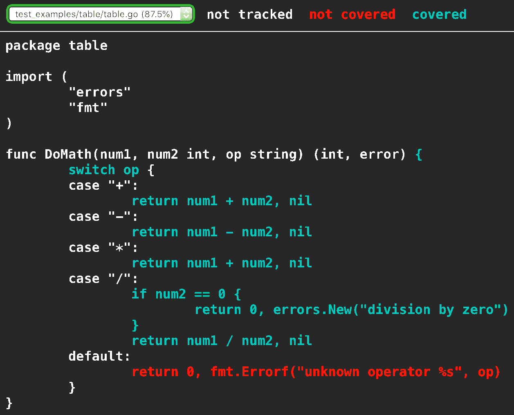
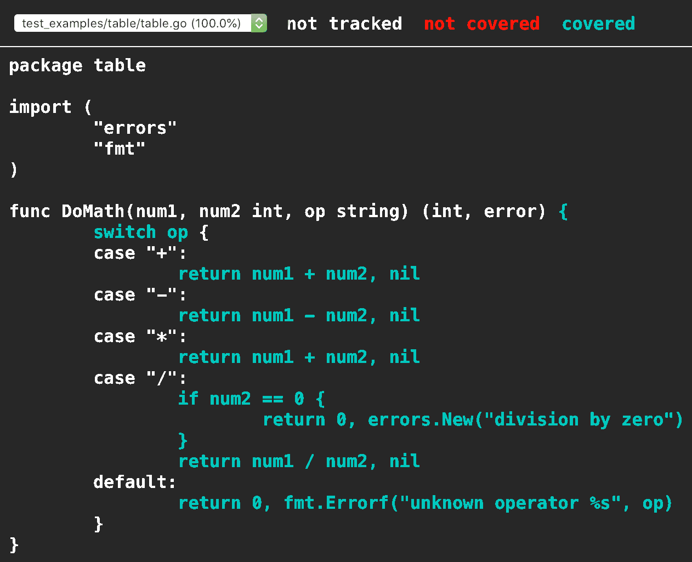

# 第十五章 写测试

自 2000 年以来，自动化测试的广泛采用可能比任何其他软件工程技术更多地提高了代码质量。作为一个专注于提高软件质量的语言和生态系统，Go 将测试支持作为其标准库的一部分包含其中并不令人意外。Go 使得测试代码变得如此简单，没有理由不去做。

在本章中，您将看到如何测试 Go 代码，将测试分组为单元测试和集成测试，检查代码覆盖率，编写基准测试，并学习如何通过使用 Go 数据竞争检测器检查代码并发问题。在此过程中，我将讨论如何编写可测试的代码以及为什么这样可以提高我们的代码质量。

# 理解测试的基础知识

与许多其他语言不同，Go 将其测试放在与生产代码相同的目录和包中。由于测试位于同一包中，因此它们能够访问和测试未公开的函数和变量。稍后您将看到如何编写测试来确保仅测试公共 API。

###### 注意

本章的完整代码示例可在 [第十五章存储库](https://oreil.ly/PNRJx) 中找到。

让我们编写一个简单的函数，然后编写一个测试来确保该函数正常工作。在 *sample_code/adder* 目录中的 *adder.go* 文件中，您有以下内容：

```go
func addNumbers(x, y int) int {
    return x + x
}
```

相应的测试位于 *adder_test.go* 中：

```go
func Test_addNumbers(t *testing.T) {
    result := addNumbers(2,3)
    if result != 5 {
        t.Error("incorrect result: expected 5, got", result)
    }
}
```

每个测试都写在以 *_test.go* 结尾的文件中。如果您正在对 *foo.go* 进行测试，请将测试放在名为 *foo_test.go* 的文件中。

测试函数以单参数 `*testing.T` 开头。按照惯例，这个参数被命名为 `t`。测试函数不返回任何值。测试的名称（除了以单词`Test`开头之外）旨在说明您正在测试什么，请选择一个能够解释您正在测试内容的名称。当为单个函数编写单元测试时，惯例是将单元测试命名为 `Test` 后跟函数名。在测试未导出的函数时，有些人在单词`Test`和函数名之间使用下划线。

还要注意，您使用标准的 Go 代码调用正在测试的代码，并验证响应是否符合预期。当结果不正确时，使用 `t.Error` 方法报告错误，其工作方式类似于 `fmt.Print` 函数。稍后您将看到其他报告错误的方法。

Go 的测试支持分为两部分：库和工具。标准库中的 `testing` 包提供了编写测试所需的类型和函数，而随 Go 捆绑的 `go test` 工具则运行您的测试并生成报告。

```go
$ go test
--- FAIL: Test_addNumbers (0.00s)
    adder_test.go:8: incorrect result: expected 5, got 4
FAIL
exit status 1
FAIL    test_examples/adder     0.006s

```

看起来你在代码中发现了一个 bug。仔细查看`addNumbers`，你会发现你正在将`x`加到`x`，而不是加到`y`。让我们更改代码并重新运行测试以验证 bug 是否已修复：

```go
$ go test
PASS
ok      test_examples/adder     0.006s

```

`go test`命令允许你指定要测试的包。使用`./...`作为包名指定你想在当前目录及其所有子目录中运行测试。包含`-v`标志以获取详细的测试输出。

## 报告测试失败

`*testing.T`上有几种报告测试失败的方法。你已经看到了`Error`，它通过逗号分隔的值构建一个失败描述字符串。

如果你更喜欢使用`Printf`风格的格式化字符串来生成你的消息，请改用`Errorf`方法：

```go
t.Errorf("incorrect result: expected %d, got %d", 5, result)
```

虽然`Error`和`Errorf`标记一个测试为失败，但测试函数会继续运行。如果你认为一个测试函数应该在发现失败后立即停止处理，可以使用`Fatal`和`Fatalf`方法。`Fatal`方法的工作方式类似于`Error`，而`Fatalf`方法的工作方式类似于`Errorf`。不同之处在于，在生成测试失败消息后，测试函数立即退出。请注意，这并不会退出*所有*测试；当前测试函数退出后，任何剩余的测试函数将继续执行。

何时应该使用`Fatal`/`Fatalf`，何时应该使用`Error`/`Errorf`？如果测试中的某个检查失败意味着后续检查总会失败或导致测试崩溃，请使用`Fatal`或`Fatalf`。如果你正在测试几个独立的项目（例如验证结构体中的字段），则使用`Error`或`Errorf`，这样你可以一次报告多个问题。这样可以更轻松地修复多个问题，而无需反复运行测试。

## 设置和拆除

有时你有一些通用状态需要在所有测试运行之前设置并在测试完成后移除。使用`TestMain`函数来管理这些状态并运行你的测试：

```go
var testTime time.Time

func TestMain(m *testing.M) {
    fmt.Println("Set up stuff for tests here")
    testTime = time.Now()
    exitVal := m.Run()
    fmt.Println("Clean up stuff after tests here")
    os.Exit(exitVal)
}

func TestFirst(t *testing.T) {
    fmt.Println("TestFirst uses stuff set up in TestMain", testTime)
}

func TestSecond(t *testing.T) {
    fmt.Println("TestSecond also uses stuff set up in TestMain", testTime)
}
```

`TestFirst`和`TestSecond`都引用了包级别变量`testTime`。假设需要初始化它以便测试正确运行。你声明一个名为`TestMain`的函数，参数类型为`*testing.M`。如果包中有一个名为`TestMain`的函数，`go test`将调用它而不是测试函数。`TestMain`函数的责任是设置任何必要的状态，以确保包中的测试正确运行。

一旦状态配置完成，`TestMain`函数调用`*testing.M`上的`Run`方法。这将在包中运行测试函数。`Run`方法返回退出码；`0`表示所有测试通过。最后，`TestMain`函数必须使用从`Run`返回的退出码调用`os.Exit`。

运行`go test`会产生如下输出：

```go
$ go test
Set up stuff for tests here
TestFirst uses stuff set up in TestMain 2020-09-01 21:42:36.231508 -0400 EDT
    m=+0.000244286
TestSecond also uses stuff set up in TestMain 2020-09-01 21:42:36.231508 -0400
    EDT m=+0.000244286
PASS
Clean up stuff after tests here
ok      test_examples/testmain  0.006s

```

###### 注意

请注意，`TestMain`仅在测试前后各调用一次。还要注意，每个包只能有一个`TestMain`。

`TestMain`在两种常见情况下很有用：

+   当你需要在外部存储库（如数据库）中设置数据时

+   当被测试的代码依赖于需要初始化的包级变量时

如前所述（并将再次提及！），你应该避免在程序中使用包级变量。这会使得理解数据如何在你的程序中流动变得困难。如果你因此而使用`TestMain`，请考虑重构你的代码。

`*testing.T`上的`Cleanup`方法用于清理为单个测试创建的临时资源。此方法有一个参数，即没有输入参数或返回值的函数。该函数在测试完成时运行。对于简单的测试，你可以通过使用`defer`语句达到相同的结果，但在测试依赖于设置示例数据的辅助函数时，`Cleanup`非常有用，就像你在 Example 15-1 中看到的那样。可以多次调用`Cleanup`是可以的。与`defer`一样，函数按照后添加的先调用的顺序执行。

##### 示例 15-1\. 使用`t.Cleanup`

```go
// createFile is a helper function called from multiple tests
func createFile(t *testing.T) (_ string, err error) {
    f, err := os.Create("tempFile")
    if err != nil {
        return "", err
    }
    defer func() {
        err = errors.Join(err, f.Close())
    }()
    // write some data to f
    t.Cleanup(func() {
        os.Remove(f.Name())
    })
    return f.Name(), nil
}

func TestFileProcessing(t *testing.T) {
    fName, err := createFile(t)
    if err != nil {
        t.Fatal(err)
    }
    // do testing, don't worry about cleanup
}
```

如果你的测试使用临时文件，你可以通过利用`*testing.T`上的`TempDir`方法而避免编写清理代码。每次调用时，该方法都会创建一个新的临时目录，并返回目录的完整路径。它还会在`Cleanup`上注册一个处理程序，以便在测试完成时删除目录及其内容。你可以用它来重新编写前面的示例：

```go
// createFile is a helper function called from multiple tests
func createFile(tempDir string) (_ string, err error) {
    f, err := os.CreateTemp(tempDir, "tempFile")
    if err != nil {
        return "", err
    }
    defer func() {
        err = errors.Join(err, f.Close())
    }()
    // write some data to f
    return f.Name(), nil
}

func TestFileProcessing(t *testing.T) {
    tempDir := t.TempDir()
    fName, err := createFile(tempDir)
    if err != nil {
        t.Fatal(err)
    }
    // do testing, don't worry about cleanup
}
```

## 使用环境变量进行测试

配置应用程序使用环境变量是一种常见（并且非常好的）做法。为了帮助你测试环境变量解析代码，Go 提供了`testing.T`上的一个辅助方法。调用`t.Setenv()`来为你的测试注册一个环境变量的值。在幕后，它调用`Cleanup`在测试结束时将环境变量恢复到先前的状态：

```go
// assume ProcessEnvVars is a function that processes environment variables
// and returns a struct with an OutputFormat field
func TestEnvVarProcess(t *testing.T) {
    t.Setenv("OUTPUT_FORMAT", "JSON")
    cfg := ProcessEnvVars()
    if cfg.OutputFormat != "JSON" {
        t.Error("OutputFormat not set correctly")
    }
    // value of OUTPUT_FORMAT is reset when the test function exits
}
```

###### 注意

尽管使用环境变量来配置你的应用程序是好的，但确保大部分代码完全不知道它们也是很重要的。确保在程序开始工作时，在你的`main`函数或之后尽快将环境变量的值复制到配置结构体中。这样做可以使代码更易于重用和测试，因为代码的配置方式已经从代码执行的内容中抽象出来。

与其自己编写此代码，你应该强烈考虑使用第三方配置库，比如[Viper](https://oreil.ly/-RUA-)或[envconfig](https://oreil.ly/rhGYk)。此外，查看[GoDotEnv](https://oreil.ly/sN2Sp)，它可以将环境变量存储在*.env*文件中，供开发或持续集成机器使用。

## 存储样本测试数据

当`go test`遍历你的源代码树时，它将当前包目录作为当前工作目录。如果你想在一个包中使用样本数据来测试函数，请创建一个名为*testdata*的子目录来保存你的文件。Go 将此目录名称保留为一个用于保存测试文件的地方。在从*testdata*读取时，始终使用相对文件引用。由于`go test`将当前工作目录更改为当前包，因此每个包通过相对文件路径访问其自己的*testdata*。

###### 提示

在[第十五章的代码库](https://oreil.ly/lV_KJ)的*sample_code*目录中，`text` 包演示了如何使用*testdata*。

## 缓存测试结果

正如你在第 10 章中学到的，如果 Go 编译的包没有改变，它会缓存这些编译后的包，同样地，当跨多个包运行测试并且它们通过且代码没有改变时，Go 也会缓存测试结果。如果你改变了包中的任何文件或*testdata*目录中的文件，则会重新编译并重新运行测试。如果你希望测试始终运行，请向`go test`传递`-count=1`标志。

## 测试你的公共 API

你编写的测试与生产代码位于同一个包中。这允许你测试导出和未导出的函数。

如果你只想测试包的公共 API，Go 有一种约定可以指定这样做。你仍然将测试源代码放在与生产源代码相同的目录中，但是包名使用`packagename_test`。让我们重新做初始测试用例，使用一个导出的函数来代替。你可以在[第十五章的代码库](https://oreil.ly/PNRJx)的*sample_code/pubadder*目录中找到这段代码。如果你的`pubadder`包中有如下函数：

```go
func AddNumbers(x, y int) int {
    return x + y
}
```

然后，你可以在`pubadder`包的名为*adder_public_test.go*的文件中使用以下代码测试它：

```go
package pubadder_test

import (
    "github.com/learning-go-book-2e/ch15/sample_code/pubadder"
    "testing"
)

func TestAddNumbers(t *testing.T) {
    result := pubadder.AddNumbers(2, 3)
    if result != 5 {
        t.Error("incorrect result: expected 5, got", result)
    }
}
```

注意测试文件的包名为`pubadder_test`。即使文件位于同一个目录中，你也必须导入`github.com/learning-go-book-2e/ch15/sample_code/pubadder`。为了遵循测试命名的约定，测试函数名与`AddNumbers`函数的名称匹配。还要注意，你要使用`pubadder.AddNumbers`，因为你在不同包中调用一个导出函数。

###### 提示

如果你是手动输入这段代码，你需要创建一个带有模块声明的*go.mod*文件：

```go
module github.com/learning-go-book-2e/ch15
```

这会将源代码放在模块内的*sample_code/pubadder*目录中。

就像您可以从包内调用导出函数一样，您可以从与源代码相同包中的测试中测试您的公共 API。在包名称中使用 `_test` 后缀的优势在于，它让您将测试的包视为“黑盒”。您只能通过其导出的函数、方法、类型、常量和变量与其交互。还要注意，您可以在同一源目录中混合使用包名称交错的测试源文件。

## 使用 go-cmp 进行比较测试结果

编写复合类型两个实例的彻底比较可能会很啰嗦。虽然您可以使用 `reflect.DeepEqual` 比较结构体、映射和切片，但有更好的方法。Google 发布了一个名为 [`go-cmp`](https://oreil.ly/9bWJf) 的第三方模块，它可以为您进行比较，并返回不匹配之处的详细描述。让我们看看它是如何工作的，通过定义一个简单的 `struct` 和一个填充它的工厂函数。您可以在 [第十五章仓库](https://oreil.ly/PNRJx) 的 *sample_code/cmp* 目录中找到这段代码：

```go
type Person struct {
    Name      string
    Age       int
    DateAdded time.Time
}

func CreatePerson(name string, age int) Person {
    return Person{
        Name:      name,
        Age:       age,
        DateAdded: time.Now(),
    }
}
```

在您的测试文件中，您需要导入 `github.com/google/go-cmp/cmp`，并且您的测试函数看起来像这样：

```go
func TestCreatePerson(t *testing.T) {
    expected := Person{
        Name: "Dennis",
        Age:  37,
    }
    result := CreatePerson("Dennis", 37)
    if diff := cmp.Diff(expected, result); diff != "" {
        t.Error(diff)
    }
}
```

`cmp.Diff` 函数接受预期输出和由您测试的函数返回的输出。它返回一个描述两个输入之间任何不匹配的字符串。如果输入匹配，则返回空字符串。您将 `cmp.Diff` 函数的输出分配给名为 `diff` 的变量，然后检查 `diff` 是否为空字符串。如果不是，则发生了错误。

当您构建并运行测试时，您将看到 `go-cmp` 在两个结构实例不匹配时生成的输出：

```go
$ go test
--- FAIL: TestCreatePerson (0.00s)
    ch13_cmp_test.go:16:   ch13_cmp.Person{
              Name:      "Dennis",
              Age:       37,
        -     DateAdded: s"0001-01-01 00:00:00 +0000 UTC",
        +     DateAdded: s"2020-03-01 22:53:58.087229 -0500 EST m=+0.001242842",
          }

FAIL
FAIL    ch13_cmp    0.006s

```

`-` 和 `+` 开头的行指示其值不同的字段。测试失败是因为日期不匹配。这是一个问题，因为您无法控制 `CreatePerson` 函数分配的日期。您需要忽略 `DateAdded` 字段。通过指定一个比较函数来实现。在测试中将该函数声明为局部变量：

```go
comparer := cmp.Comparer(func(x, y Person) bool {
    return x.Name == y.Name && x.Age == y.Age
})
```

将函数传递给 `cmp.Comparer` 函数以创建一个自定义比较器。传入的函数必须有两个相同类型的参数，并返回一个 `bool` 值。它还必须是对称的（参数的顺序不重要）、确定性的（对于相同的输入始终返回相同的值）和纯粹的（不修改其参数）。在您的实现中，您正在比较 `Name` 和 `Age` 字段，并忽略 `DateAdded` 字段。

然后将您的调用更改为 `cmp.Diff`，包括 `comparer`：

```go
if diff := cmp.Diff(expected, result, comparer); diff != "" {
    t.Error(diff)
}
```

这只是 `go-cmp` 中最有用的功能的快速预览。查看其 [文档](https://oreil.ly/rmiWO) 了解更多关于如何控制比较和输出格式的信息。

# 运行表测试

大多数情况下，验证函数正确工作需要多个测试案例。你可以编写多个测试函数来验证函数，或者在同一个函数中编写多个测试，但你会发现大部分测试逻辑是重复的。你设置支持数据和函数，指定输入，检查输出，并比较它们是否符合你的预期。

而不是一遍又一遍地写这个，你可以利用称为*表测试*的模式。让我们看一个样例。你可以在[第十五章存储库](https://oreil.ly/PNRJx)的*sample_code/table*目录中找到这段代码。假设你在`table`包中有以下函数：

```go
func DoMath(num1, num2 int, op string) (int, error) {
    switch op {
    case "+":
        return num1 + num2, nil
    case "-":
        return num1 - num2, nil
    case "*":
        return num1 + num2, nil
    case "/":
        if num2 == 0 {
            return 0, errors.New("division by zero")
        }
        return num1 / num2, nil
    default:
        return 0, fmt.Errorf("unknown operator %s", op)
    }
}
```

要测试这个函数，你需要检查不同的分支，尝试返回有效结果的输入，以及触发错误的输入。你可以编写这样的代码，但这样做非常重复：

```go
func TestDoMath(t *testing.T) {
    result, err := DoMath(2, 2, "+")
    if result != 4 {
        t.Error("Should have been 4, got", result)
    }
    if err != nil {
        t.Error("Should have been nil error, got", err)
    }
    result2, err2 := DoMath(2, 2, "-")
    if result2 != 0 {
        t.Error("Should have been 0, got", result2)
    }
    if err2 != nil {
        t.Error("Should have been nil error, got", err2)
    }
    // and so on...
}
```

让我们用表测试替换这种重复。首先，你声明一个匿名结构体切片。结构体包含测试的名称、输入参数和返回值字段。切片中的每个条目代表另一个测试：

```go
data := []struct {
    name     string
    num1     int
    num2     int
    op       string
    expected int
    errMsg   string
}{
    {"addition", 2, 2, "+", 4, ""},
    {"subtraction", 2, 2, "-", 0, ""},
    {"multiplication", 2, 2, "*", 4, ""},
    {"division", 2, 2, "/", 1, ""},
    {"bad_division", 2, 0, "/", 0, `division by zero`},
}
```

接下来，循环处理`data`中的每个测试案例，每次调用`Run`方法。这是实现魔法的地方。你向`Run`传递两个参数，子测试的名称和一个参数类型为`*testing.T`的函数。在函数内部，你使用`data`当前条目的字段调用`DoMath`，一遍又一遍地使用相同的逻辑。运行这些测试时，你会发现它们不仅通过了测试，而且当你使用`-v`标志时，每个子测试现在也有了名称：

```go
for _, d := range data {
    t.Run(d.name, func(t *testing.T) {
        result, err := DoMath(d.num1, d.num2, d.op)
        if result != d.expected {
            t.Errorf("Expected %d, got %d", d.expected, result)
        }
        var errMsg string
        if err != nil {
            errMsg = err.Error()
        }
        if errMsg != d.errMsg {
            t.Errorf("Expected error message `%s`, got `%s`",
                d.errMsg, errMsg)
        }
    })
}
```

###### 提示

比较错误消息可能不够稳定，因为消息文本可能没有兼容性保证。你正在测试的函数使用`errors.New`和`fmt.Errorf`生成错误，因此唯一的选择是比较消息。如果错误具有自定义类型或命名的哨兵错误，请使用`errors.Is`或`errors.As`来检查返回的正确错误。

# 并行运行测试

默认情况下，单元测试是顺序运行的。由于每个单元测试应该独立于其他单元测试，它们是并发的理想候选者。要使单元测试与其他测试同时运行，请在测试的第一行调用`*testing.T`的`Parallel`方法：

```go
func TestMyCode(t *testing.T) {
    t.Parallel()
    // rest of test goes here
}
```

并行测试与其他标记为并行的测试同时运行。

并行测试的优势在于可以加快长时间运行的测试套件。但也有一些缺点。如果有多个测试依赖于相同的共享可变状态，请不要标记它们为并行，因为你会得到不一致的结果。（但在所有这些警告之后，你的应用程序中没有共享可变状态，对吧？）还要注意，如果你标记为并行并在测试函数中使用`Setenv`方法，你的测试将会 panic。

在并行运行表格测试时要小心。当表格测试并行运行时，情况就像你在 “Goroutines, for Loops, and Varying Variables” 中看到的一样，你在 `for` 循环内启动了多个 goroutine。如果你在 Go 1.21 或更早版本中运行此示例（或在 Go 1.22 或更高版本中，但在 *go.mod* 文件的 `go` 指令中设置了 Go 版本为 1.21 或更早版本），则所有并行测试共享变量 `d` 的引用，因此它们都看到相同的值：

```go
func TestParallelTable(t *testing.T) {
    data := []struct {
        name   string
        input  int
        output int
    }{
        {"a", 10, 20},
        {"b", 30, 40},
        {"c", 50, 60},
    }
    for _, d := range data {
        t.Run(d.name, func(t *testing.T) {
            t.Parallel()
            fmt.Println(d.input, d.output)
            out := toTest(d.input)
            if out != d.output {
                t.Error("didn't match", out, d.output)
            }
        })
    }
}
```

你可以在 [The Go Playground](https://oreil.ly/b0S4n) 上或者在 [第十五章的代码库](https://oreil.ly/PNRJx) 的 *sample_code/parallel* 目录中运行这段代码。看一下输出结果，你会发现测试表中的最后一个值被测试了三次：

```go
=== CONT  TestParallelTable/a
50 60
=== CONT  TestParallelTable/c
50 60
=== CONT  TestParallelTable/b
50 60
```

这个问题很常见，以至于 Go 1.20 版本中添加了 `go vet` 检查此问题的功能。当你在这段代码上运行 `go vet` 时，会得到消息 `loop variable d captured by func literal`，其中每一行都捕获了变量 `d`。

在 Go 1.22 或更高版本中，`for` 循环的变化解决了这个问题。如果你不能使用 Go 1.22，你可以通过在调用 `t.Run` 之前在 `for` 循环内部屏蔽 `d` 来避免这个 bug：

```go
    for _, d := range data {
        d := d // THIS IS THE LINE THAT SHADOWS d!
        t.Run(d.name, func(t *testing.T) {
            t.Parallel()
            fmt.Println(d.input, d.output)
            out := toTest(d.input)
            if out != d.output {
                t.Error("didn't match", out, d.output)
            }
        })
    }
```

现在你有了运行大量测试的方法，你将了解代码覆盖率以查找你的测试是否完整。

# 检查你的代码覆盖率

代码覆盖率是一个非常有用的工具，可以帮助你了解是否遗漏了任何明显的情况。但是，达到 100% 的代码覆盖率并不保证你的代码对于某些输入没有 bug。首先，你会看到 `go test` 如何显示代码覆盖率，然后再看看仅依赖代码覆盖率的局限性。

在 `go test` 命令中添加 `-cover` 标志可以计算覆盖率信息，并在测试输出中包含摘要。如果你包含第二个标志 `-coverprofile`，你可以将覆盖率信息保存到一个文件中。让我们回到 [第十五章代码库](https://oreil.ly/PNRJx) 的 *sample_code/table* 目录中，收集代码覆盖率信息：

```go
$ go test -v -cover -coverprofile=c.out

```

如果你用代码覆盖来运行你的表格测试，测试输出现在会包括一行指示测试代码覆盖率的信息，例如 87.5%。这是个好消息，但更有用的是你可以看到你漏掉了什么。Go 自带的 `cover` 工具会生成一个包含这些信息的源代码的 HTML 表示：

```go
$ go tool cover -html=c.out

```

运行后，你的网页浏览器应该会打开，并显示一个看起来像是 Figure 15-1 的页面。

每个被测试的文件都显示在左上角的组合框中。源代码有三种颜色。灰色用于不可测试的代码行，绿色用于已被测试覆盖的代码，红色用于未被测试的代码。（依赖颜色对于打印版的读者和红绿色盲是不幸的。如果你无法看到颜色，浅灰色表示被覆盖的行。）通过查看这些内容，你会发现你没有编写测试来覆盖默认情况，即当函数传递给它一个错误的操作符时。在你的测试案例中添加这种情况：

```go
{"bad_op", 2, 2, "?", 0, `unknown operator ?`},
```

当你重新运行 `go test -v -cover -coverprofile=c.out` 和 `go tool cover -html=c.out` 时，你会在 图 15-2 中看到最后一行被覆盖，并且你拥有 100%的测试代码覆盖率。



###### 图 15-1\. 初始代码覆盖率



###### 图 15-2\. 最终代码覆盖率

代码覆盖率是一件好事，但这并不足够。实际上，你的代码中有一个 bug，即使你已经达到了 100%的覆盖率。你注意到了吗？如果没有，添加另一个测试案例并重新运行你的测试：

```go
{"another_mult", 2, 3, "*", 6, ""},
```

你应该看到错误：

```go
table_test.go:57: Expected 6, got 5
```

你的乘法案例有一个拼写错误。它将数字相加而不是相乘。（小心复制粘贴编码的危险！）修复代码，重新运行 `go test -v -cover -coverprofile=c.out` 和 `go tool cover -html=c.out`，你会看到测试再次通过。

###### 警告

代码覆盖率是必要的，但并不充分。你可以拥有 100%的代码覆盖率，但代码中仍然可能存在 bug！

# 模糊测试

每个开发者最终都会学到的最重要的一课是所有数据都是可疑的。无论数据格式有多么精确，你最终都将不得不处理不符合预期的输入。这并不仅仅是因为恶意原因。数据可能在传输、存储甚至内存中损坏。处理数据的程序可能存在 bug，而数据格式的规范总是会有一些边缘情况，不同的开发者可能会以不同的方式解释。

即使开发者编写了良好的单元测试，也不可能考虑到所有情况。正如你所见，即使单元测试代码达到 100%的覆盖率，也不能保证代码没有错误。你需要用可能会导致程序以意想不到的方式崩溃的生成数据来补充单元测试。这就是模糊测试的作用。

*Fuzzing* 是一种生成随机数据并将其提交给代码以查看其是否正确处理意外输入的技术。开发者可以提供一个*种子语料库*或一组已知的良好数据，模糊器将以此为基础生成有问题的输入。让我们看看如何利用 Go 的测试工具中的模糊支持来发现额外的测试用例。

假设您正在编写一个处理数据文件的程序。您可以在[Github 上找到此示例的代码](https://oreil.ly/7dx6i)。您正在发送一个字符串列表，但希望有效地分配内存，因此文件中的字符串数量作为第一行发送，而剩余的行是文本行。以下是处理此数据的示例函数：

```go
func ParseData(r io.Reader) ([]string, error) {
    s := bufio.NewScanner(r)
    if !s.Scan() {
        return nil, errors.New("empty")
    }
    countStr := s.Text()
    count, err := strconv.Atoi(countStr)
    if err != nil {
        return nil, err
    }
    out := make([]string, 0, count)
    for i := 0; i < count; i++ {
        hasLine := s.Scan()
        if !hasLine {
            return nil, errors.New("too few lines")
        }
        line := s.Text()
        out = append(out, line)
    }
    return out, nil
}
```

使用`bufio.Scanner`从`io.Reader`逐行读取数据。如果没有数据可读，则返回错误。然后读取第一行，并尝试将其转换为名为`count`的整数。如果无法转换，则返回错误。接下来，为字符串切片分配内存，并从扫描器中读取`count`行。如果行数不足，则返回错误。如果一切顺利，返回读取的行数。

已编写单元测试以验证代码：

```go
func TestParseData(t *testing.T) {
    data := []struct {
        name   string
        in     []byte
        out    []string
        errMsg string
    }{
        {
            name:   "simple",
            in:     []byte("3\nhello\ngoodbye\ngreetings\n"),
            out:    []string{"hello", "goodbye", "greetings"},
            errMsg: "",
        },
        {
            name:   "empty_error",
            in:     []byte(""),
            out:    nil,
            errMsg: "empty",
        },
        {
            name:   "zero",
            in:     []byte("0\n"),
            out:    []string{},
            errMsg: "",
        },
        {
            name:   "number_error",
            in:     []byte("asdf\nhello\ngoodbye\ngreetings\n"),
            out:    nil,
            errMsg: `strconv.Atoi: parsing "asdf": invalid syntax`,
        },
        {
            name:   "line_count_error",
            in:     []byte("4\nhello\ngoodbye\ngreetings\n"),
            out:    nil,
            errMsg: "too few lines",
        },
    }
    for _, d := range data {
        t.Run(d.name, func(t *testing.T) {
            r := bytes.NewReader(d.in)
            out, err := ParseData(r)
            var errMsg string
            if err != nil {
                errMsg = err.Error()
            }
            if diff := cmp.Diff(d.out, out); diff != "" {
                t.Error(diff)
            }
            if diff := cmp.Diff(d.errMsg, errMsg); diff != "" {
                t.Error(diff)
            }
        })
    }
}
```

单元测试已为`ParseData`实现了 100%的代码行覆盖率，处理了所有错误情况。您可能认为代码已准备好投入生产，但让我们看看模糊测试是否可以帮助您发现未考虑的错误。

###### 注意

注意，模糊测试会消耗大量资源。模糊测试可以分配（或尝试分配）许多吉比字节的内存，并且可能向本地磁盘写入数吉比字节的数据。如果在进行模糊测试的同时在同一台机器上运行其他程序，如果速度变慢也不要感到惊讶。

首先编写一个模糊测试：

```go
func FuzzParseData(f *testing.F) {
    testcases := [][]byte{
        []byte("3\nhello\ngoodbye\ngreetings\n"),
        []byte("0\n"),
    }
    for _, tc := range testcases {
        f.Add(tc)
    }
    f.Fuzz(func(t *testing.T, in []byte) {
        r := bytes.NewReader(in)
        out, err := ParseData(r)
        if err != nil {
            t.Skip("handled error")
        }
        roundTrip := ToData(out)
        rtr := bytes.NewReader(roundTrip)
        out2, err := ParseData(rtr)
        if diff := cmp.Diff(out, out2); diff != "" {
            t.Error(diff)
        }
    })
}
```

模糊测试看起来与标准单元测试类似。函数名称以`Fuzz`开头，唯一参数类型为`*testing.F`，并且没有返回值。

然后，设置种子语料库，它由一个或多个样本数据集组成。数据可以成功运行、出错，甚至崩溃。重要的是，您知道在提供这些数据时程序的行为方式，并且您的模糊测试已经考虑到了这种行为。这些样本由模糊器变异以生成错误输入。本示例每个条目仅使用单个数据字段（字节切片），但可以根据需要有多个字段。目前，语料库条目的字段仅限于某些类型：

+   任何整数类型（包括无符号类型，`rune`和`byte`）

+   任何浮点类型

+   `bool`

+   `string`

+   `[]byte`

每个语料库条目都会传递给`*testing.F`实例的`Add`方法。在示例中，每个条目都有一个字节切片：

```go
f.Add(tc)
```

如果被模糊化的函数需要一个`int`和一个`string`，则调用`Add`看起来像这样：

```go
f.Add(1, "some text")
```

将无效类型的值传递给`Add`是运行时错误。

接下来，你在你的`*testing.F`实例上调用`Fuzz`方法。在编写标准单元测试中的表测试时，这看起来有点像对`Run`的调用。`Fuzz`接受一个参数，一个函数，其第一个参数类型为`*testing.T`，其余参数的类型、顺序和数量与传递给`Add`的值完全匹配。这还指定了在模糊测试期间由模糊引擎生成的数据类型。Go 编译器无法强制执行此约束，因此如果不遵循约定，这将是运行时错误。

最后，让我们看看模糊目标的内容。记住，模糊测试用于找到未正确处理坏输入的情况。由于输入是随机生成的，您不能编写对输出内容有了解的测试。相反，您必须使用对所有输入都为真的测试条件。对于`ParseData`，您可以检查两件事：

+   当错误输入时，代码是否返回错误或会发生恐慌？

+   如果您将字符串切片转换回字节切片并重新解析，您会得到相同的结果吗？

让我们看看运行模糊测试时会发生什么：

```go
$ go test -fuzz=FuzzParseData
fuzz: elapsed: 0s, gathering baseline coverage: 0/243 completed
fuzz: elapsed: 0s, gathering baseline coverage: 243/243 completed,
    now fuzzing with 8 workers
fuzz: minimizing 289-byte failing input file
fuzz: elapsed: 3s, minimizing
fuzz: elapsed: 6s, minimizing
fuzz: elapsed: 9s, minimizing
fuzz: elapsed: 10s, minimizing
--- FAIL: FuzzParseData (10.48s)
    fuzzing process hung or terminated unexpectedly while minimizing: EOF
    Failing input written to testdata/fuzz/FuzzParseData/
        fedbaf01dc50bf41b40d7449657cdc9af9868b1be0421c98b2910071de9be3df
    To re-run:
    go test -run=FuzzParseData/
        fedbaf01dc50bf41b40d7449657cdc9af9868b1be0421c98b2910071de9be3df
FAIL
exit status 1
FAIL    file_parser     10.594s

```

如果您没有指定`-fuzz`标志，您的模糊测试将被视为单元测试，并将针对种子语料库运行。每次只能对一个模糊测试进行模糊处理。

###### 注意

如果您想获得完整体验，请删除 *testdata/fuzz/FuzzParseData* 目录的内容。这将导致模糊器生成新的种子语料库条目。由于模糊器生成随机输入，您的样本可能与显示的不同。不过，不同的条目可能会产生类似的错误，尽管可能不是按相同顺序。

模糊测试运行几秒钟后失败。在这种情况下，`go`命令报告说它已崩溃。您不希望程序崩溃，所以让我们看看生成的输入。每次测试用例失败时，模糊器都会将其写入 *testdata/fuzz/TESTNAME* 子目录，该子目录与失败的测试位于同一软件包中，添加一个新条目到种子语料库。现在文件中的新种子语料库条目成为新的单元测试，这是由模糊器自动生成的。每当运行`go test`运行`FuzzParseData`函数时，它作为回归测试，一旦修复错误，就会执行。

这是文件的内容：

```go
go test fuzz v1
[]byte("300000000000")
```

第一行是一个标题，指示这是模糊测试的测试数据。随后的行包含导致失败的数据。

失败消息告诉您在重新运行测试时如何隔离此失败案例：

```go
$ go test -run=FuzzParseData/
    fedbaf01dc50bf41b40d7449657cdc9af9868b1be0421c98b2910071de9be3df
signal: killed
FAIL    file_parser     15.046s

```

问题在于您试图分配一个能够容纳 300,000,000,000 个字符串的切片。这比我的计算机（可能也比您的）的 RAM 要多得多。您需要限制预期文本元素的数量。通过在解析预期行数后向`ParseData`添加以下代码，将最大行数设置为 1,000：

```go
    if count > 1000 {
        return nil, errors.New("too many")
    }
```

再次运行模糊器，查看是否发现更多错误：

```go
$ go test -fuzz=FuzzParseData
fuzz: elapsed: 0s, gathering baseline coverage: 0/245 completed
fuzz: elapsed: 0s, gathering baseline coverage: 245/245 completed,
    now fuzzing with 8 workers
fuzz: minimizing 29-byte failing input file
fuzz: elapsed: 2s, minimizing
--- FAIL: FuzzParseData (2.20s)
    --- FAIL: FuzzParseData (0.00s)
        testing.go:1356: panic: runtime error: makeslice: cap out of range
            goroutine 23027 [running]:
            runtime/debug.Stack()
                /usr/local/go/src/runtime/debug/stack.go:24 +0x104
            testing.tRunner.func1()
                /usr/local/go/src/testing/testing.go:1356 +0x258
            panic({0x1003f9920, 0x10042a260})
                /usr/local/go/src/runtime/panic.go:884 +0x204
            file_parser.ParseData({0x10042a7c8, 0x14006c39bc0})
                file_parser/file_parser.go:24 +0x254
[...]
    Failing input written to testdata/fuzz/FuzzParseData/
        03f81b404ad91d092a482ad1ccb4a457800599ab826ec8dae47b49c01c38f7b1
    To re-run:
    go test -run=FuzzParseData/
        03f81b404ad91d092a482ad1ccb4a457800599ab826ec8dae47b49c01c38f7b1
FAIL
exit status 1
FAIL    file_parser     2.434s

```

这次您得到一个产生恐慌的模糊结果。查看由 `go fuzz` 生成的文件，您会看到这个：

```go
go test fuzz v1
[]byte("-1")
```

显示产生恐慌的行在这里：

```go
    out := make([]string, 0, count)
```

您正在尝试创建一个具有负容量的切片，这会导致恐慌。向您的代码添加另一个条件以查找负数：

```go
    if count < 0 {
        return nil, errors.New("no negative numbers")
    }
```

再次运行您的模糊器，它生成了另一个错误：

```go
$ go test -fuzz=FuzzParseData
fuzz: elapsed: 0s, gathering baseline coverage: 0/246 completed
fuzz: elapsed: 0s, gathering baseline coverage: 246/246 completed,
    now fuzzing with 8 workers
fuzz: elapsed: 3s, execs: 288734 (96241/sec), new interesting: 0 (total: 246)
fuzz: elapsed: 6s, execs: 418803 (43354/sec), new interesting: 0 (total: 246)
fuzz: minimizing 34-byte failing input file
fuzz: elapsed: 7s, minimizing
--- FAIL: FuzzParseData (7.43s)
    --- FAIL: FuzzParseData (0.00s)
        file_parser_test.go:89:   []string{
            -   "\r",
            +   "",
              }

    Failing input written to testdata/fuzz/FuzzParseData/
        b605c41104bf41a21309a13e90cfc6f30ecf133a2382759f2abc34d41b45ae79
    To re-run:
    go test -run=FuzzParseData/
        b605c41104bf41a21309a13e90cfc6f30ecf133a2382759f2abc34d41b45ae79
FAIL
exit status 1
FAIL    file_parser     7.558s

```

查看它创建的文件，您正在生成仅包含 `\r`（回车）字符的空白行。空白行不是您在输入中期望的内容，因此向从 `Scanner` 中读取文本行的循环中添加一些代码。您将检查一行是否只包含空白字符。如果是，则返回错误：

```go
        line = strings.TrimSpace(line)
        if len(line) == 0 {
            return nil, errors.New("blank line")
        }
```

再次运行您的模糊器：

```go
$ go test -fuzz=FuzzParseData
fuzz: elapsed: 0s, gathering baseline coverage: 0/247 completed
fuzz: elapsed: 0s, gathering baseline coverage: 247/247 completed,
    now fuzzing with 8 workers
fuzz: elapsed: 3s, execs: 391018 (130318/sec), new interesting: 2 (total: 249)
fuzz: elapsed: 6s, execs: 556939 (55303/sec), new interesting: 2 (total: 249)
fuzz: elapsed: 9s, execs: 622126 (21734/sec), new interesting: 2 (total: 249)
[...]
fuzz: elapsed: 2m0s, execs: 2829569 (0/sec), new interesting: 16 (total: 263)
fuzz: elapsed: 2m3s, execs: 2829569 (0/sec), new interesting: 16 (total: 263)
^Cfuzz: elapsed: 2m4s, execs: 2829569 (0/sec), new interesting: 16 (total: 263)
PASS
ok      file_parser     123.662s

```

几分钟后，没有发现更多错误，因此按下 Ctrl-C 结束模糊测试。

仅因为模糊器没有找到其他问题并不意味着代码现在没有错误。但是，模糊测试使您能够自动发现原始代码中的一些重大疏忽。编写模糊测试需要练习，因为它们需要比编写单元测试稍微不同的思维方式。一旦掌握它们，它们将成为验证代码如何处理意外用户输入的重要工具。

# 使用基准测试

确定代码运行速度快慢是非常困难的。与其自己试图弄清楚，不如使用内置在 Go 测试框架中的基准测试支持。让我们通过[第十五章的代码库](https://oreil.ly/PNRJx)中 *sample_code/bench* 目录中的一个函数来探讨它：

```go
func FileLen(f string, bufsize int) (int, error) {
    file, err := os.Open(f)
    if err != nil {
        return 0, err
    }
    defer file.Close()
    count := 0
    for {
        buf := make([]byte, bufsize)
        num, err := file.Read(buf)
        count += num
        if err != nil {
            break
        }
    }
    return count, nil
}
```

此函数计算文件中的字符数。它接受两个参数，文件名和用于读取文件的缓冲区大小（稍后您将看到第二个参数的原因）。

在查看其速度有多快之前，您应该测试您的库以确保它工作正常（确实如此）。这里是一个简单的测试：

```go
func TestFileLen(t *testing.T) {
    result, err := FileLen("testdata/data.txt", 1)
    if err != nil {
        t.Fatal(err)
    }
    if result != 65204 {
        t.Error("Expected 65204, got", result)
    }
}
```

现在您可以看到运行文件长度函数需要多长时间。您的目标是找出应该用来从文件中读取的缓冲区大小。

###### 注意

在您花时间深入优化之前，请确保您需要优化。如果您的程序已经足够快以满足响应要求并且使用的内存量是可接受的，则更好的选择是添加功能和修复错误。您的业务需求决定了“足够快”和“可接受的内存量”是什么意思。

在 Go 中，*基准测试* 是您的测试文件中以 `Benchmark` 开头并接受 `*testing.B` 类型的单个参数的函数。此类型包含 `*testing.T` 的所有功能，以及用于基准测试的额外支持。让我们先看一个使用 1 字节缓冲区的基准测试：

```go
var blackhole int

func BenchmarkFileLen1(b *testing.B) {
    for i := 0; i < b.N; i++ {
        result, err := FileLen("testdata/data.txt", 1)
        if err != nil {
            b.Fatal(err)
        }
        blackhole = result
    }
}
```

`blackhole` 包级变量很有趣。你将 `FileLen` 的结果写入这个包级变量，以确保编译器不会太过聪明而决定优化掉对 `FileLen` 的调用，从而破坏你的基准测试。

每个 Go 基准测试必须有一个循环，从 0 迭代到 `b.*N*`。测试框架会反复调用你的基准函数，并增加 `*N*` 的值，直到确保时间结果准确为止。稍后的输出中你会看到这一点。

通过将 `-bench` 标志传递给 `go test` 来运行基准测试。此标志期望一个正则表达式来描述要运行的基准测试的名称。使用 `-bench=.` 来运行所有基准测试。第二个标志 `-benchmem` 在基准测试输出中包括内存分配信息。在运行基准测试之前会运行所有的测试，因此只有在测试通过时才能对代码进行基准测试。

以下是在我的计算机上进行基准测试的输出：

```go
BenchmarkFileLen1-12  25  47201025 ns/op  65342 B/op  65208 allocs/op
```

运行带有内存分配信息的基准测试会生成包含五列的输出。以下是每一列的含义：

BenchmarkFileLen1-12

基准测试的名称，一个连字符，以及基准测试的 `GOMAXPROCS` 值。

25

测试稳定结果所需运行的次数

47201025 纳秒/操作

这个基准测试运行一次的时间，以纳秒为单位（每秒有 1,000,000,000 纳秒）。

65342 B/操作

在单次基准测试中分配的字节数。

65208 分配/操作

在单次基准测试中，从堆中分配字节的次数。这将始终小于或等于分配的字节的数量。

现在你已经有了 1 字节缓冲区的结果，让我们看看当你使用不同大小的缓冲区时的结果：

```go
func BenchmarkFileLen(b *testing.B) {
    for _, v := range []int{1, 10, 100, 1000, 10000, 100000} {
        b.Run(fmt.Sprintf("FileLen-%d", v), func(b *testing.B) {
            for i := 0; i < b.N; i++ {
                result, err := FileLen("testdata/data.txt", v)
                if err != nil {
                    b.Fatal(err)
                }
                blackhole = result
            }
        })
    }
}
```

就像你使用 `t.Run` 启动表格测试一样，你使用 `b.Run` 来启动基准测试，这些测试仅基于输入而变化。以下是在我的计算机上进行此基准测试的结果：

```go
BenchmarkFileLen/FileLen-1-12          25  47828842 ns/op   65342 B/op  65208 allocs/op
BenchmarkFileLen/FileLen-10-12        230   5136839 ns/op  104488 B/op   6525 allocs/op
BenchmarkFileLen/FileLen-100-12      2246    509619 ns/op   73384 B/op    657 allocs/op
BenchmarkFileLen/FileLen-1000-12    16491     71281 ns/op   68744 B/op     70 allocs/op
BenchmarkFileLen/FileLen-10000-12   42468     26600 ns/op   82056 B/op     11 allocs/op
BenchmarkFileLen/FileLen-100000-12  36700     30473 ns/op  213128 B/op      5 allocs/op

```

这些结果并不令人意外；随着缓冲区大小的增加，分配的次数减少，代码运行速度更快，直到缓冲区大于文件大小。当缓冲区大于文件大小时，额外的分配会减慢输出速度。如果你预期的文件大小大致相同，那么 10,000 字节的缓冲区效果最好。

但是你可以进行改进以进一步提高这些数字。你每次从文件获取下一组字节时重新分配缓冲区是不必要的。如果你在循环之前分配字节片段并重新运行基准测试，你会看到改善：

```go
BenchmarkFileLen/FileLen-1-12          25  46167597 ns/op     137 B/op  4 allocs/op
BenchmarkFileLen/FileLen-10-12        261   4592019 ns/op     152 B/op  4 allocs/op
BenchmarkFileLen/FileLen-100-12      2518    478838 ns/op     248 B/op  4 allocs/op
BenchmarkFileLen/FileLen-1000-12    20059     60150 ns/op    1160 B/op  4 allocs/op
BenchmarkFileLen/FileLen-10000-12   62992     19000 ns/op   10376 B/op  4 allocs/op
BenchmarkFileLen/FileLen-100000-12  51928     21275 ns/op  106632 B/op  4 allocs/op

```

现在分配的数量是一致且较小的，每个缓冲区大小只有四次分配。有趣的是，你现在可以做出权衡。如果内存紧张，你可以使用较小的缓冲区大小，并在性能上牺牲内存。

# 在 Go 中使用存根

到目前为止，您已经为不依赖于其他代码的函数编写了测试。这并不典型，因为大多数代码都充满了依赖项。正如您在第七章中看到的那样，Go 允许您以两种方式抽象函数调用：定义函数类型和定义接口。这些抽象帮助您不仅编写模块化的生产代码，还能编写单元测试。

###### 提示

当你的代码依赖于抽象时，编写单元测试会更容易！

让我们看一个例子，在 *sample_code/solver* 目录中的 [第十五章存储库](https://oreil.ly/PNRJx) 中定义了一个名为`Processor`的类型：

```go
type Processor struct {
    Solver MathSolver
}
```

它有一个类型为`MathSolver`的字段：

```go
type MathSolver interface {
    Resolve(ctx context.Context, expression string) (float64, error)
}
```

您将稍后实现和测试`MathSolver`。

`Processor`还有一个从`io.Reader`读取表达式并返回计算值的方法：

```go
func (p Processor) ProcessExpression(ctx context.Context, r io.Reader)
                                    (float64, error) {
    curExpression, err := readToNewLine(r)
    if err != nil {
        return 0, err
    }
    if len(curExpression) == 0 {
        return 0, errors.New("no expression to read")
    }
    answer, err := p.Solver.Resolve(ctx, curExpression)
    return answer, err
}
```

让我们编写代码来测试`ProcessExpression`。首先，您需要一个简单的`Resolve`方法的实现来编写您的测试：

```go
type MathSolverStub struct{}

func (ms MathSolverStub) Resolve(ctx context.Context, expr string)
                                (float64, error) {
    switch expr {
    case "2 + 2 * 10":
        return 22, nil
    case "( 2 + 2 ) * 10":
        return 40, nil
    case "( 2 + 2 * 10":
        return 0, errors.New("invalid expression: ( 2 + 2 * 10")
    }
    return 0, nil
}
```

接下来，你编写一个单元测试，使用这个存根（生产代码应该测试错误消息，但为了简洁起见，你会省略这些）：

```go
func TestProcessorProcessExpression(t *testing.T) {
    p := Processor{MathSolverStub{}}
    in := strings.NewReader(`2 + 2 * 10
( 2 + 2 ) * 10
( 2 + 2 * 10`)
    data := []float64{22, 40, 0}
    hasErr := []bool{false, false, true}
    for i, d := range data {
        result, err := p.ProcessExpression(context.Background(), in)
        if err != nil && !hasErr[i] {
            t.Error(err)
        }
        if result != d {
            t.Errorf("Expected result %f, got %f", d, result)
        }
    }
}
```

然后你可以运行你的测试，看看一切是否正常工作。

虽然大多数 Go 接口仅指定一个或两个方法，但并非总是如此。有时您会发现自己有一个具有许多方法的接口。让我们看一下 *sample_code/stub* 目录中的 [第十五章存储库](https://oreil.ly/PNRJx) 中的代码。假设您有一个看起来像这样的接口：

```go
type Entities interface {
    GetUser(id string) (User, error)
    GetPets(userID string) ([]Pet, error)
    GetChildren(userID string) ([]Person, error)
    GetFriends(userID string) ([]Person, error)
    SaveUser(user User) error
}
```

有两种模式可以测试依赖于大型接口的代码。第一种是将接口嵌入到结构体中。在结构体中嵌入接口会自动在结构体上定义接口的所有方法。它不提供这些方法的任何实现，因此您需要为当前测试关心的方法实现这些方法。假设`Logic`是一个具有`Entities`类型字段的结构体：

```go
type Logic struct {
    Entities Entities
}
```

假设你想测试这种方法：

```go
func (l Logic) GetPetNames(userId string) ([]string, error) {
    pets, err := l.Entities.GetPets(userId)
    if err != nil {
        return nil, err
    }
    out := make([]string, len(pets))
    for _, p := range pets {
        out = append(out, p.Name)
    }
    return out, nil
}
```

这种方法仅使用了`Entities`上声明的一个方法：`GetPets`。而不是创建一个实现`Entities`上的每一个方法来测试`GetPets`，你可以编写一个仅实现你需要测试这个方法的存根结构体：

```go
type GetPetNamesStub struct {
    Entities
}

func (ps GetPetNamesStub) GetPets(userID string) ([]Pet, error) {
    switch userID {
    case "1":
        return []Pet{{Name: "Bubbles"}}, nil
    case "2":
        return []Pet{{Name: "Stampy"}, {Name: "Snowball II"}}, nil
    default:
        return nil, fmt.Errorf("invalid id: %s", userID)
    }
}
```

然后，您编写单元测试，将您的存根注入到`Logic`中：

```go
func TestLogicGetPetNames(t *testing.T) {
    data := []struct {
        name     string
        userID   string
        petNames []string
    }{
        {"case1", "1", []string{"Bubbles"}},
        {"case2", "2", []string{"Stampy", "Snowball II"}},
        {"case3", "3", nil},
    }
    l := Logic{GetPetNamesStub{}}
    for _, d := range data {
        t.Run(d.name, func(t *testing.T) {
            petNames, err := l.GetPetNames(d.userID)
            if err != nil {
                t.Error(err)
            }
            if diff := cmp.Diff(d.petNames, petNames); diff != "" {
                t.Error(diff)
            }
        })
    }
}
```

（顺便说一句，`GetPetNames`方法有一个 bug。你看到了吗？即使是简单的方法有时也会有 bug。）

###### 警告

如果您在存根结构体中嵌入一个接口，请确保为每个在测试期间调用的方法提供实现！如果调用未实现的方法，您的测试将会崩溃。

如果您只需要为接口中的一个或两个方法实现一个测试，这种技术就很有效。当需要在不同的测试中使用不同的输入和输出调用相同的方法时，这种方法就有缺陷。在这种情况下，您需要在同一实现中包括每个测试的每个可能结果，或者为每个测试重新实现结构。这很快就变得难以理解和维护。更好的解决方案是创建一个存根结构体，将方法调用代理到函数字段上。对于`Entities`定义的每个方法，您在存根结构体上定义一个具有匹配签名的函数字段：

```go
type EntitiesStub struct {
    getUser     func(id string) (User, error)
    getPets     func(userID string) ([]Pet, error)
    getChildren func(userID string) ([]Person, error)
    getFriends  func(userID string) ([]Person, error)
    saveUser    func(user User) error
}
```

然后，通过定义方法使`EntitiesStub`满足`Entities`接口。在每个方法中，您调用相关的函数字段。例如：

```go
func (es EntitiesStub) GetUser(id string) (User, error) {
    return es.getUser(id)
}

func (es EntitiesStub) GetPets(userID string) ([]Pet, error) {
    return es.getPets(userID)
}
```

一旦创建了这个存根，您可以通过数据结构中的字段为表测试的不同测试案例提供不同的方法实现：

```go
func TestLogicGetPetNames(t *testing.T) {
    data := []struct {
        name     string
        getPets  func(userID string) ([]Pet, error)
        userID   string
        petNames []string
        errMsg   string
    }{
        {"case1", func(userID string) ([]Pet, error) {
            return []Pet{{Name: "Bubbles"}}, nil
        }, "1", []string{"Bubbles"}, ""},
        {"case2", func(userID string) ([]Pet, error) {
            return nil, errors.New("invalid id: 3")
        }, "3", nil, "invalid id: 3"},
    }
    l := Logic{}
    for _, d := range data {
        t.Run(d.name, func(t *testing.T) {
            l.Entities = EntitiesStub{getPets: d.getPets}
            petNames, err := l.GetPetNames(d.userID)
            if diff := cmp.Diff(d.petNames, petNames); diff != "" {
                t.Error(diff)
            }
            var errMsg string
            if err != nil {
                errMsg = err.Error()
            }
            if errMsg != d.errMsg {
                t.Errorf("Expected error `%s`, got `%s`", d.errMsg, errMsg)
            }
        })
    }
}
```

在`data`的匿名结构体中添加一个函数类型的字段。在每个测试案例中，您指定一个返回`GetPets`应返回的数据的函数。当以这种方式编写您的测试存根时，很明显每个测试案例应该返回什么。随着每个测试的运行，您会实例化一个新的`EntitiesStub`，并将测试数据中的`getPets`函数字段分配给`EntitiesStub`中的`getPets`函数字段。

# 使用 httptest

要为调用 HTTP 服务的函数编写测试可能会很困难。传统上，这变成了一个集成测试，需要您启动一个测试实例来调用函数的服务。Go 标准库包含[`net/http/httptest`](https://oreil.ly/0c_MX)包，以便更容易地存根 HTTP 服务。让我们回到[第十五章代码库](https://oreil.ly/PNRJx)中的*sample_code/solver*目录，并提供一个调用 HTTP 服务来评估表达式的`MathSolver`的实现：

```go
type RemoteSolver struct {
    MathServerURL string
    Client        *http.Client
}

func (rs RemoteSolver) Resolve(ctx context.Context, expression string)
                              (float64, error) {
    req, err := http.NewRequestWithContext(ctx, http.MethodGet,
        rs.MathServerURL+"?expression="+url.QueryEscape(expression),
        nil)
    if err != nil {
        return 0, err
    }
    resp, err := rs.Client.Do(req)
    if err != nil {
        return 0, err
    }
    defer resp.Body.Close()
    contents, err := io.ReadAll(resp.Body)
    if err != nil {
        return 0, err
    }
    if resp.StatusCode != http.StatusOK {
        return 0, errors.New(string(contents))
    }
    result, err := strconv.ParseFloat(string(contents), 64)
    if err != nil {
        return 0, err
    }
    return result, nil
}
```

现在让我们看看如何使用`httptest`库来测试这段代码，而无需启动服务器。代码位于[第十五章代码库](https://oreil.ly/PNRJx)中*sample_code/solver/remote_solver_test.go*的`TestRemoteSolver_Resolve`函数中，但这里是重点。首先，您希望确保传递到函数的数据到达服务器。因此，在您的测试函数中，您定义了一个名为`info`的类型来保存输入和输出，以及一个名为`io`的变量，它被分配了当前的输入和输出：

```go
type info struct {
    expression string
    code       int
    body       string
}
var io info
```

接下来，您设置假的远程服务器并使用它来配置`RemoteSolver`的实例：

```go
server := httptest.NewServer(
    http.HandlerFunc(func(rw http.ResponseWriter, req *http.Request) {
        expression := req.URL.Query().Get("expression")
        if expression != io.expression {
            rw.WriteHeader(http.StatusBadRequest)
            fmt.Fprintf(rw, "expected expression '%s', got '%s'",
                io.expression, expression)
            return
        }
        rw.WriteHeader(io.code)
        rw.Write([]byte(io.body))
    }))
defer server.Close()
rs := RemoteSolver{
    MathServerURL: server.URL,
    Client:        server.Client(),
}
```

`httptest.NewServer`函数会在一个随机未使用的端口上创建并启动一个 HTTP 服务器。你需要提供一个`http.Handler`实现来处理请求。由于这是一个服务器，当测试完成时必须将其关闭。`server`实例的 URL 已经在`server`实例的`URL`字段中指定，并且为与测试服务器通信而预先配置了`http.Client`。你需要将这些传递给`RemoteSolver`。

函数的其余部分和你见过的其他表格测试一样：

```go
data := []struct {
    name   string
    io     info
    result float64
}{
    {"case1", info{"2 + 2 * 10", http.StatusOK, "22"}, 22},
    // remaining cases
}
for _, d := range data {
    t.Run(d.name, func(t *testing.T) {
        io = d.io
        result, err := rs.Resolve(context.Background(), d.io.expression)
        if result != d.result {
            t.Errorf("io `%f`, got `%f`", d.result, result)
        }
        var errMsg string
        if err != nil {
            errMsg = err.Error()
        }
        if errMsg != d.errMsg {
            t.Errorf("io error `%s`, got `%s`", d.errMsg, errMsg)
        }
    })
}
```

需要注意的是变量`io`被两个闭包捕获：一个用于存根服务器，另一个用于运行每个测试。你在一个闭包中向其写入，而在另一个闭包中读取。在生产代码中这样做是不好的，但在单个函数中的测试代码中却很有效。

# 使用集成测试和构建标签

即使`httptest`提供了一种避免针对外部服务进行测试的方法，你仍然应该编写*集成测试*，即连接到其他服务的自动化测试，以验证你对服务 API 的理解是否正确。挑战在于如何分组自动化测试；你希望只在支持环境存在时运行集成测试。此外，集成测试通常比单元测试慢，因此通常运行频率较低。

在“使用构建标签”中，我介绍了构建标签，这些标签由 Go 编译器用于控制何时编译文件。虽然它们主要用于允许开发人员编写仅适用于特定操作系统、CPU 或 Go 版本的代码，但你也可以利用指定自定义构建标签的能力来控制何时编译和运行集成测试。

让我们试试数学求解项目。使用[Docker](https://oreil.ly/5FWcb)下载服务器实现：`docker pull jonbodner/math-server`，然后在本地端口 8080 上运行服务器：`docker run -p 8080:8080 jonbodner/math-server`。

###### 注意

如果你没有安装 Docker 或者想要自己构建代码，你可以在[GitHub](https://oreil.ly/yjMzc)上找到它。

需要编写一个集成测试来确保你的`Resolve`方法能够与数学服务器正常通信。在[第十五章代码库](https://oreil.ly/PNRJx)的*sample_code/solver/remote_solver_integration_test.go*文件中，`TestRemoteSolver_ResolveIntegration`函数已经包含了一个完整的测试。这个测试看起来和你写过的其他表格测试一样。有趣的是文件的第一行，通过一个空行与包声明分隔开来：

```go
//go:build integration
```

要将集成测试与你编写的其他测试一起运行，请使用以下命令：

```go
$ go test -tags integration -v ./...

```

您应该知道，Go 社区中有些人更喜欢使用环境变量而不是构建标签来创建集成测试组。 Peter Bourgon 在博客文章中详细描述了这个概念，标题不含糊地为[“不要使用构建标签进行集成测试”](https://oreil.ly/BXSnu)。 他认为，很难找出设置哪些构建标签来运行集成测试。 在每个集成测试中显式检查环境变量，并在`t.Skip`方法调用中添加详细消息，清楚地表明测试未运行以及如何运行它们，这是语法冗长和可发现性之间的权衡。 请随意使用任一技术。

# 使用数据竞争检测器查找并发问题

即使 Go 内置支持并发，错误仍会发生。 容易无意中从两个不同的 goroutine 引用变量而不获取锁。 计算机科学术语称为*数据竞争*。 为了帮助找到这些类型的错误，Go 包括一个*竞争检查器*。 它不能保证在您的代码中找到每一个数据竞争，但如果找到一个，您应该在找到的内容周围放置适当的锁。

在[第十五章存储库](https://oreil.ly/PNRJx)的文件*sample_code/race/race.go*中查看一个简单的示例：

```go
func getCounter() int {
    var counter int
    var wg sync.WaitGroup
    wg.Add(5)
    for i := 0; i < 5; i++ {
        go func() {
            for i := 0; i < 1000; i++ {
                counter++
            }
            wg.Done()
        }()
    }
    wg.Wait()
    return counter
}
```

此代码启动五个 goroutine，每个 goroutine 更新共享的`counter`变量 1000 次，然后返回结果。 您希望它为 5000，因此让我们在*sample_code/race/race_test.go*中使用单元测试来验证：

```go
func TestGetCounter(t *testing.T) {
    counter := getCounter()
    if counter != 5000 {
        t.Error("unexpected counter:", counter)
    }
}
```

如果您多次运行`go test`，您会看到有时它会通过，但大多数情况下会出现类似以下错误消息：

```go
unexpected counter: 3673
```

问题在于代码中存在数据竞争。 在这么简单的程序中，原因是显而易见的：多个 goroutine 同时尝试更新`counter`，其中一些更新会丢失。 在更复杂的程序中，这些类型的竞争更难以看到。 让我们看看数据竞争检测器的作用。 使用`go test`的`-race`标志来启用它：

```go
$ go test -race
==================
WARNING: DATA RACE
Read at 0x00c000128070 by goroutine 10:
  test_examples/race.getCounter.func1()
      test_examples/race/race.go:12 +0x45

Previous write at 0x00c000128070 by goroutine 8:
  test_examples/race.getCounter.func1()
      test_examples/race/race.go:12 +0x5b

```

清楚迹象表明`counter++`是你问题的根源。

###### 警告

一些人尝试通过向其代码插入“睡眠”来修复竞态条件，试图间隔访问由多个 goroutine 访问的变量。 *这是一个坏主意*。 这样做可能会在某些情况下消除问题，但代码仍然是错误的，并且在某些情况下将失败。

在构建程序时，还可以使用`-race`标志。 这将创建一个包含数据竞争检测器的二进制文件，并将其报告给控制台上发现的任何竞争。 这使您可以在没有测试的代码中找到数据竞争。

如果数据竞争检测器如此有用，为什么不总是在测试和生产中启用它？启用 `-race` 的二进制运行速度大约比正常二进制慢 10 倍。对于运行一秒钟的测试套件来说，这不是问题，但对于运行几分钟的大型测试套件来说，10 倍的减速会降低生产力。

要获取关于数据竞争检测器的更多信息，请查阅其[官方文档](https://oreil.ly/0uLcW)。

# 练习

现在你已经学会了如何编写测试并使用 Go 自带的代码质量工具，完成以下练习，将这些知识应用到一个示例应用程序中。

1.  [下载 Simple Web App 程序](https://oreil.ly/5b_xI)。为该程序编写单元测试，并尽可能接近 100% 的代码覆盖率。如果发现任何错误，请修复它们。

1.  使用竞争检测器来找出程序中的并发问题并修复它。

1.  对 `parser` 函数编写一个模糊测试，并修复你找到的任何问题。

# 总结

在本章中，你学习了如何通过使用 Go 内置的测试支持、代码覆盖率、基准测试、模糊测试和数据竞争检查来编写测试并提高代码质量。在下一章中，你将探索一些允许你打破规则的 Go 特性：`unsafe` 包、反射和 `cgo`。
