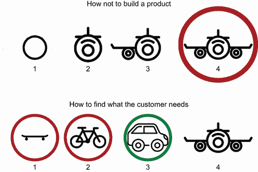
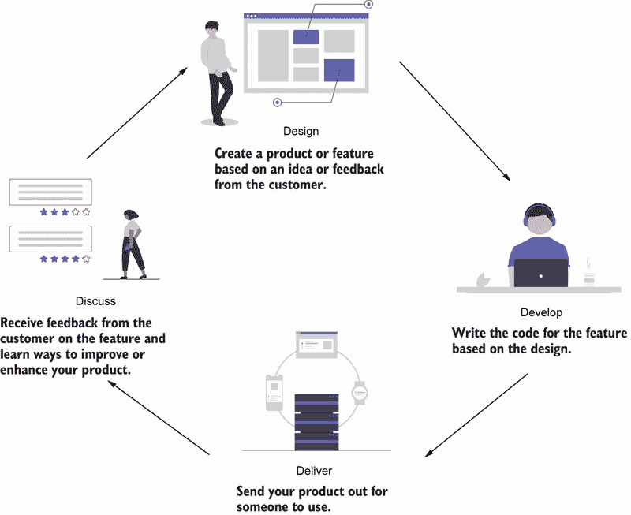
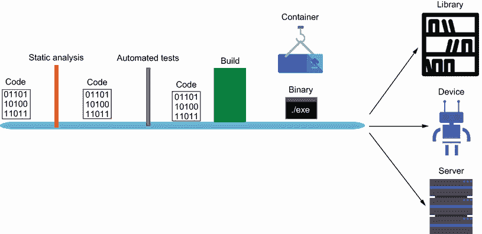
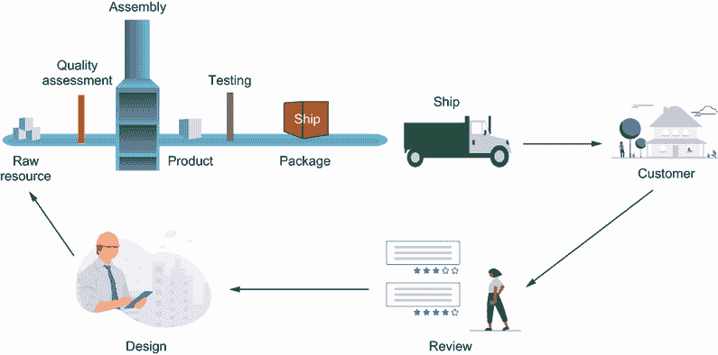
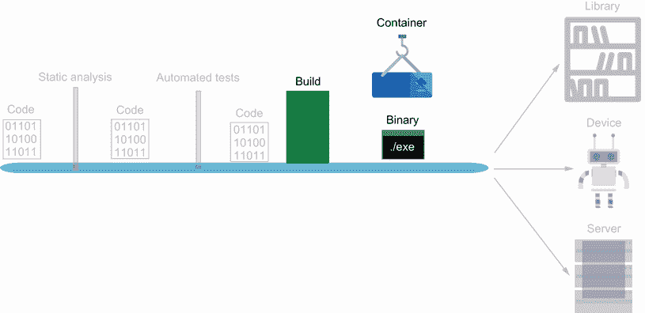
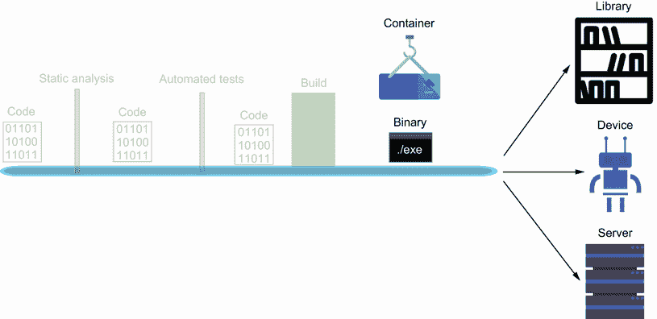

# 1 提供价值

本章涵盖

+   使用小块工作来提高工作效率

+   建立产品和流程改进的反馈循环

+   规划产品增长和发展的阶段

+   在各种反馈周期之间迭代

你将在本书中找到的内容是从敏捷软件开发、精益创业理念和 DevOps 文化中的过去实践中收集的。本书旨在帮助那些想要将他们学到的语言用于构建的人。你知道如何编写代码，并希望将其发布。这里教授的概念和流程应该与技术或语言无关，但我提供了使用 Go 和 GitHub Actions 的具体示例。通过使用它们的术语，你应该能够轻松地将我这里写的适应 Python 和 GitLab 或 JavaScript 和 CircleCI，但在这本书中，我们将发布 Go 代码。

本书采用半叙事格式，让我置身于一家希望快速开发增强型产品的公司的开发者角色。虽然这个项目很简单，但目的是让你了解产品开发的过程。许多这些元素部分来源于我的个人经验和事后之明。这种模式可能也不适合你公司的文化或流程，但希望你能从中找到一些有助于团队前进的元素。这里的重点是过程和心态，而不是技术。

最后，每个部分都被拆分，以便你在结束时交付一个产品。每一章都会基于现有章节进行构建，但如果你对过程满意，可以随时停止。每个部分以不同的方式将你的产品扩展到规模，例如通过扩大团队或提高资源利用率。我们探讨了与旧系统的集成和基于成本的不同的部署选项。

## 1.1 简单概念

本书汇集了来自各个行业的概念和流程，以帮助快速创建高质量的软件。其中一些概念在计算机和软件开发行业出现之前就已经存在。在过去几十年里，软件公司寻求其他行业的帮助，以更有效地构建产品来满足客户的需求。他们发现了一些能够从客户那里获得快速反馈的过程。基于这些反馈，他们能够调整他们的产品。调整他们的产品使他们能够成长为今天的谷歌、苹果和 Facebook，但他们根植于工业革命中的装配线和日本创造的精益制造技术。

假设你正在阅读这本书是为了构建一个产品。你有一些想法，你认为这会改变你的公司（或世界），你想要看看它是否可行。这是客户想要的吗？这有助于你的公司吗？很难知道。项目可能开始并最终失败。它们可能转型或改变，或者只是被遗弃在经验的垃圾堆中。如果一个项目几乎注定要改变或被丢弃，那么你应该投入多少努力？

想象一下尽可能少地投入精力去做某件事，这听起来可能很懒惰或缺乏灵感。相反，考虑一下有人告诉你需要构建一个设备，以尽可能快的方式将某人从一个地点带到另一个地点。在没有更多细节的情况下，你可能会花费数年时间设计和制造飞机，结果却发现客户只需要旅行 10 英里。比较图 1.1 中的两种开发过程。

在软件领域，这种情况经常发生。公司进行转型。他们从小规模开始，并不断发展。他们失败过。他们赚了数百万。他们是如何做到的？这来自于发展三个关键特性的理念：人员、流程和产品。人员推动组织和产品开发。一个流程帮助我们理解工作应该如何完成。最后，产品使我们能够从客户那里获得反馈。一旦你建立了你的流程，你就可以尽可能多地自动化它。这允许你的团队坐在一端，而产品则在另一端交付。

图 1.1 与客户交谈，以准确了解为他们构建哪种产品。

你的团队将开发客户想要的功能或进行更改。然后，这些更改将被交付给客户，客户反过来会就产品或功能进行讨论。这将触发设计步骤，从而重新开始整个过程。我喜欢将这个循环称为“四个 D”：开发、交付、讨论和设计。这是一个反馈循环，并成为我们价值流的关键部分，如图 1.2 所示。

图 1.2 开发、交付、讨论、设计循环

价值流正如其名，是指在公司内部创造价值的作业流程。这意味着与客户建立关系，并构建你认为对他们有价值的产品的过程。然而，直到你能了解客户的需求，你的投资应该尽可能小。如何降低投资成本？通过自动化。当你的源代码被提交时，它应该被视为一种原材料，而制造的产品应该在最后交付。

我们可以向另一个行业寻求答案。工业工程师长期以来一直在处理如何交付产品的问题。我们可以看看像流水线这样的创新，它展示了工作站之间自动化交接的好处。我们可以看看精益制造技术，以帮助我们理解减少在制品和即时交付以减少浪费的重要性。技术界已经观察并采纳了许多这些原则，以帮助设计和构建交付管道，这些管道自动将工作从单一想法到应用中的功能进行流动。这些想法和功能是在客户需要它们的时候才被创建出来的，而不是通过猜测客户的需求，提前花费时间和金钱开发可能不是他们想要的东西。这个管道可以在图 1.3 中看到，其中原始资源从一端进入，产品被发送出去，客户反馈被用来设计新的功能。这个周期对公司成功至关重要，这是我们将在整本书中探讨的概念。

图 1.3 代码沿着一条流水线移动，在这个过程中它被分析、构建，然后作为库发送到设备或服务器。

我们可以看到，代码在产品构建并运送到最终客户之前，会经过一系列自动化步骤来验证质量。这可能是一个用于另一个项目的库包，一个用于现场更新的设备，或者一个在云中运行的云服务器。所有这些都在几乎没有人工交互的情况下移动，使得代码编写和客户可以使用产品之间的时间线变得可靠。

## 1.2 小块

你在这本书中会发现一个关键主题，那就是创建小而迭代的步骤，以便将反馈引入你的流程中。因此，当我们构建我们的产品时，我们会采取小而迭代的步骤，这样你就可以看到产品是如何成长的。你可能觉得第一部分中的步骤对你来说太简单了，可以选择跳过它们。或者你可能发现，你只需要到第二部分的结尾就能将你的产品推向市场。

想象一下，你花了三周时间开发一个没有人查看或测试的功能。你认为需要多长时间才能有人测试你功能的所有不同部分？你认为他们会发现多少个错误？你能在多快的时间内解决这些错误？在你开发这个功能的过程中，发生了多少变化？

创建小块工作可以让我们减少在制品（WIP）并加快交付速度。在 Eliyah Goldratt 的书籍《目标》（Routledge，2014）中，作者指出，在制品会占用收入。你投资时间和金钱在一件不会到达客户的东西上。这是直到交付之前的价值损失。创建更小的数量工作会占用你价值流中更少的收入，因此我们将专注于更小块的工作，以便尽早和经常交付价值。

虽然每一章对于构建完整的流程都很重要，但最终你会发现，由于每个产品和公司都不同，你的流程也会有所不同。保持不变的是过程。想法被提出，代码被编写，产品被交付。图 1.4 展示了这个循环。

图 1.4 产品开发经历一个生命周期，从原材料开始，最终产生客户可以提供反馈的产品，从而带来产品的改进和变化。

在这一步，协作变得至关重要，因为你要拆除不同团队之间的壁垒。过去，公司内部存在部落，它们之间经常处于战争状态。测试人员责怪开发者编写了低质量的代码。开发者责怪运维人员部署缓慢。运维人员责怪测试人员因为遗漏的虫子而发生的部署数量。这是不健康且对我们的客户有害的，所以我们不是建立壁垒，而是拆除它们，在他们之间建立沟通渠道，并协作构建一个接受想法并交付价值的工具。

你将获得产品开发的整体视角，以便将你的想法转化为产品。从远处看，这个视角是什么样的？我们需要哪些步骤来构建我们的流程？让我们来看看。

### 1.2.1 持续性

有许多持续的事情：持续集成、持续测试、持续交付、持续改进。它们有什么共同点？它们都是……持续的——一个循环，一个完整的旋转，一个圆圈。所有这些“持续”的事情都告诉我们，它们都需要在开始时连接起来。丰田公司采用了这个模型来构建其著名的丰田生产系统（TPS）。公司不断评估其开发过程的每个阶段，从装配线的运行方式，到人工装配，再到实验。每个阶段都有一个反馈循环，任何员工都可以寻求改进公司的方法。

从开发的角度来看，持续性的存在让你在编写代码时不必过多担心之后要做大量的手动工作。如果流程组装正确，提交代码应该会触发一系列自动化流程，为你提供关于代码的反馈。它可能会失败质量评估或无法编译，但开发者会收到通知并修复它，形成一个循环。如果部署成功，开发者可以继续进行下一项任务，继续改进过程。

这本书的编写方式试图遵循这个模式。TPS 有很多步骤，覆盖了非常广泛的市场，所以对于这本书来说会过于理论化。我们将会做的是将其分解为三个广泛的类别：过程、质量和交付。

每个阶段可以根据你的需求和你在产品开发中的位置简单或复杂。提供的内容不是处方，而是帮助你实施这些各种技术的指南。

### 1.2.2 流程

人类仍然是软件工程的一个基本要素。他们提出设计。他们编写代码。他们验证结果。但人类并不是每件事都需要。事实上，你能在更少的人力投入上投资，你就能从你的团队中获得更大的收益。

这并不是说你要自动化你的开发团队。相反，考虑一下：你更愿意花一个小时部署一个应用程序还是开发一个新功能？我们采用了一种在 TPS 中找到的方法：“自动化中的人性化。”这意味着我们尽可能地自动化，这增加了我们工作的效率。但这不是一个黑盒或一系列企业命令。相反，开发者创建并添加必要的工具来帮助他们进行开发。

这看起来是什么样子呢？嗯，它变成了一系列文档、脚本和工具，帮助快速进行开发。我的代码应该是什么格式？使用格式化工具。我如何创建一个新功能？使用代码生成器。我们如何改进我们的部署流程？使用管道。

这个过程一开始可能会很脆弱，但会逐渐发展成为你团队不可或缺的一部分。你会发现，你公司的工作流程将变得更加顺畅，你将能够快速高效地满足需求。

### 1.2.3 质量

*质量*是一个棘手的概念，也是一些哲学讨论的基础。罗伯特·皮尔西格在他的书《禅与摩托车维修艺术》（Mariner Books，2005 年）中这样描述：

“质量……你知道它是什么，但你不知道它是什么。但这自相矛盾。但有些东西比其他东西更好，也就是说，它们有更多的质量。但当你试图说质量是什么时，除了那些具有它的事物之外，一切都消失了！没有什么可说的。但如果你不能说质量是什么，你怎么知道它是什么，或者你怎么知道它甚至存在？如果没有人知道它是什么，那么从所有实际目的来看，它实际上根本不存在。但就所有实际目的而言，它确实存在。”

所以当人们说“交付高质量的产品”时，这意味着什么？就我们的目的而言，我们说首先，*质量并不意味着完美*。没有代码或产品会完美无缺。因此，质量因此成为完美的近似。

通过将额外的质量度量纳入你的开发流程，可以近似完美。你必须、你的团队以及你的公司必须确定你为客户定义的质量标准。你的代码可能很漂亮，但在大多数情况下，它会被编译，而客户永远不会看到。如果这段漂亮的代码有错误，它是高质量的代码吗？或者如果你有代码可以工作并且已经工作了多年，但难以阅读或调试，那是高质量的代码吗？

我们的质量检查将主要通过各种类型的测试代码进行。不同的模式和策略将被用来确保我们的产品按照开发者和客户的预期正常工作。这一步骤减少了系统中的浪费，这些浪费是通过返工（错误）和延误（未满足的需求）发生的。我们使用测试的多种方式来确保我们的产品在发货前能够正常工作。这不会解决我们需要的所有质量代码问题。诸如代码清晰度和可维护性等因素也有助于我们代码的质量，并将是我们添加的额外步骤。然而，最终，代码的编写者和维护者才是质量的守护者。

### 1.2.4 交付

交付是我们能够回到开始之前的最后一步。这是我们的管道中价值出现的地方。在代码编写并推送之后，我们通过客户对我们所写内容的反应来验证我们所写的内容。可能会要求更改，或者用户可能会满意或不满意。这个反馈循环只有在产品交付之后才会发生。

交付是指将工件发送出去的行为。一个 *工件* 可以是库的一个版本、一个可执行的二进制文件、一个容器镜像，或者任何可以被其他人使用的其他东西。工件可以私密或公开地交付。在某些情况下，公司会构建所谓的 *发布候选版本*，这是一种几乎准备好向公众发布的产品。这个候选版本可以通过另一组自动化测试来检查性能问题（负载测试）、可用性问题（UI 测试）或者是否真的能工作（冒烟测试）。可以通过手动测试来探索产品，获得批准的印章，然后向公众发布，如图 1.5 所示。

图 1.5 代码被构建成可执行文件或封装在通用运行时中，例如容器。

使工件运行的过程被称为 *部署*。在某些情况下，这可以包括在服务器上安装应用程序、在无服务器环境中设置新功能、在容器运行引擎上运行新容器，或者简单地通过空中更新客户的机器（例如，操作系统更新）。正是在这一点上，我们开始看到我们所构建的完整价值，如图 1.6 所示。

图 1.6 输出作为库被发送到客户，安装到嵌入式设备或服务器上。

在整个过程中，我们持续学习客户的需求和产品使用方式，这些信息反馈给我们的开发团队。如果一个应用无法启动，我们知道我们破坏了需要修复的东西。如果当太多人使用时它崩溃了，我们知道需要做出改变。如果只有一小部分用户觉得某个功能无帮助或不值，我们可能需要回到起点重新设计。

## 1.3 构建你的产品

产品开发周期中发生的事情与科学方法非常相似。你有一个假设，并通过实验来验证你的假设是否正确。有时你可能需要改变实验参数或探索不同的方向。产品也可以类似。你的想法（假设）可能不符合市场需求，所以你做出改变（实验）并最终找到是否成功。在两种情况下，你都会学到一些东西。

在构建你的产品过程中，将会有各种阶段。随着你的进展，每个部分都可能变得更加复杂，并将概述产品的成熟阶段。

### 1.3.1 初始设置

开始一个新项目需要什么？仅仅是一个好主意吗，还是更多？当你开始一个项目时，就像我们在第二章中做的那样，你需要收集关于系统应该做什么以及你期望它如何工作的信息。随着项目的进展，你需要指令和脚本为他人设置项目。在组织或大型项目中工作，你不会是唯一的工作者。在某个时候，有人会想要贡献，现在记录步骤比以后担心它更容易。

文档和脚本将帮助你扩展团队成员和贡献者。构建基本管道在开始时也很重要，因为后期改造可能会很棘手。在本节中，我们开始走向工业编程的道路，而不是黑客式编程。这两种类型的编程都有其时间和地点，但在这个例子中，我们关注的是构建产品而不是验证一个想法。一旦我们建立了一些基本的安装和流程，我们将在进行中添加更多。

### 1.3.2 基本验证

验证你的代码按预期工作是通往开发优秀产品的道路上的另一个步骤。团队经常将测试等事项推到优先列表的底部，因为他们觉得他们的产品在初期太不稳定，但测试不仅仅是开发者的安全毯。相反，它们告诉开发者他们正在编写的业务规则，并将产品引导到预期的目标。这些护栏可以帮助开发者长期发展，并在管道中将它们作为基本验证建立起来，有助于加速产品的增长，并通过代码记录业务期望，赋予开发者自主权。我们在第三章通过设置基本单元测试流程来探讨这个过程。

### 1.3.3 零成本部署

没有发布，你的产品就像放在架子上一样。部署是将你的产品放到服务器上，以便有人可以使用它。然而，当你查看所有选项时，有无数的事情需要考虑。其中最重要的是成本。这就是为什么对低成本技术的关注如此之大，以便将产品部署出去。

从第四章开始，我们将介绍各种免费选项，这些选项随着你的用户基础的扩大而扩展。我喜欢称之为“零成本”，因为早期，运行产品以获取市场验证不应该花费你任何费用。为此，我们将探索无服务器技术，如部署函数和托管平台。

### 1.3.4 代码信心

工作标准化是工业化生产的核心原则。同样，开发者们创造了一些技术来标准化软件的编写方式。随着团队的壮大，编码标准和格式变得重要。通过使用这些技术，我们可以更早地捕捉到错误，并在产品被测试之前自动检查产品的质量。

此外，在第五章中，我们将探讨代码审查流程，看看它如何有助于创建高质量的产品，以及它如何被用作团队成员的教学机制。我们还将使用文档来帮助我们的团队理解我们编写的代码，并努力创建易于理解的代码。

### 1.3.5 集成

系统很少在真空中工作。它们要么与数据库、文件系统或其他应用程序交互。这被称为集成，它是测试我们系统的一个关键部分。在第六章中，我们将探讨测试与其他系统集成时使用的技术。我们将与简单的存根系统以及更高级的模拟技术进行交互。为此，我们需要创建一个层，使我们能够反转依赖关系，从而针对抽象而不是具体系统进行开发。这样做将赋予我们更高的灵活性。

### 1.3.6 可移植性

“在我的机器上运行正常”是软件开发圈子中经常出现的一个陈词滥调。你花费了几个月时间创建一个系统，并且你知道它的所有细节。突然，有人想运行它，但它却无法运行。他们遵循你的设置，但你遗漏了一个依赖项。你是在 Linux 上开发的，但他们使用的是 Windows。

我们如何解决这个问题？在第七章中，我们将探讨抽象工具，这些工具帮助我们进行虚拟化和打包我们的产品，使其能够在通用运行时上运行。这将通过 Buildpacks 和容器来完成。最终，我们将将其集成到一个对每个人都是可移植的系统，包括我们的各种云部署选项。

### 1.3.7 适应性

当你发布你的产品时，你会发现自己在构建不完整的功能或关闭功能。通常，公司在将产品发布给客户之前会创建一个单独的产品进行测试，一旦“稳定”，但这种方法已被发现会降低团队的生产力，并可能导致发货延误。相反，行业已经转向通过使用配置来改变我们应用程序的工作方式。通过配置我们的应用程序，正如我们在第八章中所做的那样，我们可以改变功能而不改变代码本身。这意味着可以通过设置变量或通过更改标志来更改端点来测试实验性功能。配置意味着你可以调整你的应用程序，使它们可以像你一样快速移动。

### 1.3.8 用户验收

简单测试非常适合测试函数和方法在你的应用程序中的工作方式。它们帮助你专注于技术方面，但很少将你的工作与用户的需求联系起来。用户可能需要一个期望特定格式的 API 或一个具有特定期望的业务规则。在这种情况下，我们的测试从技术转向了稍微“柔软”一些的东西。在第九章中，我们将探讨其他技术。我们感兴趣的并不是它是如何完成的，而是我们是否满足了为我们设定的规格。“如果我的余额少于提款金额，那么我应该得到一个错误”是我们希望测试的规格示例。

### 1.3.9 比例产品

在我们的部署环境中使用各种抽象可以帮助我们建立客户基础。随着时间的推移，这些抽象可能会让你和你的公司付出金钱或性能的代价，因此你开始拆解这些抽象，这需要你对所构建的服务器和系统有更多的技术专长，以降低成本并能够根据需要扩展服务器。在第十章中，我们将探讨如何在可视化的服务器实例上创建和交付产品，以及如何通过代码维护这些产品。

### 1.3.10 端到端

任何产品在达到临界质量后的最后一步是测试其质量。到这时，我们将通过测试和代码检查创建出几种测试质量的方法。但随着产品进入生产阶段，我们希望确认客户将体验到的内容。通常这通过质量保证团队来完成，但我们希望尽可能自动化这一过程，以便我们的团队能够探索更细微的缺陷或寻找改进的领域。在第十一章中，我们将为我们的流程添加最后的基石，这将让我们从客户的角度了解整个系统是否按预期工作。我们专注于在整个系统中推动质量检查，但最终，我们应该有一个最终的检查来确认一切是否作为一个整体工作。由于这是一个成本较高的操作（从时间和维护的角度来看），我们将其留到最后，因为通常在产品成熟后，这是最后要实施的部分。在第十一章中，我们将展示一些测试，以便您的团队能够探索其他改进领域。

## 1.4 反馈循环

我猜很容易问出所有这些的意义所在。答案很简单，就是让您在整个产品、团队和公司成长过程中，能够快速且紧密地建立反馈循环。这些原则也容易转移到其他业务和项目中。

*敏捷性* 是软件开发中经常被提及的一个术语，它旨在捕捉灵活和快速改变方向的想法。然而，我觉得这个术语不够充分，因为它常常感觉像是在玩躲避球，试图躲避或回避反馈，而不是接受它。相反，我们的开发过程应该像驾驶赛车一样，你需要做出瞬间的决定，以保持向终点线的移动。随着我们通过这本书，我希望您能在您的项目和团队中找到一些前进和赢得比赛的指导。

## 摘要

+   产品开发是一个不断变化的过程。

+   专注于反馈循环将有助于指导改进领域。

+   自动化是建立更快反馈循环的关键。
