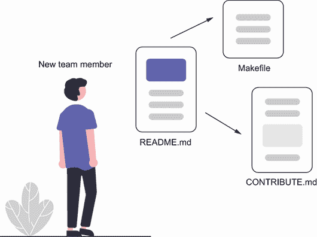
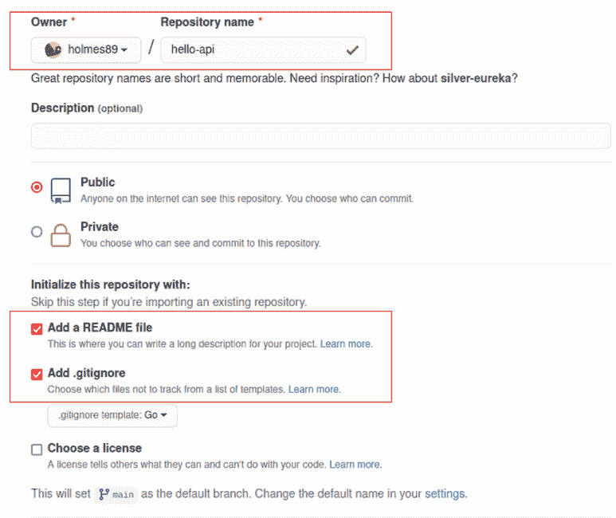
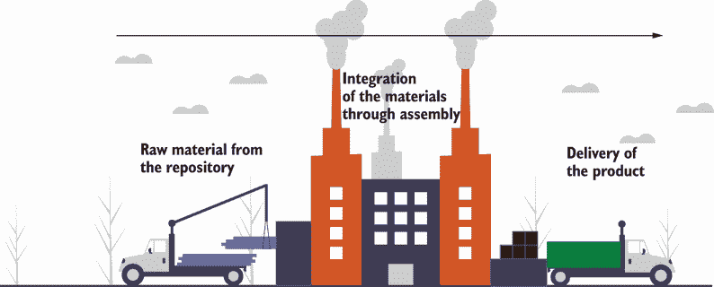
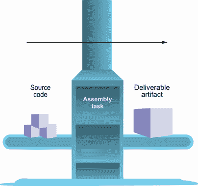

# 2 介绍持续集成

本章节涵盖

+   在源代码中记录需求

+   以中央代码仓库作为你流水线的起点

+   通过使用持续集成系统来自动化构建你产品所需的步骤

+   创建一个基本应用程序以开始开发

周一，你一边喝着早咖啡一边浏览着邮件，突然看到一封会议邀请，标题为“启动会议”。你看了看时间，意识到自己要迟到了。拿起笔记本电脑，你跑到会议室，只见那里坐着一个人，一个产品经理。当你关上门走向座位时，他说：“很高兴你能来；很抱歉临时邀请，但我们需要在本周内完成一些工作。我们公司希望探索创建一个比我们遗留系统更便宜、更快的新的 hello 翻译服务。在未来，我们希望将服务扩展到不仅仅是翻译‘hello’，但我们的系统将无法扩展。到目前为止，对话已经持续得太久，我想向他们证明我们可以快速完成工作，同时还能达到他们的目标。你认为我们能做到吗？”

一个新服务，在一周内以更优的性能和更低的成本复制旧服务的功能？当然，为什么不呢？你有什么可失去的？

“我希望你分步骤完成这项工作，并编写代码以便我们能快速获得反馈。此外，我希望明天能从实时服务器演示这个。它不需要完美；只需要展示我们一天内能做什么。我还希望其他人演示结束后能加入你。我们还需要确保它按预期工作，并且我们可以证明为什么它能。”

当他们在谈话时，你迅速打开一个终端并输入 `mkdir` `hello-api` `&&` `touch hello-api/README.md`。你打开你的 `README.md` 文件，并按照以下列表编写代码。

列表 2.1 `README.md`

```
# Hello API

## Release Milestones

### V0 (1 day)
- [ ] Onboarding Documentation
- [ ] Simple API response (hello world!)
- [ ] Unit tests
- [ ] Running somewhere other than the dev machine

### V1 (7 days)
- [ ] Create translation endpoint
- [ ] Store translations in short-term storage
- [ ] Call existing service for translation
- [ ] Move towards long-term storage
```

“很好，一旦你完成了，告诉我，我们可以讨论下一步。我很感激你做这件事。我认为这将对我们展示公司如何快速进行产品开发并取得成功大有裨益。”

你带着笔记本电脑离开房间去喝更多的咖啡。当你回到办公桌前，你看了看时间：9:15。是时候开始编码了。

## 2.1 从哪里开始？

基于一个想法开始一个项目可能会有些令人不知所措。你用哪种语言编写它？应该如何构建？有哪些不同的用例？

有趣的是，这些都无关紧要。如果你被要求在一天内创建某物，你将使用你最熟悉的语言。你将以最简单的方式编写代码。你永远不会知道所有的用例，所以最好是尽快将产品交给客户。在这个项目中，你有一个好处，就是了解一些业务需求，因为有一个遗留系统，但在大多数情况下，你永远不会知道。

在您开始时，创建一个文档来记录您的设置过程、里程碑、测试过程等是一个很好的主意。您在开始`README.md`时已经开始了文档。大多数开发者会首先打开这个文件，这是一种异步沟通的好方法。README 文件不是一个新概念，并且几十年来一直是软件开发的一个固定元素。它的目的是向用户提供配置、安装、运行或使用软件的相关信息。您的 README 包含的内容取决于您的团队，但通常它将包含以下内容：

+   运行软件的说明

+   在您的环境中运行软件的配置

+   已知依赖项

+   故障排除信息

+   常见的使用案例和软件使用示例

+   软件里程碑

图 2.1 显示了文档如何作为新团队成员的地图。



图 2.1 README 文档是指向您产品中所有其他文档的指针。这将有助于增强开发者对如何贡献、运行、构建或调试您产品的理解。

您已经从列表中添加了这些项目之一：软件里程碑。现在您想添加对软件功能的描述，它需要什么，以及如何开始工作。README 现在已经成为一个实验室笔记本，您在其中告诉他人您正在做什么以及如何复制实验。它还应包含一个论文或目的，告诉读者这个产品做什么。如果您发现很难写论文，那么您可能对您正在构建的东西没有很好的想法。让我们把它写出来：

```
# Hello API
```

这是当前我们在生产中使用的`hello-api`的改进版本。它将使用更少的内存，在生产中运行成本更低，并且可以扩展，扩展到更多的单词，并且更稳定：

```
## Dependencies

- Go version 1.18

## Setup

## Release Milestones
...
```

太好了！您已经用它做出了第一个决定。选择 Go 对您来说很自然，因为它是一种您在业余时间一直在使用的有趣、较新的语言。这将是一种向公司介绍它的好方法，并且它以使用少量内存、可扩展性和稳定性而闻名。请注意，您留下了`设置`为空白。这是故意的。这是一个活文档，应该在基础设施变更实施时更新。这将通过引导我们走向下一步的逻辑步骤来帮助我们贯穿整个章节。

## 2.2 绿色项目

对于这本书，我们使用基于 Unix 的开发环境。为什么？因为我们将要使用的许多部署服务都是基于 Linux 的。Windows 甚至有一个很酷的功能可以在 Windows 内部运行 Ubuntu Linux。在 Linux 和 Windows 之间，我们有相当大的用户份额。macOS 对于大多数事情都适用，所以我们需要指出它不适用的情况。这一点非常重要，所以我们可能需要将其添加到我们的`README.md`文件中：

```
...
## Setup

...
```

开发预期将在类 Unix 系统上运行。如果你正在运行 Windows，请考虑遵循以下指示（[`mng.bz/VpQr`](http://mng.bz/VpQr)）。

现在我们需要安装 Go。简单地粘贴下载链接并告诉用户遵循指示会很容易。然而，你可能使用的是 1.7.2 版本，下一个人使用的是 1.7.3 版本，再下一个人使用的是不同的版本。很快，每个人都使用不同的版本，这看起来无害，但当你帮助同事解决问题时可能会成为问题，因为它在你的机器上工作，但在他们的机器上不工作。

在这种时候，我们希望使用标准化工具来帮助创建可重复的任务。为此，我们将创建一个 Makefile——在开发世界中是一种标准，它可以变得非常复杂。我们的 Makefile 将仅包含一些小命令，我们可以在文档中引用它们，并帮助我们进行开发。在您的代码编辑器中打开一个新的 Makefile，并添加以下列表中的代码。

列表 2.2 Makefile

```
GO_VERSION :=1.18

.PHONY: install-go init-go                                         ❶

setup: install-go init-go                                          ❷

#TODO add MacOS support
install-go:                                                        ❸
  wget "https://golang.org/dl/go$(GO_VERSION).linux-amd64.tar.gz"
  sudo tar -C /usr/local -xzf go$(GO_VERSION).linux-amd64.tar.gz
  rm go$(GO_VERSION).linux-amd64.tar.gz

init-go:                                                           ❹
  echo 'export PATH=$$PATH:/usr/local/go/bin' >> $${HOME}/.bashrc
  echo 'export PATH=$$PATH:$${HOME}/go/bin' >> $${HOME}/.bashrc
```

❶ `.PHONY` 用于提前定义我们的一些方法，以便我们可以在设置阶段使用它们。

❷ 运行命令安装 Go 并设置环境

❸ 下载特定版本的 Go 并安装

❹ 将 Go 位置添加到您的本地环境

替代方案

以下代码使用 Make，因为它被 DevOps 社区和开发者相当频繁地使用：

```
- TaskFile[https://taskfile.dev/] - Modern Make alternative using YAML
```

**注意** 如果你不是使用 Bash 作为您的 shell，你将不得不修改这些步骤以将 Go 添加到系统路径。

注意这里的 `TODO` 注释。这是可以的。记住，我们试图快速行动但也要有帮助。重要的是要记录缺失的内容，这样其他人加入代码库时就会知道。`TODO` 项是人们开始贡献的绝佳方式！将以下列表中的代码添加到您的 README 中。

列表 2.3 `README.md`

```
...
## Setup

### Install Go          ❶
`sudo make setup`

### Upgrade Go          ❶
`sudo make install-go`
...
```

❶ 此 Makefile 还不支持 macOS。

通过标准化和文档化，你建立了一项关于如何在此产品上工作的指南。这几乎就像从宜家拿出一张桌子的一套组装说明。任何拿起它的人都应该能够遵循指示并运行应用程序。标准化我们的系统允许他人贡献。鉴于我们的工具和文档，产品开发进化的下一步是自动化。对于工厂来说，这表现为装配线。对于软件来说，这来自持续集成管道。

## 2.3 装配线

当生产者能够在家中将他们的工作标准化后，他们开始转向集中式工厂。这些工厂仍然让每个工人坐在他们的工作台上自己组装物品。一个工人的工作可能只是切割鞋子的皮革，然后将切割好的皮革堆叠交给另一个工人，由他将其固定到底部部件上，依此类推。今天，装配线大不相同。有些人站立并执行重复性任务，但随着更高级自动化的出现，这些工作站变得更加熟练和细致，需要特殊培训和知识，就像今天的软件开发者一样。

在软件中，我们可以想象这是一个开发者坐在他们的机器上，编写代码，编译它，然后部署它。虽然许多人以这种方式生产代码，但这并不容易扩展。工匠会制作定制家具，同样，许多程序员会坐在家里独自对一个项目进行黑客攻击。但这不是工业发展。这些都是独立项目。大多数公司不需要工匠软件；他们需要可预测性和可靠性。

需要的是一种自动化工厂中物品流动的方法，这样工人就不必自己完成所有工作或花费时间传递物品。在工厂中，这被称为装配线；在软件开发中，它被称为*持续集成管道*。

持续集成管道，或 CI 系统，只是一个将代码沿着一系列预定义流程移动的应用程序。CI 系统可以像将文件复制到不同位置那样简单，也可以像处理多个部署和质量检查那样复杂。在这本书中，我们将使用 GitHub Actions 从前者过渡到后者。表 2.1 概述了一些最常见的 CI 系统。

表 2.1 持续集成服务器也随着时间而发展，通常拥有基于云的托管解决方案，因此您无需自行运行它们。

| 持续集成系统 | 年份 | 托管服务 |
| --- | --- | --- |
| Azure DevOps | 2005 | 是 |
| TeamCity | 2006 | 是 |
| Circle CI | 2011 | 是 |
| Jenkins | 2011 | 否 |
| Travis CI | 2012 | 是 |
| GitLab | 2014 | 是 |
| GitHub Actions | 2020 | 是 |

GitHub Actions 是一种相对较新的技术，用于帮助开发者为源代码创建集成管道。它使用一个特殊的 YAML 文件来帮助我们定义我们希望代码通过的各个阶段，何时运行这些阶段，以及如果出现问题应该做什么。管道被分解为一组作业。每个作业可以包含一系列步骤，并且可以依赖于其他作业。每个步骤可以直接在底层系统上运行命令（bash 命令、脚本等）或使用库来帮助执行重复性任务（设置 Go、检出代码等）。当你查看一些定义时，你会看到像 `actions/setup-go@v2` 这样的东西，这意味着我们将使用 `GithubAction` 命令来使用正确版本设置我们的 Go 环境。

此外，我们还想了解我们正在构建的第一个管道。一开始，我们只想创建一个二进制文件并将其作为工件上传到我们的 GitHub 仓库。你应该看到以下步骤：

1.  设置 Go 环境。

1.  检出代码。

1.  构建二进制文件。

1.  将文件复制到上传目录。

1.  将工件上传到 GitHub。

为了展示其简单性，我们将在编写任何代码之前创建我们的管道。在你的终端中，输入 `mkdir -p .github/workflows && touch .github/workflows/pipeline.yml`，然后打开文件。在其中，我们将添加以下列表中的代码。

列表 2.4 `pipeline.yml`

```
name: CI Checks

on:
  push:
    branches:                                                ❶
      - main
jobs:                                                        ❷
  build:
    name: Build App
    runs-on: ubuntu-latest                                   ❸
    steps:

    - name: Set up Go 1.x                                    ❹
      uses: actions/setup-go@v2
      with:
        go-version: ¹.18

    - name: Check out code into the Go module directory      ❺
      uses: actions/checkout@v2

    - name: Build
      run: make build                                        ❻

    - name: Copy Files                                       ❼
      run: |
           mkdir  artifacts
           cp api artifacts/.

    - name: Archive                                          ❽
      uses: actions/upload-artifact@v2
      with:
          name: api                                          ❾
          path: artifacts
```

❶ 我们只有在主分支有更改时才会运行这个 CI 流程。

❷ 这些是我们管道中运行的各个阶段。

在基于 Linux 的机器上运行此程序。

❹ 确保我们的镜像有 Go 1.18 或更高版本

❺ 从本地仓库拉取代码

❻ 告诉我们的构建命令构建一个二进制文件

❼ 将生成的二进制文件复制到上传目录

❽ 创建一个包含二进制文件的存档，并将其附加到工作流程中

❾ 将二进制目录命名为你可以识别的名称

希望你们中的一些人已经注意到我们列出了一个新的 `make` 目标。在这里，我们正在使用 `make build` 标准化我们的构建。为什么？好吧，Go 允许我们使用标志和各种其他功能来配置我们的构建，我们想确保它是标准化的。现在，我们将使用简单的 Go 构建，但在未来的章节中，我们将有其他配置，我们希望使用。让我们使用以下列表中的代码将我们的构建命令添加到 Makefile 中。

列表 2.5 `\.gitignore`

```
GO_VERSION := 1.18

setup:
    ...

build:
    go build -o api cmd/main.go      ❶
```

❶ 构建命令将编译主应用程序到一个名为 api 的二进制文件中。

你可能想知道代码是在哪里构建的。相信我，我们很快就会到达那里。现在，你可以看到我们如何将标准化的构建系统与我们的生产线结合起来。我们的开发者可以使用我们在生产线上使用的相同命令来确保它们在本地工作，但将在我们的管道上自动触发。如果我们需要更改流程，它就可以在本地和生产环境中得到反映。

注意：你更改了流程。你是否更新了文档？

装配线常被误认为是亨利·福特的一项发明。然而，装配线的概念在福特在著名的 T 型车中使用它之前就已经存在了几十年。服装、机器、自行车和船只都是将零件在劳动分工的不同部分之间移动的概念的应用，这一概念可以追溯到工业革命时期。自动化的材料轨道会在装配或单元生产中移动。你可以在图 2.2 中比较这两个。


图 2.2 随着时间的推移，装配线在它们能做什么方面已经发生了演变。自动化增强了工人创造更高品质产品更有效率的能力。

亨利·福特甚至没有发明**自动化**生产线。他因应用生产线而闻名，通过创建核心原则，这些原则有效地从开始到结束高效地交付了他的产品。

他的原则很简单：

+   按操作顺序放置工具和人员。

+   优化每个工作站的工作流程。

+   自动化生产线以移动正在组装的产品。

这些原则归结为将工具和工人分组：创建一个易于组装的系统，需要部件自动从每个阶段移动。今天，生产线更加复杂，自动化程度更高，但原则保持不变：使你的工具易于使用，高效地使用工具，并自动化流向下一步的流程。

我们刚刚创建了一条生产线，将我们的工匠开发转变为工业化开发。我们现在需要做的是找到一种将材料运入工厂和将产品运出的方法。

## 2.4 仓库

我住在匹兹堡，钢铁之城。它之所以得名，是因为在 19 世纪末在这里建立的大型钢铁工业。今天，你仍然可以在城市的郊区看到仍在运行的钢铁厂和废弃的钢铁厂。是什么原因使这里的钢铁工业如此庞大？是气候吗？人口吗？技术吗？不。成功在于其靠近制造钢铁所需的材料以及当时分销网络的邻近性。煤炭、铁和石灰石从城市周围的山脉和附近地区运下来进入工厂。然后工厂生产钢铁，通过铁路或通过河流上的驳船运出。

资源**邻近性**和**分销网络**对现代生产同样至关重要。不再依赖于自然资源的地理位置，现在公司会建造仓库来储存他们的材料，直到他们可以处理它们。当产品完成时，它随后会进入另一个仓库，直到客户需要。这些仓库也有另一个更通用的名字：存储库。

**存储库**是存储物品的地方。在软件中，我们有代码存储库来存储我们的代码。与制造业一样，我们希望我们的源代码与我们的工厂保持接近，以使产品开发更高效。在我们的情况下，我们希望我们的软件代码在组装时接近我们的管道代码。代码存储库有多种形状和大小，但我们将使用 GitHub 上托管的 Git 作为我们的代码存储库。

我们将在整本书中使用一个项目。源代码可以在[`github.com/holmes89/hello-api`](https://github.com/holmes89/hello-api)找到。在每一章中，我们向我们的存储库添加新的任务和程序，以展示我们如何从一个存储库测试、构建和部署多个产品。

首先，如果你还没有注册 GitHub 账户，请访问[`github.com/join`](https://github.com/join)然后[`mng.bz/xdxq`](http://mng.bz/xdxq)（SSH 访问你的账户）。

然后导航到右上角，点击加号，选择新建仓库。然后你将进入一个设置页面。选择一个名称，如果你愿意的话，还可以添加一个描述。按照图 2.3 中的设置进行操作。



图 2.3 提供一个名称，并使用 Go 模板创建一个`.gitignore`文件。

然后点击创建仓库。恭喜！你已经创建了一个仓库。请确保你已经安装了 Git([`mng.bz/AlXE`](http://mng.bz/AlXE))。然后我们将配置我们的本地目录以使用这个仓库。在你的目录中运行以下代码：

```
git init
git remote add origin git@github.com:holmes89/hello-api.git
```

现在我们可以将代码存储在中央位置，我们的操作将生成一个二进制文件，这个文件也将与其他人共享。这个仓库对我们产品的增长至关重要。一旦我们分享代码，其他人也可以开始贡献和共享。我们的代码是我们系统构建、测试和发货产品的材料。

这意味着我们的产品代码、测试代码和基础设施代码都存储在同一个仓库中，它们可以经过处理并用于发货产品。不仅我们的产品代码要经过质量检查，测试代码和基础设施代码也是如此。随着我们继续阅读本书，我们将看到这一点。如图 2.4 所示，用于产品的材料被运送到单个装配点，然后产品被发货。



图 2.4 在制造业中，材料从原材料仓库中交付，然后组装成成品，交付给客户。

仓库需要存储制作我们产品所需的一切。这包括产品代码、部署代码、基础设施定义、测试计划、自动- 

集成测试框架等等。这可能对一些人来说似乎很激进，但这是持续集成理念的核心。这是我们构建产品的唯一真相来源，并为所有参与其中的人创造了一种所有权感。你可能发现一个项目可能需要多个仓库或依赖于外部系统。这些属于不同的开发和部署模式。在这个例子中，我们专注于单一项目仓库，以保持我们的工作简单和有序。我们想要的代码进入，产品出去，如图 2.5 所示。



图 2.5 与制造过程类似，我们可以通过集成层将源代码组装成产品，然后交付给客户。

使用单个仓库，你可以解决许多组织问题。例如，通过将测试代码与产品代码放在同一个仓库中，你可以在部署工件之前，在构建后轻松运行集成测试。否则，可能需要在测试仓库上触发以在构建完成后开始测试。或者，你可能会发现，在发布新功能或模式更改时，你面临的是一个鸡生蛋的问题。正如我之前提到的，这需要基于你和你团队想要的结构来决定。

一些项目可能不需要检查到你的仓库中。特别是，像编译后的二进制文件和外部库通常不会被检查，但它们是你开发过程中留下的碎片，你不想将它们添加到仓库中。为了处理这个问题，我们可以创建一个特殊的文件，称为`.gitignore`。创建一个，打开它，并添加以下内容：

```
# Binaries for programs and plugins
*.exe
*.exe~
*.dll
*.so
*.dylib

# Test binary, built with `go test -c`
*.test

# Output of the go coverage tool, specifically when used with LiteIDE
*.out

# Dependency directories (remove the comment below to include it)
# vendor/

api       ❶
```

❶ 我们不希望将二进制文件保存到我们的源代码控制中。

这应该可以防止我们将这些文件添加到我们的仓库中，以保持其整洁。你可能不需要所有这些文件，但它们是标准文件，你不会希望将它们检查到你的仓库中。

现在我们有了 Makefile 的标准，README 中的文档，以管道形式的过程，以仓库形式存储，以及以发布形式交付。我们唯一缺少的是生产产品的材料。

## 2.5 材料内容

代码在哪里？为什么我们还没有写一行 Go 代码？为什么在我们甚至没有产品之前，我们要经历所有这些设置？

这些是很好的问题，说实话，似乎有点反常，要在没有其他人参与项目并且没有编写代码的情况下投入所有这些工作来构建管道并记录它。但这却是故意的，目的是证明一个观点。我们的流程应该与我们所编写的代码无关。我选择 Go 作为本书的原因有很多，但你可能是一名 JavaScript 或 Python 开发者，这些原则仍然适用。我们可以想象，我们的项目从`hello-service`变为`good-bye-service`，而我们所做的所有工作都不会改变。代码并不重要！

为了演示这个魔法，让我们编写我们的代码。输入`mkdir cmd && touch cmd/main.go`，打开文件，并添加以下列表中的代码。

列表 2.6 `main.go`

```
package main

import (
    "encoding/json"
    "log"
    "net/http"
)

func main() {

    addr := ":8080"                                     ❶

    mux := http.NewServeMux()

    mux.HandleFunc("/hello",
      func(w http.ResponseWriter, r *http.Request) {    ❷
        enc := json.NewEncoder(w)
        w.Header().
        Set("Content-Type",
        "application/json; charset=utf-8")              ❸
        resp := Resp{
            Language:    "English",
            Translation: "Hello",
        }
        if err := enc.Encode(resp); err != nil {
            panic("unable to encode response", err)
        }
    })

    log.Printf("listening on %s\n", addr)               ❹

    log.Fatal(http.ListenAndServe(addr, mux))           ❺
}

type Resp struct {                                      ❻
    Language    string `json:"language"`
    Translation string `json:"translation"`
}
```

❶ 硬编码系统端口；目前我们将来能够配置它。

❷ 目前创建一个单独的处理程序，以满足我们系统的最低要求。

❸ 设置默认的头部类型，因为这将是一个 REST API

❹ 为服务器端口提供额外的日志信息；这些信息在运行单个机器上的多个服务器时通常很有帮助。

❺ 运行服务器

❻ 存储翻译信息的通用结构

在本书中，我们将使用内部 HTTP `mux`库和 Gorilla Mux，但还有其他选项：

+   Gin

+   kit

+   beego

让我们打包我们的代码，以便其他人知道它依赖于哪些库。为此，我们将初始化一个 Go 模块。有关 Go 模块的更多信息，请访问[`go.dev/blog/using-go-modules`](https://go.dev/blog/using-go-modules)。

输入`make build`然后`./api`，看看你的服务器是否运行。通过在另一个终端运行它来测试：

```
curl localhost:8080/hello
{"language":"English","translation":"Hello"}
```

就像魔法一样。现在，接下来我要展示的是，我们将让我们的管道生成一个二进制文件。在你的终端输入

```
git add .
git commit -am "Initial creation"
git push origin main
```

导航到 GitHub，点击“操作”标签，查看你的管道运行情况。希望一切都会变成绿色。点击运行，你会看到一个名为`api`的二进制文件。下载并运行它，你会看到它与本地实例的工作方式相同。你可以玩弄代码，更改输出以查看管道运行并交付新的二进制文件。

这段代码相当愚蠢，但这是故意的。想想投入的努力以及这为他人打开了什么。如果同事正在等待这个功能来构建用户界面，他们不需要完整的系统来开始集成。或者，如果我们还没有完全确定客户想要什么，我们可以先把这个东西拿出来进行演示。它并不完美，但它是有效的。这正是持续集成和部署的本质：小块的工作可以让你不断前进。现在我们已经写好了基本代码，我们需要将其放入传送带进行组装和交付。

现在，我们可以交付一个产品供他人使用，同时我们回头改进我们编写的代码。将任务分解成小块对于创建满足客户需求的高质量产品至关重要。这也有助于降低引入比我们需要的或能够支持更多的代码和功能的风险。

我们的项目经理希望明天能有一个演示，以证明这将有效，而你刚刚做到了这一点。它不是动态的，但这没关系。这是我们将在过程中添加的复杂性，但现在有了自动化的方式来做这件事，它将变得简单。

你看看你的钟表，意识到是吃午饭的时间了。你站起来，看到 QA 部门的负责人正朝你的桌子走来。你的目光相遇，他们挥手喊道：“嘿，你有几分钟时间吗？”你点头，又坐了下来。

## 摘要

+   代码仓库是管道的起点，所有代码都存储在这里。

+   使用脚本和工具使所有开发者和系统环境保持一致。

+   在你的代码库中记录下所有内容，以便开发者从第一天开始就能提高生产力。

+   自动化与你的代码相关的所有任务。
