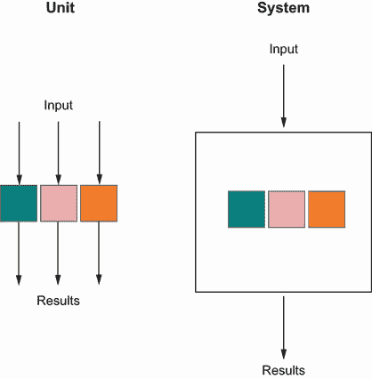
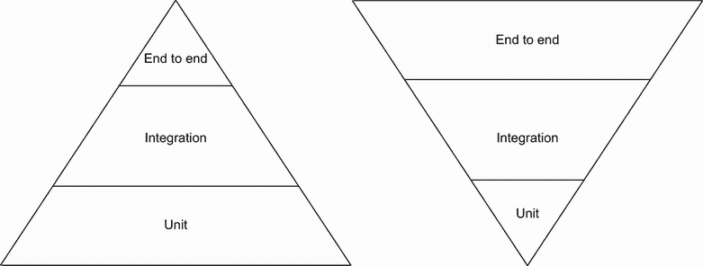
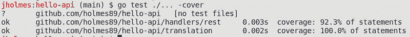
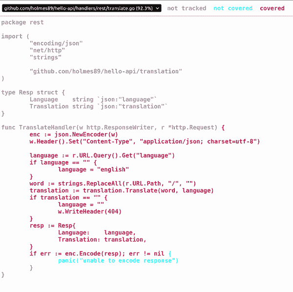

# 3 引入持续测试

本章涵盖

+   在编写代码的同时创建编写测试的过程

+   为代码部分建立测试边界

+   使用我们的管道中的测试创建一个质量门

+   使用代码覆盖率作为重构和测试的指南

QA 负责人走到你的办公桌旁，拿起你旁边的椅子。他们看起来有些沮丧，这是有道理的，因为 QA 团队一直在承受巨大的压力，要推出一个新版本。他们似乎总是被大量的错误、问题和误解的功能压得喘不过气来。开发和 QA 团队似乎总是在互相冲突，而不是一起解决问题。QA 团队感觉自己是质量项目的门户，而开发团队感觉 QA 阻碍了他们。开发者不断发布有错误的代码，并陷入了一种虐待狂式的 Whack-a-Mole 游戏，与错误作斗争。这种关系紧张到不健康。当你看到 QA 朝你的桌子走来时，你就知道这将不会是一次轻松的对话。

“看，我确信你知道我们现在处于周末发布即将到来时的水下状态。但我刚刚得到消息，你正在编写一个新项目来替换我们现有的翻译服务。我们已经对这个产品进行了多年的调试，到目前为止它已经稳定，所以我不确定我是否愿意替换它。然而，我们的项目经理坚持认为这是我们作为公司成长所必须做的事情。我知道你还在开发的早期阶段，但我希望有一种保证，这个产品能够工作，而且我的团队不需要花费数小时去寻找我们多年前遇到的相同错误。我们不应该浪费时间处理这些小错误。我们需要专注于我们的产品成为客户可能拥有的最佳产品。你明白吗？”

你点头并做了些笔记。没有人喜欢编写糟糕的软件。没有人愿意因为被指责为错误而感到良好。没有人愿意给其他人增加更多的工作。QA 代表质量保证，但这是一种误解。单个人或团队永远无法保证质量，所以让一个特殊的团队负责质量似乎有些可疑。质量应该是公司每个人的关注点，不同的团队应该以不同的方式测试产品，以确保它是您可以发布的最佳产品。你决定勾勒出这个计划，并向 QA 负责人解释你的计划。

“你提出的建议是将测试更靠近源代码，并使用它作为记录各种测试案例的方式，”QA 负责人评论道。“我知道我们在其他区域有一些单元测试，但它们似乎从未捕捉到我们需要的错误。我们的问题是这些测试似乎是在代码之后编写的，并且它们不符合我们的业务需求。它们也从未运行过，所以我们没有使用它们。如果这些测试在需要测试之前就能运行，那将很好。你认为你能做到这一点吗？”

当然，为什么不呢？你记下一些笔记，找到旧系统的 bug 和功能请求，然后开始工作。

## 3.1 要测试什么

从哪里开始？这是一个很好的问题，尤其是如果你对开发还不是很熟悉。编程书籍会向你展示语言，许多书籍甚至会展示现代测试框架或库，但它们不会向你展示如何编写测试。它们也不会向你展示要测试什么。确定要测试的内容以及如何测试它是一种随着时间的推移而发展的技能，并且你的团队应该为此设定标准。

例如，质量保证（QA）团队的负责人关心重复的 bug 和浪费的时间。开发者们也关心 bug，因为它们会浪费时间。QA 团队已经训练有素，能够考虑各种用例，而开发者们对系统的工作原理有更清晰的理解。当你被分配一个开发任务时，提前草拟一些用例和测试用例并不会有什么坏处。一旦这个列表被写出来，可以拿给其他人看看是否遗漏了什么。让我们看看以下列表中的代码。

列表 3.1 `Main.go`

```
package main

import (
    "encoding/json"
    "fmt"
    "log"
    "net/http"
)

func main() {

    addr := ":8080"

    mux := http.NewServeMux()

    mux.HandleFunc("/hello",
      func(w http.ResponseWriter, r *http.Request) {
        enc := json.NewEncoder(w)
        w.Header().
        Set("Content-Type",
        "application/json; charset=utf-8")
        resp := Resp{
            Language:    "English",
            Translation: "Hello",
        }
        if err := enc.Encode(resp); err != nil {
            panic("unable to encode response")
        }
    })

    log.Printf("listening on %s\n", addr)

    log.Fatal(http.ListenAndServe(addr, mux))
}

type Resp struct {
    Language    string `json:"language"`
    Translation string `json:"translation"`
}
```

我们的代码本应该做什么？将给定的单词翻译成另一种语言。我们的代码做到了吗？没有。记住，我们在上一章中只做了最小的工作来让我们的管道工作。现在我们将专注于业务或客户希望从我们的代码中获得什么。如果我们看看我们的当前实现，我们会注意到有三个部分：翻译服务、翻译处理程序和服务器。服务可能最不清晰，因为它是在`Resp`结构体中硬编码的值。但将来，这将是我们的产品的核心部分，而不会是硬编码的。处理程序将负责接收请求并将它们转换成可以传递给服务并返回结果的形式。然后服务器将运行处理程序，将整个系统串联起来。

开始测试的最好方式是将我们的工作分解成易于测试的单位。这些被称为*测试系统*（SUT）。SUT 有一个清晰的测试边界，你应该将其视为一个*黑盒*，这意味着你主要测试输入并断言输出是正确的。我们将我们的 SUTs 分为以下类别：服务、处理程序和服务器。

目前，我们的代码是一个巨大的主方法，这使得测试变得困难，所以让我们将其分解。首先，让我们处理包含所有业务逻辑的服务。记住，我们的服务是一个翻译服务，所以主要业务功能可以定义为接受一个单词和一个语言，并返回翻译后的单词。定义可能看起来像这样：

```
func Translate(word string, language string) string
```

让我们创建文件：

```
mkdir translation
touch translation/translator.go
```

很好；这给了我们一个起点。让我们创建一个名为`translation`的包。在其中，我们将创建一个名为`translator.go`的文件。打开`translator.go`，并添加以下列表中的代码。

列表 3.2 `translator.go`

```
package translation        ❶

func Translate(word string, language string) string {
    return ""              ❷
}
```

❶ 为翻译创建了一个新包。

❷ 定义测试的最小响应

现在我们已经建立了初始包，我们需要想出一个我们应该测试的想法。我们已经确定了编写测试所需的最少代码量。现在让我们花点时间思考一下我们需要测试什么。有时，遵循给定的“当...时，如果...，则...”格式可以成为编写测试的一个很好的入门。这个格式源于行为驱动开发，为我们提供了我们想要如何结构化测试的一般格式。例如，“给定一个单词，当它需要翻译成英语时，应该返回该单词。”

在这里，我们已经分解了业务需求。让我们再写一些来完善我们的单元测试列表：

+   当一个单词需要翻译成英语时，应该返回该单词。

+   当翻译时遇到大写单词或语言，应该返回与小写单词或语言相同的答案。

+   当翻译时遇到包含额外空格的单词或语言，应该返回与没有空格的单词或语言相同的答案。

+   当翻译时遇到不支持的语言或单词，应该返回一个空字符串。

这里你可以涉及你的测试人员或团队。将此列表发送给他们，以确保你没有遗漏任何内容，并且它符合业务需求。记住，这只是一个起点。你可能发现随着你编写更多的测试，这个列表会扩展。这个列表对于编写稳固和一致的测试至关重要，这些测试有助于增强对代码的信心。

## 3.2 编写单元测试

我们已经有了经过批准的测试列表；现在我们可以开始编写它们了。为此，我们将使用 Go 的内置测试库，并专注于编写尽可能少的代码来满足这些测试。让我们使用列表上的第一项来做这件事。打开你的测试文件，并添加以下列表中的代码。

列表 3.3 `translator_test.go`

```
package translation_test                                       ❶

import (
    "testing"
    "github.com/holmes89/hello-api/translation"
)

func TestTranslate(t *testing.T) {
    // Arrange                                                 ❷
    word := "hello"
    language := "english"

    // Act
    res := translation.Translate(word, language)               ❸

    // Assert
    if res != "hello" {                                        ❹
        t.Errorf(`expected "hello" but received "%s"`, res)    ❺
    }
}
```

❶ 使用单独的包提供黑盒测试

❷ 将所有要在测试中使用的变量添加到测试中，以便有更清晰的组织

❸ 调用要测试的函数并捕获结果

❹ 检查预期值

❺ 提供清晰的错误响应，以便更容易调试测试

这里是我们的第一个测试。你将注意到这个代码中的一些有趣之处。首先是“安排”、“行动”、“断言”模式，这是我们建立的。你注意到它们是如何从业务需求列表中的“给定”、“当”、“然后”句子中转换过来的吗？这是为了帮助我们关注我们正在测试的内容，并指向一个可测试项的列表。我们将在不久的将来将这个模式结合到测试中，以便我们覆盖的案例更加清晰。

你还会注意到使用*黑盒*测试方法。这指的是测试无法看到代码内部工作方式的代码包。这允许我们编写断言行为的测试，而不是实现。记住，应该测试系统在输入和输出上的表现，而不是其内部工作方式。这也要求你考虑一个合适的*接口*，或者你应用程序和代码的公开定义。你正在开发的单元是供他人使用的抽象。编写好的测试有助于推动良好的接口。拥有良好的接口很重要，因为一旦接口被公开，你将需要在将来支持它，而且它将变得难以更改。

通过输入 Go 测试命令`go test ./...`运行所有测试。你应该看到失败。现在我们需要修复它。同样，我们将尝试编写尽可能少的代码来满足这个测试。我们可以在代码中通过只返回`word`来处理这个问题，如下面的列表所示。

列表 3.4 `translator.go`

```
package translation

func Translate(word string, language string) string {
    return word       ❶
}
```

❶ 在修复测试中提供最小的努力

运行这个测试后，你会看到它通过了！这就是在*测试驱动开发*中被称为*红、绿、重构*的东西。首先，测试未能满足第一个预期，给你一个红色的错误；然后你修复测试，使其变为绿色；然后你添加到测试或更改底层代码以使其更简单，这就是重构。这限制了为给定功能所做的工作量。

测试驱动开发是一种许多开发者遵循的设计实践，由 Kent Beck 推广。在他的书《通过示例进行测试驱动开发》（Addison-Wesley Professional，2002 年）中，Beck 概述了一个编写失败测试、使其通过，然后通过从我们之前编写的测试列表中移除一项来使代码再次失败的模式。

为什么不一次性写完所有测试然后结束呢？这是一个很好的问题，我们应该在更广泛的背景下考虑。测试驱动开发是一种开发模式。它影响你做事的方式。通过遵循这个模式，你迫使开发者从需求的角度思考他们所写的代码。它通过迫使开发者首先考虑需求，证明需求得到满足，然后实际实现它们，将开发阶段移至次要操作。

以另一种方式思考，你可以将每个测试视为你希望进行的实验，以*证明*你的代码是否工作。在科学方法中，有三个主要步骤你需要完成：问题、测试和结果。通过你的测试代码，你可以根据预期的业务逻辑推测输入*x*的结果。测试将调用方法，结果将在你的代码中断言。

开发者 Ian Cooper 在提倡开发者成为“胶带程序员”时，用另一种方式表达了这一点。在定义了基本的测试和接口后，开发者应该继续前进并使其工作。然后他们可以使用测试来帮助他们完善实现，重新审视它，并确信它按预期工作。这种推动帮助开发者满足需求，而不需要过度设计解决方案。代码应该是动态的，而不是静态的，因此开发者应该定期回顾他们的代码，重构它以使其更好，并不断改进。

我们现在已经满足了这项测试。为了验证它，再次运行你的 `go test ./...` 命令，并查看是否通过。现在让我们添加更多语言。

## 3.3 重构，重构，重构

对于我们的演示，我们希望支持一些其他语言。让我们将德语和芬兰语添加到我们的需求中，同时，我们可以划掉我们的一个测试用例：

+   当一个单词要翻译成英语时，应返回该单词。

+   当翻译一个首字母大写的单词或语言时，应返回与未大写单词或语言相同的答案。

+   当翻译一个带有额外空格的单词或语言时，应返回与没有空格的单词或语言相同的答案。

+   当翻译一个不支持单词或语言时，应返回一个空字符串。

+   当翻译单词 *hello* 时，应翻译成德语和芬兰语的“hallo”和“hei”。

我们划掉了第一个项目，因为我们有一个满足的测试用例。这并不意味着这个测试永远不会失败。它最终会失败，但我们已经实施了一个测试来保护我们不会错过业务案例。

注意：如果你发现自己是在更改测试而不是更改实现，你应该考虑更改的业务影响。测试与业务需求相一致。

让我们添加一些语言支持。我们将更新我们的测试，包括以下列表中的代码。

列表 3.5 `translator_test.go`

```
package translate_test

import (
    "testing"
    "github.com/holmes89/hello-api/translation"
)

func TestTranslate(t *testing.T) {
    res := translation.Translate("hello", "english")            ❶
    if res != "hello" {
        t.Errorf(`expected "hello" but recieved "%s"`, res)
    }

    res = translation.Translate("hello", "german")              ❷
    if res != "hallo" {
        t.Errorf(`expected "hallo" but recieved "%s"`, res)
    }

    res = translation.Translate("hello", "finnish")             ❸
    if res != "hei" {
        t.Errorf(`expected "hei" but received "%s"`, res)
    }

    res = translation.Translate("hello", "dutch")               ❹
    if res != "" {
        t.Errorf(`expected "" but received "%s"`, res)
    }

}
```

❶ 测试翻译是否适用于英语

❷ 测试翻译是否适用于德语

❸ 测试翻译是否适用于芬兰语

❹ 测试荷兰语返回空字符串

运行它，并查看测试是否失败。

这意味着我们需要为我们的服务添加不同的功能。切换回我们的 `translator.go` 文件，并修改它，以便我们可以处理这些新的测试用例。同样，我们的测试正在帮助我们推动代码的功能。在这里我们看到我们支持德语和芬兰语的翻译，但不支持荷兰语，并且如果找不到翻译，我们返回一个空字符串。

在这种情况下，我们不仅测试了“正常路径”，还测试了负面路径。断言积极结果的行为很重要，但更常见的是，错误或边缘情况会发生。“边缘情况”是系统上可能发生而你又没有预料到的罕见或极端条件。一个例子是输入奇怪的字符作为输入或非常大或非常小的数字。在这里，我们可以说我们需要处理我们没有翻译的语言的情况。下面的列表概述了代码可能的样子。

列表 3.6 `translator.go`

```
package translation

func Translate(word string, language string) string {
    switch language {        ❶
    case "english":
        return "hello"
    case "finnish":
        return "hei"
    case "german":
        return "hallo"
    default:
        return ""            ❷
    }
}
```

❶ 检查传入的语言并返回翻译后的单词

❷ 如果未知，则返回空字符串

你现在应该能够看到你的测试通过了。这个周期可以持续很长时间。在某些情况下，你可以立即解决一些小问题。记住，你不应该在开发中跳得太远，以免过度设计。尝试预测一些不同的用例，正如我们将在下一节中看到的那样。现在，我们已经为这个函数的工作建立了一个模式。

你能在我们的代码中看到其他边缘情况吗？我们是否在我们的列表中捕捉到了它们？

测试也需要重构以帮助使事情更清晰且易于扩展。我相信熟悉编写软件的你们中的一些人在看到我们测试中的重复代码时可能会皱一下眉头。我们可以稍微改变我们的结构，使其更容易通过使用表格测试添加测试。下面的列表提供了一个示例，说明我们如何重构我们的测试以使其简洁。

列表 3.7 `translator_test.go`

```
package translation_test

import (
    "testing"
    "github.com/holmes89/hello-api/translation"
)

func TestTranslate(t *testing.T) {
    // Arrange
    tt := []struct {                                             ❶
        Word        string
        Language    string
        Translation string
    }{
        {                                                        ❷
            Word:        "hello",
            Language:    "english",
            Translation: "hello",
        },
        {
            Word:        "hello",
            Language:    "german",
            Translation: "hallo",
        },
        {
            Word:        "hello",
            Language:    "finnish",
            Translation: "hei",
        },
        {
            Word:        "hello",
            Language:    "dutch",
            Translation: "",
        },
    }

    for _, test := range tt {                                    ❸
        // Act
        res := translation.Translate(test.Word, test.Language)   ❹

        // Assert
        if res != test.Translation {                             ❺
            t.Errorf(
                `expected "%s" to be "%s" from "%s" but received "%s"`,
                test.Word, test.Language, test.Translation, res)
        }
    }
}
```

❶ 创建一个包含所有测试用例的匿名结构体数组

❷ 每个案例包含测试的输入和输出结果。

❸ 遍历测试用例集

❹ 运行测试并捕获结果

❺ 检查结果并以适当的错误响应

这种测试模式在 Go 和其他语言中很常见，因为它将所有的测试场景放在一个地方，并且再次推动我们测试代码的更清晰接口。

现在我们的断言区域非常小，不再重复，我们的测试以这种方式组织，我们可以快速添加更多结果。运行你的测试以确保重构有效。一切都应该通过。现在让我们添加一个我们可能没有预料到的案例。记住，我们的系统目前应该只处理“hello”。如果我们输入的不是“hello”这个词会发生什么？让我们看看当我们添加以下列表中的代码时会发生什么。

列表 3.8 `translator_test.go`

```
package translate_test

import (
    "testing"
    "translation"
    "github.com/holmes89/hello-api/translation"
)

func TestTranslate(t *testing.T) {
    tt := []struct{
        Word string
        Language string
        Translation string
    }{
...
        {                  ❶
            Word: "bye",
            Language: "dutch",
            Translation: "",
        },
    }
...
}
```

❶ 无法翻译的单词和不支持的语言的负面案例

运行你的测试。它通过了。这是你预期的吗？你覆盖了所有其他情况吗？记得我之前问过其他边缘情况吗？这就是你需要戴上用户帽而不是开发者帽，开始看到你的代码可能出错的地方。我们经常依赖其他团队成员来找出这些情况（通常在 QA 中），但如果测试已经到了那个阶段，那么你正在浪费宝贵的周期，并且可能正在发送带有错误的代码。

注意：质量检查越接近实现，重做的机会就越小，这转化为更高水平的工作进度，进而转化为损失的钱。

著名的计算机科学家艾伦·佩利斯曾经说过：“如果测试与设计交织在一起，而不是在设计之后使用，那么软件系统将得到最佳设计。”这总结了为什么我们现在专注于单元测试。单元测试可以集成到我们的开发过程中，以创建更精简和更明确的代码。相应的测试将帮助我们防止做出影响系统的业务级逻辑更改。这并不意味着测试越多越好。我们需要的是质量测试，它们断言功能，而不是经常失败的脆弱测试。

现在我们能够从用户的角度进行更多思考，我们可以专注于向我们的单元测试中添加更多边缘情况，以确保一切按预期工作。让我们再添加一个测试（见下面的代码列表）。

列表 3.9 `translator_test.go`

```
package translate_test

import (
    "testing"
    "translation"
    "github.com/holmes89/hello-api/translation"
)

func TestTranslate(t *testing.T) {
    // Arrange
    tt := []struct{
        Word string
        Language string
        Translation string
    }{
...
        {                    ❶
            Word: "bye",
            Language: "german",
            Translation: "",
        },
    }
...
}
```

❶ 支持语言中不可翻译单词的负面案例

再次运行你的测试。现在你应该看到失败！当我们寻找空字符串时，我们得到了“hallo”，因为我们只翻译了“hello”。我们如何解决这个问题？再次访问我们的服务，并在下面的列表中添加代码。

列表 3.10 `translator.go`

```
package translation

func Translate(word string, language string) string {
    if word != "hello" {         ❶
        return ""
    }

    switch language {
    case "english":
        return "hello"
    case "finnish":
        return "hei"
    case "german":
        return "hallo"
    default:
        return ""
    }
}
```

❶ 添加对支持单词的检查

再次运行你的测试；现在它通过了！在这个时候，我们可能需要考虑一个最后的案例。开发者往往会忘记关于输入清理，或者使输入统一的过程。这可以包括空白字符的使用，到负数，无效参数，以及大写或小写字母，仅举几例。如果我们添加大写字母，我们的服务现在将有多强大？让我们通过在下面的列表中添加代码来找出答案。

列表 3.11 `translator_test.go`

```
package translate_test

import (
    "testing"
    "github.com/holmes89/hello-api/translation"
)

func TestTranslate(t *testing.T) {
    // Arrange
    tt := []struct{
        Word string
        Language string
        Translation string
    }{
...
        {
            Word: "hello",
            Language: "German",      ❶
            Translation: "hallo",
        },
        {
            Word: "Hello",           ❷
            Language: "german",
            Translation: "hallo",
        },
        {
            Word: "hello ",          ❸
            Language: "german",
            Translation: "hallo",
        },
    }
...
}
```

❶ 大写语言边缘情况

❷ 大写单词的边缘情况

❸ 单词中空格的边缘情况

我知道我说了一个最后的案例，但这里有三个不同的测试案例！你能猜出需要进行的修复是什么吗？

通常，服务的职责是实现“输入清理”以确保服务足够耐用和灵活，能够处理大多数传入的消息。这通常是一种许多 QA 成员在你创建服务或网页时就会尝试进行的 favorite 验证技术，并且应该在各个级别上处理，以防万一。在这种情况下，我们可以添加一个方法来清理语言和单词的输入，使用以下列表中的代码。

列表 3.12 `translator.go`

```
package translation

import "strings"

func Translate(word string, language string) string {
    word = sanitizeInput(word)                          ❶
    language = sanitizeInput(language)                  ❷

    if word != "hello" {
        return ""
    }

    switch language {
    case "english":
        return "hello"
    case "finnish":
        return "hei"
    case "german":
        return "hallo"
    default:
        return ""
    }

}

func sanitizeInput(w string) string {                   ❸
    w = strings.ToLower(w)
    return strings.TrimSpace(w)
}
```

❶ 清理传入的单词

❷ 清理传入的语言

❸ 创建一个清理输入的函数

测试现在应该通过，但这只是冰山一角。我们仍然有很多额外的测试要做。我们只处理了服务层，它仍然相当脆弱。现在我们需要检查值最初是如何到达服务的，这是通过我们的处理程序。

## 3.4 测试金字塔

之前我们确定了三个需要测试的系统部分：服务、处理程序和服务器。每个部分都可以用不同的方式进行测试。广义上，这些测试分为两大类：

+   *单元级测试*—小型、独立的测试，在隔离状态下运行代码的部分。这些测试可以看作是测试正在建造桥梁的个别板和螺丝。如果一个已经腐烂或生锈，你不想使用它。在隔离状态下，这些测试变得更容易编写和管理，并且是任何自动化测试平台的基础。

+   *系统级测试*—需要各种代码段或系统之间的交互。这个类别包括大量测试类型和实践，管理起来变得复杂，因此变得不太可靠或更昂贵（在时间和资源上）。

图 3.1 展示了这种差异。



图 3.1 将测试分解为单个单元，这些单元在隔离状态下进行测试，以及系统，这些系统测试在集成环境中的工作方式。

单元测试是运行最快的测试，应该包括我们系统中的所有构建块（或单元）。在图 3.2 中，我们可以看到测试被看作是一个金字塔，其中单元测试构成了基础，因为测试的数量。如果单元测试没有通过，我们就不应该向上移动到测试金字塔的更广泛的测试。这可以节省我们的时间，因为单元测试应该运行得快，易于理解，并且易于调试。当我们向上移动金字塔时，我们看到 *集成* 测试，这些测试验证了工作单元之间的功能，通常包括与外部依赖项（如数据库）的集成。最后，你有一个测试层，它验证整个系统或从端到端测试它，以查看系统是否完全按预期工作。还有其他类型的端到端测试可用，例如 *负载测试*，它测试系统在大量用户下的功能。图 3.2 中的倒金字塔是一个不稳定的模式，而常规金字塔则能够自我支撑。



图 3.2 端到端测试在顶部较小，因为它们更昂贵且不可靠。它们应该由更大的集成和单元测试套件支持。每一层都应该独立运行。从单元测试开始，然后在不同阶段向上移动金字塔。

在左边的金字塔上向上移动，每一层都变得更小。这是因为当我们向上移动时，运行这些测试的能力变得更加昂贵，因为它们可能需要依赖项或更多资源。它们在运行方式上也可能不一致，因此结果可能不是**确定性的**，或不可预测的。如果我们把金字塔翻转成右边的“冰淇淋锥”，我们可以想象我们会处于一个怎样的世界。端到端测试不断变化，因为我们的应用程序的性质不断演变。如果我们花太多时间扩展这一级别的测试，我们将会有大量的返工，而无法验证底层模块是否正常工作。如果发生故障，你需要解开系统的所有内部工作来验证结果，而如果你有一个广泛的单元测试套件，你可以在模块级别验证错误或更改。

你将找到根据你团队的需求需要扩展或缩减以进行测试的地方。我们已经在服务级别建立了单元测试，建立了基础。现在我们希望将其扩展到包括一些其他自动化测试，以确保我们的系统按预期工作。

## 3.5 系统测试

现在我们已经为翻译建立了一个独立的服务，我们可以使用 REST 处理程序来调用这个服务。在 Go 和许多编程语言或框架中，HTTP 协议的实现与输出无关：HTML、纯文本、GraphQL 语法，几乎任何可以返回的内容。我们试图根据它们发送的响应类型来组织我们的处理程序文件。在这种情况下，我们发送 REST API 响应。

REST 代表**表示性状态转移**，这是一个通用的 API 编写风格的名称。尽管大多数人会将其与 JSON（JavaScript 对象表示法）联系起来，但它也可以与文件或 XML 格式一起使用。该设计使用基本的 HTTP 调用（POST、PUT、DELETE 等）以及使用 HTTP 头向用户发送信息以帮助解码信息，具有极高的灵活性。目前，我们将使用 JSON 作为我们的格式。

要做到这一点，我们创建一个新的包，名为`handlers/rest`。在其中，我们将创建一个名为`translate.go`的文件：

```
mkdir -p handlers/rest
touch handlers/rest/translate.go
touch handlers/rest/translate_test.go
```

目前，我们知道我们的服务只处理单个单词，“hello”，所以我们只支持那个请求；否则，我们将返回“未找到”，或 404 错误。默认情况下，翻译将是英语，除非用户传递`?language=`参数。让我们使用以下列表中的代码来构建一个空的处理程序以开始测试。

列表 3.13 `translator.go`

```
package rest                             ❶

import (
    "encoding/json"
    "net/http"
)

type Resp struct {                       ❷
    Language    string `json:"language"`
    Translation string `json:"translation"`
}

func TranslateHandler(w http.ResponseWriter, r *http.Request) {
    enc := json.NewEncoder(w)
    w.Header().Set("Content-Type", "application/json; charset=utf-8")
    resp := Resp{                        ❸
        Language:    "English",
        Translation: "Hello",
    }
    if err := enc.Encode(resp); err != nil {
        panic("unable to encode response")
    }
}
```

❶ 新的 API 工作休息包

❷ 构建一个结构体来存放响应结构

❸ 初始工作的硬编码响应

我相信你已经意识到这是来自我们的`main`函数的内容。然而，我们将很快用实际的业务逻辑来替换它。这个过程允许我们边迭代边测试。我们还把处理器从主函数中提取出来，以便它可以很容易地进行测试。像我们的单元测试一样，我们只想测试代码的一个部分，但与我们的单元测试不同，我们依赖于同一系统的外部部分进行测试。`translate`库的更改会影响这个测试，所以它不被视为单元测试，而是系统测试。在未来的章节中，我们将重构它以独立工作，但现在，我们将让它直接与服务集成（见以下列表）。

列表 3.14 `translator_test.go`

```
package rest_test                                             ❶

import (
    "encoding/json"
    "net/http"
    "net/http/httptest"
    "testing"

    "github.com/holmes89/hello-api/handlers/rest"             ❷
)

func TestTranslateAPI(t *testing.T) {

    // Arrange
    rr := httptest.NewRecorder()                              ❸
    req, _ := http.NewRequest("GET", "/hello", nil)           ❹

    handler := http.HandlerFunc(rest.TranslateHandler)        ❺

    // Act
    handler.ServeHTTP(rr, req)                                ❻

    // Assert
    if rr.Code != http.StatusOK {                             ❼
        t.Errorf(`expected status 200 but received %d`, rr.Code)
    }

    var resp rest.Resp
    json.Unmarshal(rr.Body.Bytes(), &resp)                    ❽

    if resp.Language != "english" {
        t.Errorf(`expected language "english" but received %s`,
            resp.Language)
    }

    if resp.Translation != "hello" {
        t.Errorf(`expected Translation "hello" but received %s`,
            resp.Translation)
    }
}
```

❶ 创建一个新的测试包以使用黑盒测试

❷ 导入 rest 包进行测试

❸ 创建一个用于断言的 HTTP 记录器

❹ 创建一个针对给定端点的新请求，没有正文内容

❺ 注册一个用于测试的处理程序

❻ 将内容传递给处理器以根据请求生成响应

❼ 检查响应的状态码

❽ 将响应体解码为要断言的结构

运行测试，你应该得到一个失败！这是因为我们没有使用服务来将消息转换为小写。让我们将我们的处理器更改为现在使用服务而不是我们编写的硬编码值。我们会发现处理器和服务的测试将是“紧密耦合”的，这意味着一个的变化会影响另一个，并且测试序列将看起来很相似。但请记住，我们在这里测试的不是服务的逻辑，而是请求和响应处理和转换。

你也会注意到，我们不仅断言响应消息的正文，还断言状态码。HTTP 状态码通过告诉用户系统层面发生了什么来帮助传达额外的信息。200 OK 是最常见的，告诉我们一切正常。表 3.1 列出了用于发送消息的常见代码。

表 3.1 常见 API 使用的 HTTP 消息

| Code | 消息 | 常见用途 |
| --- | --- | --- |
| 200 | OK | 一切如预期进行。 |
| 201 | 已创建 | 新实体已添加到系统中。 |
| 401 | 未授权 | 缺少凭证。 |
| 403 | 禁止 | 不允许访问端点或资源。 |
| 404 | 未找到 | 无法找到资源或端点。 |
| 500 | 内部服务器错误 | 系统因某些未知原因失败。 |
| 503 | 服务不可用 | 系统不工作且已知。 |

通常，这些代码被分为几个更广泛的类别，如表 3.2 所示。

表 3.2 HTTP 消息的一般分组

| Code | 类型 | 常见用途 |
| --- | --- | --- |
| 1xx | 信息性 | 系统信息。 |
| 2xx | 成功 | 一切如预期进行。 |
| 3xx | 重定向 | 有所移动，需要更改请求。 |
| 4xx | 客户端错误 | 客户端有错误。 |
| 5xx | 服务器错误 | 服务器未能处理请求。 |

我们响应代码应该反映我们返回的消息类型。我们响应体中的适当消息应提供必要的信息。我们通过在以下列表中添加代码来完成此操作。

列表 3.15 `translator.go`

```
const defaultLanguage = "english"

func TranslateHandler(w http.ResponseWriter, r *http.Request) {
    enc := json.NewEncoder(w)
    w.Header().Set("Content-Type", "application/json; charset=utf-8")   ❶

    language := defaultLanguage                                         ❷
    word := strings.ReplaceAll(r.URL.Path, "/", "")                     ❸
    translation := translation.Translate(language, word)                ❹
    resp := Resp{
        Language:    language,
        Translation: translation,
    }
    if err := enc.Encode(resp); err != nil {
        panic("unable to encode response")
    }
}
```

❶ 设置内容类型的头部为 JSON 规范

❷ 目前默认语言为英语

❸ 从 URL 路径中获取单词

❹ 翻译单词

我们现在将添加一些额外的功能。但就像之前一样，让我们重新结构化这些测试以成为表格测试，这样我们可以快速重构我们正在编写的代码。我们将使用以下列表中的代码来重写它。

列表 3.16 `translator_test.go`

```
func TestTranslateAPI(t *testing.T) {
    tt := []struct {                                           ❶
        Endpoint            string
        StatusCode          int
        ExpectedLanguage    string
        ExpectedTranslation string
    }{
        {
            Endpoint:            "/hello",
            StatusCode:          http.StatusOK,
            ExpectedLanguage:    "english",
            ExpectedTranslation: "hello",
        },
        {
            Endpoint:            "/hello?language=german",
            StatusCode:          http.StatusOK,
            ExpectedLanguage:    "german",
            ExpectedTranslation: "hallo",
        },
    }

    handler := http.HandlerFunc(rest.TranslateHandler)         ❷

    for _, test := range tt {                                  ❸
        rr := httptest.NewRecorder()
        req, _ := http.NewRequest("GET", test.Endpoint, nil)

        handler.ServeHTTP(rr, req)

        if rr.Code != test.StatusCode {
            t.Errorf(`expected status %d but received %d`,
                test.StatusCode, rr.Code)
        }

        var resp rest.Resp
        json.Unmarshal(rr.Body.Bytes(), &resp)

        if resp.Language != test.ExpectedLanguage {
            t.Errorf(`expected language "%s" but received %s`,
                test.ExpectedLanguage, resp.Language)
        }

        if resp.Translation != test.ExpectedTranslation {
            t.Errorf(`expected Translation "%s" but received %s`,
                test.ExpectedTranslation, resp.Translation)
        }
    }
}
```

❶ 定义测试案例为一个端点、状态、翻译和语言

❷ 注册处理程序

❸ 遍历所有测试场景

运行你的测试，你会看到一个新的失败。让我们修复测试（见以下代码列表）。

列表 3.17 `translator.go`

```
func TranslateHandler(w http.ResponseWriter, r *http.Request) {
    enc := json.NewEncoder(w)
    w.Header().Set("Content-Type", "application/json; charset=utf-8")

    language := r.URL.Query().Get("language")      ❶
    if language == "" {
        language = defaultLanguage
    }
    word := strings.ReplaceAll(r.URL.Path, "/", "")
    translation := translation.Translate(word, language)
    resp := Resp{
        Language:    language,
        Translation: translation,
    }
    if err := enc.Encode(resp); err != nil {
        panic("unable to encode response")
    }
}
```

❶ 从查询参数中检索语言

运行你的测试，并添加一个额外的案例，如果翻译缺失，响应应该是没有值的`404 Not Found`。让我们添加它（见以下列表）。

列表 3.18 `translator_test.go`

```
func TestTranslateAPI(t *testing.T) {
    tt := []struct{
        Endpoint string
        StatusCode int
        ExpectedLanguage string
        ExpectedTranslation string
    }{
        {
            Endpoint: "/hello",
            StatusCode: 200,
            ExpectedLanguage: "english",
            ExpectedTranslation: "hello",
        },
        {
            Endpoint: "/hello?language=german",
            StatusCode: 200,
            ExpectedLanguage: "german",
            ExpectedTranslation: "hallo",
        },
        {
            Endpoint: "/hello?language=dutch",     ❶
            StatusCode: http.StatusNotFound,
            ExpectedLanguage: "",
            ExpectedTranslation: "",
        },
    }
    ...
}
```

❶ 在缺少语言或翻译的情况下，我们应该得到 404 错误代码。

查看失败，并修复代码（见以下列表）。

列表 3.19 `translator.go`

```
func TranslateHandler(w http.ResponseWriter, r *http.Request) {
    enc := json.NewEncoder(w)
    w.Header().Set("Content-Type", "application/json; charset=utf-8")

    language := r.URL.Query().Get("language")
    if language == "" {
        language = "english"
    }
    word := strings.ReplaceAll(r.URL.Path, "/", "")
    translation := translation.Translate(word, language)
    if translation == "" {
        language = ""
        w.WriteHeader(http.StatusNotFound)
        return
    }
    resp := Resp{
        Language:    language,
        Translation: translation,
    }
    if err := enc.Encode(resp); err != nil {
        panic("unable to encode response")
    }
}
```

我们应该会成功！

## 3.6 将其添加到管道中

现在我们已经重构了我们的服务，我们应该更新我们的函数并将测试添加到管道中。首先，让我们更新我们的`main.go`文件以使用我们新的处理程序和服务（见以下列表）。

列表 3.20 `main.go`

```
package main

import (
    "log"
    "net/http"
)

func main() {

    addr := ":8080"                                    ❶

    mux := http.NewServeMux()

    mux.HandleFunc("/hello", rest.TranslateHandler)    ❷

    log.Printf("listening on %s\n", addr)              ❸

    log.Fatal(http.ListenAndServe(addr, mux))          ❹
}
```

❶ 设置要监听的端口

❷ 注册翻译处理程序

❸ 记录监听端口

❹ 运行服务器并记录如果它失败

啊，看起来整洁多了！我们已经成功地将应用程序的大部分内容拆分成更小的部分，这些部分可以单独进行测试，这使得系统更容易推理。我们花费了所有这些时间编写这些测试，以便在检查代码时可以使用它们来帮助验证功能。一旦我们将这些添加到我们的管道中，它将就像构建步骤一样，它保护我们不会推送有缺陷的更改，而测试成为我们系统中的第一个“关卡”。

*质量关卡*是工业工程中的一个术语，其中在组装线各个阶段之前检查产品的质量。你希望保护每个阶段不浪费时间。在我们的小程序中，构建步骤运行得相当快，但在更大、更复杂的系统中，构建时间可能会更长，所以我们想确保我们不会浪费时间尝试构建有缺陷的东西或发送不按预期工作的代码。

假设你正在计划做一顿饭。你混合了一堆原料按照食谱进行，然后意识到主要原料已经变质。现在你可能需要快速去商店或者丢弃整个东西，浪费时间和金钱。但如果你提前检查了所有原料的质量，你就可以避免一些麻烦。

我们将构建我们的管道以执行相同的操作。通过在构建步骤之前添加测试步骤，我们可以确保在构建之前代码正在运行。大多数 CI 系统允许你在各个步骤之间创建依赖图，以便将这些步骤链接起来，从而在整个系统上节省时间和精力。我们将在未来扩展这一功能，以添加可以并行运行的额外保护、构建和部署。

现在，让我们将测试检查添加到以下列表中的代码管道中。

列表 3.21 `pipeline.yml`

```
name: CI Checks

on:
  push:
    branches:                                               ❶
      - main
jobs:
  test:
    name: Test Application
    runs-on: ubuntu-latest                                  ❷
    steps:
    - name: Set up Go 1.x                                   ❸
      uses: actions/setup-go@v2
      with:
        go-version: ¹.18
    - name: Check out code into the Go module directory     ❹
      uses: actions/checkout@v2
    - name: Downloads
      run: go get -t ./...
    - name: Run Test
      run: go test ./...                                    ❺
  build:
    name: Build  App
    runs-on: ubuntu-latest
    needs: test                                             ❻
    steps:

    - name: Set up Go 1.x
      uses: actions/setup-go@v2
      with:
        go-version: ¹.18

 ...
```

❶ 仅在主分支上运行

❷ 定义基本操作系统

❸ 设置 Go 环境

❹ 检出代码

❺ 运行测试

❻ 在进行构建步骤之前等待测试通过

提交你的更改，并推送你的分支！前往你的仓库，并观察测试运行。现在你可以看到结果。

## 3.7 代码覆盖率

编写测试以查看代码是否工作是有帮助的。我们在进行过程中添加了几个测试来检查系统的各个部分，并添加了功能。但我们是否都做到了？我们需要测试*所有*内容吗？

许多语言，包括 Go，提供了查看测试“代码覆盖率”的能力，这意味着它们会突出显示已测试代码的百分比，并突出显示可能被遗漏的区域。随着代码的增长，你将会有需要测试的逻辑分支或可能发生的额外错误条件，确保你可以扩展测试以覆盖所有需要测试的区域总是很有帮助。让我们看看我们已经测试了多少：

```
go test ./... -cover
```

图 3.3 显示了覆盖率。



图 3.3 显示了覆盖率。

你应该会看到一个图表，显示所有已测试的文件和覆盖率数量，以及底部的总数。百分比告诉我们我们没有覆盖所有代码，也许我们应该考虑添加更多测试。你可能想知道需要多少覆盖率。随着时间的推移，你的代码覆盖率应该会随着更多测试的添加而增加。这确保了你在随着时间的推移改进你的系统。这可能意味着在缺乏测试的区域编写更多测试，甚至删除未使用的代码。

代码覆盖率在某些开发团队中可能是一个热门话题。有些人说你需要覆盖每一行代码，测试代码片段可以执行的每一种可能的方式，以确保最高的质量。虽然这是一个值得追求的目标，但这并不意味着你的代码按预期工作。试图达到总代码覆盖率可能导致编写糟糕的测试，这些测试随着时间的推移难以维护。通常，像这样的任意目标，虽然初衷良好，但可能导致阻碍公司整体目标：交付产品。

我们想要强制执行一定水平的测试，比如 80%，我们还希望为我们的开发者提供一个简单的方法来查看是否有任何分支或区域他们遗漏了，他们可以轻松添加测试。我们将添加一些工具到我们的 Makefile 中，以使这更容易。

Go 有一个内置的工具，允许你输出覆盖率配置文件，然后使用帮助你操作它的工具，这样你就可以看到覆盖率并生成报告。首先，让我们打开我们的 Makefile，并添加以下列表中的代码。

列表 3.22 Makefile

```
test:
    go test ./... -coverprofile=coverage.out              ❶

coverage:
    go tool cover -func coverage.out | grep "total:" | \
    awk '{print ((int($$3) > 80) != 1) }'                 ❷
```

❶ 从测试生成输出覆盖率

❷ 使用代码覆盖率工具查找总行数并检查该值以确保满足覆盖率预期

此脚本将确保创建覆盖率配置文件，而不仅仅是运行`go test`。记住，我们希望为我们的开发者提供与管道相同的工具，以帮助保持两者同步。第二行提供了一些“Unix 魔法”，它将覆盖率工具的结果通过管道传递到`grep`命令中，以查找总数，然后检查结果以确保它高于我们的最低测试阈值。如果条件不满足，此结果将返回一个错误代码，这意味着我们的管道将失败。

现在我们可以使用这个相同的覆盖率配置文件来生成一个覆盖率报告，我们将将其作为工件添加到我们的管道中。这将有助于指导我们当前的测试工作，并查看我们哪些地方做得不够。这也可以帮助团队领导决定是否应该进行一个测试日，让开发者花一天时间清理代码并添加测试。我们将在后面的章节中讨论更多类似的活动，但你现在应该明白，沟通是构建成功团队的关键。随着时间的推移，来自管道的报告在帮助引导整体开发者体验和产品开发方面非常出色。

注意：沟通是构建成功团队的关键。

要生成报告，我们将在 Makefile 中添加另一个工具：

```
report:
    go tool cover -html=coverage.out -o cover.xhtml
```

在图 3.4 的报告中的报告中，你会看到你已经测试过的行和遗漏的行。你看到我们可能测试过的区域了吗？我们能重构我们的代码，使其更容易到达这些遗漏的部分吗？试着做一下，看看你是否能提高到一个更高的水平，并计时看看这需要多长时间，以及这是否有助于解决可能的错误。



图 3.4 如果测试代码覆盖了该代码，则行以绿色突出显示，而红色行则未覆盖。如果您无法区分颜色，请注意，错误部分是代码中唯一未测试的区域。

这些输出文件应存储在本地，并且不应提交到我们的源代码控制中。打开您的`.gitignore`文件，并添加以下内容：

```
coverage.out
cover.xhtml
```

现在我们可以更新我们的 CI 代码来运行覆盖率检查并上传报告。您的团队可以执行一些额外的后处理步骤，以便将这些结果发布到团队仪表板或 Slack 帖子，以便其他人可以轻松查看，但就目前而言，我们将允许它和二进制文件一起下载（见以下列表）。

列表 3.23 `pipeline.yml`

```
name: CI Checks

on:
  push:
    branches:
      - main
jobs:
  test:
    name: Test Application
    runs-on: ubuntu-latest
    steps:
    - name: Set up Go 1.x
      uses: actions/setup-go@v2
      with:
        go-version: ¹.18
    - name: Check out code into the Go module directory
      uses: actions/checkout@v2
    - name: Run Test
      run: make test                 ❶
    - name: Coverage Check
      run: make coverage             ❷
    - name: Generate Report
      run: make report               ❸
    - name: Copy Files
      run: |
           mkdir  reports
           cp cover.xhtml reports/.

    - name: Archive                  ❹
      uses: actions/upload-artifact@v2
      with:
          name: reports
          path: reports
```

❶ 使用测试 make 命令

❷ 检查测试覆盖率

❸ 根据覆盖率生成报告

❹ 将报告上传到存档

我们现在已成功在我们的系统中添加了第一个检查。对于一些人来说，测试可能一开始会显得繁琐，而其他人可能需要被说服其好处，但这是一个确保您以高质量代码前进的简单方法。在未来，您会发现一个可以帮您避免犯错的测试。即使在编写这本书的过程中，我也发现我所编写的测试修复了我示例代码中的错误。停下来思考并解决手头的问题可以帮助您成为一名更好的开发者。

测试对于某些开发团队来说是一个非常敏感的领域。一些成员可能比其他人对此有更高的热情。因此，您和您的团队建立您希望实现的测试模式和最佳实践，并在可能的情况下进行标准化是很重要的。测试不应成为教条，也不应阻碍您产品的开发。它是向您的公司和客户表明您正在满足他们期望的工具。

您抬头看到人们正在离开办公室。这是一天结束的时候，您已经提交并推送了您的代码。当您导航到仓库时，您会看到一个漂亮的绿色勾选标记，您笑了。在一天之内，您已经编写了一个带有测试的概念证明。明天您需要找到一种方法在中午的演示之前将其上线。幸运的是，您已经有了计划。

## 摘要

+   自动化测试有助于验证系统按预期工作。

+   单元测试是小型、独立运行的测试，专注于代码的一小部分。

+   系统测试集成到多个模块中，这些模块断言系统的整体行为。

+   专注于测试代码的接口，而不是代码本身。

+   力求高覆盖率，但低于 100%也是可以的。
