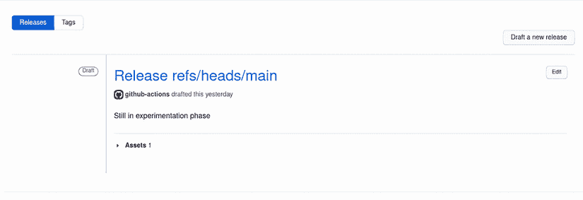
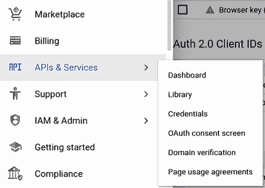
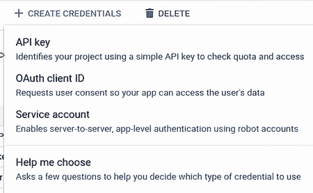
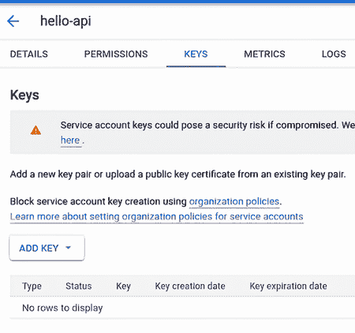
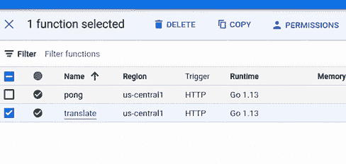
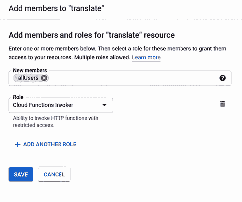

# 4 引入持续部署

本章涵盖

+   区分交付和部署

+   将应用程序交付到工件存储库

+   将应用程序部署到托管服务

+   使用健康检查来验证应用程序正在运行

你很早就开始工作。在你把东西放在桌子上后，你走到咖啡机那里。当你到达那里时，你看到一群运维人员正在交谈。你可能会说这是巧合，但事实并非如此。你知道运维团队很早就到岗，而且这是和他们交谈的最佳时机。

问候他们后，你随意提到了你一直在做的演示。有人叹了口气：“我实在看不出他们怎么能期望我们一直这样做。我们根本就没有资源来持续资助和运行这些小项目。我们有一堆工作要做：新项目、部署、系统升级和性能调整。更不用说，我们经常因为紧急情况而被抽调。我并不是在责怪你，但有时候这确实是一场噩梦。”

有时候这确实是一场噩梦。你还记得几个月前完成了一个功能，然后等待它被部署。计划发布花了超过一周的时间，部署失败是因为别人的配置更改破坏了系统。发生的事情是一整天的事件，人们都在检查所有的更改，试图找出什么出了问题。从创建代码到部署之间的差距太大，导致了太多问题。

“我希望开发者能更多地拥有部署的部分。我们设置了流程和批准了服务，他们自己负责部署。在他们专注于部署和周围的问题时，我们会帮助他们更新和维护机器。如果我们能使用一些不需要我们维护服务器的新的服务，那就太理想了。但说实话，我不知道这个模式会是什么样子，也不知道是否有人会接受它。从长远来看，这将节省我们的时间和金钱。”

这正是你希望有人会说的。赋予开发者权力。在没有服务器开销的情况下运行服务。快速迭代并经常交付。你提到你可以将其作为你的演示的一部分。

“真的吗？”运维人员说，“你会在你的项目中加入这个范围为我们做？那太好了，我很乐意听听你发现的情况以及我们可能有的选择。”

将此视为许可，你倒好咖啡，回到你的桌子旁。

## 4.1 交付

你首先意识到的是，你最终希望把这件事交给其他人。昨天是 QA 团队感兴趣，明天可能是整个开发团队。你需要把编译好的产品发布出去，让其他人容易消费。你需要交付。

注意：有关使用 Jenkins、GitLab 和 CircleCI 等工具的管道工具列表，请参阅第二章。

要做到这一点，我们可以将二进制文件附加到我们的管道中，就像我们在上一章中处理代码覆盖率报告时做的那样。让我们打开我们的`pipeline.yml`文件，并添加以下列表中的代码。

列表 4.1 `pipeline.yml`

```
name: CI Checks

on:
  push:
    branches:
      - main

jobs:
    test:
        ....
    deliver:                                                       ❶
        name: Release
        needs: build
        runs-on: ubuntu-latest
        steps:
        - name: Checkout code
            uses: actions/checkout@v2
        - name: Download binary                                    ❷
            uses: actions/download-artifact@v2
            with:
                name: api
        - name: Create Release
            id: create_release
            uses: actions/create-release@v1
            env:
                GITHUB_TOKEN: ${{ secrets.GITHUB_TOKEN }}          ❸
            with:
                tag_name: ${{ github.ref }}                        ❹
            release_name: Release ${{ github.ref }}                ❺
            body: |
                Still in experimentation phase
            draft: true                                            ❻
            prerelease: true                                       ❼
        - name: Upload Release Binary
            uses: actions/upload-release-asset@v1
            env:
                GITHUB_TOKEN:
                  ${{ secrets.GITHUB_TOKEN }}
            with:
                upload_url:
                  ${{ steps.create_release.outputs.upload_url }}   ❽
            asset_path: api
            asset_name: api
            asset_content_type: application/octet-stream           ❾
```

❶ 在我们的管道中创建一个新的步骤，称为交付

❷ 从我们的构建步骤下载二进制文件

❸ GitHub Actions 提供了一个内部令牌用于授权更新你的仓库。

❹ 使用触发构建的更改引用标记发布。现在它只是切换到稍后用于其他部署触发的主分支。这是一个从 GitHub Action 环境传递给我们的属性。

❺ 使用与上一步相同的机制命名发布

❻ 这不是一个最终发布版本，因此我们将其标记为草稿，以便客户无法查看。

❼ 类似地，我们还没有完成，所以我们将这个标记为预发布。

❽ 将二进制文件上传到之前步骤中创建的发布 URL

❾ 内容类型是二进制，因此我们需要将其定义为八位字节流，以便 GitHub 能够识别。

我们现在可以将我们的更改推送到我们的管道并观察其运行。一旦完成，你应该能在你的仓库的“发布”标签页上看到一个新的发布版本，如图 4.1 所示。



图 4.1 该页面包含我们现在需要的所有信息，以及一个可下载的二进制文件。

这就是了！你正在立即交付产品，但这并不是我们管道的终点。我们之所以只关注发布我们的产品，是因为它是*交付*的最简单形式——为某人提供一个可用的产品，但这并不一定意味着部署，即让产品运行。*部署*是在一个过程中运行的最终步骤，在这个过程中，你将你的产品作为服务运行和使用。并非所有产品都需要部署，但所有产品都应该交付。库是一个常见的未部署但已交付的产品。根据其运行位置，部署也可能变得复杂（正如我们将看到的）。构建和运行新的服务器或软件升级也是部署的额外形式。在本章中，我们将探讨这两种形式。

要知道一个产品在市场上是否可行，唯一的方法是将它推向市场。一旦人们开始使用你的产品，你将收到关于他们想要什么、喜欢什么以及不喜欢什么的反馈。这种反馈推动了你产品的开发。到目前为止，我们已经编写了所谓的*最小可行产品*，或 MVP。尽管我们的例子很简单，但你应该能够看出你最初写下的东西不需要完美。事实上，它永远不会完美。许多公司因为不够快地将自己推向市场，而等待太长时间才收到关于他们正在构建的产品的反馈。

反馈可以来自有远见的人、一组试点用户、投资者或公众。推出你的产品不是你需要担心唯一的事情。你还必须关注你能够多快推出你的产品。这正是我们一直在努力的方向。我们的流程将帮助我们转换代码成为产品并发布。正是这一最后一步我们还需要完成，但一旦我们完成了，我们就可以开始迭代我们的流程，以制造更好的产品。

在本书的这个阶段就发布内容可能看起来有些奇怪，但这正是我们试图做的事情的本质。就像我们的产品一样，我们的流程永远不会完美。你和你的团队需要像对待产品一样修订和增强你的流程。制造商不仅经历了一个创建和增强他们制造的产品的过程，而且还提高了他们生产这些产品的效率。

## 4.2 开发者作为操作者

对于一些人来说，这个过程可能看起来很奇怪。我为什么要在有整个运营团队来处理的情况下进行部署？这是一个好问题。许多公司会组织他们的团队专注于他们擅长的特定领域。虽然这允许个人专注于成为特定领域的专家，但它往往在团队之间设置障碍。这可能导致团队之间产生矛盾，阻碍积极的协作。协作破裂，因为指责游戏变得更容易，而不是花时间去理解问题和共同努力寻找解决方案。

以以下场景为例：一个测试人员发现报告上日期错误的一个 bug，并向分配给开发者的工单提交了问题。开发者查看 bug 后写道，“在我的机器上这没问题；服务器可能没有配置正确的时间区域”并附上了一张截图。然后工单被踢给了运营团队，他们只是重新分配了工单并评论道，“服务器已正确配置；不会完成。”工单就这样在那里待了数周，而每个人都认为这不是他们的问题。

受害者是谁？质量保证？开发者？运营？错误。是客户。

当我们不作为一个团队工作时，我们不理解彼此的角色。当我们不理解彼此的角色时，我们不会考虑可以帮助他们和最终客户的解决方案。

在 NASA 太空计划初期，人们意识到任务控制中心在故障排除和理解他们开发和使用的科技方面遇到了问题。对每个人来说这都是全新的，因为那时没有人进入过太空。Gene Kranz，当时是程序官员（他后来在阿波罗 13 号任务中成为了飞行指挥官），意识到存在脱节，工程师需要成为操作员。工程师构建了系统；他们在技术上理解它们，但从未真正将它们作为更大系统的一部分来使用。另一方面，操作员不需要理解设备的内部工作原理；他们只需要知道如何让它运行以及它可能造成的问题。

今天我们可以看看与要求我们的软件工程师成为操作员相同的过程。这被称为 DevOps，它结合了软件开发和 IT 运维。正如 Gene Kranz 在 NASA 早期发现的那样，系统可以迅速变得复杂，并且在每条通信线路之间都会出现知识流失。在太空任务中，如果有人不知道闪烁的红色灯光是由什么引起的，结果可能是灾难性的。

DevOps 以多种方式接管了行业，但往往它变成了一个误称，最终变成了运维。真正的 DevOps 发生在开发者有机会在生产环境中部署和管理产品，而运维团队能够对代码进行更改，无论是为了部署还是解决产品问题。这有一个原因。团队变得融合在一起。事实上，如果由我来决定，我会称之为 DevOpQas，并将测试作为所有这些的一部分。

我们在我们的项目中已经做了一些 DevOps 工作，但我发现简要地告诉你为什么这很重要是件好事。作为一名开发者，你可以了解你的代码是如何工作的；作为一名运维人员，你可以了解它应该如何运行。将会有一些运维人员对如何部署项目有更好的理解，他们可以指导你通过解决方案，或者为你提供示例或模块供你使用。将会有一些开发者能够帮助增强和构建部署和管道，使他们的产品运行更高效。

要构建有效的产品，你需要找到一种团队合作的方式。理解是成功的关键，而成功将使你的客户满意。

## 4.3 设置部署账户

你的电子邮件中出现了一条通知。内容是：“感谢你自行考虑部署你的项目。我已经提升了你在我们 Google Cloud 账户中的账户权限，以便你可以进行实验。为了你的演示，我建议查看他们的一些‘作为服务’产品。尝试几个，并告诉我你的想法。我们可以稍后再谈。”

太好了！你现在有了在生产环境中部署事物的能力。明智地使用这种力量！

这很令人兴奋，因为您一直在研究各种产品和部署它们的方式。然而，在您开始之前，您需要创建一个帐户并设置部署密钥。要创建帐户，我们需要导航到[`cloud.google.com/free`](https://cloud.google.com/free)。点击链接的“开始使用”。在您的帐户设置完成后，我们将通过使用服务帐户创建部署密钥。

注意：我们将在所有部署中使用谷歌的云平台（GCP）。GCP 提供了一个很好的免费层，为他们的产品分配了信用额度，并且许多产品在特定负载下运行免费。我们可以使用 GCP 来开发和部署我们的产品，而无需承担任何前期成本。我们在这里采用的原则很容易转移到其他平台，如亚马逊网络服务（AWS）和微软 Azure。

要这样做，请转到右侧的汉堡菜单，找到 API 与服务，然后选择凭据，如图 4.2 所示。



图 4.2 查找凭据页面。

一旦进入此页面，请点击顶部的创建凭据按钮，并选择服务帐户。

注意：在您在外部系统上构建产品时，拥有服务帐户非常重要。您的帐户包含诸如信用卡和其他个人识别信息等东西，并且通常具有对给定平台上所有产品的完全访问权限。它还锁定了特定的权限和特权，如果由于某种原因组织外的人获得了访问权限，它也不会损害您的帐户。服务帐户设置将类似于图 4.3。



图 4.3 创建新的服务帐户。

在这里，您将选择一个您认为合适的名称。您应该为正在构建的特定产品或正在使用的特定服务创建一个服务帐户。在这种情况下，我们将专注于产品本身，并将其命名为 hello-api。

接下来，我们将被提示为服务帐户选择特定的角色。我们将在未来添加额外的权限，但到目前为止，请使用出现的搜索提示来选择以下角色：

+   *应用引擎管理员*—为应用引擎提供管理功能，例如删除和调用端点

+   *应用引擎部署者*—允许部署应用引擎应用程序

+   *云构建编辑器*—允许用户编辑云函数

+   *云函数管理员*—允许用户创建和销毁云函数

+   *云函数开发者*—允许创建和编辑云函数

+   *存储管理员*—允许存储文件

从图 4.4 中选择产品。


图 4.4 每个产品将用于不同产品的不同权限。

一旦选择了所有这些，请点击继续，然后点击完成。点击您刚创建的用户，然后在上部选择密钥。

点击“添加密钥”→“创建新密钥”，选择 JSON，并下载文件。这是一个凭证文件，我们可以将其添加到我们的 GitHub 账户中作为部署的密钥。请将其保存在安全的地方。图 4.5 展示了示例密钥设置。



图 4.5 为部署创建新密钥。

同时，打开一个标签页，导航到您的 GitHub 仓库，并选择设置→密钥。在那里，创建一个名为 GCP_CREDENTIALS 的新密钥。将 JSON 文件的内容添加到其中并保存。现在我们可以将我们的函数添加到管道中，如图 4.6 所示。


图 4.6 将密钥内容添加到 GitHub 中的密钥。

现在我们已经准备好为任何我们想要运行应用程序的产品创建部署。但我们该选择哪一个呢？

## 4.4 如你所愿

那些我们大多数人为设置物理服务器而担忧的日子已经过去了。AWS 在 2006 年推出了其计算平台，并彻底改变了公司运行和维护服务器的方式。服务器随后被虚拟化，并由一组独特的 API 命令控制，这些命令允许轻松创建和销毁服务器实例，并为开发者提供了一个称为基础设施即服务（IaaS）的伟大抽象，使他们能够工作。第二年，即 2007 年，一家名为 Heroku 的公司使开发者部署产品的工作变得更加容易。他们创造了被称为平台即服务（PaaS）的平台。这个平台提供了允许开发者快速创建和迭代应用程序的抽象。在这两家公司之间，我们见证了无服务器应用程序和云计算的革命。

今天，其他产品被标记为“作为服务”。每个服务都为开发者提供了所需的不同的抽象层。抽象是有帮助的，因为它们隐藏了关于底层系统的某些细节。这种抽象有两个代价。首先是使用抽象的财务成本，因为通常抽象程度越高，整体成本就越高。随着时间的推移，如果产品开始流行，使用更便宜但更依赖开发者维护的其他服务可能变得更加经济。第二个代价是无法访问抽象隐藏的某些功能。例如，在函数即服务中，用户无法使用系统库进行图像处理或视频分割等操作。和所有事情一样，这也伴随着各种权衡，这是您和您的公司需要决定的事情。如图 4.7 所示，所有这些服务都在服务器上运行，但您需要担心的事情取决于抽象。从右向左移动，您的成本通常是时间，而从左向右移动，成本则是金钱。


图 4.7 每种“即服务”产品都提供了不同层次抽象，您作为客户与之交互，并基于这种抽象提供可发布的项目。在抽象之下是服务器的一些元素，在过去这些是整个团队负责维护的。

当您向不同方向移动时，您的代码开发方式也会改变。向右移动提供了很多抽象，因此专注于可以运行的单一函数。向左移动允许您利用更多系统级功能，如存储和操作系统调用。表 4.1 概述了各种服务。

表 4.1 “即服务”应用

| 缩写 | 服务 | 产品 |
| --- | --- | --- |
| IaaS | 基础设施即服务 | AWS EC2, Google Compute |
| CaaS | 容器即服务 | AWS ECS, Google Cloud Run |
| PaaS | 平台即服务 | Heroku, Google App Engine, AWS Elastic Beanstalk |
| FaaS | 函数即服务 | AWS Lambda, Google Cloud functions |

为了为您的公司制作一个有效的演示，您必须首先概述您正在进行的成本决策，并展示随着时间的推移，您的产品在每种环境中如何变得灵活。一位运营团队成员建议选择一个，但您认为，“为什么不为演示选择两个？”第一种部署类型将通过函数即服务 (FaaS) 展示低成本快速开发，第二种将通过平台即服务 (PaaS) 展示可扩展的应用服务。大多数公司将从图 4.7 的右侧向左侧移动，直到找到最适合他们的那个。我们将在这本书中一直使用这种方法，以便我们可以拉回各种抽象层。

首先，让我们创建一个无服务器应用程序，因为它具有低成本的使用。*无服务器*应用程序是函数即服务 (FaaS) 应用程序的另一个名称，因为它有一个单一的入口点，即函数，开发者不需要了解或理解任何关于平台或运行时的事情。这种抽象为您团队节省了时间，因为他们不需要专注于对系统或容器库进行安全更新或升级。他们也不需要为系统上的闲置时间付费。大多数云解决方案都会按小时收费以运行服务。相反，FaaS 关注的是函数遇到调用的次数。这允许您和您的团队在产品开发过程中进行实验，同时产生很少或没有成本。

## 4.5 函数即服务 (FaaS)

不幸的是，没有一种通用的方法可以在不同的平台上创建 FaaS 应用程序。您定义一个包和函数来运行命令，这就是在 GCP 上构建和部署的内容。Go 使用标准的 http.Handler，因此我们的产品几乎不需要更改。然而，GCP 只会查找指定的根文件夹，不会处理子包中的函数。

在项目的根目录下打开一个新的`faas.go`文件，并放入以下列表中的代码。

列表 4.2 添加代理处理程序以移动我们的调用

```
package faas

import (
  "net/http"

  "github.com/holmes89/hello-api/handlers/rest"
)

func Translate(w http.ResponseWriter, r *http.Request) {
  rest.TranslateHandler(w, r)
}
```

您始终可以使用 http.Mux 在这里重定向未来的多个调用到一个单一函数。

这就是我们使我们的函数工作所需做的全部。现在我们可以创建一个部署步骤到我们的管道中。打开您的`pipeline.yml`文件，并添加部署步骤（见以下列表）。

列表 4.3 `pipeline.yml`

```
jobs:
...
  deploy-function:
    name: Deploy FaaS
    runs-on: ubuntu-latest
    needs: test
    if: ${{ github.event_name == 'push' && github.ref == 'refs/heads/main' }}
    steps:
    - name: Check out code into the Go module directory
      uses: actions/checkout@v2
      with:
        fetch-depth: 0
    - name: Deploy function
      id: deploy
      uses: google-github-actions/deploy-cloud-functions@main
      with:
        name: translate                                        ❶
        entry_point: Translate                                 ❷
        runtime: go116
        credentials: ${{ secrets.gcp_credentials }}            ❸
    - id: test
      run: curl "${{ steps.deploy.outputs.url }}/hello"        ❹
```

❶ 给函数一个可引用的名称

❷ 给出要调用的函数名称

❸ 使用为服务账户注册的密钥进行部署

❹ 测试调用是否工作

当测试通过时，部署步骤将会发生。从您的部署输出中，您应该看到一个端点。在您能够调用它之前，您需要更新权限以允许公共访问此端点。导航到您的 Google Cloud 控制台，搜索“functions”。您应该看到您新创建的函数，如图 4.8 所示。



图 4.8 编辑函数的权限。

注意：您可能需要启用云功能：[`mng.bz/KlOZ`](http://mng.bz/KlOZ)。

点击添加成员，输入“allUsers”，并赋予它云函数调用者角色。它会提示您，这将使您的函数公开，如图 4.9 所示。



图 4.9 使您的函数公开。

在提示中按下确认，打开浏览器，并输入管道输出中找到的 URL，使用`/translate/hello?language=german`。您应该看到响应返回！更改语言。您看到了什么？尝试不同的输入，看看您能做什么来使其工作（或使其失败！）

当您的试用期结束时，您可能需要为运行这些各种应用程序承担一些费用。为了避免这种情况，当您完成这本书后，请删除应用程序。

为了强调我们刚刚所做的事情的力量，让我们通过支持新的语言来修改我们的代码。打开您的`translate.go`文件，并添加以下列表中的代码来为法语添加翻译。

列表 4.4 `translate.go`

```
func Translate(word string, language string) string {
  word = sanitizeInput(word)
  language = sanitizeInput(language)

  if word != "hello" {
    return ""
  }

  switch language {
  case "english":
    return "hello"
  case "finnish":
    return "hei"
  case "german":
    return "hallo"
  case "french":       ❶
    return "bonjour"
  default:
    return ""
  }

}
```

❶ 新行以检查您的 CI 是否工作

不要忘记添加测试！（见以下列表。）

列表 4.5 `translator_test.go`

```
func TestTranslate(t *testing.T) {
  // Arrange
  tt := []struct {
    Word        string
    Language    string
    Translation string
  }{
    ...
    {
      Word:        "hello",
      Language:    "french",
      Translation: "bonjour",
    },
  }
    ...
}
```

提交并推送您的更改。等待部署完成，然后再次尝试调用，但这次使用法语作为语言。这是一个快速迭代和快速交付以及快速反馈以满足客户需求的过程。现在您以最低的成本持续交付产品，并具有学习和成长的能力。在某个时候，您可能会发现需求在增长，您将需要扩展以满足该需求。或者您可能会发现您的产品没有达到预期，您需要转型。使用无服务器模式，您只需为使用付费，因此风险最小化。

## 4.6 平台即服务

FaaS 的好处是它们提供了足够的抽象，使得开发和应用部署变得快速且简单。这种抽象是以财务支出和控制为代价的。一般来说，你会发现，抽象越少，运行你的应用程序的成本就越低，直到一定程度。尝试为尚未经过测试的产品托管自己的服务器和基础设施会有昂贵的运营成本。或者，你可以为亚马逊或谷歌支付额外费用来处理这些事情。最终，如果你的产品变得流行，你将需要做出转变。现在我们将从 FaaS 迁移到 PaaS。

PaaS 允许你提交你的源代码，然后平台将为你识别、构建和运行应用程序。2007 年，Heroku 成为第一个可用的 PaaS 之一，它彻底改变了人们开发和部署程序的方式。他们的平台提供了一个建立在 AWS 云计算之上的抽象层，这为顾客提供了在无需担心配置或支付服务器费用的情况下开发应用程序的好处。这为亚马逊和谷歌提供了向客户提供类似抽象的机会铺平了道路。

对于许多独立服务，检查应用程序是否正在运行且健康变得很重要。通常，如果涉及依赖项，如数据库连接，这个服务可以发挥很大的作用。使用*健康检查*端点将告诉运行平台该服务正在运行且准备就绪。否则，平台可能会尝试重新启动应用程序或标记部署为失败。在我们开始将应用程序迁移到 PaaS 之前，让我们添加一个健康检查端点。我们没有外部依赖项，所以我们将使用以下列表中的代码在`handlers/health.go`文件中编写一个简单的处理程序。

列表 4.6 `health.go`

```
package handlers

import (
  "encoding/json"
  "net/http"
)

func HealthCheck(w http.ResponseWriter, r *http.Request) {
  enc := json.NewEncoder(w)
  w.Header().Set("Content-Type", "application/json; charset=utf-8")
  resp := map[string]string{"status": "up"}                             ❶
  if err := enc.Encode(resp); err != nil {
    panic("unable to encode response")
  }
}
```

❶ 我们现在直接硬编码响应，因为我们不需要检查任何服务的连接。将来，我们可以在这里添加更多关于特定依赖状态的信息。

现在我们有了这个端点，我们需要对我们的`main.go`文件做一些轻微的修改。

列表 4.7 `main.go`

```
func main() {
  addr := fmt.Sprintf(":%s", os.Getenv("PORT"))
  if addr == ":" {
    addr = ":8080"
  }

  mux := http.NewServeMux()

  mux.HandleFunc("/translate/hello", rest.TranslateHandler)
  mux.HandleFunc("/health", handlers.HealthCheck)             ❶

  log.Printf("listening on %s\n", addr)

  log.Fatal(http.ListenAndServe(addr, mux))
}
```

❶ 我们将健康检查添加到/health 端点以确保我们可以调用它。

现在我们的应用程序有了健康检查，让我们将其部署到 PaaS 上。

为什么我们没有将健康检查添加到 FaaS 中？作为一个函数，我们通常不期望它有一个长时间运行的状态。相反，它被调用并关闭。在一些平台上，这些函数会短暂运行以减少预热过程，预热是启动应用程序的过程。健康检查通常是长时间运行的服务需要知道是否应该关闭或重启时所需的东西。

在 Heroku 提供 PaaS 之后不久，谷歌就推出了 Google App Engine。最初专注于 Java 和 Python 应用程序，现在它支持包括 Go 在内的多种语言。App Engine 将使用您的源代码，并在一个*沙盒*或隔离的运行时中运行它，以防止您的应用程序影响其他应用程序。这种虚拟化和抽象形式确保了您的应用程序将安全且安全，同时提供了一个简单的方式来开发和部署可扩展的应用程序。谷歌担心平台是否在运行，以及升级服务器和安装库，所以您不必担心。这就是使用 PaaS 的力量；它让您控制整个应用程序，而无需担心底层运行时。部署到 App Engine 与部署云函数一样简单，但有一个附加条件：我们需要在根项目文件夹文件中提供一个 app.yaml 来描述部署。让我们使用以下列表中的代码在我们的项目根目录中创建一个。

列表 4.8 `app.yaml`

```
runtime: go116
main: ./cmd
liveness_check:
  path: "/health"
  check_interval_sec: 30
  timeout_sec: 4
  failure_threshold: 2
  success_threshold: 2
readiness_check:
  path: "/health"
  check_interval_sec: 5
  timeout_sec: 4
  failure_threshold: 2
  success_threshold: 2
  app_start_timeout_sec: 300
```

这就是谷歌启动我们的应用程序并确保一切正常运行所需的所有内容。为了部署这个，我们需要在我们的管道中添加一个步骤。而不是替换函数，我们部署两个。在函数步骤下方，将以下列表中的代码添加到我们的管道中。

列表 4.9 `pipeline.yml`

```
name: CI Checks

on:
  push:
    branches:
      - main

jobs:
...
  deploy-paas:
    name: Deploy PaaS
    runs-on: ubuntu-latest
    needs: test
    steps:
    - name: Check out code into the Go module directory
      uses: actions/checkout@v2
      with:
        fetch-depth: 0
    - name: Deploy App
      id: deploy
      uses: google-github-actions/deploy-appengine@main
      with:
        credentials: ${{ secrets.gcp_credentials }}
    - id: test
      run: curl "${{ steps.deploy.outputs.url }}/translate/hello"
```

就这样！现在我们可以推送我们的更改并调用部署输出的端点。从这里，我们可以扩展并获得客户的反馈。这些反馈将促进更多增长，并将我们的应用程序引导到有用的方向。我们在编写代码和看到它在生产中的无缝连接有助于提高开发者的生产力和参与度。不再需要花费数小时或数天才能看到工作成果；相反，它只需几分钟即可出现。向前看，我们将增强我们的管道以拥有更好的开发实践，减少错误，并实现更高级的部署，但就目前而言，我们可以反思构建管道是多么强大和简单。

您提交更改并将它们推送到您的仓库。就在那时，您抬头看到项目经理快速向您走来。“嘿，”他们说，“你准备好演示了吗？”

## 摘要

+   以描述更改的内容交付产品，以帮助客户适应并使用您的产品。

+   总是交付和部署以获得客户反馈。

+   健康检查端点是传达已部署产品状态的一种简单方式。

+   每种部署类型都有不同级别的抽象，以帮助开发者快速发布产品。

+   FaaS 有助于创建简单、易于管理的应用程序，但长期来看成本较高。

+   PaaS 有助于为您提供更完整的服务器来运行您的应用程序，但具有易于部署的选项。
