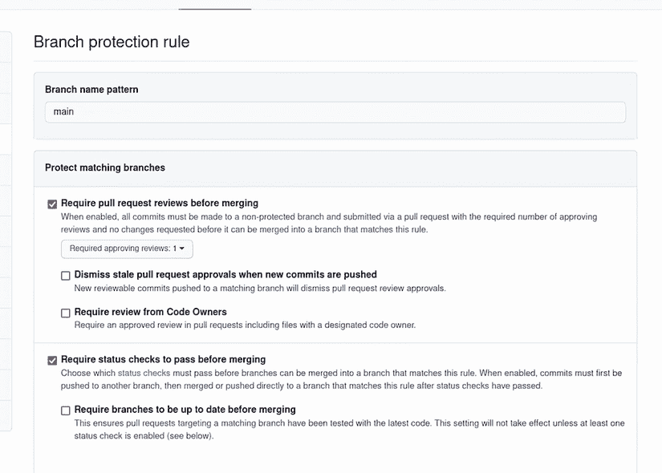

# 5 代码质量执行

本章涵盖

+   通过使用格式化工具和代码检查器标准化我们的代码格式

+   通过引入静态代码分析工具减少代码中的错误和漏洞

+   在将代码推送到仓库之前自动化质量检查

+   组织我们的代码并为其编写文档，以便更清晰的使用和重用

+   通过代码审查建立学习文化

“正如你所见，我们可以以一种赋予开发者快速、高效且高质量交付项目的能力的方式来构建我们的项目。我们只用了一天的时间就编写并部署了我们的翻译应用的新版本，同时提供了灵活的部署选项和自动化的质量检查。”

当你的项目经理这样说并坐下来时，他们满脸笑容。你的演示做得非常好。不深入细节，你能够展示你的新应用，甚至在演示期间推送了实时更改，以展示你可以实现的多快速度。你的 CTO 看起来很感兴趣，但并不确信。

“你所展示的看起来很有希望，但我还没有确信这可以扩展。我们有一群其他开发者，一个完整的 QA 团队，以及一个运营团队，他们都需要工作。我需要看到一份计划，展示我们如何在整个组织中推广它。我需要看到你如何与现有系统、团队和开发者集成，在我考虑在全局范围内实施之前。我们能否在周五见面，解答这些问题？”

你点头。这一切对你来说都很有意义，因为开发者很少单独工作。此外，这是一个迭代的过程，你刚刚得到了很多很好的反馈。

“太好了！”你的项目经理说，“我会为我们安排一些事情。请确保你有一个计划，文件，并且为周五准备另一个演示。你这次做得很好。让我们看看你是否能再次做到。”

## 5.1 代码审查

到目前为止，你一直是在真空状态下工作——只有你和你的代码。这并不是软件通常的制作方式。相反，大多数项目都是几个人之间的协作努力。随着时间的推移，这些人组成了一个团队。作为一个团队，他们制定了一系列规则来运作，相互学习，并帮助彼此改进。但我们如何做到这一点呢？

我们已经引入了这项工具：仓库。仓库不仅存储你的代码，我们还可以将其放置在待处理模式中，直到有人允许将其合并。再次想象我们的仓库是一个仓库。当货物到达时，有人需要签收。如果箱子损坏或丢失，就可以追溯到接收货物的人。有一种责任感。

同样，我们希望我们的团队能够对我们将要引入代码库中的任何内容进行签字确认。为此，我们使用一种称为“拉取请求”的机制，这是一种针对代码库的审查过程。这将保护源代码，并教育他人你正在进行的更改。现在让我们将这种保护添加到我们的代码库中。

要做到这一点，我们需要导航到我们的代码库。点击设置→分支。在这里，你会看到一个名为“分支保护规则”的部分，你将在其中看到一个表单，你可以输入你想要保护的分支的名称和与之相关的特定规则。按照图 5.1 中的方式填写：添加你想要保护的分支以及保护此分支需要执行的操作。这将保护主分支免受直接提交（除非你是管理员）的影响，并将在你有一个审查并且检查通过之前阻止合并。


图 5.1 设置 GitHub 仓库中的分支保护

你应该注意到，我们还在合并前选择了检查应该通过。我们已经在单元测试中设置了一些检查，并将把这些检查贯穿于整章（和整本书）中，以帮助我们的审查并保护开发者的时间。但就目前而言，让我们专注于我们刚刚引入的分支保护。在此阶段，除了管理员之外，没有人能够直接向你的主分支提交代码。相反，他们必须提交一个拉取请求供他人查看。这意味着任何更改都需要得到另一人的批准，作为在整个产品中跟踪责任的一种方式。如果引入了错误，它就不再是单个个人的错误，而是整个团队的责任，因为他们没有在审查中捕捉到它。

当你只是试图完成工作的时候，代码审查似乎是一个缓慢而繁琐的过程。但我可以向你保证，事实并非如此。它们提供了一种极好的方式来教导他人，并通知你的团队你正在进行的更改。即使是在独立进行项目工作时，我也会为自己创建拉取请求。这有助于我审查更改的内容，并帮助我识别错误和问题。这就像审查你写的论文，发现你在初稿中遗漏的错误和明显的问题。一个有效的审查应该包含哪些内容，你又在寻找什么？

### 5.1.1 保持简洁

将审查限制在 300 行代码（包括测试代码）以内。为什么？因为我们作为人类，注意力跨度有限。即使你整天都能读小说，或者在午餐休息时阅读技术期刊，你可能也无法处理大量的审查。审查更像是在阅读食谱，而不是一本书。长而复杂的食谱容易失败，因为你可能会错过一个步骤。在这里，你可能会错过一行代码或一个小错误。虽然我们稍后会介绍的一些工具可能会捕捉到这些，但它们仍然可能被忽略。较小的审查让我们能够专注于任务，快速合并，并且经常合并，正如我们在第一章中讨论的，使用基于主干的开发。

小型审查不是一成不变的规则，但这是你的团队必须学会做的事情。这首先来自于理解如何将任务分解成小块，以便你的代码审查可以更小。2000 行的更改可以分解成大约 200 行的 10 次审查。虽然这看起来可能有些过度，但你可能会发现你的团队能够更多地关注这些小的变化，并指出问题。此外，正如第一章中展示的，可能不是只有一个人在同时进行开发，API 和 UI 工作之间的任务分解也是如此。

### 5.1.2 保持开放的心态

代码审查是一种团队建设练习，应该这样对待。它们不是对你作为开发者的个人攻击或挑战，也不是用来羞辱其他开发者的方式。它们是你学习和教授的机会。

作者斯蒂芬·金说，成为一名优秀作家的第一步是成为一个积极的读者。我相信这一点同样适用于开发者。要成为一名更好的开发者，你需要阅读更多的代码。作为一个团队，这可以让资深开发者向年轻开发者展示不同的技术和编写代码、解决问题的方法。对于年轻开发者来说，这成为了一种向资深开发者展示新技术和问题解决方案的方式。我个人非常喜欢代码审查。我认为这是一种与团队建立和工作的绝佳方式。

将代码审查视为与朋友进行的哲学讨论，而不是政治讨论。在开发中，没有一成不变的规则，但总有可以从他人那里学习的地方，就像哲学讨论一样。一旦变得个人化，其他人学习就会变得更加困难，通常有人会开始竖起防御性的壁垒，不再学习而是看到另一面。时至今日，我仍然不知道像代码审查这样一件看似无辜的事情怎么会成为团队的一个痛点，但它们确实经常如此。以下是我认为你可以避免这种情况的一些技巧：

1.  以你希望被对待的方式对待他人。

1.  在门口放下你的自尊。

1.  不要用糟糕的代码浪费他人的时间。

1.  从反馈中学习，并尽量不再犯同样的错误。

1.  将讨论移至线下，而不是在评论中来回回复。

1.  对他人的行为保持开放的心态。

1.  确保它能够正常工作。

这个列表来自我过去团队的经验；99%的问题可以通过沟通解决，其余的 1%可以通过流程解决。将代码审查作为一种建立联系和团队建设的方式，而不是作为一种让自己看起来更好或让别人看起来更差的方式。

### 5.1.3 保持前进

审查应该优先考虑，因为它们被视为*工作正在进行中*（WIP）。正如你在前面的章节中学到的，WIP 是管道中停滞的资金。让我们来做一些数学计算。如果一个开发者每年赚 10 万美元，那么每小时的开发工作相当于大约 50 美元的价值。当代码处于审查状态时，我们不会从这项工作中获得任何收入。我敢肯定你正在想，“如果我正在审查代码，我就没有在写代码，这是浪费时间和金钱。”如果你在代码处于审查状态时花时间写代码，你会增加 WIP，并且不会交付价值。很快，大量的审查都在进行中，但没有任何东西完成。

也可能看起来在编写代码和审查代码之间切换任务可能会很昂贵，因为你可能会忘记自己在哪里以及你在做什么。这个问题的答案是学会将审查融入你的日常工作中。将任务与某事联系起来。当你发现自己有一杯新鲜的咖啡时，就进行审查。我每天早上都会坐在咖啡旁，进行审查，然后开始新的一天。一旦到了喝第二杯咖啡的时间（或者饮料饮用的最终结论发生），我会进行更多的审查。我们总是有时间做我们想做的事情，但很少尝试做我们不想要做的事情。我们感到沮丧，因为没有人为我们的代码进行审查，但我们没有花时间去审查他们的代码。

注意：确保时间被安排在内，并确保其他人知道你正在等待审查（礼貌地）。

提醒其他人，停滞在审查中的时间是远离向客户交付的时间。

### 5.1.4 保持有趣

代码审查一次又一次可能会变得乏味，因此保持事物有趣是很重要的。与你的团队讨论如何改变和改进你的审查流程。进行你的审查，提出问题或发表评论。这是从他人那里获得反馈的好方法。设立挑战，看看谁能通过重构消除最多的代码，或者谁能找到编写单元测试的新方法。

这看起来很愚蠢，但它有助于团队士气。就像任何事物一样，它让人们对更多的事情保持兴趣。我曾经和一个团队一起工作，该团队要求在拉取请求提交过程中包含一个有趣的 GIF 作为部分要求，审查者不仅需要审查代码，还需要对 GIF 进行评分。再次强调，这有助于建立团队士气，虽然这看起来像是人为的或浪费时间，但团队的凝聚力增强，团队成员的生产力也提高了。

### 5.1.5 保持一致

虽然实验很有趣，能让人保持参与，但建立一些标准也很重要。GitHub 允许使用 *pull request templates*，这允许你为拉取请求创建一个标准格式，包括检查清单。检查清单是提醒他人提交请求前需要做什么的好方法。为此，打开你的源代码，创建一个名为 `.github` 的新目录，并添加一个名为 `PULL_REQUEST_TEMPLATE.md` 的文件。下一个列表显示了一个可以帮助拉取请求的示例模板。

列表 5.1 `PULL_REQUEST_TEMPLATE.md`

```
### Description
Please explain the changes you made here.

### Associated Task
Please list closed, fixed, or resolved issues here with a # and the number.

### Checklist
- [ ] Code compiles correctly
- [ ] Added tests that fail without the change (if possible)
- [ ] All tests passing
- [ ] Extended the documentation
```

在这里，你询问了已经做了什么，以及为这项工作提供的文档类型，以及提交前应该做的事情清单。

当作为团队在代码审查过程中工作时，你应该定期检查哪些工作得好，哪些工作得不好。通过这样做，你可以开始完善流程。你仍然可以做一些事情来自动化流程并教会他人。我们将看到如何让人类不必承担所有审查的负担，而是与机器一起协作，帮助指导和教学。

## 5.2 开发约束

在著名的电视剧《我爱露西》中有一个臭名昭著的场景，主角露西和她的朋友伊瑟尔在流水线上工作，结果出了差错。露西和伊瑟尔在一家巧克力工厂工作，将巧克力从流水线上放入包装纸中。一开始，两人还能跟上巧克力流动的速度，但不幸的是，发生了一个意外事件，导致她们落后了。慌乱中，两人想尽办法阻止巧克力的流动。对公众来说，这是不幸而又好笑的展示，说明了如果工人在流水线上落后会发生什么。观看这个片段的工业工程师只看到一件事：一个约束。*约束*也被称为瓶颈。它是流水线上决定工厂吞吐量的位置。

在他的小说《目标》中，艾利雅胡·高德拉特概述了所谓的“约束理论”，其中他声称，任何系统中不是约束的优化都是没有意义的。在我们的《我爱露西》例子中，如果露西和伊瑟尔不能及时包装，提高巧克力制作速度是没有意义的。这如图 5.2 所示。如果 A（露西）每分钟生产四个物品，而 B（伊瑟尔）每分钟只能处理一个物品，我们就会开始过度生产物品。很快，过剩的库存就会开始堆积，我们整个系统的总吞吐量将只有每分钟一个物品。


图 5.2 步骤 B 只能从步骤 A 处理一个物品。工作最终会在 B 前面堆积，对 A 或 C 的任何改进都不会有助于吞吐量。

根据高德拉特（Goldratt）的观点，任何公司的重点都应该是尝试提高约束的吞吐量，并保护其时间不被浪费在那个阶段。这被称为*提高约束*。提高约束有几种方法。在我们的*我爱露西*（I Love Lucy）例子中，如果额外的工人帮助他们，或者如果他们有一个可以让他们包装十倍数量的巧克力的机器，露西和艾塞尔可能不会有问题。在另一个场景中，让我们想象露西和艾塞尔能够保持一个不错的速度，并且每小时能够包装 100 块巧克力，但其中 10%由于某种原因有缺陷。他们的吞吐量将下降到每小时 90 块巧克力。一旦我们确定了我们的约束，我们就可以找到新的方法使其变得高效，并保护它，以便我们有更高的吞吐量。

软件开发也有约束。几乎整个流程都是由计算机自动化的，这意味着我们管道中最慢的部分是开发者。实际思考和开发功能应该是决定我们管道吞吐量的因素。代码生成和审查需要时间，并且不是自动化任务；因此，时间应该得到保护。一个简单的解决方案可能是增加更多工人。增加更多团队成员可能意味着更多的人编写代码，但这会变得复杂。随着团队的增长，需要更多的沟通线路来维持关系和协作。通常，大多数公司遵循*两个披萨规则*，即一个团队不应该有超过两个披萨可以喂的人数。如果人数更多，你开始看到团队生产力的递减回报。

注意：弗雷德·布鲁克斯（Fred Brooks）曾著名地表示，给一个项目增加更多的人手并不会加快交付时间，就像“九个女人一个月也生不出一个孩子”一样。

如果增加人手不是解决方案，我们需要确保保护他们的时间。我们可以通过测量特性和计算缺陷作为返工或存在缺陷的工作来衡量一个公司的吞吐量。然后我们可以通过使代码易于开发、在发生之前捕捉到错误来提高我们的约束。这可以通过使我们的代码易于阅读、编写和修复，并提供一种机制来学习和教授其他开发者我们编写的内容来实现。在本章中，我们在合并代码之前检查代码的质量，并将这种质量检查作为学习和改进我们系统的一种方式。

## 5.3 通过格式和 lint 检查标准化我们的代码

在装配线上，各个工作站通常都是标准化的，这样工人就不必浪费精力或时间去确定哪些部件该放在哪里。如果我们回顾露西和艾塞尔的情况，我们可以想象如果他们需要确定哪种包装颜色应该放在各种巧克力的不同部分，他们可能会落后得多。相反，所有的包装和巧克力都被标准化了，以帮助流动，这样露西和艾塞尔就可以尽可能快地包装它们。

标准化随后成为帮助我们通过开发流程的重要元素。正如我们在第二章中概述的，标准化我们设置环境和工作站的方式对于整体开发者体验很重要，但这种标准化需要扩展。如果我们把包装和巧克力作为流经露西巧克力工厂的材料的一部分，我们需要考虑如何通过我们的管道标准化我们的材料。但如何标准化代码呢？

注意：在此处区分工业编程与个人项目很重要。*工业编程*意味着其他人将与你在某个产品上一起工作，该产品将被其他人消费。在这里，标准化变得很重要，以确保每个人都处于同一页面上。*个人项目*如果你只是对某事进行实验，则不需要这种程度的严谨性。如果个人项目成为工业产品，最好考虑使用这些原则重新编写它。

每一段代码的编写都必须服务于某种特殊或个人目的；否则，就不会被编写出来。你不会从每个开发者那里得到相同的独特代码块。可以标准化的是代码的外观和感觉、代码的文档、代码片段的既定模式以及测试。标准化随后变成了一个提出通用代码风格并决定如何执行这种风格的过程，以便当其他人查看你的代码时，它与其他团队成员编写的代码无法区分。这通常是通过一个*风格指南*来完成的，其中团队建立了一套关于其代码格式的规则。一般来说，这可以很简单（或具有争议性），比如使用制表符与空格、保持括号在同一行或下一行、函数之间的空格等。这将在不同的语言和团队之间有所不同。

除了格式规则之外，Go 还提供了一份编写惯用 Go 代码的指南，许多代码检查器都会尝试强制执行。我们将在后面讨论代码检查器，但以下文章还提供了在编写 Go 语言时做出各种格式决策的理由：[`golang.org/doc/effective_go`](https://golang.org/doc/effective_go)。

然而，Go 语言有其独特的风格，因此这并不是一个问题。流行的玩笑是“没有人喜欢 Go 格式，每个人都喜欢 Go 格式”，这意味着人们可能不喜欢 Go 格式化工具的一些方面，但每个人都喜欢存在一个标准格式化工具，而且没有人需要担心它。它使用简单且内置其中。进入你的项目目录，然后输入

```
go fmt ./...
```

你可能会看到一些变化，也可能不会。Go 会将括号移动到与函数声明相同的行，用制表符替换空格，合并函数之间的空格，等等。重点是，作为一个开发者，你应该担心的事情不仅仅是你的代码格式。对于其他语言，如 JavaScript 的 `prettier` 包和 Python 的 `autopep8`，还有其他工具。但是，有格式标准和使用它们是两回事。

我们需要做两件事来帮助我们的开发者：首先，自动化流程；其次，强制执行。让我们从第二部分开始，这样我们就可以看到它的实际效果，然后再进行自动化。

为了强制执行这些规则，我们已经在主分支上设置了一些限制。我们将设置我们的管道，在允许推送合并按钮之前强制执行检查。

目前，我们的持续集成系统仅在主分支的更改上运行，因此我们需要更新 `pipeline.yml` 文件以在拉取请求上运行。打开该文件，并添加以下列表中的代码。

列表 5.2 `pipeline.yml`

```
name: CI Checks

on:
  pull_request:                                                             ❶
    branches:
      - main
  push:
    branches:
      - main
...
  deploy-function:
    name: Deploy FaaS
    runs-on: ubuntu-latest
    needs: test
    if: ${{github.event_name=='push' && github.ref == 'refs/heads/main'}}   ❷
    steps:
...
  deploy-paas:
    name: Deploy PaaS
    runs-on: ubuntu-latest
    needs: test
    if: ${{github.event_name=='push' && github.ref == 'refs/heads/main'}}   ❷
    steps:
...
```

❶ 在主分支的拉取请求上运行

❷ 只在主分支的推送操作上运行部署，不运行拉取请求

此外，我们还想添加一个新检查，以查看合并前是否进行了格式化，因此我们将在我们的管道中添加一个步骤。我们将添加以下列表中的命令到我们的 Makefile 中（见下）。

列表 5.3 Makefile

```
...
report:
  go tool cover -html=coverage.out -o cover.xhtml

check-format:
  test -z $$(go fmt ./...)      ❶
```

❶ 这将检查运行格式化命令的结果，看是否有任何变化。如果有，它将返回一个失败值。

现在，我们可以更新我们的管道以运行此步骤，如下所示。

列表 5.4 `pipeline.yml`

```
jobs:
  test:
    needs:
      - format-check                   ❶
    name: Test Application
...
  format-check:
    name: Check formatting
    runs-on: ubuntu-latest
    steps:
    - name: Set up Go 1.x
      uses: actions/setup-go@v2
      with:
        go-version: ¹.18
    - name: Check out code into the Go module directory
      uses: actions/checkout@v2
    - name: Run Format Check
      run: make check-format           ❷
```

❶ 由于格式化比运行测试成本低，让我们先检查格式以节省时间。

❷ 从 Makefile 中调用我们的检查格式化命令以查看结果

现在创建一个名为 task/quality-check-enforcement-formatting 的分支，并提交你的更改。推送新分支，并创建一个拉取请求。观察 CI 管道运行以确保所有更改都正常工作。它失败了？如果是这样，调查失败原因。如果它通过了，你可以自由地尝试通过破坏格式化并再次推送来让它失败。一旦一切正常，就合并它。恭喜！你已经为主分支添加了一个保护措施。实际上，我们已经添加了两个：格式化和测试现在都需要通过才能合并到主分支。这也减轻了我们的团队需要要求人们格式化的负担。接下来，我们需要通过自动查找无法通过 linting 检测到的坏代码和安全漏洞来帮助我们的团队。

## 5.4 静态代码分析

软件用于自动化以前的手动任务。虽然人类对审查至关重要，但他们可能会犯错误。幸运的是，许多不良编码实践和反模式可以通过称为 *静态代码分析* 工具的软件自动识别。这些工具会遍历你的代码，寻找与错误或安全漏洞相关的已知模式。一些工具可以用来强制执行良好的编程实践，如文档和拼写。将静态代码分析工具添加到你的管道中可以帮助减少错误并保护审查者免于在“坏代码”上浪费时间。

要做到这一点，我们将使用两个工具。一个是 Go 内置的工具，另一个是社区支持的提供广泛库的工具，这些库支持额外的检查。让我们首先从 Go 的内部命令 `go vet` 开始，这是一个提供有关代码中错误快速结果的绝佳工具。现在让我们运行它，看看是否有任何问题。为此，请输入

```
go vet ./...
```

与测试中一样，三个点表示程序运行 vet 工具跨所有包。希望你在结果中看不到任何东西。打开 `cmd/main.go`，更改一行（见以下代码列表）。

列表 5.5 `main.go`

```
...
func main() {
  addr := fmt.Sprintf(":%s", os.Getenv("PORT"), "error")     ❶
  if addr == ":" {
    addr = ":8080"
  }
  ...
}
```

❶ 添加一个额外的变量可能导致这一行失败。

现在运行 `go vet` 命令，你应该会看到一个错误。vet 工具检查你的源代码，发现你有一个格式化命令，其变量多于预期。这很好，因为它将捕获一个潜在的错误。我们应该将此添加到我们的管道中，以便我们可以进行这些检查。再次强调，运行这个命令比运行测试（或将来会是这样）要快得多，因此我们应该在测试之前运行它，但我们也可以在格式化检查之后运行它。让我们更新我们的管道，使用以下列表中的代码运行这些检查。

列表 5.6 `pipeline.yml`

```
vet:
    name: Check formatting
    runs-on: ubuntu-latest
    steps:
    - name: Set up Go 1.x
      uses: actions/setup-go@v2
      with:
        go-version: ¹.18
    - name: Check out code into the Go module directory
      uses: actions/checkout@v2
    ...
    - name: Vet
      run: go vet ./...     ❶
```

❶ 运行内置的 Go 工具检查代码

这将在我们运行测试之前和检查格式化之后执行。这很好，因为它为我们提供了一个可以通过它来测试代码质量和在出现问题时向开发者提供具体反馈的管道。我们可以将其视为各种筛子，通过这些筛子我们筛选石头。较大的孔允许较大的石头通过，但随着我们逐渐减小孔径，石头变得越小，你越容易看到单个石头。最后，你将留下你想要的石头不同大小。

以同样的方式，我们的代码将通过，为我们提供易于消化的错误和改进，直到我们只剩下一个准备审查的产品。管道方法在针对和指出各种问题方面效果良好，但也可能导致更长的领先时间。*领先时间*指的是从问题或功能提出到交付给客户的过程中，从开始到停止的过程时间。这些步骤之间的时间被称为*周期时间*。如果一个周期时间是总领先时间的子集，我们可以专注于优化我们的周期时间，以减少对客户的总领先时间。在图 5.3 中，您可以看到客户请求到交付之间的总领先时间应该减少以满足他们的需求。为了做到这一点，我们可以考虑减少管道中每个步骤的周期时间。



图 5.3 总的领先时间是任务创建到交付给客户的时间。

我们可以想象我们的管道可以同时运行多个阶段，例如代码检查、审查和测试。这会变得计算成本高昂，因为您正在并行运行机器或进程，但您可以得到更快的结果，并可以看到所有发生的问题。这是您的团队需要确定如何运行管道的另一个地方。在这个例子中，我们将在管道中运行并行和顺序步骤的混合。

注意：GolangCI Lint 是一个聚合代码检查工具，允许开发者从众多代码检查器中选择。

`go` `vet` 是静态检查我们代码的一个很好的起点，但并不需要就此停止。可以在您的机器上安装一个名为 `golangci-lint` 的工具，并将其用作管道步骤。GolangCI-Lint 允许您从众多的代码检查和静态检查库中选择，以帮助扩展您的质量评估。完整的列表可在库页面找到，但我们将在这里使用几个以开始。默认情况下，它将运行几个检查，以查找未使用的代码、无效的变量赋值、缺失的错误检查等等。此外，我们还将添加一个安全检查。为此，我们需要创建一个名为 `.golangci.yml` 的新文件。在根目录中创建它，并添加以下列表中的代码。

列表 5.7 `golangci.yml`

```
linters:
  enable:
    - gosec           ❶

output:               ❷
  format: colored-line-number

  # print lines of code with issue, default is true
  print-issued-lines: false

  # print linter name in the end of issue text, default is true
  print-linter-name: true
```

❶ 将代码检查器添加到文件中

❷ 自定义代码检查器的输出格式

我们所使用的代码检查器在运行本项目时会自动查找此配置文件。

代码安全性是静态代码分析中经常被忽视的一步，但却是关键的一步。安全检查可以允许你选择使用哪些随机化库和函数，以及你可能需要的哈希类型。你的代码可能不会使用这些功能，但有一天你可能会发现（如果你启用了你的代码检查器），你可能需要它们。现在我们已经广泛了解了这个工具能做什么，让我们将其添加到我们的管道中（见下面的代码列表）。

列表 5.8 `pipeline.yml`

```
jobs:
  test:
    needs:
      - format-check
      - lint                                      ❶
    name: Test Application
  lint:
    name: Lint
    runs-on: ubuntu-latest
    steps:
      - uses: actions/checkout@v2
      - name: Lint
        uses: golangci/golangci-lint-action@v2    ❷
```

❶ 添加一个代码检查作为依赖项

❷ 将代码检查添加到管道中

创建一个名为 task/add-static-check 的分支，提交你的代码，并创建一个拉取请求。你看到了什么？它应该出错！为什么？好吧，看起来我们在一个函数上缺少错误检查。如果我们早点看到这个，我们就可以节省一些时间。让我们通过添加以下列表中的代码到我们的 Makefile 中来解决这个问题。

列表 5.9 `pipeline.yml`

```
setup: install-go init-go install-lint
...
install-lint:           ❶
  sudo curl -sSfL \
 https://raw.githubusercontent.com/golangci/golangci-lint/master/install.sh\
 | sh -s -- -b $$(go env GOPATH)/bin v1.41.1

static-check:
  golangci-lint run
```

❶ 从本地获取代码检查器的内容

太好了，现在我们可以在本地运行 `make lint` 并得到相同的错误。通过添加以下列表中的代码来修复这一行。

列表 5.10 Makefile

```
func TestTranslateAPI(t *testing.T) {
...

  for _, test := range tt {
    ...
    _ = json.Unmarshal(rr.Body.Bytes(), &resp)    ❶
  }
}
```

❶ 即使我们现在没有使用它，这也需要捕获错误信息。

提交你的更改并推送。现在一切应该都是绿色的，你可以合并。这个简单的步骤将帮助你避免在开发过程中遇到几个错误和问题。像缺少错误检查这样的情况可能会隐藏在系统运行期间发生的潜在问题。无效的赋值是另一个常见问题，其中变量被设置但从未使用，这可能导致错误。这些工具会增加轻微的开销，但长远来看会节省你时间。作为团队，花时间评估并按需使用它们，并让它们随着团队的发展而发展。

## 5.5 代码文档

编写代码应该像讲故事一样。你从一个想法开始，然后定义结构。大多数开发者不会先写注释就开始编写代码。他们很可能会只写一个函数一次，并希望永远不需要回到它。更常见的情况是，有人可能因为某种原因需要使用这个函数或包，开发者的工作是讲述这个函数的功能故事，这样其他人就不需要深入研究代码来弄清楚它。这归结于确保故事标题清晰，描述准确。

因为这是我第一次尝试写作，我可以说我发现为函数注释想出内容更具挑战性。你需要首先想出一个对人们有帮助的好名字的函数。这需要是某种有意义的名字，比如 `Translate` 和 `TranslateFile` 而不是 `T` 和 `TFile`。或者，你不需要用像 `TranslatesFileWithCaseInsensitiveAndUnixBasedHomeDir` 这样的名字讲故事。相反，你会在注释中说明人们应该如何期望函数的工作方式。我们一直避免编写包级和函数级注释。

Go 内置了托管文档服务器的功能，其中库会解析你的源代码，寻找位于包声明和函数之上的注释以创建文档。然而，包含目录中的任何内容都会被跳过，因为它不能用于依赖项。

由于我们没有文档，我们应该解决这个问题。然而，我们还想确保在完成这个练习后，没有人会像我们一样不注释他们的代码。这被称为 *侦察哲学*，即你“让它比找到它时更好。”为了做到这一点，让我们添加一个新的 *静态代码分析* 工具来检查注释。我们将使用一个要求所有导出函数和包都有注释的检查器。此外，我们将添加拼写检查并确保所有注释都以句号结束。打开 `.golangci-lint.yml`，并添加以下列表中的代码。

列表 5.11 `\golangci-lint.yml`

```
linters:
  enable:
    - gosec
    - godot                       ❶
    - misspell
    - stylecheck

linters-settings:                 ❷
  stylecheck:
    # Select the Go version to target. The default is '1.13'.
    go: "1.18"
    checks: ["all","ST1*"]

issues:
  exclude-use-default: false      ❸

output:
  format: colored-line-number

  # print lines of code with issue, default is true
  print-issued-lines: false

  # print linter name in the end of issue text, default is true
  print-linter-name: true
```

❶ 添加代码检查器以检查注释和风格

❷ 在我们想要捕获风格问题的代码检查器设置

❸ 一些这些代码检查错误被 GolangCI-Lint 隐藏了，所以我们要禁用这个功能。

风格检查将确保我们的注释是必需的，并且我们遵循一些其他注释写作标准。`godot` 和 `misspell` 将确保我们的字符串和注释标点正确且拼写无误。一旦添加了此文件，运行 `make static-check` 并查看结果。通过添加你认为合适的注释来修复代码。推送你的更改并合并。记住，注释应该解释函数做什么，而不是它是如何做的。例如，`Translate` 函数的注释可以是：“`Translate` 函数将接受一个单词和语言，如果可用则返回翻译；否则，它将返回一个空字符串。”

## 5.6 Git 钩子

我们已经保护了主分支，增加了质量检查，然后在主分支上添加了各种要求。现在我们需要专注于本地化我们的开发环境中的更改。一般来说，本地化您的管道中的更改非常重要，这样您的开发者就可以轻松地在本地重现它们。如果您发现验证本地更改成为问题，您应该考虑更改您的管道。本地化函数允许开发者在将代码推送到拉取请求之前确保其代码能够正常工作。想象一下在创建拉取请求之前尝试猜测您的代码是否会通过。这会在过程中造成延误和问题。就大部分而言，我们已经自动化了我们管道所做的大部分功能，但我们未能确保开发者在本地使用它们。

政策只能带你走这么远。通常，开发者会认真编写一些代码，推送它，创建一个拉取请求，然后继续前进，几个小时后发现拉取请求因为这样或那样的原因失败了。同样，当看到一个新的拉取请求时，开发者会蜂拥而至进行审查和批准，却发现有错误阻止它合并。这浪费了开发者、审阅者和 CI 管道的时间。尽可能地将这些检查移到源代码附近将有助于推进这个过程。

Git 有一个美丽的特性叫做 *hooks*，它可以与 Git 支持的各种功能相结合。当执行特定功能时，hook 会运行，要么在之前，要么在之后。在我们的情况下，我们想要创建一个 *pre-commit hook*，它将在我们提交更改之前运行。这个 hook 将验证我们的代码是否格式正确，以及静态代码分析是否按预期运行。我们需要确保这些功能对每个人都是可用的，因此它们应该成为我们设置的一部分。首先，我们必须创建脚本，它只是一个简单的 shell 脚本。创建一个名为 `scripts/hooks/pre-commit` 的文件，并添加以下列表中的代码。

列表 5.12 `pre-commit`

```
#!/bin/sh

STAGED_GO_FILES=$(git diff --cached --name-only -- '*.go')     ❶
if [[ $STAGED_GO_FILES == "" ]]; then                          ❷
    echo "no go files updated"
else
    for file in $STAGED_GO_FILES; do
        go fmt $file                                           ❸
        git add $file
    done
fi

golang-ci run                                                  ❹
```

❶ 获取所有 Go 文件

❷ 如果没有，打印消息。

❸ 对所有文件运行格式化并将文件添加到提交中

❹ 运行 lint 检查

现在我们将创建一个脚本，将其作为初始化的一部分添加到我们的 `.git/hooks` 目录中（见以下列表）。一旦在那里，它将在任何分支推送之前运行，所以请注意错误信息！

列表 5.13 Makefile

```
setup: install-go init-go copy-hooks
...
copy-hooks:
  chmod +x scripts/hooks/*       ❶
  cp -r scripts/hooks .git/.
```

❶ 创建脚本并复制文件

现在应该在本地环境中捕捉到问题，因为团队试图使用这些钩子来确保基本任务正在完成，但要注意这些函数的时间成本。请注意，我们没有将测试阶段添加到预推送中。这是因为测试的运行时间比静态检查要长。尽量找到一个合适的平衡点。确保事情不会花费太多时间并打断开发流程。你和你的团队可能会发现这些钩子比有帮助还要侵扰，在这种情况下，你应该与你的团队讨论它们的用法和功能。

## 5.7 流动

心理学家 Mihaly Csikszentmihalyi 研究了人们的工作方式以及它与幸福和创造力的关系。他相信，如果人们能够建立一种*流动感*或对当前任务的专注和沉浸感，他们会享受他们所做的事情。这也被称为“进入状态”。如果你玩运动或乐器，我敢肯定你曾经进入过一种流动状态。你可以看到下一个动作，预测下一个音符，或者沉浸在你正在做的事情中。

Csikszentmihalyi 发现这种模式也可以在工作上反映出来，只要它能以某种方式吸引工人。开发者会在编写代码时找到这种流动。一些最具创新性和效率的代码可以来自一个投入的开发团队。然而，可能会引起问题的，是流动的中断，例如：

+   会议超载

+   破坏构建和测试

+   本地开发问题

+   海森堡虫，不一致可复现的虫子

+   同事突然进来交谈或提问

这为什么重要？因为团队成员的流动很重要。使事情变得更容易将有助于为他们创造更好的流动。我们想要关注的是从想法到实施的过程。在这个阶段，我们遇到的干扰越少，越好。这种流动来自做这项工作的人，任何打断流动的事情都会打断他们成功的能力。

另一方面，宽松的质量控制可能导致中断，形式为错误和错误。没有适用于团队的最佳方案的公式。如果你是一个高级开发者的团队，你可能需要较少的约束。如果你是一个经验较少的开发者团队，你可能发现你需要更多。这里的关键是沟通。经常互相交谈。改进和增强。

总的来说，这一章是关于帮助你的团队一起工作。我意识到这是一个具有挑战性和独特性的领域，因为每个团队都会有所不同，所以你会注意到我一次又一次地重复了类似的句子：做对你团队最有利的事情。我们已经建立了一个管道，并且正在对其进行扩展。每次增加都会带来更多的复杂性，但这种复杂性往往可以帮助团队随着成长和演变。这些步骤和大多数保护措施都将有助于你的团队长期发展。这可能是通过捕捉错误或错误，但在某些情况下，它将使人们保持警惕。

父母通常使用计时器作为一种沟通方式，表明是时候离开了，而不是告诉孩子们该走了。这样做的好处是，父母和孩子已经同意，计时器是决定何时离开的东西，而不是父母看似随意的宣布。计时器是沟通工具。同样，团队成员会更乐意响应一个程序告诉他们评论代码，而不是团队成员，因为双方都同意使用一个单一的工具来约束他们。

“嘿，你有几分钟时间吗？”你惊讶地抬起头，看到你的项目经理和一个你从未见过的人。他说：“我想介绍你认识一下 Yvonne，她是一名实习生，将帮助你满足周五的演示。她没有很多经验，但我相信你能够很快帮助她熟悉工作。”任何帮助都是受欢迎的，尤其是在你已经标准化了你的工作之后。

## 摘要

+   代码质量检查可以减少错误并标准化工作。

+   格式化可以标准化工作空间，并使新成员更容易融入。

+   静态代码分析将检查你的代码中已知的不良模式，并要求你修复它们。

+   将质量检查移至管道前端可以减少等待时间，并在部署前捕获错误。

+   不断审查和改进你的开发流程，以确保开发者的工作流程顺畅。
