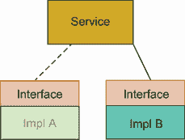
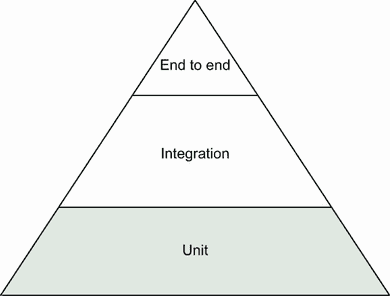

# 6 测试框架、模拟和依赖

本章涵盖

+   通过使用接口将代码从外部依赖中隔离

+   将依赖注入到服务中以创建可组合的代码部分

+   构建测试套件以减少测试的样板设置和拆卸

+   模拟和模拟依赖以创建可靠且隔离的测试

+   模拟对外部服务的调用以测试客户端服务的逻辑

“所以你想坐在我旁边告诉我该写什么代码？那不会浪费你的时间吗？”你刚刚给了实习生访问仓库的权限，并坐在她的桌子旁边。你解释说她应该下载仓库并遵循 README 中的说明，你将坐在那里回答任何问题。在记下一些关于如何扩展文档的笔记后，你继续编码。实习生将向系统中添加一些新功能，并编写代码，而你将解释应该写什么。

这种“结对编程”的过程是一种很好的技术，可以让人加入并解释代码库。它也是一种很好的团队建设活动。一个人可以编写测试，另一个人实现解决方案。在这种情况下，你将编写测试并解释它做什么，然后实习生将负责在你在场的情况下实现它，你将指导她并提供指导和反馈。不过，在这样做之前，你需要定义你将要构建的内容，所以你打开一个编辑器，并在你的`translate.go`处理器中编写以下列表中的代码。

列表 6.1 `translate.go`

```
type Translator interface {
    Translate(word string, language string) string     ❶
}
```

❶ 将我们的方法提取到接口中使我们能够在实现上具有灵活性。

“你想要我在新服务中实现这个接口？为什么？现在一切似乎都运行得很好。接口能做什么来帮助？”你微笑着；教人总是很有趣。

## 6.1 依赖反转原则

“依赖抽象，而非具体。”这是**依赖反转原则**。这是一个在软件开发中发现的原理。这是一个相当简单的概念，有助于开发者创建干净和专注的代码。我们不是直接使用实现过的类或函数，而是依赖于抽象。

我能解释这个概念的最佳方式是想象一个没有电源插头的场景。如果你必须直接将你的灯或电视连接到家里的电力系统，那会多么困难？我相信在你重新布置家具之前，你一定会三思。相反，我们创造了插头和插座。我们不在乎家里的电线、断路器（除非有人拉闸）、通往房子的线路、变压器，或者电是从哪里来的。它对我们来说只是简单地工作。如果你的灯明天坏了，它可以被更换，你不需要担心安装一个新的插座。插头应该刚好合适。

这就是所谓的 *接口*，一种抽象，它允许某人轻松地使用背后更复杂的东西。我们在第四章讨论了抽象，以及它们如何在软件开发中有所帮助。开发者想要帮助抽象他们的一些代码供他人使用，这并不奇怪。同样，他们希望能够在不引起重大重构或问题的前提下改进和更改事物。这就是接口发挥作用的地方。在软件开发中，接口定义了给定结构体或类的函数。一旦结构体拥有了所有请求的函数，它就满足了接口，可以在满足接口的另一个服务的地方使用。就像灯具一样，我们可以更换帮助我们成长和改进的代码片段。

一些开发者会放弃创建接口，而是创建紧密耦合和交织的代码片段。这使得我们难以有效地测试，并在未来增强我们的代码。我们需要模块化我们的代码，以便我们可以更好地测试它，这可以通过使用接口来实现。

## 6.2 定义接口

接口也被称为 *协议*，它有助于定义系统之间的边界，并提供在这些边界之间通信的方式。协议和接口创建了一个定义，说明如何通过既定的结构或模式进行通信。就像电源插座上不同的插孔面可以告诉我们另一侧是什么类型的电力一样，接口将通过定义方法定义（如图 6.1 所示）告诉我们的用户如何使用服务。


图 6.1 设计了各种接口来抽象电力的输送。

这允许我们的开发者面向接口定义编写代码，而不是具体的实现，这样我们就可以做出不会影响整个系统的更改。在我们开发过程中，这一点很重要，因为我们可能会发现我们需要缓慢地替换代码的一部分，同时仍然支持向后兼容性或测试尚未准备好广泛消费的功能。在本章的后面部分，我们将这样做，但让我们先从以下列表中的简单示例开始。

列表 6.2 `example.go`

```
package main

import "fmt"

type Greeter interface {                     ❶
    Greet() string
}

type spanishGreeter struct {}

func (g *spanishGreeter) Greet() string {    ❷
    return "hola"
}

type englishGreeter struct {}

func (g *englishGreeter) Greet() string {    ❸
    return "hello"
}

func printGreeting(greeter Greeter) {        ❹
    fmt.Println(greeter.Greet())
}

func main() {
    printGreeting(&spanishGreeter{})
    printGreeting(&englishGreeter{})
}
```

❶ 接口定义了一个结构体需要拥有的方法以满足接口。

❷ `spanishGreeter` 结构体添加了该方法，因此满足了接口。

❸ 同样，`englishGreeter` 也满足了接口。

❹ 然后，可以编写一个泛型方法，该方法使用接口作为输入。

我们创建了两个满足相同接口的结构体。这允许我们将函数的参数抽象化，以接受接口并在两个结构体之间进行切换。这可以在图 6.2 中看到，我们有一个使用接口来隐藏底层实现的服务。虽然这是一个简单的例子，但我们将看到它在未来定制我们的应用程序时将变得更加强大。我们现在可以看到，我们可以实现任何数量的结构体来满足这个接口，而无需更改调用者。尽管我从未遇到过这种情况，但想象一下使用接口作为后端数据存储。有了接口，你可以使用 Postgres、RedisDB、MongoDB 或任何数量的技术来满足接口，而无需更改你的代码。这种情况很少发生，但可以防止你锁定到特定的实现。



图 6.2 接口允许我们在不改变消费服务逻辑的情况下，在满足接口的不同服务之间进行切换。

这有什么关系呢？通过使用接口，我们还可以简化我们测试代码的方式。让我们以我们的处理器函数为例。目前，它依赖于服务结构体进行翻译。如果我们改变服务的底层实现，我们希望这不会影响我们的处理器。但当我们思考这个问题时，我们的处理器应该独立于底层服务工作。处理器所关心的只是输出翻译，没有其他，因此我们希望在处理器内添加一个抽象层，使其更容易测试（见以下代码列表）。

列表 6.3 `translate.go`

```
type Translator interface {
    Translate(word string, language string) string     ❶
}
```

❶ 将我们的方法提取到接口中使我们能够在实现上具有灵活性。

你可能会想知道为什么我们要在这里定义这个接口而不是其他地方。处理器是这个接口的消费者，因此根据我们之前讨论的依赖倒置原则，它定义了它需要的功能。我们定义我们想要的接口，然后创建满足这个接口类型的实现。Go 使用一种称为 *鸭子类型* 的方法来帮助将接口映射到其实现。*鸭子类型* 是一种类型系统，其中对象需要满足某些行为。它来自一个 *鸭子测试*：“如果它像鸭子走路，像鸭子嘎嘎叫，那么它一定是一只鸭子。”处理器可以通过使用接口来定义它对结构的期望，并忽略底层实现。这意味着我们的实现可以来自任何地方，一个单一的实现可以满足许多接口。作为开发者，我们希望将我们的接口分成小块，称为 *接口隔离*，以帮助它们更易于组合和重用。Go 的标准库有一个很好的例子（见以下列表）。

列表 6.4 `io.go`

```
type Reader interface {                   ❶
    Read(p []byte) (n int, err error)
}

type Writer interface {                   ❷
    Write(p []byte) (n int, err error)
}

type ReadWriter interface {               ❸
    Reader
    Writer
}
```

❶ 读取接口只有一个方法需要满足 . . .

❷ . . . 以及写接口。

❸ 从这些接口中创建一个复合接口。

一个服务可能只想实现 `Reader` 或 `Writer` 或两者兼具。你可以将接口视为乐高积木，这样你可以组装你需要的东西，而无需更多。这很好，但我们如何使用这种可组合性呢？我们创建一个满足接口的结构体，并将其注入到一个消费结构体中。这被称为 *依赖注入*。

## 6.3 依赖注入

我一直想象依赖注入就像在不同的车上安装不同的引擎。许多车身使用相同的引擎，许多车身支持不同的引擎。例如，2022 款丰田凯美瑞允许你选择安装四缸、六缸或四缸混合动力引擎，所有这些都在同一类型的汽车上，就像混合动力引擎也可以用于其他车辆一样。这是公司以简化设计的同时，为用户提供他们所需多样性的流线型方式。

备注：我们将手动连接这些依赖项，但有一些工具可以为你完成这项工作。这些包括 Wire、Fx 和 Kit。

同样，我们可以构建我们的代码以使用不同的服务和元素，同时不影响我们的当前实现。代码会变化，想法会变化，功能会添加。重要的是，这些变化不应该需要整个系统的重新架构或重建。相反，我们应该能够以抽象术语定义服务应该如何工作，然后通过具体的实现来满足它们，这样它们就不是 *紧密耦合* 的，即一个服务的更改需要另一个服务的更改。相反，一个给定服务的更改不应该影响另一个服务的底层功能。在前一节中，我们讨论了编写接口的优点。你可以将你的接口视为一种标准化服务如何工作的方式。有了这个标准，你就可以根据需要做出更改。你可以添加更大的引擎、较小的引擎或混合引擎，而无需进行大规模的改造。让我们看看这是如何工作的。我们已经为翻译编写了接口，现在我们需要让处理器使用它，并让服务满足它。打开你的 `translate.go` 文件，并添加以下列表中的代码。

列表 6.5 `translate.go`

```
// TranslateHandler will translate calls for caller.
type TranslateHandler struct {
    service Translator                                               ❶
}

// NewTranslateHandler will create a new instance of the handler using a
// translation service.
func NewTranslateHandler(service Translator) *TranslateHandler{      ❷
    return &TranslateHandler{
        service: service,
    }
}

...

// TranslateHandler will take a given request with a path value of the
// word to be translated and a query parameter of the
// language to translate to.
func (t *TranslateHandler) \
    TranslateHandler(w http.ResponseWriter, r *http.Request) {       ❸
...
    translation := t.service.Translate(word, language)               ❹
...
}
```

❶ 我们的处理程序现在成为一个依赖于接口以满足翻译的 struct。

❷ 我们创建了一个便利方法来创建实例，这样你就不会错过任何依赖项。

❸ 将方法更改为附加到我们的结构体

❹ 用接口替换我们的翻译方法

我们创建了一个包含我们的接口并允许我们在处理器函数中调用它的结构体。现在让我们更新我们的服务以满足接口，这样我们仍然可以使用它，并让我们的系统重新构建。打开 `translator.go` 文件，并添加以下列表中的代码。

列表 6.6 `translate.go`

```
// StaticService has data that does not change.
type StaticService struct{}                                                ❶

// NewStaticService creates new instance of a service that uses static data.
func NewStaticService() *StaticService {                                   ❷
    return &StaticService{}
}

// Translate a given word to a the passed in language.
func (s *StaticService) Translate(word string, language string) string {   ❸
...
}
```

❶ 创建一个新的 struct 来附加我们现有的函数

❷ 创建一个实例化此结构体的方法

❸ 将函数附加到结构体并满足处理程序所需的接口

接下来是依赖注入。正如其名所示，我们将依赖的服务注入到处理程序结构体中。打开`main.go`，并添加以下列表中的代码。

列表 6.7 `main.go`

```
func main() {
...
    mux := http.NewServeMux()

    translationService := translation.NewStaticService()                    ❶
    translateHandler := rest.NewTranslateHandler(translationService)        ❷
    mux.HandleFunc("/translate/hello", translateHandler.TranslateHandler)   ❸
...
}
```

❶ 创建新的静态服务

❷ 创建一个新的处理程序，将服务作为依赖项

❸ 在路由器上注册函数

如你所见，我们创建了所需的服务并将其传递给处理程序，处理程序注册了翻译函数调用。我们现在可以控制处理程序可以使用哪种服务。我们将利用这一点，随着我们扩展服务。我们的 FaaS 现在也会因为我们对处理程序的更改而失败。看看你是否能自己修复它。

有趣的是，在这次练习中，你可以看到当你的服务变得紧密耦合时，进行小改动是多么困难。我们可以看到，我们对处理程序和服务的更改破坏了我们的代码的几个部分，包括我们的测试。目前，我们的代码库并不大，想象一下在一个更大的项目中会发生什么！

现在我们需要修复我们的测试。让我们先做最少的修复，然后我们将改进我们的测试以利用我们所做的更改。打开`translate _test.go`，并添加以下列表中的代码。

列表 6.8 `translate_test.go`

```
func TestTranslateAPI(t *testing.T) {

...
    underTest := rest.NewTranslateHandler(translation.NewStaticService())  ❶
    handler := http.HandlerFunc(underTest.TranslateHandler)                ❷
...
}
```

❶ 更新测试以创建新的处理程序

❷ 为测试注册处理程序

在`translator_test.go`文件中实现更改（见以下列表）。

列表 6.9 `translate_test.go`

```
func TestTranslate(t *testing.T) {
...

    underTest := translation.NewStaticService()                   ❶
    for _, test := range tt {
        // Act
        res := underTest.Translate(test.Word, test.Language)      ❷
...
    }
}
```

❶ 创建一个新的静态服务进行测试

❷ 使用此方法获取不同测试用例的结果

你会注意到我在这两个文件中都使用了一个名为`underTest`的变量。这是一个很好的模式，因为它允许你明确地看到你在测试什么。现在我们应该能够看到所有测试都能无问题地运行。提交你的更改并推送你的分支。

为什么我们要费这么大的力气重构，却不想在功能上有所改变？

第一个原因是强调在开发早期创建接口的重要性，而不是在之后。你可以看到，在事后而不是在规划之前进行这些更改的困难和痛苦。我这样做是为了一个教训。我记得作为一个初级开发者，我被分配了一个为系统中所有服务创建接口的任务。这是乏味的。这是痛苦的。最糟糕的是，接口是草率的。

滥用接口是那些做得太多并且有太多参数的接口。它们太宽泛，难以推理。它们具有*低内聚*或*偶然内聚*，因为它们是任意分组，并且很少考虑其功能。或者，如果我们一开始就考虑我们的服务，我们可以构建具有*高内聚*或*功能内聚*的东西，并将它们分组在定义良好的任务集中。功能程序员经常吹嘘他们语言的优越性，因为大多数函数最终都会落入小型、高度内聚的函数中。但任何语言如果给予足够的时间和思考，也可以做到这一点。参见表 6.1。

表 6.1 使用内聚性来定义结构或类定义得有多好。

| 高内聚 | 明确的目的和方法定义 |
| --- | --- |
| 低内聚 | 广泛的责任，通常都在一个类或结构体中 |

这个例子中一个简单的例子就是名为 `Validation` 的类与名为 `UserRegistrationValidation` 的类之间的对比。在前一种情况下，你有一个包含系统中所有类型验证功能的类的集合，而后者则提供了一个针对业务流程中特定步骤的更专注的验证。让我们经历这一切的第二个原因是，我们可以解耦我们的测试，使它们更加原子化，或者说是独立的，这从长远来看，将给我们带来稳定性和加快我们的开发速度。让我们看看这将是什么样子。

## 6.4 测试存根

通过依赖注入，我们对自己之前没有控制权的服务有了更多的控制。在第三章中，我们介绍了黑盒测试的概念：我们看不到我们正在测试的方法或结构内部，必须从外部进行测试。随着我们的应用程序变得更加复杂，我们正在为其编写测试的服务可能变得更加难以推理。依赖注入允许我们约束和隔离我们试图测试的底层代码的各个部分。这在实验中被称为*科学控制*，以帮助最小化*独立变量*或你试图测试的东西的影响。在我们当前的处理程序实现中，我们无法控制底层翻译服务的工作方式，因此我们无法控制我们的测试。

这里有一个例子。目前，在我们的处理程序测试中，我们期望 `/translate/hello?language=dutch` 返回一个 404 消息。如果我们在我们底层服务中实现荷兰语翻译，我们的测试将会失败！这意味着我们的处理程序测试与底层服务耦合在一起，而这并不是我们想要测试的。相反，我们想要了解什么会触发处理程序本身预期的响应。如果结果返回为有效，我们想要返回一个 200，这是成功的 HTTP 代码，以及相应的值。如果未找到，将返回 404 错误代码。

但现在我们能够注入自己的依赖，我们可以创建专门用于测试的自定义服务。这被称为存根。存根是任何结构（服务、仓库、实用工具）的非常简单的实现，可以在测试以及开发中的系统中使用。存根通常缺乏复杂的逻辑，并返回硬编码的值。这使我们能够根据底层存根服务的已知期望来测试服务。

注意：存根在代码开发期间可以作为很好的占位符。在第二章中，我们讨论了将工作分配给团队成员以获取尽可能小的交付代码。这可以通过将你的代码视为层，并在前进过程中存根底层依赖来实现。在这个例子中，你会存根将代码传递给处理程序的服务，并仅关注处理程序。一旦处理程序交付，消费应用程序可以更早地开始通常痛苦的集成过程，同时你继续构建业务逻辑。

要查看这个功能是如何工作的，让我们更新我们的测试代码，如下所示。

列表 6.10 `translate_test.go`

```
type stubbedService struct{}                                               ❶

func (s *stubbedService) Translate(word string, language string) string {  ❷
    if word == "foo" {                                                     ❸
        return "bar"
    }
    return ""
}

func TestTranslateAPI(t *testing.T) {

    tt := []struct {
        Endpoint            string
        StatusCode          int
        ExpectedLanguage    string
        ExpectedTranslation string
    }{
        {
            Endpoint:            "/translate/foo",
            StatusCode:          200,
            ExpectedLanguage:    "english",
            ExpectedTranslation: "bar",
        },
        {
            Endpoint:            "/translate/foo?language=german",
            StatusCode:          200,
            ExpectedLanguage:    "german",
            ExpectedTranslation: "bar",
        },
        {
            Endpoint:            "/translate/baz",
            StatusCode:          404,
            ExpectedLanguage:    "",
            ExpectedTranslation: "",
        },
    }

    h := rest.NewTranslateHandler(&stubbedService{})                       ❹
    handler := http.HandlerFunc(h.TranslateHandler)

    ...
}
```

❶ 创建一个空的 struct 来满足你的接口

❷ 满足处理程序期望的接口

❸ 在接口内创建一个简单的方法来测试

❹ 注入存根服务进行测试

你会注意到这里有一些不同。主要的是，我们将测试更改为关注从我们的服务返回的结果，而不是试图将逻辑推送到服务中。我们想要测试的是：

+   如果没有传递语言，则默认语言为英语

+   如果传递了语言，则返回该语言

+   如果传递了未翻译的单词，我们期望返回 404 和空值

我个人喜欢清楚地让开发者知道这些是测试值，因此使用了`foo`、`bar`和`baz`。这有助于人们意识到我们正在处理的是假数据而不是真实数据，并使他们的注意力集中在实际逻辑上。这将运行良好，但它缺乏一些精确度。具体来说，我们缺少传递给服务本身的实际值。目前，我们的代码中有一个故意留下的错误。在我们的测试章节中，我们讨论了构建健壮的服务，这些服务可以处理输入的标准化。虽然我们在服务上构建了支持这一点的工具，但我们没有在处理程序上注意到这一点。我们可以像以下列表中那样进行调用。

列表 6.11 `translate_test.go`

```
func TestTranslateAPI(t *testing.T) {

    tt := []struct {
        Endpoint            string
        StatusCode          int
        ExpectedLanguage    string
        ExpectedTranslation string
    }{
        ...
        {
            Endpoint:            "/translate/foo?language=GerMan",    ❶
            StatusCode:          200,
            ExpectedLanguage:    "german",                            ❷
            ExpectedTranslation: "bar",
        },
    }

    ....
}
```

❶ 此处的输入显示与我们在服务上期望的不一致的字母大小写。

❷ 预期结果是应该小写的。

我们的测试将会失败。我们希望确保返回的值时小写的。这样，结果总是标准的，我们的消费者可以正确地针对它进行开发。我们不仅想要验证返回的值是小写的，还要确保我们传递给服务的是小写版本。我们该如何做到这一点？

我们可以在我们的存根中添加逻辑来进行验证，但这会变得复杂。相反，我们可以通过使用模拟来专注于使用给我们更多测试逻辑控制的东西。

在我们进行模拟之前，让我们回顾一下我们试图实现的目标。我们不是在测试我们应用程序中的依赖项；相反，我们是在测试我们应用程序的某个部分是如何与依赖项一起工作的。这种区别必须清楚，因为我们希望每个部分都是可以独立测试和验证的。因此，当你发现你的代码的一部分依赖于外部库或服务时，你应该考虑它将如何融入你的测试策略。

## 6.5 模拟

在棒球中，击球手通常用投球机进行热身。这个机器代替人，帮助击球手练习挥棒。在实践中，击球手可能会面对一个真人投球手，这个人不是投球手，但可以给击球手提供足够的变数，使其更加逼真，从而提高逼真度。最后，在比赛中，击球手将遇到真正的投球手，希望他们已经准备好了。

在测试中，我们希望以相同的方式锻炼我们的代码。在前一节中，我们讨论了存根，它充当服务的一个占位符，但具有预期的结果。这些存根做得不多，你可能会发现你正在你的存根中添加奇怪的逻辑代码，以便你的测试按预期工作。在你走那条路之前，你应该考虑模拟。

*模拟*就像一个存根，但更详细。使用模拟，你可以创建一个类似的对象，但你可以附加方法，这样你就可以断言某些方法是否被调用以及调用时使用了什么值。它可以按测试更改功能，这样你就可以测试错误处理和奇怪值。总的来说，它为你提供了更深入的了解，了解你的函数是如何工作的，以及你如何测试每个边缘情况。

为了帮助演示这一点，我们首先将在我们的系统中添加一个功能，然后用模拟来测试它。如果我们无法在我们的数据库中找到结果，我们将使用客户端调用外部服务以从旧系统中获取结果。为此，我们首先创建一个接口，这样我们就可以在准备发布功能时进行交换。让我们看看这个服务是什么样子：

```
touch translation/remote_translator.go
```

接下来，添加以下列表中的代码。

列表 6.12 `remote_translator.go`

```
package translation

var _ rest.Translator = &RemoteService{}                                  ❶

// RemoteService will allow for external calls to existing service for 
➥translations.
type RemoteService struct {
    client HelloClient                                                    ❷
}

// HelloClient will call external service.
type HelloClient interface {                                              ❸
    Translate(word, language string) (string, error)
}

// NewRemoteService creates a new implementation of RemoteService.
func NewRemoteService(client HelloClient) *RemoteService {
    return &RemoteService{client: client}
}

// Translate will take a given word and try to find the result using the client.
func (s *RemoteService) Translate(word string, language string) string {
    resp, _ := s.client.Translate(word, language)                         ❹
    return resp
}
```

❶ 验证我们正在构建的 struct 是否满足接口。如果不满足，这将导致编译时错误。

❷ 使用新的接口调用外部 API

❸ 为调用和翻译的客户端创建一个接口

❹ 使用客户端进行外部调用

注意，我们添加了一个名为 `HelloClient` 的新接口。目前，我们让服务只调用客户端并返回结果。这将是我们的测试基础。通过模拟，你会发现有很多样板代码，因此更容易将我们的测试组织在 `test suites` 或具有相似设置和拆卸功能的测试分组中。这意味着我们可以以各种方式建立模拟并对其进行测试，而不会出现冲突设置或奇怪的外部效应。

### 6.5.1 设置我们的测试套件

幸运的是，有一个名为 `testify` 的优秀测试工具包，它可以处理套件和模拟。这个库提供了套件、断言辅助工具和模拟，帮助我们进行测试。为了使用它，我们将导入我们的第一个外部库：

```
go get -u github.com/stretchr/testify
```

注意：GoMock 是 Testify 模拟工具的一个流行替代品。它有一个为你的接口生成特定模拟的机制。

现在让我们创建我们的测试文件并设置我们的套件：

```
touch translation/remote_translator_test.go
```

接下来，添加以下列表中的代码。

列表 6.13 `remote_translator_test.go`

```
package translation_test

import (
    "context"
    "errors"
    "testing"

    "github.com/stretchr/testify/mock"
    "github.com/stretchr/testify/suite"
    "github.com/holmes89/hello-api/translation"
)

func TestRemoteServiceTestSuite(t *testing.T) {                              ❶
    suite.Run(t, new(RemoteServiceTestSuite))
}

type RemoteServiceTestSuite struct {                                         ❷
    suite.Suite                                                              ❸
    client *MockHelloClient
    underTest *translation.RemoteService
}

func (suite *RemoteServiceTestSuite) SetupTest() {                           ❹
    suite.client = new(MockHelloClient)
    suite.underTest = translation.NewRemoteService(suite.client)
}

type MockHelloClient struct {                                                ❺
    mock.Mock                                                                ❻
}

func (m *MockHelloClient) Translate(word, language string) (string, error) { ❼
    args := m.Called(word, language)                                         ❽
    return args.String(0), args.Error(1)                                     ❾
}
```

❶ Go 的测试框架期望测试以单词 Test 开头，并具有 (t *testing.T) 方法。这将用于触发我们的套件。

❷ 构建一个包含我们运行测试所需的任何依赖项的套件

❸ 扩展 Suite 结构体以使用默认方法

❹ SetupTest 在每个测试之前运行。在这里，我们初始化模拟客户端和要测试的服务。

❺ 创建一个 Mock 结构体以满足接口

❻ 扩展 Mock 以使用方法来跟踪调用

❼ 满足 Mock 接口

❽ 断言值以期望的值被调用

❾ 从模拟返回值

我们将测试库的传统测试机制包装在一个扩展 `Suite` 结构体的结构体中。使用这种结构，`testify` 可以使用 `SetupTest` 函数在我们运行任何测试之前运行。然后我们使用 `Mock` 结构体来扩展我们将需要验证和操作测试的功能，以便我们可以尝试各种边缘情况。Testify 允许你使用各种设置和拆卸命令来帮助减少代码重复，在模拟的情况下，重置它们的值。

我们将在下一节中探索一些额外的设置和拆卸，但到目前为止，你可以看到我们如何组织套件，以便我们可以专注于实际的测试。

### 6.5.2 在测试中使用我们的模拟

我们编写了一个服务，它调用远程端点获取值并将其返回给用户。这显然不是我们长期想要的，但我们将让测试驱动这个服务的编写。首先，让我们编写我们的测试（见以下列表），然后我们将着手改进我们的服务。

列表 6.14 `remote_translator_test.go`

```
package translation_test
...

func (suite *RemoteServiceTestSuite) TestTranslate() {
    // Arrange
    suite.client.On("Translate", "foo", "bar").Return("baz", nil)   ❶

    // Act
    res := suite.underTest.Translate("foo", "bar")

    // Assert
    suite.Equal(res, "baz")                                         ❷
    suite.client.AssertExpectations(suite.T())                      ❸
}
```

❶ 告诉模拟期望的输入和返回值

❷ 套件具有断言库，这些库在测试中充当便利方法。在这里，我们检查值是否相等。

❸ 断言在模拟上进行了调用

现在运行您的测试，看看它们是否通过。这使我们能够更好地控制依赖关系，以验证服务是否被调用，并通过断言服务调用的值。这是强大的，因为过于频繁地，错误可能发生，因为一个服务可能期望以某种格式接收值，而调用服务可能已经忘记或遗漏了。模拟提供了一种方法，使我们能够在设置过程中验证值（见以下列表）。

列表 6.15 `remote_translator_test.go`

```
package translation_test
...

func (suite *RemoteServiceTestSuite) TestTranslate_CaseSensitive() {
    // Arrange
    suite.client.On("Translate", "foo", "bar").Return("baz", nil)    ❶

    // Act
    res := suite.underTest.Translate("Foo", "bar")                   ❷

    // Assert
    suite.Equal(res, "baz")
    suite.client.AssertExpectations(suite.T())
}
```

❶ 这是我们之前从模拟中得到的相同期望。我们将尝试查看我们的方法是否将预期的输入传递给了它所调用的服务。

❷ 在这里，我们更改输入，以便测试将失败。

运行这个，你应该看到失败。它表示它期望输入为 `foo`，而不是 `Foo`。在这里，模拟验证了我们之前设定的期望。现在我们需要更改我们的函数以反映这一要求（见以下列表）。

列表 6.16 `remote_translator.go`

```
package translation

import (
    "strings"
)
...
// Translate will take a given word and try to find the result using the client.
func (s *RemoteService) Translate(word string, language string) string {
    word = strings.ToLower(word)
    language = strings.ToLower(language)              ❶
    resp, _ := s.client.Translate(word, language)
    return resp
}
```

❶ 将输入转换为小写，以便您的测试通过

现在您的测试应该通过。我们不仅可以使用模拟来验证输入，而且它还允许我们控制输出。在这里，我们可以添加一个简单的测试，只需进行最小更改，以查看如果发生错误会发生什么（见以下列表）。

列表 6.17 `remote_translator_test.go`

```
package translation_test
...

func (suite *RemoteServiceTestSuite) TestTranslate_Error() {
    // Arrange
    suite.client.On("Translate", "foo", "bar").Return("baz", 
    ➥ errors.New("failure"))                         ❶

    // Act
    res := suite.underTest.Translate("foo", "bar")

    // Assert
    suite.Equal(res, "")                              ❷
    suite.client.AssertExpectations(suite.T())
}
```

❶ 现在我们返回一个错误以查看我们如何处理它。

❷ 我们不应该得到任何回答。

哎，我们没有在我们的服务中处理错误！让我们使用以下列表中的代码来修复它。

列表 6.18 `remote_translator.go`

```
package translation

import (
    "strings"
    "log"
)
...
// Translate will take a given word and try to find the result using the client.
func (s *RemoteService) Translate(word string, language string) string {
    word = strings.ToLower(word)
    language = strings.ToLower(language)
    resp, err := s.client.Translate(word, language)
    if err != nil {                                    ❶
        log.Println(err)
        return ""
    }
    return resp
}
```

❶ 处理错误

现在我们可以验证我们如何处理这个错误。看看我们如何能够轻松地扩展测试而不改变我们创建模拟的方式？存根默认不提供这种级别的控制，并且需要特殊的编程来处理这些类型的案例。相反，我们的模拟为我们提供了注入错误和验证输入的能力，而无需更改底层实现。

备注：为什么还要测试错误？在这个例子中，它可能看起来毫无意义，但在大多数情况下它可能是有帮助的。错误在代码中不断发生，业务规则需要与每种类型的错误相关联。在这里，我们只是记录错误并返回一个空字符串。我们的测试验证了无论发生什么，在翻译失败的情况下，我们都应该返回一个空字符串。

我们想要添加到我们服务中的最后一个功能是一个缓存。大多数时候，在调用外部或远程服务时，保存值以减少调用次数是很重要的。这使得你的服务更快，因为它不需要等待服务器的响应；它也使服务更可靠，在某些情况下，它还能为你省钱。我们希望验证，如果我们用相同的值进行调用，它只会发生一次。我们的模拟可以为我们跟踪这一点（见以下列表）。

列表 6.19 `remote_translator_test.go`

```
package translation_test
...

func (suite *RemoteServiceTestSuite) TestTranslate_Cache() {
    // Arrange
    suite.client.On("Translate", "foo", "bar").Return("baz", nil).Times(1)  ❶

    // Act
    res1 := suite.underTest.Translate("foo", "bar")
    res2 := suite.underTest.Translate("Foo", "bar")                         ❷

    // Assert
    suite.Equal(res1, "baz")
    suite.Equal(res2, "baz")
    suite.client.AssertExpectations(suite.T())
}
```

❶ 断言此命令只运行了一次

❷ 对缓存进行两次调用以测试缓存。注意，我们使用大写字母，这样我们知道我们的业务逻辑在查找缓存之前应该将值转换为小写。

当你运行测试时，你应该看到失败。让我们通过在下一个列表中使用内存映射来修复这个问题。

列表 6.20 `remote_translator.go`

```
package translation

import (
    "fmt"
    "log"
    "strings"

    "github.com/holmes89/hello-api/handlers/rest"
)

// RemoteService will allow for external calls to existing service 
➥ for translations.
type RemoteService struct {
    client HelloClient
    cache map[string]string                                    ❶
}

...
// NewRemoteService creates a new implementation of RemoteService.
func NewRemoteService(client HelloClient) *RemoteService {
    return &RemoteService{
        client: client,
        cache: make(map[string]string),                        ❷
    }
}

// Translate will take a given word and try to find the result using the client.
func (s *RemoteService) Translate(word string, language string) string {
    word = strings.ToLower(word)
    language = strings.ToLower(language)

    key := fmt.Sprintf("%s:%s", word, language)                ❸

    tr, ok := s.cache[key]                                     ❹
    if ok {                                                    ❺
        return tr
    }

    resp, err := s.client.Translate(word, language)            ❻
    if err != nil {
        log.Println(err)
        return ""
    }
    s.cache[key] = resp                                        ❼
    return resp
}
```

❶ 使用内存映射作为缓存

❷ 在初始化过程中创建映射

❸ 为你的映射创建一个键来存储翻译

❹ 检查缓存中的键

❺ 如果找到了值，则返回它

❻ 进行翻译调用

❼ 将值存储在缓存中

完美！现在运行你的测试，看看它们是否都通过了。模拟可以是一个强大的测试工具，但警告，它们可能会变得复杂，你的测试可能会变得难以跟踪。这就是作为一个团队，你需要专注于服务的*兼容性*或易于组装以及它们之间关系的地方。如果一个测试因为一堆模拟而变得负担过重，服务可能需要被拆分。如果一个模拟因为接口的变化而需要不断更改，你可能需要重新思考你的抽象。模拟不是测试的万能药；它们只是帮助你测试代码的一个工具，以便在隔离的环境中测试你的代码并增强你的单元测试。

## 6.6 模拟

最后，我们将为调用外部 API 的客户端添加一组单元测试。在这里，我们遇到了不同类型的接口测试，这次是与我们不控制的 API。像我们的其他接口测试一样，我们可以建立一个*契约*或定义这个 API 应该是什么样子，并使用模拟来模拟它。

警告 我们无法控制其他 API，只是我们自己的，如果其他 API 发生变化，我们可能会遇到失败。这个模拟正在模拟一个*外部依赖*，或者是我们无法控制的外部系统，因此应该对其进行监控并大量记录，以防出现故障。应该使用高级系统模式，如断路器，但它们超出了本书的范围。我建议阅读 Cornelia Davis 的《Cloud Native Patterns》（Manning，2019）。

一个*模拟*是一个具有有限功能的对象、结构或服务。到目前为止，我们已经在测试的上下文中描述了存根和模拟。我们将使用*模拟*这个术语来定义代表外部服务的对象。模拟提供了这一类工具，帮助我们验证代码的基本单元，在我们开始与外部集成之前。

Go 提供了创建测试服务器的功能，这使得我们的测试更容易。我们将使用一个模拟 HTTP 服务器来构建我们的模拟以测试我们创建的客户端。在我们深入了解实现细节之前，让我们设置我们的套件。首先，使用以下命令创建文件：

```
touch translation/client.go
touch translation/client_test.go
```

然后在下面的列表中添加代码。

列表 6.21 `client_test.go`

```
package translation_test

import (
    "encoding/json"
    "io"
    "io/ioutil"
    "net/http"
    "net/http/httptest"
    "testing"

    "github.com/stretchr/testify/mock"
    "github.com/stretchr/testify/suite"
)

func TestHelloClientSuite(t *testing.T) {
    suite.Run(t, new(HelloClientSuite))
}

type HelloClientSuite struct {
    suite.Suite
    mockServerService *MockService
    server            *httptest.Server                                     ❶
    underTest         translation.HelloClient                              ❷
}

type MockService struct {
    mock.Mock
}

func (m *MockService) Translate(word, language string) (string, error) {   ❸
    args := m.Called(word, language)
    return args.String(0), args.Error(1)
}
```

❶ 使用测试服务器进行测试

❷ 我们将测试这里定义的接口。

❸ 与我们之前看到的类似的模拟，帮助我们向处理器注入值

为了设置我们的客户端测试，我们需要创建一个处理器来捕获消息以测试客户端传递的内容（见以下列表）。

列表 6.22 `client_test.go`

```
func (suite *HelloClientSuite) SetupSuite() {                             ❶
    suite.mockServerService = new(MockService)
    handler := func(w http.ResponseWriter, r *http.Request) {
        b, _ := ioutil.ReadAll(r.Body)
        defer r.Body.Close()

        var m map[string]interface{}
        _ = json.Unmarshal(b, &m)

        word := m["word"].(string)
        language := m["language"].(string)

        resp, err := suite.mockServerService.Translate(word, language)    ❷
        if err != nil {
            http.Error(w, "error", 500)
        }
        if resp == "" {
            http.Error(w, "missing", 404)
        }
        w.Header().Set("Content-Type", "application/json")
        _, _ = io.WriteString(w, resp)
    }
    mux := http.NewServeMux()
    mux.HandleFunc("/", handler)
    suite.server = httptest.NewServer(mux)                                ❸
}

func (suite *HelloClientSuite) TearDownSuite() {
    suite.server.Close()                                                  ❹
}
```

❶ 使用 SetupSuite 是因为我们不希望为每个测试创建一个新的服务器，只需为这个测试组创建即可。

❷ 使用模拟来获取信息，然后使用正确的错误代码处理响应

❸ 启动测试服务器。

❹ 在套件结束时关闭服务器。

注意：我们在测试的上下文中设置了一个数据库。或者，您可以使用如 WireMock 之类的工具，它是语言无关的。

我们正在设置一个带有 HTTP 处理器的假服务器，该处理器使用模拟，以便我们可以测试客户端如何处理各种消息类型。具体来说，我们想看看当发生错误、结果无法找到或找到良好结果时会发生什么。实际的测试用例将在我们构建客户端后编写出来，但您可以看到我们的套件设置如何从一开始就驱动该设计。让我们使用以下列表中的代码来编写我们的客户端，然后编写我们的测试。

列表 6.23 `client.go`

```
package translation

import(
    "errors"
    "log"
    "encoding/json"
    "io/ioutil"
    "net/http"
)

var _ HelloClient = &APIClient{}                                ❶

type APIClient struct {
    endpoint string                                             ❷
}

// NewHelloClient creates instance of client with a given endpoint
func NewHelloClient(endpoint string) *APIClient {
    return &APIClient{
        endpoint: endpoint,
    }
}

// Translate will call external client for translation.
func (c *APIClient) Translate(word, language string) (string, error) {
req := map[string]interface{}{
        "word":     word,
        "language": language,
    }
    b, err := json.Marshal(req)
    if err != nil {
        return "", errors.New("unable to encode msg")
    }

    resp, err := http.Post(c.endpoint, "application/json", 
    ➥ bytes.NewBuffer(b))                                      ❸
    if err != nil {
        log.Println(err)
        return "", errors.New("call to api failed")
    }
    if resp.StatusCode == http.StatusNotFound {                ❹
        return "", nil
    }
    if resp.StatusCode == http.StatusInternalServerError {
        return "", errors.New("error in api")
    }
    b, _ = ioutil.ReadAll(resp.Body)
    defer resp.Body.Close()
    var m map[string]interface{}                               ❺
    if err := json.Unmarshal(b, &m); err != nil {
        return "", errors.New("unable to decode message")
    }
    return m["translation"].(string), nil
}
```

❶ 类型检查以确保它满足接口

❷ 存储传入的端点以进行调用

❸ 向服务器发起外部调用

❹ 检查状态码以正确处理响应

❺ 使用通用结构体从 JSON 中获取值

现在客户端将根据提供的端点调用服务器并处理结果，给调用服务提供翻译后的文本。如您所见，我们有大量的路径可以用于测试，其中大多数是失败案例。我们将通过几个案例，但我会让您完成其他案例。由于我们几乎已经设置了一切，我们在编写测试之前需要做的最后一件事是将我们的新客户端添加到测试套件中（见以下列表）。

列表 6.24 `client_test.go`

```
func (suite *HelloClientSuite) SetupSuite() {
    ...
    suite.underTest = translation.NewHelloClient(suite.server.URL)    ❶
}
```

❶ 在套件中创建客户端并将其唯一的服务器 URL 传递给它

现在我们可以开始编写一些测试了。我们可以像在其他测试中一样使用模拟来操纵假服务器的输出。首先，我们将采取快乐路径而不是两个失败案例（见以下列表）。

列表 6.25 `client_test.go`

```
func (suite *HelloClientSuite) TestCall() {
    // Arrange
    suite.mockServerService.On("Translate", "foo", "bar").Return(`{
    ➥ "translation":"baz"}`, nil)                                    ❶

    // Act
    resp, err := suite.underTest.Translate("foo", "bar")

    // Assert
    suite.NoError(err)                                                ❷
    suite.Equal(resp, "baz")
}

func (suite *HelloClientSuite) TestCall_APIError() {
    // Arrange
    suite.mockServerService.On("Translate", "foo", "bar").Return("", 
➥ errors.New("this is a test"))                                      ❸

    // Act
    resp, err := suite.underTest.Translate("foo", "bar")

    // Assert
    suite.EqualError(err, "error in api")                             ❹
    suite.Equal(resp, "")
}

func (suite *HelloClientSuite) TestCall_InvalidJSON() {
    // Arrange
    suite.mockServerService.On("Translate", "foo", "bar").Return(`invalid 
    ➥ json`, nil)                                                    ❺

    // Act
    resp, err := suite.underTest.Translate("foo", "bar")

    // Assert
    suite.EqualError(err, "unable to decode message")
    suite.Equal(resp, "")
}
```

❶ 使系统返回有效的 JSON

❷ 检查是否没有错误

❸ 返回错误以测试错误状态

❹ 检查返回的错误值以确保传递了正确的错误

❺ 通过发送错误内容使系统失败

您可以为不良输入和未找到响应添加测试用例吗？

## 6.7 金字塔的基础

在第三章中，我们讨论了单元测试如何为我们提供其余测试所需的基础。在那个章节中，我们的测试相当简单，但正如你所看到的，一旦其他函数和系统介入，它们就会变得更加复杂。可以通过创建抽象来避免这种依赖，但这些抽象需要以现实的方式进行测试。这取决于你发现这一点并探索保持你的服务尽可能简单的方法。如果你的测试代码变得复杂，它可能会让你停下来，看看你的代码是否可以简化并重构。参见表 6.2。

表 6.2 比较存根、模拟和伪造

| 类型 | 优点 | 缺点 |
| --- | --- | --- |
| 存根 | 创建和操作简单 | 验证可能变得复杂。 |
| 模拟 | 记录交互以供后续验证 | 设置和拆除更复杂。 |
| 伪造 | 与模拟系统的交互更高保真 | 编写和维护复杂。 |

我们对存根、模拟和伪造的介绍为你提供了编写更好测试的工具。请注意，这些工具不应取代良好的设计。在编写代码时，你有时会发现你周围有大量的模拟，或者你的伪造变得过于复杂。这些都是你的煤矿中的金丝雀，它们应该会引发一些关于你实现的问题。也许你的代码需要被拆分。也许你需要重新思考你的设计。无论如何，你需要关注并思考你如何测试和编写代码。测试为你提供了一个极好的反映你正在做的事情的镜子。复杂的结构很难编写测试，因此更容易出错。如图 6.3 所示，测试金字塔的基础上的裂缝将导致你对代码的信心下降，所以请花时间思考你正在写什么，以及你如何构建你的测试和代码结构。



图 6.3 我们现在已经使用这些技术覆盖了金字塔的底部。

我们发现自己正缓缓地向上爬金字塔，仍然需要添加中间和顶层到我们的系统中，以帮助我们对我们正在构建的东西建立一些信心。但这些测试将变得更加复杂，难以管理，因此将需要我们管道的不同部分。我在这本书中试图确立的主题是从简单的地方开始，向复杂发展。如果可能的话，应尽量避免复杂性，但有时作为权衡，它不可避免。你将能够独自决定何时根据功能或你团队的大小转向复杂性。你们一起，你和你的团队将找出构建、测试和运行应用程序的最佳方式。

“哇，这真不错。我没想到第一天就能贡献这么重要的事情。”你微笑着说。看到有人学到新东西并帮助他们理解你的系统是如何工作的，真的很好。再进行几轮这样的结对编程，实习生就能准备好教下一位加入的人了。到目前为止，她已经能够贡献测试代码和功能代码。现在是时候教她基础设施了。

## 摘要

+   接口可以用来定义服务之间的通信，并作为抽象来隔离你的代码。

+   满足接口的服务可以被作为依赖项传递给服务，这样你就可以注入你想要支持服务的代码。

+   Suites 允许你以统一的方式设置和拆除测试以及测试组。

+   Stubs 是轻量级结构，可以帮助你以简单的方式测试服务，而无需外部依赖。

+   Mocks 通过允许你验证调用及其内容，为你的测试增加了更多维度。

+   Fakes 可以与 Mocks 和 Stubs 结合使用，完全替代另一个服务。
