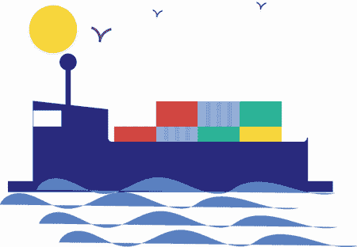
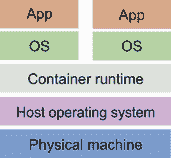
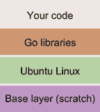
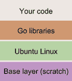

# 7 容器化部署

本章涵盖

+   在多台机器上构建标准化的应用程序部署方式

+   使用 Buildpacks 构建针对托管基础设施优化的容器

+   使用 Dockerfile 自定义部署

+   将容器部署到托管环境中

+   为本地开发组织容器

“听着，我明白这个项目现在正在取得一些进展，但我们需要能够尽快与之集成。旧服务是我们所做的一切的中心，所以你需要给我们提供关于如何运行你已有的内容的文档，”卡罗尔说。你刚坐下吃午饭，她就坐在了同一张桌子上。卡罗尔现在已经在移动应用团队担任团队领导多年。她管理得非常严格，不喜欢惊喜——比如你的项目经理让你负责开发。

“如果它是你在生产中使用的确切系统并且可以在本地使用，那就太好了。”这很重要。让系统在你的机器上与在生产中一样工作是非常大的。当然，你可以把你的团队指向你在仓库上发布的二进制文件，但你的二进制文件是为 Linux 编译的，而不是为 macOS 或 Windows 编译的，这是移动应用团队使用的。你需要一个更通用的东西。

你能做什么？你如何以统一的方式在任何环境中交付产品？你如何确保它运行高效且安全？答案是容器。

如果你看看高速公路上行驶的一些卡车，你会在后面看到一个大型的金属货运集装箱。这些就是在港口的码头和火车后面的集装箱。它们都是相同的 ISO 标准集装箱，符合 ISO 标准 668:2020，尺寸为 8 英尺宽，20 或 40 英尺长，8 英尺 6 英寸高。这种标准化使得物品可以通过所有这些不同的车辆轻松运输，如图 7.1 所示。



图 7.1 容器船有一个平坦的表面，可以同时移动许多集装箱。

在这些容器发明之前，船只、卡车和火车有散装货物或基本上是松散捆绑、非标准容器，如桶和箱子。试图为这些物品找到空间变成了一道复杂的谜题，并且需要额外的体力劳动来将物品从一个车辆移动到另一个车辆。转向容器使得运输产品在一种使货物运输变得容易和高效的方式上实现了标准化。

如果考虑到操作系统和计算机架构的状态，今天发布软件常常会感觉像散装货物。假设我们想要编写支持 Linux、macOS 和 Windows，并且能在 32 位或 64 位的 Intel 或 ARM 架构上运行的代码。我们需要发布多少个二进制文件？如果我们考虑三个操作系统和四种架构，我们将需要构建和运行 12 个不同的二进制文件，以适应特定的机器。这变成了航运业所面临的非标准桶和箱子的相同问题，并且常常成为“在我的机器上它工作”这个梗的受害者。如前所述，我们希望我们在构建的项目和发布的产品中保持一致性。

我们如何解决这个问题？与航运业一样：使用容器。

## 7.1 容器是什么？

为了更好地理解容器的工作原理，我们需要简要概述操作系统的工作方式。操作系统的工作是管理物理机器内的各种资源。这包括在内存或硬盘上存储信息或决定要执行哪些程序。*容器*是一个封装的操作系统，它是*虚拟化*的，这意味着它运行在不需要直接使用物理机器的机器上。这个*虚拟机*与底层操作系统协同工作，以运行各种应用程序。容器运行时是与主机操作系统协同工作的虚拟机，它们共享相同的*内核*，即选择哪些应用程序运行的服务。这些抽象层使我们能够隐藏底层实现层，如图 7.2 所示。



图 7.2 应用程序在容器内与操作系统协同工作，并与容器运行时进行交互。运行时随后作为主机操作系统中的一个进程运行，就像任何其他应用程序一样。

注意：在这本书中，我们使用了一些更受欢迎的容器工具之一：Docker。或者，你也可以使用 Podman，它正在变得越来越受欢迎。

这对你意味着什么？当我们创建一个容器时，我们创建了一个在给定运行时上运行的标准化格式。容器是由*镜像*或系统应呈现的快照构建的。你可以将其视为一种模板或已保存的文件，该文件在系统上加载并运行。单个镜像可以用来创建许多容器。这些镜像是为特定运行时定义和构建的，就像我们的应用程序二进制文件一样，但运行时允许我们的容器在任何实现此规范的地方运行。目前，对于大多数开发者来说，最常用的运行时是 Docker，以至于 Docker 和容器经常被互换使用（就像称呼纸巾为 Kleenex 一样），但容器规范有许多不同的实现。

你可能会想，“这对你们来说意味着什么？”嗯，正如你可以想象的那样，随着你们公司的成长，你们可能不会所有人都使用 Go。可能会引入 Python 或 JavaScript。或者你们可能有数据库和队列系统这样的依赖。所有这些组件都需要配置和设置。如果你在 Go 中工作，你可能不想为了与另一个团队的产品集成而麻烦地安装 Python。你也不想你的开发者们浪费宝贵的时间去安装或更新到 Postgres 的最新版本。相反，你可以依赖 Docker 来帮助管理、维护和运行所有这些依赖。这让你可以腾出时间专注于你的开发。

因为 Docker 是容器的通用运行时，许多开发者会在他们的机器上安装它，以帮助他们统一运行他们的应用程序和应用程序依赖。但是当你离开你的主机机器，想要将你的容器发送到托管环境时，你可能会发现还有其他方法来优化和构建你的容器，以便它们在该环境中更有效地运行。有一个笑话，“云”只是别人的机器。这个笑话，尽管如此，是真实的。它只是某个地方的其他机器，由于许多不同的云提供商在构建和实施他们的硬件和自定义运行时，有时构建针对他们运行时的优化镜像会更好。这可以通过使用他们的基础镜像或让他们帮助你构建镜像来实现，这被称为*Buildpacks*。

## 7.2 什么是 Buildpack？

在第四章中，我们使用 Google Cloud 中的 PaaS 框架部署了我们的应用程序。在这两次部署中，我们都不需要关注这些应用程序是如何运行的或在哪里运行的；它们被抽象化了。然而，我们可以想象这一切是如何工作的。在所有事情的最底层是运行代码的物理机器，但是有虚拟化和抽象的层。作为开发者，你不需要担心像安全补丁和内核升级这样的问题；只需专注于你的代码。有一些隐藏的魔法决定了你运行什么代码以及如何部署它，然后它突然就工作了。

云只是别人的电脑。

Buildpacks 以非常相似的方式工作，并且与许多 PaaS 在底层的工作方式密不可分。实际上，这项技术最初是在 2011 年由 Heroku 开发的，并被 Pivotal 和 Google 等公司用于帮助他们运行他们的 PaaS。概念很简单：你提供代码，他们会构建镜像。在底层，PaaS 根据他们的平台需要的库和依赖项构建自定义镜像，以便尽可能高效地运行代码，并在他们的托管环境中将它们作为容器部署。这为你提供了弹性和实质性的正常运行时间，并且他们可以通过运行隔离的、安全的和可维护的应用程序来最大限度地利用他们的硬件。

如果您正在构建应用程序，构建包将为您提供许多功能，这些功能将使您的应用程序更加健壮，例如高级缓存、多进程、语言检测等等。最近的构建包变革性概念是*云原生构建包*，它允许您作为开发者利用类似于 PaaS 的生态系统来构建应用程序，同时使用容器的便携性。

构建包内部发生了什么？当触发构建包时，它将经历两个阶段：检测和构建。当触发构建时，构建包会分析您的源代码，首先确定它是否可以识别源代码并构建容器；这被称为检测阶段。在我们的情况下，它将寻找 Go 文件或一个`.mod`文件。如果我们正在构建一个 JavaScript 应用程序，它将寻找一个`package.json`文件，或者如果是一个 Java 应用程序，它将寻找一个`pom.xml`文件。

当进入构建阶段时，构建包将确定运行时应该是什么，库应该如何构建，依赖项的安装，以及应用程序本身的编译和运行。它是通过使用一个*构建器*来做到这一点的，这是一个专门用于基于前一步检测创建应用程序的镜像。镜像的构建和运行是通过一个*栈*来完成的，它结合了构建和运行环境。

Docker 只是一个容器运行时。还有许多其他不那么受欢迎的容器运行时。

所有这些都可以让不同的团队为识别和构建特定于其运行时和环境的应用程序创建一个流程。这意味着 Google、Amazon、Heroku 和 Microsoft 可以构建自己的容器运行时，这些运行时针对其硬件进行了优化，您可以通过使用他们的构建包来利用这种性能。让我们用 Google 试试。

## 7.3 让我们构建一个容器

首先，我们将使用构建包在本地上构建和运行我们的容器。然后我们将使用相同的过程将容器部署到生产环境中。随后，我们将使用自己的定义构建自己的容器，并将其部署。这样，您将了解如何构建和维护自己的容器化部署和本地开发。首先，我们必须安装我们的容器运行时，在这种情况下，是 Docker。

根据您的操作系统，Docker 有三种不同的安装类型，因此最好遵循最适合您的说明。说明可以在[`docs.docker.com/get-docker/`](https://docs.docker.com/get-docker/)找到。这将为我们提供容器运行时。现在我们需要创建一个容器。为此，我们将使用构建包并安装`pack`，这是一个由 Cloud Native Buildpacks 构建和维护的工具。可以通过遵循[`buildpacks.io/docs/tools/pack/`](https://buildpacks.io/docs/tools/pack/)中的说明来安装。

`pack`将帮助我们使用定义的构建包选择和构建我们的应用程序到一个容器中。为了演示这一点，让我们看看`pack`建议我们使用什么来构建我们的应用程序。输入`pack builder suggest`并查看出现的选项：

```
Google:              gcr.io/buildpacks/builder:v1    Ubuntu 18 base image
    with buildpacks for .NET, Go, Java, Node.js, and Python
Heroku:              heroku/buildpacks:18            Base builder for 
    Heroku-18 stack, based on ubuntu:18.04 base image
Heroku:              heroku/buildpacks:20            Base builder for 
    Heroku-20 stack, based on ubuntu:20.04 base image
Paketo Buildpacks:   paketobuildpacks/builder:base   Ubuntu bionic base image
    with buildpacks for Java, .NET Core, NodeJS, Go, Python, Ruby, NGINX and
    Procfile
Paketo Buildpacks:   paketobuildpacks/builder:full   Ubuntu bionic base image
    with buildpacks for Java, .NET Core, NodeJS, Go, Python, PHP, Ruby, 
    Apache HTTPD, NGINX and Procfile
Paketo Buildpacks:   paketobuildpacks/builder:tiny   Tiny base image (bionic 
    build image, distroless-like run image) with buildpacks for Java Native 
    Image and Go
```

注意，这些 pack 并不是针对特定语言的，而是为多种语言提供了一个广泛的基础。你也可能注意到，这些语言是 Google 上支持 FaaS 和 PaaS 提供的语言。这是因为在我们底层，我们的 FaaS 和 PaaS 是在使用 Buildpack 的容器中运行的。现在，让我们通过输入以下内容来构建我们的应用程序：

```
pack build hello-api --builder gcr.io/buildpacks/builder:v1
```

让我们看看它做了什么。构建器识别出我们的应用程序是一个来自我们的模块文件的 Go 项目，并寻找一个`main`包来运行。如果你有多个`main`函数，可以进行一些配置。每个 Buildpack 都将有自己的配置。要查看我们的容器是如何运行的，输入

```
docker run hello-api
```

你应该看到你的服务器正在运行。调用你的翻译端点，看看你的应用程序正在一个整洁、便携的包中运行。现在，既然你可以构建一个容器，让我们发布它，以便其他人可以使用它。

## 7.4 将容器构建添加到您的管道中

现在我们希望将这个容器构建作为一个工件通过我们的发布版本提供，就像我们为我们的二进制文件所做的那样。如果我们已经有了二进制文件，为什么我们还需要容器呢？记住容器是什么：一个独立于底层操作系统的应用程序通用运行时。由于我们的其他开发团队希望使用我们的应用程序，我们可以简单地与他们共享一个容器，这样他们就不需要担心依赖项、库或运行时。这样，他们不需要对 Go 有任何底层知识，甚至不需要知道如何启动我们的应用程序，而是可以像运行其他任何应用程序一样运行容器。他们甚至不需要构建我们的容器；我们可以在一个*注册表*中为他们提供它。

*容器注册表*只是一个用于存储为容器创建的镜像的存储区域。Docker 上的默认注册表是`hub .docker.com`，在那里你可以找到各种可用的镜像。注册表中的每个项目都可以被拉取来运行或用作其他镜像构建的*基础*镜像。就像乐高积木一样，镜像可以堆叠在一起来构建产品。从该镜像启动容器的称为*基础*。图 7.3 显示了这是如何工作的。



图 7.3 容器层

在底部，你有一个像操作系统这样的镜像。这个层可以成为另一个层的基础，比如语言层。然后你可以使用这个层来构建你的应用程序。这些层可以随着时间的推移而累积并变得复杂，但它们都存储在这个注册库中。当你运行一个容器时，你通常更愿意从注册库中拉取它，而不是自己构建它。注册库可以作为你和其他人存储和运行容器的私人场所。在本章中，我们将把我们的应用程序发布到两个存储库：一个用于公共消费，一个用于我们在 Google Cloud 中运行。由于我们现在可以使用 Buildpack 构建容器，我们可以将容器发布到注册库。

为了发布我们的容器，我们希望将其添加到我们的管道中，以便它能够持续交付。打开你的`pipeline.yml`文件，并使用以下列表中的代码添加一个容器构建部分。

列表 7.1 `pipeline.yml`

```
containerize-buildpack:
    name: Build Container buildpack
    runs-on: ubuntu-latest
    needs: test                                                              ❶
    steps:
    - name: Check out code into the Go module directory
      uses: actions/checkout@v2
    - name: Install Pack
      run: (curl -sSL "https://github.com/buildpacks/pack/releases/download/
      v0.21.1/pack-v0.21.1-linux.tgz" | sudo tar -C /usr/local/bin/ 
      --no-same-owner -xzv pack)                                             ❷
    - name: Build
      run: pack build gcr.io/${{ secrets.GCP_PROJECT_ID }}/hello-api:latest 
      --builder gcr.io/buildpacks/builder:v1                                 ❸
    - name: Set up Cloud SDK
      uses: google-github-actions/setup-gcloud@master
      with:
        project_id: ${{ secrets.GCP_PROJECT_ID }}
        service_account_key: ${{ secrets.gcp_credentials }}
        export_default_credentials: true
    - name: Configure Docker
      run: gcloud auth configure-docker --quiet                              ❹
    - name: Push Docker image to GCP
      run: docker push gcr.io/${{ secrets.GCP_PROJECT_ID }}/hello-api:latest ❺
    - name: Log in to the GHCR
      uses: docker/login-action@master                                       ❻
      with:
        registry: ${{ env.REGISTRY }}
        username: ${{ github.actor }}
        password: ${{ secrets.GITHUB_TOKEN }}
    - name: Tag for Github                                                   ❼
      run: docker image tag gcr.io/${{ secrets.GCP_PROJECT_ID }}/hello-api
      :latest ${{ env.REGISTRY }}/${{ env.IMAGE_NAME }}:latest
    - name: Push Docker image to GHCR                                        ❽
      run: docker push ${{ env.REGISTRY }}/${{ env.IMAGE_NAME }}:latest
```

❶ 仅在源代码通过单元测试后构建我们的容器

❷ 通过 curl 安装 Pack 到我们的构建阶段

❸ 使用 pack 命令构建针对 GCP 的容器

❹ 配置 Docker 使用 GCP 作为容器注册库

❺ 将容器推送到 GCP 注册库

❻ 登录到 GitHub 容器注册库

❼ 为 GitHub 重命名镜像

❽ 将新标签推送到 GitHub 容器注册库

如果你提交并推送了你的更改，你应该会在你的工件页面上看到一个新的容器。为了测试这一点，我们可以简单地执行以下操作：

```
docker run ghcr.io/holmes89/hello-api:latest
```

现在你已经自动构建并推送了你的容器，我们需要运行它们。为此，我们将使用容器运行时。

## 7.5 部署到容器运行时

我们使用 Buildpack 创建了一个容器。我们已经将容器发布到了 Google 容器注册库。现在让我们部署我们的容器。使用容器运行时有什么优势？我们为什么要经历所有这些？

在这本书中，我们第一次在云中运行应用程序和在我们机器上运行应用程序的方式之间有一个转折点。我们的容器现在运行在通用运行时中。这是我们能够达到的本地运行与云中运行最接近的抽象。这是一个强大的工具，因为它解决了“它在我的机器上运行”和“我在这个框架上挣扎”的问题。这就是为什么容器在今天的开发过程中如此受欢迎的解决方案。

一个著名的（或臭名昭著的）容器编排工具是 Kubernetes，它为开发者提供了在弹性、集群环境中部署基于容器的应用程序的工具。这是一个庞大、复杂且强大的工具。Kubernetes 超出了本书的范围，但我在这里提到它，因为它是我们将使用的某些其他容器运行时的基础。这些容器位于 Google Cloud Run 和 FaaS 等产品的底层；你无法看到容器，但它确实存在。Google 使用 Kubernetes 在隔离过程中为你运行容器，但你不需要担心维护集群、编写部署和设置传入请求。相反，你遵循一个模式并部署容器，Google 会处理其余部分。

在图 7.4 中，我们可以看到我们继续朝着更少的抽象和更多对我们部署过程的控制迈进。我们现在可以定义容器，并在通用运行时中运行它。我们将使用 Google Cloud Run，但同样可以轻松地将此产品部署到 AWS ECS 或 Kubernetes 集群。


图 7.4 我们现在使用我们的容器作为我们的可交付产品。

现在，我们可以像完成迄今为止的所有其他部署一样轻松地设置容器部署。我们只需要打开我们的`pipeline.yml`文件，并添加以下列表中的代码。

列表 7.2 `pipeline.yml`

```
deploy-container:
    name: Deploy Container buildpack
    runs-on: ubuntu-latest
    needs: containerize-buildpack
    if: ${{ github.event_name == 'push' && github.ref == 'refs/heads/main' }}
    steps:
    - name: Deploy to CaaS
      id: deploy
      uses: google-github-actions/deploy-cloudrun@main
      with:
        service: translate                                              ❶
        image: gcr.io/${{ secrets.GCP_PROJECT_ID }}/hello-api:latest    ❷
        credentials: ${{ secrets.gcp_credentials }}
    - id: test                                                          ❸
      run: curl "${{ steps.deploy.outputs.url }}/hello"
```

❶ 这是你要部署的服务名称。

❷ 你要部署的镜像的路径

❸ 验证端点是否工作

## 7.6 编写自己的镜像

如果你不希望 Buildpack 容器中有所有额外的内容怎么办？记住，Buildpack 的结构是为了在容器化环境中运行良好，它包含底层库、配置和服务，所有这些都有助于你的产品在它们的运行时中良好运行。但是，随着这些库的出现，也会带来一些额外的开销，在这种情况下，是空间。对于已部署的环境，这可能不是什么大问题，但如果我们想让它更小或调试信息呢？

为什么更小？对于一个开发团队来说，拥有较小的镜像或为调试目的的特殊开发镜像可能是有意义的。在两种情况下，我们都不能依赖 Buildpack 抽象来为我们完成这项工作，因此我们需要定义我们的 Dockerfile 来构建它们。

Go 的美丽之处在于它编译成二进制文件，并且在大多数情况下不需要依赖外部库来运行。这意味着你可以创建一个二进制文件并将其放置在可能的最小基础镜像上。*基础镜像*是我们构建容器的起点。如果你查看不同的容器定义，你会找到 Ubuntu、Debian、Windows 等镜像。这些镜像是由安装安全补丁、升级、库以及在某些情况下应用程序的团队构建和维护的。这样，你可以运行像 Postgres 这样的东西，而无需在你的机器上安装它，或者使用 Go 的基础镜像，这样你就不需要安装 Go。让我们通过创建一个 Dockerfile 来了解一下这是如何工作的。在你的目录根目录下输入`touch Dockerfile`。以下列表显示了结果。

列表 7.3 Dockerfile

```
FROM golang:1.18 AS deps               ❶

WORKDIR /hello-api                     ❷
ADD *.mod *.sum ./
RUN go mod download                    ❸

FROM deps as dev                       ❹
ADD . .                                ❺
EXPOSE 8080
RUN CGO_ENABLED=0 GOOS=linux go build -ldflags "-w -X main.docker=true" \
    -o api cmd/main.go                 ❻
CMD ["/hello-api/api"]

FROM scratch as prod                   ❼

WORKDIR /
EXPOSE 8080
COPY --from=dev /hello-api/api /       ❽
CMD ["/api"]
```

❶ 使用 Go 最新版本的基镜像

❷ 创建一个工作目录来存储源代码

❸ 只复制模块文件并下载依赖项。将此步骤放在其自己的步骤中允许缓存和加快未来的构建。

❹ 创建一个新的构建阶段以使用缓存能力

❺ 添加剩余的源代码

❻ 使用容器优化的标志构建二进制文件。我们不会使用这个构建标志，但编译器会使用。

❼ 使用最小的基础镜像

❽ 从开发阶段复制二进制文件

然后，我们可以通过输入`docker build -t hello-api:min .`来构建我们的镜像，对于我们的开发镜像`docker build -t hello-api:dev --target dev .`。现在两个镜像都构建好了，让我们比较一下它们的大小！我们可以简单地输入`docker images`，你会看到你的三个镜像定义、它们的标签、它们的大小以及它们构建的时间：

```
hello-api               dev            78b80879b282   4 minutes ago   962MB
hello-api               min            64d767be4d62   4 minutes ago   4.74MB
hello-api               latest         a6052d265459   41 years ago    129MB
```

哇！我们的开发镜像显然是最大的，但我们的最小镜像只有 Buildpack 镜像的 3%大！为什么是这样？我们之前讨论了容器是如何工作的。每个镜像都是基于另一个镜像的。每次构建一个新的容器时，都会在你的镜像中添加一个层。当你作为构建的一部分拉取镜像时，你可以看到这一点。在最底层是所有镜像都从中来的非常基础镜像，如图 7.5 所示。它被称为`scratch`，是完全空的，所以你的应用程序需要是自包含的——就像我们的 Go 二进制文件一样！这意味着我们可以将我们的二进制文件复制到`scratch`镜像中，并且它将与运行时交互来运行，就像任何其他容器一样，但没有冗余。这样，你不必担心过时的库或安全补丁。然而，你不能调试，因为没有命令行。这是一个权衡，但它可以非常有助于将应用程序分发到其他用户。



图 7.5 容器使用层来帮助构建镜像。层越多，你的镜像就越大，并且安全漏洞也越多。

现在，让我们将这些容器添加到我们的管道中，并使用以下列表中的代码将它们发布到我们的注册表中。

列表 7.4 `pipeline.yml`

```
containerize:
    name: Build Containers
    runs-on: ubuntu-latest
    needs: test
    steps:
    - name: Check out code into the Go module directory
      uses: actions/checkout@v2
    - name: Build Min
      run: docker build -t ${{ env.REGISTRY }}/${{ env.IMAGE_NAME }}:min .  ❶
    - name: Build Dev
      run: docker build -t ${{ env.REGISTRY }}/${{ env.IMAGE_NAME }}:dev 
      ➥ --target=dev .                                                     ❷
    - name: Log in to the GHCR
      uses: docker/login-action@master                                      ❸
      with:
        registry: ${{ env.REGISTRY }}
        username: ${{ github.actor }}
        password: ${{ secrets.GITHUB_TOKEN }}
    - name: Push Docker min image to GHCR                                   ❹
      run: docker push ${{ env.REGISTRY }}/${{ env.IMAGE_NAME }}:min
    - name: Push Docker dev image to GHCR                                   ❺
      run: docker push ${{ env.REGISTRY }}/${{ env.IMAGE_NAME }}:dev
```

❶ 构建最小镜像并为其打标签

❷ 使用“dev”作为构建目标构建开发镜像

❸ 登录到 GitHub 容器注册表

❹ 将最小镜像推送到注册表

❺ 将开发镜像推送到注册表

当你的代码被推送到服务器后，你现在应该能看到你有三个不同的容器。当我们开始为稳定版本打标签时，这会变得非常有帮助。目前，这些可以被视为我们的最新构建版本，并用于测试可能不稳定的新功能。现在，我们正在分发容器，我们可以将它们集成到我们的开发过程中，其他人也可以这样做。

## 7.7 本地环境组织

你有一个容器化的服务。你正在为其他开发者使用它。但是你的开发也在依赖其他服务。容器能为你开发分发提供帮助吗？

当你开始在你开发环境中使用容器的道路时，你会发现诸如环境变量、端口号和运行时参数等问题可能会变得有些繁琐。你会发现你正在回到重启容器并忘记它的配置。或者你可能发现运行你应用程序的完整集成可能需要多个容器。这就是像 `docker-compose` 这样的工具可以提供帮助的地方。`docker-compose` 是一个用于运行和组织多个容器的工具。通过编写一个简单的 YAML 文件，你将能够在简单、通用的环境中构建和运行容器。正如本书中一直强调的那样，拥有简单易用的工具来帮助开发者是非常重要的。这个组合文件甚至可以通过组织我们的构建参数集成到我们的 CI 管道中。

首先，让我们安装 Docker Compose。如果你使用的是 Mac 或 Windows，那么你很幸运！它已经作为 Docker Desktop 安装的一部分被安装了。如果你使用的是 Linux，你需要按照以下简单的安装步骤进行：[`docs.docker.com/compose/install/`](https://docs.docker.com/compose/install/)

安装完成后，您可以通过输入 `docker-compose` 来找到要使用的命令列表。在这里，您将看到构建、创建和运行服务或命令的选项。Compose 需要存在一个 `docker-compose.yml` 文件才能工作。它将逐步检查父目录，直到找到一个合适的文件。这个 YAML 文件专门结构化，为每个服务提供一个独特的名称以供引用，包括镜像名称、参数以及许多其他选项，以帮助开发者配置他们的容器以启动。文件中使用的名称还可以作为 `docker-compose` 构建的内部运行网络的 DNS 条目，允许服务在需要时相互引用。我们将在后续章节中探讨这一点。现在，我们将创建一个基本的文件来创建我们的容器。在项目的根目录中创建并打开 `docker-compose.yml`，然后添加以下列表中的代码。

列表 7.5 `docker-compose.yml`

```
version: "3.8"
services:
  api-min:                                    ❶
    profiles: ['prod']                        ❷
    image: ghcr.io/holmes89/hello-api:min     ❸
    port: 8080:8080
    build: .
  api-dev:                                    ❹
    profiles: ['dev']                         ❺
    image: ghcr.io/holmes89/hello-api:dev     ❻
    port: 8080:8080
    build:
      context: .
      target: dev                             ❼
```

❶ 指定服务的名称，供内部使用

❷ 将服务标记为生产组的一部分，以进行定向部署和构建

❸ 你希望用于此服务的镜像

❹ 将开发服务目标分离，用于调试目的

❺ 将服务标记为开发组的一部分，以提供额外的测试功能

❻ 你希望用于此服务的镜像

❼ 如果您使用此服务构建 Docker 镜像，请指定目标

我们可以看到，我们在 `docker-compose` 中定义了我们的两个构建，这使得我们可以简单地输入 `docker-compose build api-min` 来构建我们的最小文件。试试看！此外，我们还添加了配置文件的概念，这有助于我们的应用程序增长。尝试使用 `docker-compose --profile prod up` 来查看最小文件启动。也可以用你的 `dev` 配置文件试试。

一旦我们添加了依赖项和高级测试，这将会变得很重要，但到目前为止，我们将使用它来发布。现在我们可以更新我们的管道，使其引用我们的 compose 文件，而不是直接将配置烘焙到构建命令中。这将随着我们开发工作的进行而节省我们时间和精力。

现在我们已经成功部署了一个帮助我们构建应用程序并运行的工具，我们准备扩展我们的能力。我们可以缓慢而高效地开始构建我们的应用程序及其依赖项，以便于本地开发。由于我们使用的是相同的工件，我们可以确保我们的服务在机器上与部署环境中的表现一致。我们的 compose 文件可以作为我们基础设施的松散定义，我们最终可以将其调整为满足我们的需求，就像我们的生产环境一样。这种服务之间的松散耦合使我们能够专注于我们的代码，而不是试图关注基础设施。

## 7.8 容器，到处都是容器

容器很受欢迎，我相信你可以看到原因。可移植性和简单性在开发世界中是颠覆性的。现在，整个操作系统可以与产品一起发货，用户端的设置最小。整个基础设施和系统都是使用容器构建的。它们作为云应用程序、构建系统和甚至机器人运行。这是软件开发的高峰，对吧？

并非如此。我们通过容器获得的收益当然对开发者和开发者体验有所帮助，但有时可能是多余的。正如我们在前面的章节中看到的，有时软件可以被编写成执行所有你需要做的简单函数。或者你可以有一个简单的应用程序，它托管在共享平台上。容器可能隐藏在这些技术的大多数表面之下，但开发者可能不需要使用它们。构建和维护容器意味着你需要负责诸如升级、安全补丁以及如何最佳构建你的应用程序等问题。这本身可能会产生复杂性。

技术中没有银弹，所以总是要警惕那些宣扬相反观点的人。在采用容器之前，考虑运行和构建容器的技术成本。产品的可移植性是最重要的方面。如果你发现自己正在与容器作斗争，你可能用错了它。记住，每件事都有权衡。在采用技术之前，你需要考虑它们。在这种情况下，由于你正在运行虚拟机，容器可能不是高性能应用程序实例的最佳解决方案。容器可以在干净的环境中运行测试，但测试不应该依赖于容器在本地运行。

但是，正如我们将在接下来的章节中看到的，容器在开发周期中也有其位置，并且可以帮助我们提高生产力。一如既往，与你的团队一起工作，找到最适合你的方法。

## 摘要

+   容器提供了一个与本地操作系统的抽象层，以帮助创建适用于应用程序的通用运行时。

+   Buildpacks 专注于创建在托管平台上高效运行的容器。

+   使用容器运行时，你可以在本地以及生产环境中使用你的容器。
