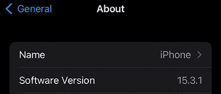

# 8 配置管理和稳定发布

本章涵盖

+   创建配置管理以更改应用程序功能

+   探索配置管理的不同选项

+   使用配置功能标志隐藏新或不完整的功能

+   通过发布说明和版本控制来传达软件更改

“我实在看不出我们如何在测试的同时安全地推出这个版本，或者我们如何在感到舒适后轻松切换到新系统，”质量保证负责人在一次启动会议上说。“我的意思是，我们对自动化测试很满意，它已经捕捉到一些错误，但我们还不能批准将其发布到野外。”

“尽管如此，我们不能就这样放着。我们需要能够证明这次重写是值得的。我们已经证明我们可以快速做出改变并频繁发布，但我们需要一些真实流量来看到这将如何保持，而我们唯一能这样做的方式就是开始让我们的客户使用它。”此时，你的项目经理已经非常沮丧。你刚刚经历了一次整个发布计划会议，而且感觉质量保证又一次阻止了任何进展。

但当你坐下来时，你必须感觉到 QA（质量保证）有道理。我们不确定在不同负载下它会如何运行，我们也不确定它在我们整个生态系统中的运作方式。你提到了这一点，但当你的项目经理给你一个侧目时，你开始提出解决方案而不是指出问题。

你提到新系统依赖于旧系统进行翻译，而我们数据库中目前没有这些翻译。你还提到，你系统的当前存储设备只是一个内存中的键值存储——如果你想让它在生产中运行，这肯定是你需要改变的事情。

“正是我的观点：在我们甚至开始测试并在生产中签字批准之前，需要发生太多的变化，”质量保证部门的人插话道。

你耐心地纠正他们。“不，我们将继续发布，但一旦我们确定一切按预期工作，我们将慢慢过渡。同样，你将只发布一个二进制文件，但它将能够根据各种设置进行更改。”

“我们需要列出我们想要开始集成的项目，以便上线。”你的项目经理站起来，拿起一支记号笔，写下以下内容：

+   更改 API 端口。

+   为旧系统添加更改客户端端点的功能。

+   关闭客户端调用。

+   添加一个数据库用于长期存储。

“你认为你能在一周内完成吗？我们需要尽快开始，”你的项目经理说。你点头；使用配置管理，你可以构建一个系统，你可以用它来开启和关闭各种功能。

## 8.1 配置

所有程序都处理两件事：输入和输出。程序接收数据并输出数据。有些程序只会打印“Hello World！”（这是输出）。有些程序只会读取日志消息并将它们存储在数据库中（这是输入）。但你可以想象向应用程序提供输入以改变其功能。

以一个计数器应用程序为例。它可能看起来像以下列表中的代码。

列表 8.1 `main.go`

```
package main

import (
    "bufio"
    "fmt"
    "os"
)

func main() {
    fmt.Println("Welcome to advanced counter. Press Enter to increment value.")
    reader := bufio.NewReader(os.Stdin)
    count := 0
    for {
        fmt.Printf("Count is: %d\n", count)
        _, _ = reader.ReadString('\n')
        count++
    }
}
```

这很简单，但是如果我们想让它每次增加的不是一，而是二，那么我们就需要将行 `count++` 改为 `count = count + 2`。太棒了！但现在你想要每次增加 100。我希望你能看到我们在这里要走向何方。这既不可扩展，也无法转移到其他用例中。如果我们能只用一段代码来做这件事，而且每次都不需要重新编译，那会怎么样？我们可以在应用程序启动时提供输入，这将影响其输出。这种用于改变功能的输入被称为*配置*。为了配置此应用程序，我们将使用所谓的*环境变量*：存储在您的终端会话中的变量。在接下来的章节中，我们将探讨其他配置技术。

为了允许配置，我们将使用以下列表中的代码。

列表 8.2 `main.go`

```
package main

import (
    "bufio"
    "fmt"
    "os"
    "strconv"
)

func main() {
    fmt.Println("Welcome to advanced counter. Press Enter to increment value.")
    reader := bufio.NewReader(os.Stdin)
    count := 0
    inc, err := strconv.Atoi(os.Getenv("INC"))
    if err != nil {
        fmt.Println("invalid incrementor, defaulting to 1")
        inc = 1
    }

    for {
        fmt.Printf("Count is: %d\n", count)
        _, _ = reader.ReadString('\n')
        count += inc
    }
}
```

如果你运行这段代码，你会看到警告信息，但如果你运行类似 `INC=2 go run counter.go` 这样的命令，你会看到值以二为增量增加。这看起来很简单，但非常有价值，特别是对于像

+   数据库连接信息

+   密码盐

+   客户端端点

+   日志级别

备注：我们将构建我们的配置管理工具。然而，你可以使用流行的 Viper 库以这种方式管理配置。

我们如何将配置添加到我们的 API 中？我们能否以不同的方式管理配置？

## 8.2 高级配置

对于我们的应用程序，我们将通过加载各种配置来调整应用程序的功能。首先，让我们确定我们想要修改的功能：

+   自定义端口号

+   存储类型（数据库、内存）

+   存储连接信息（如果是数据库）

+   外部客户端端点（如果没有，则不调用）

让我们定义一个结构体，我们可以在应用程序中传递。创建一个新的包名为 `config`，在其中创建一个名为 `core.go` 的文件。在那里，我们将定义一个结构体，如下所示。

列表 8.3 `core.go`

```
type Configuration struct {
    Port            string `json:"port"`                ❶
    DefaultLanguage string `json:"default_language"`
    LegacyEndpoint  string `json:"legacy_endpoint"`     ❷
    DatabaseType    string `json:"database_type"`       ❸
    DatabaseURL     string `json:"database_url"`        ❹
}
```

❶ 将端口号存储为字符串，但我们将稍后在适当格式中验证它。

❷ 这是我们的客户端调用的端点，如果它不是空字符串，则可以注入。

❸ 主动传递数据库类型以供未来增强

❹ 这与旧端点类似，如果它是空的，我们将使用内存数据库。

注意我们在结构体上使用了 JSON 文本装饰器。这是因为我们将以三种不同的方式加载我们的配置：

+   使用环境变量

+   使用文件

+   使用标志

通常，这些是配置应用程序的三个最常见方法。还有其他方法，但我们主要关注这些。通过在我们的配置周围定义一个核心结构，我们可以创建一个通用函数，这将允许我们通过这些步骤来配置我们的系统。首先，我们通过环境加载我们可以加载的任何变量，然后从 JSON 文件中覆盖它们，最后依赖于标志将信息加载到我们的应用程序中。

让我们编写一个加载函数，使其以这种方式工作。首先，我们可以提出一组起始值，我们将称之为`defaultConfiguration`。我们的默认配置可以像以下列表那样。

列表 8.4 `core.go`

```
var defaultConfiguration = Configuration{
    Port:            ":8080",                ❶
    DefaultLanguage: "english",
}
```

❶ 创建一个仅包含端口号的基本结构作为默认值

给定这种默认状态，我们可以添加各种更改配置的方法。

### 8.2.1 环境变量

环境变量存储在系统的用户会话中。这些值可以是硬编码的，也可以通过在命令前添加变量来传递给应用程序。这是一种在系统启动前注入值到系统中的简单方法，如果系统反复调用环境变量，也可以动态使用。我们将在`configuration`结构体中添加一个方法来从环境中加载变量，然后使用以下列表中的代码将它们返回给调用方法。

列表 8.5 `core.go`

```
package config

import "os"
...

// LoadFromEnv will load configuration solely from the environment
func (c *Configuration) LoadFromEnv() {
    if lang := os.Getenv("DEFAULT_LANGUAGE"); lang != "" {      ❶
        c.DefaultLanguage = lang
    }
    if port := os.Getenv("PORT"); port != "" {
        c.Port = port
    }
}
```

❶ 内联检查语言是否在 ENV 中设置，然后更新结构体的变量。

我们正在检查两个变量，`DEFAULT_LANGUAGE`和`PORT`。如果它们被设置，我们将覆盖配置设置；否则，我们将使用默认值。我们还引入了一个辅助方法，因为人们经常希望省略端口定义中的冒号，所以我们将创建一个方法来确保它存在并且是一个有效的数字（见以下列表）。

列表 8.6 `core.go`

```
package config

import "os"
...

// ParsePort will check to see if the port is in the proper format and a number
func (c *Configuration) ParsePort() {
    if c.Port[0] != ':' {                                         ❶
        c.Port = ":" + c.Port
    }
    if _, err := strconv.Atoi(string(c.Port[1:])); err != nil {   ❷
        fmt.Printf("invalid port %s", c.Port)
        c.Port = defaultConfiguration.Port                        ❸
    }
}
```

❶ 如果不存在，则添加一个冒号

❷ 验证字符串的值是否为整数

❸ 如果不存在，则恢复到默认端口

### 8.2.2 文件

虽然环境变量提供了一种加载配置的简单方法，但还有一种更便携的方法：通过使用文件。JSON 或 YAML 文件是存储和加载系统内配置的常见方式，并允许在不同环境之间实现便携性。常见的配置文件可以根据您的本地环境和生产环境进行修改，而无需更改底层代码。我们添加了一个新的标志，允许我们显式传递配置文件，并创建一个新的函数来解析文件并加载变量。让我们首先创建一个新的函数，通过以下列表中的代码使用 JSON 加载配置文件。

列表 8.7 `core.go`

```
import (
    "encoding/json"
    "errors"
    "io/ioutil"
    "log"
    "os"
    "strconv"
)

...

// LoadFromJSON will read a JSON file and update the configuration based 
➥ on the file.
func (c *Configuration) LoadFromJSON(path string) error {
    log.Printf("loading configuration from file: %s\n", path)
    b, err := ioutil.ReadFile(path)                              ❶
    if err != nil {
        log.Printf("unable to load file: %s\n", err.Error())
        return errors.New("unable to load configuration")
    }
    if err := json.Unmarshal(b, c); err != nil {                 ❷
        log.Printf("unable to parse file: %s\n", err.Error())
        return errors.New("unable to load configuration")
    }
    // Verify required fields
    if c.Port == "" {                                            ❸
        log.Printf("empty port, reverting to default")
        c.Port = defaultConfiguration.Port
    }
    if c.DefaultLanguage == "" {
        log.Printf("empty language, reverting to default")
        c.DefaultLanguage = defaultConfiguration.DefaultLanguage
    }
    return nil
}
```

❶ 从路径读取文件内容

❷ 将内容解析到结构体中

❸ 如果不存在，则不会覆盖现有值，但我们需要验证无效设置。

### 8.2.3 标志

有时候，用户可能希望更明确地注入变量。这在切换环境时很有用，因为环境变量可以使用`export`命令存储在会话中，例如`DEFAULT_LANGUAGE=Finnish`，并且不需要在命令前加上变量设置。使用`flags`是在运行时向服务器传递变量的常见方式。通常情况下，你在启动应用程序时在其他区域使用了标志。每次你执行`./foo -h`时，你都会向服务传递一个`h`标志，表示你需要该应用程序的帮助。我们将添加一个标志来设置端口号，这是大多数服务器提供的常见功能。

为了做到这一点，我们将创建一个`LoadConfiguration`函数，将所有配置部分结合起来（见以下列表）。我们将分层配置，请注意哪些变量可能会被覆盖。在我们的配置函数中，我们将按照以下操作顺序进行：

1.  使用默认配置。

1.  如果提供了文件，则加载文件。

1.  使用环境变量。

1.  使用标志。

列表 8.8 `core.go`

```
import (
    "encoding/json"
    "errors"
    "flag"
    "io/ioutil"
    "log"
    "os"
    "strconv"
)
...
//LoadConfiguration will provide cycle through flags, files, and finally 
➥ env variables to load configuration.
func LoadConfiguration() Configuration {
    cfgfileFlag := flag.String("config_file", "", "load configurations from 
    a file")                                                ❶
    portFlag := flag.String("port", "", "set port")

    flag.Parse()                                            ❷
    cfg := defaultConfiguration

    if cfgfileFlag != nil && *cfgfileFlag != "" {           ❸
        if err := cfg.LoadFromJSON(*cfgfileFlag); err != nil {
            log.Printf("unable to load configuration from json: %s, using 
            default values", *cfgfileFlag)
        }
    }

    cfg.LoadFromEnv()                                       ❹

    if portFlag != nil && *portFlag != "" {                 ❺
        cfg.Port = *portFlag
    }

    cfg.ParsePort()                                         ❻
    return cfg
}
```

❶ 添加标志及其描述

❷ 处理标志

❸ 检查是否传入了文件

❹ 加载环境变量

❺ 检查端口号是否已设置且不为空

❻ 解析端口号以确保其有效

我们已经构建了一个系统，允许你更改功能而不需要更改代码本身。你可以想象更大的文件，其中包含更多配置，可以用来隐藏开发中的功能或更改功能，而无需重新构建。这是一个强大的工具，可以由你的团队用来帮助构建一个健壮的产品。

## 8.3 隐藏功能

下次你坐在车里时，看看方向盘和仪表盘。你是否注意到任何看起来像按钮可以放置的塑料部件？这些被称为*空白*，用于不同类型的汽车包。这意味着同一款方向盘或控制台可以适用于所有类型的汽车，但只有特定车型会配备那些功能的按钮，如图 8.1 所示。例如，一个用于管理加热座椅的按钮。如果你购买了一款基础车型，这将是空白，但如果你购买了豪华包，它就会在那里。


图 8.1 不同车型中的塑料填充扩展槽。

这是一种功能标志的形式，你可以以相同的方式构建，但适应客户可用的功能。这种做法可以用来隐藏未付费用户（免费与付费层）的功能、仍在开发中的功能，或者你只想对少数客户进行测试的功能。

现在你已经构建了更改配置的能力，让我们更新我们的代码来使用它。在这里，我们将探索修改我们的应用程序以及修改我们的服务。在其中，你还将找到它是如何与我们依赖注入相关联并使用的。首先，我们将调整我们的端口号，然后我们将继续更新我们的客户端和存储代码。

### 8.3.1 更新端口

由于我们已经构建了我们的配置结构体，我们现在需要在主方法中加载它。为此，我们将简单地调用我们的 `LoadConfiguration` 方法。一旦我们有了配置，我们就可以开始在主二进制文件中的主函数中使用它，而不是我们的函数，以简化操作。也就是说，我们探索的所有配置更改也可以附加到我们的函数或我们正在编写的任何应用程序上。让我们看看在以下列表中更新我们的 `cmd/main.go` 文件中的端口编号看起来是什么样子。

列表 8.9 `core.go`

```
import (
    "log"
    "net/http"

    "github.com/holmes89/hello-api/config"
    "github.com/holmes89/hello-api/handlers"
    "github.com/holmes89/hello-api/handlers/rest"
    "github.com/holmes89/hello-api/translation"
)

func main() {

    cfg := config.LoadConfiguration()    ❶
    addr := cfg.Port                     ❷

....
    log.Printf("listening on %s\n", addr)

    log.Fatal(http.ListenAndServe(addr, mux))
}
```

❶ 加载我们的配置

❷ 用配置端口替换硬编码的字符串

现在让我们测试这些不同的配置更改。首先，创建一个名为 `config.json` 的配置 JSON 文件。它应该看起来像这样：

```
{
    "port": 8079
}
```

注意我们缺少一些字段。这是可以的，因为我们把默认值作为文件加载的一部分来处理。让我们运行一些不同的测试，看看我们的配置是如何起作用的：

```
go run cmd/main.go --config_file config.json
2022/03/31 14:19:44 loading configuration from file: config.json
2022/03/31 14:19:44 listening on :8079
```

太好了！现在让我们测试我们的环境变量（ENV var），它可以在类 Unix 系统的几种方式下设置。一种方式是使用 `export` 变量，然后它被存储在会话中。另一种方式是在命令之前设置变量。以下是一个示例：

```
PORT=8081 go run cmd/main.go --config_file config.json
2022/03/31 14:21:59 loading configuration from file: config.json
2022/03/31 14:21:59 listening on :8081
```

注意现在环境变量（ENV）正在优先于配置文件。最后，我们可以测试端口标志：

```
PORT=8081 go run cmd/main.go --config_file config.json --port 8082
2022/03/31 14:23:36 loading configuration from file: config.json
2022/03/31 14:23:36 listening on :8082
```

我们配置系统的三种方式都在正常工作。在这个时候，我们可以继续使用我们的配置来更改我们与外部服务的连接。

### 8.3.2 外部客户端

在第六章，我们探讨了依赖注入和接口。在第六章中，我们构建了一个静态客户端和远程客户端。在这里，我们将根据配置中是否设置了客户端 URL 来决定加载哪个客户端。为此，让我们再次打开我们的 `cmd/main.go` 文件，并添加以下列表中的代码。

列表 8.10 `main.go`

```
func main() {

    cfg := config.LoadConfiguration()

...

    var translationService rest.Translator                             ❶
    translationService = translation.NewStaticService()                ❷
    if cfg.LegacyEndpoint != "" {
        log.Printf("creating external translation 
        ➥ client: %s", cfg.LegacyEndpoint)
        client := translation.NewHelloClient(cfg.LegacyEndpoint)       ❸
        translationService = translation.NewRemoteService(client)      ❹
    }

    translateHandler := rest.NewTranslateHandler(translationService)   ❺

}
```

❶ 创建一个变量，其类型为接口，以便传递到处理器中

❷ 默认情况下创建静态服务

❸ 如果设置了旧端点，则创建一个新的客户端

❹ 将客户端插入到远程服务的创建中

❺ 将服务注入到处理器中

你应该看到我们正在使用我们的接口来帮助我们加载我们想要的客户端，并将其传递到我们的处理器中。同样，我们可以更改环境变量来影响客户端端点。设置它将允许你调用外部服务。在这种情况下，如果我们传递 URL `http://hello-api.joelholmes.dev` 并调用端点，我们希望看到它以有效的响应响应。

我们还有一些不同的功能需要构建，例如持久化存储后端（例如，数据库），但我们将它们留到下一章来处理。我们也没有将默认语言集成到我们的处理器中。我将把这个留给读者来处理。

现在我们有一些东西可以交给我们的质量保证团队进行测试，同时我们继续我们的开发工作。我们可以持续部署我们的应用程序，进行小的错误修复和变更，而不影响整体系统。现在测试可以与开发并行进行，只有在我们觉得一切按计划进行时，我们才能发布。但现在我们面临一个新的潜在问题。随着 bug 的修复和功能的开发，我们如何知道我们正在测试或发布的软件版本是什么？我们如何将这个信息传达给我们的用户和团队成员？

## 8.4 语义版本控制

为了与他人沟通他们使用的软件版本，我们将使用两个工具：版本控制和变更日志。每次更新软件时，你应该注意到有一个特殊的指示器来显示正在安装的软件版本。最常见的方法被称为*语义版本控制*。图 8.2 展示了示例。



图 8.2 iPhone 软件版本

现在我们正在发布一个产品，向用户指明他们应该使用哪个版本非常重要。通常，开发者喜欢处于发布的最前沿，因为一些新功能和问题已经被修复。然而，这也意味着你处于 bug 的最前沿。软件版本控制解决了这个问题。

这些发布通常看起来像 v1.2.3、1.2.3-e5ad2 或 1.2.3-alpha。这是为了表明关于软件稳定性和变更兼容性的信息。带有部分哈希（如上方的 e5ad2）或希腊字母（alpha、beta 等）的发布通常被称为*开发者构建*，这表明它们尚未准备好供所有人使用。发布的软件版本通常具有如图 8.3 所示的架构。


图 8.3 语义版本控制有助于区分大型可能破坏性的变更和较小的修复。这种使用的决定权在于团队，并且应该与产品的消费者沟通，因为他们可能依赖于某些功能。

正如你所见，像“主要”和“次要”这样的变化非常主观。最重要的是关注破坏性功能。如果一个端点被移除或方法调用被重新定义，那么这很可能是主要版本的变更，而错误修复或新功能可能只是小版本或补丁修复。

Git 标签是传达这类变化和将它们整合到我们的发布策略中的绝佳方式。我们希望不断整合，但可能并不总是准备好向公众发布，因此，当推送标签与推送小更改时，我们在构建过程中添加了特殊规则。在后面的章节中，我们将构建一个支持最新开发构建和向生产系统发布的部署流程。

一些 API 提供了所谓的 `/info` 端点，以帮助向开发人员和用户传达产品版本。当有人试图查看发布是否成功或可能引入了哪些错误时，`/info` 端点非常有用。让我们在我们的应用程序中添加一个。在 `handlers` 目录中，创建一个 `info.go` 文件（见以下列表）。

列表 8.11 `info.go`

```
package handlers

import (
    "encoding/json"
    "net/http"
)

var (                                            ❶
    tag  string
    hash string
    date string
)

func Info(w http.ResponseWriter, r *http.Request) {
    enc := json.NewEncoder(w)
    w.Header().Set("Content-Type", "application/json; charset=utf-8")
    resp := map[string]string{                   ❷
        "tag":  tag,
        "hash": hash,
        "date": date,
    }
    if err := enc.Encode(resp); err != nil {
        panic("unable to encode response")
    }
}
```

❶ 这些变量将通过编译过程设置。我们希望这些值与二进制文件链接，而不是通过环境变量读取，因为它们应该与二进制文件本身相关联。

❷ 将值映射到响应

让我们将此处理程序添加到 `main.go` 文件中（见以下列表）。

列表 8.12 `main.go`

```
func main() {

    ...

    mux.HandleFunc("/health", handlers.HealthCheck)
    mux.HandleFunc("/info", handlers.Info)             ❶

    log.Printf("listening on %s\n", addr)

    log.Fatal(http.ListenAndServe(addr, mux))
}
```

❶ 就像健康检查一样，我们需要将此处理程序添加到我们的服务中，但这次是在信息端点。

现在，我们需要通过我们的构建命令将这些值传递给这些变量。我们传递的信息是最新的标签信息、哈希值和构建日期。这可以帮助我们根据哈希值确定确切发生的变化，并根据构建日期确定自发布以来的一般时间。为了填充这些字段，我们需要更新我们的构建过程。打开你的 Makefile，并编辑 `build` 命令以添加一些额外的标志（见以下列表）。

列表 8.13 Makefile

```
GO_VERSION := 1.18.5
TAG := $(shell git describe --abbrev=0 --tags --always)               ❶
HASH := $(shell git rev-parse HEAD)                                   ❷

DATE := $(shell date +%Y-%m-%d.%H:%M:%S)                              ❸
LDFLAGS := -w -X github.com/holmes89/hello-api/handlers.hash=$(HASH) 
              -X github.com/holmes89/hello-api/handlers.tag=$(TAG) 
              -X github.com/holmes89/hello-api/handlers.date=$(DATE)  ❹
....

build:
    go build -ldflags "$(LDFLAGS)" -o api main.go                     ❺
```

❶ 我们使用 git 命令从我们的存储库获取最新的标签版本并将其存储为变量。

❷ 我们使用 git 命令从我们的存储库获取最新的哈希值并将其存储为变量。

❸ 我们使用 shell 获取构建的当前时间戳，以帮助我们确定自上次部署以来已经过去了多长时间。

❹ 我们将这些值组合成构建标志，这些标志针对我们定义的处理程序包中的变量，以便它们嵌入到二进制文件中。

❺ 添加 ldflags 将我们想要的构建标志添加到 go build 命令中。

输入 `make build`，使用 `./api` 运行你的应用程序，并通过以下方式调用 `/info` 端点：

```
curl localhost:8080/info
```

你应该会看到带有填充信息的结果返回。由于我们在 Makefile 中的 `build` 命令进行了更改，我们不需要对我们的管道进行任何更改以支持此功能。我们真正想要做的是，只有当我们的存储库被标记时才创建发布。再次打开你的管道文件，并添加一个特殊规则，只在推送标签时进行发布，如下所示。

列表 8.14 `pipeline.`yml

```
name: CI Checks

on:
  push:
    branches:
      - main
    tags:                                                                  ❶
      - v*
jobs:
  ...
  deliver:
    name: Release
    needs: build
    runs-on: ubuntu-latest
    if: github.event_name == 'push' && contains(github.ref, 'refs/tags/')  ❷
    steps:
```

❶ 我们希望在我们的构建上运行标签以及向主分支的推送。

❷ 只有在标记时才运行此步骤。

## 8.5 更新日志

现在我们正在捕获各种版本，我们应该对发布之间的变化有一个更好的描述。我们可以通过使用一个工具来自动化此过程，该工具将查看我们做出的提交信息并将它们添加到发布体中。这很好，因为它迫使我们记住我们写的消息将被其他人阅读。我们将在未来的章节中增强这一点，但现在让我们先建立基础。我们需要编辑我们的管道（`deliver`部分）（见以下列表）。

列表 8.15 `pipeline.`yml

```
name: CI Checks

on:
  push:
    branches:
      - main
    tags:
      - v*

jobs:
  ...
  deliver:
    name: Release
    needs: build
    runs-on: ubuntu-latest
    if: github.event_name == 'push' && contains(github.ref, 'refs/tags/')
    steps:
      - name: Checkout code
        uses: actions/checkout@v2
      - name: Download binary
        uses: actions/download-artifact@v2
        with:
          name: api
      - name: Changelog                                 ❶
        uses: scottbrenner/generate-changelog-action@master
        id: Changelog
      - name: Create Release
        id: create_release
        uses: actions/create-release@v1
        env:
          GITHUB_TOKEN: ${{ secrets.GITHUB_TOKEN }}
        with:
          tag_name: ${{ github.ref }}
          release_name: Release ${{ github.ref }}
          body: |                                       ❷
            ${{ steps.Changelog.outputs.changelog }}
          draft: false                                  ❸
          prerelease: false
      - name: Upload Release Binary
        uses: actions/upload-release-asset@v1
        env:
          GITHUB_TOKEN: ${{ secrets.GITHUB_TOKEN }}
        with:
          upload_url: ${{ steps.create_release.outputs.upload_url }}
          asset_path: api
          asset_name: api
          asset_content_type: application/octet-stream
```

❶ 使用此库自动创建一个更新日志以附加到发布

❷ 将库的输出添加到发布体的内容中

❸ 通过将草稿重置为 false 和发布为 false 来使这些发布正式化

提交您的更改并推送它们。然后我们将使用`v0.0.1`发布标记我们的发布：

```
git add .
git commit -m "created info endpoint"
git push
git tag "v0.0.1"
git push origin v0.0.1
```

现在检查您的发布，您可以看到`v0.0.1`已经发布！下载文件，并测试您的信息端点是否工作。现在转到您的部署，并调用信息端点。您看到了什么？希望您可以看到版本号以及识别构建所需的一些其他信息。

当您查看发布时，应该有一个描述反映了您所写的提交信息。这成为您和您的队友责任感的另一个位置。就像“更新文本”这样的评论对开发者来说并不很有帮助，它们对您的客户也没有帮助。相反，您应该考虑建立一个流程，以拥有有效的评论，概述您所做的更改。一个很好的例子是“在关于页面更正了拼写错误”或“为问题 #43 创建了新的 API 端点”，其中问题 #43 指的是某个内部票务系统。

通过自动化此过程，您有助于将责任感和周密性融入您的工作中。团队的主要目标是找到一种有效合作和沟通的方式。通过这个过程，您的团队将获得一定的弹性和独立性，以帮助他们感到有力量解决现有问题并处理出现的新问题。这不会一夜之间发生，但这是一个需要帮助创建的文化。

## 8.6 责任感和处理失败

错误是会发生的。每个人和每个团队都会遇到错误。公司通常会认为错误是流程或人员方面的失败，并会添加额外的约束并延长部署时间表以确保没有错误或问题。团队将被创建以确保产品在发货前的质量，这通常会导致越来越长的提前期（部署时间表）。

但让我们考虑一下替代方案。如果我们接受了一种容错文化，即无论我们做什么错误都会发生，我们的文化会如何改变？谁会发现问题，谁会解决它们？我们能够多快地修复它们，我们如何从错误中学习？

这种心态是肯特·贝克在他的各种编程书籍中经常提到的“勇气”。他描述了在自动化测试、代码标准化、结对编程等多个地方放置流程，以允许快速的开发实践，这些实践依赖于“勇敢”的开发者能够面对可能出现的问题。丰田有一个类似的过程，任何在生产线上的员工都有机会通过拉动被称为“andon 线”的东西来停止所有生产。这个简单的流程会停止生产线并触发一个灯来指示问题所在的位置。然后，每个人都会涌向那个地方，看看问题是什么，解决问题，并从中学习。

这种从问题中学习的过程使整个组织能够思考未来减轻问题的方法，并参与其文化内部建立的反馈循环。这被称为*生成式文化*，其中组织优先考虑提高能力、质量和创新。这与之前描述的风险规避文化相比如何？当然，每个人在延长时间表和添加特殊团队以确保质量时都是出于好意。如果我们把生成式文化与*官僚主义文化*进行比较，我们会看到一些小的差异。在生成式组织中，组织会调查失败，而官僚主义组织则会寻找导致问题的人。生成式文化为其员工提供自由，让他们改进公司和其流程，而官僚主义文化则限制责任和孤岛团队之间的相互改进。

朗·韦斯特鲁姆研究了各种组织并创建了这一类型模型。他的发现是，生成式文化可以减轻风险并提高组织的安全性。在开发世界中，这意味着在生产中发生的错误和重大故障会减少。如果出现问题，组织将从中学习并找到确保它不再发生的方法，而不会限制他人贡献的能力。在表 10.1 中，你可以看到两种不同公司文化的分解。

表 8.1 公司文化类型

| 官僚主义 | 生成式 |
| --- | --- |
| 信息可能会被忽视。 | 信息是被积极寻求的。 |
| 传信者是被容忍的。 | 传信者是被培训的。 |
| 责任被分割。 | 责任是被共享的。 |
| 团队间的桥梁是允许的，但被劝阻。 | 团队间的桥梁是被奖励的。 |
| 组织是公正而仁慈的。 | 失败会引起调查。 |
| 新想法会引发问题。 | 新想法是被鼓励的。 |

这对我们开发团队意味着什么？

作为一家组织，你需要为你的开发者创造一个生成性文化，让他们能够快速行动，同时从错误中学习。让组织中的每个人都能够表达担忧，并尝试在问题出现时解决它们。进行“无责后事”会议，以帮助找到根本原因并投资于改进你的流程。每个人都应该对技术问题以及团队动态和改进有发言权。

由于我们正在构建工具和管道，将我们的代码从实现转移到在生产中运行，我们可以在代码进入生产之前使用我们的管道添加更多的检查、守卫和分析。我们可以专注于使部署尽可能无缝，以便快速高效地修复发生的错误，或者提供通过回滚我们的代码和重新部署先前的版本来回滚更改的能力。

最后也是最重要的一步是问题的可见性。当构建或部署失败时，这成为团队中每个人的责任，不要指手画脚。这应该通过某种警报系统（电子邮件、Slack 消息、扔一个橡皮鸡）来完成。团队应该能够在任何额外工作开始之前解决问题并解决构建和部署流程。一旦问题得到解决，工作就可以继续。重要的是，就像在丰田一样，每个人都从经验中学习，并思考如何改进系统。

如果你团队有这个能力，让某个人监控和收集关于你的流程和系统的指标，可以创建一个很好的反馈机制，以找到需要改进的领域。像易出错的测试、长的构建时间、频繁的构建失败和依赖超时等情况可能是由于编写糟糕的测试、缓慢的构建服务器、糟糕的开发环境以及需要工件缓存造成的。但如果你不收集指标并与你的团队交谈，你就不会知道这些问题是否存在或应该如何优先处理。

当你在编辑器中键入时，你听到了你电子邮件的滴答声。你停下来，打开它，并阅读来自 QA 团队的以下内容：“我看到你刚刚发布了一个与我们的现有 API 集成的软件更新。文档说我可以本地测试这个，我假设它还没有在生产中运行。这真是太好了！有没有可能开始实施类似的功能与数据库？开始朝着这个方向推进产品会很好。谢谢！”

你微笑着。看起来你已经说服了他们你可以在不影响系统的情况下开发隐藏功能。是时候开始规划数据库了。

## 摘要

+   配置允许你修改应用程序的功能，而无需更改其代码。

+   配置与依赖注入相结合可以允许你隐藏不完整或未测试的功能。

+   语义版本控制传达了系统变化的规模。

+   变更日志提供了已完成工作的概述。

+   生成性文化允许组织内部进行成长和变化。
