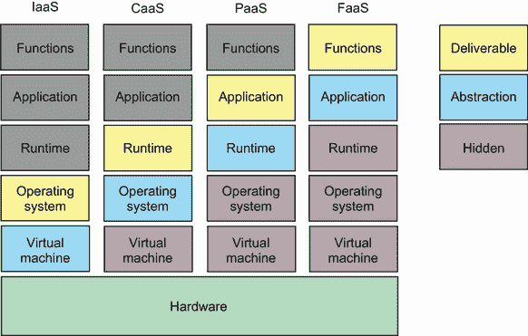

# 10 高级部署

本章涵盖

+   创建 Kubernetes 集群

+   在 Kubernetes 中部署 API

+   使用 Helm 部署数据库

+   配置你的 API 以使用数据库

“如果你看看这些图表，你会发现我们的新服务实际上帮助我们的服务吸引了更多的流量。我们的移动应用团队能够快速地使用为翻译服务采用的一些相同技术制作了一个应用程序。这个应用程序得到了广泛的应用，并且在所有应用商店中都有趋势。然而，由于翻译服务仍然作为一个按需服务运行，我们发现它比运行专用服务器更昂贵，所以我们只剩下两个选择：使用像 Kubernetes 这样的专用容器编排器，或者构建专用虚拟机来运行服务。”

所有人都在看 DevOps 领导展示的图表。有一些表示同意的点头，但最终 CTO 发言了。

“我认为整个点是要从专用服务转向‘无服务器’方法。这不会减少我们的市场交付吗？有没有替代方案？”

DevOps 领导推进了幻灯片并说：“我们有一个更长期的目标，即向 Kubernetes 这样的容器编排框架迈进。这是因为我们可能无法从处理相同级别或资源的更多应用程序的专用虚拟机中获得 100% 的利用率。我们正在与各个团队合作，开始为他们的产品实施容器创建，这样我们就可以在 Kubernetes 或 K8S 集群上托管所有这些。然而，我们中没有人之前使用过 Kubernetes，所以可能会有一个学习曲线。另一种选择是创建自定义镜像并将它们部署到虚拟机上。我们称之为*经典部署*过程。目前它容易出错，因为我们在这方面几乎没有流程。然而，我们从这一过程中学到了尽可能多的东西可以帮助提高整体生产力，所以我们将对我们的一些较旧服务采用‘基础设施即代码’，以帮助我们更清晰地维护基础设施。不幸的是，我们没有人有这方面的经验，而且我们很忙，所以我们可能需要依赖开发团队来开始这项工作。这样可以吗？”

你微笑点头。这些倡议和理念现在开始传播到其他团队，这表明公司整体上有了巨大的改进。为整个公司工作一个更健壮的部署流程可能看起来有点令人畏惧，但它将非常值得。

“为了不显得太时髦，我认为对这两者都进行一次研究是很值得的。你认为你能给我一些关于 Kubernetes 集群的工程量估计吗？如果我们能将整个公司引向那个方向，我认为从财务上对我们来说是有意义的，但我们需要确保它不会垄断开发者的时间。我们可以在稍后日期尝试基础设施即代码。”

## 10.1 并非完全的 IaaS

我们在部署进展中来到了一个十字路口。记住，我们在部署中处理各种抽象，并将它们用作服务。在之前的基础设施章节中，我们探讨了使用函数即服务（FaaS），其中一个小型、轻量级的按需应用程序仅在请求时运行。然后我们转向平台即服务（PaaS），我们只需提交我们的二进制文件，就会神奇地创建一个服务器。我们最后的部署使用了容器即服务（CaaS），其中容器被构建和运行，使我们能够接触到底层虚拟化环境，以便进行更多系统级别的集成。

在这一点上，如果你发现我们需要更少的抽象和更多的控制，我们可以选择两条不同的路径之一。一条是走完全的基础设施即服务（IaaS）路线，通过构建和运行我们的物理基础设施，使用虚拟机和负载均衡器将流量导向我们的应用程序。另一种方式是设置、运行和管理一个容器编排工具，如 Kubernetes。在本章中，我们选择后者，因为它因其多样化的开发工具集和开发者友好的接口而流行。附录 D 简要概述了那些可能想要走真正的 IaaS 路线的替代方案。相反，我们将处于图 10.1 所示的 IaaS 和 CaaS 栈的中间。



图 10.1 我们现在使用我们的容器作为我们的可运输产品。

Kubernetes 并非完全等同于基础设施即服务（IaaS）。它存在于容器即服务（CaaS）和 IaaS 领域之间。这是因为 Kubernetes 通过抽象处理了大部分底层基础设施。例如，节点扩展和负载均衡等功能都是由 Kubernetes 集群创建和维护的。作为开发者，你只需关注定义你想要的资源类型，并将它们提交给集群以运行。这种以抽象方式构建资源是 IaaS 的核心。像 Terraform 这样的工具用于维护和构建实际的基础设施，就像 Kubernetes 一样。

Kubernetes 与部署和服务一起工作，而不是服务器和负载均衡器。这些抽象允许 Kubernetes 根据服务器的负载在不同服务器实例之间移动工作负载。Kubernetes 减少了围绕你的应用程序的大量维护和管理工作，因为它处理诸如负载均衡、服务重启等任务。正因为如此，Kubernetes 已经成为许多从按需服务扩展到专用服务以实现最佳正常运行时间的团队的非常受欢迎的选择。

## 10.2 你的第一个集群

我们首先需要创建一个集群（见以下列表）。我们不会在本地安装 Kubernetes，而是将依靠 GCP 为我们创建一个。为此，我们将使用 GCP 工具。

列表 10.1 创建集群

```
gcloud container clusters create \
--zone=us-central1-a                                                        ❶
gcloud services enable \
 containerregistry.googleapis.com container.googleapis.com                  ❷
gcloud components install gke-gcloud-auth-plugin                            ❸
gcloud container clusters get-credentials hell-cluster --zone=us-central1-a ❹
```

❶ 在指定区域创建集群

❷ 为你的容器启用注册访问

❸ 安装身份验证插件

❹ 检索用于 kubectl 的集群凭据

注意：如果您不想在云中设置集群而感到麻烦，有许多本地工具可供选择，例如 Minikube 和 KinD。

您应该能够访问您的节点。就是这样。Google 使这变得非常简单。如果您希望使用其他云提供商，可能会有额外的步骤。现在您已经准备好部署。

要查看更靠近您居住地区的所有地区和区域列表，请访问 [`mng.bz/91Ro`](http://mng.bz/91Ro)。

## 10.3 构建块

您可以找到无数关于 Kubernetes 及其所有构建块的书、演讲和博客文章，所以在这里我不会深入讨论。我们需要关注两件事：部署和服务。*部署* 运行容器或容器组（Pod），这些容器可以扩展（副本集），这正是第七章中 GCP 的 Cloud Run 为我们做的事情。*服务* 创建一个端点，将调用定向到我们的部署。这本质上充当了一个负载均衡器，可以在多个服务器实例之间平均分配调用。

让我更详细地解释这两个核心元素。部署可以被视为 Kubernetes 两个较低实体定义的包装器。Pod 是容器组（Docker Whale 的游戏；一组鲸鱼是一个 Pod）。如果您想运行多个 Pod 实例，可以将它包装在一个 *副本集* 中，该副本集运行多个 Pod 实例。最后，部署将扩展、健康检查和调用 Pod 的定义包装起来。

服务充当您应用程序的路由器。它可以像将端口转发到底层应用程序一样简单，类似于浏览器在加载网站时进行的 DNS 查询，或者像具有特定路由规则的负载均衡器一样复杂，用于 A/B 测试或功能测试。

这两个定义缺少很多细节，但对于我们试图实现的目标来说已经足够了。然而，我鼓励您查看 Marko Luksa 的 *Kubernetes in Action*（Manning，2017）以获取更多详细信息。

让我们从创建我们的部署开始。首先，我们需要在您的根目录中创建一个名为 `k8s` 的新目录，并在其下创建一个名为 `hello-api` 的服务目录。在这里，我们将创建一个名为 `deployment.yml` 的新文件。在文件中，我们需要编写我们的部署定义。关键是让我们的容器运行一个实例。幸运的是，我们已经上传了一个容器镜像，我们可以使用它。以下列表中的代码显示了部署定义，它将是 `/k8s/hello-api/deployment.yml`。

列表 10.2 `deployment.yml`

```
apiVersion: apps/v1
kind: Deployment                     ❶
metadata:
  name: hello-api                    ❷
spec:
  replicas:                          ❸
  selector:
    matchLabels:
        app: hello-api
  template:
    metadata:
      labels:
        app: hello-api
    spec:
      containers:
      - name: hello-api
        imagePullPolicy: Always
        image: gcr.io/PROJECT_NAME/hello-api:latest
        ports:
        - containerPort: 8080        ❹
          name: hello-api-svc        ❺
```

❶ 我们正在创建的 Kubernetes 对象类型

❷ 部署的名称

❸ 要运行的 Pod 数量

❹ 此端口与容器监听的端口相匹配。

❺ 如何访问此应用程序

现在我们使用`kubectl`应用我们的部署。如果它尚未安装，你可以按照[`kubernetes.io/docs/tasks/tools/`](https://kubernetes.io/docs/tasks/tools/)上的说明进行安装。安装后，你只需运行`kubectl` `apply` `-f` `k8s`，该目录下的所有文件都将被应用。如果我们输入`kubectl` `get` `pods`，我们现在应该能看到我们的运行 API pod。

现在我们将在`/k8s/hello-api/service.yml`中设置服务。我们的服务非常简单，因为它只需要打开一个端口指向我们的部署，如下面的列表所示。

列表 10.3 `service.yml`

```
apiVersion: v1
kind: Service             ❶
metadata:
  name: hello-api
spec:
  selector:
    app: hello-api
  type: LoadBalancer      ❷
  ports:
  - port: 80
    protocol: TCP
    targetPort: 8080      ❸
```

❶ 服务类型将路由传入请求到部署。

❷ 负载均衡器将利用底层云基础设施将消息路由到你的部署。

❸ 映射到部署依赖的端口

现在我们可以调用`apply`来查看我们的服务是否出现。我们可以通过调用`kubectl` `describe` `service` `hello-api`提供的端点来测试它。

## 10.4 扩展和健康状态

任何系统中的关键服务都应该有一定的冗余。在软件中，你希望你的客户避免任何停机时间，并能够满足人们对你的系统提出的需求。这被称为*扩展*：系统可以通过在多个运行服务之间分配请求来增长以满足其需求。这样做可以减少系统耗尽内存或产生长时间响应的机会。有两种类型的扩展：垂直扩展和水平扩展。*垂直扩展*允许你向机器添加更多功率来处理增加的负载。*水平扩展*允许你创建额外的服务器实例来处理负载。在本节中，我们将关注对我们部署的水平扩展。

到目前为止，我们不必过多担心扩展问题，因为我们部署应用程序的系统已经处理了所有的扩展。如果你对我们的 FaaS、PaaS 或 CaaS 服务发起 100 万次请求，你会看到它们有多个运行实例来处理负载。同时，我们的 Kubernetes 部署在这个阶段无法扩展，因为我们还没有给它适当的设置来这样做。我们在这里将只关注手动扩展和健康检查，但像《Kubernetes in Action》这样的书籍可以展示其他方法。

同样，我们不希望出现中断时间，因此我们需要允许 Kubernetes 知道何时部署就绪，以便它可以关闭旧的部署。这被称为*滚动部署*。为此，我们将利用在第四章中添加的健康检查端点。在这里，我们将添加存活性（服务是否正在运行？）和就绪性（是否准备好接收请求？）检查。这两个检查都将让 Kubernetes 知道我们的 pod 已就绪。为此，我们需要通过添加以下列表中的代码来修改我们的部署文件。

列表 10.4 `deployment.yml`

```
apiVersion: apps/v1
kind: Deployment
metadata:
  name: hello-api
spec:
  replicas: 1
  selector:
    matchLabels:
        app: hello-api
  template:
    metadata:
      labels:
        app: hello-api
    spec:
      containers:
      - name: hello-api
        imagePullPolicy: Always
        image: gcr.io/PROJECT_NAME/hello-api:latest
        ports:
        - containerPort: 8080
          name: hello-api-svc
        livenessProbe:
          httpGet:
            path: /health       ❶
            port: 8080
          initialDelaySeconds: 3
          periodSeconds: 3
        readinessProbe:
          httpGet:
            path: /health
            port: 8080
          initialDelaySeconds: 3
          periodSeconds: 3
```

❶ 这个调用将每 3 秒检查一次是否返回 200 响应。

活性探测将检查容器是否已启动并运行，而就绪探测将开始将流量导向 Pod。在这种情况下，我们将使用健康端点。在这里，我们通过检查 HTTP 服务器是否响应来确定系统是否就绪。如果没有响应，Pod 将被关闭，并启动一个新的 Pod 来替代它。

在这种情况下，我们的活性探测和就绪探测是相同的。然而，这并不总是如此。比如说，如果你的 Pod 中运行了两个进程，一个 API 和一个缓存。缓存有时可以被*预热*或预加载数据。在这种情况下，活性探测将是健康的，但 Pod 只有在缓存预热后才能准备好接受消息。想象一下，这是启动你的车与将其挂入档位之间的区别。如果任何一个检查耗时超过预期，Pod 将被删除，并创建一个新的 Pod 来重新启动进程。

在设置了活性和就绪探测之后，我们现在可以通过添加副本来扩展服务。为此，我们只需编辑一行，如下所示。

列表 10.5 `deployment.yml`

```
apiVersion: apps/v1
kind: Deployment
metadata:
  name: hello-api
spec:
  replicas: 3       ❶
  selector:
    matchLabels:
        app: hello-api
  template:
    metadata:
      labels:
        app: hello-api
    spec:
      containers:
      - name: hello-api
        imagePullPolicy: Always
        image: gcr.io/PROJECT_NAME/hello-api:latest
        ports:
...
```

❶ 将实例数量增加到 3

这将为该服务创建三个独立的 Pod。提交这些更改。我们将在创建自动部署后看到这一切是如何工作的。但到目前为止，Kubernetes 通过几行代码就给了我们添加和删除高级部署实践的控制权。在过去，这种配置难以维护和监控，因为你需要处理物理机器、负载均衡器和监控工具。相反，Kubernetes 为你提供了所有这些，以便你可以开始部署。因为一切都是代码，所以我们更新部署变得更加容易。

## 10.5 自动部署

在过去，我们在合并到主分支时部署我们的代码。这使我们的客户每次合并拉取请求时都能获得我们开发的最新成果。然而，在第八章中，我们介绍了标签的概念，它允许我们标记一个部署为稳定。有了这种稳定性，我们可以轻松跟踪已经部署的代码以及我们可以针对未来版本的目标修复和功能。一旦这种节奏建立起来，我们就可以轻松估计向客户交付新版本所需的时间。

所有这些都是为了说明标记你的产品和代码库非常重要。这也很好地与我们的容器化发布相结合，因为容器也使用发布标签。我们的部署代码有一个指向 `latest` 标签的引用，这可以松散地翻译为“我不在乎是什么版本；我想要最新的。”我们感觉我们已经超过了这一点（这可能是一个开发环境的好设置！）现在我们想要标记，因此我们应该创建一个容器构建过程，当我们的代码被标记时，它会推送一个新的标记版本。我们将使用在第八章中讨论的相同的标记策略，但这也将基于你团队的决定。让我们修改我们的代码来实现这一点，如下所示。

列表 10.6 `pipeline`

```
containerize-buildpack:
    name: Build Container buildpack
    runs-on: ubuntu-latest #
    needs: smoke-test 
    if: github.event_name == 'push' && contains(github.ref, 'refs/tags/')
    steps:
  ...
```

让我们试试看：

```
git tag v0.0.1
git push origin v0.0.1
```

你应该会看到一个新容器被标记并推送到 GCP。现在我们能够标记我们的容器，我们需要有一个更新部署的过程。在管理这类部署时，有两种思考规则：自动化或事后。在自动化世界中，你创建一个过程，每当 K8s 目录中的文件发生变化时，就会运行 `apply`。这意味着你更改了代码，而管道会跟踪集群凭据和状态。这是一个很好的地方，但直到那些过程被明确定义并且高效运行，许多人会事后将已应用的变化更新到仓库中。这通常是通过提交一个包含更改的 PR 并等待批准来完成的。一旦批准，你应用代码然后合并。

我们现在已经在 Kubernetes 上建立了一个 CD 流程。我们并没有运行我们的生产级系统。为了做到这一点，我们需要数据库和配置。

## 10.6 使用 Helm 部署 Redis

许多像 Kubernetes 这样的平台，使用基础设施即代码，允许额外的工具和抽象来扩展它或在其之上构建。在这种情况下，Kubernetes 与一个名为 Helm 的工具配合得很好。Helm 就像是一个包管理器，但用于你的 Kubernetes 集群。它将使用一个称为 Helm 图表的类似部署机制来部署应用程序。Helm 图表主要用于生产中的开箱即用功能，但可以根据你的需求进行调整。

在这个例子中，我们将使用 Helm 为我们的集群部署 Redis，但首先我们需要安装 Helm。为此，请遵循[`helm.sh/docs/intro/install/`](https://helm.sh/docs/intro/install/)中的说明。

我希望你在想我们这个部分的 Makefile 在哪里。我们现在需要它来帮助我们管理部署。首先，我们将创建 Helm 部署，然后是部署我们的应用程序的步骤。Helm 允许我们在应用图表时通过传递特定的设置来配置我们的部署。这些设置通常是像扩展或安全值这样的东西。在我们的例子中，我们希望我们的 Redis 数据库通过使用密码来保证安全。为此，我们编辑我们的 Makefile，以便我们可以有一个带有一些配置的部署命令（见以下列表）。

列表 10.7 Makefile

```
install-redis:
  helm repo add bitnami https://charts.bitnami.com/bitnami       ❶
  helm install redis-cluster bitnami/redis --set password=$$(
  ➥ tr -dc A-Za-z0-9 </dev/urandom | head -c 13 ; echo '')      ❷

deploy:
  kubectl apply -f k8s
```

❶ 使用专门的 Kubernetes Redis 部署

❷ 生成一个随机密码使用

运行 `make install-k8s-redis`，我们应该能够看到新的 pod 上线。数据库现在正在运行，因此我们可以配置我们的系统以针对它运行。为此，我们需要创建一个配置映射。

## 10.7 更新部署配置

在第八章中，我们讨论了通过配置使我们的应用程序改变其功能的工作。现在我们可以使用 Kubernetes 的相同机制。由于 Kubernetes 集群不是由单个机器组成的，我们无法简单地在每个系统上设置环境变量，也无法将配置文件添加到单个服务器上。

相反，Kubernetes 将其视为一种资源，就像部署或服务一样。我们可以创建和引用一个 *配置映射*，它定义了一组类似使用的配置值，将我们的环境变量与消费容器解耦。这意味着我们将有一个配置映射供我们的服务消费。由于我们现在处于生产状态，我们还应该考虑通过使用称为 *密钥* 的特殊配置类型来更新我们的 Redis 服务器。首先，让我们制作我们的映射。

配置映射就像 Kubernetes 中的任何其他资源一样，我们可以通过文件来创建它们。让我们在 `k8s/hello-api` 目录下创建一个新的 `config.yml` 文件。在其中，我们将添加以下列表中的代码。

列表 10.8 `config.yml`

```
apiVersion: v1
kind: ConfigMap
metadata:
  name: hello-api
data:
  database_url: "redis-cluster"     ❶
```

❶ 在配置映射中设置环境变量

通过输入 `kubectl apply -f k8s/hello-api/config.yml` 来应用它，你应该会看到一个通知，表明已创建了一个新资源。

在我们将配置附加到我们的服务之前，我们还应该为我们的 Redis 服务器创建一个密钥。与配置映射不同，你不希望因为安全风险而将它们作为文件存储在我们的系统上，也不希望使它们在我们的集群中容易可见。

注意：虽然 Kubernetes 有一个称为“密钥”的特殊字段，但这并不意味着它是加密或安全的，只是意味着它对最终用户是隐藏的。一个健壮的生产系统应该考虑使用 Vault 这样的密钥管理器。

机密通常用于像用户名和密码这样的东西。它们不需要像您需要记住的电子邮件或银行登录信息一样。相反，正如我们之前看到的，我们可以提供一个随机字符串作为密码，Kubernetes 将为我们管理它。当我们创建我们的 Redis 部署时，提供了一个密码。我们不需要它；我们可以像配置映射一样引用它。为了将这些值放入我们的部署中，我们需要设置一些环境变量。让我们打开它，并在下面的列表中添加代码。

列表 10.9 `deployment.yml`

```
apiVersion: apps/v1
kind: Deployment
metadata:
  name: hello-api
spec:
  replicas: 1
  selector:
    matchLabels:
        app: hello-api
  template:
    metadata:
      name: hello-api
      labels:
        app: hello-api
    spec:
      containers:
      - name: hello-api
        imagePullPolicy: Never
        image: holmes89/hello-api:v0.3
        ports:
        - containerPort: 8080
          name: hello-api-svc
        env:
        - name: DATABASE_URL         ❶
          valueFrom:
            configMapKeyRef:
              name: hello-api
              key: database_url
        - name: DATABASE_PASSWORD    ❷
          valueFrom:
            secretKeyRef:
              name: redis-cluster
              key: redis-password
              optional: false
```

❶ 从配置映射设置 DB URL

❷ 从 Helm 机密设置密码

这些值应该与我们本地运行应用程序配置时拥有的值匹配。配置值在容器启动时被加载。为了现在看到这个工作，我们可以简单地使用`kubectl apply` `-f` `k8s`重新应用我们的部署。一旦它运行起来，我们可以通过尝试用不同的语言进行查询来查询数据库以验证结果：

```
curl <url>:80/translate/hello?language=arabic
```

希望您看到的是正确的翻译！

现在是星期五，距离您开始这个整个项目已经两周，距离 Kubernetes 启动会议不到一天。您坐下来，给团队发了一封快速电子邮件，告诉他们您的状态，并在设计文档中草拟了您的发现，以帮助团队前进。微笑着，您反思了公司走了多远。您在保持标准的同时帮助创造了一种实验文化，并简化了开发过程。每个人都看起来很满意，但您知道这不会完美。事情需要改变，需要开发新的应用程序，并且希望您能够提供帮助。

## 摘要

+   Kubernetes 集群抽象化了由您的团队管理的多个服务器上的部署。

+   部署创建了一组称为 pods 的容器组，可以根据需求或所需的可用性进行扩展。

+   服务将调用路由到部署。

+   机密和配置文件可以用来填充应用程序配置的环境变量。
