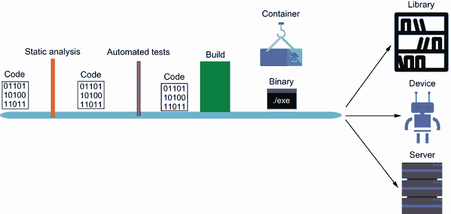
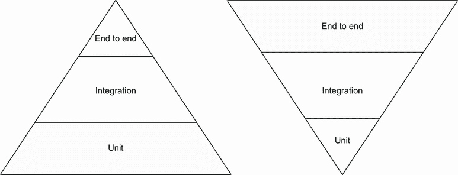
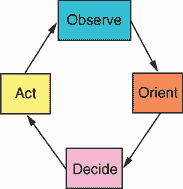

# 11 循环

本章涵盖

+   概述创业和项目的阶段

+   通过扩展核心改进区域

“我真心没想到我们能完成这件事。我们过去几周所能够改变的事情真是令人惊叹，”项目经理面带微笑地说。“我们将把所有项目都转移到这种开发风格。如果我们幸运的话，我们可以开始尝试一些小项目和更快的发布周期。现在更新软件的成本要低得多。我们还通过将小型应用程序作为函数部署，然后迁移到我们的 Kubernetes 集群来降低了我们的服务器成本。”

你也不禁微笑起来。项目经理还没有看到这种模式的未来收益。当自动化进入纺织制造时，它将 100%的手动工作转变为 2%的手动工作。长期影响是纺织制造业的更多工作机会和更多日常消费者产品。通过自动化 98%的工作流程，您的公司现在能够生产更多产品和工具来帮助公司增长。

这个故事有趣的地方在于它不会有结局。你可能最终会再次开发一个新产品。你可能晋升为管理一个开发团队。你可能最终离开公司去另一家公司或自己创业。重要的是它重新开始。最后一章被称为“循环”，因为如果你记得第一章，你需要在交付后返回并设计。这种情况也适用于系统和流程。每次新项目开始时，你应该考虑上次有哪些可以改进的地方，或者你想要探索的其他想法。随着本书的结束，我们将回顾本书分解的每个阶段或部分（启动、加速、巡航）以及该阶段中的每个元素（流程、测试、交付），并决定未来要寻找什么。

## 11.1 启动

显然，任何项目的目标都是尽早交付并在预算内完成。这并不总是发生，但在创建新产品或概念验证时，任何事情都是可能的。我们想要建立一些流程和质量检查，而不必过于担心扩展。

正因如此，我们在本书的第一部分重点介绍了开发设置、单元测试和无服务器函数。让开发者参与进来将是最重要的任务。这就像组织一个工地。如果你对事物的位置和去向有一个清晰的概述，你将花费更少的时间给出指示，并将更多精力集中在开发本身上。至于事物的位置，我们建立了一个中央存储库和代码在我们组织中流转的机制。这自动化了我们团队需要做的一些工作，并让他们有更多时间专注于代码。在早期建立这一点是至关重要的，因为它让开发者有更多时间做其他工作。然而，你应该考虑在自动化之前，这项任务需要多久做一次。如果你发现自己一周内不止一次停下来做同样的任务，考虑自动化它。

你的软件会随着时间的推移而改变，但不会像开发初期那样变化。这就是为什么验证核心功能的基础测试是一项值得投资的工作，而不是一开始就进行端到端覆盖。虽然有些人可能会嘲笑在项目早期积累技术债务，但我认为如果项目转向或关闭，这将被视为浪费时间。关键是识别项目何时会持续进行，何时应该改进测试。一个好的规则是考虑你早期发现错误的地方。如果你发现错误或浪费了时间，也许你应该考虑添加测试。一旦你越过了这个界限，就应该考虑一个更大的代码清理计划。这可以是一次代码清理闪电战：每个人都负责一段代码，并添加测试和文档。

部署应该既便宜又简单，这就是为什么我们最初选择了 FaaS 和 PaaS。FaaS 完全能够运行你的整个初创企业。你可能发现，由于它们的扩展能力和你的组织结构，你永远不需要从 FaaS 切换。但迟早，你可能发现切换到另一种部署类型会更便宜。或者你可能发现函数的扩展方式并不符合你的期望。在两种情况下，你都需要密切关注这些函数的使用情况和指标。所有主要的云托管平台都提供这种洞察力，并允许你设置警报。考虑讨论你想要设置哪些警报，并在必要时制定迁移计划。你会在周六深夜进行消防演习之前，很高兴你考虑了这一点并提前制定了计划。

应用程序开发的启动阶段相当于开拓者。你可能会发现自己走错了方向。你可能会发现自己正在正确的方向上前进，但走得还不够远。你可能会发现自己甚至不应该在这个区域。在所有这些情况下，现在就打下根基是没有意义的。像帐篷这样的临时设施就足够了，所以这个阶段可以看作是帐篷阶段。你需要保持移动性和临时性，而不是固定下来。一旦你感受到缺乏耐久性的痛苦，就考虑进入下一个阶段。

## 11.2 加速

一旦你确定你的产品将长期存在，下一个开发阶段就开始了。这是加速阶段：你开始快速构建。你已经完成了开拓，找到了一个很好的基地。你不仅需要快速成长，而且要向正确的方向发展。这就是为什么我们专注于在启动阶段构建的基础上进行扩展。现在我们在帐篷上搭建墙壁和屋顶，并考虑城镇将如何发展。

在这个阶段，我们更注重标准化和文档化。在建造房屋或办公室时，会使用某些承包商标准。板材以英尺或米为单位测量。螺丝有特定的头部类型。混凝土需要特定的比例才能正确凝固。我们在我们的代码审查和审查程序中也做了同样的事情。我们还希望建立更好的文档，以概述我们的代码在哪里以及如何使用。这是我们系统的蓝图和图示。

我们还专注于将我们的应用程序构建成模块化。当你仍然需要在受限的空间内保持灵活性时，你最不需要的就是一个庞大且僵硬的项目来操作。拥有一个模块化系统可以让你更容易地适应空间。考虑一下在客厅里移动沙发和三把椅子之间的区别。哪个更容易？同样，我们通过使用接口注入某些依赖项并使用模拟和存根测试来测试我们的代码，从而构建了我们的代码。这样，每个模块化部分都是独立测试的，这意味着除非该模块的功能发生变化，否则我们不需要重写我们的测试。

然后，我们将这段新代码放入了一个便携式运行时环境中，使用了容器。首先，使用了 Buildpacks 来为 Google 的容器运行时构建优化的容器。然后，我们为开发用例创建了我们的容器。能够这样分发我们的代码，展示了团队可能需要如何在不同应用程序边界之间进行交互和共享。能够以这种方式运行和记录依赖项，可以在未来减轻集成问题。同时，考虑一下这可能会对你测试应用程序的能力产生什么影响。质量保证部门或团队可以创建临时部署来运行自动化测试脚本，而不会影响你的生产部署。

加速被用来描述这个阶段，因为重要的是不要停止。你已经找到了建设的地方，现在你需要扩展。物体需要达到一定的速度才能摆脱引力的拉扯。这只有在继续加速的情况下才能实现。这是一个累积的力量，而不仅仅是静态的。随着你加速，你获得越来越多的速度，但到达那个边缘变得越来越困难，直到最终，你摆脱了它。

## 11.3 巡航

一旦你摆脱了引力的拉扯，你就不再需要加速。相反，你可以巡航和探索。这并不意味着你已经完成。你已经成功了。你已经到达了一个可以自由改进和探索的阶段。需要校正课程，错误仍然会发生。

当我们到达这个阶段时，我们能够专注于使我们的应用程序灵活且稳定。我们可以根据我们放入的变量来改变应用程序的运行方式。这种功能可以扩展到超越添加数据库连接的默认值或端点。相反，你可以用它来隐藏尚未完成的功能。甚至有方法可以远程管理这些设置，这意味着你只需在数字仪表板上切换一个开关，你的应用程序就会突然以不同的方式运行。

管理这种灵活性是使你的公司成功的关键。在摆脱创业的引力之后，你现在可以探索你业务的广阔领域。这成为你成功的关键部分。在《精益创业》（Currency，2011）一书中，埃里克·雷泽谈到了在创业公司中保持灵活性的必要性，以找到客户想要的东西，并且只做那件事。这是我们贯穿整本书的指导原则：保持简单并不断变化。这有助于我们创建必要的底层工具，以便快速高效地交付，同时继续改进。一旦我们开始顺利航行，我们就可以开始构建围绕我们如何开发功能的过程。我们可以使用在第九章中学到的行为驱动开发技能来引导和聚焦我们的开发。然后我们可以开始考虑其他形式的测试，例如*探索性测试*，其中团队通过生成大量负载或将特殊字符放入输入字段来尝试破坏我们的系统。这可以通过用户模拟测试框架如 Selenium 或 Cypress 进行自动化。

希望这一切都能让你意识到你需要调整你的基础设施。当你有人来找你说你的云费用太高，并询问你能否做些什么时，你就知道你已经到了这个阶段。这很可能会在其他任何事情之前发生。这是因为你正在为 AWS 或 Google 为你运行应用程序的抽象付费。这是一个便利费。一旦到了这个阶段，你需要专注于基础设施；只有在这种情况下，查看像 Kubernetes 这样的酷工具才有意义。这不是一个铁的规则，但专注于简单而不是复杂。如果你没有支持像 Kubernetes 这样的基础设施的团队，你不必担心。专注于开发一个你可以展示的产品，然后担心如何优化它的运行方式和地点。

我从经验中说这些。我在创业公司工作了大约十年，看到了团队如何成长以及错误发生在哪里。过于频繁地，开发人员和经理们想要抓住一个新而闪亮的技术或工具来完成工作，而他们并不需要这样做。我的一个前经理曾经说过：“人们总是想要抓住一个新工具，但他们不知道如何使用它。那些旧而破烂的工具之所以旧而破烂，是因为它们有用。”这并不是说你不应该关注新而闪亮的东西。事实上，你需要将它们融入其中以保持增长和跟上步伐，以及保持你的开发人员参与其中。技能在于确定使用哪些工具以及如何使用它们。作为一个团队，在开始这条道路之前，你应该讨论、计划和进行研究，并考虑支持你为未来所做的一切。

这里有一个例子，展示了我在最近过去浪费在闪亮事物上的时间。我正在开发一个与我之前构建的应用程序非常相似的应用程序。一条消息传来，包含了一些指标数据，我需要将其标准化以便在各个仪表板上显示。我决定我想让这个系统完全基于事件，并且在整个服务中的所有通信都将异步进行，所以我围绕一个我已经关注了一年多的工具构建了一个复杂的系统。我对我所构建的东西感到兴奋和满意——直到我不满意了。很快我就意识到，我所构建的东西比所需的更复杂，虽然它可以扩展，但它不需要以我预期的那种方式扩展。然后我意识到，我使用的库在开发两周后就被弃用了，突然之间，重构我所写代码的时间表提前了。

教训是我为自己建造了一些闪亮的新东西，而不是为顾客。我过度设计和开发，然后不得不面对重建我所建造的东西的后果。这源于我自身的缺乏规划和纪律。重要的是要找到一种方法，确保未来不会发生这种情况。我为了防止这类问题再次发生，想出了什么缓解策略？我开始编写设计文档，并将它们放在我的代码库中的一个文件夹里，这样人们可以在工作完成之前审查设计，并在查看系统是如何构建的时参考它们。这些被称为 RFC，它们在允许团队在开发之前思考和讨论设计方面非常有帮助。

这些只是你在项目或产品通过各个阶段成长过程中可能会遇到的一些事情。现在让我们来看看每个阶段的各种元素，并讨论如何超越我们在流程、测试和交付中涵盖的内容。

## 11.4 开发元素

当我们开始写这本书时，我提到我所展示的不是新的——至少对行业来说不是新的。希望我能提供一本手册，帮助你和你的事业起步。软件开发直到我开始阅读软件开发与制造业之间的比较才变得有意义。

我可以想象我的初创公司里的各种同事都在扮演不同的角色。戴着安全帽和制服，我看到我的经理在叉车上指导一位开发者，同时我的项目经理在各个站点之间移动文件夹，处理各种订单。与此同时，一位质量保证团队成员正在他们的记事本上检查方框，记录下最微小的瑕疵。最后，我们的运维团队过来，把它装上卡车，然后把它从大楼里运出去。

那正是团队被划分的方式，工作也是这样通过我们的系统流动的。我们花了大量的工作来弄清楚如何一起工作，建立良好的关系，并建立信任。在我们被收购的前几个月，我制定了一个计划来展示如何简化这项工作。结果是创建了一个类似于本书的管道，通过几点击鼠标就能自动化将想法变成现实的过程。

当我研究这个想法时，我发现一些优秀的书籍描述了 CI/CD 管道、测试方法和代码标准化实践，但没有将它们与示例结合起来。当我查看这些书籍时，我将它们组织成了流程、测试和交付。

### 11.4.1 流程

在团队中工作很困难，无论你的团队成员是你的最好朋友还是完全陌生的人。每个人做事的方式都不同，你必须找出如何相处并一起完成任务。浪费可以导致团队中的问题。当你用不完整的功能、马虎的代码或明显的错误浪费某人的时间时，它可以从令人烦恼迅速升级到不尊重。一旦对同事的不尊重根深蒂固，团队就很难融合和协作。

流程可以节省时间。通过建立标准和实践，你可以通过节省人们的时间和互动来减少产生的浪费。如果一个程序能告诉你你的代码看起来很糟糕，这就节省了其他人告诉你这个信息的努力，你将获得快速、简洁的反馈。然而，这些简单但有效的工具往往被忽视。我们在一开始创建的简单管道建立了我们的流程，并在整本书中不断添加内容。建立验证、测试和自动部署的流程可以减少在交接和进入生产过程中浪费的时间。这个管道在图 11.1 中展示。

图 11.1 我们将代码通过管道的流程

你还应该对你的流程有一个流程。虽然这看起来是循环的，但这是有帮助的。定期评估你是如何构建和交付你的产品的，这将帮助你改进。这被称为*持续改进*（与我们在早期所做的持续集成不同）。丰田意识到，当他们能够提高生产力时，他们的员工并没有达到最佳状态，这意味着他们可以完成额外的工作，因为他们的工作变得简单了，所以丰田要求他们的员工利用这些额外的时间来改进他们的流程：看看他们在哪里效率低下或不足。这不是通过选择一些你认为需要改进的任意领域来完成的。员工和管理者需要在改进成为流程的一部分之前获得指标、评估和设计。

这对你的团队意味着什么？确保你和你的团队成员都处于最佳状态，并且你给自己留出一些时间来寻找改进的领域。围绕交付时间、构建时间和响应时间建立指标都可以用来改进你的应用程序和流程。想想你希望如何使用测试以及你的管道是如何工作的。你的开发环境的人体工程学如何？它是否难以设置，或者是否需要其他人来让它工作？如果你不按照特定方式运行事情，你的电脑会崩溃吗？以另一种方式开发是否合理？

总是思考如何改进你的软件以及你开发软件的方式。实现这一目标的一种方式是通过有针对性的和适当的测试。

### 11.4.2 测试

在初创公司中进行测试是一件非常棘手的事情。你的代码变化如此频繁，以至于测试有时会阻碍你的开发工作。你把所有的时间都花在为一周内就会改变的代码片段编写测试上。当你知道这些代码可能瞬间就会消失时，你为什么还要花时间去测试呢？

让我问你这个问题：你怎么知道某个特定的代码片段会保留还是被移除？你不知道。虽然我经常不得不删除或重写我的测试，但我清楚地记得有些项目我们没有进行任何测试，最终为此付出了代价。我们很快在生产中遇到了如此多的错误，如果一开始就编写测试代码，这些时间会更好利用。

你应该怎么做？难道你真的要等到痛苦不堪的时候才去写测试吗？绝对不是！这样做会降低你的生产力，并增加你的整体开发周期。为了解决这个问题，我们需要在整个过程中考虑测试，而不仅仅是在某个特定的阶段。本书的整体趋势是从简单到复杂。同样，你的测试也应该通过以不同方式检查代码的不同部分而变得更加复杂和健壮。这为你和你的团队节省了时间。

但是你应该测试多少，测试什么？答案是，从基本的单元测试开始，围绕确定性代码部分进行。这些是你的典型的算法函数，它们计算余额或错误率。你给它一组数据，每次都会得到相同的答案。这是通过使用我们在第四章和第七章中讨论的基本单元测试和模拟技术来完成的。第十章探讨了针对更大服务的集成级别测试。我们没有达到全系统、端到端、UI 到 API 级别的测试。所有这些都应反映在我们的测试金字塔（图 11.2）中。

图 11.2 测试金字塔侧重于建立单元测试的基础。

通过从较小的任务块开始并逐步构建，我们为测试建立了一个坚实的基础。如果你要做什么，那就做自动化单元测试。这些是评估你产品质量的基础。在所有情况下，尽可能将质量检查与代码保持接近，特别是对于单元测试。如果你发现你的单元测试正在中断或阻碍，你需要重新考虑你的测试流程。编写好的单元测试既是一门艺术，也是一门科学。你需要确定测试什么，不测试什么。正如第四章中提到的，测试驱动开发（TDD）在帮助我们精简测试到核心元素方面非常有帮助。

你可能会发现你的测试方法很好，但你总是在不断改变它们。这是在其他地方过度劳累的迹象。你是否掌握了你正在编写的代码？其他人是否在编写高质量的测试？你是否得到了正确的要求？项目是否定义得清楚？如果这些问题的任何一个答案是“否”，你应该召开一个团队会议。

测试不仅揭示了代码中的错误，还帮助你发现过程中的错误。例如，我为几家拥有非常复杂的测试设置的公司的测试工作提供过帮助。整个测试数据库需要加载，某些软件需要安装或运行，还需要运行脚本以设置测试环境。虽然这些本身并不可怕，但它们导致团队成员感到沮丧，因为他们挣扎于设置而不是编写测试。当你发现团队成员因为本地开发环境而不愿意编写测试或本地测试时，你就在过程中发现了错误。

所有这些自动化测试的最终目标，是任何自动化目标的：让其他人有更多的时间去做更有创造性的工作。如果你能在所有层面上构建自动化测试套件，你的团队将开始能够探索这些改进领域：

+   不同功能或系统的性能

+   产品的可用性

+   罕见或极端的边缘情况（在客户识别它们之前）

+   用户工作流程改进

还有许多其他改进领域。重点是测试是创建反馈循环的必要部分，这将只会帮助你的公司成长。唯一找出它是否按预期工作的方法是将它发布给公众。

### 11.4.3 交付

交付您产品的选项比沙丘移动得还要快。不久前，公司还安装自己的服务器和硬件。然后，随着所有这些虚拟化服务器的出现，一切都转向了云。当时，云计算的选项很少，但现在有很多，而且每个月都有更多出现。就像电力一样，计算正在变成任何拥有电脑和信用卡的人都可以使用的公用事业。由于云计算技术的广泛扩展，已经构建了工具来构建在这个庞大的计算公用事业系统之上。像 Kubernetes 和无服务器框架这样的平台都是在抽象计算资源的环境中运行的（见图 11.3）。

图 11.3 我们专注于各种*aaS 产品，但随着时间的推移，可能会有其他抽象计算资源。

但我们无法期望变化会停止在这里。虽然其他流程和测试的概念随着时间的推移将有所小幅度改进和变化，但一般原则将保持不变。你交付产品的方式在未来将发生重大变化。我们已经在看到趋势，将计算资源转移到最初用于缓存网页的 CDN 网络上，现在它们可以在网络的“边缘”运行轻量级 API 和计算。

所有这些都是在说，在几年后，第四章、第七章和第十章可能会提到云世界中过时的技术。事实上，我保证它们会。但这并不意味着这本书会过时。像其他概念一样，一些核心部分是必不可少的。首先，你的管道完全属于交付领域。我们以讨论自动化交付及其重要性开始这本书。我们还讨论了交付根据技术可能意味着多件事情的事实。我们专注于云技术，因为它们是一个简单的开始方式。但交付可以通过在物联网设备上推送软件更新或仅提供供人们安装的可下载的二进制文件或包来实现。你的管道应该能够接收你编写的代码并交付一个工件，简单明了。

云产品的交付将发生变化，但那些规则也将保持不变：从最简单、最便宜的开始，直到你更多地了解你的产品是如何被使用的。在新闻业，他们告诉你遵循调查的五 W 原则来深入挖掘故事，这些原则在这里同样适用：

+   *谁*会使用你的产品？

+   *他们在你的产品上做什么？

+   *在哪里*人们在使用产品？

+   *何时*人们最常使用它？

+   *为什么*人们使用你的产品？

所有这些项目对于交付客户需要和想要的东西都是必不可少的。从那个角度来看，这些问题几乎显得重复，对吧？当你交付你的产品时，你需要找到调查这些领域的方法。例如，如果你发现大多数用户都在欧洲而不是美国，你应该考虑在欧洲的一个云区域部署，直到你可以扩展到多个部署区域。只有通过指标，你才能发现这些事情。

这是我无法在书中涵盖的核心部分，但它至关重要。指标收集帮助你确定如何发展你的产品。它回答了调查问题，并帮助你向雇主和团队证明未来工作的合理性。向前看，将取决于你如何随着时间的推移发展你的交付和产品。

## 11.5 OODA 循环

在 20 世纪 60 年代初，约翰·博伊德上校开发了一种名为 OODA 循环的军事战略：

+   *观察*—收集数据。

+   *定位*—分析数据。

+   *决策*—根据对数据的分析确定行动方案。

+   *行动*—根据决定采取行动。

这个过程会重复，把你带回观察阶段（图 11.4）。

图 11.4 OODA 循环

我希望你能看到与我们在这本书中能够实现的事情之间的相似之处。项目经理观察到了旧系统的成本和维护。在用数据定位自己后，他们决定应该以更低的成本构建一个新的服务。然后他们通过启动这个项目采取了行动。

然后它又循环了！

你*观察*了旧系统是如何构建的。在当前开发过程中定位后，你能够决定最低成本的方法是编写一个简单的 API，通过 FaaS 以低成本和维护。你*行动*通过创建一个 CI（持续集成）流程来交付这个简单的功能。

它又循环了！

你观察到你的 FaaS（函数即服务）是一个成功的概念验证。分析确定这个过程无法扩展到其他团队。你决定增加测试并创建一个可移植的应用程序供其他团队使用。

然后它又循环了！

由于你的容器化产品的成功，管理层观察到其他人也应该这样做。为了做到这一点，我们需要提高流程和测试的水平，并需要创建一个容器化部署环境。我们决定将配置管理和集成测试添加到我们的流程中，并创建一个 Kubernetes 集群。

并且循环将继续！

当你将产品开发视为一个循环而不是一条长线时，你会发现你的开发心态发生了变化。就像一个循环一样，产品不会结束。相反，它们会进化。是的，就像所有进化一样，你会有一些产品灭绝，但进化充满了胜利者和失败者；这就是它的方式。不能适应的人会死去。相反，专注于你的产品如何通过观察、定位、决策和行动来适应。

## 11.6 结论

我最近和我的前经理共进午餐。我们讨论了他的角色以及事情是如何变化的。“我现在不能再做很多开发了，而且没有工程师直接向我汇报，所以我看不到很多代码。但我似乎无法摆脱我们的管道。我一直在检查并试图改进它。我不确定为什么我无法放手。”

这对我来说是有意义的。他现在到了一个点，代码的细节不再重要。重要的是交付，然后将其运送给客户。他不需要知道测试是如何编写的，或者产品是用什么语言编写的。他只需要看到已经建立了一定的标准，并且正在使用一个流程。除此之外，他需要信任团队的其他成员完成他们的工作。

到目前为止的旅程与我的职业生涯以及许多其他人的职业生涯相并行。我在本书开头说过，这些页面中没有新内容，希望你能识别出这里列出的一些模式或流程。项目的成功超出了开发人员或公司的控制范围。你能做的唯一一件事就是确保你交付。交付一个能够快速适应市场和客户需求的高质量产品在你的控制范围内。你所需要做的就是构建交付的工具，围绕它们组建一个团队，并探索。

## 摘要

+   产品是一个旅程，而不是一个目的地。

+   管道有助于在团队内部管理流程，而不需要微观管理。

+   变化是不可避免的，因此你需要找到一种方法来在变化中找到自己的方向。
